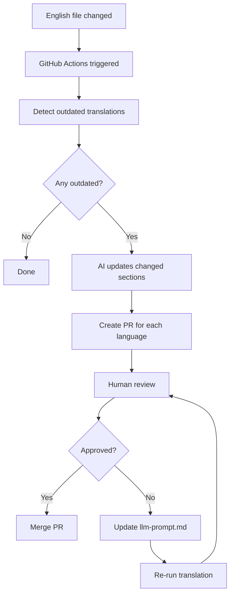
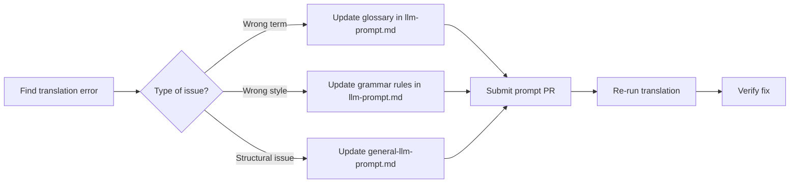

# Translation Guide

This document describes how translations work for the Nextflow training materials.

> **Important**: All translations are generated and maintained by AI (LLM).
> Do not submit manual translations - they will be overwritten by automated updates.
> Instead, improve the translation prompts to fix issues permanently.

## Quick Reference

| Task                       | Command                                                         |
| -------------------------- | --------------------------------------------------------------- |
| Preview translations       | `uv run python docs.py serve <lang>`                            |
| List outdated translations | `uv run python translate.py list-outdated <lang>`               |
| List missing translations  | `uv run python translate.py list-missing <lang>`                |
| Update a single file       | `uv run python translate.py translate-page -l <lang> -p <path>` |
| Update all outdated        | `uv run python translate.py update-outdated -l <lang>`          |

---

## How Automatic Translation Updates Work

When English source files are modified, translations are automatically updated via GitHub Actions:



### Key Points

- The AI makes **minimal changes**, updating only sections that changed in English
- Translations preserve line-by-line structure for easy diff review
- Each language gets a separate PR for independent review/merge
- The system uses git commit timestamps to detect outdated files

---

## Reviewing Translation PRs

When reviewing a translation PR (whether automatic or manual trigger), follow these guidelines:

### What to Check

1. **Technical accuracy**

   - Are Nextflow concepts correctly explained?
   - Are code examples unchanged (only comments translated)?
   - Are technical terms used consistently with the glossary?

2. **Formatting preservation**

   - Are code blocks intact and properly formatted?
   - Are admonitions (note, tip, warning) correctly structured?
   - Are heading anchors preserved (`{ #anchor-name }`)?
   - Are links working (URLs unchanged, only link text translated)?

3. **Language quality**
   - Is the tone appropriate (formal/informal per language)?
   - Are translations natural and readable?
   - Are there any obvious errors or awkward phrasings?

### How to Handle Issues

> **Critical**: Do NOT suggest changes directly to translation PRs.
> Direct edits will be overwritten on the next automatic update.

Instead, fix issues permanently by updating the translation prompts:



#### Example: Fixing a Wrong Term

If "workflow" is incorrectly translated as "flujo" instead of "flujo de trabajo" in Spanish:

1. Open `docs/es/llm-prompt.md`
2. Add or update the glossary entry:
   ```markdown
   | workflow | flujo de trabajo (NOT "flujo") |
   ```
3. Submit a PR with this change
4. Re-run the translation for affected files

#### Example: Fixing a Style Issue

If translations are too formal when they should be informal:

1. Open `docs/<lang>/llm-prompt.md`
2. Update the grammar preferences section
3. Submit a PR and re-run translations

### Approving PRs

Once you've verified the translation quality:

1. Check that CI passes (build succeeds)
2. Approve the PR
3. Merge (squash merge recommended)

---

## How to Fix Existing Translations

### The Right Way: Update the Prompt

The **only** sustainable way to fix translations is to improve the LLM prompts:

1. **For language-specific issues** (terminology, tone, grammar):

   - Edit `docs/<lang>/llm-prompt.md`
   - Add glossary terms, clarify rules, provide examples

2. **For structural issues** (code blocks, formatting, links):

   - Edit `_scripts/general-llm-prompt.md`
   - Add rules with before/after examples

3. **Re-run the translation**:

   ```bash
   cd _scripts
   uv run python translate.py translate-page -l <lang> -p <path-to-file>
   ```

4. **Submit a PR** with both the prompt change and re-translated file

### Why Not Edit Translations Directly?

- Direct edits are **overwritten** when English content changes
- There's no way to track why a translation differs from the AI output
- Future maintainers won't know which changes were intentional
- The same error will reappear in new content

### Reporting Issues

If you find errors but can't fix the prompts yourself:

1. Open a GitHub issue
2. Include: language, file path, current text, expected text
3. Explain why the current translation is wrong
4. A maintainer will update the prompt and re-run

---

## How to Add a Missing Course

If a language exists but is missing content (e.g., Portuguese has `hello_nextflow/` but not `nf4_science/`):

### Using GitHub Actions (Recommended)

1. Go to **Actions** → **Translate** → **Run workflow**
2. Select language (e.g., `pt`)
3. Select command: `add-missing`
4. Optionally add `--include nf4_science` to filter
5. The workflow creates a PR with translations

### Using the Script Locally

```bash
cd _scripts

# Check what's missing
uv run python translate.py list-missing pt

# Translate one file at a time (recommended for large files)
uv run python translate.py translate-page -l pt -p nf4_science/index.md
uv run python translate.py translate-page -l pt -p nf4_science/01_rnaseq.md

# Or translate all missing with a filter
uv run python translate.py add-missing -l pt --include nf4_science
```

### After Translation

1. Review the generated translations
2. Check if any prompt updates are needed
3. Submit a PR targeting the `lang` branch (or `master`)

---

## How to Add a New Language

### Step 1: Create Language Structure

```bash
cd _scripts
uv run python docs.py new-lang <lang-code>
```

This creates:

- `docs/<lang>/mkdocs.yml` - MkDocs config
- `docs/<lang>/llm-prompt.md` - Translation prompt (requires customization)
- `docs/<lang>/docs/.gitkeep` - Placeholder

### Step 2: Customize the Translation Prompt

Edit `docs/<lang>/llm-prompt.md` to define:

1. **Grammar preferences**

   - Formal or informal tone
   - Regional spelling conventions
   - Specific grammar rules

2. **Glossary**

   - Terms to keep in English
   - Terms to translate (with exact translations)
   - Common mistakes to avoid

3. **Admonition titles**
   - Translations for Note, Tip, Warning, Exercise, Solution

See existing language prompts for examples (e.g., `docs/pt/llm-prompt.md`).

### Step 3: Register the Language

Add the language code to:

1. `_scripts/docs.py` - `SUPPORTED_LANGS` list
2. `docs/en/mkdocs.yml` - `extra.alternate` for language switcher
3. `.github/workflows/translate.yml` - language dropdown options

### Step 4: Generate Initial Translations

```bash
cd _scripts

# Start with hello_nextflow (smallest, good for testing)
uv run python translate.py add-missing -l <lang> --include hello_nextflow

# Add supporting pages
uv run python translate.py translate-page -l <lang> -p index.md
uv run python translate.py translate-page -l <lang> -p help.md
```

### Step 5: Review and Iterate

1. Build and preview: `uv run python docs.py serve <lang>`
2. Check translations for quality
3. Update `llm-prompt.md` to fix any issues
4. Re-run translations as needed
5. Submit PR when satisfied

---

## Directory Structure

```
docs/
├── en/                     # English (source)
│   ├── mkdocs.yml          # Main config
│   ├── overrides/          # Theme customization
│   └── docs/               # English content
├── pt/                     # Portuguese
│   ├── mkdocs.yml          # Inherits from en
│   ├── llm-prompt.md       # Translation rules
│   └── docs/               # Translated content
├── es/                     # Spanish
│   └── ...
└── ...

_scripts/
├── translate.py            # Translation CLI
├── general-llm-prompt.md   # Shared translation rules
└── docs.py                 # Build/serve CLI
```

## Supported Languages

| Code | Language   | Status |
| ---- | ---------- | ------ |
| en   | English    | Source |
| pt   | Portuguese | Active |
| es   | Spanish    | Active |
| fr   | French     | Active |
| it   | Italian    | Active |
| ko   | Korean     | Active |
| pl   | Polish     | Active |
| tr   | Turkish    | Active |

---

## Translation Script Reference

All commands run from `_scripts/` directory:

```bash
cd _scripts
```

### List Commands (Read-only)

```bash
# List files that need translation
uv run python translate.py list-missing <lang>

# List translations older than English source
uv run python translate.py list-outdated <lang>

# List translated files with no English source (orphans)
uv run python translate.py list-removable <lang>
```

### Translation Commands (Require ANTHROPIC_API_KEY)

```bash
# Translate a single file
uv run python translate.py translate-page -l <lang> -p <path>

# Translate all missing files
uv run python translate.py add-missing -l <lang>

# Translate missing files matching pattern
uv run python translate.py add-missing -l <lang> --include hello_nextflow

# Update outdated translations (smart minimal diff)
uv run python translate.py update-outdated -l <lang>

# Remove orphaned translations
uv run python translate.py remove-removable -l <lang>
```

### Preview Commands

```bash
# Serve docs locally
uv run python docs.py serve <lang>

# Build docs
uv run python docs.py build-lang <lang>
```

---

## References

- [FastAPI Translation System](https://github.com/fastapi/fastapi/tree/master/scripts) - Inspiration for this implementation
- [Portuguese Glossary](https://docs.google.com/spreadsheets/d/1HUa3BO2kwukhX4EXQ-1blXeP5iueUdM23OwDRpfarDg/edit)
