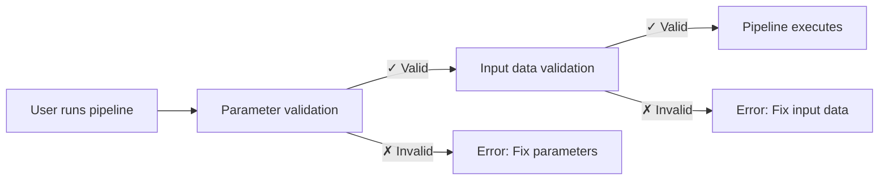
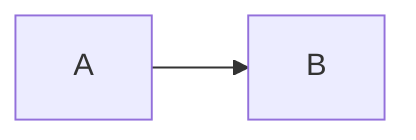

<!-- fixture: lang=de rel=nfcore_build/04_input_validation.md -->

```mermaid
graph LR
    A[User runs pipeline] --> B[Parameter validation]
    B -->|✓ Valid| C[Input data validation]
    B -->|✗ Invalid| D[Error: Fix parameters]
    C -->|✓ Valid| E[Pipeline executes]
    C -->|✗ Invalid| F[Error: Fix input data]
```

```mermaid
graph LR
    A --> B
```
