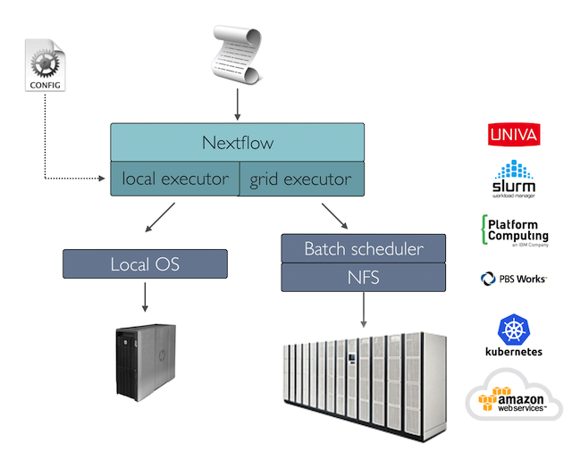

# Deployment scenarios

Real-world genomic applications can spawn the execution of thousands of tasks. In this scenario a batch scheduler is commonly used to deploy a workflow in a computing cluster, allowing the execution of many jobs in parallel across many compute nodes.

Nextflow has built-in support for the most commonly used batch schedulers, such as Univa Grid Engine, SLURM, and IBM LSF.

You can view the Nextflow documentation for the complete list of supported [execution platforms](https://www.nextflow.io/docs/latest/executor.html).

## Cluster deployment

A key Nextflow feature is the ability to decouple the workflow implementation from the actual execution platform. The implementation of an abstraction layer allows the deployment of the resulting workflow on any executing platform supported by the framework.



To run your workflow with a batch scheduler, modify the `nextflow.config` file specifying the target executor and the required computing resources if needed. For example:

```groovy linenums="1" title="nextflow.config"
process.executor = 'slurm'
```

### Managing cluster resources

When using a batch scheduler, it is often needed to specify the number of resources (i.e. cpus, memory, execution time, etc.) required by each task.

This can be done using the following process directives:

|                                                                   |                                                               |
| ----------------------------------------------------------------- | ------------------------------------------------------------- |
| [queue](https://www.nextflow.io/docs/latest/process.html#queue)   | the cluster _queue_ to be used for the computation            |
| [cpus](https://www.nextflow.io/docs/latest/process.html#cpus)     | the number of _cpus_ to be allocated for a task execution     |
| [memory](https://www.nextflow.io/docs/latest/process.html#memory) | the amount of _memory_ to be allocated for a task execution   |
| [time](https://www.nextflow.io/docs/latest/process.html#time)     | the max amount of _time_ to be allocated for a task execution |
| [disk](https://www.nextflow.io/docs/latest/process.html#disk)     | the amount of _disk_ storage required for a task execution    |

### Workflow wide resources

Use the scope `process` to define the resource requirements for all processes in your workflow applications. For example:

```groovy linenums="1" title="nextflow.config"
process {
    executor = 'slurm'
    queue = 'short'
    memory = '10 GB'
    time = '30 min'
    cpus = 4
}
```

### Submit Nextflow as a job

Whilst the main Nextflow command can be launched on the login / head node of a cluster, be aware that the node must be set up for commands that run for a long time, even if the compute resources used are negligible. Another option is to submit the main Nextflow process as a job on the cluster instead.

!!! note

    This requires your cluster configuration to allow jobs be launched from worker nodes, as Nextflow will submit new tasks and manage them from here.

For example, if your cluster uses Slurm as a job scheduler, you could create a file similar to the one below:

```bash linenums="1" title="launch_nf.sh"
#!/bin/bash
#SBATCH --partition WORK
#SBATCH --mem 5G
#SBATCH -c 1
#SBATCH -t 12:00:00

WORKFLOW=$1
CONFIG=$2

# Use a conda environment where you have installed Nextflow
# (may not be needed if you have installed it in a different way)
conda activate nextflow

nextflow -C ${CONFIG} run ${WORKFLOW}
```

And then submit it with:

```bash
sbatch launch_nf.sh /home/my_user/path/my_workflow.nf /home/my_user/path/my_config_file.conf
```

You can find more details about the example above [here](https://lescailab.unipv.it/guides/eos_guide/use_nextflow.html#large-testing-or-production).
You can find more tips for running Nextflow on HPC in the following blog posts:

- [5 Nextflow Tips for HPC Users](https://www.nextflow.io/blog/2021/5_tips_for_hpc_users.html)
- [Five more tips for Nextflow user on HPC](https://www.nextflow.io/blog/2021/5-more-tips-for-nextflow-user-on-hpc.html)

### Configure process by name

In real-world applications, different tasks need different amounts of computing resources. It is possible to define the resources for a specific task using the select `withName:` followed by the process name:

```groovy linenums="1" title="nextflow.config"
process {
    executor = 'slurm'
    queue = 'short'
    memory = '10 GB'
    time = '30 min'
    cpus = 4

    withName: FOO {
        cpus = 2
        memory = '20 GB'
        queue = 'short'
    }

    withName: BAR {
        cpus = 4
        memory = '32 GB'
        queue = 'long'
    }
}
```

### Configure process by labels

When a workflow application is composed of many processes, listing all of the process names and choosing resources for each of them in the configuration file can be difficult.

A better strategy consists of annotating the processes with a [label](https://www.nextflow.io/docs/latest/process.html#label) directive. Then specify the resources in the configuration file used for all processes having the same label.

The workflow script:

```groovy linenums="1" title="snippet.nf"
process TASK1 {
    label 'long'

    script:
    """
    first_command --here
    """
}

process TASK2 {
    label 'short'

    script:
    """
    second_command --here
    """
}
```

The configuration file:

```groovy linenums="1" title="nextflow.config"
process {
    executor = 'slurm'

    withLabel: 'short' {
        cpus = 4
        memory = '20 GB'
        queue = 'alpha'
    }

    withLabel: 'long' {
        cpus = 8
        memory = '32 GB'
        queue = 'omega'
    }
}
```

### Configure multiple containers

Containers can be set for each process in your workflow. You can define their containers in a config file as shown below:

```groovy linenums="1" title="nextflow.config"
process {
    withName: FOO {
        container = 'some/image:x'
    }

    withName: BAR {
        container = 'other/image:y'
    }
}

docker.enabled = true
```

!!! tip

    Should I use a single _fat_ container or many _slim_ containers? Both approaches have pros & cons. A single container is simpler to build and maintain, however when using many tools the image can become very big and tools can create conflicts with each other. Using a container for each process can result in many different images to build and maintain, especially when processes in your workflow use different tools for each task.

Read more about config process selectors at [this link](https://www.nextflow.io/docs/latest/config.html#process-selectors).

### Configuration profiles

Configuration files can contain the definition of one or more _profiles_. A profile is a set of configuration attributes that can be activated/chosen when launching a workflow execution by using the `-profile` command- line option.

Configuration profiles are defined by using the special scope `profiles` which group the attributes that belong to the same profile using a common prefix. For example:

```groovy linenums="1" title="nextflow.config"
profiles {
    standard {
        params.genome = '/local/path/ref.fasta'
        process.executor = 'local'
    }

    cluster {
        params.genome = '/data/stared/ref.fasta'
        process.executor = 'sge'
        process.queue = 'long'
        process.memory = '10 GB'
        process.conda = '/some/path/env.yml'
    }

    cloud {
        params.genome = '/data/stared/ref.fasta'
        process.executor = 'awsbatch'
        process.container = 'cbcrg/imagex'
        docker.enabled = true
    }
}
```

This configuration defines three different profiles: `standard`, `cluster` and `cloud` that set different process configuration strategies depending on the target runtime platform. By convention, the `standard` profile is implicitly used when no other profile is specified by the user.

To enable a specific profile use `-profile` option followed by the profile name:

```bash
nextflow run <your script> -profile cluster
```

!!! tip

    Two or more configuration profiles can be specified by separating the profile names with a comma character:

    ```bash
    nextflow run <your script> -profile standard,cloud
    ```

## Cloud deployment

Nextflow supports deployment on your favourite cloud providers. The following sections describe how to deploy Nextflow workflows on AWS.

### AWS Batch

[AWS Batch](https://aws.amazon.com/batch/) is a managed computing service that allows the execution of containerized workloads in the Amazon cloud infrastructure.

Nextflow provides built-in support for AWS Batch which allows the seamless deployment of a Nextflow workflow in the cloud, offloading the process executions as Batch jobs.

Once the Batch environment is configured, specify the instance types to be used and the max number of CPUs to be allocated, you need to create a Nextflow configuration file like the one shown below:

!!! info ""

    Click the :material-plus-circle: icons in the code for explanations.

```groovy linenums="1" title="nextflow.config"
process.executor = 'awsbatch' // (1)!
process.queue = 'nextflow-ci' // (2)!
process.container = 'nextflow/rnaseq-nf:latest' // (3)!
workDir = 's3://nextflow-ci/work/' // (4)!
aws.region = 'eu-west-1' // (5)!
aws.batch.cliPath = '/home/ec2-user/miniconda/bin/aws' // (6)!
```

1. Set AWS Batch as the executor to run the processes in the workflow
2. The name of the computing queue defined in the Batch environment
3. The Docker container image to be used to run each job
4. The workflow work directory must be a AWS S3 bucket
5. The AWS region to be used
6. The path of the AWS cli tool required to download/upload files to/from the container

!!! tip

    The best practice is to keep this setting as a separate profile in your workflow config file. This allows the execution with a simple command.

    ```bash
    nextflow run script7.nf -profile amazon
    ```

The complete details about AWS Batch deployment are available at [this link](https://www.nextflow.io/docs/latest/aws.html#aws-batch).

!!! cboard-list-2 "Summary"

    In this step you have learned:

    1. How to configure a cluster deployment
    2. How to manage cluster resources
    3. How to submit Nextflow as a job
    4. How to configure process by name
    5. How to configure process by labels

### Volume mounts

Elastic Block Storage (EBS) volumes (or other supported storage) can be mounted in the job container using the following configuration snippet:

```groovy title="nextflow.config"
aws {
    batch {
        volumes = '/some/path'
    }
}
```

Multiple volumes can be specified using comma-separated paths. The usual Docker volume mount syntax can be used to define complex volumes for which the container path is different from the host path or to specify a read-only option:

```groovy title="nextflow.config"
aws {
    region = 'eu-west-1'
    batch {
        volumes = ['/tmp', '/host/path:/mnt/path:ro']
    }
}
```

!!! tip

    This is a global configuration that has to be specified in a Nextflow config file and will be applied to **all** process executions.

!!! tip

    Additional documentation for [AWS](https://www.nextflow.io/docs/latest/aws.html#), [GCP](https://www.nextflow.io/docs/latest/google.html), and [Azure](https://www.nextflow.io/docs/latest/azure.html) are available on the Nextflow documentation site.

!!! cboard-list-2 "Summary"

    In this step you have learned:

    1. How to configure AWS Batch
    2. How to configure volume mounts

## Additional configuration options

There are many different ways to deploy Nextflow workflows. The following sections describe additional configuration options for deployments.

### Custom job definition

Nextflow automatically creates the Batch [Job definitions](https://docs.aws.amazon.com/batch/latest/userguide/job_definitions.html) needed to execute your workflow processes. Therefore it’s not required to define them before you run your workflow.

However, you may still need to specify a custom Job Definition to provide fine-grained control of the configuration settings of a specific job (e.g. to define custom mount paths or other special settings of a Batch Job).

To use your own job definition in a Nextflow workflow, use it in place of the container image name, prefixing it with the `job-definition://` string. For example:

```groovy linenums="1" title="nextflow.config"
process {
    container = 'job-definition://your-job-definition-name'
}
```

### Custom image

Since Nextflow requires the AWS CLI tool to be accessible in the computing environment, a common solution consists of creating a custom Amazon Machine Image (AMI) and installing it in a self-contained manner (e.g. using Conda package manager).

!!! warning

    When creating your custom AMI for AWS Batch, make sure to use the _Amazon ECS-Optimized Amazon Linux AMI_ as the base image.

The following snippet shows how to install AWS CLI with Miniconda:

```bash linenums="1"
sudo yum install -y bzip2 wget
wget https://repo.continuum.io/miniconda/Miniconda3-latest-Linux-x86_64.sh
bash Miniconda3-latest-Linux-x86_64.sh -b -f -p $HOME/miniconda
$HOME/miniconda/bin/conda install -c conda-forge -y awscli
rm Miniconda3-latest-Linux-x86_64.sh
```

!!! note

    The `aws` tool will be placed in a directory named `bin` in the main installation folder. The tools will not work properly if you modify this directory     structure after the installation.

Finally, specify the `aws` full path in the Nextflow config file as shown below:

```groovy
aws.batch.cliPath = '/home/ec2-user/miniconda/bin/aws'
```

### Launch template

An alternative approach to is to create a custom AMI using a [Launch template](https://docs.aws.amazon.com/AWSEC2/latest/UserGuide/ec2-launch-templates.html) that installs the AWS CLI tool during the instance boot via custom user data.

In the EC2 dashboard, create a Launch template specifying the user data field:

```bash linenums="1"
MIME-Version: 1.0
Content-Type: multipart/mixed; boundary="//"

--//
Content-Type: text/x-shellscript; charset="us-ascii"

##!/bin/sh
### install required deps
set -x
export PATH=/usr/local/bin:$PATH
yum install -y jq python27-pip sed wget bzip2
pip install -U boto3

### install awscli
USER=/home/ec2-user
wget -q https://repo.continuum.io/miniconda/Miniconda3-latest-Linux-x86_64.sh
bash Miniconda3-latest-Linux-x86_64.sh -b -f -p $USER/miniconda
$USER/miniconda/bin/conda install -c conda-forge -y awscli
rm Miniconda3-latest-Linux-x86_64.sh
chown -R ec2-user:ec2-user $USER/miniconda

--//--
```

Then create a new compute environment in the Batch dashboard and specify the newly created launch template in the corresponding field.

### Hybrid deployments

Nextflow allows the use of multiple executors in the same workflow application. This feature enables the deployment of hybrid workloads in which some jobs are executed on the local computer or local computing cluster, and some jobs are offloaded to the AWS Batch service.

To enable this feature use one or more [process selectors](https://www.nextflow.io/docs/latest/config.html#config-process-selectors) in your Nextflow configuration file.

When running a hybrid workflow, `-bucket-dir` and `-work-dir` should be used to define separate work directories for remote tasks and local tasks, respectively.

For example, apply the [AWS Batch configuration](https://www.nextflow.io/docs/latest/aws.html#configuration) only to a subset of processes in your workflow. You can try the following:

```groovy linenums="1" title="nextflow.config"
process {
    executor = 'slurm' // (1)!
    queue = 'short' // (2)!

    withLabel: bigTask {  // (3)!
        executor = 'awsbatch' // (4)!
        queue = 'my-batch-queue' // (5)!
        container = 'my/image:tag' // (6)!
    }
}

aws {
    region = 'eu-west-1' // (7)!
}
```

1. Set `slurm` as the default executor
2. Set the queue for the SLURM cluster
3. Setting of process(es) with the label `bigTask`
4. Set `awsbatch` as the executor for the process(es) with the `bigTask` label
5. Set the queue for the process(es) with the `bigTask` label
6. Set the container image to deploy for the process(es) with the `bigTask` label
7. Define the region for Batch execution

The workflow can then be executed with:

```bash
nextflow run <script> -bucket-dir 's3://my-bucket' -work-dir /path/to/scratch/dir
```

!!! cboard-list-2 "Summary"

    In this step you have learned:

    1. How to use a custom job definition
    2. How to use a custom image
    3. How to use a launch template
    4. How to use hybrid deployments
