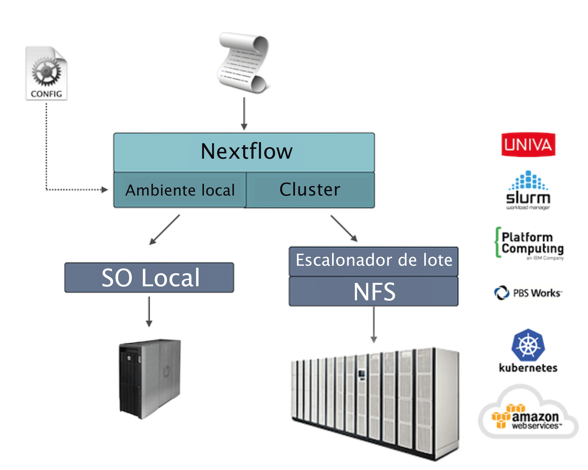

!!! warning

    Some of the translations on the training portal are out of date.
    The translated material may be incomplete or incorrect.
    We plan to update the translations later this year.
    In the meantime, please try to work through the English-language material if you can.

# Cenários de implantação

Aplicações genômicas do mundo real podem gerar milhares de tarefas sendo executadas. Nesse cenário, um escalonador de lote (batch scheduler) é comumente usado para implantar um fluxo de trabalho em um cluster de computação, permitindo a execução de muitos trabalhos em paralelo em muitos nós de computação.

O Nextflow possui suporte embutido para os escalonadores de lote mais usados, como o Univa Grid Engine, o [SLURM](https://slurm.schedmd.com/) e o IBM LSF. Verifique a documentação do Nextflow para obter a lista completa dos [ambientes de computação](https://www.nextflow.io/docs/latest/executor.html).

## Implantação em cluster

Um recurso importante do Nextflow é a capacidade de desacoplar a implementação do fluxo de trabalho da plataforma de execução de fato. A implementação de uma camada de abstração permite a implantação do fluxo de trabalho resultante em qualquer plataforma de execução suportada pelo framework.



Para executar seu fluxo de trabalho com um escalonador de lote, modifique o arquivo `nextflow.config` especificando o executor de destino e os recursos de computação necessários, se necessário. Por exemplo:

```groovy linenums="1"
process.executor = 'slurm'
```

## Gerenciando recursos do cluster

Ao usar um escalonador de lote, geralmente é necessário especificar o número de recursos (ou seja, CPU, memória, tempo de execução etc.) necessários para cada tarefa.

Isso pode ser feito utilizando as seguintes diretivas de processo:

|                                                                   |                                                                                |
| ----------------------------------------------------------------- | ------------------------------------------------------------------------------ |
| [queue](https://www.nextflow.io/docs/latest/process.html#queue)   | a _fila_ a ser utilizada no cluster para computação                            |
| [cpus](https://www.nextflow.io/docs/latest/process.html#cpus)     | o número de _cpus_ a serem alocadas para execução da tarefa                    |
| [memory](https://www.nextflow.io/docs/latest/process.html#memory) | a quantidade de _memória_ a ser alocada para execução da tarefa                |
| [time](https://www.nextflow.io/docs/latest/process.html#time)     | a quantidade de _tempo_ máxima a ser alocada para execução da tarefa           |
| [disk](https://www.nextflow.io/docs/latest/process.html#disk)     | a quantidade de _espaço de armazenamento_ necessária para a execução da tarefa |

### Recursos do fluxo de trabalho de modo amplo

Use o escopo `process` para definir os requisitos de recursos para todos os processos em suas aplicações de fluxo de trabalho. Por exemplo:

```groovy linenums="1"
process {
    executor = 'slurm'
    queue = 'curta'
    memory = '10 GB'
    time = '30 min'
    cpus = 4
}
```

### Submeta o Nextflow como uma tarefa

Embora o comando principal do Nextflow possa ser iniciado no nó de login/head de um cluster, esteja ciente de que o nó deve ser configurado para comandos que são executados por um longo período de tempo, mesmo que os recursos computacionais usados sejam insignificantes. Outra opção é enviar o processo principal do Nextflow como uma tarefa no cluster.

!!! note

     Isso requer a configuração do seu cluster para permitir que as tarefas sejam iniciadas a partir dos nós de trabalho, pois o Nextflow enviará novas tarefas e as gerenciará a partir daqui.

Por exemplo, se seu cluster usa Slurm como escalonador de tarefas, você pode criar um arquivo semelhante ao abaixo:

```bash linenums="1" title="launch_nf.sh"
#!/bin/bash
#SBATCH --partition TRABALHO
#SBATCH --mem 5G
#SBATCH -c 1
#SBATCH -t 12:00:00

FLUXO_DE_TRABALHO=$1
CONFIG=$2

# Use um ambiente conda onde você instalou o Nextflow
# (pode não ser necessário se você o tiver instalado de uma maneira diferente)
conda activate nextflow

nextflow -C ${CONFIG} run ${FLUXO_DE_TRABALHO}
```

E, em seguida, submeta-o com:

```bash linenums="1"
sbatch launch_nf.sh /home/meu_usuario/caminho/meu_fluxo_de_trabalho.nf /home/meu_usuario/caminho/meu_arquivo_configuracao.conf
```

Você pode encontrar mais detalhes sobre o exemplo acima [aqui](https://lescailab.unipv.it/guides/eos_guide/use_nextflow.html#large-testing-or-production). Você também poderá encontrar mais dicas de como executar o Nextflow em HPC nos seguintes posts de blog:

- [5 Nextflow Tips for HPC Users](https://www.nextflow.io/blog/2021/5_tips_for_hpc_users.html)
- [Five more tips for Nextflow user on HPC](https://www.nextflow.io/blog/2021/5-more-tips-for-nextflow-user-on-hpc.html)

### Configure processos por nome

Em aplicações do mundo real, diferentes tarefas precisam de diferentes quantidades de recursos de computação. É possível definir os recursos para uma tarefa específica usando o seletor `withName:` seguido do nome do processo:

```groovy linenums="1"
process {
    executor = 'slurm'
    queue = 'curta'
    memory = '10 GB'
    time = '30 min'
    cpus = 4

    withName: FOO {
        cpus = 2
        memory = '20 GB'
        queue = 'curta'
    }

    withName: BAR {
        cpus = 4
        memory = '32 GB'
        queue = 'longa'
    }
}
```

!!! exercise

    Execute o script RNA-Seq (`script7.nf`) visto na seção de RNAseq, mas especifique dentro do arquivo `nextflow.config` que o processo de quantificação (`QUANTIFICATION`) requer 2 CPUs e 5 GB de memória.

    ??? solution

        ```groovy
        process {
            withName: QUANTIFICATION {
                cpus = 2
                memory = '5 GB'
            }
        }
        ```

### Configure processos por rótulos

Quando uma aplicação de fluxo de trabalho é composta por muitos processos, pode ser difícil listar todos os nomes de processos e escolher recursos para cada um deles no arquivo de configuração.

Uma melhor estratégia consiste em anotar os processos com uma diretiva de [rótulo](https://www.nextflow.io/docs/latest/process.html#label) (`label`). Em seguida, especifique os recursos no arquivo de configuração usados para todos os processos com o mesmo rótulo.

O script do fluxo de trabalho:

```groovy linenums="1"
process TAREFA1 {
    label 'longo'

    script:
    """
    primeiro_comando --aqui
    """
}

process TAREFA2 {
    label 'curto'

    script:
    """
    segundo_comando --aqui
    """
}
```

O arquivo de configuração:

```groovy linenums="1"
process {
    executor = 'slurm'

    withLabel: 'curto' {
        cpus = 4
        memory = '20 GB'
        queue = 'alfa'
    }

    withLabel: 'longo' {
        cpus = 8
        memory = '32 GB'
        queue = 'omega'
    }
}
```

### Configure vários contêineres

Os contêineres podem ser definidos para cada processo em seu fluxo de trabalho. Você pode definir seus contêineres em um arquivo de configuração conforme mostrado abaixo:

```groovy linenums="1"
process {
    withName: FOO {
        container = 'uma/imagem:x'
    }
    withName: BAR {
        container = 'outra/imagem:y'
    }
}

docker.enabled = true
```

!!! tip

    Devo usar um único contêiner _pesado_ ou muitos contêineres _leves_? Ambas as abordagens têm prós e contras. Um único contêiner é mais simples de construir e manter, porém ao usar muitas ferramentas a imagem pode ficar muito grande e as ferramentas podem criar conflitos umas com as outras. O uso de um contêiner para cada processo pode resultar em muitas imagens diferentes para criar e manter, especialmente quando os processos em seu fluxo de trabalho usam ferramentas diferentes para cada tarefa.

Leia mais sobre seletores de processo de configuração [neste link](https://www.nextflow.io/docs/latest/config.html#process-selectors).

## Perfis de configuração

Os arquivos de configuração podem conter a definição de um ou mais _perfis_. Um perfil é um conjunto de atributos de configuração que podem ser ativados/escolhidos ao lançar a execução de um fluxo de trabalho usando a opção de linha de comando `-profile`.

Os perfis de configuração são definidos usando o escopo especial `profiles` que agrupa os atributos que pertencem ao mesmo perfil usando um prefixo comum. Por exemplo:

```groovy linenums="1"
profiles {
    standard {
        params.genoma = '/local/caminho/ref.fasta'
        process.executor = 'local'
    }

    cluster {
        params.genoma = '/data/stared/ref.fasta'
        process.executor = 'sge'
        process.queue = 'longa'
        process.memory = '10 GB'
        process.conda = '/um/caminho/ambiente.yml'
    }

    nuvem {
        params.genoma = '/data/stared/ref.fasta'
        process.executor = 'awsbatch'
        process.container = 'cbcrg/imagex'
        docker.enabled = true
    }

}
```

Essa configuração define três perfis diferentes: `standard`, `cluster` e `nuvem` que definem diferentes estratégias de configuração de processo dependendo da plataforma de tempo de execução de destino. Por convenção, o perfil `standard` é usado implicitamente quando nenhum outro perfil é especificado pelo usuário.

Para ativar um perfil específico, use a opção `-profile` seguida do nome do perfil:

```bash
nextflow run <seu script> -profile cluster
```

!!! tip

    Dois ou mais perfis de configuração podem ser especificados separando os nomes dos perfis com uma vírgula:

    ```bash
    nextflow run <seu script> -profile standard,nuvem
    ```

## Implantação na nuvem

[AWS Batch](https://aws.amazon.com/batch/) é um serviço de computação gerenciada que permite a execução de cargas de trabalho em contêineres na infraestrutura de nuvem da Amazon.

O Nextflow fornece suporte embutido para o AWS Batch, que permite uma implantação simples de um fluxo de trabalho do Nextflow na nuvem, descarregando as execuções de processo como trabalhos em lote.

Uma vez que o ambiente Batch esteja configurado, especifique os tipos de instância a serem usadas e o número máximo de CPUs a serem alocadas. Você precisa criar um arquivo de configuração do Nextflow como o mostrado abaixo:

!!! info ""

    Clique no ícone :material-plus-circle: no código para ver explicações.

```groovy linenums="1"
process.executor = 'awsbatch' // (1)!
process.queue = 'nextflow-ci' // (2)!
process.container = 'nextflow/rnaseq-nf:latest' // (3)!
workDir = 's3://nextflow-ci/work/' // (4)!
aws.region = 'eu-west-1' // (5)!
aws.batch.cliPath = '/home/ec2-user/miniconda/bin/aws' // (6)!
```

1. Defina o AWS Batch como o executor para executar os processos no fluxo de trabalho
2. O nome da fila de computação definida no ambiente Batch
3. A imagem do contêiner do Docker a ser usada para executar cada trabalho
4. O diretório de trabalho do fluxo de trabalho deve ser um bucket AWS S3
5. A região da AWS a ser usada
6. O caminho da ferramenta de linha de comando da AWS necessária para fazer download/upload de arquivos de/para o contêiner

!!! tip

    A prática recomendada é manter essa configuração como um perfil separado no arquivo de configuração do fluxo de trabalho. Isso permite a execução com um comando simples.

    ```bash
    nextflow run script7.nf -profile amazon
    ```

Os detalhes completos sobre a implantação no AWS Batch estão disponíveis [nesse link](https://www.nextflow.io/docs/latest/aws.html#aws-batch).

## Montagens de volume

Elastic Block Storage (EBS) (ou outras formas de armazenamento suportadas) podem ser montados no contêiner da tarefa usando a seguinte configuração:

```groovy
aws {
    batch {
        volumes = '/algum/caminho'
    }
}
```

Vários volumes podem ser especificados usando caminhos separados por vírgulas. A sintaxe usual de montagem de volume do Docker pode ser usada para definir volumes complexos para os quais o caminho do contêiner é diferente do caminho do hospedeiro ou para especificar uma opção somente leitura:

```groovy
aws {
    region = 'eu-west-1'
    batch {
        volumes = ['/tmp', '/caminho/no/hospedeiro:/mnt/caminho:ro']
    }
}
```

!!! tip

    Esta é uma configuração global que deve ser especificada em um arquivo de configuração do Nextflow e será aplicada a **todas** as execuções do processo.

!!! warning

    O Nextflow espera que os caminhos estejam disponíveis. Ele não lida com o fornecimento de volumes EBS ou outro tipo de armazenamento.

## Definição de tarefa personalizada

O Nextflow cria automaticamente as [definições de trabalho](https://docs.aws.amazon.com/batch/latest/userguide/job_definitions.html) do Batch necessárias para executar seus processos de fluxo de trabalho. Portanto, não é necessário defini-las antes de executar seu fluxo de trabalho.

No entanto, você ainda pode precisar especificar uma definição de tarefa personalizada para fornecer controle refinado das definições de configuração de uma tarefa específica (por exemplo, para definir caminhos de montagem personalizados ou outras configurações especiais de uma tarefa no Batch).

Para usar sua própria definição de tarefa em um fluxo de trabalho do Nextflow, use-a no lugar do nome da imagem do contêiner, prefixando-a com a string `job-definition://`. Por exemplo:

```groovy
process {
    container = 'job-definition://o-nome-da-sua-definicao-de-tarefa'
}
```

## Imagem personalizada

Como o Nextflow exige que a ferramenta de linha de comando da AWS esteja acessível no ambiente de computação, uma solução comum consiste em criar uma Amazon Machine Image (AMI) personalizada e instalá-la de maneira independente (por exemplo, usando o gerenciador de pacotes Conda).

!!! warning

    Ao criar sua AMI personalizada para o AWS Batch, certifique-se de usar a _Amazon ECS-Optimized Amazon Linux AMI_ como imagem base.

O trecho de código a seguir mostra como instalar a ferramenta de linha de comando da AWS com o Miniconda:

```bash linenums="1"
sudo yum install -y bzip2 wget
wget https://repo.continuum.io/miniconda/Miniconda3-latest-Linux-x86_64.sh
bash Miniconda3-latest-Linux-x86_64.sh -b -f -p $HOME/miniconda
$HOME/miniconda/bin/conda install -c conda-forge -y awscli
rm Miniconda3-latest-Linux-x86_64.sh
```

!!! note

    A ferramenta `aws` será colocada em um diretório chamado `bin` na pasta principal de instalação. As ferramentas não funcionarão corretamente se você modificar essa estrutura de diretórios após a instalação.

Por fim, especifique o caminho completo para a `aws` no arquivo de configuração do Nextflow, conforme mostrado abaixo:

```groovy
aws.batch.cliPath = '/home/ec2-user/miniconda/bin/aws'
```

## Modelo de lançamento

Uma abordagem alternativa é criar uma AMI personalizada usando um [modelo de lançamento](https://docs.aws.amazon.com/AWSEC2/latest/UserGuide/ec2-launch-templates.html) que instala a ferramenta de linha de comando da AWS durante o lançamento da instância por meio de dados de usuário personalizados.

No painel do EC2, crie um modelo de lançamento especificando o campo de dados do usuário:

```bash linenums="1"
MIME-Version: 1.0
Content-Type: multipart/mixed; boundary="//"

--//
Content-Type: text/x-shellscript; charset="us-ascii"

##!/bin/sh
### install required deps
set -x
export PATH=/usr/local/bin:$PATH
yum install -y jq python27-pip sed wget bzip2
pip install -U boto3

### install awscli
USER=/home/ec2-user
wget -q https://repo.continuum.io/miniconda/Miniconda3-latest-Linux-x86_64.sh
bash Miniconda3-latest-Linux-x86_64.sh -b -f -p $USER/miniconda
$USER/miniconda/bin/conda install -c conda-forge -y awscli
rm Miniconda3-latest-Linux-x86_64.sh
chown -R ec2-user:ec2-user $USER/miniconda

--//--
```

Em seguida, crie um novo ambiente de computação no painel Batch e especifique o modelo de lançamento recém-criado no campo correspondente.

## Implantação híbrida

O Nextflow permite o uso de vários executores na mesma aplicação do fluxo de trabalho. Esse recurso permite a implantação de cargas de trabalho híbridas nas quais algumas tarefas são executados no computador local ou cluster de computação local e algumas tarefas são transferidas para o serviço AWS Batch.

Para ativar esse recurso, use um ou mais [seletores de processo](https://www.nextflow.io/docs/latest/config.html#config-process-selectors) em seu arquivo de configuração do Nextflow.

Por exemplo, aplique a [configuração do AWS Batch](https://www.nextflow.io/docs/latest/aws.html#configuration) apenas a um subconjunto de processos em seu fluxo de trabalho. Você pode tentar o seguinte:

```groovy linenums="1"
process {
    executor = 'slurm' // (1)!
    queue = 'curta' // (2)!

    withLabel: tarefaGrande {  // (3)!
        executor = 'awsbatch' // (4)!
        queue = 'minha-fila-do-batch' // (5)!
        container = 'minha/imagem:tag' // (6)!
    }
}

aws {
    region = 'eu-west-1' // (7)!
}
```

1. Defina o `slurm` como o executor padrão
2. Defina a fila para o cluster SLURM
3. Configuração de processo(s) com o rótulo `tarefaGrande`
4. Defina `awsbatch` como o executor para o(s) processo(s) com o rótulo `tarefaGrande`
5. Defina a fila para o(s) processo(s) com o rótulo `tarefaGrande`
6. Defina a imagem do contêiner para implantar para o(s) processo(s) com o rótulo `tarefaGrande`
7. Defina a região para execução do Batch
