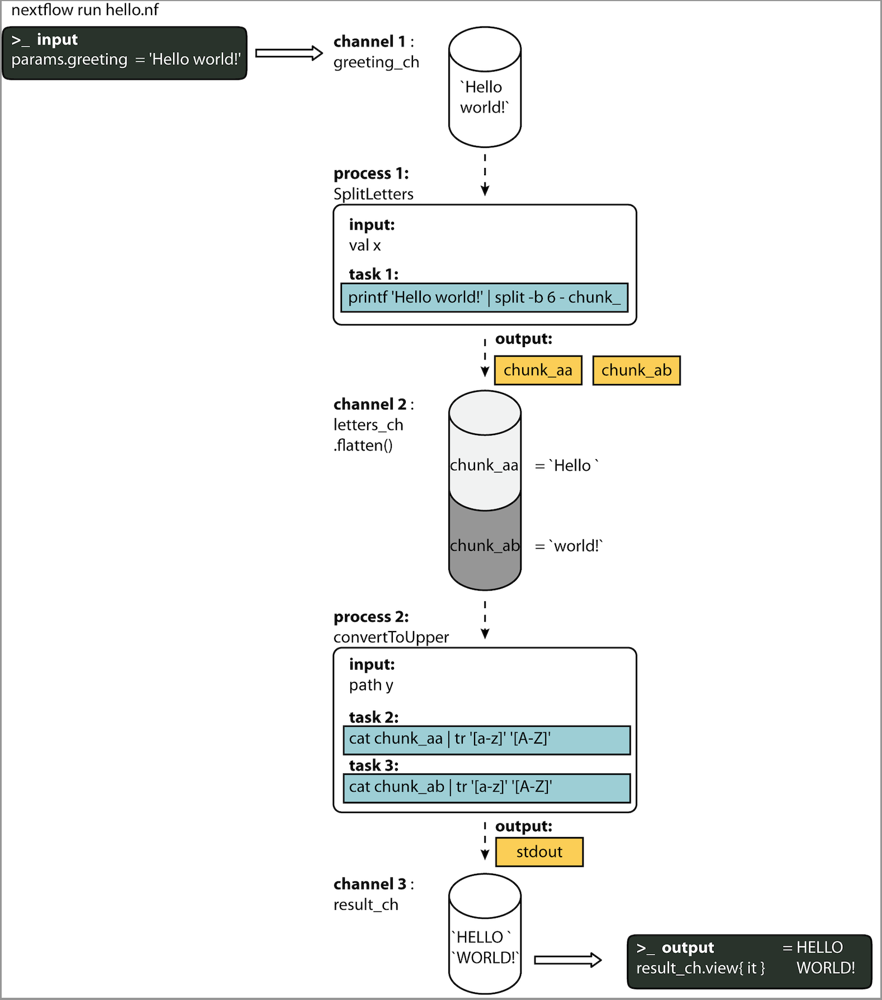

!!! warning

    Some of the translations on the training portal are out of date.
    The translated material may be incomplete or incorrect.
    We plan to update the translations later this year.
    In the meantime, please try to work through the English-language material if you can.

# Introduction

## Concepts de base

Nextflow est un moteur d'orchestration de workflow et un langage de domaine spécifique (DSL) qui facilite la redaction dun workflow informatiques à forte intensité de données.

Il est conçu autour de l'idée que la plateforme Linux est la _lingua franca_ de la science des données. Linux fournit de nombreux outils de ligne de commande et de script simples mais puissants qui, lorsqu'ils sont combinés, facilitent les manipulations de données complexes.

Nextflow étend cette approche en ajoutant la possibilité de définir des interactions complexes entre les programmes et un environnement de calcul parallèle de haut niveau, basé sur le modèle de programmation par flux de données. Les principales caractéristiques de Nextflow sont les suivantes:

- Portabilité et reproductibilité du workflow
- la scalabilité de la parallélisation et du déploiement
- Intégration des outils, systèmes et normes industrielles existants

### Processus et canaux

En pratique, un workflow Nextflow est constitué par l'assemblage de différents processus. Chaque `processus` peut être écrit dans n'importe quel langage de script qui peut être exécuté par la plateforme Linux (Bash, Perl, Ruby, Python, etc.).

Les processus sont exécutés indépendamment et sont isolés les uns des autres, c'est-à-dire qu'ils ne partagent pas d'état commun (redigeable). Ils ne peuvent communiquer que par l'intermédiaire de files d'attente asynchrones FIFO (first-in, first-out), appelées `canaux`.

Tout `processus` peut définir un ou plusieurs `canaux` comme 'input' et 'output'. L'interaction entre ces processus, et finalement le flux d'exécution du workflow lui-même, est implicitement définie par ces déclarations `input` et `output`.

<figure class="excalidraw">
--8<-- "docs/basic_training/img/channel-process.excalidraw.svg"
</figure>

### Abstraction d'exécution

Alors qu'un `processus` définit _quelle_ commande ou `script` doit être exécuté, l'exécuteur détermine _comment_ ce `script` est exécuté sur la plateforme cible.

Sauf indication contraire, les processus sont exécutés sur l'ordinateur local. L'exécuteur local est très utile pour le développement et les tests de workflows, mais pour les workflows de calcul réels, une plateforme de calcul haute performance (HPC) ou une plateforme cloud est souvent nécessaire.

En d'autres termes, Nextflow fournit une abstraction entre la logique fonctionnelle du workflow et le système d'exécution sous-jacent (ou runtime). Ainsi, il est possible d'écrire un workflow qui s'exécute de manière transparente sur votre ordinateur, un cluster ou le cloud, sans être modifié. Il vous suffit de définir la plateforme d'exécution cible dans le fichier de configuration.

<figure markdown>


</figure>

### Langage de script

Nextflow met en œuvre un DSL déclaratif qui simplifie l'écriture de workflows d'analyse de données complexes en tant qu'extension d'un langage de programmation général.

Cette approche rend Nextflow flexible - il offre les avantages d'un DSL concis pour le traitement des cas d'utilisation récurrents avec facilité **et** la flexibilité et la puissance d'un langage de programmation polyvalent pour traiter les cas d'angle dans le même environnement informatique. Cela serait difficile à mettre en œuvre en utilisant une approche purement déclarative.

En termes pratiques, le script Nextflow est une extension du [langage de programmation Groovy] (https://groovy-lang.org/) qui, à son tour, est un super-ensemble du langage de programmation Java. Groovy peut être considéré comme "Python pour Java", en ce sens qu'il simplifie l'écriture du code et qu'il est plus accessible.

## Votre premier script

Ici vous allez exécuter votre premier script Nextflow (`hello.nf`), que nous allons parcourir ligne par ligne.

Dans cet exemple, le script prend une chaîne d'entrée (un paramètre appelé `params.greeting`) et la divise en morceaux de six caractères dans le premier processus. Le deuxième processus convertit ensuite les caractères en majuscules. Le résultat est finalement affiché à l'écran.

### Code Nextflow

<!-- NOTE: (Phil, Jan 2023)
Nous pouvons inclure dynamiquement des fichiers externes à l'aide de mkdocs, comme suit :

```groovy title="nf-training/hello.nf" linenums="1"
--8<-- "nf-training/hello.nf"
```

Cela permet d'insérer un extrait de code identique à celui qui figure ci-dessous, et nous n'avons pas à nous préoccuper de la synchronisation des deux.

CEPENDANT, les annotations de ligne ne peuvent pas être ajoutées pour les fichiers externes. Pour l'instant, nous devons donc encore copier les scripts.

A FAIRE: soit:
    - Réécrire les documents pour ne pas utiliser des tonnes d'annotations
    - Attendre les prochaines versions pour permettre les annotations avec des fichiers externes
-->

!!! info

    Cliquez sur les icônes :material-plus-circle: dans le code pour obtenir des explications.

```groovy title="nf-training/hello.nf" linenums="1"
#!/usr/bin/env nextflow
// (1)!
params.greeting = 'Hello world!' // (2)!
greeting_ch = channel.of(params.greeting) // (3)!

process SPLITLETTERS { // (4)!
    input: // (5)!
    val x // (6)!

    output: // (7)!
    path 'chunk_*' // (8)!

    script: // (9)!
    """
    printf '$x' | split -b 6 - chunk_
    """
} // (10)!

process CONVERTTOUPPER { // (11)!
    input: // (12)!
    path y // (13)!

    output: // (14)!
    stdout // (15)!

    script: // (16)!
    """
    cat $y | tr '[a-z]' '[A-Z]'
    """
} // (17)!

workflow { // (18)!
    letters_ch = SPLITLETTERS(greeting_ch) // (19)!
    results_ch = CONVERTTOUPPER(letters_ch.flatten()) // (20)!
    results_ch.view { it } // (21)!
} // (22)!
```

1. Le code commence par un shebang, qui déclare Nextflow comme interprète.
2. Déclare un paramètre `greeting` qui est initialisé avec la valeur 'Hello world!'.
3. Initialise un `canal` nommé `greeting_ch`, qui contient la valeur de `params.greeting`. Les canaux sont le type d'entrée pour les processus dans Nextflow.
4. Commence le premier bloc de processus, défini comme `SPLITLETTERS`.
5. Déclaration d'entrée pour le processus `SPLITLETTERS`. Les entrées peuvent être des valeurs (`val`), des fichiers ou des chemins (`path`), ou d'autres qualificatifs ([voir ici](https://www.nextflow.io/docs/latest/process.html#inputs)).
6. Indique au processus d'attendre une valeur d'entrée (`val`), que nous assignons à la variable 'x'.
7. Déclaration de sortie pour le processus `SPLITLETTERS`.
8. Indique au processus d'attendre un ou plusieurs fichiers de sortie (`path`), avec un nom de fichier commençant par 'chunk\_', en tant que sortie du script. Le processus envoie la sortie sous forme de canal.
9. Trois guillemets doubles commencent et terminent le bloc de code pour exécuter ce `processus`.
   Le code à exécuter se trouve à l'intérieur : il s'agit d'imprimer la valeur d`input` x (appelée à l'aide du préfixe dollar [$]), de diviser la chaîne en morceaux de 6 caractères ("Hello" et "world !") et de sauvegarder chacun d'eux dans un fichier (chunk_aa et chunk_ab).
10. Fin du premier bloc de processus.
11. Commence le deuxième bloc de processus, défini comme `CONVERTTOUPPER`.
12. Déclaration d'entrée pour le `processus` `CONVERTTOUPPER`.
13. Indique au `processus` d'attendre un ou plusieurs fichiers `input` (`path` ; i.e. chunk_aa et chunk_ab), que nous assignons à la variable 'y'.
14. Déclaration de sortie pour le processus `CONVERTTOUPPER`.
15. Indique au processus de s'attendre à une sortie standard (stdout) et envoie cette sortie en tant que canal.
16. Trois guillemets doubles commencent et terminent le bloc de code pour exécuter ce `process`.
    Le bloc contient un script qui lit les fichiers (cat) en utilisant la variable d'entrée "$y", puis convertit les caractères en majuscules et les envoie vers la sortie standard.
17. Fin du deuxième bloc `process`.
18. Début de la portée du workflow où chaque processus peut être appelé.
19. Exécutez le `processus` `SPLITLETTERS` sur le `greeting_ch` (aka greeting channel), et stockez la sortie dans le canal `letters_ch`.
20. Exécutez le `processus` `CONVERTTOUPPER` sur le canal de lettres `letters_ch`, qui est aplati en utilisant l'opérateur `.flatten()`. Cela transforme le canal d'entrée de telle sorte que chaque élément est un élément séparé. Nous stockons la sortie dans le canal `results_ch`.
21. La sortie finale (dans le canal `results_ch`) est imprimée à l'écran en utilisant l'opérateur `view` (ajouté au nom du canal).
22. Fin de l'étendue du workflow.

L'utilisation de l'opérateur `.flatten()` ici permet de diviser les deux fichiers en deux éléments distincts qui seront traités par le processus suivant (sinon, ils seraient traités comme un seul élément).

### Dans la pratique

Copiez maintenant l'exemple ci-dessus dans votre éditeur de texte favori et enregistrez-le dans un fichier nommé `hello.nf`.

!!! warning

    Pour le tutoriel Gitpod, assurez-vous d'être dans le dossier appelé `nf-training`

Exécutez le script en entrant la commande suivante dans votre terminal :

```bash
nextflow run hello.nf
```

Le résultat ressemblera au texte ci-dessous :

```linenums="1"
N E X T F L O W  ~  version 23.04.1
Launching `hello.nf` [cheeky_keller] DSL2 - revision: 197a0e289a
executor >  local (3)
[31/52c31e] process > SPLITLETTERS (1)   [100%] 1 of 1 ✔
[37/b9332f] process > CONVERTTOUPPER (2) [100%] 2 of 2 ✔
HELLO
WORLD!
```

La sortie standard affiche (ligne par ligne) :

1. La version de Nextflow qui a été exécutée.
2. Les noms du script et de la version.
3. L'exécuteur utilisé (dans le cas ci-dessus : local).
4. Le premier `processus` est exécuté une fois, ce qui signifie qu'il y a une tâche. La ligne commence par une valeur hexadécimale unique (voir TIP ci-dessous), et se termine par le pourcentage et d'autres informations sur l'achèvement de la tâche.
5. Le deuxième processus est exécuté deux fois (une fois pour chunk_aa et une fois pour chunk_ab), ce qui signifie qu'il y a deux tâches.
6. La chaîne de résultats de stdout est imprimée.

!!! info

    Les nombres hexadécimaux, comme `31/52c31e`, identifient l'exécution unique du processus, que nous appelons une tâche. Ces nombres sont également le préfixe des répertoires où chaque tâche est exécutée. Vous pouvez inspecter les fichiers produits en allant dans le répertoire `$PWD/work` et en utilisant ces numéros pour trouver le chemin d'exécution spécifique à la tâche.

!!! tip

    Le second processus s'exécute deux fois, dans deux répertoires de travail différents pour chaque fichier d'entrée. La sortie du journal [ANSI](https://en.wikipedia.org/wiki/ANSI_escape_code) de Nextflow se rafraîchit dynamiquement au fur et à mesure que le workflow s'exécute ; dans l'exemple précédent, le répertoire de travail `[37/b9332f]` est le second des deux répertoires qui ont été traités (en écrasant le journal avec le premier). Pour imprimer tous les chemins pertinents à l'écran, désactivez la sortie du journal ANSI en utilisant l'option `-ansi-log` (par exemple, `nextflow run hello.nf -ansi-log false`).

Il faut noter que le processus `CONVERTTOUPPER` est exécuté en parallèle, donc il n'y a aucune garantie que l'instance qui traite le premier split (le chunk _Hello ') sera exécutée avant celle qui traite le second split (le chunk 'world!_).

Il se peut donc que le résultat final soit imprimé dans un ordre différent :

```
WORLD!
HELLO
```

## Modifier et reprendre

Nextflow garde la trace de tous les processus exécutés dans votre workflow. Si vous modifiez certaines parties de votre script, seuls les processus modifiés seront ré-exécutés. L'exécution des processus qui n'ont pas été modifiés sera ignorée et le résultat mis en cache sera utilisé à la place.

Cela permet de tester ou de modifier une partie de votre flux de travail sans avoir à le réexécuter depuis le début.

Pour les besoins de ce tutoriel, modifiez le processus `CONVERTTOUPPER` de l'exemple précédent, en remplaçant le script du processus par la chaîne `rev $y`, de façon à ce que le processus ressemble à ceci :

```groovy
process CONVERTTOUPPER {
    input:
    path y

    output:
    stdout

    script:
    """
    rev $y
    """
}
```

Enregistrez ensuite le fichier sous le même nom et exécutez-le en ajoutant l'option `-resume` à la ligne de commande :

```console
$ nextflow run hello.nf -resume

N E X T F L O W  ~  version 23.04.1
Launching `hello.nf` [zen_colden] DSL2 - revision: 0676c711e8
executor >  local (2)
[31/52c31e] process > SPLITLETTERS (1)   [100%] 1 of 1, cached: 1 ✔
[0f/8175a7] process > CONVERTTOUPPER (1) [100%] 2 of 2 ✔
!dlrow
 olleH
```

Vous verrez que l'exécution du processus `SPLITLETTERS` est ignorée (l'ID de la tâche est le même que dans la première sortie) — ses résultats sont récupérés dans le cache. Le second processus est exécuté comme prévu, imprimant les chaînes inversées.

!!! info

    Les résultats du workflow sont mis en cache par défaut dans le répertoire `$PWD/work`. En fonction de votre script, ce dossier peut prendre beaucoup d'espace disque. Si vous êtes sûr de ne pas avoir besoin de reprendre l'exécution de votre workflow, nettoyez ce dossier périodiquement.

## Paramètres du workflow

Les paramètres de workflow sont simplement déclarés en ajoutant le préfixe `params` au nom d'une variable, séparé par un caractère point. Leur valeur peut être spécifiée sur la ligne de commande en faisant précéder le nom du paramètre d'un double tiret, c'est-à-dire `--paramName`.

Essayons maintenant d'exécuter l'exemple précédent en spécifiant un paramètre de chaîne d'entrée différent, comme indiqué ci-dessous :

```bash
nextflow run hello.nf --greeting 'Bonjour le monde!'
```

La chaîne spécifiée sur la ligne de commande remplacera la valeur par défaut du paramètre. La sortie ressemblera à ceci :

```
N E X T F L O W  ~  version 23.04.1
Launching `hello.nf` [goofy_kare] DSL2 - revision: 0676c711e8
executor >  local (4)
[8b/7c7d13] process > SPLITLETTERS (1)   [100%] 1 of 1 ✔
[58/3b2df0] process > CONVERTTOUPPER (3) [100%] 3 of 3 ✔
uojnoB
m el r
!edno
```

### Au format DAG

Pour mieux comprendre comment Nextflow traite les données dans ce workflow, voici une figure de type DAG pour visualiser toutes les `inputs`, `outputs`, `canaux` et `processes` :

<figure markdown>



</figure>
