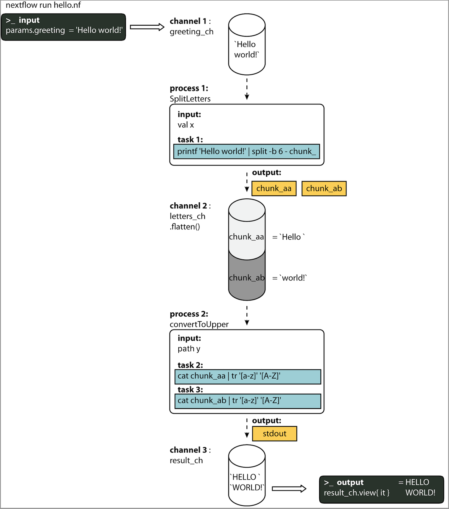

# Basic concepts

Nextflow is a workflow orchestration engine and domain-specific language (DSL) that makes it easy to write data-intensive computational workflows.

It is designed around the idea that the Linux platform is the _lingua franca_ of data science. Linux provides many simple but powerful command-line and scripting tools that, when chained together, facilitate complex data manipulations.

Nextflow extends this approach, adding the ability to define complex program interactions and a high-level parallel computational environment, based on the dataflow programming model. Nextflow’s core features are:

- Workflow portability and reproducibility
- Scalability of parallelization and deployment
- Integration of existing tools, systems, and industry standards

## Processes and Channels

In practice, a Nextflow workflow is made by joining together different processes. Each process can be written in any scripting language that can be executed by the Linux platform (Bash, Perl, Ruby, Python, etc.).

Processes are executed independently and are isolated from each other, i.e., they do not share a common (writable) state. The only way they can communicate is via asynchronous first-in, first-out (FIFO) queues, called `channels`. In other words, every input and output of a process is represented as a channel. The interaction between these processes, and ultimately the workflow execution flow itself, is implicitly defined by these `input` and `output` declarations.

<figure class="excalidraw">
--8<-- "docs/basic_training/img/channel-process.excalidraw.svg"
</figure>

## Execution abstraction

While a process defines _what_ command or `script` has to be executed, the executor determines _how_ that `script` is run in the target platform.

If not otherwise specified, processes are executed on the local computer. The local executor is very useful for workflow development and testing purposes, however, for real-world computational workflows a high-performance computing (HPC) or cloud platform is often required.

In other words, Nextflow provides an abstraction between the workflow’s functional logic and the underlying execution system (or runtime). Thus, it is possible to write a workflow that runs seamlessly on your computer, a cluster, or the cloud, without being modified. You simply define the target execution platform in the configuration file.

<figure markdown>


</figure>

## Scripting language

Nextflow implements a declarative DSL that simplifies the writing of complex data analysis workflows as an extension of a general-purpose programming language.

This approach makes Nextflow flexible — it provides the benefits of a concise DSL for the handling of recurrent use cases with ease **and** the flexibility and power of a general-purpose programming language to handle corner cases in the same computing environment. This would be difficult to implement using a purely declarative approach.

In practical terms, Nextflow scripting is an extension of the [Groovy programming language](https://groovy-lang.org/) which, in turn, is a super-set of the Java programming language. Groovy can be thought of as "Python for Java", in that it simplifies the writing of code and is more approachable.

## Your first script

Here you will execute your first Nextflow script (`hello.nf`), which we will go through line-by-line.

In this toy example, the script takes an input string (provided with a parameter called `params.greeting`) and splits it into chunks of six characters in the first process. The second process then converts the characters to upper case. The result is finally displayed on-screen.

### Nextflow code

<!-- NOTE: (Phil, Jan 2023)
We can dynamically include external files using mkdocs, as follows:

```groovy title="nf-training/hello.nf" linenums="1"
--8<-- "nf-training/hello.nf"
```

This inserts a code snippet identical to the one below, and we don't have to worry about keeping the two in sync.

HOWEVER - currently the line annotations cannot be added for external files. So for now, we still need to copy the scripts.

TODO: Maybe either:
    - Rewrite docs to not use loads of annotations
    - Wait for future versions to allow annotations with external files
-->

!!! info

    Click the :material-plus-circle: icons in the code for explanations.

```groovy title="nf-training/hello.nf" linenums="1"
#!/usr/bin/env nextflow
// (1)!
params.greeting = 'Hello world!' // (2)!
greeting_ch = channel.of(params.greeting) // (3)!

process SPLITLETTERS { // (4)!
    input: // (5)!
    val x // (6)!

    output: // (7)!
    path 'chunk_*' // (8)!

    script: // (9)!
    """
    printf '$x' | split -b 6 - chunk_
    """
} // (10)!

process CONVERTTOUPPER { // (11)!
    input: // (12)!
    path y // (13)!

    output: // (14)!
    stdout // (15)!

    script: // (16)!
    """
    cat $y | tr '[a-z]' '[A-Z]'
    """
} // (17)!

workflow { // (18)!
    letters_ch = SPLITLETTERS(greeting_ch) // (19)!
    results_ch = CONVERTTOUPPER(letters_ch.flatten()) // (20)!
    results_ch.view { it } // (21)!
} // (22)!
```

1. The code begins with a shebang, which declares Nextflow as the interpreter. This is optional, but recommended.
2. Declares a parameter `greeting` that is initialized with the value 'Hello world!'.
3. Initializes a `channel` labeled `greeting_ch`, which contains the value from `params.greeting`. Channels are the input type for processes in Nextflow.
4. Begins the first process block, defined as `SPLITLETTERS`.
5. Input declaration for the `SPLITLETTERS` process. Inputs can be values (`val`), files or paths (`path`), or other qualifiers ([see here](https://www.nextflow.io/docs/latest/process.html#inputs)).
6. Tells the process to expect an input value (`val`), that we assign to the variable 'x'.
7. Output declaration for the `SPLITLETTERS` process.
8. Tells the process to expect an output file(s) (`path`), with a filename starting with 'chunk\_', as output from the script. The process sends the output as a channel.
9. Three double quotes start and end the code block to execute this process.
   Inside is the code to execute — printing the `input` value 'x' (called using the dollar symbol [$] prefix), splitting the string into chunks with a length of 6 characters ("Hello " and "world!"), and saving each to a separate file (chunk_aa and chunk_ab).
10. End of the first process block.
11. Beginning of the second process block, defined as `CONVERTTOUPPER`.
12. Input declaration for the `CONVERTTOUPPER` process.
13. Tells the process to expect an `input` file (`path`; e.g. chunk_aa), that we assign to the variable 'y'.
14. Output declaration for the `CONVERTTOUPPER` process.
15. Tells the process to expect output as standard output (`stdout`) and sends this output as a channel.
16. Three double quotes start and end the code block to execute this process.
    Within the block there is a script to read files (cat) using the '$y' input variable, then pipe to uppercase conversion, outputting to standard output.
17. End of second process block.
18. Start of the workflow scope where each process can be called.
19. Execute the process `SPLITLETTERS` on the `greeting_ch` (aka greeting channel), and store the output in the channel `letters_ch`.
20. Execute the process `CONVERTTOUPPER` on the letters channel `letters_ch`, which is flattened using the operator `.flatten()`. This transforms the input channel in such a way that every item is a separate element. We store the output in the channel `results_ch`.
21. The final output (in the `results_ch` channel) is printed to screen using the `view` operator (appended onto the channel name).
22. End of the workflow scope.

This pipeline takes `params.greeting`, which defaults to the string `Hello world!`, and splits it into individual words in the `SPLITLETTERS` process. Each word is written to a separate file, named `chunk_aa`, `chunk_ab`, `chunk_ac`and so on. These files are picked up as the process `output`.

The second process `CONVERTTOUPPER` takes the output channel from the first process as its input.
The use of the operator `.flatten()` here is to split the `SPLITLETTERS` output channel element that contains two files into two separate elements to be put through the `CONVERTTOUPPER`process, else they would be treated as a single element.
The `CONVERTTOUPPER` process thus launches two tasks, one for each element. The bash script uses `cat` to print the file contents and `tr` to convert to upper-case. It takes the resulting standard-out as the process output channel.

### Python instead of bash

If you're not completely comfortable with the bash code used in the example, don't worry! You can use whatever programming language you like within Nextflow `script` blocks.
For example, the `hello_py.nf` file contains the same example but using Python code:

```python title="nf-training/hello_py.nf" linenums="14"
--8<-- "nf-training/hello_py.nf:14:18"
```

```python title="nf-training/hello_py.nf" linenums="30"
--8<-- "nf-training/hello_py.nf:30:32"
```

Note that the `$x` and `$y` variables are interpolated by Nextflow, so the resulting Python scripts will have fixed strings here (`#!python x="Hello world!"`). Check the `hello_py.nf` file for the full workflow script code.

### In practice

Now copy the above example into your favorite text editor and save it to a file named `hello.nf`.

!!! warning

    For the GitHub Codespaces tutorial, make sure you are in the folder called `nf-training`

Execute the script by entering the following command in your terminal:

```bash
nextflow run hello.nf
```

The output will look similar to the text shown below:

```console title="Output"
N E X T F L O W  ~  version 23.10.1
Launching hello.nf [cheeky_keller] DSL2 - revision: 197a0e289a
executor >  local (3)
[31/52c31e] process > SPLITLETTERS (1)   [100%] 1 of 1 ✔
[37/b9332f] process > CONVERTTOUPPER (2) [100%] 2 of 2 ✔
HELLO
WORLD!
```

1. The version of Nextflow that was executed.
2. The script and version names.
3. The executor used (in the above case: local).
4. The first process is executed once, which means there is one task. The line starts with a unique hexadecimal value (see TIP below), and ends with the percentage and other task completion information.
5. The second process is executed twice (once for `chunk_aa` and once for `chunk_ab`), which means two tasks.
6. The result string from `stdout` is printed.

!!! info

    The hexadecimal numbers, like `31/52c31e`, identify the unique process execution, that we call a task. These numbers are also the prefix of the directories where each task is executed. You can inspect the files produced by changing to the directory `$PWD/work` and using these numbers to find the task-specific execution path.

!!! tip

    The second process runs twice, executing in two different work directories for each input file. The [ANSI](https://en.wikipedia.org/wiki/ANSI_escape_code) log output from Nextflow dynamically refreshes as the workflow runs; in the previous example the work directory `[37/b9332f]` is the second of the two directories that were processed (overwriting the log with the first). To print all the relevant paths to the screen, disable the ANSI log output using the `-ansi-log` flag (e.g., `nextflow run hello.nf -ansi-log false`).

It’s worth noting that the process `CONVERTTOUPPER` is executed in parallel, so there’s no guarantee that the instance processing the first split (the chunk _Hello _) will be executed before the one processing the second split (the chunk _world!_).

Thus, it could be that your final result will be printed out in a different order:

```console title="Output"
WORLD!
HELLO
```

## Modify and resume

Nextflow keeps track of all the processes executed in your workflow. If you modify some parts of your script, only the processes that are changed will be re-executed. The execution of the processes that are not changed will be skipped and the cached result will be used instead.

This allows for testing or modifying part of your workflow without having to re-execute it from scratch.

For the sake of this tutorial, modify the `CONVERTTOUPPER` process in the previous example, replacing the process script with the string `rev $y`, so that the process looks like this:

```groovy title="nf-training/hello.nf" linenums="18"
process CONVERTTOUPPER {
    input:
    path y

    output:
    stdout

    script:
    """
    rev $y
    """
}
```

Then save the file with the same name, and execute it by adding the `-resume` option to the command line:

```bash
$ nextflow run hello.nf -resume
```

```console title="Output"
N E X T F L O W  ~  version 23.10.1
Launching `hello.nf` [zen_colden] DSL2 - revision: 0676c711e8
executor >  local (2)
[31/52c31e] process > SPLITLETTERS (1)   [100%] 1 of 1, cached: 1 ✔
[0f/8175a7] process > CONVERTTOUPPER (1) [100%] 2 of 2 ✔
!dlrow
 olleH
```

You will see that the execution of the process `SPLITLETTERS` is skipped (the task ID is the same as in the first output) — its results are retrieved from the cache. The second process is executed as expected, printing the reversed strings.

!!! info

    The workflow results are cached by default in the directory `$PWD/work`. Depending on your script, this folder can take up a lot of disk space. If you are sure you won’t need to resume your workflow execution, clean this folder periodically.

## Workflow parameters

Workflow parameters are simply declared by prepending the prefix `params` to a variable name, separated by a dot character. Their value can be specified on the command line by prefixing the parameter name with a double dash character, i.e. `--paramName`.

Now, let’s try to execute the previous example specifying a different input string parameter, as shown below:

```bash
nextflow run hello.nf --greeting 'Bonjour le monde!'
```

The string specified on the command line will override the default value of the parameter. The output will look like this:

```console title="Output"
N E X T F L O W  ~  version 23.10.1
Launching `hello.nf` [goofy_kare] DSL2 - revision: 0676c711e8
executor >  local (4)
[8b/7c7d13] process > SPLITLETTERS (1)   [100%] 1 of 1 ✔
[58/3b2df0] process > CONVERTTOUPPER (3) [100%] 3 of 3 ✔
uojnoB
m el r
!edno
```

## In DAG-like format

To better understand how Nextflow is dealing with the data in this workflow, below is a DAG-like figure to visualize all the inputs, outputs, channels and processes:

<figure markdown>



</figure>
