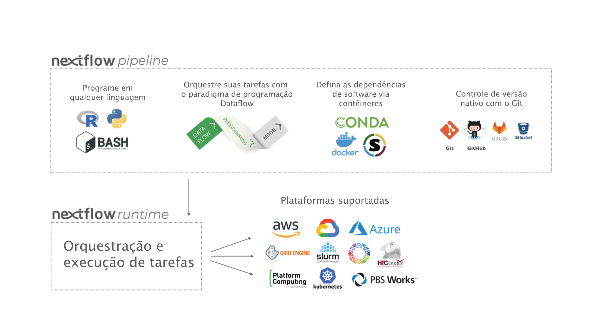
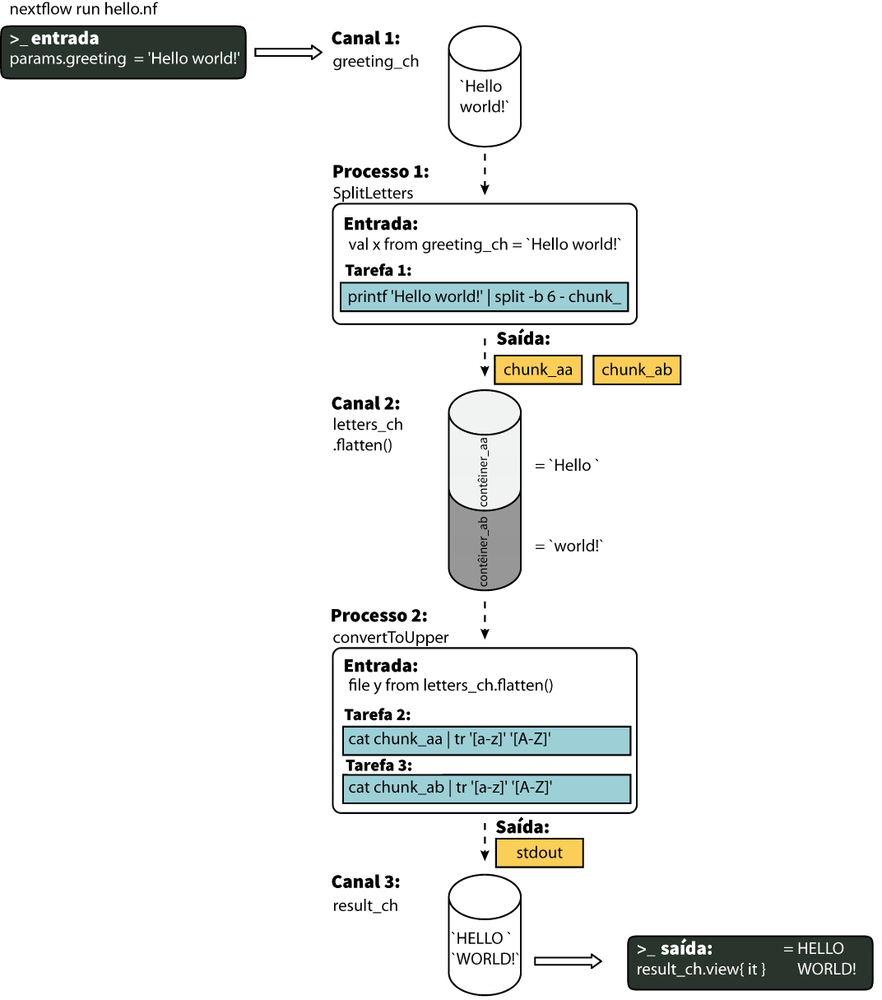

!!! warning

    Some of the translations on the training portal are out of date.
    The translated material may be incomplete or incorrect.
    We plan to update the translations later this year.
    In the meantime, please try to work through the English-language material if you can.

# Introdução

## Conceitos básicos

O Nextflow é tanto um motor de orquestração de fluxo de trabalho quanto uma linguagem de domínio específico (Domain-Specific Language - DSL) que facilita a escrita de fluxos de trabalho computacionais que fazem uso intensivo de dados.

Ele foi projetado com base na ideia de que a plataforma Linux é a _língua franca_ da ciência de dados. O Linux fornece muitas ferramentas de linha de comando que, ainda que simples, são poderosas ferramentas de script que, quando encadeadas, facilitam manipulações complexas de dados.

O Nextflow estende essa abordagem, adicionando a capacidade de definir interações complexas entre programas e um ambiente de computação paralela de alto nível, baseado no modelo de programação Dataflow. Os principais recursos do Nextflow são:

- Portabilidade e reprodutibilidade de fluxos de trabalho
- Escalabilidade na paralelização e na implantação
- Integração de ferramentas já existentes, sistemas e padrões da indústria

### Processos e Canais

Na prática, um fluxo de trabalho Nextflow é feito juntando diferentes processos. Cada processo pode ser escrito em qualquer linguagem de script que possa ser executada pela plataforma Linux (Bash, Perl, Ruby, Python, etc.).

Os processos são executados de forma independente e isolados uns dos outros, ou seja, não compartilham um estado (gravável) comum. A única maneira de eles se comunicarem é por meio de filas assíncronas, chamadas de `canais`, onde o primeiro elemento a entrar, é o primeiro a sair (FIFO - First-in-First-out).

Qualquer processo pode definir um ou mais `canais` como uma `entrada` e `saída`. A interação entre esses processos e, em última análise, o próprio fluxo de execução do fluxo de trabalho, é definido implicitamente por essas declarações de `entrada` e `saída`.

<figure class="excalidraw">
--8<-- "docs/basic_training/img/channel-process.excalidraw.pt.svg"
</figure>

### Abstração de execução

Enquanto um processo define _qual_ comando ou `script` deve ser executado, o executor determina _como_ esse `script` é executado na plataforma alvo.

Se não for especificado de outra forma, os processos são executados no computador local. O executor local é muito útil para fins de desenvolvimento e teste de fluxos de trabalho, no entanto, para fluxos de trabalho computacionais do mundo real, uma plataforma de computação de alto desempenho (High-Performance Computing - HPC) ou de computação em nuvem geralmente é necessária.

Em outras palavras, o Nextflow fornece uma abstração entre a lógica funcional do fluxo de trabalho e o sistema de execução subjacente (ou sistema de tempo de execução). Assim, é possível escrever um fluxo de trabalho que seja executado perfeitamente em seu computador, em um cluster ou na nuvem, sem ser modificado. Você simplesmente define a plataforma de execução alvo no arquivo de configuração.

<figure markdown>



</figure>

### Linguagem de script

O Nextflow implementa uma DSL declarativa que simplifica a escrita de fluxos de trabalho complexos de análise de dados como uma extensão de uma linguagem de programação de uso geral.

Essa abordagem torna o Nextflow flexível — ele fornece os benefícios de uma DSL concisa para lidar com casos de uso recorrentes com facilidade **e** a flexibilidade e o poder de uma linguagem de programação de propósito geral para lidar com casos extremos no mesmo ambiente de computação. Isso seria difícil de implementar usando uma abordagem puramente declarativa.

Em termos práticos, a linguagem de script Nextflow é uma extensão da [linguagem de programação Groovy](https://groovy-lang.org/) a qual, por sua vez, é um superconjunto da linguagem de programação Java. Groovy pode ser pensado como "Python para Java", pois simplifica a escrita do código e é mais acessível.

## Seu primeiro script

Aqui você executará seu primeiro script Nextflow (`hello.nf`), que veremos linha por linha.

Neste exemplo ilustrativo, o script recebe no primeiro processo uma string de entrada (um parâmetro chamado `params.greeting`) e a divide em blocos de seis caracteres. O segundo processo converte os caracteres em maiúsculas. O resultado é então finalmente exibido na tela.

### Código em Nextflow

<!-- NOTE: (Phil, Jan 2023)
We can dynamically include external files using mkdocs, as follows:

```groovy title="nf-training/hello.nf" linenums="1"
--8<-- "nf-training/hello.nf"
```

This inserts a code snippet identical to the one below, and we don't have to worry about keeping the two in sync.

HOWEVER - currently the line annotations cannot be added for external files. So for now, we still need to copy the scripts.

TODO: Maybe either:
    - Rewrite docs to not use loads of annotations
    - Wait for future versions to allow annotations with external files
-->

!!! info

    Clique no ícone :material-plus-circle: no código para ver explicações.

```groovy title="nf-training/hello.nf" linenums="1"
#!/usr/bin/env nextflow
// (1)!

params.greeting = 'Hello world!' // (2)!
greeting_ch = channel.of(params.greeting) // (3)!

process SPLITLETTERS { // (4)!
    input: // (5)!
    val x // (6)!

    output: // (7)!
    path 'chunk_*' // (8)!

    script: // (9)!
    """
    printf '$x' | split -b 6 - chunk_
    """
} // (10)!

process CONVERTTOUPPER { // (11)!
    input: // (12)!
    path y // (13)!

    output: // (14)!
    stdout // (15)!

    script: // (16)!
    """
    cat $y | tr '[a-z]' '[A-Z]'
    """
} // (17)!

workflow { // (18)!
    letters_ch = SPLITLETTERS(greeting_ch) // (19)!
    results_ch = CONVERTTOUPPER(letters_ch.flatten()) // (20)!
    results_ch.view { it } // (21)!
} // (22)!
```

1. O código começa com um shebang, que declara o Nextflow como o interpretador.
2. Declara um parâmetro `greeting` que é inicializado com o valor 'Hello world!'.
3. Inicializa um canal chamado `greeting_ch`, que contém o valor de `params.greeting`. Os canais são o tipo de entrada para processos no Nextflow.
4. Inicia o primeiro bloco do processo, definido como `SPLITLETTERS`.
5. Declaração de entrada para o processo `SPLITLETTERS`. As entradas podem ser valores (`val`), arquivos ou caminhos (`path`), ou ainda outros qualificadores ([veja aqui](https://www.nextflow.io/docs/latest/process.html#inputs)).
6. Diz ao processo para esperar um valor de entrada (`val`), que atribuímos à variável 'x'.
7. Declaração de saída para o processo `SPLITLETTERS`.
8. Diz ao processo para esperar um ou mais arquivos de saída (`path`), com um nome de arquivo começando com 'chunk\_', como saída do script. O processo envia a saída como um canal.
9. Três aspas duplas iniciam e terminam o bloco de código para executar este processo. Dentro está o código a ser executado — imprimindo o valor de `entrada` x (chamado usando o prefixo do símbolo de dólar [$]), dividindo a string em pedaços com um comprimento de 6 caracteres ("Hello " e "world!") e salvando cada um para um arquivo (chunk_aa e chunk_ab).
10. Fim do primeiro bloco de processo.
11. Inicia o segundo bloco de processo, definido como `CONVERTTOUPPER`.
12. Declaração de entrada para o processo `CONVERTTOUPPER`.
13. Diz ao processo para esperar um ou mais arquivos de `entrada` (`path`; ou seja, chunk_aa e chunk_ab), que atribuímos à variável 'y'.
14. Declaração de saída para o processo `CONVERTTOUPPER`.
15. Diz ao processo para esperar a saída padrão (stdout) como saída e envia essa saída como um canal.
16. Três aspas duplas iniciam e terminam o bloco de código para executar este processo. Dentro do bloco, há um script para ler arquivos (cat) usando a variável de entrada '$y' e, em seguida, um pipe (|) para a conversão em maiúsculas, imprimindo na saída padrão.
17. Fim do segundo bloco de processo.
18. Início do bloco de fluxo de trabalho (`workflow`) onde cada processo pode ser chamado.
19. Execute o processo `SPLITLETTERS` no `greeting_ch` (também conhecido como canal de saudação) e armazene a saída no canal `letters_ch`.
20. Execute o processo `CONVERTTOUPPER` no canal de letras `letters_ch`, que é achatado usando o operador `.flatten()`. Isso transforma o canal de entrada de forma que cada item seja um elemento separado. Armazenamos a saída no canal `results_ch`.
21. A saída final (no canal `results_ch`) é impressa na tela usando o operador `view` (aplicado ao nome do canal).
22. Fim do bloco do fluxo de trabalho (`workflow`).

O uso do operador `.flatten()` aqui é para dividir os dois arquivos em dois itens separados para serem colocados no próximo processo (caso contrário, eles seriam tratados como um único elemento).

### Hora de praticar

Agora copie o exemplo acima em seu editor de texto favorito e salve-o em um arquivo chamado `hello.nf`.

!!! warning

    Para o tutorial do Gitpod, verifique se você está na pasta chamada `nf-training`

Execute o script digitando o seguinte comando em seu terminal:

```bash
nextflow run hello.nf
```

A saída será semelhante ao texto mostrado abaixo:

```linenums="1"
N E X T F L O W  ~  version 23.04.1
Launching `hello.nf` [cheeky_keller] DSL2 - revision: 197a0e289a
executor >  local (3)
[31/52c31e] process > SPLITLETTERS (1)   [100%] 1 of 1 ✔
[37/b9332f] process > CONVERTTOUPPER (2) [100%] 2 of 2 ✔
HELLO
WORLD!
```

A saída padrão mostra (linha por linha):

1. A versão do Nextflow que foi executada.
2. Os nomes do script e da versão.
3. O executor usado (no caso acima: local).
4. O primeiro processo é executado uma vez, o que significa que houve 1 tarefa. A linha começa com um valor hexadecimal exclusivo (consulte a dica abaixo) e termina com a porcentagem e outras informações de conclusão da tarefa.
5. O segundo processo é executado duas vezes (uma vez para chunk_aa e outra para chunk_ab), o que significa duas tarefas.
6. A string de resultado de stdout é impressa na tela.

!!! info

    Os números hexadecimais, como `31/52c31e`, identificam de forma única a execução do processo. Esses números também são o prefixo dos diretórios onde cada tarefa é executado. Você pode inspecionar os arquivos produzidos mudando para o diretório `$PWD/work` e usando esses números para encontrar o caminho de execução específico da tarefa.

!!! tip

    O segundo processo é executado duas vezes, em dois diretórios de trabalho diferentes para cada arquivo de entrada. A saída de log [ANSI](https://en.wikipedia.org/wiki/ANSI_escape_code) do Nextflow é atualizada dinamicamente conforme o fluxo de trabalho é executado; no exemplo anterior, o diretório de trabalho `[37/b9332f]` é o segundo dos dois diretórios que foram processados (sobrescrevendo o log com o primeiro). Para imprimir para a tela todos os caminhos relevantes, desative a saída de log ANSI usando o sinalizador `-ansi-log` (por exemplo, `nextflow run hello.nf -ansi-log false`).

Vale ressaltar que o processo `CONVERTTOUPPER` é executado em paralelo, portanto não há garantia de que a instância que processa a primeira divisão (o bloco _Hello_) será executada antes daquela que processa a segundo divisão (o bloco _world!_).

Assim, pode ser que seu resultado final seja impresso em uma ordem diferente:

```
WORLD!
HELLO
```

## Modifique e retome

O Nextflow acompanha todos os processos executados em seu fluxo de trabalho. Se você modificar algumas partes do seu script, apenas os processos alterados serão executados novamente. A execução dos processos que não foram alterados será ignorada e o resultado armazenado em cache será usado em seu lugar.

Isso permite testar ou modificar parte do fluxo de trabalho sem precisar executá-lo novamente do zero.

Para este tutorial, modifique o processo `CONVERTTOUPPER` do exemplo anterior, substituindo o script do processo pela string `rev $y`, para que o processo fique assim:

```groovy
process CONVERTTOUPPER {
    input:
    path y

    output:
    stdout

    script:
    """
    rev $y
    """
}
```

Em seguida, salve o arquivo com o mesmo nome e execute-o adicionando a opção `-resume` à linha de comando:

```console
$ nextflow run hello.nf -resume

N E X T F L O W  ~  version 23.04.1
Launching `hello.nf` [zen_colden] DSL2 - revision: 0676c711e8
executor >  local (2)
[31/52c31e] process > SPLITLETTERS (1)   [100%] 1 of 1, cached: 1 ✔
[0f/8175a7] process > CONVERTTOUPPER (1) [100%] 2 of 2 ✔
!dlrow
 olleH
```

Você verá que a execução do processo `SPLITLETTERS` é ignorada (o ID da tarefa é o mesmo da primeira saída) — seus resultados são recuperados do cache. O segundo processo é executado conforme o esperado, imprimindo as strings invertidas.

!!! info

    Os resultados do fluxo de trabalho são armazenados em cache por padrão no diretório `$PWD/work`. Dependendo do seu script, esta pasta pode ocupar muito espaço em disco. Se tiver certeza de que não precisará retomar a execução do fluxo de trabalho, limpe esta pasta periodicamente.

## Parâmetros do fluxo de trabalho

Os parâmetros de fluxo de trabalho são declarados simplesmente adicionando o prefixo `params` a um nome de variável, separando-os por um caractere de ponto. Seu valor pode ser especificado na linha de comando prefixando o nome do parâmetro com um traço duplo, ou seja, `--nomeParametro`.

Agora, vamos tentar executar o exemplo anterior especificando um parâmetro de string de entrada diferente, conforme mostrado abaixo:

```bash
nextflow run hello.nf --greeting 'Bonjour le monde!'
```

A string especificada na linha de comando substituirá o valor padrão do parâmetro. A saída ficará assim:

```
N E X T F L O W  ~  version 23.04.1
Launching `hello.nf` [goofy_kare] DSL2 - revision: 0676c711e8
executor >  local (4)
[8b/7c7d13] process > SPLITLETTERS (1)   [100%] 1 of 1 ✔
[58/3b2df0] process > CONVERTTOUPPER (3) [100%] 3 of 3 ✔
uojnoB
m el r
!edno
```

### Em formato de DAG

Para entender melhor como o Nextflow está lidando com os dados neste fluxo de trabalho, abaixo está uma figura tipo DAG para visualizar todas as entradas (`input`), saídas (`output`), canais (`channel`) e processos (`process`):

<figure markdown>



</figure>
