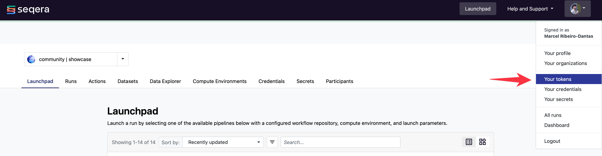
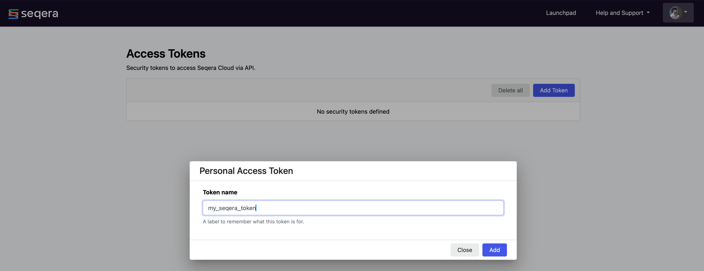
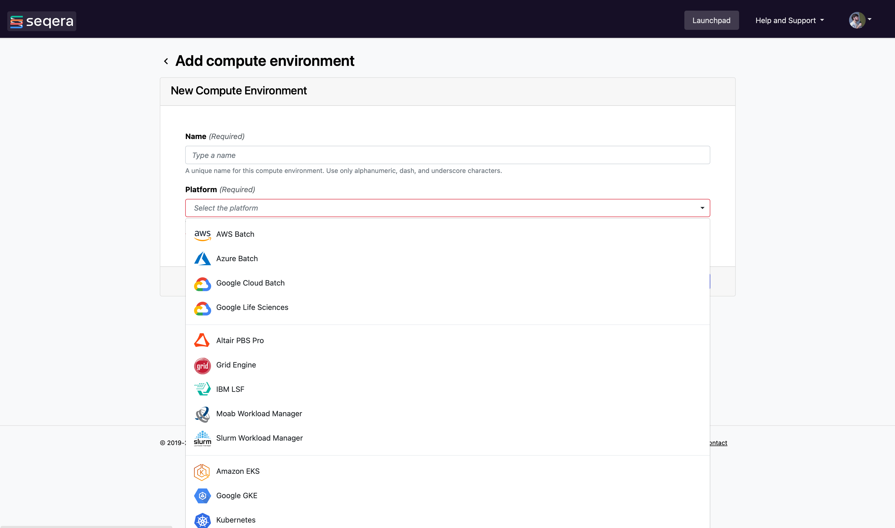
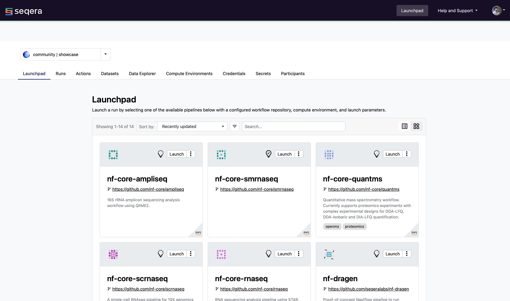

!!! warning

    Some of the translations on the training portal are out of date.
    The translated material may be incomplete or incorrect.
    We plan to update the translations later this year.
    In the meantime, please try to work through the English-language material if you can.

# Demarrer avec Seqera Platform

## Concept de Base

Seqera Platform, anciennement connu sous le nom Nextflow Tower, est le poste de commande centralisé pour la gestion des données et des workflows. Il apporte la surveillance, la journalisation et l'observabilité aux flux de travail distribués et simplifie le déploiement des flux de travail sur n'importe quel cloud, cluster ou ordinateur portable. Dans la terminologie de Seqera Platform, un flux de travail est ce sur quoi nous avons travaillé jusqu'à présent, et les pipelines sont des workflows préconfigurés qui peuvent être utilisés par tous les utilisateurs d'un espace de travail. Il est composé d'un repositoire de workflows, de paramètres de lancement et d'un environnement de calcul. Nous nous en tiendrons à ces définitions dans cette section.

Les principales caractéristiques de Seqera Platform sont les suivantes

- Le lancement de pipelines préconfigurés en toute simplicité.
- L'intégration programmatique pour répondre aux besoins d'une organisation.
- La publication de pipelines dans des espaces de travail partagés.
- La gestion de l'infrastructure nécessaire à l'exécution d'analyses de données à grande échelle.

!!! conseil

    [Inscrivez-vous](https://cloud.tower.nf/) pour essayer Seqera Platform gratuitement ou demander une [demo](https://seqera.io/demo/) pour des déploiements dans votre propre environnement sur site ou en could.

## Utilisation

Vous pouvez utiliser Seqera Platform via l'option `-with-tower` lors de l'utilisation de la commande `nextflow run`, via l'interface graphique **en ligne** ou via l'interface utilisateur **API**.

### Via la commande `nextflow run`.

Créez un compte et connectez-vous à Seqera Platform.

**1. Créer un nouveau jeton**

Vous pouvez accéder à vos jetons à partir du menu déroulant **Réglages** :



**2. Nommez votre jeton**



**3. Sauvegardez votre jeton en toute sécurité**

Copiez et conservez votre nouveau jeton en lieu sûr.


**4. Exporter votre jeton**

Une fois que votre jeton a été créé, ouvrez un terminal et tapez :

```bash
export TOWER_ACCESS_TOKEN=eyxxxxxxxxxxxxxxxQ1ZTE=
```

Où `eyxxxxxxxxxxxQ1ZTE=` est le jeton que vous venez de créer.

!!! remarque

    Vérifiez votre `nextflow -version`. Les porteurs de jetons nécessitent la version 20.10.0 ou plus récente de Nextflow et peuvent être configurés avec la seconde commande ci-dessus. Vous pouvez changer la version si nécessaire.

Pour soumettre un pipeline à un [espace de travail](https://help.tower.nf/getting-started/workspace/) en utilisant l'outil de ligne de commande Nextflow, ajoutez l'ID de l'espace de travail à votre environnement. Par exemple :

```bash
export TOWER_WORKSPACE_ID=000000000000000
```

L'identifiant de l'espace de travail se trouve sur la page de présentation des espaces de travail de l'organisation.

**5. Exécuter Nextflow avec Seqera Platform**

Exécutez vos workflows Nextflow comme d'habitude avec l'ajout de la commande `-with-tower` :

```bash
nextflow run hello.nf -with-tower
```

Vous verrez et pourrez suivre vos **Nextflow jobs** dans Seqera Platform.

Pour configurer et exécuter des jobs Nextflow dans des **environnements Cloud**, visitez la [section Environnements de calcul](https://help.tower.nf/compute-envs/overview/).

!!! exercise

    Exécutez le fichier RNA-Seq `script7.nf` en utilisant le flag `-with-tower`, après avoir correctement complété les paramètres de jetons décrits ci-dessus.

    ??? conseil

        Allez sur <https://tower.nf/>, connectez-vous, cliquez sur l'onglet run et sélectionnez le run que vous venez de soumettre. Si vous ne le trouvez pas, vérifiez que votre jeton a été saisi correctement.

### Via l'interface graphique en ligne

L'exécution à l'aide de l'interface graphique se fait en trois étapes principales :

1. Créer un compte et se connecter à Seqera Platform, disponible gratuitement à l'adresse [tower.nf](https://tower.nf).
2. Créer et configurer un nouvel [environnement de calcul](https://help.tower.nf/compute-envs/overview/).
3. Lancez [le lancement des pipelines](https://help.tower.nf/launch/launchpad/).

#### Configurer votre environnement informatique

ower utilise le concept de **Compute Environments** pour définir la plateforme d'exécution où un flux de travail sera exécuté.

Il permet de lancer des flux de travail dans un nombre croissant d'infrastructures **cloud** et **on-premise**.



Chaque environnement de calcul doit être préconfiguré pour permettre à Seqera Platform de soumettre des tâches. Pour en savoir plus sur la configuration de chaque environnement, cliquez sur les liens ci-dessous.

!!! conseil "Les guides suivants décrivent comment configurer chacun de ces environnements informatiques".

    * [AWS Batch](https://help.tower.nf/compute-envs/aws-batch/)
    * [Azure Batch](https://help.tower.nf/compute-envs/azure-batch/)
    * [Google Batch](https://help.tower.nf/compute-envs/google-cloud-batch/)
    * [Google Life Sciences](https://help.tower.nf/compute-envs/google-cloud-lifesciences/)
    * [IBM LSF](https://help.tower.nf/compute-envs/lsf/)
    * [Slurm](https://help.tower.nf/compute-envs/slurm/)
    * [Grid Engine](https://help.tower.nf/compute-envs/altair-grid-engine/)
    * [Altair PBS Pro](https://help.tower.nf/compute-envs/altair-pbs-pro/)
    * [Amazon Kubernetes (EKS)](https://help.tower.nf/compute-envs/eks/)
    * [Google Kubernetes (GKE)](https://help.tower.nf/compute-envs/gke/)
    * [Hosted Kubernetes](https://help.tower.nf/compute-envs/k8s/)

#### Sélection d'un environnement informatique par défaut

Si vous avez plus d'un **Environnement informatique**, vous pouvez sélectionner celui qui sera utilisé par défaut lors du lancement d'un pipeline.

1. Naviguez vers vos [environnements de informatique](https://help.tower.nf/compute-envs/overview/).
2. Choisissez votre environnement par défaut en sélectionnant le bouton **Make primary**.

**Felicitations!**

Vous êtes maintenant prêt à lancer des flux de travail avec votre environnement de calcul principal.

#### Launchpad

Launchpad permet à tout utilisateur de l'espace de travail de lancer facilement un pipeline préconfiguré.



Un pipeline est un repositoire contenant un flux de travail Nextflow, un environnement de calcul et des paramètres de workflow.

#### Formulaire des paramètres du pipeline

Launchpad détecte automatiquement la présence d'un `nextflow_schema.json` dans la racine du référentiel et crée dynamiquement un formulaire où les utilisateurs peuvent facilement mettre à jour les paramètres.

!!! info

    La vue des formulaires de paramètres apparaîtra si le pipeline dispose d'un fichier de schéma Nextflow pour les paramètres. Veuillez vous référer au [Guide du schéma Nextflow](https://help.tower.nf/workflow-schema/overview) pour en savoir plus sur les cas d'utilisation des fichiers de schéma et sur la manière de les créer.

Cela permet aux utilisateurs qui n'ont pas d'expertise en Nextflow de saisir les paramètres de leur workflow et de le lancer.


#### Ajouter une nouveau pipeline

L'ajout d'un pipeline à la zone de lancement de l'espace de travail préenregistré est décrit en détail dans la [documentation de la page web de la Seqera Platform](https://help.tower.nf/launch/launch/).

En bref, voici les étapes à suivre pour mettre en place une filière.

1. Sélectionnez le bouton Launchpad dans la barre de navigation. Le **Launch Form** s'ouvre alors.
2. Sélectionnez un [environnement informatique](https://help.tower.nf/compute-envs/overview).
3. Saisissez le repositoire du workflow que vous souhaitez lancer, par exemple <https://github.com/nf-core/rnaseq.git>.
4. Sélectionner un workflow **Numéro de révision**. La branche par défaut de Git (main/master) ou `manifest.defaultBranch` dans la configuration de Nextflow sera utilisée par défaut.
5. Définir l'emplacement **Répertoire de travail** du répertoire de travail de Nextflow. L'emplacement associé à l'environnement informatique sera sélectionné par défaut.
6. Entrez le(s) nom(s) de chacun des **profils de configuration** de Nextflow suivi de la touche `Enter`. Voir la documentation Nextflow [Configuration des profiles](https://www.nextflow.io/docs/latest/config.html#config-profiles) pour plus de détails.
7. Saisissez les paramètres du workflow au format YAML ou JSON. Exemple YAML :

   ```yaml
   reads: "s3://nf-bucket/exome-data/ERR013140_{1,2}.fastq.bz2"
   paired_end: true
   ```

8. Sélectionnez Launch (Lancer) pour commencer l'exécution du pipeline.

!!! info

    Les workflows Nextflow sont simplement des repositoires Git et peuvent être changés pour n'importe quelle plateforme d'hébergement Git publique ou privée. Voir [Git Integration](https://help.tower.nf/git/overview/) dans la documentation Seqera Platform et [Partage de Pipeline ](https://www.nextflow.io/docs/latest/sharing.html) dans la documentation Nextflow pour plus de détails.

!!! remarque

    Les informations d'identification associées à l'environnement de informatique doivent pouvoir accéder au répertoire de travail.

!!! info

    Dans la configuration, le chemin d'accès complet à un godet doit être spécifié entre guillemets simples pour les chaînes de caractères et sans guillemets pour les booléens ou les nombres.

!!! conseil

    Pour créer votre propre schéma Nextflow personnalisé pour votre workflow, consultez les exemples des workflows `nf-core` qui ont adopté cette approche. Par exemple, [eager](https://github.com/nf-core/eager/blob/2.3.3/nextflow_schema.json) et [rnaseq](https://github.com/nf-core/rnaseq/blob/3.0/nextflow_schema.json).

Pour les options de paramétrage avancées, consultez cette [page](https://help.tower.nf/launch/advanced/).

Un soutien communautaire est également disponible en cas de problème, rejoignez le Slack Nextflow en suivant ce [lien](https://www.nextflow.io/slack-invite.html).

### API

Pour en savoir plus sur l'utilisation de l'API Seqera Platform, consultez la [section API](https://help.tower.nf/api/overview/) de cette documentation.

## Espaces de travail et organisations

Seqera Platform simplifie le développement et l'exécution des pipelines en fournissant une interface centralisée pour les utilisateurs et les organisations.

Chaque utilisateur dispose d'un **espace de travail** unique où il peut interagir et gérer toutes les ressources telles que les flux de travail, les environnements informatiques et les credits. Les détails sont disponibles [ici](https://help.tower.nf/getting-started/workspace/).

Les organisations peuvent avoir plusieurs espaces de travail avec un accès personnalisé pour les **membres** et **collaborateurs** de l'organisation.

### Ressources de l'organisation

Vous pouvez créer votre propre organisation et votre propre espace de travail pour les participants en suivant la documentation à [Seqera Platform](https://help.tower.nf/orgs-and-teams/workspace-management/).

Seqera Platform permet la création de plusieurs organisations, chacune pouvant contenir plusieurs espaces de travail avec des utilisateurs et des ressources partagés. Cela permet à toute organisation de personnaliser et d'organiser l'utilisation des ressources tout en maintenant une couche de contrôle d'accès pour les utilisateurs associés à un espace de travail.

### Organisation utilisateurs

Tout utilisateur peut être ajouté ou supprimé d'une organisation particulière ou d'un espace de travail et peut se voir attribuer un rôle d'accès spécifique au sein de cet espace de travail.

La fonction Teams (Équipes) permet aux organisations de regrouper divers utilisateurs et participants en équipes. Par exemple, `développeurs de workflow` ou `analystes`, et d'appliquer le contrôle d'accès à tous les utilisateurs de cette équipe collectivement.

Pour plus d'informations, veuillez vous referez à la section [Gestion des utilisateurs](https://help.tower.nf/orgs-and-teams/organizations/).

#### Mise en place d'une nouvelle organisation

Les organisations constituent la structure de premier niveau et contiennent des espaces de travail, des membres, des équipes et des collaborateurs.

Pour créer une nouvelle organisation :

1.  Cliquez sur le menu déroulant à côté de votre nom et sélectionnez Nouvelle organisation pour ouvrir la boîte de dialogue de création.
2.  Dans la boîte de dialogue, remplissez les champs en fonction de votre organisation. Les champs Nom et Nom complet sont obligatoires.

    !!! remarque

        Un nom valide pour l'organisation doit suivre un modèle spécifique. Veuillez vous référer à l'interface utilisateur pour plus d'informations.

3.  Les autres champs, tels que la description, la localisation, l'URL du site web et l'URL du logo, sont facultatifs.
4.  Une fois les détails renseignés, vous pouvez accéder à l'organisation nouvellement créée en utilisant la page de l'organisation, qui répertorie toutes vos organisations.

    !!! remarque

        Il est possible de modifier les valeurs des champs facultatifs soit en utilisant l'option Modifier sur la page de l'organisation, soit en utilisant l'onglet Paramètres sur la page de l'organisation, à condition d'être le propriétaire de l'organisation.

    !!! conseil

        Une liste de tous les membres, équipes et collaborateurs inclus se trouve sur la page de l'organisation.
