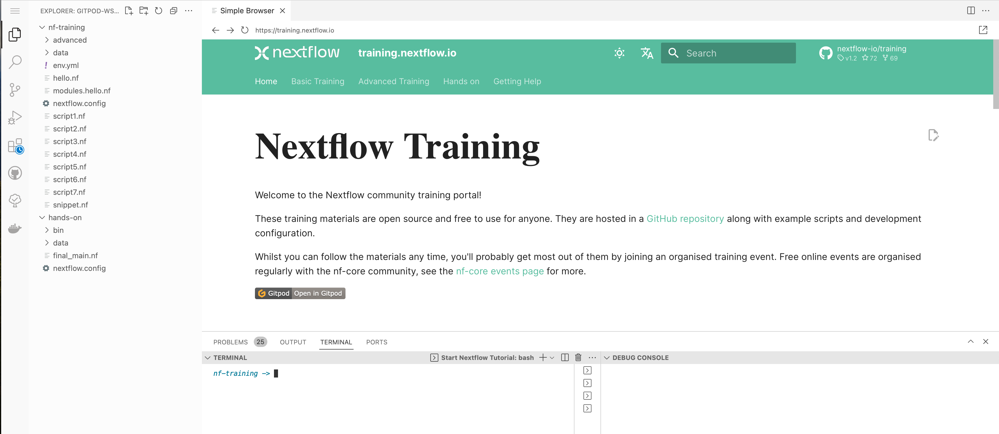

!!! warning

    Some of the translations on the training portal are out of date.
    The translated material may be incomplete or incorrect.
    We plan to update the translations later this year.
    In the meantime, please try to work through the English-language material if you can.

# Configuração do ambiente

Existem duas principais maneiras de começar este treinamento da Comunidade do Nextflow.

A primeira é instalar os requisitos [localmente](#instalacao-local), o que é melhor se você já estiver familiarizado com Git e Docker ou trabalhando offline.

A segunda é usar o [Gitpod](#gitpod), o que é melhor para iniciantes, pois esta plataforma contém todos os programas e dados necessários. Basta clicar no link abaixo e fazer login usando sua conta do GitHub para iniciar o tutorial:

[](https://codespaces.new/nextflow-io/training?quickstart=1&ref=master)

## Instalação local

O Nextflow pode ser usado em qualquer sistema compatível com POSIX (Linux, macOS, Windows Subsystem for Linux, etc.).

#### Requisitos

- Bash
- [Java 11 (ou uma versão posterior, até a 18)](https://www.oracle.com/technetwork/java/javase/downloads/index.html)
- Git
- [Docker](https://docs.docker.com/get-docker/)

#### Requisitos opcionais para este tutorial

- [Singularity](https://github.com/sylabs/singularity) 2.5.x (ou uma versão posterior)
- [Conda](https://conda.io/) 4.5 (ou uma versão posterior)
- [Graphviz](http://www.graphviz.org/)
- [AWS CLI](https://aws.amazon.com/cli/)
- Um ambiente de computação do AWS Batch configurado

### Baixe o Nextflow

Digite este comando no seu terminal:

```bash
wget -qO- https://get.nextflow.io | bash
```

Ou, se preferir o `curl`:

```bash
curl -s https://get.nextflow.io | bash
```

Em seguida, certifique-se que o binário baixado é executável:

```bash
chmod +x nextflow
```

E coloque o executável `nextflow` em seu `$PATH` (por exemplo, `/usr/local/bin` ou `/bin/`)

### Docker

Certifique-se de ter o Docker Desktop em execução em sua máquina. Baixe o Docker [aqui](https://docs.docker.com/get-docker/).

### Material de treinamento

Você pode ver o material de treinamento aqui: <https://training.nextflow.io/>

Para baixar o material use o comando:

```bash
git clone https://github.com/nextflow-io/training.git
```

Em seguida, `cd` no diretório `nf-training`.

### Verificando sua instalação

Verifique se o `nextflow` foi instalado corretamente executando o seguinte comando:

```bash
nextflow info
```

Isso deve mostrar a versão atual, sistema operacional e sistema de tempo de execução.

## Gitpod

Um ambiente de desenvolvimento Nextflow pré-configurado está disponível no Gitpod.

#### Requisitos

- Uma conta no GitHub
- Navegador Web (Google Chrome, Firefox)
- Conexão com a Internet

### Gitpod quick start

Para executar o Gitpod:

- Clique na URL a seguir: <https://gitpod.io/#https://github.com/nextflow-io/training>
  - Essa URL é o link do repositório do treinamento no GitHub, prefixado com `https://gitpod.io/#`
- Faça login na sua conta do GitHub (e permita a autorização).

Depois de fazer login, o Gitpod deve carregar (pule a pré-compilação, se solicitado).

### Explore a interface de desenvolvimento do Gitpod

Agora você deve ver algo semelhante a imagem a seguir:



- **A barra lateral** permite que você personalize seu ambiente Gitpod e execute tarefas básicas (copiar, colar, abrir arquivos, pesquisar, git, etc.). Clique no botão Explorer para ver quais arquivos estão neste repositório.
- **O terminal** permite que você execute todos os programas mencionados no repositório. Por exemplo, tanto `nextflow` quanto `docker` estão instalados e podem ser executados.
- **A janela principal** permite visualizar e editar arquivos. Clique em um arquivo no explorer para abri-lo na janela principal. Você também deve ver o material de treinamento em uma das janelas (<https://training.nextflow.io/>).

Para testar se o ambiente está funcionando corretamente, digite o seguinte comando no terminal:

```bash
nextflow info
```

Isso deve mostrar a versão do Nextflow e as informações do sistema de tempo de execução:

```
Version: 22.10.4 build 5836
Created: 09-12-2022 09:58 UTC
System: Linux 5.15.0-47-generic
Runtime: Groovy 3.0.13 on OpenJDK 64-Bit Server VM 17.0.3-internal+0-adhoc..src
Encoding: UTF-8 (UTF-8)
```

### Recursos do Gitpod

- O Gitpod oferece 500 créditos gratuitos por mês, o que equivale a 50 horas de tempo de execução no ambiente de trabalho padrão (até 4 núcleos, 8 GB de RAM e 30 GB de armazenamento).
- Há também uma opção de ambiente de trabalho que oferece até 8 núcleos, 16 GB de RAM e 50 GB de armazenamento. No entanto, o ambiente de trabalho grande usará seus créditos gratuitos mais rapidamente e você terá menos horas de acesso a esse ambiente.
- Sua sessão no Gitpod expirará após 30 minutos de inatividade e suas alterações serão salvas por até 2 semanas (consulte a próxima seção para reabrir uma sessão expirada).

Acesse [gitpod.io](https://www.gitpod.io) para mais detalhes.

### Reabrindo uma sessão do Gitpod

Você pode reabrir um ambiente em <https://gitpod.io/workspaces>. Encontre seu ambiente anterior na lista, selecione as reticências (ícone de três pontos) e selecione Abrir.

Se você salvou a URL do seu ambiente Gitpod anterior, basta abri-lo em seu navegador.

Como alternativa, você pode iniciar um novo ambiente de trabalho seguindo a seguinte URL do Gitpod: <https://gitpod.io/#https://github.com/nextflow-io/training>

Se você perdeu seu ambiente, pode encontrar os principais scripts usados neste tutorial no diretório `nf-training`.

### Salvando arquivos do Gitpod em sua máquina local

Para salvar qualquer arquivo a partir do Explorar na barra lateral, clique com o botão direito do mouse no arquivo e selecione Download.

### Material do treinamento

O material do treinamento pode ser acessado através do seu navegador a partir de <https://training.nextflow.io/>

## Selecionando a versão do Nextflow

Por padrão, o Nextflow baixará a versão estável mais recente para o seu ambiente.

No entanto, o Nextflow está em constante evolução à medida que fazemos melhorias e corrigimos bugs.

Os últimos lançamentos podem ser vistos no GitHub [aqui](https://github.com/nextflow-io/nextflow).

Se você deseja usar uma versão específica do Nextflow, pode definir a variável `NXF_VER` conforme mostrado abaixo:

```bash
export NXF_VER=23.10.0
```

!!! Note

    Este treinamento requer `NXF_VER=23.10.0`, ou posterior. Esta versão usará a DSL2 como padrão.

Execute `nextflow -version` novamente para confirmar que a alteração entrou em vigor.
