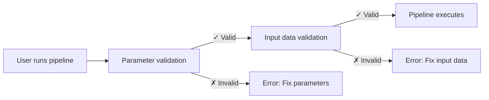

# Part 5: Validació d'entrades

<span class="ai-translation-notice">:material-information-outline:{ .ai-translation-notice-icon } Traducció assistida per IA - [més informació i suggeriments](https://github.com/nextflow-io/training/blob/master/TRANSLATING.md)</span>

En aquesta cinquena part del curs de formació Hello nf-core, us mostrem com utilitzar el plugin nf-schema per validar les entrades i els paràmetres del pipeline.

??? info "Com començar des d'aquesta secció"

    Aquesta secció assumeix que heu completat la [Part 4: Crear un mòdul nf-core](./04_make_module.md) i heu actualitzat el mòdul de procés `COWPY` als estàndards nf-core al vostre pipeline.

    Si no heu completat la Part 4 o voleu començar de nou per a aquesta part, podeu utilitzar la solució `core-hello-part4` com a punt de partida.
    Executeu aquestes comandes des de dins del directori `hello-nf-core/`:

    ```bash
    cp -r solutions/core-hello-part4 core-hello
    cd core-hello
    ```

    Això us proporciona un pipeline amb el mòdul `COWPY` ja actualitzat per seguir els estàndards nf-core.
    Podeu comprovar que s'executa correctament executant la comanda següent:

    ```bash
    nextflow run . --outdir core-hello-results -profile test,docker --validate_params false
    ```

---

## 0. Escalfament: Una mica de context

### 0.1. Per què importa la validació

Imagineu executar el vostre pipeline durant dues hores, només perquè falli perquè un usuari ha proporcionat un fitxer amb l'extensió incorrecta. O passar hores depurant errors críptics, només per descobrir que un paràmetre estava mal escrit. Sense validació d'entrades, aquests escenaris són comuns.

Considereu aquest exemple:

```console title="Without validation"
$ nextflow run my-pipeline --input data.txt --output results

...2 hours later...

ERROR ~ No such file: 'data.fq.gz'
  Expected FASTQ format but received TXT
```

El pipeline va acceptar entrades no vàlides i va executar-se durant hores abans de fallar. Amb validació adequada:

```console title="With validation"
$ nextflow run my-pipeline --input data.txt --output results

ERROR ~ Validation of pipeline parameters failed!

 * --input (data.txt): File extension '.txt' does not match required pattern '.fq.gz' or '.fastq.gz'
 * --output: required parameter is missing (expected: --outdir)

Pipeline failed before execution - please fix the errors above
```

El pipeline falla immediatament amb missatges d'error clars i accionables. Això estalvia temps, recursos de càlcul i frustració.

### 0.2. El plugin nf-schema

El [plugin nf-schema](https://nextflow-io.github.io/nf-schema/latest/) és un plugin de Nextflow que proporciona capacitats de validació completes per a pipelines de Nextflow.
Tot i que nf-schema funciona amb qualsevol workflow de Nextflow, és la solució de validació estàndard per a tots els pipelines nf-core.

nf-schema proporciona diverses funcions clau:

- **Validació de paràmetres**: Valida els paràmetres del pipeline contra `nextflow_schema.json`
- **Validació de fulls de mostra**: Valida els fitxers d'entrada contra `assets/schema_input.json`
- **Conversió de canals**: Converteix fulls de mostra validats a canals de Nextflow
- **Generació de text d'ajuda**: Genera automàticament la sortida `--help` a partir de les definicions de l'esquema
- **Resum de paràmetres**: Mostra quins paràmetres difereixen dels valors per defecte

nf-schema és el successor del plugin nf-validation obsolet i utilitza l'estàndard [JSON Schema Draft 2020-12](https://json-schema.org/) per a la validació.

??? info "Què són els plugins de Nextflow?"

    Els plugins són extensions que afegeixen funcionalitat nova al llenguatge Nextflow mateix. S'instal·len mitjançant un bloc `plugins{}` a `nextflow.config` i poden proporcionar:

    - Noves funcions i classes que es poden importar (com `samplesheetToList`)
    - Noves característiques DSL i operadors
    - Integració amb serveis externs

    El plugin nf-schema s'especifica a `nextflow.config`:

    ```groovy
    plugins {
        id 'nf-schema@2.1.1'
    }
    ```

    Un cop instal·lat, podeu importar funcions dels plugins utilitzant la sintaxi `include { functionName } from 'plugin/plugin-name'`.

### 0.3. Dos fitxers d'esquema per a dos tipus de validació

Un pipeline nf-core utilitzarà dos fitxers d'esquema separats, que corresponen a dos tipus de validació:

| Fitxer d'esquema           | Propòsit                     | Valida                                                            |
| -------------------------- | ---------------------------- | ----------------------------------------------------------------- |
| `nextflow_schema.json`     | Validació de paràmetres      | Indicadors de línia de comandes: `--input`, `--outdir`, `--batch` |
| `assets/schema_input.json` | Validació de dades d'entrada | Continguts de fulls de mostra i fitxers d'entrada                 |

Ambdós esquemes utilitzen el format JSON Schema, un estàndard àmpliament adoptat per descriure i validar estructures de dades.

**La validació de paràmetres** valida els paràmetres de línia de comandes (indicadors com `--outdir`, `--batch`, `--input`):

- Comprova els tipus, rangs i formats dels paràmetres
- Assegura que es proporcionen els paràmetres requerits
- Valida que existeixen els camins de fitxers
- Definit a `nextflow_schema.json`

**La validació de dades d'entrada** valida l'estructura dels fulls de mostra i fitxers de manifest (fitxers CSV/TSV que descriuen les vostres dades):

- Comprova l'estructura de columnes i els tipus de dades
- Valida que existeixen els camins de fitxers referenciats al full de mostra
- Assegura que els camps requerits estan presents
- Definit a `assets/schema_input.json`

!!! warning "Què NO fa la validació de dades d'entrada"

    La validació de dades d'entrada comprova l'estructura dels *fitxers de manifest* (fulls de mostra, fitxers CSV), NO els continguts dels vostres fitxers de dades reals (FASTQ, BAM, VCF, etc.).

    Per a dades a gran escala, la validació dels continguts dels fitxers (com comprovar la integritat de BAM) hauria de passar en processos del pipeline executant-se en nodes de treball, no durant l'etapa de validació a la màquina d'orquestració.

### 0.4. Quan hauria d'ocórrer la validació?



La validació hauria de passar **abans** que s'executin els processos del pipeline, per proporcionar retroalimentació ràpida i evitar temps de càlcul malgastat.

Ara apliquem aquests principis a la pràctica, començant amb la validació de paràmetres.

---

## 1. Validació de paràmetres (nextflow_schema.json)

Comencem afegint validació de paràmetres al nostre pipeline. Això valida indicadors de línia de comandes com `--input`, `--outdir` i `--batch`.

### 1.1. Configurar la validació per ometre la validació de fitxers d'entrada

La plantilla de pipeline nf-core ve amb nf-schema ja instal·lat i configurat:

- El plugin nf-schema s'instal·la mitjançant el bloc `plugins{}` a `nextflow.config`
- La validació de paràmetres està habilitada per defecte mitjançant `params.validate_params = true`
- La validació es realitza pel subworkflow `UTILS_NFSCHEMA_PLUGIN` durant la inicialització del pipeline

El comportament de validació es controla mitjançant l'àmbit `validation{}` a `nextflow.config`.

Com que treballarem primer en la validació de paràmetres (aquesta secció) i no configurarem l'esquema de dades d'entrada fins a la secció 2, necessitem dir temporalment a nf-schema que ometi la validació dels continguts del fitxer del paràmetre `input`.

Obriu `nextflow.config` i trobeu el bloc `validation` (al voltant de la línia 246). Afegiu `ignoreParams` per ometre la validació de fitxers d'entrada:

=== "Després"

    ```groovy title="nextflow.config" hl_lines="3" linenums="246"
    validation {
        defaultIgnoreParams = ["genomes"]
        ignoreParams = ['input']
        monochromeLogs = params.monochrome_logs
    }
    ```

=== "Abans"

    ```groovy title="nextflow.config" linenums="246"
    validation {
        defaultIgnoreParams = ["genomes"]
        monochromeLogs = params.monochrome_logs
    }
    ```

Aquesta configuració indica a nf-schema que:

- **`defaultIgnoreParams`**: Ometi la validació de paràmetres complexos com `genomes` (establert pels desenvolupadors de la plantilla)
- **`ignoreParams`**: Ometi la validació dels continguts del fitxer del paràmetre `input` (temporal; ho reactivarem a la secció 2)
- **`monochromeLogs`**: Desactivi la sortida en color als missatges de validació quan s'estableix a `true` (controlat per `params.monochrome_logs`)

!!! note "Per què ignorar el paràmetre input?"

    El paràmetre `input` a `nextflow_schema.json` té `"schema": "assets/schema_input.json"` que indica a nf-schema que validi els *continguts* del fitxer CSV d'entrada contra aquest esquema.
    Com que encara no hem configurat aquest esquema, ignorem temporalment aquesta validació.
    Eliminarem aquesta configuració a la secció 2 després de configurar l'esquema de dades d'entrada.

### 1.2. Examinar l'esquema de paràmetres

Vegem una secció del fitxer `nextflow_schema.json` que ve amb la nostra plantilla de pipeline:

```bash
grep -A 25 '"input_output_options"' nextflow_schema.json
```

L'esquema de paràmetres està organitzat en grups. Aquí teniu el grup `input_output_options`:

```json title="core-hello/nextflow_schema.json (excerpt)" linenums="8"
        "input_output_options": {
            "title": "Input/output options",
            "type": "object",
            "fa_icon": "fas fa-terminal",
            "description": "Define where the pipeline should find input data and save output data.",
            "required": ["input", "outdir"],
            "properties": {
                "input": {
                    "type": "string",
                    "format": "file-path",
                    "exists": true,
                    "schema": "assets/schema_input.json",
                    "mimetype": "text/csv",
                    "pattern": "^\\S+\\.csv$",
                    "description": "Path to comma-separated file containing information about the samples in the experiment.",
                    "help_text": "You will need to create a design file with information about the samples in your experiment before running the pipeline. Use this parameter to specify its location. It has to be a comma-separated file with 3 columns, and a header row.",
                    "fa_icon": "fas fa-file-csv"
                },
                "outdir": {
                    "type": "string",
                    "format": "directory-path",
                    "description": "The output directory where the results will be saved. You have to use absolute paths to storage on Cloud infrastructure.",
                    "fa_icon": "fas fa-folder-open"
                }
            }
        },
```

Cada entrada descrita aquí té les següents propietats clau que es poden validar:

- **`type`**: Tipus de dades (string, integer, boolean, number)
- **`format`**: Formats especials com `file-path` o `directory-path`
- **`exists`**: Per a camins de fitxers, comprova si el fitxer existeix
- **`pattern`**: Expressió regular que el valor ha de complir
- **`required`**: Array de noms de paràmetres que s'han de proporcionar
- **`mimetype`**: Mimetype de fitxer esperat per a la validació

Si teniu un ull agut, potser notareu que el paràmetre d'entrada `batch` que hem estat utilitzant encara no està definit a l'esquema.
L'afegirem a la següent secció.

??? info "D'on provenen els paràmetres de l'esquema?"

    La validació de l'esquema utilitza `nextflow.config` com a base per a les definicions de paràmetres.
    Els paràmetres declarats en altres llocs dels vostres scripts de workflow (com a `main.nf` o fitxers de mòduls) **no** són recollits automàticament pel validador d'esquema.

    Això significa que sempre hauríeu de declarar els vostres paràmetres de pipeline a `nextflow.config`, i després definir les seves regles de validació a `nextflow_schema.json`.

### 1.3. Afegir el paràmetre batch

Tot i que l'esquema és un fitxer JSON que es pot editar manualment, **l'edició manual és propensa a errors i no es recomana**.
En canvi, nf-core proporciona una eina GUI interactiva que gestiona la sintaxi JSON Schema per vosaltres i valida els vostres canvis:

```bash
nf-core pipelines schema build
```

Hauríeu de veure alguna cosa així:

```console
                                      ,--./,-.
      ___     __   __   __   ___     /,-._.--\
|\ | |__  __ /  ` /  \ |__) |__         }  {
| \| |       \__, \__/ |  \ |___     \`-._,-`-,
                                      `._,._,'

nf-core/tools version 3.4.1 - https://nf-co.re

INFO     [✓] Default parameters match schema validation
INFO     [✓] Pipeline schema looks valid (found 17 params)
INFO     Writing schema with 17 params: 'nextflow_schema.json'
🚀  Launch web builder for customisation and editing? [y/n]:
```

Escriviu `y` i premeu Enter per llançar la interfície web interactiva.

El vostre navegador s'obrirà mostrant el constructor d'esquema de paràmetres:


Per afegir el paràmetre `batch`:

1. Feu clic al botó **"Add parameter"** a la part superior
2. Utilitzeu l'ansa d'arrossegament (⋮⋮) per moure el nou paràmetre cap amunt al grup "Input/output options", sota el paràmetre `input`
3. Ompliu els detalls del paràmetre:
   - **ID**: `batch`
   - **Description**: `Name for this batch of greetings`
   - **Type**: `string`
   - **Required**: marqueu la casella
   - Opcionalment, seleccioneu una icona del selector d'icones (p. ex., `fas fa-layer-group`)


Quan hàgiu acabat, feu clic al botó **"Finished"** a la part superior dreta.

De tornada al vostre terminal, veureu:

```console
INFO     Writing schema with 18 params: 'nextflow_schema.json'
⣾ Use ctrl+c to stop waiting and force exit.
```

Premeu `Ctrl+C` per sortir del constructor d'esquema.

L'eina ara ha actualitzat el vostre fitxer `nextflow_schema.json` amb el nou paràmetre `batch`, gestionant tota la sintaxi JSON Schema correctament.

### 1.4. Verificar els canvis

```bash
grep -A 25 '"input_output_options"' nextflow_schema.json
```

```json title="core-hello/nextflow_schema.json (excerpt)" linenums="8" hl_lines="19-23"
    "input_output_options": {
      "title": "Input/output options",
      "type": "object",
      "fa_icon": "fas fa-terminal",
      "description": "Define where the pipeline should find input data and save output data.",
      "required": ["input", "outdir", "batch"],
      "properties": {
        "input": {
          "type": "string",
          "format": "file-path",
          "exists": true,
          "schema": "assets/schema_input.json",
          "mimetype": "text/csv",
          "pattern": "^\\S+\\.csv$",
          "description": "Path to comma-separated file containing information about the samples in the experiment.",
          "help_text": "You will need to create a design file with information about the samples in your experiment before running the pipeline. Use this parameter to specify its location. It has to be a comma-separated file with 3 columns, and a header row.",
          "fa_icon": "fas fa-file-csv"
        },
        "batch": {
          "type": "string",
          "description": "Name for this batch of greetings",
          "fa_icon": "fas fa-layer-group"
        },
```

Hauríeu de veure que el paràmetre `batch` s'ha afegit a l'esquema amb el camp "required" ara mostrant `["input", "outdir", "batch"]`.

### 1.5. Provar la validació de paràmetres

Ara provem que la validació de paràmetres funciona correctament.

Primer, proveu d'executar sense el paràmetre requerit `input`:

```bash
nextflow run . --outdir test-results -profile docker
```

??? warning "Sortida de la comanda"

    ```console
    ERROR ~ Validation of pipeline parameters failed!

    -- Check '.nextflow.log' file for details
    The following invalid input values have been detected:

    * Missing required parameter(s): input, batch
    ```

Perfecte! La validació detecta el paràmetre requerit que falta abans que s'executi el pipeline.

Ara proveu amb un conjunt vàlid de paràmetres:

```bash
nextflow run . --input assets/greetings.csv --outdir results --batch my-batch -profile test,docker
```

??? success "Sortida de la comanda"

    ```console
     N E X T F L O W   ~  version 25.04.3

    Launching `./main.nf` [peaceful_wozniak] DSL2 - revision: b9e9b3b8de

    executor >  local (8)
    [de/a1b2c3] CORE_HELLO:HELLO:sayHello (3)       | 3 of 3 ✔
    [4f/d5e6f7] CORE_HELLO:HELLO:convertToUpper (3) | 3 of 3 ✔
    [8a/b9c0d1] CORE_HELLO:HELLO:CAT_CAT (test)     | 1 of 1 ✔
    [e2/f3a4b5] CORE_HELLO:HELLO:COWPY (test)       | 1 of 1 ✔
    -[core/hello] Pipeline completed successfully-
    ```

El pipeline hauria d'executar-se correctament, i el paràmetre `batch` ara està validat.

### Conclusió

Heu après com utilitzar l'eina interactiva `nf-core pipelines schema build` per afegir paràmetres a `nextflow_schema.json` i heu vist la validació de paràmetres en acció.
La interfície web gestiona tota la sintaxi JSON Schema per vosaltres, facilitant la gestió d'esquemes de paràmetres complexos sense edició manual de JSON propensa a errors.

### Què segueix?

Ara que la validació de paràmetres funciona, afegim validació per als continguts del fitxer de dades d'entrada.

---

## 2. Validació de dades d'entrada (schema_input.json)

Afegirem validació per als continguts del nostre fitxer CSV d'entrada.
Mentre que la validació de paràmetres comprova els indicadors de línia de comandes, la validació de dades d'entrada assegura que les dades dins del fitxer CSV estan estructurades correctament.

### 2.1. Entendre el format greetings.csv

Recordem com és la nostra entrada:

```bash
cat assets/greetings.csv
```

```csv title="assets/greetings.csv"
Hello,en,87
Bonjour,fr,96
Holà,es,98
```

Aquest és un CSV simple amb:

- Tres columnes (sense capçalera)
- A cada línia: una salutació, un idioma i una puntuació
- Les dues primeres columnes són cadenes de text sense requisits de format especials
- La tercera columna és un enter

Per al nostre pipeline, només la primera columna és requerida.

### 2.2. Dissenyar l'estructura de l'esquema

Per al nostre cas d'ús, volem:

1. Acceptar entrada CSV amb almenys una columna
2. Tractar el primer element de cada fila com una cadena de salutació
3. Assegurar que les salutacions no estan buides i no comencen amb espai en blanc
4. Assegurar que el camp d'idioma coincideix amb un dels codis d'idioma suportats (en, fr, es, it, de)
5. Assegurar que el camp de puntuació és un enter amb un valor entre 0 i 100

Estructurarem això com un array d'objectes, on cada objecte té almenys un camp `greeting`.

### 2.3. Actualitzar el fitxer d'esquema

La plantilla de pipeline nf-core inclou un `assets/schema_input.json` per defecte dissenyat per a dades de seqüenciació paired-end.
Necessitem reemplaçar-lo amb un esquema més simple per al nostre cas d'ús de salutacions.

Obriu `assets/schema_input.json` i reemplaceu les seccions `properties` i `required`:

=== "Després"

    ```json title="assets/schema_input.json" linenums="1" hl_lines="10-25 27"
    {
        "$schema": "https://json-schema.org/draft/2020-12/schema",
        "$id": "https://raw.githubusercontent.com/core/hello/main/assets/schema_input.json",
        "title": "core/hello pipeline - params.input schema",
        "description": "Schema for the greetings file provided with params.input",
        "type": "array",
        "items": {
            "type": "object",
            "properties": {
                "greeting": {
                    "type": "string",
                    "pattern": "^\\S.*$",
                    "errorMessage": "Greeting must be provided and cannot be empty or start with whitespace"
                },
                "language": {
                    "type": "string",
                    "enum": ["en", "fr", "es", "it", "de"],
                    "errorMessage": "Language must be one of: en, fr, es, it, de"
                },
                "score": {
                    "type": "integer",
                    "minimum": 0,
                    "maximum": 100,
                    "errorMessage": "Score must be an integer with a value between 0 and 100"
                }
            },
            "required": ["greeting"]
        }
    }
    ```

=== "Abans"

    ```json title="assets/schema_input.json" linenums="1" hl_lines="10-29 31"
    {
        "$schema": "https://json-schema.org/draft/2020-12/schema",
        "$id": "https://raw.githubusercontent.com/core/hello/main/assets/schema_input.json",
        "title": "core/hello pipeline - params.input schema",
        "description": "Schema for the file provided with params.input",
        "type": "array",
        "items": {
            "type": "object",
            "properties": {
                "sample": {
                    "type": "string",
                    "pattern": "^\\S+$",
                    "errorMessage": "Sample name must be provided and cannot contain spaces",
                    "meta": ["id"]
                },
                "fastq_1": {
                    "type": "string",
                    "format": "file-path",
                    "exists": true,
                    "pattern": "^([\\S\\s]*\\/)?[^\\s\\/]+\\.f(ast)?q\\.gz$",
                    "errorMessage": "FastQ file for reads 1 must be provided, cannot contain spaces and must have extension '.fq.gz' or '.fastq.gz'"
                },
                "fastq_2": {
                    "type": "string",
                    "format": "file-path",
                    "exists": true,
                    "pattern": "^([\\S\\s]*\\/)?[^\\s\\/]+\\.f(ast)?q\\.gz$",
                    "errorMessage": "FastQ file for reads 2 cannot contain spaces and must have extension '.fq.gz' or '.fastq.gz'"
                }
            },
            "required": ["sample", "fastq_1"]
        }
    }
    ```

Els canvis clau:

- **`description`**: Actualitzat per mencionar "greetings file"
- **`properties`**: Reemplaçat `sample`, `fastq_1` i `fastq_2` amb `greeting`, `language` i `score`
  - **`type:`** Imposa string (`greeting`, `language`) o integer (`score`)
  - **`pattern: "^\\S.*$"`**: La salutació ha de començar amb un caràcter que no sigui espai en blanc (però pot contenir espais després)
  - **`"enum": ["en", "fr", "es", "it", "de"]`**: El codi d'idioma ha d'estar al conjunt suportat
  - **`"minimum": 0` i `"maximum": 100`**: El valor de puntuació ha d'estar entre 0 i 100
  - **`errorMessage`**: Missatge d'error personalitzat mostrat si la validació falla
- **`required`**: Canviat de `["sample", "fastq_1"]` a `["greeting"]`

### 2.4. Afegir una capçalera al fitxer greetings.csv

Quan nf-schema llegeix un fitxer CSV, espera que la primera fila contingui capçaleres de columna que coincideixin amb els noms de camp de l'esquema.

Per al nostre cas simple, necessitem afegir una línia de capçalera al nostre fitxer de salutacions:

=== "Després"

    ```csv title="assets/greetings.csv" linenums="1" hl_lines="1"
    greeting,language,score
    Hello,en,87
    Bonjour,fr,96
    Holà,es,98
    ```

=== "Abans"

    ```csv title="assets/greetings.csv" linenums="1"
    Hello,en,87
    Bonjour,fr,96
    Holà,es,98
    ```

Ara el fitxer CSV té una línia de capçalera que coincideix amb els noms de camp del nostre esquema.

El pas final és implementar la validació al codi del pipeline utilitzant `samplesheetToList`.

### 2.5. Implementar la validació al pipeline

Ara necessitem reemplaçar el nostre anàlisi CSV simple amb la funció `samplesheetToList` de nf-schema, que validarà i analitzarà el full de mostra.

La funció `samplesheetToList`:

1. Llegeix el full de mostra d'entrada (CSV, TSV, JSON o YAML)
2. El valida contra l'esquema JSON proporcionat
3. Retorna una llista de Groovy on cada entrada correspon a una fila
4. Llança missatges d'error útils si la validació falla

Actualitzem el codi de gestió d'entrada:

Obriu `subworkflows/local/utils_nfcore_hello_pipeline/main.nf` i localitzeu la secció on creem el canal d'entrada (al voltant de la línia 80).

Necessitem:

1. Utilitzar la funció `samplesheetToList` (ja importada a la plantilla)
2. Validar i analitzar l'entrada
3. Extreure només les cadenes de salutació per al nostre workflow

Primer, noteu que la funció `samplesheetToList` ja està importada a la part superior del fitxer (la plantilla nf-core inclou això per defecte):

```groovy title="core-hello/subworkflows/local/utils_nfcore_hello_pipeline/main.nf" linenums="1" hl_lines="13"
//
// Subworkflow with functionality specific to the core/hello pipeline
//

/*
~~~~~~~~~~~~~~~~~~~~~~~~~~~~~~~~~~~~~~~~~~~~~~~~~~~~~~~~~~~~~~~~~~~~~~~~~~~~~~~~~~~~~~~~
    IMPORT FUNCTIONS / MODULES / SUBWORKFLOWS
~~~~~~~~~~~~~~~~~~~~~~~~~~~~~~~~~~~~~~~~~~~~~~~~~~~~~~~~~~~~~~~~~~~~~~~~~~~~~~~~~~~~~~~~
*/

include { UTILS_NFSCHEMA_PLUGIN     } from '../../nf-core/utils_nfschema_plugin'
include { paramsSummaryMap          } from 'plugin/nf-schema'
include { samplesheetToList         } from 'plugin/nf-schema'
include { paramsHelp                } from 'plugin/nf-schema'
include { completionSummary         } from '../../nf-core/utils_nfcore_pipeline'
include { UTILS_NFCORE_PIPELINE     } from '../../nf-core/utils_nfcore_pipeline'
include { UTILS_NEXTFLOW_PIPELINE   } from '../../nf-core/utils_nextflow_pipeline'
```

Ara actualitzeu el codi de creació del canal:

=== "Després"

    ```groovy title="core-hello/subworkflows/local/utils_nfcore_hello_pipeline/main.nf" linenums="80" hl_lines="4"
        //
        // Create channel from input file provided through params.input
        //
        ch_samplesheet = channel.fromList(samplesheetToList(params.input, "${projectDir}/assets/schema_input.json"))
            .map { line -> line[0] }

        emit:
        samplesheet = ch_samplesheet
        versions    = ch_versions
    ```

=== "Abans"

    ```groovy title="core-hello/subworkflows/local/utils_nfcore_hello_pipeline/main.nf" linenums="80" hl_lines="4 5"
        //
        // Create channel from input file provided through params.input
        //
        ch_samplesheet = channel.fromPath(params.input)
            .splitCsv()
            .map { line -> line[0] }

        emit:
        samplesheet = ch_samplesheet
        versions    = ch_versions
    ```

Desglossem què ha canviat:

1. **`samplesheetToList(params.input, "${projectDir}/assets/schema_input.json")`**: Valida el fitxer d'entrada contra el nostre esquema i retorna una llista
2. **`Channel.fromList(...)`**: Converteix la llista en un canal de Nextflow

Això completa la implementació de la validació de dades d'entrada utilitzant `samplesheetToList` i esquemes JSON.

Ara que hem configurat l'esquema de dades d'entrada, podem eliminar la configuració d'ignorar temporal que vam afegir abans.

### 2.6. Reactivar la validació d'entrada

Obriu `nextflow.config` i elimineu la línia `ignoreParams` del bloc `validation`:

=== "Després"

    ```groovy title="nextflow.config" linenums="246"
    validation {
        defaultIgnoreParams = ["genomes"]
        monochromeLogs = params.monochrome_logs
    }
    ```

=== "Abans"

    ```groovy title="nextflow.config" hl_lines="3" linenums="246"
    validation {
        defaultIgnoreParams = ["genomes"]
        ignoreParams = ['input']
        monochromeLogs = params.monochrome_logs
    }
    ```

Ara nf-schema validarà tant els tipus de paràmetres COM els continguts del fitxer d'entrada.

### 2.7. Provar la validació d'entrada

Verifiquem que la nostra validació funciona provant entrades vàlides i no vàlides.

#### 2.7.1. Provar amb entrada vàlida

Primer, confirmeu que el pipeline s'executa correctament amb entrada vàlida.
Noteu que ja no necessitem `--validate_params false` ja que la validació funciona!

```bash
nextflow run . --outdir core-hello-results -profile test,docker
```

??? success "Sortida de la comanda"

    ```console
    ------------------------------------------------------
    WARN: The following invalid input values have been detected:

    * --character: tux


    executor >  local (8)
    [c1/39f64a] CORE_HELLO:HELLO:sayHello (1)       | 3 of 3 ✔
    [44/c3fb82] CORE_HELLO:HELLO:convertToUpper (3) | 3 of 3 ✔
    [62/80fab2] CORE_HELLO:HELLO:CAT_CAT (test)     | 1 of 1 ✔
    [e1/4db4fd] CORE_HELLO:HELLO:COWPY (test)       | 1 of 1 ✔
    -[core/hello] Pipeline completed successfully-
    ```

Genial! El pipeline s'executa correctament i la validació passa silenciosament.
L'advertència sobre `--character` és només informativa ja que no està definit a l'esquema.
Si voleu, utilitzeu el que heu après per afegir validació per a aquest paràmetre també!

#### 2.7.2. Provar amb entrada no vàlida

Passar la validació sempre és una bona sensació, però assegurem-nos que la validació realment detectarà errors.

Per crear un fitxer de prova amb un nom de columna no vàlid, comenceu fent una còpia del fitxer `greetings.csv`:

```bash
cp assets/greetings.csv assets/invalid_greetings.csv
```

Ara obriu el fitxer i canvieu el nom de la primera columna, a la línia de capçalera, de `greeting` a `message`:

=== "Després"

    ```csv title="tmp_invalid_greetings.csv" hl_lines="1" linenums="1"
    message,language,score
    Hello,en,87
    Bonjour,fr,96
    Holà,es,98
    ```

=== "Abans"

    ```csv title="tmp_invalid_greetings.csv" hl_lines="1" linenums="1"
    greeting,language,score
    Hello,en,87
    Bonjour,fr,96
    Holà,es,98
    ```

Això no coincideix amb el nostre esquema, així que la validació hauria de llançar un error.

Proveu d'executar el pipeline amb aquesta entrada no vàlida:

```bash
nextflow run . --input assets/invalid_greetings.csv --outdir test-results -profile docker
```

??? failure "Sortida de la comanda"

    ```console
    N E X T F L O W   ~  version 24.10.4

    Launching `./main.nf` [trusting_ochoa] DSL2 - revision: b9e9b3b8de

    Input/output options
      input              : assets/invalid_greetings.csv
      outdir             : test-results

    Generic options
      trace_report_suffix: 2025-01-27_03-16-04

    Core Nextflow options
      runName            : trusting_ochoa
      containerEngine    : docker
      launchDir          : /workspace/hello-nf-core
      workDir            : /workspace/hello-nf-core/work
      projectDir         : /workspace/hello-nf-core
      userName           : user
      profile            : docker
      configFiles        : /workspace/hello-nf-core/nextflow.config

    !! Only displaying parameters that differ from the pipeline defaults !!
    ------------------------------------------------------
    ERROR ~ Validation of pipeline parameters failed!

     -- Check '.nextflow.log' file for details
    The following invalid input values have been detected:

    * Missing required parameter(s): batch
    * --input (assets/invalid_greetings.csv): Validation of file failed:
        -> Entry 1: Missing required field(s): greeting
        -> Entry 2: Missing required field(s): greeting
        -> Entry 3: Missing required field(s): greeting

     -- Check script 'subworkflows/nf-core/utils_nfschema_plugin/main.nf' at line: 68 or see '.nextflow.log' file for more details
    ```

Perfecte! La validació va detectar l'error i va proporcionar un missatge d'error clar i útil que assenyala:

- Quin fitxer va fallar la validació
- Quina entrada (fila 1, la primera fila de dades) té el problema
- Quin és el problema específic (falta el camp requerit `greeting`)

La validació de l'esquema assegura que els fitxers d'entrada tenen l'estructura correcta abans que s'executi el pipeline, estalviant temps i evitant errors confusos més tard a l'execució.

Si voleu practicar això, sentiu-vos lliures de crear altres fitxers d'entrada de salutacions que violin l'esquema d'altres maneres divertides.

### Conclusió

Heu implementat i provat tant la validació de paràmetres com la validació de dades d'entrada. El vostre pipeline ara valida les entrades abans de l'execució, proporcionant retroalimentació ràpida i missatges d'error clars.

!!! tip "Lectura addicional"

    Per aprendre més sobre característiques i patrons de validació avançats, consulteu la [documentació de nf-schema](https://nextflow-io.github.io/nf-schema/latest/). La comanda `nf-core pipelines schema build` proporciona una GUI interactiva per gestionar esquemes complexos.

### Què segueix?

Heu completat les cinc parts del curs de formació Hello nf-core!

Continueu al [Resum](summary.md) per reflexionar sobre el que heu construït i après.
