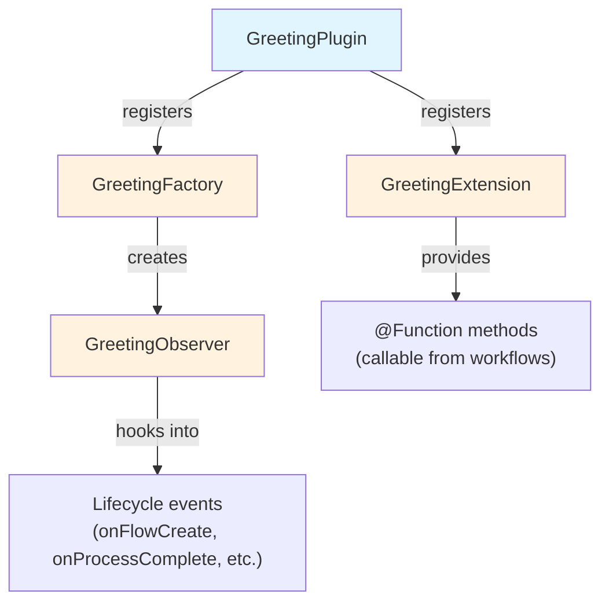

# Part 2: Crear un projecte de plugin

<span class="ai-translation-notice">:material-information-outline:{ .ai-translation-notice-icon } Traducció assistida per IA - [més informació i suggeriments](https://github.com/nextflow-io/training/blob/master/TRANSLATING.md)</span>

Heu vist com els plugins amplien Nextflow amb funcionalitats reutilitzables.
Ara en creareu un de propi, començant amb una plantilla de projecte que gestiona la configuració de compilació per vosaltres.

!!! tip "Comenceu des d'aquí?"

    Si us incorporeu en aquesta part, copieu la solució de la Part 1 per utilitzar-la com a punt de partida:

    ```bash
    cp -r solutions/1-plugin-basics/* .
    ```

!!! info "Documentació oficial"

    Aquesta secció i les que segueixen cobreixen els aspectes essencials del desenvolupament de plugins.
    Per a més detalls, consulteu la [documentació oficial de desenvolupament de plugins de Nextflow](https://www.nextflow.io/docs/latest/plugins/developing-plugins.html).

---

## 1. Crear el projecte de plugin

La comanda integrada `nextflow plugin create` genera un projecte de plugin complet:

```bash
nextflow plugin create nf-greeting training
```

```console title="Output"
Plugin created successfully at path: /workspaces/training/side-quests/plugin_development/nf-greeting
```

El primer argument és el nom del plugin, i el segon és el nom de la vostra organització (s'utilitza per organitzar el codi generat en carpetes).

!!! tip "Creació manual"

    També podeu crear projectes de plugin manualment o utilitzar la [plantilla nf-hello](https://github.com/nextflow-io/nf-hello) a GitHub com a punt de partida.

---

## 2. Examinar l'estructura del projecte

Un plugin de Nextflow és un programari Groovy que s'executa dins de Nextflow.
Amplia les capacitats de Nextflow mitjançant punts d'integració ben definits, la qual cosa significa que pot treballar amb funcionalitats de Nextflow com ara canals, processos i configuració.

Abans d'escriure cap codi, observeu què ha generat la plantilla per saber on va cada cosa.

Canvieu al directori del plugin:

```bash
cd nf-greeting
```

Llisteu el contingut:

```bash
tree
```

Hauríeu de veure:

```console
.
├── build.gradle
├── COPYING
├── gradle
│   └── wrapper
│       ├── gradle-wrapper.jar
│       └── gradle-wrapper.properties
├── gradlew
├── Makefile
├── README.md
├── settings.gradle
└── src
    ├── main
    │   └── groovy
    │       └── training
    │           └── plugin
    │               ├── GreetingExtension.groovy
    │               ├── GreetingFactory.groovy
    │               ├── GreetingObserver.groovy
    │               └── GreetingPlugin.groovy
    └── test
        └── groovy
            └── training
                └── plugin
                    └── GreetingObserverTest.groovy

11 directories, 13 files
```

---

## 3. Explorar la configuració de compilació

Un plugin de Nextflow és programari basat en Java que s'ha de compilar i empaquetar abans que Nextflow el pugui utilitzar.
Això requereix una eina de compilació.

Gradle és una eina de compilació que compila codi, executa proves i empaqueta programari.
La plantilla del plugin inclou un wrapper de Gradle (`./gradlew`) perquè no calgui tenir Gradle instal·lat per separat.

La configuració de compilació indica a Gradle com compilar el vostre plugin i indica a Nextflow com carregar-lo.
Dos fitxers són els més importants.

### 3.1. settings.gradle

Aquest fitxer identifica el projecte:

```bash
cat settings.gradle
```

```groovy title="settings.gradle"
rootProject.name = 'nf-greeting'
```

El nom aquí ha de coincidir amb el que posareu a `nextflow.config` quan utilitzeu el plugin.

### 3.2. build.gradle

El fitxer de compilació és on es produeix la major part de la configuració:

```bash
cat build.gradle
```

El fitxer conté diverses seccions.
La més important és el bloc `nextflowPlugin`:

```groovy title="build.gradle"
plugins {
    id 'io.nextflow.nextflow-plugin' version '1.0.0-beta.10'
}

version = '0.1.0'

nextflowPlugin {
    nextflowVersion = '24.10.0'       // (1)!

    provider = 'training'             // (2)!
    className = 'training.plugin.GreetingPlugin'  // (3)!
    extensionPoints = [               // (4)!
        'training.plugin.GreetingExtension',
        'training.plugin.GreetingFactory'
    ]

}
```

1. **`nextflowVersion`**: Versió mínima de Nextflow requerida
2. **`provider`**: El vostre nom o organització
3. **`className`**: La classe principal del plugin, el punt d'entrada que Nextflow carrega primer
4. **`extensionPoints`**: Classes que afegeixen funcionalitats a Nextflow (les vostres funcions, monitoratge, etc.)

El bloc `nextflowPlugin` configura:

- `nextflowVersion`: Versió mínima de Nextflow requerida
- `provider`: El vostre nom o organització
- `className`: La classe principal del plugin (el punt d'entrada que Nextflow carrega primer, especificat a `build.gradle`)
- `extensionPoints`: Classes que afegeixen funcionalitats a Nextflow (les vostres funcions, monitoratge, etc.)

### 3.3. Actualitzar nextflowVersion

La plantilla genera un valor de `nextflowVersion` que pot estar desactualitzat.
Actualitzeu-lo perquè coincideixi amb la versió de Nextflow instal·lada per garantir la compatibilitat total:

=== "Després"

    ```groovy title="build.gradle" hl_lines="2"
    nextflowPlugin {
        nextflowVersion = '25.10.0'

        provider = 'training'
    ```

=== "Abans"

    ```groovy title="build.gradle" hl_lines="2"
    nextflowPlugin {
        nextflowVersion = '24.10.0'

        provider = 'training'
    ```

---

## 4. Conèixer els fitxers font

El codi font del plugin es troba a `src/main/groovy/training/plugin/`.
Hi ha quatre fitxers font, cadascun amb un rol diferent:

| Fitxer                     | Rol                                                                     | Modificat a   |
| -------------------------- | ----------------------------------------------------------------------- | ------------- |
| `GreetingPlugin.groovy`    | Punt d'entrada que Nextflow carrega primer                              | Mai (generat) |
| `GreetingExtension.groovy` | Defineix funcions invocables des dels workflows                         | Part 3        |
| `GreetingFactory.groovy`   | Crea instàncies d'observer quan s'inicia un workflow                    | Part 5        |
| `GreetingObserver.groovy`  | Executa codi en resposta a esdeveniments del cicle de vida del workflow | Part 5        |

Cada fitxer s'introdueix en detall a la part indicada, quan el modifiqueu per primera vegada.
Els més importants a tenir en compte:

- `GreetingPlugin` és el punt d'entrada que carrega Nextflow
- `GreetingExtension` proporciona les funcions que aquest plugin posa a disposició dels workflows
- `GreetingObserver` s'executa paral·lelament al pipeline i respon a esdeveniments sense requerir canvis al codi del pipeline



---

## 5. Compilar, instal·lar i executar

La plantilla inclou codi funcional des del primer moment, de manera que podeu compilar-lo i executar-lo immediatament per verificar que el projecte està configurat correctament.

Compileu el plugin i instal·leu-lo localment:

```bash
make install
```

`make install` compila el codi del plugin i el copia al directori local de plugins de Nextflow (`$NXF_HOME/plugins/`), fent-lo disponible per utilitzar.

??? example "Sortida de la compilació"

    La primera vegada que executeu això, Gradle es descarregarà a si mateix (pot trigar un minut):

    ```console
    Downloading https://services.gradle.org/distributions/gradle-8.14-bin.zip
    ...10%...20%...30%...40%...50%...60%...70%...80%...90%...100%

    Welcome to Gradle 8.14!
    ...

    Deprecated Gradle features were used in this build...

    BUILD SUCCESSFUL in 23s
    5 actionable tasks: 5 executed
    ```

    **Els avisos són esperats.**

    - **"Downloading gradle..."**: Això només passa la primera vegada. Les compilacions posteriors són molt més ràpides.
    - **"Deprecated Gradle features..."**: Aquest avís prové de la plantilla del plugin, no del vostre codi. Es pot ignorar sense problemes.
    - **"BUILD SUCCESSFUL"**: Això és el que importa. El vostre plugin s'ha compilat sense errors.

Torneu al directori del pipeline:

```bash
cd ..
```

Afegiu el plugin nf-greeting a `nextflow.config`:

=== "Després"

    ```groovy title="nextflow.config" hl_lines="4"
    // Configuració per als exercicis de desenvolupament de plugins
    plugins {
        id 'nf-schema@2.6.1'
        id 'nf-greeting@0.1.0'
    }
    ```

=== "Abans"

    ```groovy title="nextflow.config"
    // Configuració per als exercicis de desenvolupament de plugins
    plugins {
        id 'nf-schema@2.6.1'
    }
    ```

!!! note "Versió requerida per als plugins locals"

    Quan s'utilitzen plugins instal·lats localment, cal especificar la versió (p. ex., `nf-greeting@0.1.0`).
    Els plugins publicats al registre poden utilitzar només el nom.

Executeu el pipeline:

```bash
nextflow run greet.nf -ansi-log false
```

L'opció `-ansi-log false` desactiva la visualització animada del progrés perquè tota la sortida, inclosos els missatges de l'observer, es mostri en ordre.

```console title="Output"
Pipeline is starting! 🚀
[bc/f10449] Submitted process > SAY_HELLO (1)
[9a/f7bcb2] Submitted process > SAY_HELLO (2)
[6c/aff748] Submitted process > SAY_HELLO (3)
[de/8937ef] Submitted process > SAY_HELLO (4)
[98/c9a7d6] Submitted process > SAY_HELLO (5)
Output: Bonjour
Output: Hello
Output: Holà
Output: Ciao
Output: Hallo
Pipeline complete! 👋
```

(L'ordre de la vostra sortida i els hash dels directoris de treball seran diferents.)

Els missatges "Pipeline is starting!" i "Pipeline complete!" us resultaran familiars del plugin nf-hello de la Part 1, però aquesta vegada provenen del `GreetingObserver` del vostre propi plugin.
El pipeline en si no ha canviat; l'observer s'executa automàticament perquè està registrat a la factory.

---

## Conclusio

Heu après que:

- La comanda `nextflow plugin create` genera un projecte inicial complet
- `build.gradle` configura les metadades del plugin, les dependències i quines classes proporcionen funcionalitats
- El plugin té quatre components principals: Plugin (punt d'entrada), Extension (funcions), Factory (crea monitors) i Observer (respon als esdeveniments del workflow)
- El cicle de desenvolupament és: editar el codi, `make install`, executar el pipeline

---

## Què segueix?

Ara implementareu funcions personalitzades a la classe Extension i les utilitzareu al workflow.

[Continua a la Part 3 :material-arrow-right:](03_custom_functions.md){ .md-button .md-button--primary }
