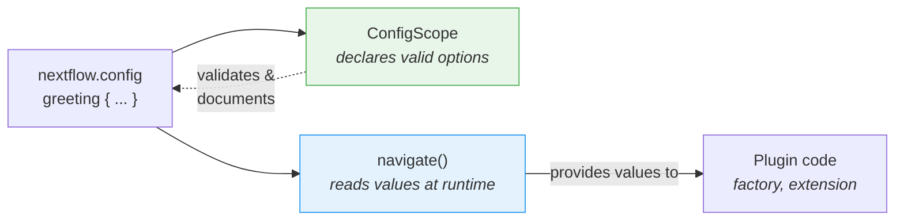

# Part 6: Configuració

<span class="ai-translation-notice">:material-information-outline:{ .ai-translation-notice-icon } Traducció assistida per IA - [més informació i suggeriments](https://github.com/nextflow-io/training/blob/master/TRANSLATING.md)</span>

El vostre plugin té funcions personalitzades i un observador, però tot està codificat de manera fixa.
Els usuaris no poden desactivar el comptador de tasques ni canviar el decorador sense editar el codi font i reconstruir-lo.

A la Part 1, heu utilitzat els blocs `#!groovy validation {}` i `#!groovy co2footprint {}` a `nextflow.config` per controlar el comportament de nf-schema i nf-co2footprint.
Aquests blocs de configuració existeixen perquè els autors del plugin van incorporar aquesta capacitat.
En aquesta secció, fareu el mateix per al vostre propi plugin.

**Objectius:**

1. Permetre als usuaris personalitzar el prefix i el sufix del decorador de salutacions
2. Permetre als usuaris activar o desactivar el plugin mitjançant `nextflow.config`
3. Registrar un àmbit de configuració formal perquè Nextflow reconegui el bloc `#!groovy greeting {}`

**Què canviareu:**

| Fitxer                     | Canvi                                                                |
| -------------------------- | -------------------------------------------------------------------- |
| `GreetingExtension.groovy` | Llegir la configuració de prefix/sufix a `init()`                    |
| `GreetingFactory.groovy`   | Llegir valors de configuració per controlar la creació d'observadors |
| `GreetingConfig.groovy`    | Fitxer nou: classe formal `@ConfigScope`                             |
| `build.gradle`             | Registrar la classe de configuració com a punt d'extensió            |
| `nextflow.config`          | Afegir un bloc `#!groovy greeting {}` per provar-ho                  |

!!! tip "Comenceu des d'aquí?"

    Si us incorporeu en aquesta part, copieu la solució de la Part 5 per utilitzar-la com a punt de partida:

    ```bash
    cp -r solutions/5-observers/* .
    ```

!!! info "Documentació oficial"

    Per obtenir informació detallada sobre la configuració, consulteu la [documentació dels àmbits de configuració de Nextflow](https://nextflow.io/docs/latest/developer/config-scopes.html).

---

## 1. Fer el decorador configurable

La funció `decorateGreeting` embolcalla cada salutació amb `*** ... ***`.
Els usuaris potser voldran marcadors diferents, però ara mateix l'única manera de canviar-los és editar el codi font i reconstruir-lo.

La sessió de Nextflow proporciona un mètode anomenat `session.config.navigate()` que llegeix valors niats de `nextflow.config`:

```groovy
// Llegeix 'greeting.prefix' de nextflow.config, amb valor per defecte '***'
final prefix = session.config.navigate('greeting.prefix', '***') as String
```

Això correspon a un bloc de configuració al `nextflow.config` de l'usuari:

```groovy title="nextflow.config"
greeting {
    prefix = '>>>'
}
```

### 1.1. Afegir la lectura de configuració (això fallarà!)

Editeu `GreetingExtension.groovy` per llegir la configuració a `init()` i utilitzar-la a `decorateGreeting()`:

```groovy title="GreetingExtension.groovy" linenums="35" hl_lines="7-8 18"
@CompileStatic
class GreetingExtension extends PluginExtensionPoint {

    @Override
    protected void init(Session session) {
        // Llegeix la configuració amb valors per defecte
        prefix = session.config.navigate('greeting.prefix', '***') as String
        suffix = session.config.navigate('greeting.suffix', '***') as String
    }

    // ... altres mètodes sense canvis ...

    /**
    * Decora una salutació amb marcadors festius
    */
    @Function
    String decorateGreeting(String greeting) {
        return "${prefix} ${greeting} ${suffix}"
    }
```

Intenteu construir-lo:

```bash
cd nf-greeting && make assemble
```

### 1.2. Observar l'error

La construcció falla:

```console
> Task :compileGroovy FAILED
GreetingExtension.groovy: 30: [Static type checking] - The variable [prefix] is undeclared.
 @ line 30, column 9.
           prefix = session.config.navigate('greeting.prefix', '***') as String
           ^

GreetingExtension.groovy: 31: [Static type checking] - The variable [suffix] is undeclared.
```

A Groovy (i Java), cal _declarar_ una variable abans d'utilitzar-la.
El codi intenta assignar valors a `prefix` i `suffix`, però la classe no té cap camp amb aquests noms.

### 1.3. Corregir declarant variables d'instància

Afegiu les declaracions de variables a la part superior de la classe, just després de l'obertura de la clau:

```groovy title="GreetingExtension.groovy" linenums="35" hl_lines="4-5"
@CompileStatic
class GreetingExtension extends PluginExtensionPoint {

    private String prefix = '***'
    private String suffix = '***'

    @Override
    protected void init(Session session) {
        // Llegeix la configuració amb valors per defecte
        prefix = session.config.navigate('greeting.prefix', '***') as String
        suffix = session.config.navigate('greeting.suffix', '***') as String
    }

    // ... resta de la classe sense canvis ...
```

Aquestes dues línies declaren **variables d'instància** (també anomenades camps) que pertanyen a cada objecte `GreetingExtension`.
La paraula clau `private` significa que només el codi dins d'aquesta classe hi pot accedir.
Cada variable s'inicialitza amb un valor per defecte de `'***'`.

Quan el plugin es carrega, Nextflow crida el mètode `init()`, que sobreescriu aquests valors per defecte amb el que l'usuari hagi definit a `nextflow.config`.
Si l'usuari no ha definit res, `navigate()` retorna el mateix valor per defecte, de manera que el comportament no canvia.
El mètode `decorateGreeting()` llegeix aquests camps cada vegada que s'executa.

!!! tip "Aprendre dels errors"

    Aquest patró de "declarar abans d'usar" és fonamental a Java/Groovy, però pot resultar desconegut si veniu de Python o R, on les variables es creen en el moment en què s'assignen per primera vegada.
    Experimentar aquest error una vegada us ajuda a reconèixer-lo i corregir-lo ràpidament en el futur.

### 1.4. Construir i provar

Construïu i instal·leu:

```bash
make install && cd ..
```

Actualitzeu `nextflow.config` per personalitzar la decoració:

=== "Després"

    ```groovy title="nextflow.config" hl_lines="7-10"
    // Configuració per als exercicis de desenvolupament de plugins
    plugins {
        id 'nf-schema@2.6.1'
        id 'nf-greeting@0.1.0'
    }

    greeting {
        prefix = '>>>'
        suffix = '<<<'
    }
    ```

=== "Abans"

    ```groovy title="nextflow.config"
    // Configuració per als exercicis de desenvolupament de plugins
    plugins {
        id 'nf-schema@2.6.1'
        id 'nf-greeting@0.1.0'
    }
    ```

Executeu el pipeline:

```bash
nextflow run greet.nf -ansi-log false
```

```console title="Output (partial)"
Decorated: >>> Hello <<<
Decorated: >>> Bonjour <<<
...
```

El decorador ara utilitza el prefix i el sufix personalitzats del fitxer de configuració.

Tingueu en compte que Nextflow mostra un avís "Unrecognized config option" perquè res no ha declarat `greeting` com a àmbit vàlid encara.
El valor es llegeix correctament mitjançant `navigate()`, però Nextflow el marca com a no reconegut.
Ho corregireu a la Secció 3.

---

## 2. Fer el comptador de tasques configurable

La factoria d'observadors crea observadors de manera incondicional.
Els usuaris haurien de poder desactivar el plugin completament mitjançant la configuració.

La factoria té accés a la sessió de Nextflow i a la seva configuració, de manera que és el lloc adequat per llegir el paràmetre `enabled` i decidir si cal crear observadors.

=== "Després"

    ```groovy title="GreetingFactory.groovy" linenums="31" hl_lines="3-4"
    @Override
    Collection<TraceObserver> create(Session session) {
        final enabled = session.config.navigate('greeting.enabled', true)
        if (!enabled) return []

        return [
            new GreetingObserver(),
            new TaskCounterObserver()
        ]
    }
    ```

=== "Abans"

    ```groovy title="GreetingFactory.groovy" linenums="31"
    @Override
    Collection<TraceObserver> create(Session session) {
        return [
            new GreetingObserver(),
            new TaskCounterObserver()
        ]
    }
    ```

La factoria ara llegeix `greeting.enabled` de la configuració i retorna una llista buida si l'usuari l'ha definit com a `false`.
Quan la llista és buida, no es crea cap observador, de manera que els hooks del cicle de vida del plugin s'ometen silenciosament.

### 2.1. Construir i provar

Reconstruïu i instal·leu el plugin:

```bash
cd nf-greeting && make install && cd ..
```

Executeu el pipeline per confirmar que tot continua funcionant:

```bash
nextflow run greet.nf -ansi-log false
```

??? exercise "Desactivar el plugin completament"

    Proveu de definir `greeting.enabled = false` a `nextflow.config` i executeu el pipeline de nou.
    Què canvia a la sortida?

    ??? solution "Solució"

        ```groovy title="nextflow.config" hl_lines="8"
        // Configuració per als exercicis de desenvolupament de plugins
        plugins {
            id 'nf-schema@2.6.1'
            id 'nf-greeting@0.1.0'
        }

        greeting {
            enabled = false
        }
        ```

        Els missatges "Pipeline is starting!", "Pipeline complete!" i el recompte de tasques desapareixen perquè la factoria retorna una llista buida quan `enabled` és false.
        El pipeline en si continua executant-se, però no hi ha cap observador actiu.

        Recordeu de tornar a definir `enabled` com a `true` (o eliminar la línia) abans de continuar.

---

## 3. Configuració formal amb ConfigScope

La configuració del vostre plugin funciona, però Nextflow continua mostrant avisos "Unrecognized config option".
Això és perquè `session.config.navigate()` només llegeix valors; res no ha indicat a Nextflow que `greeting` és un àmbit de configuració vàlid.

Una classe `ConfigScope` omple aquest buit.
Declara quines opcions accepta el vostre plugin, els seus tipus i els seus valors per defecte.
**No** substitueix les vostres crides a `navigate()`. En canvi, treballa conjuntament amb elles:



Sense una classe `ConfigScope`, `navigate()` continua funcionant, però:

- Nextflow avisa sobre opcions no reconegudes (com heu vist)
- No hi ha autocompleció a l'IDE per als usuaris que escriuen `nextflow.config`
- Les opcions de configuració no es documenten per si mateixes
- La conversió de tipus és manual (`as String`, `as boolean`)

Registrar una classe d'àmbit de configuració formal corregeix l'avís i resol els tres problemes.
Aquest és el mateix mecanisme que hi ha darrere dels blocs `#!groovy validation {}` i `#!groovy co2footprint {}` que heu utilitzat a la Part 1.

### 3.1. Crear la classe de configuració

Creeu un fitxer nou:

```bash
touch nf-greeting/src/main/groovy/training/plugin/GreetingConfig.groovy
```

Afegiu la classe de configuració amb les tres opcions:

```groovy title="GreetingConfig.groovy" linenums="1"
package training.plugin

import nextflow.config.spec.ConfigOption
import nextflow.config.spec.ConfigScope
import nextflow.config.spec.ScopeName
import nextflow.script.dsl.Description

/**
 * Opcions de configuració per al plugin nf-greeting.
 *
 * Els usuaris les configuren a nextflow.config:
 *
 *     greeting {
 *         enabled = true
 *         prefix = '>>>'
 *         suffix = '<<<'
 *     }
 */
@ScopeName('greeting')                       // (1)!
class GreetingConfig implements ConfigScope { // (2)!

    GreetingConfig() {}

    GreetingConfig(Map opts) {               // (3)!
        this.enabled = opts.enabled as Boolean ?: true
        this.prefix = opts.prefix as String ?: '***'
        this.suffix = opts.suffix as String ?: '***'
    }

    @ConfigOption                            // (4)!
    @Description('Enable or disable the plugin entirely')
    boolean enabled = true

    @ConfigOption
    @Description('Prefix for decorated greetings')
    String prefix = '***'

    @ConfigOption
    @Description('Suffix for decorated greetings')
    String suffix = '***'
}
```

1. S'associa al bloc `#!groovy greeting { }` de `nextflow.config`
2. Interfície obligatòria per a les classes de configuració
3. Tant el constructor sense arguments com el constructor Map són necessaris perquè Nextflow pugui instanciar la configuració
4. `@ConfigOption` marca un camp com a opció de configuració; `@Description` el documenta per a les eines

Punts clau:

- **`@ScopeName('greeting')`**: S'associa al bloc `greeting { }` de la configuració
- **`implements ConfigScope`**: Interfície obligatòria per a les classes de configuració
- **`@ConfigOption`**: Cada camp es converteix en una opció de configuració
- **`@Description`**: Documenta cada opció per al suport del servidor de llenguatge (importat de `nextflow.script.dsl`)
- **Constructors**: Tant el constructor sense arguments com el constructor Map són necessaris

### 3.2. Registrar la classe de configuració

Crear la classe no és suficient per si sol.
Nextflow necessita saber que existeix, de manera que la registreu a `build.gradle` juntament amb els altres punts d'extensió.

=== "Després"

    ```groovy title="build.gradle" hl_lines="4"
    extensionPoints = [
        'training.plugin.GreetingExtension',
        'training.plugin.GreetingFactory',
        'training.plugin.GreetingConfig'
    ]
    ```

=== "Abans"

    ```groovy title="build.gradle"
    extensionPoints = [
        'training.plugin.GreetingExtension',
        'training.plugin.GreetingFactory'
    ]
    ```

Tingueu en compte la diferència entre el registre de la factoria i el dels punts d'extensió:

- **`extensionPoints` a `build.gradle`**: Registre en temps de compilació. Indica al sistema de plugins de Nextflow quines classes implementen punts d'extensió.
- **Mètode `create()` de la factoria**: Registre en temps d'execució. La factoria crea instàncies d'observadors quan un workflow s'inicia realment.

### 3.3. Construir i provar

```bash
cd nf-greeting && make install && cd ..
nextflow run greet.nf -ansi-log false
```

El comportament del pipeline és idèntic, però l'avís "Unrecognized config option" ha desaparegut.

!!! note "Què ha canviat i què no"

    `GreetingFactory` i `GreetingExtension` continuen utilitzant `session.config.navigate()` per llegir valors en temps d'execució.
    Cap d'aquest codi ha canviat.
    La classe `ConfigScope` és una declaració paral·lela que indica a Nextflow quines opcions existeixen.
    Ambdues peces són necessàries: `ConfigScope` declara, `navigate()` llegeix.

El vostre plugin ara té la mateixa estructura que els plugins que heu utilitzat a la Part 1.
Quan nf-schema exposa un bloc `#!groovy validation {}` o nf-co2footprint exposa un bloc `#!groovy co2footprint {}`, utilitzen exactament aquest patró: una classe `ConfigScope` amb camps anotats, registrada com a punt d'extensió.
El vostre bloc `#!groovy greeting {}` funciona de la mateixa manera.

---

## Conclusió

Heu après que:

- `session.config.navigate()` **llegeix** valors de configuració en temps d'execució
- Les classes `@ConfigScope` **declaren** quines opcions de configuració existeixen; treballen conjuntament amb `navigate()`, no en substitució
- La configuració es pot aplicar tant als observadors com a les funcions d'extensió
- Les variables d'instància s'han de declarar abans d'usar-les a Groovy/Java; `init()` les omple des de la configuració quan el plugin es carrega

| Cas d'ús                               | Enfocament recomanat                                                    |
| -------------------------------------- | ----------------------------------------------------------------------- |
| Prototip ràpid o plugin senzill        | Només `session.config.navigate()`                                       |
| Plugin de producció amb moltes opcions | Afegir una classe `ConfigScope` juntament amb les crides a `navigate()` |
| Plugin que compartireu públicament     | Afegir una classe `ConfigScope` juntament amb les crides a `navigate()` |

---

## Què segueix?

El vostre plugin ara té totes les peces d'un plugin de producció: funcions personalitzades, observadors de traça i configuració accessible per als usuaris.
El pas final és empaquetar-lo per a la seva distribució.

[Continua al Resum :material-arrow-right:](summary.md){ .md-button .md-button--primary }
