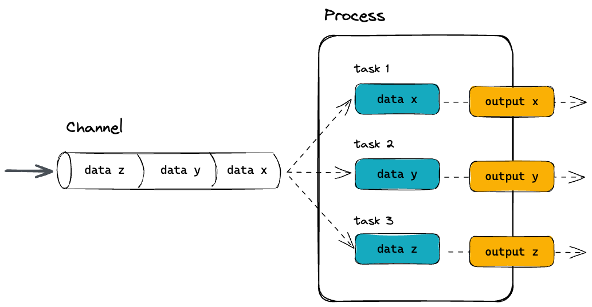
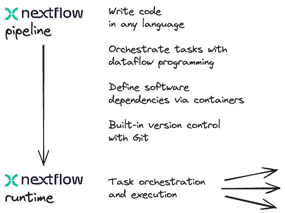

# Introduction to Nextflow

!!! clipboard-list "Objectives"

    - Learn about the core features of Nextflow
    - Learn Nextflow terminology
    - Learn fundamental commands and options for executing pipelines

## What is Nextflow?

Nextflow is a **workflow orchestration engine** and domain-specific language (DSL) that makes it easy to write data-intensive computational pipelines.

It is designed around the idea that the Linux platform is the lingua franca of data science. Linux provides many simple but powerful command-line and scripting tools that, when chained together, facilitate complex data manipulations.

Nextflow extends this approach, adding the ability to define complex program interactions and a high-level parallel computational environment based on the dataflow programming model.

**Nextflow’s core features are:**

- Pipeline portability and reproducibility
- Scalability of parallelization and deployment
- Integration of existing tools, systems, and industry standards

Whether you are working with genomics data or other large and complex data sets, Nextflow can help you to streamline your pipeline and improve your productivity.

## Processes and Channels

In Nextflow, **processes** and **channels** are the fundamental building blocks of a pipeline.

<br>
 
<br>

A **process** is a unit of execution that represents a single computational step in a pipeline. It is defined as a block of code that typically performs one specific task. Each process will specify its input and outputs, as well as any directives and conditional statements required for its execution. Processes can be written in any language that can be executed from the command line, such as Bash, Python, Perl, or R.

Processes in are executed independently (i.e., they do not share a common writable state) as **tasks**. Multiple tasks can run in parallel, allowing for efficient utilization of computing resources. Nextflow is a top down pipeline manager and will automatically manage data dependencies between processes, ensuring that each process is executed only when its input data is available and all of its dependencies have been satisfied.

A **channel** is an asynchronous first-in, first-out (FIFO) queue that is used to join processes together. Channels allow data to passed between processes and can be used to manage data, parallelize tasks, and structure pipelines. Any process can define one or more channels as an input and output. Ultimately the pipeline execution flow itself, is implicitly defined by the channel declarations.

Importantly, processes can be **parameterised** to allow for flexibility in their behavior and to enable their reuse in and between pipelines. Parameters can be defined in the process declaration and can be passed to the process at runtime. Parameters can be used to specify the input and output files, as well as any other parameters required for the process to execute.

## Execution abstraction

While a process defines what command or script is executed, the **executor** determines how and where the script is executed.

Nextflow provides an **abstraction** between the pipeline’s functional logic and the underlying execution system. This abstraction allows users to define a pipeline once and execute it on different computing platforms without having to modify the pipeline definition.

<br>
 
<br>

If not specified, Nextflow will execute locally. Executing locally is useful for pipeline development and testing purposes. However, for real-world computational pipelines, a high-performance computing (HPC) or cloud platform is often required.

Nextflow provides a variety of built-in execution options, such as local execution, HPC cluster execution, and cloud-based execution, and allows users to easily switch between these options using command-line arguments.

You can find a full list of supported executors as well as how to configure them in the [Nextflow docs](https://www.nextflow.io/docs/latest/executor.html).

## Nextflow CLI

Nextflow implements a declarative **domain-specific language (DSL)** that simplifies the writing of complex data analysis pipelines as an extension of a general-purpose programming language. As a concise DSL, Nextflow handles recurrent use cases while having the flexibility and power to handle corner cases.

Nextflow is an extension of the Groovy programming language which, in turn, is a super-set of the Java programming language. Groovy can be thought of as “Python for Java” and simplifies the code.

Nextflow provides a robust command line interface for the management and execution of pipelines. Nextflow can be used on any POSIX compatible system (Linux, OS X, etc). It requires Bash 3.2 (or later) and Java 11 (or later) to be installed.

Nextflow is distributed as a self-installing package and does not require any special installation procedure.

!!! info "How to install Nextflow locally"

    1. Download the executable package using either `wget -qO- https://get.nextflow.io | bash` or `curl -s https://get.nextflow.io | bash`
    2. Make the binary executable on your system by running `chmod +x nextflow`
    3. Move the nextflow file to a directory accessible by your `$PATH` variable, e.g, `mv nextflow ~/bin/`

## Nextflow options and commands

Nextflow provides a robust command line interface for the management and execution of pipelines. The top-level interface consists of options and commands.

You can list Nextflow options and commands with the `-h` option:

```bash
nextflow -h
```

```console title="Output"
Usage: nextflow [options] COMMAND [arg...]

Options:
  -C
     Use the specified configuration file(s) overriding any defaults
  -D
     Set JVM properties
  -bg
     Execute nextflow in background
  -c, -config
     Add the specified file to configuration set
  -config-ignore-includes
     Disable the parsing of config includes
  -d, -dockerize
     Launch nextflow via Docker (experimental)
  [truncated]

Commands:
  clean         Clean up project cache and work directories
  clone         Clone a project into a folder
  config        Print a project configuration
  [truncated...]
```

Options for a commands can also be viewed by appending the `-help` option to a Nextflow command.

For example, options for the the run command can be viewed:

```bash
nextflow run -help
```

```console title="Output"
Execute a pipeline project
Usage: run [options] Project name or repository url
  Options:
    -E
       Exports all current system environment
       Default: false
    -ansi-log
       Enable/disable ANSI console logging
    -bucket-dir
       Remote bucket where intermediate result files are stored
    -cache
       Enable/disable processes caching
    -disable-jobs-cancellation
       Prevent the cancellation of child jobs on execution termination
    -dsl1
       Execute the workflow using DSL1 syntax
       Default: false
    -dsl2
       Execute the workflow using DSL2 syntax
       Default: false
    -dump-channels
       Dump channels for debugging purpose
    -dump-hashes
       Dump task hash keys for debugging purpose
       Default: false
    [truncated]
```

!!! question "Exercise"

    Find out which version of Nextflow you are using.

    ??? success "Solution"
    
        You can find out which version of Nextflow you are using by executing:

        ```bash
        nextflow -version
        ```

        You should see the following:

        ```console title="Output"
        N E X T F L O W
        version 23.10.0 build 5889
        created 15-10-2023 15:07 UTC (15:07 GMT)
        cite doi:10.1038/nbt.3820
        http://nextflow.io
        ```

## Managing your environment

You can use [environment variables](https://www.nextflow.io/docs/latest/config.html#environment-variables) to control the Nextflow runtime and the underlying Java virtual machine. These variables can be exported before running a pipeline and will be interpreted by Nextflow.

For most users, Nextflow will work without setting any environment variables. However, to improve reproducibility and to optimise your resources, you will benefit from establishing some of these.

For example, for consistency, it is good practice to pin the version of Nextflow you are using with the `NXF_VER` variable:

```bash
export NXF_VER=<version number>
```

!!! question "Exercise"

    Pin the version of Nextflow you are using to `23.10.0` by exporting an environmental variable:

    ??? success "Solution"
    
        Export the singularity cache using the `NXF_VER` environmental variable:

        ```bash
        export NXF_VER=23.04.0
        ```

        If the version you have pinned is different to the version of nextflow you are using, check that the `NXF_VER` has been applied:

        ```bash
        nextflow -version
        ```

        You should see nextflow update and print the following:

        ```console title="Output"
        N E X T F L O W
        version 23.10.0 build 5889
        created 15-10-2023 15:07 UTC (15:07 GMT)
        cite doi:10.1038/nbt.3820
        http://nextflow.io
        ```

!!! tip "How to manage environmental variables"
    
    You may want to include these, or other environmental variables, in your `.bashrc` file (or alternate) that is loaded when you log in so you don’t need to export variables every session.

A complete list of environmental variables can be found in the [Nextflow docs](https://www.nextflow.io/docs/latest/config.html#environment-variables).

## Executing a pipeline

Nextflow seamlessly integrates with code repositories such as [GitHub](https://github.com/). This feature allows you to manage your project code and use public Nextflow pipelines quickly, consistently, and transparently.

The Nextflow `pull` command will download a pipeline from a hosting platform into your global cache `$HOME/.nextflow/assets` folder. 

If you are pulling a project hosted in a remote code repository, you can specify its qualified name or the repository URL.

The qualified name is formed by two parts - the owner name and the repository name separated by a `/` character. For example, if a Nextflow project `bar` is hosted in a GitHub repository `foo` at the address `http://github.com/foo/bar`, it could be pulled using:

```bash
nextflow pull foo/bar
```

Or by using the complete URL:

```bash
nextflow pull http://github.com/foo/bar
```

Alternatively, the Nextflow `clone` command can be used to download a pipeline into a local directory of your choice:

```bash
nextflow clone foo/bar <your/path>
```

The Nextflow `run` command is used to initiate the execution of a pipeline:

```bash
nextflow run foo/bar
```

If you `run` a pipeline, it will look for a local file with the pipeline name you’ve specified. If that file does not exist, it will look for a public repository with the same name on GitHub (unless otherwise specified). If it is found, Nextflow will automatically `pull` the pipeline to your global cache and execute it.

!!! warning
    
    Be aware of what is already in your current working directory where you launch your pipeline. If your current working directory contains nextflow configuration files you may encounter unexpected results.

!!! question "Exercise"

    Execute the `hello` pipeline directly from `nextflow-io` [GitHub](https://github.com/nextflow-io/hello) repository.

    ??? success "Solution"

        Use the `run` command to execute the [nextflow-io/hello](https://github.com/nextflow-io/hello) pipeline:

        ```bash
        nextflow run nextflow-io/hello
        ```

        ```console title="Output"
        N E X T F L O W  ~  version 23.10.0
        Pulling nextflow-io/hello ...
        downloaded from https://github.com/nextflow-io/hello.git
        Launching `https://github.com/nextflow-io/hello` [pensive_crick] DSL2 - revision: 7588c46ffe [master]
        executor >  local (4)
        [13/b3f2c5] process > sayHello (3) [100%] 4 of 4 ✔
        Bonjour world!

        Hola world!

        Ciao world!

        Hello world!
        ```

More information about the Nextflow `run` command can be found in the [Nextflow docs](https://www.nextflow.io/docs/latest/cli.html#run).

## Executing a revision

When a Nextflow pipeline is created or updated using GitHub (or another code repository), a new revision is created. Each revision is identified by a unique number, which can be used to track changes made to the pipeline and to ensure that the same version of the pipeline is used consistently across different runs.

The Nextflow `info` command can be used to view pipeline properties, such as the project name, repository, local path, main script, and revisions. The `*` indicates which revision of the pipeline you have stickied and will be executed when using the `run` command.

```bash
nextflow info <pipeline>
```

It is recommended that you use the revision flag every time you execute a pipeline to ensure that the version is correct.

To use a specific revision, you simply need to add it to the command line with the `--revision` or `-r` flag. For example, to run a pipeline with the `v1.0` revision, you would use the following:

```bash
nextflow run <pipeline> -r v1.0
```

Nextflow automatically provides built-in support for version control using Git. With this, users can easily manage and track changes made to a pipeline over time. A revision can be a git `branch`, `tag` or commit `SHA` number, and can be used interchangeably.

!!! question "Exercise"

    Execute the `hello` pipeline directly from the `nextflow-io` GitHub using the `v1.1` revision tag.

    ??? success "Solution"

        Use the `nextflow run` command to execute the `nextflow-io/hello` pipeline with the `v1.1` revision tag:

        ```bash
        nextflow run nextflow-io/hello -r v1.1
        ```

        ```console title="Output"
        N E X T F L O W  ~  version 23.10.0
        NOTE: Your local project version looks outdated - a different revision is available in the remote repository [3b355db864]
        Nextflow DSL1 is no longer supported — Update your script to DSL2, or use Nextflow 22.10.x or earlier
        ```

        !!! warning "Warning"

            The warning shown above is expected as the `v1.1` pipeline revision was written using an older version of Nextflow that uses the depreciated `echo` method.
            
            As both Nextflow and pipelines are updated independently over time, pipelines and Nextflow functions can get out of sync. While most nf-core pipelines are now `dsl2` (the current way of writing pipelines), some are still written in `dsl1` and may require older version of Nextflow.

            You can use an older version of nextflow on the fly by adding adding the environmental variable to the start of the run command 
            
            ```bash
            NXF_VER=22.10.0 nextflow run nextflow-io/hello -r v1.1
            ```

            ```console title="Output"
            N E X T F L O W  ~  version 22.10.0
            NOTE: Your local project version looks outdated - a different revision is available in the remote repository [3b355db864]
            Launching `https://github.com/nextflow-io/hello` [awesome_kalam] DSL1 - revision: baba3959d7 [v1.1]
            WARN: The use of `echo` method has been deprecated
            executor >  local (4)
            [e7/a48b3f] process > sayHello (4) [100%] 4 of 4 ✔
            Hello world! (version 1.1)

            Bojour world! (version 1.1)

            Ciao world! (version 1.1)

            Hola world! (version 1.1)
            ```

## Nextflow log

It is important to keep a record of the commands you have run to generate your results. Nextflow helps with this by creating and storing metadata and logs about the run in hidden files and folders in your current directory (unless otherwise specified). This data can be used by Nextflow to generate reports. It can also be queried using the Nextflow `log` command:

```bash
nextflow log
```

The `log` command has multiple options to facilitate the queries and is especially useful while debugging a pipeline and inspecting execution metadata. You can view all of the possible `log` options with `-h` flag:

```bash
nextflow log -h
```

To query a specific execution you can use the `RUN NAME` or a `SESSION ID`:

```bash
nextflow log <run name>
```

To get more information, you can use the `-f` option with named fields. For example:

```bash
nextflow log <run name> -f process,hash,duration
```

There are many other fields you can query. You can view a full list of fields with the `-l` option:

```bash
nextflow log -l
```

!!! question "Exercise"

    Use the `log` command to view with `process`, `hash`, and `script` fields for your tasks from your most recent Nextflow execution.

    ??? success "Solution"

        Use the `log` command to get a list of you recent executions:

        ```bash
        nextflow log
        ```

        ```console title="Output"
        TIMESTAMP               DURATION        RUN NAME        STATUS  REVISION ID     SESSION ID                              COMMAND                               
        2023-12-15 15:23:51     2.4s            pensive_crick   OK      7588c46ffe      3f3baf7b-81ca-41c9-ac08-acd73d016713    nextflow run hello                    
        2023-12-15 15:26:52     2.6s            awesome_kalam   OK      baba3959d7      b4c30259-4b88-4f61-a8a8-23b6bc997e83    nextflow run nextflow-io/hello -r v1.1
        ```

        Query the process, hash, and script using the `-f` option for the most recent run:

        ```bash
        nextflow log awesome_kalam -f process,hash,script
        ```

        ```console title="Output"
        sayHello        50/107123
          echo 'Hello world! (version 1.1)'
          
        sayHello        7f/09ffa0
          echo 'Bojour world! (version 1.1)'
          
        sayHello        32/4785e8
          echo 'Ciao world! (version 1.1)'
          
        sayHello        e7/a48b3f
          echo 'Hola world! (version 1.1)'
        ```

## Execution cache and resume

Task execution **caching** is an essential feature of modern pipeline managers. Accordingly, Nextflow provides an automated caching mechanism for every execution.

When using the Nextflow `-resume` option, successfully completed tasks from previous executions are skipped and the previously cached results are used in downstream tasks.

Nextflow caching mechanism works by assigning a unique ID to each task. The task unique ID is generated as a 128-bit hash value composing the the complete file path, file size, and last modified timestamp. These ID's are used to create a separate execution directory where the tasks are executed and the outputs are stored. Nextflow will take care of the inputs and outputs in these folders for you.

A multi-step pipeline is required to demonstrate cache and resume. The [`christopher-hakkaart/nf-core-demo`](https://github.com/christopher-hakkaart/nf-core-demo/tree/master) pipeline was created with the nf-core `create` command and has the same structure as nf-core pipelines. It is a toy example with 3 processes:

1. [`SAMPLESHEET_CHECK`](https://github.com/christopher-hakkaart/nf-core-demo/blob/master/modules/local/samplesheet_check.nf)
    - Executes a custom python script to check the input [sample sheet](https://raw.githubusercontent.com/nf-core/test-datasets/viralrecon/samplesheet/samplesheet_test_illumina_amplicon.csv) is valid.
2. [`FASTQC`](https://github.com/christopher-hakkaart/nf-core-demo/blob/master/modules/nf-core/fastqc/main.nf)
    - Executes [FastQC](https://www.bioinformatics.babraham.ac.uk/projects/fastqc/) using the `.fastq.gz` files from the [sample sheet](https://raw.githubusercontent.com/nf-core/test-datasets/viralrecon/samplesheet/samplesheet_test_illumina_amplicon.csv) as inputs.
3. [`MULTIQC`](https://github.com/christopher-hakkaart/nf-core-demo/blob/master/modules/nf-core/multiqc/main.nf)
    - Executes [MultiQC](https://multiqc.info/) using the FastQC reports generated by the `FASTQC` process.

The [`christopher-hakkaartnf-core-demo`](https://github.com/christopher-hakkaart/nf-core-demo/tree/master) is a very small nf-core pipeline. It uses real data and bioinformatics software and requires additional configuration to run successfully.

To run this example you will need to include two profiles in your execution command. Profiles are sets of configuration options that can be accessed by Nextflow. Profiles will be explained in greater detail during the [configuring nf-core pipelines](../session_1/3_configuration.md) section of the workshop.

To run this pipeline, both the `test` profile and a software management profile (such as `singularity`) are required:

```bash
nextflow run christopher-hakkaart/nf-core-demo -profile test,singularity -r main
```
??? warning "This run requires 6GB of memory"

    If your session was spawned with less than 8GB of memory, above run will fail with the following error 
    ```
    Caused by:
    Process requirement exceeds available memory -- req: 6 GB; avail: 4 GB
    ```
The command line output will print something like this:

```console title="Output"
N E X T F L O W  ~  version 23.04.0
Launching `https://github.com/christopher-hakkaart/nf-core-demo` [voluminous_kay] DSL2 - revision: 17521af3a8 [main]


------------------------------------------------------
                                        ,--./,-.
        ___     __   __   __   ___     /,-._.--~'
  |\ | |__  __ /  ` /  \ |__) |__         }  {
  | \| |       \__, \__/ |  \ |___     \`-._,-`-,
                                        `._,._,'
  nf-core/demo v1.0dev-g17521af
------------------------------------------------------
Core Nextflow options
  revision                  : main
  runName                   : voluminous_kay
  containerEngine           : singularity
  launchDir                 : /scale_wlg_persistent/filesets/home/chrishakk/session1
  workDir                   : /scale_wlg_persistent/filesets/home/chrishakk/session1/work
  projectDir                : /home/chrishakk/.nextflow/assets/christopher-hakkaart/nf-core-demo
  userName                  : chrishakk
  profile                   : test,singularity
  configFiles               : /home/chrishakk/.nextflow/assets/christopher-hakkaart/nf-core-demo/nextflow.config

Input/output options
  input                     : https://raw.githubusercontent.com/nf-core/test-datasets/viralrecon/samplesheet/samplesheet_test_illumina_amplicon.csv
  outdir                    : results

Reference genome options
  genome                    : R64-1-1
  fasta                     : s3://ngi-igenomes/igenomes/Saccharomyces_cerevisiae/Ensembl/R64-1-1/Sequence/WholeGenomeFasta/genome.fa

Institutional config options
  config_profile_name       : Test profile
  config_profile_description: Minimal test dataset to check pipeline function

Max job request options
  max_cpus                  : 2
  max_memory                : 6.GB
  max_time                  : 6.h

Generic options
  tracedir                  : null/pipeline_info

!! Only displaying parameters that differ from the pipeline defaults !!
------------------------------------------------------
If you use nf-core/demo for your analysis please cite:

* The nf-core framework
  https://doi.org/10.1038/s41587-020-0439-x

* Software dependencies
  https://github.com/nf-core/demo/blob/master/CITATIONS.md
------------------------------------------------------
Downloading plugin nf-amazon@1.16.1
[f2/e5eb26] process > NFCORE_DEMO:DEMO:INPUT_CHECK:SAMPLESHEET_CHECK (samplesheet_test_illumina_amplicon.csv) [100%] 1 of 1 ✔
[bb/f98425] process > NFCORE_DEMO:DEMO:FASTQC (SAMPLE1_PE_T1)                                                 [100%] 4 of 4 ✔
[dd/728742] process > NFCORE_DEMO:DEMO:MULTIQC                                                                [100%] 1 of 1 ✔
-
Completed at: 29-Sep-2023 22:16:49
Duration    : 2m 27s
CPU hours   : (a few seconds)
Succeeded   : 6
```

Executing this pipeline will create a `work` directory and a `results` directory with selected results files.

In the output above, the hexadecimal numbers, such as `bb/f98425`, identify the unique task execution. These numbers are also the prefix of the `work` directories where each task is executed.

You can inspect the files produced by a task by looking inside the `work` directory and using these numbers to find the task-specific execution path:

The files that have been selected for publication in the `results` folder can also be explored:

```bash
ls results
```

If you look inside the `work` directory of a `FASTQC` task, you will find the files that were staged and created when this task was executed:

The `FASTQC` process runs four times, executing in a different work directories for each set of inputs. Therefore, in the previous example, the work directory [bb/f98425] represents just one of the four sets of input data that was processed.

To print all the relevant paths to the screen, use the `-ansi-log` option can be used when executing your pipeline:

```bash
nextflow run christopher-hakkaart/nf-core-demo -profile test,singularity -r main -ansi-log false
```

It's very likely you will execute a pipeline multiple times as you find the parameters that best suit your data. You can save a lot of spaces (and time) if you **resume** a pipeline from the last step that was completed successfully or unmodified.

By adding the `-resume` option to your `run` command you can use the cache rather than re-running successful tasks:

```bash
nextflow run christopher-hakkaart/nf-core-demo -profile test,singularity -r main -resume
```

If you `run` the `christopher-hakkaart/nf-core-deme` pipeline again without making any changes you will see that the cache is used:

```console title="Output"
[truncated]
[5f/07e477] process > NFCORE_DEMO:DEMO:INPUT_CHECK:SAMPLESHEET_CHECK (samplesheet_test_illumina_amplicon.csv) [100%] 1 of 1, cached: 1 ✔
[b2/873706] process > NFCORE_DEMO:DEMO:FASTQC (SAMPLE2_PE_T1)                                                 [100%] 4 of 4, cached: 4 ✔
[ca/e8e0a8] process > NFCORE_DEMO:DEMO:MULTIQC                                                                [100%] 1 of 1, cached: 1 ✔
[truncated]
```

In practical terms, the pipeline is executed from the beginning. However, before launching the execution of a process, Nextflow uses the task unique ID to check if the work directory already exists and that it contains a valid command exit state with the expected output files. If this condition is satisfied, the task execution is skipped and previously computed results are used as the process results.

Notably, the `-resume` functionality is very sensitive. Even touching a file in the work directory can invalidate the cache.

!!! question "Exercise"

    Invalidate the cache by touching a `.fastq.gz` file in a `FASTQC` task work directory (you can use the `touch` command). Execute the pipeline again with the `-resume` option to show that the cache has been invalidated.

    ??? success "Solution"

        Execute the pipeline for the first time (if you have not already).

        ```bash
        nextflow run christopher-hakkaart/nf-core-demo -profile test,singularity -r main
        ```

        Use the task ID shown for the `FASTQC` process and use it to find and `touch` the `sample1_R1.fastq.gz` file:

        ```bash
        touch work/b2/87370687cc7cdec037ce4f36807d32/sample1_R1.fastq.gz
        ```

        Execute the pipeline again with the `-resume` command option:

        ```bash
        nextflow run christopher-hakkaart/nf-core-demo -profile test,singularity -r main -resume
        ```

        You should that 2 of 4 tasks for `FASTQC` and the `MULTIQC` task were invalid and were executed again.

        **Why did this happen?**

        In this example, the cache of two `FASTQC` tasks were invalid. The `sample1_R1.fastq.gz` file is used by in the [samplesheet](https://raw.githubusercontent.com/nf-core/test-datasets/viralrecon/samplesheet/samplesheet_test_illumina_amplicon.csv) twice. Thus, touching the symlink for this file and changing the date of last modification disrupted two task executions.

Your work directory can get very big very quickly (especially if you are using full sized datasets). It is good practise to `clean` your work directory regularly. Rather than removing the `work` folder with all of it's contents, the Nextflow `clean` function allows you to selectively remove data associated with specific runs.

```bash
nextflow clean -help
```

The `-after`, `-before`, and `-but` options are all very useful to select specific runs to `clean`. The `-dry-run` option is also very useful to see which files will be removed if you were to `-force` the `clean` command.


!!! question "Exercise"

    You Nextflow to `clean` your work `work` directory of staged files but **keep** your execution logs.

    ??? success "Solution"

        Use the Nextflow `clean` command with the `-k` and `-f` options:

        ```bash
        nextflow clean -k -f
        ```

## Listing and dropping cached pipelines

Over time, you might want to remove a stored pipelines. Nextflow also has functionality to help you to view and remove pipelines that have been pulled locally.

The Nextflow `list` command prints the projects stored in your global cache folder (`$HOME/.nextflow/assets`). These are the pipelines that were pulled when you executed either of the Nextflow `pull` or `run` commands:

```bash
nextflow list
```

If you want to remove a pipeline from your cache you can remove it using the Nextflow `drop` command:

```bash
nextflow drop < pipeline>
```

!!! question "Exercise"

    View your cached pipelines with the Nextflow `list` command and remove the `nextflow-io/hello` pipeline with the `drop` command.

    ??? success "Solution"

        List your pipeline assets:

        ```bash
        nextflow list
        ```

        Drop the `nextflow-io/hello` pipeline:

        ```bash
        nextflow drop nextflow-io/hello
        ```

        Check it has been removed:

        ```bash
        nextflow list
        ```
<br>
!!! circle-info ""

!!! cboard-list-2 "Key points"

    - Nextflow is a pipeline orchestration engine and domain-specific language (DSL) that makes it easy to write data-intensive computational pipelines
    - Environment variables can be used to control your Nextflow runtime and the underlying Java virtual machine
    - Nextflow supports version control and has automatic integrations with online code repositories.
    - Nextflow will cache your runs and they can be resumed with the `-resume` option
    - You can manage pipelines with Nextflow commands (e.g., `pull`, `clone`, `list`, and `drop`)
