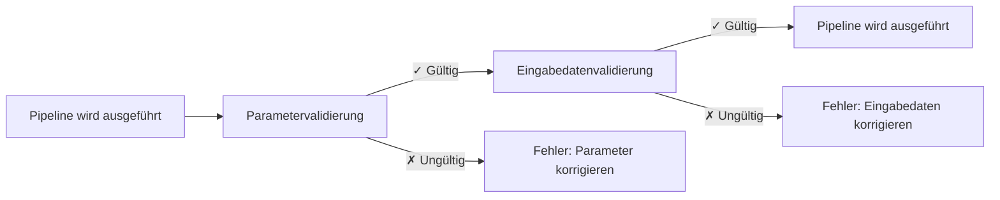

# Teil 5: Eingabevalidierung

<span class="ai-translation-notice">:material-information-outline:{ .ai-translation-notice-icon } KI-gestützte Übersetzung - [mehr erfahren & Verbesserungen vorschlagen](https://github.com/nextflow-io/training/blob/master/TRANSLATING.md)</span>

In diesem fünften Teil des Hello nf-core Trainingskurses zeigen wir dir, wie du das nf-schema Plugin verwendest, um Pipeline-Eingaben und Parameter zu validieren.

??? info "Wie du von diesem Abschnitt aus beginnen kannst"

    Dieser Abschnitt setzt voraus, dass du [Teil 4: Ein nf-core Modul erstellen](./04_make_module.md) abgeschlossen und das `COWPY` Prozessmodul auf nf-core Standards in deiner Pipeline aktualisiert hast.

    Falls du Teil 4 nicht abgeschlossen hast oder für diesen Teil neu beginnen möchtest, kannst du die `core-hello-part4` Lösung als Ausgangspunkt verwenden.
    Führe diese Befehle innerhalb des `hello-nf-core/` Verzeichnisses aus:

    ```bash
    cp -r solutions/core-hello-part4 core-hello
    cd core-hello
    ```

    Dies gibt dir eine Pipeline mit dem bereits auf nf-core Standards aktualisierten `COWPY` Modul.
    Du kannst testen, ob es erfolgreich läuft, indem du folgenden Befehl ausführst:

    ```bash
    nextflow run . --outdir core-hello-results -profile test,docker --validate_params false
    ```

---

## 0. Aufwärmen: Ein bisschen Hintergrund

### 0.1. Warum Validierung wichtig ist

Stell dir vor, du lässt deine Pipeline zwei Stunden laufen, nur damit sie abstürzt, weil eine Datei mit der falschen Erweiterung angegeben wurde. Oder du verbringst Stunden mit dem Debugging kryptischer Fehlermeldungen, nur um herauszufinden, dass ein Parameter falsch geschrieben wurde. Ohne Eingabevalidierung sind solche Szenarien häufig.

Betrachte dieses Beispiel:

```console title="Ohne Validierung"
$ nextflow run my-pipeline --input data.txt --output results

...2 Stunden später...

ERROR ~ No such file: 'data.fq.gz'
  Expected FASTQ format but received TXT
```

Die Pipeline hat ungültige Eingaben akzeptiert und lief stundenlang, bevor sie fehlschlug. Mit ordentlicher Validierung:

```console title="Mit Validierung"
$ nextflow run my-pipeline --input data.txt --output results

ERROR ~ Validation of pipeline parameters failed!

 * --input (data.txt): File extension '.txt' does not match required pattern '.fq.gz' or '.fastq.gz'
 * --output: required parameter is missing (expected: --outdir)

Pipeline failed before execution - please fix the errors above
```

Die Pipeline schlägt sofort mit klaren, umsetzbaren Fehlermeldungen fehl. Das spart Zeit, Rechenressourcen und Frustration.

### 0.2. Das nf-schema Plugin

Das [nf-schema Plugin](https://nextflow-io.github.io/nf-schema/latest/) ist ein Nextflow Plugin, das umfassende Validierungsfähigkeiten für Nextflow Pipelines bereitstellt.
Während nf-schema mit jedem Nextflow Workflow funktioniert, ist es die Standard-Validierungslösung für alle nf-core Pipelines.

nf-schema bietet mehrere Hauptfunktionen:

- **Parametervalidierung**: Validiert Pipeline-Parameter gegen `nextflow_schema.json`
- **Sample Sheet Validierung**: Validiert Eingabedateien gegen `assets/schema_input.json`
- **Channel-Konvertierung**: Konvertiert validierte Sample Sheets in Nextflow Channels
- **Hilfetext-Generierung**: Generiert automatisch `--help` Ausgabe aus Schema-Definitionen
- **Parameter-Zusammenfassung**: Zeigt an, welche Parameter von den Standardwerten abweichen

nf-schema ist der Nachfolger des veralteten nf-validation Plugins und verwendet standard [JSON Schema Draft 2020-12](https://json-schema.org/) für die Validierung.

??? info "Was sind Nextflow Plugins?"

    Plugins sind Erweiterungen, die der Nextflow Sprache selbst neue Funktionalität hinzufügen. Sie werden über einen `plugins{}` Block in `nextflow.config` installiert und können Folgendes bereitstellen:

    - Neue Funktionen und Klassen, die importiert werden können (wie `samplesheetToList`)
    - Neue DSL-Features und Operatoren
    - Integration mit externen Diensten

    Das nf-schema Plugin wird in `nextflow.config` spezifiziert:

    ```groovy
    plugins {
        id 'nf-schema@2.1.1'
    }
    ```

    Sobald es installiert ist, kannst du Funktionen aus Plugins mit der Syntax `include { functionName } from 'plugin/plugin-name'` importieren.

### 0.3. Zwei Schema-Dateien für zwei Arten von Validierung

Eine nf-core Pipeline verwendet zwei separate Schema-Dateien, die zwei Arten von Validierung entsprechen:

| Schema-Datei               | Zweck                   | Validiert                                              |
| -------------------------- | ----------------------- | ------------------------------------------------------ |
| `nextflow_schema.json`     | Parametervalidierung    | Kommandozeilen-Flags: `--input`, `--outdir`, `--batch` |
| `assets/schema_input.json` | Eingabedatenvalidierung | Inhalte von Sample Sheets und Eingabedateien           |

Beide Schemas verwenden das JSON Schema Format, ein weit verbreiteter Standard zur Beschreibung und Validierung von Datenstrukturen.

**Parametervalidierung** validiert Kommandozeilenparameter (Flags wie `--outdir`, `--batch`, `--input`):

- Prüft Parametertypen, Bereiche und Formate
- Stellt sicher, dass erforderliche Parameter angegeben sind
- Validiert, dass Dateipfade existieren
- Definiert in `nextflow_schema.json`

**Eingabedatenvalidierung** validiert die Struktur von Sample Sheets und Manifest-Dateien (CSV/TSV-Dateien, die deine Daten beschreiben):

- Prüft Spaltenstruktur und Datentypen
- Validiert, dass im Sample Sheet referenzierte Dateipfade existieren
- Stellt sicher, dass erforderliche Felder vorhanden sind
- Definiert in `assets/schema_input.json`

!!! warning "Was Eingabedatenvalidierung NICHT tut"

    Eingabedatenvalidierung prüft die Struktur von *Manifest-Dateien* (Sample Sheets, CSV-Dateien), NICHT den Inhalt deiner eigentlichen Datendateien (FASTQ, BAM, VCF, etc.).

    Für große Datenmengen sollte die Validierung von Dateiinhalten (wie die Überprüfung der BAM-Integrität) in Pipeline-Prozessen erfolgen, die auf Worker-Knoten laufen, nicht während der Validierungsphase auf der orchestrierenden Maschine.

### 0.4. Wann sollte Validierung stattfinden?



Validierung sollte **bevor** irgendwelche Pipeline-Prozesse laufen stattfinden, um schnelles Feedback zu geben und verschwendete Rechenzeit zu verhindern.

Lass uns nun diese Prinzipien in der Praxis anwenden, beginnend mit der Parametervalidierung.

---

## 1. Parametervalidierung (nextflow_schema.json)

Beginnen wir damit, Parametervalidierung zu unserer Pipeline hinzuzufügen. Dies validiert Kommandozeilen-Flags wie `--input`, `--outdir` und `--batch`.

### 1.1. Validierung so konfigurieren, dass Eingabedatei-Validierung übersprungen wird

Das nf-core Pipeline-Template kommt mit bereits installiertem und konfiguriertem nf-schema:

- Das nf-schema Plugin wird über den `plugins{}` Block in `nextflow.config` installiert
- Parametervalidierung ist standardmäßig über `params.validate_params = true` aktiviert
- Die Validierung wird vom `UTILS_NFSCHEMA_PLUGIN` Subworkflow während der Pipeline-Initialisierung durchgeführt

Das Validierungsverhalten wird über den `validation{}` Bereich in `nextflow.config` gesteuert.

Da wir zuerst an der Parametervalidierung arbeiten (dieser Abschnitt) und das Eingabedaten-Schema erst in Abschnitt 2 konfigurieren werden, müssen wir nf-schema vorübergehend anweisen, die Validierung der Dateiinhalte des `input` Parameters zu überspringen.

Öffne `nextflow.config` und finde den `validation` Block (um Zeile 246). Füge `ignoreParams` hinzu, um die Eingabedatei-Validierung zu überspringen:

=== "Nachher"

    ```groovy title="nextflow.config" hl_lines="3" linenums="246"
    validation {
        defaultIgnoreParams = ["genomes"]
        ignoreParams = ['input']
        monochromeLogs = params.monochrome_logs
    }
    ```

=== "Vorher"

    ```groovy title="nextflow.config" linenums="246"
    validation {
        defaultIgnoreParams = ["genomes"]
        monochromeLogs = params.monochrome_logs
    }
    ```

Diese Konfiguration weist nf-schema an:

- **`defaultIgnoreParams`**: Validierung komplexer Parameter wie `genomes` überspringen (im Template festgelegt)
- **`ignoreParams`**: Validierung der Dateiinhalte des `input` Parameters überspringen (vorübergehend; wir werden dies in Abschnitt 2 wieder aktivieren)
- **`monochromeLogs`**: Farbige Ausgabe in Validierungsmeldungen deaktivieren, wenn auf `true` gesetzt (gesteuert durch `params.monochrome_logs`)

!!! note "Warum den input Parameter ignorieren?"

    Der `input` Parameter in `nextflow_schema.json` hat `"schema": "assets/schema_input.json"`, was nf-schema anweist, die *Inhalte* der Eingabe-CSV-Datei gegen dieses Schema zu validieren.
    Da wir dieses Schema noch nicht konfiguriert haben, ignorieren wir diese Validierung vorübergehend.
    Wir werden diese Einstellung in Abschnitt 2 nach der Konfiguration des Eingabedaten-Schemas entfernen.

### 1.2. Das Parameter-Schema untersuchen

Schauen wir uns einen Abschnitt der `nextflow_schema.json` Datei an, die mit unserem Pipeline-Template kam:

```bash
grep -A 25 '"input_output_options"' nextflow_schema.json
```

Das Parameter-Schema ist in Gruppen organisiert. Hier ist die `input_output_options` Gruppe:

```json title="core-hello/nextflow_schema.json (Auszug)" linenums="8"
        "input_output_options": {
            "title": "Input/output options",
            "type": "object",
            "fa_icon": "fas fa-terminal",
            "description": "Define where the pipeline should find input data and save output data.",
            "required": ["input", "outdir"],
            "properties": {
                "input": {
                    "type": "string",
                    "format": "file-path",
                    "exists": true,
                    "schema": "assets/schema_input.json",
                    "mimetype": "text/csv",
                    "pattern": "^\\S+\\.csv$",
                    "description": "Path to comma-separated file containing information about the samples in the experiment.",
                    "help_text": "You will need to create a design file with information about the samples in your experiment before running the pipeline. Use this parameter to specify its location. It has to be a comma-separated file with 3 columns, and a header row.",
                    "fa_icon": "fas fa-file-csv"
                },
                "outdir": {
                    "type": "string",
                    "format": "directory-path",
                    "description": "The output directory where the results will be saved. You have to use absolute paths to storage on Cloud infrastructure.",
                    "fa_icon": "fas fa-folder-open"
                }
            }
        },
```

Jede hier beschriebene Eingabe hat die folgenden Haupteigenschaften, die validiert werden können:

- **`type`**: Datentyp (string, integer, boolean, number)
- **`format`**: Spezielle Formate wie `file-path` oder `directory-path`
- **`exists`**: Bei Dateipfaden prüfen, ob die Datei existiert
- **`pattern`**: Regulärer Ausdruck, dem der Wert entsprechen muss
- **`required`**: Array von Parameternamen, die angegeben werden müssen
- **`mimetype`**: Erwarteter Datei-Mimetype für die Validierung

Wenn du ein scharfes Auge hast, bemerkst du vielleicht, dass der `batch` Eingabeparameter, den wir verwendet haben, noch nicht im Schema definiert ist.
Wir werden ihn im nächsten Abschnitt hinzufügen.

??? info "Woher kommen Schema-Parameter?"

    Die Schema-Validierung verwendet `nextflow.config` als Basis für Parameterdefinitionen.
    Parameter, die anderswo in deinen Workflow-Skripten deklariert sind (wie in `main.nf` oder Moduldateien), werden **nicht** automatisch vom Schema-Validator erfasst.

    Das bedeutet, du solltest deine Pipeline-Parameter immer in `nextflow.config` deklarieren und dann ihre Validierungsregeln in `nextflow_schema.json` definieren.

### 1.3. Den batch Parameter hinzufügen

Während das Schema eine JSON-Datei ist, die manuell bearbeitet werden kann, ist **manuelle Bearbeitung fehleranfällig und nicht empfohlen**.
Stattdessen bietet nf-core ein interaktives GUI-Tool, das die JSON Schema Syntax für dich handhabt und deine Änderungen validiert:

```bash
nf-core pipelines schema build
```

Du solltest etwas Ähnliches sehen:

```console
                                      ,--./,-.
      ___     __   __   __   ___     /,-._.--\
|\ | |__  __ /  ` /  \ |__) |__         }  {
| \| |       \__, \__/ |  \ |___     \`-._,-`-,
                                      `._,._,'

nf-core/tools version 3.4.1 - https://nf-co.re

INFO     [✓] Default parameters match schema validation
INFO     [✓] Pipeline schema looks valid (found 17 params)
INFO     Writing schema with 17 params: 'nextflow_schema.json'
🚀  Launch web builder for customisation and editing? [y/n]:
```

Tippe `y` und drücke Enter, um die interaktive Web-Oberfläche zu starten.

Dein Browser öffnet sich und zeigt den Parameter Schema Builder:


Um den `batch` Parameter hinzuzufügen:

1. Klicke auf den **"Add parameter"** Button oben
2. Verwende den Ziehgriff (⋮⋮), um den neuen Parameter in die "Input/output options" Gruppe zu verschieben, unterhalb des `input` Parameters
3. Fülle die Parameterdetails aus:
   - **ID**: `batch`
   - **Description**: `Name for this batch of greetings`
   - **Type**: `string`
   - **Required**: aktiviere die Checkbox
   - Optional wähle ein Icon aus dem Icon-Picker (z.B. `fas fa-layer-group`)


Wenn du fertig bist, klicke auf den **"Finished"** Button oben rechts.

Zurück in deinem Terminal siehst du:

```console
INFO     Writing schema with 18 params: 'nextflow_schema.json'
⣾ Use ctrl+c to stop waiting and force exit.
```

Drücke `Ctrl+C`, um den Schema Builder zu beenden.

Das Tool hat nun deine `nextflow_schema.json` Datei mit dem neuen `batch` Parameter aktualisiert und dabei die gesamte JSON Schema Syntax korrekt gehandhabt.

### 1.4. Die Änderungen überprüfen

```bash
grep -A 25 '"input_output_options"' nextflow_schema.json
```

```json title="core-hello/nextflow_schema.json (Auszug)" linenums="8" hl_lines="19-23"
    "input_output_options": {
      "title": "Input/output options",
      "type": "object",
      "fa_icon": "fas fa-terminal",
      "description": "Define where the pipeline should find input data and save output data.",
      "required": ["input", "outdir", "batch"],
      "properties": {
        "input": {
          "type": "string",
          "format": "file-path",
          "exists": true,
          "schema": "assets/schema_input.json",
          "mimetype": "text/csv",
          "pattern": "^\\S+\\.csv$",
          "description": "Path to comma-separated file containing information about the samples in the experiment.",
          "help_text": "You will need to create a design file with information about the samples in your experiment before running the pipeline. Use this parameter to specify its location. It has to be a comma-separated file with 3 columns, and a header row.",
          "fa_icon": "fas fa-file-csv"
        },
        "batch": {
          "type": "string",
          "description": "Name for this batch of greetings",
          "fa_icon": "fas fa-layer-group"
        },
```

Du solltest sehen, dass der `batch` Parameter zum Schema hinzugefügt wurde und das "required" Feld nun `["input", "outdir", "batch"]` zeigt.

### 1.5. Parametervalidierung testen

Lass uns nun testen, dass die Parametervalidierung korrekt funktioniert.

Versuche zuerst, ohne den erforderlichen `input` Parameter zu laufen:

```bash
nextflow run . --outdir test-results -profile docker
```

??? warning "Befehlsausgabe"

    ```console
    ERROR ~ Validation of pipeline parameters failed!

    -- Check '.nextflow.log' file for details
    The following invalid input values have been detected:

    * Missing required parameter(s): input, batch
    ```

Perfekt! Die Validierung erfasst die fehlenden erforderlichen Parameter, bevor die Pipeline läuft.

Versuche es nun mit einem gültigen Satz von Parametern:

```bash
nextflow run . --input assets/greetings.csv --outdir results --batch my-batch -profile test,docker
```

??? success "Befehlsausgabe"

    ```console
     N E X T F L O W   ~  version 25.04.3

    Launching `./main.nf` [peaceful_wozniak] DSL2 - revision: b9e9b3b8de

    executor >  local (8)
    [de/a1b2c3] CORE_HELLO:HELLO:sayHello (3)       | 3 of 3 ✔
    [4f/d5e6f7] CORE_HELLO:HELLO:convertToUpper (3) | 3 of 3 ✔
    [8a/b9c0d1] CORE_HELLO:HELLO:CAT_CAT (test)     | 1 of 1 ✔
    [e2/f3a4b5] CORE_HELLO:HELLO:COWPY (test)       | 1 of 1 ✔
    -[core/hello] Pipeline completed successfully-
    ```

Die Pipeline sollte erfolgreich laufen, und der `batch` Parameter wird nun validiert.

### Fazit

Du hast gelernt, wie du das interaktive `nf-core pipelines schema build` Tool verwendest, um Parameter zu `nextflow_schema.json` hinzuzufügen und hast Parametervalidierung in Aktion gesehen.
Die Web-Oberfläche übernimmt die gesamte JSON Schema Syntax für dich und macht es einfach, komplexe Parameter-Schemas ohne fehleranfällige manuelle JSON-Bearbeitung zu verwalten.

### Was kommt als Nächstes?

Jetzt, wo die Parametervalidierung funktioniert, fügen wir Validierung für die Eingabedatei-Inhalte hinzu.

---

## 2. Eingabedatenvalidierung (schema_input.json)

Wir werden Validierung für die Inhalte unserer Eingabe-CSV-Datei hinzufügen.
Während die Parametervalidierung Kommandozeilen-Flags prüft, stellt die Eingabedatenvalidierung sicher, dass die Daten innerhalb der CSV-Datei korrekt strukturiert sind.

### 2.1. Das greetings.csv Format verstehen

Erinnern wir uns daran, wie unsere Eingabe aussieht:

```bash
cat assets/greetings.csv
```

```csv title="assets/greetings.csv"
Hello,en,87
Bonjour,fr,96
Holà,es,98
```

Dies ist eine einfache CSV mit:

- Drei Spalten (keine Kopfzeile)
- In jeder Zeile: eine Begrüßung, eine Sprache und eine Punktzahl
- Die ersten beiden Spalten sind Textstrings ohne besondere Formatanforderungen
- Die dritte Spalte ist eine Ganzzahl

Für unsere Pipeline ist nur die erste Spalte erforderlich.

### 2.2. Die Schema-Struktur entwerfen

Für unseren Anwendungsfall wollen wir:

1. CSV-Eingabe mit mindestens einer Spalte akzeptieren
2. Das erste Element jeder Zeile als Begrüßungsstring behandeln
3. Sicherstellen, dass Begrüßungen nicht leer sind und nicht mit Leerzeichen beginnen
4. Sicherstellen, dass das Sprachfeld mit einem der unterstützten Sprachcodes übereinstimmt (en, fr, es, it, de)
5. Sicherstellen, dass das Punktzahlfeld eine Ganzzahl mit einem Wert zwischen 0 und 100 ist

Wir strukturieren dies als Array von Objekten, wobei jedes Objekt mindestens ein `greeting` Feld hat.

### 2.3. Die Schema-Datei aktualisieren

Das nf-core Pipeline-Template enthält ein Standard-`assets/schema_input.json`, das für Paired-End-Sequenzierdaten entwickelt wurde.
Wir müssen es durch ein einfacheres Schema für unseren Begrüßungs-Anwendungsfall ersetzen.

Öffne `assets/schema_input.json` und ersetze die `properties` und `required` Abschnitte:

=== "Nachher"

    ```json title="assets/schema_input.json" linenums="1" hl_lines="10-25 27"
    {
        "$schema": "https://json-schema.org/draft/2020-12/schema",
        "$id": "https://raw.githubusercontent.com/core/hello/main/assets/schema_input.json",
        "title": "core/hello pipeline - params.input schema",
        "description": "Schema for the greetings file provided with params.input",
        "type": "array",
        "items": {
            "type": "object",
            "properties": {
                "greeting": {
                    "type": "string",
                    "pattern": "^\\S.*$",
                    "errorMessage": "Greeting must be provided and cannot be empty or start with whitespace"
                },
                "language": {
                    "type": "string",
                    "enum": ["en", "fr", "es", "it", "de"],
                    "errorMessage": "Language must be one of: en, fr, es, it, de"
                },
                "score": {
                    "type": "integer",
                    "minimum": 0,
                    "maximum": 100,
                    "errorMessage": "Score must be an integer with a value between 0 and 100"
                }
            },
            "required": ["greeting"]
        }
    }
    ```

=== "Vorher"

    ```json title="assets/schema_input.json" linenums="1" hl_lines="10-29 31"
    {
        "$schema": "https://json-schema.org/draft/2020-12/schema",
        "$id": "https://raw.githubusercontent.com/core/hello/main/assets/schema_input.json",
        "title": "core/hello pipeline - params.input schema",
        "description": "Schema for the file provided with params.input",
        "type": "array",
        "items": {
            "type": "object",
            "properties": {
                "sample": {
                    "type": "string",
                    "pattern": "^\\S+$",
                    "errorMessage": "Sample name must be provided and cannot contain spaces",
                    "meta": ["id"]
                },
                "fastq_1": {
                    "type": "string",
                    "format": "file-path",
                    "exists": true,
                    "pattern": "^([\\S\\s]*\\/)?[^\\s\\/]+\\.f(ast)?q\\.gz$",
                    "errorMessage": "FastQ file for reads 1 must be provided, cannot contain spaces and must have extension '.fq.gz' or '.fastq.gz'"
                },
                "fastq_2": {
                    "type": "string",
                    "format": "file-path",
                    "exists": true,
                    "pattern": "^([\\S\\s]*\\/)?[^\\s\\/]+\\.f(ast)?q\\.gz$",
                    "errorMessage": "FastQ file for reads 2 cannot contain spaces and must have extension '.fq.gz' or '.fastq.gz'"
                }
            },
            "required": ["sample", "fastq_1"]
        }
    }
    ```

Die wichtigsten Änderungen:

- **`description`**: Aktualisiert, um "greetings file" zu erwähnen
- **`properties`**: `sample`, `fastq_1` und `fastq_2` ersetzt durch `greeting`, `language` und `score`
  - **`type:`** Erzwingt entweder string (`greeting`, `language`) oder integer (`score`)
  - **`pattern: "^\\S.*$"`**: Begrüßung muss mit einem Nicht-Leerzeichen-Zeichen beginnen (kann danach aber Leerzeichen enthalten)
  - **`"enum": ["en", "fr", "es", "it", "de"]`**: Sprachcode muss in der unterstützten Menge sein
  - **`"minimum": 0` und `"maximum": 100`**: Punktzahlwert muss zwischen 0 und 100 liegen
  - **`errorMessage`**: Benutzerdefinierte Fehlermeldung, die bei fehlgeschlagener Validierung angezeigt wird
- **`required`**: Von `["sample", "fastq_1"]` zu `["greeting"]` geändert

### 2.4. Eine Kopfzeile zur greetings.csv Datei hinzufügen

Wenn nf-schema eine CSV-Datei liest, erwartet es, dass die erste Zeile Spaltenüberschriften enthält, die mit den Feldnamen im Schema übereinstimmen.

Für unseren einfachen Fall müssen wir unserer Greetings-Datei eine Kopfzeile hinzufügen:

=== "Nachher"

    ```csv title="assets/greetings.csv" linenums="1" hl_lines="1"
    greeting,language,score
    Hello,en,87
    Bonjour,fr,96
    Holà,es,98
    ```

=== "Vorher"

    ```csv title="assets/greetings.csv" linenums="1"
    Hello,en,87
    Bonjour,fr,96
    Holà,es,98
    ```

Nun hat die CSV-Datei eine Kopfzeile, die mit den Feldnamen in unserem Schema übereinstimmt.

Der letzte Schritt ist, die Validierung im Pipeline-Code mit `samplesheetToList` zu implementieren.

### 2.5. Validierung in der Pipeline implementieren

Jetzt müssen wir unser einfaches CSV-Parsing durch die `samplesheetToList` Funktion von nf-schema ersetzen, die das Samplesheet validieren und parsen wird.

Die `samplesheetToList` Funktion:

1. Liest das Eingabe-Sample Sheet (CSV, TSV, JSON oder YAML)
2. Validiert es gegen das bereitgestellte JSON Schema
3. Gibt eine Groovy-Liste zurück, bei der jeder Eintrag einer Zeile entspricht
4. Wirft hilfreiche Fehlermeldungen, wenn die Validierung fehlschlägt

Lass uns den Code für die Eingabebehandlung aktualisieren:

Öffne `subworkflows/local/utils_nfcore_hello_pipeline/main.nf` und finde den Abschnitt, in dem wir den Eingabekanal erstellen (um Zeile 80).

Wir müssen:

1. Die `samplesheetToList` Funktion verwenden (bereits im Template importiert)
2. Die Eingabe validieren und parsen
3. Nur die Begrüßungsstrings für unseren Workflow extrahieren

Beachte zunächst, dass die `samplesheetToList` Funktion bereits am Anfang der Datei importiert ist (das nf-core Template enthält dies standardmäßig):

```groovy title="core-hello/subworkflows/local/utils_nfcore_hello_pipeline/main.nf" linenums="1" hl_lines="13"
//
// Subworkflow mit Funktionalität spezifisch für die core/hello Pipeline
//

/*
~~~~~~~~~~~~~~~~~~~~~~~~~~~~~~~~~~~~~~~~~~~~~~~~~~~~~~~~~~~~~~~~~~~~~~~~~~~~~~~~~~~~~~~~
    IMPORT FUNCTIONS / MODULES / SUBWORKFLOWS
~~~~~~~~~~~~~~~~~~~~~~~~~~~~~~~~~~~~~~~~~~~~~~~~~~~~~~~~~~~~~~~~~~~~~~~~~~~~~~~~~~~~~~~~
*/

include { UTILS_NFSCHEMA_PLUGIN     } from '../../nf-core/utils_nfschema_plugin'
include { paramsSummaryMap          } from 'plugin/nf-schema'
include { samplesheetToList         } from 'plugin/nf-schema'
include { paramsHelp                } from 'plugin/nf-schema'
include { completionSummary         } from '../../nf-core/utils_nfcore_pipeline'
include { UTILS_NFCORE_PIPELINE     } from '../../nf-core/utils_nfcore_pipeline'
include { UTILS_NEXTFLOW_PIPELINE   } from '../../nf-core/utils_nextflow_pipeline'
```

Aktualisiere nun den Code zur Channel-Erstellung:

=== "Nachher"

    ```groovy title="core-hello/subworkflows/local/utils_nfcore_hello_pipeline/main.nf" linenums="80" hl_lines="4"
        //
        // Channel aus der Eingabedatei erstellen, die über params.input bereitgestellt wird
        //
        ch_samplesheet = channel.fromList(samplesheetToList(params.input, "${projectDir}/assets/schema_input.json"))
            .map { line -> line[0] }

        emit:
        samplesheet = ch_samplesheet
        versions    = ch_versions
    ```

=== "Vorher"

    ```groovy title="core-hello/subworkflows/local/utils_nfcore_hello_pipeline/main.nf" linenums="80" hl_lines="4 5"
        //
        // Channel aus der Eingabedatei erstellen, die über params.input bereitgestellt wird
        //
        ch_samplesheet = channel.fromPath(params.input)
            .splitCsv()
            .map { line -> line[0] }

        emit:
        samplesheet = ch_samplesheet
        versions    = ch_versions
    ```

Lass uns aufschlüsseln, was sich geändert hat:

1. **`samplesheetToList(params.input, "${projectDir}/assets/schema_input.json")`**: Validiert die Eingabedatei gegen unser Schema und gibt eine Liste zurück
2. **`Channel.fromList(...)`**: Konvertiert die Liste in einen Nextflow Channel

Dies vervollständigt die Implementierung der Eingabedatenvalidierung mit `samplesheetToList` und JSON Schemas.

Jetzt, wo wir das Eingabedaten-Schema konfiguriert haben, können wir die vorübergehende Ignore-Einstellung entfernen, die wir zuvor hinzugefügt haben.

### 2.6. Eingabevalidierung wieder aktivieren

Öffne `nextflow.config` und entferne die `ignoreParams` Zeile aus dem `validation` Block:

=== "Nachher"

    ```groovy title="nextflow.config" linenums="246"
    validation {
        defaultIgnoreParams = ["genomes"]
        monochromeLogs = params.monochrome_logs
    }
    ```

=== "Vorher"

    ```groovy title="nextflow.config" hl_lines="3" linenums="246"
    validation {
        defaultIgnoreParams = ["genomes"]
        ignoreParams = ['input']
        monochromeLogs = params.monochrome_logs
    }
    ```

Nun wird nf-schema sowohl Parametertypen ALS AUCH die Eingabedatei-Inhalte validieren.

### 2.7. Eingabevalidierung testen

Lass uns überprüfen, dass unsere Validierung funktioniert, indem wir sowohl gültige als auch ungültige Eingaben testen.

#### 2.7.1. Test mit gültiger Eingabe

Bestätige zunächst, dass die Pipeline erfolgreich mit gültiger Eingabe läuft.
Beachte, dass wir `--validate_params false` nicht mehr benötigen, da die Validierung funktioniert!

```bash
nextflow run . --outdir core-hello-results -profile test,docker
```

??? success "Befehlsausgabe"

    ```console
    ------------------------------------------------------
    WARN: The following invalid input values have been detected:

    * --character: tux


    executor >  local (8)
    [c1/39f64a] CORE_HELLO:HELLO:sayHello (1)       | 3 of 3 ✔
    [44/c3fb82] CORE_HELLO:HELLO:convertToUpper (3) | 3 of 3 ✔
    [62/80fab2] CORE_HELLO:HELLO:CAT_CAT (test)     | 1 of 1 ✔
    [e1/4db4fd] CORE_HELLO:HELLO:COWPY (test)       | 1 of 1 ✔
    -[core/hello] Pipeline completed successfully-
    ```

Großartig! Die Pipeline läuft erfolgreich und die Validierung wird stillschweigend bestanden.
Die Warnung über `--character` ist nur informativ, da er nicht im Schema definiert ist.
Wenn du möchtest, verwende das Gelernte, um auch für diesen Parameter Validierung hinzuzufügen!

#### 2.7.2. Test mit ungültiger Eingabe

Validierung zu bestehen ist immer ein gutes Gefühl, aber lass uns sicherstellen, dass die Validierung tatsächlich Fehler fängt.

Um eine Testdatei mit einem ungültigen Spaltennamen zu erstellen, beginne damit, eine Kopie der `greetings.csv` Datei zu erstellen:

```bash
cp assets/greetings.csv assets/invalid_greetings.csv
```

Öffne nun die Datei und ändere den Namen der ersten Spalte in der Kopfzeile von `greeting` zu `message`:

=== "Nachher"

    ```csv title="tmp_invalid_greetings.csv" hl_lines="1" linenums="1"
    message,language,score
    Hello,en,87
    Bonjour,fr,96
    Holà,es,98
    ```

=== "Vorher"

    ```csv title="tmp_invalid_greetings.csv" hl_lines="1" linenums="1"
    greeting,language,score
    Hello,en,87
    Bonjour,fr,96
    Holà,es,98
    ```

Dies stimmt nicht mit unserem Schema überein, daher sollte die Validierung einen Fehler werfen.

Versuche, die Pipeline mit dieser ungültigen Eingabe auszuführen:

```bash
nextflow run . --input assets/invalid_greetings.csv --outdir test-results -profile docker
```

??? failure "Befehlsausgabe"

    ```console
    N E X T F L O W   ~  version 24.10.4

    Launching `./main.nf` [trusting_ochoa] DSL2 - revision: b9e9b3b8de

    Input/output options
      input              : assets/invalid_greetings.csv
      outdir             : test-results

    Generic options
      trace_report_suffix: 2025-01-27_03-16-04

    Core Nextflow options
      runName            : trusting_ochoa
      containerEngine    : docker
      launchDir          : /workspace/hello-nf-core
      workDir            : /workspace/hello-nf-core/work
      projectDir         : /workspace/hello-nf-core
      userName           : user
      profile            : docker
      configFiles        : /workspace/hello-nf-core/nextflow.config

    !! Only displaying parameters that differ from the pipeline defaults !!
    ------------------------------------------------------
    ERROR ~ Validation of pipeline parameters failed!

     -- Check '.nextflow.log' file for details
    The following invalid input values have been detected:

    * Missing required parameter(s): batch
    * --input (assets/invalid_greetings.csv): Validation of file failed:
        -> Entry 1: Missing required field(s): greeting
        -> Entry 2: Missing required field(s): greeting
        -> Entry 3: Missing required field(s): greeting

     -- Check script 'subworkflows/nf-core/utils_nfschema_plugin/main.nf' at line: 68 or see '.nextflow.log' file for more details
    ```

Perfekt! Die Validierung hat den Fehler erfasst und eine klare, hilfreiche Fehlermeldung bereitgestellt, die auf Folgendes hinweist:

- Welche Datei bei der Validierung fehlgeschlagen ist
- Welcher Eintrag (Zeile 1, die erste Datenzeile) das Problem hat
- Was das spezifische Problem ist (fehlendes erforderliches Feld `greeting`)

Die Schema-Validierung stellt sicher, dass Eingabedateien die korrekte Struktur haben, bevor die Pipeline läuft, was Zeit spart und verwirrende Fehler später in der Ausführung verhindert.

Wenn du möchtest, kannst du gerne andere Greetings-Eingabedateien erstellen, die das Schema auf andere lustige Weisen verletzen.

### Fazit

Du hast sowohl Parametervalidierung als auch Eingabedatenvalidierung implementiert und getestet. Deine Pipeline validiert nun Eingaben vor der Ausführung und bietet schnelles Feedback und klare Fehlermeldungen.

!!! tip "Weiterführende Literatur"

    Um mehr über erweiterte Validierungsfunktionen und -muster zu erfahren, schaue dir die [nf-schema Dokumentation](https://nextflow-io.github.io/nf-schema/latest/) an. Der `nf-core pipelines schema build` Befehl bietet eine interaktive GUI zur Verwaltung komplexer Schemas.

### Was kommt als Nächstes?

Du hast alle fünf Teile des Hello nf-core Trainingskurses abgeschlossen!

Fahre mit der [Zusammenfassung](summary.md) fort, um über das Gelernte und Gebaute zu reflektieren.
