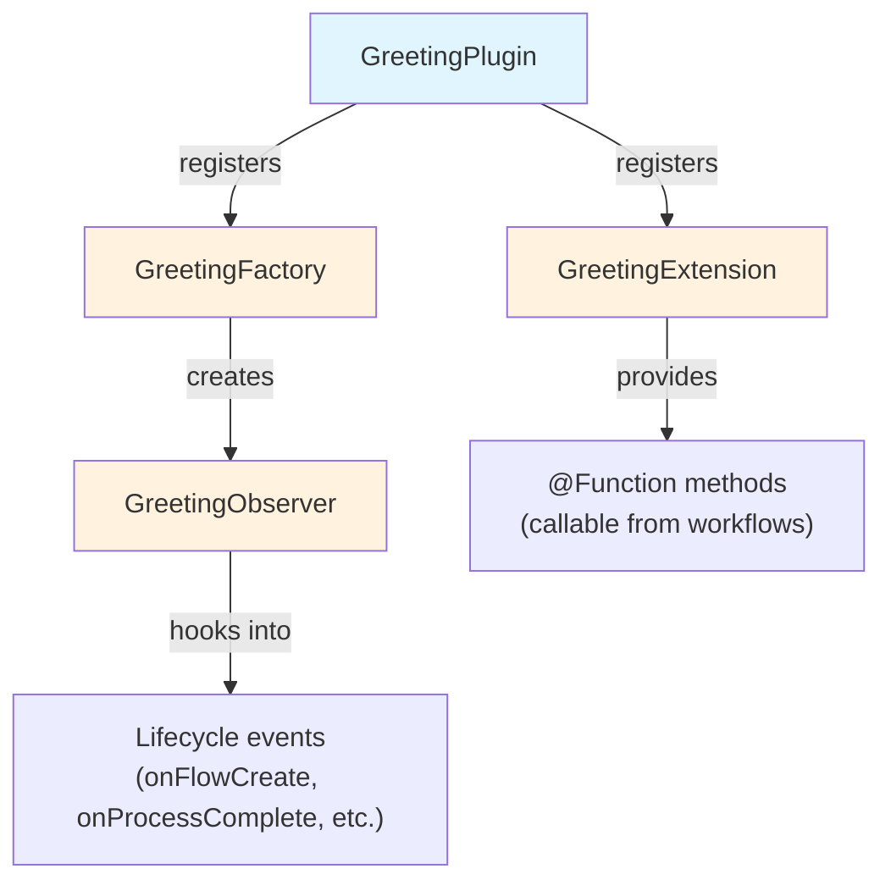

# Teil 2: Ein Plugin-Projekt erstellen

<span class="ai-translation-notice">:material-information-outline:{ .ai-translation-notice-icon } KI-gestützte Übersetzung - [mehr erfahren & Verbesserungen vorschlagen](https://github.com/nextflow-io/training/blob/master/TRANSLATING.md)</span>

Du hast gesehen, wie Plugins Nextflow um wiederverwendbare Funktionalität erweitern.
Jetzt erstellst du dein eigenes – beginnend mit einem Projekttemplate, das die Build-Konfiguration für dich übernimmt.

!!! tip "Hier eingestiegen?"

    Wenn du erst ab diesem Teil mitmachst, kopiere die Lösung aus Teil 1 als Ausgangspunkt:

    ```bash
    cp -r solutions/1-plugin-basics/* .
    ```

!!! info "Offizielle Dokumentation"

    Dieser und die folgenden Abschnitte behandeln die wesentlichen Grundlagen der Plugin-Entwicklung.
    Ausführliche Details findest du in der [offiziellen Nextflow-Dokumentation zur Plugin-Entwicklung](https://www.nextflow.io/docs/latest/plugins/developing-plugins.html).

---

## 1. Das Plugin-Projekt erstellen

Der eingebaute Befehl `nextflow plugin create` erzeugt ein vollständiges Plugin-Projekt:

```bash
nextflow plugin create nf-greeting training
```

```console title="Output"
Plugin created successfully at path: /workspaces/training/side-quests/plugin_development/nf-greeting
```

Das erste Argument ist der Plugin-Name, das zweite ist dein Organisationsname (wird verwendet, um den generierten Code in Verzeichnisse zu strukturieren).

!!! tip "Manuelle Erstellung"

    Du kannst Plugin-Projekte auch manuell erstellen oder das [nf-hello-Template](https://github.com/nextflow-io/nf-hello) auf GitHub als Ausgangspunkt verwenden.

---

## 2. Die Projektstruktur erkunden

Ein Nextflow-Plugin ist ein Stück Groovy-Software, das innerhalb von Nextflow läuft.
Es erweitert die Fähigkeiten von Nextflow über klar definierte Integrationspunkte – das bedeutet, es kann mit Nextflow-Funktionen wie Kanälen, Prozessen und der Konfiguration zusammenarbeiten.

Bevor du Code schreibst, schau dir an, was das Template generiert hat, damit du weißt, wo was hingehört.

Wechsle in das Plugin-Verzeichnis:

```bash
cd nf-greeting
```

Zeige den Inhalt an:

```bash
tree
```

Du solltest Folgendes sehen:

```console
.
├── build.gradle
├── COPYING
├── gradle
│   └── wrapper
│       ├── gradle-wrapper.jar
│       └── gradle-wrapper.properties
├── gradlew
├── Makefile
├── README.md
├── settings.gradle
└── src
    ├── main
    │   └── groovy
    │       └── training
    │           └── plugin
    │               ├── GreetingExtension.groovy
    │               ├── GreetingFactory.groovy
    │               ├── GreetingObserver.groovy
    │               └── GreetingPlugin.groovy
    └── test
        └── groovy
            └── training
                └── plugin
                    └── GreetingObserverTest.groovy

11 directories, 13 files
```

---

## 3. Die Build-Konfiguration erkunden

Ein Nextflow-Plugin ist Java-basierte Software, die kompiliert und gepackt werden muss, bevor Nextflow sie verwenden kann.
Dafür wird ein Build-Tool benötigt.

Gradle ist ein Build-Tool, das Code kompiliert, Tests ausführt und Software paketiert.
Das Plugin-Template enthält einen Gradle-Wrapper (`./gradlew`), sodass du Gradle nicht separat installieren musst.

Die Build-Konfiguration teilt Gradle mit, wie dein Plugin kompiliert werden soll, und teilt Nextflow mit, wie es geladen werden soll.
Zwei Dateien sind dabei besonders wichtig.

### 3.1. settings.gradle

Diese Datei identifiziert das Projekt:

```bash
cat settings.gradle
```

```groovy title="settings.gradle"
rootProject.name = 'nf-greeting'
```

Der Name hier muss mit dem übereinstimmen, den du in `nextflow.config` angibst, wenn du das Plugin verwendest.

### 3.2. build.gradle

In der Build-Datei findet der Großteil der Konfiguration statt:

```bash
cat build.gradle
```

Die Datei enthält mehrere Abschnitte.
Der wichtigste ist der `nextflowPlugin`-Block:

```groovy title="build.gradle"
plugins {
    id 'io.nextflow.nextflow-plugin' version '1.0.0-beta.10'
}

version = '0.1.0'

nextflowPlugin {
    nextflowVersion = '24.10.0'       // (1)!

    provider = 'training'             // (2)!
    className = 'training.plugin.GreetingPlugin'  // (3)!
    extensionPoints = [               // (4)!
        'training.plugin.GreetingExtension',
        'training.plugin.GreetingFactory'
    ]

}
```

1. **`nextflowVersion`**: Mindestens erforderliche Nextflow-Version
2. **`provider`**: Dein Name oder deine Organisation
3. **`className`**: Die Haupt-Plugin-Klasse – der Einstiegspunkt, den Nextflow zuerst lädt
4. **`extensionPoints`**: Klassen, die Nextflow um Funktionen erweitern (deine Funktionen, Monitoring usw.)

Der `nextflowPlugin`-Block konfiguriert:

- `nextflowVersion`: Mindestens erforderliche Nextflow-Version
- `provider`: Dein Name oder deine Organisation
- `className`: Die Haupt-Plugin-Klasse (der Einstiegspunkt, den Nextflow zuerst lädt, angegeben in `build.gradle`)
- `extensionPoints`: Klassen, die Nextflow um Funktionen erweitern (deine Funktionen, Monitoring usw.)

### 3.3. nextflowVersion aktualisieren

Das Template generiert einen `nextflowVersion`-Wert, der möglicherweise veraltet ist.
Aktualisiere ihn auf deine installierte Nextflow-Version, um volle Kompatibilität sicherzustellen:

=== "Danach"

    ```groovy title="build.gradle" hl_lines="2"
    nextflowPlugin {
        nextflowVersion = '25.10.0'

        provider = 'training'
    ```

=== "Vorher"

    ```groovy title="build.gradle" hl_lines="2"
    nextflowPlugin {
        nextflowVersion = '24.10.0'

        provider = 'training'
    ```

---

## 4. Die Quelldateien kennenlernen

Der Plugin-Quellcode befindet sich in `src/main/groovy/training/plugin/`.
Es gibt vier Quelldateien, jede mit einer eigenen Aufgabe:

| Datei                      | Aufgabe                                                          | Geändert in     |
| -------------------------- | ---------------------------------------------------------------- | --------------- |
| `GreetingPlugin.groovy`    | Einstiegspunkt, den Nextflow zuerst lädt                         | Nie (generiert) |
| `GreetingExtension.groovy` | Definiert Funktionen, die aus Workflows aufgerufen werden können | Teil 3          |
| `GreetingFactory.groovy`   | Erstellt Observer-Instanzen beim Start eines Workflows           | Teil 5          |
| `GreetingObserver.groovy`  | Führt Code als Reaktion auf Workflow-Lifecycle-Ereignisse aus    | Teil 5          |

Jede Datei wird in dem oben genannten Teil ausführlich vorgestellt, wenn du sie zum ersten Mal bearbeitest.
Die wichtigsten im Überblick:

- `GreetingPlugin` ist der Einstiegspunkt, den Nextflow lädt
- `GreetingExtension` stellt die Funktionen bereit, die dieses Plugin für Workflows verfügbar macht
- `GreetingObserver` läuft parallel zur Pipeline und reagiert auf Ereignisse, ohne dass Änderungen am Pipeline-Code erforderlich sind



---

## 5. Bauen, installieren und ausführen

Das Template enthält direkt funktionierenden Code, sodass du es sofort bauen und ausführen kannst, um zu überprüfen, ob das Projekt korrekt eingerichtet ist.

Kompiliere das Plugin und installiere es lokal:

```bash
make install
```

`make install` kompiliert den Plugin-Code und kopiert ihn in dein lokales Nextflow-Plugin-Verzeichnis (`$NXF_HOME/plugins/`), sodass er verwendet werden kann.

??? example "Build-Ausgabe"

    Beim ersten Ausführen lädt Gradle sich selbst herunter (das kann eine Minute dauern):

    ```console
    Downloading https://services.gradle.org/distributions/gradle-8.14-bin.zip
    ...10%...20%...30%...40%...50%...60%...70%...80%...90%...100%

    Welcome to Gradle 8.14!
    ...

    Deprecated Gradle features were used in this build...

    BUILD SUCCESSFUL in 23s
    5 actionable tasks: 5 executed
    ```

    **Die Warnungen sind erwartet.**

    - **"Downloading gradle..."**: Das passiert nur beim ersten Mal. Nachfolgende Builds sind deutlich schneller.
    - **"Deprecated Gradle features..."**: Diese Warnung kommt vom Plugin-Template, nicht von deinem Code. Sie kann ignoriert werden.
    - **"BUILD SUCCESSFUL"**: Das ist das Entscheidende. Dein Plugin wurde fehlerfrei kompiliert.

Wechsle zurück in das Pipeline-Verzeichnis:

```bash
cd ..
```

Füge das nf-greeting-Plugin zur `nextflow.config` hinzu:

=== "Danach"

    ```groovy title="nextflow.config" hl_lines="4"
    // Konfiguration für Plugin-Entwicklungsübungen
    plugins {
        id 'nf-schema@2.6.1'
        id 'nf-greeting@0.1.0'
    }
    ```

=== "Vorher"

    ```groovy title="nextflow.config"
    // Konfiguration für Plugin-Entwicklungsübungen
    plugins {
        id 'nf-schema@2.6.1'
    }
    ```

!!! note "Version für lokale Plugins erforderlich"

    Bei lokal installierten Plugins musst du die Version angeben (z. B. `nf-greeting@0.1.0`).
    Veröffentlichte Plugins in der Registry können mit nur dem Namen verwendet werden.

Führe die Pipeline aus:

```bash
nextflow run greet.nf -ansi-log false
```

Das Flag `-ansi-log false` deaktiviert die animierte Fortschrittsanzeige, sodass alle Ausgaben – einschließlich Observer-Meldungen – in der richtigen Reihenfolge ausgegeben werden.

```console title="Output"
Pipeline is starting! 🚀
[bc/f10449] Submitted process > SAY_HELLO (1)
[9a/f7bcb2] Submitted process > SAY_HELLO (2)
[6c/aff748] Submitted process > SAY_HELLO (3)
[de/8937ef] Submitted process > SAY_HELLO (4)
[98/c9a7d6] Submitted process > SAY_HELLO (5)
Output: Bonjour
Output: Hello
Output: Holà
Output: Ciao
Output: Hallo
Pipeline complete! 👋
```

(Die Reihenfolge der Ausgabe und die Work-Directory-Hashes können bei dir abweichen.)

Die Meldungen „Pipeline is starting!" und „Pipeline complete!" kommen dir vom nf-hello-Plugin aus Teil 1 bekannt vor – diesmal stammen sie jedoch vom `GreetingObserver` in deinem eigenen Plugin.
Die Pipeline selbst ist unverändert; der Observer läuft automatisch, weil er in der Factory registriert ist.

---

## Fazit

Du hast gelernt, dass:

- Der Befehl `nextflow plugin create` ein vollständiges Starterprojekt generiert
- `build.gradle` Plugin-Metadaten, Abhängigkeiten und die Klassen konfiguriert, die Funktionen bereitstellen
- Das Plugin vier Hauptkomponenten hat: Plugin (Einstiegspunkt), Extension (Funktionen), Factory (erstellt Monitore) und Observer (reagiert auf Workflow-Ereignisse)
- Der Entwicklungszyklus lautet: Code bearbeiten, `make install`, Pipeline ausführen

---

## Wie geht es weiter?

Jetzt implementierst du eigene Funktionen in der Extension-Klasse und verwendest sie im Workflow.

[Weiter zu Teil 3 :material-arrow-right:](03_custom_functions.md){ .md-button .md-button--primary }
