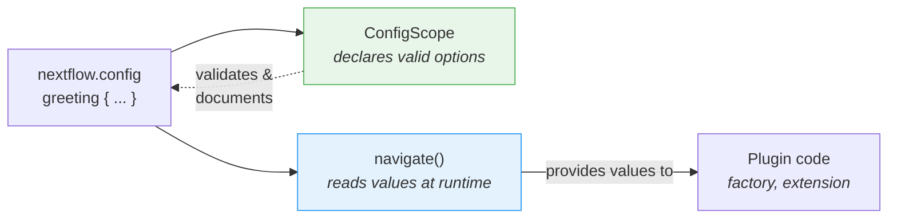

# Teil 6: Konfiguration

<span class="ai-translation-notice">:material-information-outline:{ .ai-translation-notice-icon } KI-gestützte Übersetzung - [mehr erfahren & Verbesserungen vorschlagen](https://github.com/nextflow-io/training/blob/master/TRANSLATING.md)</span>

Dein Plugin hat benutzerdefinierte Funktionen und einen Observer, aber alles ist fest im Code verankert.
Benutzer\*innen können den Task-Zähler nicht deaktivieren oder den Decorator ändern, ohne den Quellcode zu bearbeiten und neu zu bauen.

In Teil 1 hast du `#!groovy validation {}` und `#!groovy co2footprint {}` Blöcke in `nextflow.config` verwendet, um das Verhalten von nf-schema und nf-co2footprint zu steuern.
Diese Konfigurationsblöcke existieren, weil die Plugin-Entwickler\*innen diese Funktionalität eingebaut haben.
In diesem Abschnitt machst du dasselbe für dein eigenes Plugin.

**Ziele:**

1. Benutzer\*innen können Präfix und Suffix des Greeting-Decorators anpassen
2. Benutzer\*innen können das Plugin über `nextflow.config` aktivieren oder deaktivieren
3. Einen formalen Konfigurations-Scope registrieren, damit Nextflow den `#!groovy greeting {}` Block erkennt

**Was du änderst:**

| Datei                      | Änderung                                                        |
| -------------------------- | --------------------------------------------------------------- |
| `GreetingExtension.groovy` | Präfix/Suffix-Konfiguration in `init()` einlesen               |
| `GreetingFactory.groovy`   | Konfigurationswerte einlesen, um die Observer-Erstellung zu steuern |
| `GreetingConfig.groovy`    | Neue Datei: formale `@ConfigScope`-Klasse                       |
| `build.gradle`             | Die Konfigurationsklasse als Extension Point registrieren       |
| `nextflow.config`          | Einen `#!groovy greeting {}` Block zum Testen hinzufügen        |

!!! tip "Hier eingestiegen?"

    Wenn du erst ab diesem Teil mitmachst, kopiere die Lösung aus Teil 5 als Ausgangspunkt:

    ```bash
    cp -r solutions/5-observers/* .
    ```

!!! info "Offizielle Dokumentation"

    Umfassende Details zur Konfiguration findest du in der [Nextflow-Dokumentation zu Konfigurations-Scopes](https://nextflow.io/docs/latest/developer/config-scopes.html).

---

## 1. Den Decorator konfigurierbar machen

Die Funktion `decorateGreeting` umschließt jede Begrüßung mit `*** ... ***`.
Benutzer\*innen möchten vielleicht andere Markierungen verwenden, aber im Moment ist die einzige Möglichkeit, sie zu ändern, den Quellcode zu bearbeiten und neu zu bauen.

Die Nextflow-Session stellt eine Methode namens `session.config.navigate()` bereit, die verschachtelte Werte aus `nextflow.config` liest:

```groovy
// 'greeting.prefix' aus nextflow.config einlesen, Standardwert ist '***'
final prefix = session.config.navigate('greeting.prefix', '***') as String
```

Das entspricht einem Konfigurationsblock in der `nextflow.config` der Benutzer\*innen:

```groovy title="nextflow.config"
greeting {
    prefix = '>>>'
}
```

### 1.1. Das Einlesen der Konfiguration hinzufügen (das wird fehlschlagen!)

Bearbeite `GreetingExtension.groovy`, um die Konfiguration in `init()` einzulesen und in `decorateGreeting()` zu verwenden:

```groovy title="GreetingExtension.groovy" linenums="35" hl_lines="7-8 18"
@CompileStatic
class GreetingExtension extends PluginExtensionPoint {

    @Override
    protected void init(Session session) {
        // Konfiguration mit Standardwerten einlesen
        prefix = session.config.navigate('greeting.prefix', '***') as String
        suffix = session.config.navigate('greeting.suffix', '***') as String
    }

    // ... andere Methoden unverändert ...

    /**
    * Eine Begrüßung mit festlichen Markierungen versehen
    */
    @Function
    String decorateGreeting(String greeting) {
        return "${prefix} ${greeting} ${suffix}"
    }
```

Versuche zu bauen:

```bash
cd nf-greeting && make assemble
```

### 1.2. Den Fehler beobachten

Der Build schlägt fehl:

```console
> Task :compileGroovy FAILED
GreetingExtension.groovy: 30: [Static type checking] - The variable [prefix] is undeclared.
 @ line 30, column 9.
           prefix = session.config.navigate('greeting.prefix', '***') as String
           ^

GreetingExtension.groovy: 31: [Static type checking] - The variable [suffix] is undeclared.
```

In Groovy (und Java) musst du eine Variable _deklarieren_, bevor du sie verwendest.
Der Code versucht, Werte `prefix` und `suffix` zuzuweisen, aber die Klasse hat keine Felder mit diesen Namen.

### 1.3. Durch Deklaration von Instanzvariablen beheben

Füge Variablendeklarationen am Anfang der Klasse hinzu, direkt nach der öffnenden geschweifte Klammer:

```groovy title="GreetingExtension.groovy" linenums="35" hl_lines="4-5"
@CompileStatic
class GreetingExtension extends PluginExtensionPoint {

    private String prefix = '***'
    private String suffix = '***'

    @Override
    protected void init(Session session) {
        // Konfiguration mit Standardwerten einlesen
        prefix = session.config.navigate('greeting.prefix', '***') as String
        suffix = session.config.navigate('greeting.suffix', '***') as String
    }

    // ... Rest der Klasse unverändert ...
```

Diese zwei Zeilen deklarieren **Instanzvariablen** (auch Felder genannt), die zu jedem `GreetingExtension`-Objekt gehören.
Das Schlüsselwort `private` bedeutet, dass nur Code innerhalb dieser Klasse darauf zugreifen kann.
Jede Variable wird mit dem Standardwert `'***'` initialisiert.

Wenn das Plugin geladen wird, ruft Nextflow die Methode `init()` auf, die diese Standardwerte mit dem überschreibt, was die Benutzer\*innen in `nextflow.config` gesetzt haben.
Wenn nichts gesetzt wurde, gibt `navigate()` denselben Standardwert zurück, sodass das Verhalten unverändert bleibt.
Die Methode `decorateGreeting()` liest diese Felder dann bei jedem Aufruf.

!!! tip "Aus Fehlern lernen"

    Dieses Muster „erst deklarieren, dann verwenden" ist grundlegend für Java/Groovy, aber ungewohnt, wenn du aus Python oder R kommst, wo Variablen beim ersten Zuweisen entstehen.
    Diesen Fehler einmal zu erleben hilft dir, ihn in Zukunft schnell zu erkennen und zu beheben.

### 1.4. Bauen und testen

Bauen und installieren:

```bash
make install && cd ..
```

Aktualisiere `nextflow.config`, um die Dekoration anzupassen:

=== "Danach"

    ```groovy title="nextflow.config" hl_lines="7-10"
    // Konfiguration für Plugin-Entwicklungsübungen
    plugins {
        id 'nf-schema@2.6.1'
        id 'nf-greeting@0.1.0'
    }

    greeting {
        prefix = '>>>'
        suffix = '<<<'
    }
    ```

=== "Vorher"

    ```groovy title="nextflow.config"
    // Konfiguration für Plugin-Entwicklungsübungen
    plugins {
        id 'nf-schema@2.6.1'
        id 'nf-greeting@0.1.0'
    }
    ```

Die Pipeline ausführen:

```bash
nextflow run greet.nf -ansi-log false
```

```console title="Output (partial)"
Decorated: >>> Hello <<<
Decorated: >>> Bonjour <<<
...
```

Der Decorator verwendet jetzt das benutzerdefinierte Präfix und Suffix aus der Konfigurationsdatei.

Beachte, dass Nextflow eine Warnung „Unrecognized config option" ausgibt, weil noch nichts `greeting` als gültigen Scope deklariert hat.
Der Wert wird trotzdem korrekt über `navigate()` eingelesen, aber Nextflow markiert ihn als unbekannt.
Das behebst du in Abschnitt 3.

---

## 2. Den Task-Zähler konfigurierbar machen

Die Observer-Factory erstellt Observer derzeit bedingungslos.
Benutzer\*innen sollten das Plugin über die Konfiguration vollständig deaktivieren können.

Die Factory hat Zugriff auf die Nextflow-Session und ihre Konfiguration und ist daher der richtige Ort, um die Einstellung `enabled` einzulesen und zu entscheiden, ob Observer erstellt werden sollen.

=== "Danach"

    ```groovy title="GreetingFactory.groovy" linenums="31" hl_lines="3-4"
    @Override
    Collection<TraceObserver> create(Session session) {
        final enabled = session.config.navigate('greeting.enabled', true)
        if (!enabled) return []

        return [
            new GreetingObserver(),
            new TaskCounterObserver()
        ]
    }
    ```

=== "Vorher"

    ```groovy title="GreetingFactory.groovy" linenums="31"
    @Override
    Collection<TraceObserver> create(Session session) {
        return [
            new GreetingObserver(),
            new TaskCounterObserver()
        ]
    }
    ```

Die Factory liest jetzt `greeting.enabled` aus der Konfiguration und gibt eine leere Liste zurück, wenn die Benutzer\*innen es auf `false` gesetzt haben.
Wenn die Liste leer ist, werden keine Observer erstellt und die Lifecycle-Hooks des Plugins werden stillschweigend übersprungen.

### 2.1. Bauen und testen

Das Plugin neu bauen und installieren:

```bash
cd nf-greeting && make install && cd ..
```

Die Pipeline ausführen, um zu bestätigen, dass alles noch funktioniert:

```bash
nextflow run greet.nf -ansi-log false
```

??? exercise "Das Plugin vollständig deaktivieren"

    Setze `greeting.enabled = false` in `nextflow.config` und führe die Pipeline erneut aus.
    Was ändert sich in der Ausgabe?

    ??? solution "Lösung"

        ```groovy title="nextflow.config" hl_lines="8"
        // Konfiguration für Plugin-Entwicklungsübungen
        plugins {
            id 'nf-schema@2.6.1'
            id 'nf-greeting@0.1.0'
        }

        greeting {
            enabled = false
        }
        ```

        Die Meldungen „Pipeline is starting!", „Pipeline complete!" und die Task-Zählung verschwinden alle, weil die Factory eine leere Liste zurückgibt, wenn `enabled` false ist.
        Die Pipeline selbst läuft weiterhin, aber es sind keine Observer aktiv.

        Denke daran, `enabled` wieder auf `true` zu setzen (oder die Zeile zu entfernen), bevor du weitermachst.

---

## 3. Formale Konfiguration mit ConfigScope

Deine Plugin-Konfiguration funktioniert, aber Nextflow gibt weiterhin Warnungen „Unrecognized config option" aus.
Das liegt daran, dass `session.config.navigate()` nur Werte liest; nichts hat Nextflow mitgeteilt, dass `greeting` ein gültiger Konfigurations-Scope ist.

Eine `ConfigScope`-Klasse schließt diese Lücke.
Sie deklariert, welche Optionen dein Plugin akzeptiert, ihre Typen und ihre Standardwerte.
Sie **ersetzt** deine `navigate()`-Aufrufe nicht. Stattdessen arbeitet sie parallel dazu:



Ohne eine `ConfigScope`-Klasse funktioniert `navigate()` zwar noch, aber:

- Nextflow warnt vor unbekannten Optionen (wie du bereits gesehen hast)
- Keine IDE-Autovervollständigung für Benutzer\*innen, die `nextflow.config` schreiben
- Konfigurationsoptionen sind nicht selbstdokumentierend
- Typkonvertierung ist manuell (`as String`, `as boolean`)

Das Registrieren einer formalen Konfigurations-Scope-Klasse behebt die Warnung und löst alle drei Probleme.
Das ist derselbe Mechanismus hinter den `#!groovy validation {}` und `#!groovy co2footprint {}` Blöcken, die du in Teil 1 verwendet hast.

### 3.1. Die Konfigurationsklasse erstellen

Eine neue Datei erstellen:

```bash
touch nf-greeting/src/main/groovy/training/plugin/GreetingConfig.groovy
```

Die Konfigurationsklasse mit allen drei Optionen hinzufügen:

```groovy title="GreetingConfig.groovy" linenums="1"
package training.plugin

import nextflow.config.spec.ConfigOption
import nextflow.config.spec.ConfigScope
import nextflow.config.spec.ScopeName
import nextflow.script.dsl.Description

/**
 * Konfigurationsoptionen für das nf-greeting Plugin.
 *
 * Benutzer*innen konfigurieren diese in nextflow.config:
 *
 *     greeting {
 *         enabled = true
 *         prefix = '>>>'
 *         suffix = '<<<'
 *     }
 */
@ScopeName('greeting')                       // (1)!
class GreetingConfig implements ConfigScope { // (2)!

    GreetingConfig() {}

    GreetingConfig(Map opts) {               // (3)!
        this.enabled = opts.enabled as Boolean ?: true
        this.prefix = opts.prefix as String ?: '***'
        this.suffix = opts.suffix as String ?: '***'
    }

    @ConfigOption                            // (4)!
    @Description('Enable or disable the plugin entirely')
    boolean enabled = true

    @ConfigOption
    @Description('Prefix for decorated greetings')
    String prefix = '***'

    @ConfigOption
    @Description('Suffix for decorated greetings')
    String suffix = '***'
}
```

1. Entspricht dem `#!groovy greeting { }` Block in `nextflow.config`
2. Erforderliches Interface für Konfigurationsklassen
3. Sowohl ein No-Arg- als auch ein Map-Konstruktor werden benötigt, damit Nextflow die Konfiguration instanziieren kann
4. `@ConfigOption` markiert ein Feld als Konfigurationsoption; `@Description` dokumentiert es für Tooling

Wichtige Punkte:

- **`@ScopeName('greeting')`**: Entspricht dem `greeting { }` Block in der Konfiguration
- **`implements ConfigScope`**: Erforderliches Interface für Konfigurationsklassen
- **`@ConfigOption`**: Jedes Feld wird zu einer Konfigurationsoption
- **`@Description`**: Dokumentiert jede Option für Language-Server-Unterstützung (importiert aus `nextflow.script.dsl`)
- **Konstruktoren**: Sowohl No-Arg- als auch Map-Konstruktor werden benötigt

### 3.2. Die Konfigurationsklasse registrieren

Die Klasse zu erstellen reicht allein nicht aus.
Nextflow muss wissen, dass sie existiert. Daher registrierst du sie in `build.gradle` zusammen mit den anderen Extension Points.

=== "Danach"

    ```groovy title="build.gradle" hl_lines="4"
    extensionPoints = [
        'training.plugin.GreetingExtension',
        'training.plugin.GreetingFactory',
        'training.plugin.GreetingConfig'
    ]
    ```

=== "Vorher"

    ```groovy title="build.gradle"
    extensionPoints = [
        'training.plugin.GreetingExtension',
        'training.plugin.GreetingFactory'
    ]
    ```

Beachte den Unterschied zwischen der Registrierung von Factory und Extension Points:

- **`extensionPoints` in `build.gradle`**: Registrierung zur Kompilierzeit. Teilt dem Nextflow-Plugin-System mit, welche Klassen Extension Points implementieren.
- **`create()`-Methode der Factory**: Registrierung zur Laufzeit. Die Factory erstellt Observer-Instanzen, wenn ein Workflow tatsächlich startet.

### 3.3. Bauen und testen

```bash
cd nf-greeting && make install && cd ..
nextflow run greet.nf -ansi-log false
```

Das Verhalten der Pipeline ist identisch, aber die Warnung „Unrecognized config option" ist verschwunden.

!!! note "Was sich geändert hat und was nicht"

    Deine `GreetingFactory` und `GreetingExtension` verwenden weiterhin `session.config.navigate()`, um Werte zur Laufzeit einzulesen.
    Dieser Code hat sich nicht geändert.
    Die `ConfigScope`-Klasse ist eine parallele Deklaration, die Nextflow mitteilt, welche Optionen existieren.
    Beide Teile werden benötigt: `ConfigScope` deklariert, `navigate()` liest.

Dein Plugin hat jetzt dieselbe Struktur wie die Plugins, die du in Teil 1 verwendet hast.
Wenn nf-schema einen `#!groovy validation {}` Block oder nf-co2footprint einen `#!groovy co2footprint {}` Block bereitstellt, verwenden sie genau dieses Muster: eine `ConfigScope`-Klasse mit annotierten Feldern, die als Extension Point registriert ist.
Dein `#!groovy greeting {}` Block funktioniert auf dieselbe Weise.

---

## Fazit

Du hast gelernt, dass:

- `session.config.navigate()` Konfigurationswerte zur Laufzeit **liest**
- `@ConfigScope`-Klassen **deklarieren**, welche Konfigurationsoptionen existieren; sie arbeiten parallel zu `navigate()`, nicht anstelle davon
- Konfiguration sowohl auf Observer als auch auf Extension-Funktionen angewendet werden kann
- Instanzvariablen in Groovy/Java vor der Verwendung deklariert werden müssen; `init()` befüllt sie aus der Konfiguration, wenn das Plugin geladen wird

| Anwendungsfall                                  | Empfohlener Ansatz                                                    |
| ----------------------------------------------- | --------------------------------------------------------------------- |
| Schneller Prototyp oder einfaches Plugin        | Nur `session.config.navigate()`                                       |
| Produktions-Plugin mit vielen Optionen          | `ConfigScope`-Klasse parallel zu den `navigate()`-Aufrufen hinzufügen |
| Plugin, das du öffentlich teilen möchtest       | `ConfigScope`-Klasse parallel zu den `navigate()`-Aufrufen hinzufügen |

---

## Wie geht es weiter?

Dein Plugin hat jetzt alle Bestandteile eines Produktions-Plugins: benutzerdefinierte Funktionen, Trace-Observer und eine benutzerorientierte Konfiguration.
Der letzte Schritt ist die Paketierung für die Verteilung.

[Weiter zur Zusammenfassung :material-arrow-right:](summary.md){ .md-button .md-button--primary }
