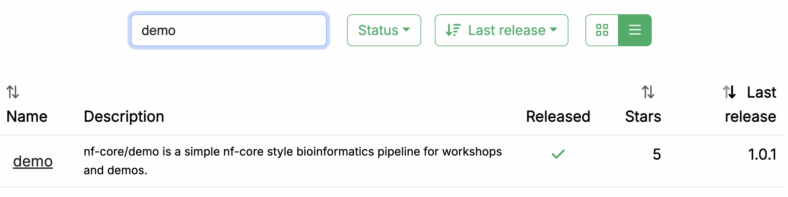
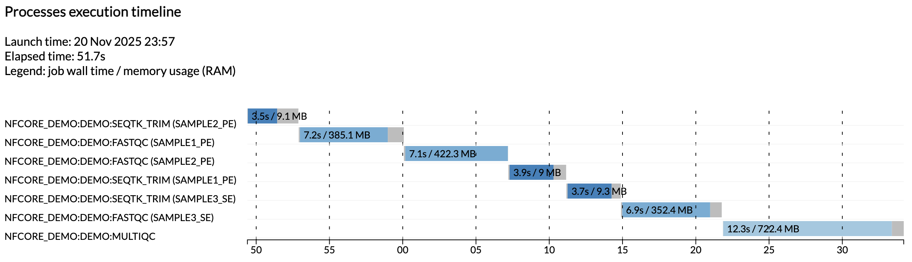

# Part 1: Run a demo pipeline

In this first part of the Hello nf-core training course, we show you how to find and try out an nf-core pipeline, configure and customize its execution for your needs, and understand how input validation protects against common errors.

We are going to use a pipeline called nf-core/demo that is maintained by the nf-core project as part of its inventory of pipelines for demonstration and training purposes.

Make sure your working directory is set to `hello-nf-core/` as instructed on the [Getting started](./00_orientation.md) page.

---

## 1. Find and retrieve the nf-core/demo pipeline

Let's start by locating the nf-core/demo pipeline on the project website at [nf-co.re](https://nf-co.re), which centralizes all information such as: general documentation and help articles, documentation for each of the pipelines, blog posts, event announcements and so forth.

### 1.1. Find the pipeline on the website

In your web browser, go to [https://nf-co.re/pipelines/](https://nf-co.re/pipelines/) and type `demo` in the search bar.



Click on the pipeline name, `demo`, to access the pipeline documentation page.

Each released pipeline has a dedicated page that includes the following documentation sections:

- **Introduction:** An introduction and overview of the pipeline
- **Usage:** Descriptions of how to execute the pipeline
- **Parameters:** Grouped pipeline parameters with descriptions
- **Output:** Descriptions and examples of the expected output files
- **Results:** Example output files generated from the full test dataset
- **Releases & Statistics:** Pipeline version history and statistics

Whenever you are considering adopting a new pipeline, you should read the pipeline documentation carefully first to understand what it does and how it should be configured before attempting to run it.

Have a look now and see if you can find out:

- Which tools the pipeline will run (Check the tab: `Introduction`)
- Which inputs and parameters the pipeline accepts or requires (Check the tab: `Parameters`)
- What are the outputs produced by the pipeline (Check the tab: `Output`)

#### 1.1.1. Pipeline overview

The `Introduction` tab provides an overview of the pipeline, including a visual representation (called a subway map) and a list of tools that are run as part of the pipeline.


1. Read QC (FASTQC)
2. Adapter and quality trimming (SEQTK_TRIM)
3. Present QC for raw reads (MULTIQC)

#### 1.1.2. Example command line

The documentation also provides an example input file (discussed further below) and an example command line.

```bash
nextflow run nf-core/demo \
  -profile <docker/singularity/.../institute> \
  --input samplesheet.csv \
  --outdir <OUTDIR>
```

You'll notice that the example command does NOT specify a workflow file, just the reference to the pipeline repository, `nf-core/demo`.

When invoked this way, Nextflow will assume that the code is organized in a certain way.
Let's retrieve the code so we can examine this structure.

### 1.2. Retrieve the pipeline code

Once we've determined that the pipeline appears to be suitable for our purposes, let's try it out.
Fortunately Nextflow makes it easy to retrieve pipelines from correctly-formatted repositories without having to download anything manually.

#### 1.2.1. Use `nextflow pull`

Let's return to the terminal and run the following:

```bash
nextflow pull nf-core/demo
```

??? success "Command output"

    ```console
    Checking nf-core/demo ...
    downloaded from https://github.com/nf-core/demo.git - revision: 45904cb9d1 [master]
    ```

Nextflow does a `pull` of the pipeline code, meaning it downloads the full repository to your local drive.

To be clear, you can do this with any Nextflow pipeline that is appropriately set up in GitHub, not just nf-core pipelines.
However nf-core is the largest open-source collection of Nextflow pipelines.

#### 1.2.2. Use `nextflow list`

You can get Nextflow to give you a list of what pipelines you have retrieved in this way:

```bash
nextflow list
```

??? success "Command output"

    ```console
    nf-core/demo
    ```

You can try pulling a few other pipelines to see how they get listed when you have more than one.

#### 1.2.3. Find your pipelines in `$NXF_HOME/assets/`

You'll notice that the files are not in your current work directory.
By default, Nextflow saves them to `$NXF_HOME/assets`.

```bash
tree -L 2 $NXF_HOME/assets/
```

```console title="Directory contents"
/workspaces/.nextflow/assets/
└── nf-core
    └── demo

2 directories, 0 files
```

!!! note

    The full path may differ on your system if you're not using our training environment.

Nextflow keeps the downloaded source code intentionally 'out of the way' on the principle that these pipelines should be used more like libraries than code that you would directly interact with.

#### 1.2.4. Create a symlink to access the source code easily

We're not going to look at the code in detail, but let's take a quick peek just to get a sense of what the overall organization looks like.

To make it easier to browse the pipeline source code, create a symbolic link to the assets directory:

```bash
ln -s $NXF_HOME/assets pipelines
```

This creates a shortcut so you can explore the code with `tree -L 2 pipelines` or open files directly.

#### 1.2.5. Overview of the code organization

You can either use `tree` or use the file explorer to find and open the `nf-core/demo` directory.

```bash
tree -L 1 pipelines/nf-core/demo
```

??? abstract "Directory contents"

    ```console
    pipelines/nf-core/demo
    ├── assets
    ├── CHANGELOG.md
    ├── CITATIONS.md
    ├── CODE_OF_CONDUCT.md
    ├── conf
    ├── docs
    ├── LICENSE
    ├── main.nf
    ├── modules
    ├── modules.json
    ├── nextflow.config
    ├── nextflow_schema.json
    ├── nf-test.config
    ├── README.md
    ├── ro-crate-metadata.json
    ├── subworkflows
    ├── tests
    ├── tower.yml
    └── workflows
    ```

As you can see, there's a lot going on in there, most of which you don't need to worry about.

Briefly, let's note that at the top level, you can find a README file with summary information, as well as accessory files that summarize project information such as licensing, contribution guidelines, citation and code of conduct.
Detailed pipeline documentation is located in the `docs` directory.
All of this content is used to generate the web pages on the nf-core website programmatically, so they're always up to date with the code.

For the rest, we can distinguish three functional groups of code files:

1. Pipeline code components (`main.nf`, `workflows`, `subworkflows`, `modules`)
2. Pipeline configuration
3. Pipeline parameters / inputs and validation

We won't go over the pipeline code components in this part of the course, but we will touch on elements of configuration and validation that are likely to be relevant to you as an end user of nf-core pipelines.

!!! tip

    You can also browse any nf-core pipeline's source code on GitHub, e.g. [github.com/nf-core/demo](https://github.com/nf-core/demo).
    Every nf-core pipeline follows the same directory layout, so once you know the structure, you can find configuration files, modules, and workflows for any pipeline the same way.

But for now, on to running the pipeline!

### Takeaway

You now know how to find a pipeline via the nf-core website and retrieve a local copy of the source code.

### What's next?

Learn how to try out an nf-core pipeline with minimal effort.

---

## 2. Try out the pipeline with its test profile

Conveniently, every nf-core pipeline comes with a test profile.
This is a minimal set of configuration settings for the pipeline to run using a small test dataset hosted in the [nf-core/test-datasets](https://github.com/nf-core/test-datasets) repository.
It's a great way to quickly try out a pipeline at small scale.

!!! note

    Nextflow's configuration profile system allows you to easily switch between different container engines or execution environments.
    For more details, see [Hello Nextflow Part 6: Configuration](../hello_nextflow/06_hello_config.md).

### 2.1. Examine the test profile

It's good practice to check what a pipeline's test profile specifies before running it.
The `test` profile for `nf-core/demo` lives in the configuration file `conf/test.config`.
You can find it locally inside the pipeline source that `nextflow pull` downloaded:

```bash
code $NXF_HOME/assets/nf-core/demo/conf/test.config
```

Here is the content of that file:

```groovy title="conf/test.config" linenums="1" hl_lines="8 26"
/*
~~~~~~~~~~~~~~~~~~~~~~~~~~~~~~~~~~~~~~~~~~~~~~~~~~~~~~~~~~~~~~~~~~~~~~~~~~~~~~~~~~~~~~~~
    Nextflow config file for running minimal tests
~~~~~~~~~~~~~~~~~~~~~~~~~~~~~~~~~~~~~~~~~~~~~~~~~~~~~~~~~~~~~~~~~~~~~~~~~~~~~~~~~~~~~~~~
    Defines input files and everything required to run a fast and simple pipeline test.

    Use as follows:
        nextflow run nf-core/demo -profile test,<docker/singularity> --outdir <OUTDIR>

----------------------------------------------------------------------------------------
*/

process {
    resourceLimits = [
        cpus: 2,
        memory: '4.GB',
        time: '1.h'
    ]
}

params {
    config_profile_name        = 'Test profile'
    config_profile_description = 'Minimal test dataset to check pipeline function'

    // Input data
    input  = 'https://raw.githubusercontent.com/nf-core/test-datasets/viralrecon/samplesheet/samplesheet_test_illumina_amplicon.csv'

}
```

You'll notice right away that the comment block at the top includes a usage example showing how to run the pipeline with this test profile.

```groovy title="conf/test.config" linenums="7"
    Use as follows:
        nextflow run nf-core/demo -profile test,<docker/singularity> --outdir <OUTDIR>
```

The only things we need to supply are what's shown between carets in the example command: `<docker/singularity>` and `<OUTDIR>`.

As a reminder, `<docker/singularity>` refers to the choice of container system. All nf-core pipelines are designed to be usable with containers (Docker, Singularity, etc.) to ensure reproducibility and eliminate software installation issues.
So we'll need to specify whether we want to use Docker or Singularity to test the pipeline.

The `--outdir <OUTDIR>` part refers to the directory where Nextflow will write the pipeline's outputs.
We need to provide a name for it, which we can just make up.
If it does not exist already, Nextflow will create it for us at runtime.

Moving on to the section after the comment block, the test profile shows us what has been pre-configured for testing: most notably, the `input` parameter is already set to point to a test dataset, so we don't need to provide our own data.
If you follow the link to the pre-configured input, you'll see it is a csv file containing sample identifiers and file paths for several experimental samples.

```csv title="samplesheet_test_illumina_amplicon.csv"
sample,fastq_1,fastq_2
SAMPLE1_PE,https://raw.githubusercontent.com/nf-core/test-datasets/viralrecon/illumina/amplicon/sample1_R1.fastq.gz,https://raw.githubusercontent.com/nf-core/test-datasets/viralrecon/illumina/amplicon/sample1_R2.fastq.gz
SAMPLE2_PE,https://raw.githubusercontent.com/nf-core/test-datasets/viralrecon/illumina/amplicon/sample2_R1.fastq.gz,https://raw.githubusercontent.com/nf-core/test-datasets/viralrecon/illumina/amplicon/sample2_R2.fastq.gz
SAMPLE3_SE,https://raw.githubusercontent.com/nf-core/test-datasets/viralrecon/illumina/amplicon/sample1_R1.fastq.gz,
SAMPLE3_SE,https://raw.githubusercontent.com/nf-core/test-datasets/viralrecon/illumina/amplicon/sample2_R1.fastq.gz,
```

This is called a samplesheet, and is the most common form of input to nf-core pipelines.

!!! note

    Don't worry if you're not familiar with the data formats and types, it's not important for what follows.

So this confirms that we have everything we need to try out the pipeline.

### 2.2. Run the pipeline

Let's decide to use Docker for the container system and `demo-results` as the output directory, and we're ready to run the test command:

```bash
nextflow run nf-core/demo -profile docker,test --outdir demo-results
```

??? success "Command output"

    ```console
     N E X T F L O W   ~  version 26.04.4

    Launching `https://github.com/nf-core/demo` [magical_pauling] revision: 45904cb9d1 [master]


    ------------------------------------------------------
                                            ,--./,-.
            ___     __   __   __   ___     /,-._.--~'
      |\ | |__  __ /  ` /  \ |__) |__         }  {
      | \| |       \__, \__/ |  \ |___     \`-._,-`-,
                                            `._,._,'
      nf-core/demo 1.1.0
    ------------------------------------------------------
    Input/output options
      input                     : https://raw.githubusercontent.com/nf-core/test-datasets/viralrecon/samplesheet/samplesheet_test_illumina_amplicon.csv
      outdir                    : demo-results

    Institutional config options
      config_profile_name       : Test profile
      config_profile_description: Minimal test dataset to check pipeline function

    Generic options
      trace_report_suffix       : 2025-11-21_04-57-41

    Core Nextflow options
      revision                  : master
      runName                   : magical_pauling
      containerEngine           : docker
      launchDir                 : /workspaces/training/hello-nf-core
      workDir                   : /workspaces/training/hello-nf-core/work
      projectDir                : /workspaces/.nextflow/assets/nf-core/demo
      userName                  : root
      profile                   : docker,test
      configFiles               : /workspaces/.nextflow/assets/nf-core/demo/nextflow.config

    !! Only displaying parameters that differ from the pipeline defaults !!
    ------------------------------------------------------
    * The pipeline
        https://doi.org/10.5281/zenodo.12192442

    * The nf-core framework
        https://doi.org/10.1038/s41587-020-0439-x

    * Software dependencies
        https://github.com/nf-core/demo/blob/master/CITATIONS.md


    executor >  local (7)
    [ff/a6976b] NFCORE_DEMO:DEMO:FASTQC (SAMPLE3_SE)     | 3 of 3 ✔
    [39/731ab7] NFCORE_DEMO:DEMO:SEQTK_TRIM (SAMPLE3_SE) | 3 of 3 ✔
    [7c/78d96e] NFCORE_DEMO:DEMO:MULTIQC                 | 1 of 1 ✔
    -[nf-core/demo] Pipeline completed successfully-
    ```

If your output matches that, congratulations! You've just run your first nf-core pipeline.

You'll notice that there is a lot more console output than when you run a basic Nextflow pipeline.
There's a header that includes a summary of the pipeline's version, inputs and outputs, and a few elements of configuration.

!!! note

    Your output will show different timestamps, execution names, and file paths, but the overall structure and process execution should be similar.

Notice the line near the top of the output:

```console
Launching `https://github.com/nf-core/demo` [magical_pauling] revision: 45904cb9d1 [master]
```

This tells you which revision of the pipeline was used.
Because we did not specify a version, Nextflow used the latest commit on `master`.
For reproducible runs, you should pin a specific release using the `-r` flag:

```bash
nextflow run nf-core/demo -r 1.1.0 -profile docker,test --outdir demo-results
```

This ensures that the same pipeline code is used every time, regardless of new commits or releases.
For this training we omit `-r` for simplicity, but in production you should always specify it.

Moving on to the execution output, let's have a look at the lines that tell us what processes were run:

```console
executor >  local (7)
[ff/a6976b] NFCORE_DEMO:DEMO:FASTQC (SAMPLE3_SE)     | 3 of 3 ✔
[39/731ab7] NFCORE_DEMO:DEMO:SEQTK_TRIM (SAMPLE3_SE) | 3 of 3 ✔
[7c/78d96e] NFCORE_DEMO:DEMO:MULTIQC                 | 1 of 1 ✔
-[nf-core/demo] Pipeline completed successfully-
```

This tells us that three processes were run, corresponding to the three tools shown in the pipeline documentation page on the nf-core website: FASTQC, SEQTK_TRIM and MULTIQC.

The full process names as shown here, such as `NFCORE_DEMO:DEMO:MULTIQC`, are longer than what you may have seen in the introductory Hello Nextflow material.
These include the names of their parent workflows and reflect the modularity of the pipeline code.
We'll go into more detail about that in Part 2 of this course.

### 2.3. Examine the pipeline's outputs

Finally, let's have a look at the `demo-results` directory produced by the pipeline.

```bash
tree -L 2 demo-results
```

??? abstract "Directory contents"

    ```console
    demo-results
    ├── fastqc
    │   ├── SAMPLE1_PE
    │   ├── SAMPLE2_PE
    │   └── SAMPLE3_SE
    ├── fq
    │   ├── SAMPLE1_PE
    │   ├── SAMPLE2_PE
    │   └── SAMPLE3_SE
    ├── multiqc
    │   ├── multiqc_data
    │   ├── multiqc_plots
    │   └── multiqc_report.html
    └── pipeline_info
        ├── execution_report_2025-11-21_04-57-41.html
        ├── execution_timeline_2025-11-21_04-57-41.html
        ├── execution_trace_2025-11-21_04-57-41.txt
        ├── nf_core_demo_software_mqc_versions.yml
        ├── params_2025-11-21_04-57-46.json
        └── pipeline_dag_2025-11-21_04-57-41.html
    ```

That might seem like a lot.
To learn more about the `nf-core/demo` pipeline's outputs, check out its [documentation page](https://nf-co.re/demo/1.1.0/docs/output/).

At this stage, what's important to observe is that the results are organized by module, and there is additionally a directory called `pipeline_info` containing various timestamped reports about the pipeline execution.

For example, the `execution_timeline_*` file shows you what processes were run, in what order and how long they took to run:



!!! note

    Here the tasks were not run in parallel because we are running on a minimalist machine in Github Codespaces.
    To see these run in parallel, try increasing the CPU allocation of your codespace and the resource limits in the test configuration.

These reports are generated automatically for all nf-core pipelines.

### Takeaway

You know how to run an nf-core pipeline using its built-in test profile and where to find its outputs.

### What's next?

Learn how to configure the pipeline to customize its execution.

---

## 3. Configure pipeline execution

As explained in [Hello Config](../hello_nextflow/06_hello_config.md), we want to be able to change what data our pipeline will run on and how it will run without changing the pipeline code itself.
To that end, Nextflow supports multiple ways of controlling pipeline configuration, which can be a bit overwhelming.

The nf-core project specifies conventions for organizing configuration elements, distinguishing two kinds of configuration at the top level: **pipeline parameters** and **configuration** in the strict sense.

- **Pipeline parameters** (set through the `params` system) typically include things like input files, tool behavior flags and analysis parameters.
- **Configuration** in the strict sense refers to the logistics of how the pipeline gets run, i.e. the executor, compute resource allocations and so on.

<figure class="excalidraw">
    --8<-- "docs/en/docs/hello_nf-core/img/params_vs_config.excalidraw.svg"
</figure>

Let's start by tackling pipeline parameters, then we'll look at configuration in the strict sense.

### 3.1. Pipeline parameters

For all nf-core pipelines, you can obtain a full list of pipeline parameters directly from the command line by using the `--help` flag, which is itself a pipeline parameter.

#### 3.1.1. Get the list of parameters with `--help`

Run the help command for the demo pipeline:

```bash
nextflow run nf-core/demo --help
```

??? success "Command output"

    ```console
     N E X T F L O W   ~  version 26.04.4

    Launching `https://github.com/nf-core/demo` [run_name] revision: 45904cb9d1 [master]

    ----------------------------------------------------
                                            ,--./,-.
            ___     __   __   __   ___     /,-._.--~'
      |\ | |__  __ /  ` /  \ |__) |__         }  {
      | \| |       \__, \__/ |  \ |___     \`-._,-`-,
                                            `._,._,'
      nf-core/demo 1.1.0
    ----------------------------------------------------
    Typical pipeline command:

      nextflow run nf-core/demo -profile <docker/singularity/.../institute> --input samplesheet.csv --outdir <OUTDIR>

    Input/output options
      --input                       [string]           Path to a metadata file containing information about the samples in the experiment.
      --outdir                      [string]           The output directory where the results will be saved. You have to use absolute paths to storage on Cloud infrastructure.
      --email                       [string]           Email address for completion summary.
      --multiqc_title               [string]           MultiQC report title. Printed as page header, used for filename if not otherwise specified.

    Reference genome options
      --genome                      [string]           Name of iGenomes reference.
      --fasta                       [string]           Path to FASTA genome file.

    Process skipping options
      --skip_trim                   [boolean]          Skip trimming fastq files with seqtk

    Generic options
      --multiqc_methods_description [string]           Custom MultiQC yaml file containing HTML including a methods description.
      --help                        [boolean, string]  Display the help message.
      --help_full                   [boolean]          Display the full detailed help message.
      --show_hidden                 [boolean]          Display hidden parameters in the help message (only works when --help or --help_full are provided).
     !! Hiding 20 param(s), use the `--show_hidden` parameter to show them !!
    ----------------------------------------------------

    * The pipeline
        https://doi.org/10.5281/zenodo.12192442

    * The nf-core framework
        https://doi.org/10.1038/s41587-020-0439-x

    * Software dependencies
        https://github.com/nf-core/demo/blob/master/CITATIONS.md
    ```

As you can see, the output groups parameters into categories (Input/output options, Reference genome options, etc.) with types and descriptions for each one.

This categorization is determined by a schema file, which is covered further below.
In plain Nextflow pipelines, `--help` only works if the developer implemented it manually.

!!! tip

    Use `--help --show_hidden` to see additional parameters that are hidden by default, such as `--publish_dir_mode` or `--monochrome_logs`.

#### 3.1.2. Set parameter values

As covered in [Hello Config](../hello_nextflow/06_hello_config.md), you can set parameter values on the command line with `--param_name` or collect a set of parameters in a YAML file and pass it with `-params-file`.
Both approaches work the same way with nf-core pipelines.

For example, to skip the trimming step:

```bash
nextflow run nf-core/demo -profile docker,test --outdir demo-results-notrim --skip_trim
```

??? success "Command output"

    ```console
    executor >  local (4)
    [3f/a82c91] NFCORE_DEMO:DEMO:FASTQC (SAMPLE3_SE) | 3 of 3 ✔
    [7d/c5e014] NFCORE_DEMO:DEMO:MULTIQC             | 1 of 1 ✔
    -[nf-core/demo] Pipeline completed successfully-
    ```

The `SEQTK_TRIM` process no longer appears in the output.

!!! info

    Although it is technically possible to set pipeline parameters in a custom configuration file passed with `-c`, this may not override defaults already set in the pipeline's own `nextflow.config`, depending on Nextflow's configuration precedence rules.
    Using `--param_name` on the command line or `-params-file` is more reliable, as these always take precedence.

    **As a rule of thumb:** if it appears in the `--help` output, set it via the command line or a params file rather than a config file.

#### 3.1.3. Parameter validation

Fun fact: the `--help` command works for all nf-core pipelines because the nf-core project requires developers to define all pipeline parameters formally in a JSON schema file (`nextflow_schema.json`).
This schema records each parameter's type, description, default value, and grouping.

In addition to powering the `--help` output, the schema file also enables automated validation at launch time.
This means that Nextflow can check that every parameter you pass exists and has been given an appropriate value (of appropriate type, within the allowed range of values etc).

We cover this in more detail in [Part 5: Input Validation](05_input_validation.md), but you can already see it in action by giving the demo pipeline some invalid parameter input.

##### 3.1.3.1. Unrecognized parameters

Try passing a parameter that does not exist:

```bash
nextflow run nf-core/demo -profile docker,test --outdir demo-results --foobar "invalid"
```

The console output includes a warning:

```console
WARN: The following invalid input values have been detected:

* --foobar: invalid
```

The pipeline still runs, but the warning alerts you right away that `--foobar` is not a recognized parameter.
This catches typos like `--outDir` instead of `--outdir` before you waste compute time wondering why the output went to the wrong place.

##### 3.1.3.2. Invalid parameter values

Validation also checks parameter **values**.
The `--skip_trim` parameter is a boolean flag, so passing a string value causes the pipeline to fail immediately:

```bash
nextflow run nf-core/demo -profile docker,test --outdir demo-results --skip_trim yes
```

```console
ERROR ~ Validation of pipeline parameters failed!

The following invalid input values have been detected:

* --skip_trim (yes): Value is [string] but should be [boolean]
```

The pipeline stops before any processes run, saving you from a failed or incorrect execution.
Boolean parameters should be passed as flags (`--skip_trim`) without a value, or set to `true`/`false` in a params file.

#### 3.1.4. Input validation

The same validation logic can also be used to check the validity of input files.
For example, if a pipeline expects a samplesheet as its main data input (which is the case of many if not most nf-core pipelines), the developer can provide an input schema (distinct from the parameters schema) describing how the input file should be structured.

Then, at runtime, Nextflow can check that the input file provided is valid.

We also cover this in more detail in [Part 5: Input Validation](05_input_validation.md), but you can already see it in action by giving the demo pipeline an invalid input samplesheet.

The `nf-core/demo` pipeline expects a CSV file with columns `sample`, `fastq_1`, and `fastq_2`.
This is defined in a schema file (`assets/schema_input.json`) that specifies the expected structure, column types, and constraints.

??? abstract "assets/schema_input.json"

    ```json title="assets/schema_input.json"
    {
        "$schema": "https://json-schema.org/draft/2020-12/schema",
        "$id": "https://raw.githubusercontent.com/nf-core/demo/master/assets/schema_input.json",
        "title": "nf-core/demo pipeline - params.input schema",
        "description": "Schema for the file provided with params.input",
        "type": "array",
        "items": {
            "type": "object",
            "properties": {
                "sample": {
                    "type": "string",
                    "pattern": "^\\S+$",
                    "errorMessage": "Sample name must be provided and cannot contain spaces",
                    "meta": ["id"]
                },
                "fastq_1": {
                    "type": "string",
                    "format": "file-path",
                    "exists": true,
                    "pattern": "^([\\S\\s]*\\/)?[^\\s\\/]+\\.f(ast)?q\\.gz$",
                    "errorMessage": "FastQ file for reads 1 must be provided, cannot contain spaces and must have extension '.fq.gz' or '.fastq.gz'"
                },
                "fastq_2": {
                    "type": "string",
                    "format": "file-path",
                    "exists": true,
                    "pattern": "^([\\S\\s]*\\/)?[^\\s\\/]+\\.f(ast)?q\\.gz$",
                    "errorMessage": "FastQ file for reads 2 cannot contain spaces and must have extension '.fq.gz' or '.fastq.gz'"
                }
            },
            "required": ["sample", "fastq_1"]
        }
    }
    ```

The schema specifies that `sample` and `fastq_1` are required, while `fastq_2` is optional (supporting both paired-end and single-end data).
File paths are validated for existence and extension pattern.

##### 3.1.4.1. Create an invalid samplesheet

Create a samplesheet with a missing column and a non-existent file path:

```csv title="malformed_samplesheet.csv"
sample,fastq_2
SAMPLE1,/not/a/real/file.fastq.gz
```

This samplesheet is missing the required `fastq_1` column and has a non-existent file path in `fastq_2`.
Both issues will produce validation errors in the next step.

##### 3.1.4.2. Run the demo pipeline with the invalid samplesheet

Run the demo pipeline using `malformed_samplesheet.csv` as the input.

```bash
nextflow run nf-core/demo -profile docker,test --outdir demo-results --input malformed_samplesheet.csv
```

```console
ERROR ~ Validation of pipeline parameters failed!

The following invalid input values have been detected:

* --input (malformed_samplesheet.csv): Validation of file failed:
    -> Entry 1: Error for field 'fastq_2' (/not/a/real/file.fastq.gz): the file or directory
       '/not/a/real/file.fastq.gz' does not exist (FastQ file for reads 2 cannot contain spaces
       and must have extension '.fq.gz' or '.fastq.gz')
    -> Entry 1: Missing required field(s): fastq_1
```

As you can see, the pipeline fails immediately and reports **all** validation errors at once.
nf-schema does not stop at the first error — it collects every problem and lists them together, so you can fix everything in one go rather than discovering issues one by one.

Each error identifies the exact entry and field that caused the problem, so you can fix your samplesheet then re-launch the pipeline with confidence that it's not going to fail at some later point when Nextflow actually goes to access the file path.

For developers, all of this is covered in more detail in [Part 5](./05_input_validation.md) of this course.

### 3.2. Configuration

Configuration in the strict sense controls **how** the pipeline runs: resource allocation, tool-specific arguments, where jobs execute, and which software packaging system to use.

nf-core pipelines include default configuration in `nextflow.config` and the `conf/` directory.
Before overriding anything, it helps to know where the defaults live.

You already saw in section 2.1 that the pipeline source code lives in `$NXF_HOME/assets`.
List the config files to see what's available:

```bash
ls $NXF_HOME/assets/nf-core/demo/conf/
```

```console
base.config  igenomes.config  igenomes_ignored.config  modules.config  test.config  test_full.config
```

<figure class="excalidraw">
--8<-- "docs/en/docs/hello_nf-core/img/nfcore_config_files.excalidraw.svg"
</figure>

The most important configuration files are:

- **`conf/base.config`**: Defines resource labels (`process_low`, `process_medium`, `process_high`) that assign CPUs, memory, and time to processes. When you see a process using more resources than expected, this is where those defaults come from.
- **`conf/modules.config`**: Sets per-process tool arguments (`ext.args`) and output publishing settings (`publishDir`). Open this file to see what arguments each tool receives by default.
- **`conf/test.config`**: The test profile you used in section 2.1, which caps resources via `resourceLimits` and sets a test samplesheet. Activated with `-profile test`.
  There is also a `conf/test_full.config` for running with a full-sized test dataset, useful for benchmarking.

The central `nextflow.config` loads all of the above and sets the appropriate default values for everything.

If you wish to modify any of the settings specified in these files, do not modify any of them files directly.
Instead, create your own config file and pass it with `-c`.
The values you specify will override the default values set in those other files.

Let's run through a few exercises to do this in practice.

#### 3.2.1. Change resource allocation for a process

The demo pipeline assigns resources using labels defined in `base.config`.
For example, `FASTQC` uses the `process_medium` label, which allocates 6 CPUs and 36 GB of memory.

The test profile caps resources via `resourceLimits`, but you can also override resources for specific processes.

Create a file called `custom.config`:

```groovy title="custom.config" linenums="1"
process {
    withName: 'FASTQC' {
        cpus = 2
        memory = 4.GB
    }
}
```

Run the pipeline with your custom config:

```bash
nextflow run nf-core/demo -profile docker,test --outdir demo-results-custom -c custom.config
```

??? success "Command output"

    ```console
    executor >  local (7)
    [2a/f17b3e] NFCORE_DEMO:DEMO:FASTQC (SAMPLE3_SE)     | 3 of 3 ✔
    [9c/e4d028] NFCORE_DEMO:DEMO:SEQTK_TRIM (SAMPLE3_SE) | 3 of 3 ✔
    [5b/a93c71] NFCORE_DEMO:DEMO:MULTIQC                 | 1 of 1 ✔
    -[nf-core/demo] Pipeline completed successfully-
    ```

The `-c` flag adds your config on top of the pipeline's built-in configuration.

#### 3.2.2. Set tool argument values with `ext.args`

Many command-line tools have arguments that are not required and are therefore not set up as pipeline parameters unless they are very commonly used.
For those tool arguments, nf-core modules use a Nextflow convention called `ext.args` to pass arguments to the underlying tool through a configuration file.

For example, let's add a trimming argument to the `SEQTK_TRIM` module using `ext.args`.

##### 3.2.2.1. Update the custom configuration

Update your `custom.config`:

```groovy title="custom.config" linenums="1" hl_lines="6 7 8"
process {
    withName: 'FASTQC' {
        cpus = 2
        memory = 4.GB
    }
    withName: 'SEQTK_TRIM' {
        ext.args = '-b 5'
    }
}
```

This tells `seqtk trimfq` to trim 5 bases from the beginning of each read in addition to quality trimming.

##### 3.2.2.2. Run the pipeline

Run the pipeline again with this config to see the effect:

```bash
nextflow run nf-core/demo -profile docker,test --outdir demo-results-extargs -c custom.config
```

??? success "Command output"

    ```console
    executor >  local (7)
    [1e/b7a392] NFCORE_DEMO:DEMO:FASTQC (SAMPLE3_SE)     | 3 of 3 ✔
    [ab/cd1234] NFCORE_DEMO:DEMO:SEQTK_TRIM (SAMPLE3_SE) | 3 of 3 ✔
    [4f/c8d105] NFCORE_DEMO:DEMO:MULTIQC                 | 1 of 1 ✔
    -[nf-core/demo] Pipeline completed successfully-
    ```

To verify the argument was applied, find the `SEQTK_TRIM` work directory hash from the run output (e.g. `work/ab/cd1234...`) and check the `.command.sh` file inside it:

```bash
cat work/ab/cd1234/.command.sh
```

??? success "Command output"

    ```console
    #!/usr/bin/env bash
    ...
    seqtk trimfq -b 5 SAMPLE3_SE.fastq.gz | gzip -c > SAMPLE3_SE.trimmed.fastq.gz
    ```

You should see `-b 5` in the `seqtk trimfq` command, confirming your `ext.args` override took effect.

##### 3.2.2.3. Overriding default values

Some modules have `ext.args` already set by default.
For example, the `FASTQC` module is configured with `ext.args = '--quiet'` by default (defined in `conf/modules.config`).

```groovy title="conf/modules.config" linenums="21" hl_lines="2"
    withName: FASTQC {
        ext.args = '--quiet'
        publishDir = [
            path: { "${params.outdir}/fastqc/${meta.id}" },
            mode: params.publish_dir_mode,
            pattern: "*.{html,json}"
        ]
    }
```

If you provide a value for `ext.args` via a custom configuration file, that value will completely replace the default set for that process.

So for example, if the default was `'--quiet'` and you set `ext.args = '--kmers 8'`, the `--quiet` flag will no longer be applied.
To keep both, set `ext.args = '--quiet --kmers 8'`.

This does mean you are responsible for checking what is the default configuration of tools to which you want to provide argument values with `ext.args`.

### Takeaway

You know how to get help from an nf-core pipeline, set parameters and understand how they are validated, and customize configuration through config files.

### What's next?

Take a break! When you're ready, move on to Part 2, where you will create your own nf-core compatible pipeline from scratch.
