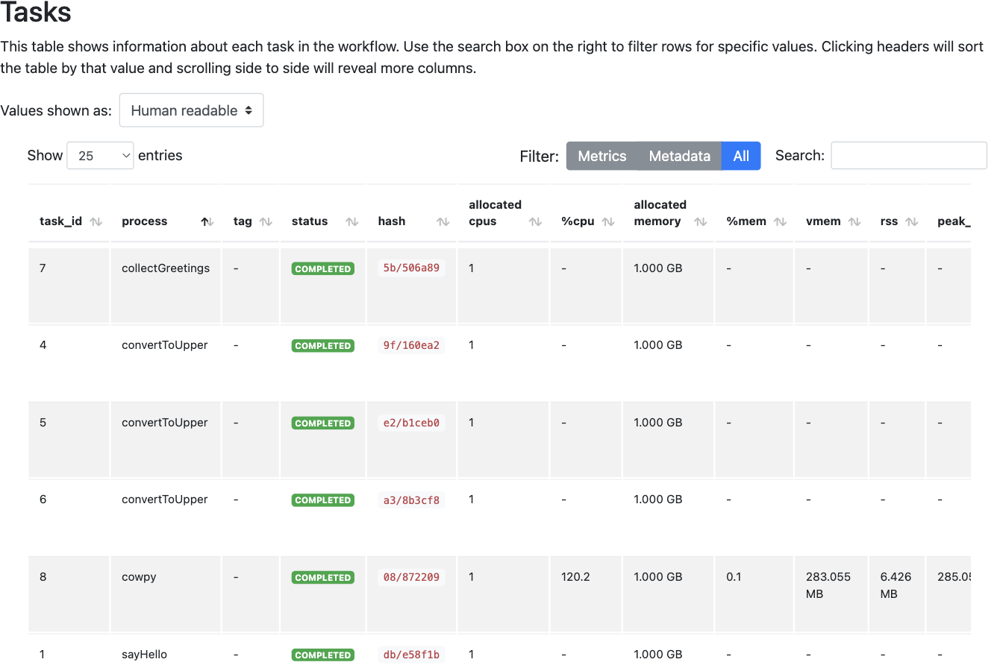

# Part 2: Configure the pipeline

In [Part 1](./01_run_nextflow.md), you ran a complete multi-step pipeline that processes multiple inputs in parallel using containers.
Now we're going to look at how to configure pipeline behavior using `nextflow.config`: first by examining the configuration file we already gave you, then by exploring a couple of other ways to supply configuration, and finally by learning to diagnose pipeline execution with an execution report.

---

## 1. Examine the main configuration file

Nextflow automatically picks up `nextflow.config` from the working directory and applies its settings to every run.

We provide you with a configuration file that covers four areas: software packaging, process settings, pipeline parameters, and execution profiles.

??? full-code "nextflow.config"

    ```groovy title="nextflow.config" linenums="1"
    /*
     * Software packaging
     */
    docker.enabled = true

    /*
     * Process settings
     */
    process {
        cpus = 1
        memory = 1.GB
    }

    /*
     * Pipeline parameters
     */
    params {
        input = 'data/greetings.csv'
        batch = 'batch'
        character = 'turkey'
    }

    /*
     * Profiles
     */
    profiles {
        test {
            params.input = 'data/greetings.csv'
            params.batch = 'test'
            params.character = 'tux'
        }
        conda {
            docker.enabled = false
            conda.enabled = true
        }
    }
    ```

Let's go through each one, then put profiles to use by running the pipeline with one.

!!! note

    This config covers local execution on a single machine.
    Nextflow also supports HPC schedulers (SLURM, PBS, LSF) and cloud executors (AWS Batch, Google Cloud Batch, Azure Batch), all configured through the same `nextflow.config` mechanism.
    See [Part 2: Adapt to your compute environment](../nextflow_config/02_packaging_execution_resources.md) in the [Nextflow Config](../nextflow_config/index.md) course for a full walkthrough of these options.

### 1.1. Software packaging

Software packaging is how Nextflow supplies the actual tools your processes need, whether that's a container image, a Conda environment, or something else.

```groovy title="nextflow.config" linenums="1"
/*
 * Software packaging
 */
docker.enabled = true
```

This line enables Docker for every process.
Any process that declares a `container` directive runs inside the specified image.

### 1.2. Process settings

Remember that a process is a single step in your pipeline, like `sayHello` or `cowpy`.
Nextflow lets you configure a number of things about how each one actually runs: how much CPU and memory it gets, which container or Conda environment it uses, and more.

```groovy title="nextflow.config" linenums="6"
/*
 * Process settings
 */
process {
    cpus = 1
    memory = 1.GB
}
```

This caps every process at a single CPU and 1 GB of memory.

Nextflow also lets you set different values for individual named processes or groups of processes; you'll learn how in [Part 2: Adapt to your compute environment](../nextflow_config/02_packaging_execution_resources.md#32-set-resource-allocations-for-a-specific-process) of the [Nextflow Config](../nextflow_config/index.md) course.

### 1.3. Pipeline parameters

Parameters are the pipeline's command-line inputs, the same `--input`, `--batch` and `--character` flags you've already been setting directly on the command line.
Setting defaults for them here means you don't have to type them out every time, though as you'll see later in this part, there are a couple of other ways to supply them too.

```groovy title="nextflow.config" linenums="14"
/*
 * Pipeline parameters
 */
params {
    input = 'data/greetings.csv'
    batch = 'batch'
    character = 'turkey'
}
```

These defaults kick in whenever a parameter isn't supplied on the command line, so running `nextflow run main.nf` with no flags still works.

### 1.4. Profiles

Profiles let you bundle up a set of settings under a single name, so you can switch between whole configurations with one flag instead of changing values by hand every time.

```groovy title="nextflow.config" linenums="23"
/*
 * Profiles
 */
profiles {
    test {
        params.input = 'data/greetings.csv'
        params.batch = 'test'
        params.character = 'tux'
    }
    conda {
        docker.enabled = false
        conda.enabled = true
    }
}
```

The `test` profile overrides three parameters to run the pipeline with a small, well-defined input set; every nf-core pipeline ships with one of these for quick validation, and it's a convention worth following in your own pipelines too.

The `conda` profile switches software packaging from Docker to Conda.

You activate a profile by passing `-profile <name>` on the command line.

Let's put the `test` profile to use.

```bash
nextflow run main.nf -profile test
```

??? success "Command output"

    ```console hl_lines="6 7 8 9"
    N E X T F L O W   ~  version 26.04.4

    Launching `main.nf` [silly_goodall] DSL2 - revision: c3c85dec78

    executor >  local (8)
    [06/9614da] sayHello (2)       | 3 of 3 ✔
    [8d/5f1b8a] convertToUpper (3) | 3 of 3 ✔
    [1e/cd52db] collectGreetings   | 1 of 1 ✔
    [2c/5f41d8] cowpy              | 1 of 1 ✔
    ```

The pipeline runs with `batch = 'test'` and `character = 'tux'`.
Check `results/full_pipeline/`: the batch name appears in the output file names, and the ASCII art features the tux penguin instead of a turkey.

!!! note

    You can activate several profiles at once, and use `nextflow config -profile <name>,<name>` to see the fully resolved result before running anything.
    Combining profiles, and how Nextflow resolves conflicts between them, is covered in depth in [Part 3: Use profiles to switch configurations](../nextflow_config/03_profiles.md) of the [Nextflow Config](../nextflow_config/index.md) course.

### Takeaway

You know what the most common elements of a `nextflow.config` file do, and how to activate a profile.

### What's next?

Learn a couple of other ways to supply configuration values without modifying the main `nextflow.config` file, useful for configuring individual runs and for sharing an exact set of settings with someone else.

---

## 2. Provide configuration via supplemental files

Setting defaults in `nextflow.config` works well for values that rarely change.
Nextflow also gives you two more targeted mechanisms: a run-specific configuration file for adapting execution to a particular environment, and a parameter file for sharing an exact set of input values with a collaborator.

### 2.1. Use a run-specific configuration file

Say you're moving the pipeline to a machine that doesn't have Docker, and you want to give every process more room to work with.
Create a new configuration file with just the overrides you need:

```groovy title="custom.config" linenums="1"
process {
    cpus = 2
    memory = 2.GB
}

docker.enabled = false
conda.enabled = true
```

Pass it alongside your main pipeline with `-c`:

```bash
nextflow run main.nf -c custom.config
```

??? success "Command output"

    ```console hl_lines="6 7 8 9"
    N E X T F L O W   ~  version 26.04.4

    Launching `main.nf` [confident_salas] DSL2 - revision: c3c85dec78

    executor >  local (8)
    [2d/db1b4a] sayHello (3)       | 3 of 3 ✔
    [b3/d0887f] convertToUpper (3) | 3 of 3 ✔
    [bf/97609d] collectGreetings   | 1 of 1 ✔
    [5b/3fafa9] cowpy              | 1 of 1 ✔
    ```

Nextflow merges `custom.config` on top of the pipeline's own `nextflow.config`, so every process now gets 2 CPUs and 2 GB of memory instead of the defaults, and runs through Conda instead of Docker.
`cowpy` is the only process with a Conda package declared alongside its container, so it's the one you'll see Nextflow actually build an environment for:

```console
Creating env using conda: conda-forge::cowpy==1.1.5 [cache /path/to/work/conda/env-898314d566668b6587ad714ae06b8520]
```

A small file that only overrides resource allocation and packaging, without touching pipeline parameters, is exactly the pattern nf-core pipelines expect from institutional configs.
Browse the [nf-core/configs](https://github.com/nf-core/configs) repository for real-world examples.

That gives you a disposable way to adapt a pipeline to a new environment without touching your normal configuration.

### 2.2. Use a parameter file

Say instead you need to share an exact set of run parameters with a collaborator, or record them for a publication.

Nextflow allows you to supply [parameter files](https://nextflow.io/docs/latest/config.html#parameter-file) in YAML or JSON format, which are a simpler way to distribute an exact, reproducible set of values.

A parameter file called `test-params.yaml` is already provided in your working directory:

```yaml title="test-params.yaml" linenums="1"
input: "data/greetings.csv"
batch: "yaml"
character: "stegosaurus"
```

The syntax uses colons (`:`) instead of the equal signs (`=`) used in `nextflow.config`, since this file is plain YAML rather than Groovy.

!!! info

    A JSON version, `test-params.json`, is also provided. Feel free to try it on your own; the syntax for passing it is identical.

Pass the file with `-params-file`:

```bash
nextflow run main.nf -params-file test-params.yaml
```

??? success "Command output"

    ```console
    N E X T F L O W   ~  version 26.04.4

    Launching `main.nf` [admiring_einstein] DSL2 - revision: c3c85dec78

    executor >  local (8)
    [dd/e91005] sayHello (2)       | 3 of 3 ✔
    [e6/e61a91] convertToUpper (2) | 3 of 3 ✔
    [9f/d2c326] collectGreetings   | 1 of 1 ✔
    [ea/c73e53] cowpy              | 1 of 1 ✔
    ```

??? abstract "File contents"

    ```console title="results/full_pipeline/cowpy-COLLECTED-yaml-output.txt"
     _________
    / HOLA    \
    | BONJOUR |
    \ HELLO   /
     ---------
    \                             .       .
     \                           / `.   .' "
      \                  .---.  <    > <    >  .---.
       \                 |    \  \ - ~ ~ - /  /    |
             _____          ..-~             ~-..-~
            |     |   \~~~\.'                    `./~~~/
           ---------   \__/                        \__/
          .'  O    \     /               /       \  "
         (_____,    `._.'               |         }  \/~~~/
          `----.          /       }     |        /    \__/
                `-.      |       /      |       /      `. ,~~|
                    ~-.__|      /_ - ~ ^|      /- _      `..-'
                        |     /        |     /     ~-.     `-. _  _  _
                        |_____|        |_____|         ~ - . _ _ _ _ _>
    ```

A parameter file is especially valuable once a pipeline has more than a handful of parameters: it lets you supply them all at once, without a sprawling command line or any change to the workflow script, and it's easy to distribute alongside your results.

### Takeaway

You know two more ways to supply configuration: a run-specific configuration file for adapting execution to a new environment, and a parameter file for sharing exact, reproducible input values.

### What's next?

Learn how to generate an execution report, useful when a pipeline doesn't behave the way you expect.

---

## 3. Generate an execution report

Add `-with-report` to any `nextflow run` command to generate an HTML report after the pipeline completes:

```bash
nextflow run main.nf --input data/greetings.csv --character turkey -with-report
```

??? success "Command output"

    ```console hl_lines="6 7 8 9"
    N E X T F L O W   ~  version 26.04.4

    Launching `main.nf` [lonely_aryabhata] DSL2 - revision: c3c85dec78

    executor >  local (8)
    [9e/f3fa5e] sayHello (3)       | 3 of 3 ✔
    [08/4a93d7] convertToUpper (2) | 3 of 3 ✔
    [c5/c8595a] collectGreetings   | 1 of 1 ✔
    [2a/1e5abe] cowpy              | 1 of 1 ✔
    ```

Nextflow writes the report to a file named `report-<timestamp>.html` in the working directory.
Open it in a browser to see an execution summary, a table of every task with its status and runtime, and resource usage charts broken down by process.

The **Tasks** tab lists every task the pipeline ran, with its process name, status, and resource usage:



The report is especially useful when a pipeline takes longer than expected or a task fails: the task table shows exactly where time was spent and which tasks succeeded or failed.

### Takeaway

You know how to generate an HTML execution report with `-with-report`, useful for diagnosing a pipeline that's slow or failing.

### What's next?

Head on to [Part 3](./03_remote_repositories.md), where you'll learn how to run pipelines directly from remote repositories such as GitHub.

---

## Summary

In this part you learned to:

- Configure pipeline behavior using `nextflow.config` and profiles
- Supply configuration via a run-specific configuration file or a parameter file
- Generate an HTML execution report with `-with-report`
