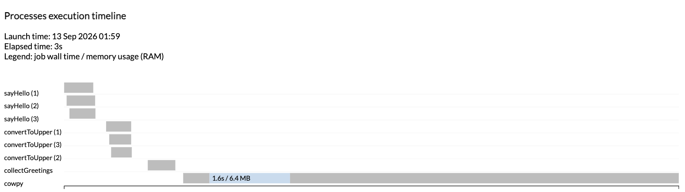

# Part 3: Manage workflow executions

As you run and re-run pipelines, you accumulate execution history and old `work/` directories.
In [Part 1](./01_run_nextflow.md#23-use-resume-to-skip-completed-work) you already used `-resume` to skip work that was already done.
Here you'll learn how to generate reports about a run, inspect the history of past runs with [`nextflow log`](https://nextflow.io/docs/latest/reference/cli.html#log), and delete old work directories you no longer need with [`nextflow clean`](https://nextflow.io/docs/latest/reference/cli.html#clean).

---

## 1. Generate pipeline reports

Nextflow can generate several kinds of reports about a run, each added with its own `-with-*` flag: an execution report (`-with-report`), an execution timeline (`-with-timeline`), a task trace file (`-with-trace`), and a workflow diagram (`-with-dag`).
We'll generate the first two here; see [Execution reports](https://nextflow.io/docs/latest/reports.html) in the Nextflow reference for the rest.

### 1.1. Generate an execution report

Add `-with-report` to any `nextflow run` command to generate an HTML report after the pipeline completes:

```bash
nextflow run main.nf --input data/greetings.csv --character turkey -with-report
```

??? success "Command output"

    ```console hl_lines="6 7 8 9"
    N E X T F L O W   ~  version 26.04.4

    Launching `main.nf` [intergalactic_dalembert] DSL2 - revision: ce74f81996

    executor >  local (8)
    [34/23f10f] sayHello (2)       | 3 of 3 ✔
    [af/cab69d] convertToUpper (3) | 3 of 3 ✔
    [9e/d73afb] collectGreetings   | 1 of 1 ✔
    [3c/392db0] cowpy              | 1 of 1 ✔
    ```

Nextflow writes the report to a file named `report-<timestamp>.html` in the working directory.
Open it in a browser to see an execution summary, a table of every task with its status and runtime, and resource usage charts broken down by process.

The **Tasks** tab lists every task the pipeline ran, with its process name, status, and resource usage:


The report is especially useful when a pipeline takes longer than expected or a task fails: the task table shows exactly where time was spent and which tasks succeeded or failed.

### 1.2. Generate an execution timeline

Add `-with-timeline` to a run to get a Gantt-chart-style view of when each task ran:

```bash
nextflow run main.nf --input data/greetings.csv --character turkey -with-timeline
```

??? success "Command output"

    ```console hl_lines="6 7 8 9"
    N E X T F L O W   ~  version 26.04.4

    Launching `main.nf` [jolly_noyce] DSL2 - revision: ce74f81996

    executor >  local (8)
    [ad/e92ef3] sayHello (3)       | 3 of 3 ✔
    [2a/df8a8d] convertToUpper (2) | 3 of 3 ✔
    [be/7fb72a] collectGreetings   | 1 of 1 ✔
    [63/dc9bd6] cowpy              | 1 of 1 ✔
    ```

Nextflow writes the timeline to a file named `timeline-<timestamp>.html`.
Open it in a browser to see a bar for every task, positioned and sized by when it ran and how long it took:



The timeline makes the fan-out-then-fan-in shape from [Part 1](./01_run_nextflow.md#31-run-the-workflow) visible at a glance: the three `sayHello` tasks run in parallel, then the three `convertToUpper` tasks, then `collectGreetings` and `cowpy` run one after the other since each depends on everything before it.

### Takeaway

You know how to generate an HTML execution report with `-with-report` and an execution timeline with `-with-timeline`, and where to look for the other report types Nextflow supports.

### What's next?

Learn how to inspect the history of past runs.

---

## 2. Inspect the log of past executions

Whether you're developing a pipeline or running it in production, at some point you'll need to look up information about past runs.

### 2.1. The history file

Every time you launch a Nextflow workflow, a line gets written to a log file called `history`, under a hidden directory called `.nextflow` in the current working directory.

??? abstract "File contents"

    ```txt title=".nextflow/history" linenums="1"
    2026-09-13 01:47:58	2.8s	determined_ramanujan	OK	ce74f81996b8ce999853fdbb25ba7969	03078950-5011-414f-992b-8fe1bd219ac2	nextflow run main.nf --input data/greetings.csv --character turkey
    2026-09-13 01:48:03	3s	prickly_cuvier	OK	ce74f81996b8ce999853fdbb25ba7969	5a9e8bf7-a7db-4c2c-b1d8-3bd4c7266528	nextflow run main.nf --input data/greetings.csv --character tux
    2026-09-13 01:48:09	2.3s	elegant_panini	OK	ce74f81996b8ce999853fdbb25ba7969	517ccc29-9db7-4d8d-8ea0-c8db6e9ac653	nextflow run main.nf --input data/greetings.csv --character stegosaurus
    2026-09-13 01:48:14	1.5s	deadly_lamport	OK	ce74f81996b8ce999853fdbb25ba7969	517ccc29-9db7-4d8d-8ea0-c8db6e9ac653	nextflow run main.nf --input data/greetings.csv --character stegosaurus -resume
    ```

Each line gives you the timestamp, duration, run name, status, revision ID, session ID, and full command line for a run launched from this directory.

Look at the last two lines: they're two separate invocations (one plain, one with `-resume`) of the exact same command, and they share the same session ID.
The session ID only changes when you launch a genuinely new run; using `-resume` keeps it, which is how Nextflow knows which cache to reuse.

### 2.2. Use `nextflow log` for a friendlier view

Reading the raw history file works, but `nextflow log` formats the same information with a header:

```bash
nextflow log
```

??? success "Command output"

    ```console linenums="1"
    TIMESTAMP          	DURATION	RUN NAME            	STATUS	REVISION ID	SESSION ID                          	COMMAND
    2026-09-13 01:47:58	2.8s    	determined_ramanujan	OK    	ce74f81996 	03078950-5011-414f-992b-8fe1bd219ac2	nextflow run main.nf --input data/greetings.csv --character turkey
    2026-09-13 01:48:03	3s      	prickly_cuvier      	OK    	ce74f81996 	5a9e8bf7-a7db-4c2c-b1d8-3bd4c7266528	nextflow run main.nf --input data/greetings.csv --character tux
    2026-09-13 01:48:09	2.3s    	elegant_panini      	OK    	ce74f81996 	517ccc29-9db7-4d8d-8ea0-c8db6e9ac653	nextflow run main.nf --input data/greetings.csv --character stegosaurus
    2026-09-13 01:48:14	1.5s    	deadly_lamport      	OK    	ce74f81996 	517ccc29-9db7-4d8d-8ea0-c8db6e9ac653	nextflow run main.nf --input data/greetings.csv --character stegosaurus -resume
    ```

Nextflow groups the caching information it uses for `-resume` under `.nextflow/cache`, keyed by session ID.
That's why looking up the right run name or session ID here is the first step whenever you need to investigate or clean up a past execution.

### Takeaway

You know where Nextflow records the history of past runs, and how to inspect it with `nextflow log`.

### What's next?

Learn how to remove old work directories you no longer need.

---

## 3. Delete older work directories

Every run leaves its task directories behind under `work/`, even after you've copied the outputs you care about to `results/`.
Run enough pipelines during development and those subdirectories add up, so Nextflow provides `nextflow clean` to remove the ones you no longer need.

### 3.1. Determine deletion criteria

`nextflow clean` supports several ways to select what to remove; see the [reference documentation](https://www.nextflow.io/docs/latest/reference/cli.html#clean) for the full list.
Here you'll delete everything from runs before a given run, using its run name.

Look up the most recent run you want to keep using `nextflow log`; in the [example from 2.2](#22-use-nextflow-log-for-a-friendlier-view) that's `elegant_panini`, the last plain run before the `-resume` one.
The run name is the machine-generated two-part string shown in the `Launching (...)` console line, or in the `RUN NAME` column of `nextflow log`.

### 3.2. Do a dry run

Add `-n` first to check what a given command would delete without actually deleting anything:

```bash
nextflow clean -before elegant_panini -n
```

??? success "Command output"

    ```console
    Would remove /workspaces/training/nextflow-run/work/e5/9ec3fe24deb5d1ffa478dff5e5e1d4
    Would remove /workspaces/training/nextflow-run/work/75/36b1ece86b213c331852d0a3dc659b
    Would remove /workspaces/training/nextflow-run/work/be/8157808f28699259b5ff37e4bf9f72
    Would remove /workspaces/training/nextflow-run/work/f3/d828b7ba6b315eb08e0f96168119f5
    Would remove /workspaces/training/nextflow-run/work/94/7a2d7ef67d81b6e66430f300816698
    Would remove /workspaces/training/nextflow-run/work/eb/e37c5c8638c45916de3d9794d6d22f
    Would remove /workspaces/training/nextflow-run/work/3f/f56a705a6370f6c615aff22d3f240a
    Would remove /workspaces/training/nextflow-run/work/25/4922fa35ba2c6087777ddce20e9f2f
    Would remove /workspaces/training/nextflow-run/work/a4/2de7bcc2f8fc974261f7280c1480f7
    Would remove /workspaces/training/nextflow-run/work/48/8c49bded446d4fcb78c8125318c5e3
    Would remove /workspaces/training/nextflow-run/work/8e/c9834a9bdd7c21de2991d959201a9d
    Would remove /workspaces/training/nextflow-run/work/d5/a9055dc8c817c6c1f436494685955c
    Would remove /workspaces/training/nextflow-run/work/27/9473df9e55e35c8869d9571b480926
    Would remove /workspaces/training/nextflow-run/work/d3/ebc066e1d844232b9f5ee0a7d87464
    Would remove /workspaces/training/nextflow-run/work/91/17ef1815ed06b8f177d0135d8ef0dc
    Would remove /workspaces/training/nextflow-run/work/12/0443f9fcff27a552d4bc73aaedf24a
    ```

That's 16 task directories: the 8 tasks from the `turkey` run plus the 8 from the `tux` run, exactly as many as you'd expect for two full runs of this four-process pipeline.
The `elegant_panini` run itself, and the cached tasks the `-resume` run reused from it, are left alone.

Your output will list different directory names, and how many lines you get depends on how many runs you've done; if you don't see any lines, either the run name doesn't match one in your log, or there's nothing to delete before it.

### 3.3. Proceed with deletion

Once the dry run looks right, re-run the same command with `-f` instead of `-n`:

```bash
nextflow clean -before elegant_panini -f
```

??? success "Command output"

    ```console
    Removed /workspaces/training/nextflow-run/work/e5/9ec3fe24deb5d1ffa478dff5e5e1d4
    Removed /workspaces/training/nextflow-run/work/75/36b1ece86b213c331852d0a3dc659b
    Removed /workspaces/training/nextflow-run/work/be/8157808f28699259b5ff37e4bf9f72
    Removed /workspaces/training/nextflow-run/work/f3/d828b7ba6b315eb08e0f96168119f5
    Removed /workspaces/training/nextflow-run/work/94/7a2d7ef67d81b6e66430f300816698
    Removed /workspaces/training/nextflow-run/work/eb/e37c5c8638c45916de3d9794d6d22f
    Removed /workspaces/training/nextflow-run/work/3f/f56a705a6370f6c615aff22d3f240a
    Removed /workspaces/training/nextflow-run/work/25/4922fa35ba2c6087777ddce20e9f2f
    Removed /workspaces/training/nextflow-run/work/a4/2de7bcc2f8fc974261f7280c1480f7
    Removed /workspaces/training/nextflow-run/work/48/8c49bded446d4fcb78c8125318c5e3
    Removed /workspaces/training/nextflow-run/work/8e/c9834a9bdd7c21de2991d959201a9d
    Removed /workspaces/training/nextflow-run/work/d5/a9055dc8c817c6c1f436494685955c
    Removed /workspaces/training/nextflow-run/work/27/9473df9e55e35c8869d9571b480926
    Removed /workspaces/training/nextflow-run/work/d3/ebc066e1d844232b9f5ee0a7d87464
    Removed /workspaces/training/nextflow-run/work/91/17ef1815ed06b8f177d0135d8ef0dc
    Removed /workspaces/training/nextflow-run/work/12/0443f9fcff27a552d4bc73aaedf24a
    ```

`nextflow clean` empties the task directories but leaves the two-character parent directories (like `e5/`) in place.

!!! warning

    Deleting work directories from past runs removes them from Nextflow's cache and deletes any outputs stored only there.
    That breaks Nextflow's ability to resume execution without re-running the corresponding processes, so only clean up runs you're confident you won't need to resume from.
    This is also why it's worth publishing anything you care about to `results/` with `mode 'copy'` rather than relying on the `work/` directory or a `symlink` publish mode.

### Takeaway

You know how to remove old work directories with `nextflow clean`, and why doing so trades away the ability to resume from those runs.

### What's next?

Learn how to run pipelines directly from remote repositories such as GitHub in [Part 4](./04_remote_repositories.md).

---

## Summary

In this part you learned to:

- Generate an HTML execution report with `-with-report` and an execution timeline with `-with-timeline`
- Inspect the history of past runs with `nextflow log`
- Remove old work directories with `nextflow clean`, and understand the resume trade-off that comes with it
