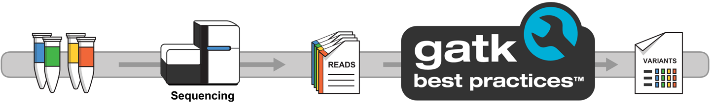

# Part 1: Method overview and manual testing

Variant calling is a genomic analysis method that aims to identify variations in a genome sequence relative to a reference genome.
Here we are going to use tools and methods designed for calling short variants, _i.e._ SNPs and indels.



A full variant calling pipeline typically involves a lot of steps, including mapping to the reference (sometimes referred to as genome alignment) and variant filtering and prioritization.
For simplicity, in this course we are going to focus on just the variant calling part.

However, before we dive into writing any workflow code, we are going to try out the commands manually on some test data.
The tools we need (Samtools and GATK) are not installed in the GitHub Codespaces environment, so we'll use them via containers (see [Hello Containers](../../hello_nextflow/05_hello_containers.md)).

### Dataset

We provide the following data and related resources:

- **A reference genome** consisting of a small region of the human chromosome 20 (from hg19/b37) and its accessory files (index and sequence dictionary).
- **Three whole genome sequencing samples** corresponding to a family trio (mother, father and son), which have been subset to a small slice of data on chromosome 20 to keep the file sizes small.
  This is Illumina short-read sequencing data that have already been mapped to the reference genome, provided in [BAM](https://samtools.github.io/hts-specs/SAMv1.pdf) format (Binary Alignment Map, a compressed version of SAM, Sequence Alignment Map).
- **A list of genomic intervals**, i.e. coordinates on the genome where our samples have data suitable for calling variants, provided in BED format.

### Workflow

Over the course of Parts 2 and 3, we're going to develop a workflow that does the following:

1. Generate an index file for each BAM input file using [Samtools](https://www.htslib.org/)
2. Run the GATK HaplotypeCaller on each BAM input file to generate per-sample variant calls in GVCF (Genomic Variant Call Format)
3. Combine the GVCFs for all samples into a GenomicsDB data store
4. Run joint genotyping on the combined data store to produce a cohort-level VCF

<figure class="excalidraw">
--8<-- "docs/en/docs/nf4_science/genomics/img/hello-gatk-1.svg"
</figure>

!!! note

    Index files are a common feature of bioinformatics file formats; they contain information about the structure of the main file that allows tools like GATK to access a subset of the data without having to read through the whole file.
    This is important because of how big these files can get.

!!! note

     Make sure you're in the `nf4-science/genomics` directory so that the last part of the path shown when you type `pwd` is `genomics`.

---

## 1. Index a BAM input file with Samtools

We're going to pull down a Samtools container, spin it up interactively and run the `samtools index` command on one of the BAM files.

### 1.1. Pull the Samtools container

```bash
docker pull community.wave.seqera.io/library/samtools:1.20--b5dfbd93de237464
```

<!--
??? success "Command output"

    ```console

    ```
-->

### 1.2. Spin up the Samtools container interactively

```bash
docker run -it -v ./data:/data community.wave.seqera.io/library/samtools:1.20--b5dfbd93de237464
```

<!--
??? success "Command output"

    ```console

    ```
-->

### 1.3. Run the indexing command

The [Samtools documentation](https://www.htslib.org/doc/samtools-index.html) gives us the command line to run to index a BAM file.

We only need to provide the input file; the tool will automatically generate a name for the output by appending `.bai` to the input filename.

```bash
samtools index /data/bam/reads_mother.bam
```

This should complete immediately, and you should now see a file called `reads_mother.bam.bai` in the same directory as the original BAM input file.

??? abstract "Directory contents"

    ```console
    data/bam/
    ├── reads_father.bam
    ├── reads_mother.bam
    ├── reads_mother.bam.bai
    └── reads_son.bam
    ```

### 1.4. Exit the Samtools container

```bash
exit
```

---

## 2. Call variants with GATK HaplotypeCaller

We're going to pull down a GATK container, spin it up interactively and run the `gatk HaplotypeCaller` command on the BAM file we just indexed.

### 2.1. Pull the GATK container

```bash
docker pull community.wave.seqera.io/library/gatk4:4.5.0.0--730ee8817e436867
```

<!--
??? success "Command output"

    ```console

    ```
-->

### 2.2. Spin up the GATK container interactively

```bash
docker run -it -v ./data:/data community.wave.seqera.io/library/gatk4:4.5.0.0--730ee8817e436867
```

<!--
??? success "Command output"

    ```console

    ```
-->

### 2.3. Run the variant calling command

The [GATK documentation](https://gatk.broadinstitute.org/hc/en-us/articles/21905025322523-HaplotypeCaller) gives us the command line to run to perform variant calling on a BAM file.

We need to provide the BAM input file (`-I`) as well as the reference genome (`-R`), a name for the output file (`-O`) and a list of genomic intervals to analyze (`-L`).

However, we don't need to specify the path to the index file; the tool will automatically look for it in the same directory, based on the established naming and co-location convention.
The same applies to the reference genome's accessory files (index and sequence dictionary files, `*.fai` and `*.dict`).

```bash
gatk HaplotypeCaller \
        -R /data/ref/ref.fasta \
        -I /data/bam/reads_mother.bam \
        -O reads_mother.vcf \
        -L /data/ref/intervals.bed
```

<!--
??? success "Command output"

    ```console

    ```
-->

The output file `reads_mother.vcf` is created inside your working directory in the container, so you won't see it in the VS Code file explorer unless you change the output file path.
However, it's a small test file, so you can `cat` it to open it and view the contents.
If you scroll all the way up to the start of the file, you'll find a header composed of many lines of metadata, followed by a list of variant calls, one per line.

```console title="reads_mother.vcf" linenums="26"
#CHROM	POS	ID	REF	ALT	QUAL	FILTER	INFO	FORMAT	reads_mother
20_10037292_10066351	3480	.	C	CT	503.03	.	AC=2;AF=1.00;AN=2;DP=23;ExcessHet=0.0000;FS=0.000;MLEAC=2;MLEAF=1.00;MQ=60.00;QD=27.95;SOR=1.179	GT:AD:DP:GQ:PL	1/1:0,18:18:54:517,54,0
20_10037292_10066351	3520	.	AT	A	609.03	.	AC=2;AF=1.00;AN=2;DP=18;ExcessHet=0.0000;FS=0.000;MLEAC=2;MLEAF=1.00;MQ=60.00;QD=33.83;SOR=0.693	GT:AD:DP:GQ:PL	1/1:0,18:18:54:623,54,0
20_10037292_10066351	3529	.	T	A	155.64	.	AC=1;AF=0.500;AN=2;BaseQRankSum=-0.544;DP=21;ExcessHet=0.0000;FS=1.871;MLEAC=1;MLEAF=0.500;MQ=60.00;MQRankSum=0.000;QD=7.78;ReadPosRankSum=-1.158;SOR=1.034	GT:AD:DP:GQ:PL	0/1:12,8:20:99:163,0,328
```

Each line describes a possible variant identified in the sample's sequencing data. For guidance on interpreting VCF format, see [this helpful article](https://www.ebi.ac.uk/training/online/courses/human-genetic-variation-introduction/variant-identification-and-analysis/understanding-vcf-format/).

The output VCF file is accompanied by an index file called `reads_mother.vcf.idx` that was automatically created by GATK.
It has the same function as the BAM index file, to allow tools to seek and retrieve subsets of data without loading in the entire file.

### 2.4. Exit the GATK container

```bash
exit
```

---

## 3. Call variants in GVCF mode for joint calling

In Part 3 of this course, we'll implement joint variant calling, which requires a special kind of variant output called GVCF (for Genomic VCF).
Here we test the commands needed to generate GVCFs and run joint genotyping.

### 3.1. Index BAM files for all three samples

We need index files for all three samples. Spin up the Samtools container again and index all samples.

```bash
docker run -it -v ./data:/data community.wave.seqera.io/library/samtools:1.20--b5dfbd93de237464
```

```bash
samtools index /data/bam/reads_mother.bam
samtools index /data/bam/reads_father.bam
samtools index /data/bam/reads_son.bam
```

This should produce the index files in the same directory as the corresponding BAM files.

??? abstract "Directory contents"

    ```console
    data/bam/
    ├── reads_father.bam
    ├── reads_father.bam.bai
    ├── reads_mother.bam
    ├── reads_mother.bam.bai
    ├── reads_son.bam
    └── reads_son.bam.bai
    ```

```bash
exit
```

### 3.2. Spin up the GATK container interactively

```bash
docker run -it -v ./data:/data community.wave.seqera.io/library/gatk4:4.5.0.0--730ee8817e436867
```

### 3.3. Run the variant calling command with the GVCF option

In order to produce a genomic VCF (GVCF), we add the `-ERC GVCF` option to the base command, which switches on the HaplotypeCaller's GVCF mode.

We also change the file extension for the output file from `.vcf` to `.g.vcf`.
This is technically not a requirement, but it is a strongly recommended convention.

```bash
gatk HaplotypeCaller \
        -R /data/ref/ref.fasta \
        -I /data/bam/reads_mother.bam \
        -O reads_mother.g.vcf \
        -L /data/ref/intervals.bed \
        -ERC GVCF
```

This creates the GVCF output file `reads_mother.g.vcf` in the current working directory in the container.

If you `cat` it to view the contents, you'll see it's much longer than the equivalent VCF we generated in section 2. You can't even scroll up to the start of the file, and most of the lines look quite different from what we saw in the VCF.

```console title="Output" linenums="1674"
20_10037292_10066351    14714   .       T       <NON_REF>       .       .       END=14718       GT:DP:GQ:MIN_DP:PL       0/0:37:99:37:0,99,1192
20_10037292_10066351    14719   .       T       <NON_REF>       .       .       END=14719       GT:DP:GQ:MIN_DP:PL       0/0:36:82:36:0,82,1087
20_10037292_10066351    14720   .       T       <NON_REF>       .       .       END=14737       GT:DP:GQ:MIN_DP:PL       0/0:42:99:37:0,100,1160
```

These represent non-variant regions where the variant caller found no evidence of variation, so it captured some statistics describing its level of confidence in the absence of variation. This makes it possible to distinguish between two very different case figures: (1) there is good quality data showing that the sample is homozygous-reference, and (2) there is not enough good data available to make a determination either way.

In a GVCF, there are typically lots of such non-variant lines, with a smaller number of variant records sprinkled among them. Try running `head -176` on the GVCF to load in just the first 176 lines of the file to find an actual variant call.

```console title="Output" linenums="174"
20_10037292_10066351    3479    .       T       <NON_REF>       .       .       END=3479        GT:DP:GQ:MIN_DP:PL       0/0:34:36:34:0,36,906
20_10037292_10066351    3480    .       C       CT,<NON_REF>    503.03  .       DP=23;ExcessHet=0.0000;MLEAC=2,0;MLEAF=1.00,0.00;RAW_MQandDP=82800,23    GT:AD:DP:GQ:PL:SB       1/1:0,18,0:18:54:517,54,0,517,54,517:0,0,7,11
20_10037292_10066351    3481    .       T       <NON_REF>       .       .       END=3481        GT:DP:GQ:MIN_DP:PL       0/0:21:51:21:0,51,765
```

The second line shows the first variant record in the file, which corresponds to the first variant in the VCF file we looked at in section 2.

Just like the original VCF was, the output GVCF file is also accompanied by an index file, called `reads_mother.g.vcf.idx`.

### 3.4. Repeat the process on the other two samples

In order to test the joint genotyping step, we need GVCFs for all three samples, so generate those now.

```bash
gatk HaplotypeCaller \
        -R /data/ref/ref.fasta \
        -I /data/bam/reads_father.bam \
        -O reads_father.g.vcf \
        -L /data/ref/intervals.bed \
        -ERC GVCF
```

```bash
gatk HaplotypeCaller \
        -R /data/ref/ref.fasta \
        -I /data/bam/reads_son.bam \
        -O reads_son.g.vcf \
        -L /data/ref/intervals.bed \
        -ERC GVCF
```

Once this completes, you should have three files ending in `.g.vcf` in your current directory (one per sample) and their respective index files ending in `.g.vcf.idx`.

---

## 4. Run joint genotyping

Now that we have all the GVCFs, we can try out the joint genotyping approach to generating variant calls for a cohort of samples.
It's a two-step method that consists of combining the data from all the GVCFs into a data store, then running the joint genotyping analysis proper to generate the final VCF of joint-called variants.

### 4.1. Combine all the per-sample GVCFs

This first step uses another GATK tool, called GenomicsDBImport, to combine the data from all the GVCFs into a GenomicsDB data store.

```bash
gatk GenomicsDBImport \
    -V reads_mother.g.vcf \
    -V reads_father.g.vcf \
    -V reads_son.g.vcf \
    -L /data/ref/intervals.bed \
    --genomicsdb-workspace-path family_trio_gdb
```

The output of this step is effectively a directory containing a set of further nested directories holding the combined variant data in the form of multiple different files.
You can poke around it but you'll quickly see this data store format is not intended to be read directly by humans.

!!! note

    GATK includes tools that make it possible to inspect and extract variant call data from the data store as needed.

### 4.2. Run the joint genotyping analysis proper

This second step uses yet another GATK tool, called GenotypeGVCFs, to recalculate variant statistics and individual genotypes in light of the data available across all samples in the cohort.

```bash
gatk GenotypeGVCFs \
    -R /data/ref/ref.fasta \
    -V gendb://family_trio_gdb \
    -O family_trio.vcf
```

This creates the VCF output file `family_trio.vcf` in the current working directory in the container.
It's another reasonably small file so you can `cat` this file to view its contents, and scroll up to find the first few variant lines.

```console title="family_trio.vcf" linenums="40"
#CHROM  POS     ID      REF     ALT     QUAL    FILTER  INFO    FORMAT  reads_father    reads_mother    reads_son
20_10037292_10066351    3480    .       C       CT      1625.89 .       AC=5;AF=0.833;AN=6;BaseQRankSum=0.220;DP=85;ExcessHet=0.0000;FS=2.476;MLEAC=5;MLEAF=0.833;MQ=60.00;MQRankSum=0.00;QD=21.68;ReadPosRankSum=-1.147e+00;SOR=0.487    GT:AD:DP:GQ:PL  0/1:15,16:31:99:367,0,375       1/1:0,18:18:54:517,54,0 1/1:0,26:26:78:756,78,0
20_10037292_10066351    3520    .       AT      A       1678.89 .       AC=5;AF=0.833;AN=6;BaseQRankSum=1.03;DP=80;ExcessHet=0.0000;FS=2.290;MLEAC=5;MLEAF=0.833;MQ=60.00;MQRankSum=0.00;QD=22.39;ReadPosRankSum=0.701;SOR=0.730 GT:AD:DP:GQ:PL   0/1:18,13:31:99:296,0,424       1/1:0,18:18:54:623,54,0 1/1:0,26:26:78:774,78,0
20_10037292_10066351    3529    .       T       A       154.29  .       AC=1;AF=0.167;AN=6;BaseQRankSum=-5.440e-01;DP=104;ExcessHet=0.0000;FS=1.871;MLEAC=1;MLEAF=0.167;MQ=60.00;MQRankSum=0.00;QD=7.71;ReadPosRankSum=-1.158e+00;SOR=1.034       GT:AD:DP:GQ:PL  0/0:44,0:44:99:0,112,1347       0/1:12,8:20:99:163,0,328        0/0:39,0:39:99:0,105,1194
```

This looks similar to the VCF we generated earlier, except this time we have genotype-level information for all three samples.
The last three columns in the file are the genotype blocks for the samples, listed in alphabetical order.

If we look at the genotypes called for our test family trio for the very first variant, we see that the father is heterozygous-variant (`0/1`), and the mother and son are both homozygous-variant (`1/1`).

That is ultimately the information we're looking to extract from the dataset!

### 4.3. Exit the GATK container

```bash
exit
```

---

### Takeaway

You know how to test the Samtools indexing and GATK variant calling commands in their respective containers, including how to generate GVCFs and run joint genotyping on multiple samples.

### What's next?

Learn how to wrap those same commands into workflows that use containers to execute the work.
