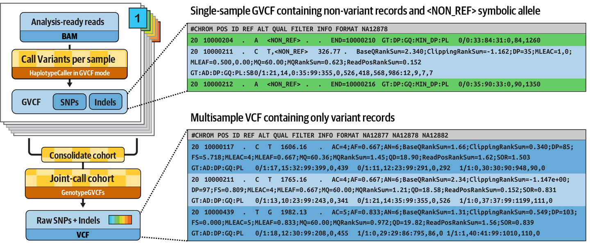

# Part 1: Method overview

Variant calling is a genomic analysis method that aims to identify variations in a genome sequence relative to a reference genome.
Here we are going to use tools and methods designed for calling short germline variants, _i.e._ SNPs and indels, in whole-genome sequencing data.


A full variant calling pipeline typically involves a lot of steps, including mapping to the reference (sometimes referred to as genome alignment) and variant filtering and prioritization.
For simplicity, in this course we are going to focus on just the variant calling part.

### Methods

We're going to show you two ways to apply variant calling to whole-genome sequencing samples to identify germline SNPs and indels.
First we'll start with a simple **per-sample approach** that calls variants independently from each sample.
Then we'll show you a more sophisticated **joint calling approach** that analyzes multiple samples together, producing more accurate and informative results.

Before we dive into writing any workflow code for either approach, we are going to try out the commands manually on some test data.

### Dataset

We provide the following data and related resources:

- **A reference genome** consisting of a small region of the human chromosome 20 (from hg19/b37) and its accessory files (index and sequence dictionary).
- **Three whole genome sequencing samples** corresponding to a family trio (mother, father and son), which have been subset to a small slice of data on chromosome 20 to keep the file sizes small.
  This is Illumina short-read sequencing data that have already been mapped to the reference genome, provided in [BAM](https://samtools.github.io/hts-specs/SAMv1.pdf) format (Binary Alignment Map, a compressed version of SAM, Sequence Alignment Map).
- **A list of genomic intervals**, i.e. coordinates on the genome where our samples have data suitable for calling variants, provided in BED format.

### Software

The two main tools involved are [Samtools](https://www.htslib.org/), a widely used toolkit for manipulating sequence alignment files, and [GATK](https://gatk.broadinstitute.org/) (Genome Analysis Toolkit), a set of tools for variant discovery developed at the Broad Institute.

These tools are not installed in the GitHub Codespaces environment, so we'll use them via containers retrieved via the Seqera Containers service (see [Hello Containers](../../hello_nextflow/05_hello_containers.md)).

!!! tip

    Make sure you're in the `nf4-science/genomics` directory so that the last part of the path shown when you type `pwd` is `genomics`.

---

## 1. Per-sample variant calling

Per-sample variant calling processes each sample independently: the variant caller examines the sequencing data for one sample at a time and identifies positions where the sample differs from the reference.

In this section we test the two commands that make up the per-sample variant calling approach: indexing a BAM file with Samtools and calling variants with GATK HaplotypeCaller.
These are the commands we'll wrap into a Nextflow workflow in Part 2 of this course.

1. Generate an index file for a BAM input file using [Samtools](https://www.htslib.org/)
2. Run the GATK HaplotypeCaller on the indexed BAM file to generate per-sample variant calls in VCF (Variant Call Format)

<figure class="excalidraw">
--8<-- "docs/en/docs/nf4_science/genomics/img/hello-gatk-1.svg"
</figure>

We start by testing the two commands on just one sample.

### 1.1. Index a BAM input file with Samtools

Index files are a common feature of bioinformatics file formats; they contain information about the structure of the main file that allows tools like GATK to access a subset of the data without having to read through the whole file.
This is important because of how large these files can get.

BAM files are often provided without an index, so the first step in many analysis workflows is to generate one using `samtools index`.

We're going to pull down a Samtools container, spin it up interactively and run the `samtools index` command on one of the BAM files.

#### 1.1.1. Pull the Samtools container

Run the `docker pull` command to download the Samtools container image:

```bash
docker pull community.wave.seqera.io/library/samtools:1.20--b5dfbd93de237464
```

??? success "Command output"

    ```console
    1.20--b5dfbd93de237464: Pulling from library/samtools
    6360b3717211: Pull complete
    2ec3f7ad9b3c: Pull complete
    7716ca300600: Pull complete
    4f4fb700ef54: Pull complete
    8c61d418774c: Pull complete
    03dae77ff45c: Pull complete
    aab7f787139d: Pull complete
    4f4fb700ef54: Pull complete
    837d55536720: Pull complete
    897362c12ca7: Pull complete
    3893cbe24e91: Pull complete
    d1b61e94977b: Pull complete
    c72ff66fb90f: Pull complete
    0e0388f29b6d: Pull complete
    Digest: sha256:bbfc45b4f228975bde86cba95e303dd94ecf2fdacea5bfb2e2f34b0d7b141e41
    Status: Downloaded newer image for community.wave.seqera.io/library/samtools:1.20--b5dfbd93de237464
    community.wave.seqera.io/library/samtools:1.20--b5dfbd93de237464
    ```

If you haven't downloaded this image before, it may take a minute to complete.
Once it's done, you have a local copy of the container image.

#### 1.1.2. Spin up the Samtools container interactively

To run the container interactively, use `docker run` with the `-it` flags.
The `-v ./data:/data` option mounts the local `data` directory into the container so the tools can access the input files.

```bash
docker run -it -v ./data:/data community.wave.seqera.io/library/samtools:1.20--b5dfbd93de237464
```

??? success "Command output"

    ```console
    (base) root@1409896f77b1:/tmp#
    ```

You'll notice your prompt changes to something like `(base) root@a1b2c3d4e5f6:/tmp#`, indicating you are now inside the container.

Verify that you can see the sequence data files under `/data/bam`:

```bash
ls /data/bam
```

??? success "Command output"

    ```console
    reads_father.bam  reads_mother.bam  reads_mother.bam.bai  reads_son.bam
    ```

With that, you are ready to try your first command.

#### 1.1.3. Run the indexing command

The [Samtools documentation](https://www.htslib.org/doc/samtools-index.html) gives us the command line to run to index a BAM file.
We only need to provide the input file; the tool will automatically generate a name for the output by appending `.bai` to the input filename.

Run the `samtools index` command on one data file:

```bash
samtools index /data/bam/reads_mother.bam
```

The command does not produce any output in the terminal, but you should now see a file called `reads_mother.bam.bai` in the same directory as the original BAM input file.

??? abstract "Directory contents"

    ```console
    data/bam/
    ├── reads_father.bam
    ├── reads_mother.bam
    ├── reads_mother.bam.bai
    └── reads_son.bam
    ```

That completes the testing of the first step.

#### 1.1.4. Exit the Samtools container

To exit the container, type `exit`.

```bash
exit
```

Your prompt should now be back to what it was before you started the container.

### 1.2. Call variants with GATK HaplotypeCaller

We want to run the `gatk HaplotypeCaller` command on the BAM file we just indexed.

#### 1.2.1. Pull the GATK container

First, let's run the `docker pull` command to download the GATK container image:

```bash
docker pull community.wave.seqera.io/library/gatk4:4.5.0.0--730ee8817e436867
```

??? success "Command output"

    Some layers show `Already exists` because they are shared with the Samtools container image we pulled earlier.

    ```console
    4.5.0.0--730ee8817e436867: Pulling from library/gatk4
    6360b3717211: Already exists
    2ec3f7ad9b3c: Already exists
    7716ca300600: Already exists
    4f4fb700ef54: Already exists
    8c61d418774c: Already exists
    03dae77ff45c: Already exists
    aab7f787139d: Already exists
    4f4fb700ef54: Already exists
    837d55536720: Already exists
    897362c12ca7: Already exists
    3893cbe24e91: Already exists
    d1b61e94977b: Already exists
    e5c558f54708: Pull complete
    087cce32d294: Pull complete
    Digest: sha256:e33413b9100f834fcc62fd5bc9edc1e881e820aafa606e09301eac2303d8724b
    Status: Downloaded newer image for community.wave.seqera.io/library/gatk4:4.5.0.0--730ee8817e436867
    community.wave.seqera.io/library/gatk4:4.5.0.0--730ee8817e436867
    ```

This should be faster than the first pull because the two container images share most of their layers.

#### 1.2.2. Spin up the GATK container interactively

Spin up the GATK container interactively with the data directory mounted, just as we did for Samtools.

```bash
docker run -it -v ./data:/data community.wave.seqera.io/library/gatk4:4.5.0.0--730ee8817e436867
```

Your prompt changes to indicate you are now inside the GATK container.

#### 1.2.3. Run the variant calling command

The [GATK documentation](https://gatk.broadinstitute.org/hc/en-us/articles/21905025322523-HaplotypeCaller) gives us the command line to run to perform variant calling on a BAM file.

We need to provide the BAM input file (`-I`) as well as the reference genome (`-R`), a name for the output file (`-O`) and a list of genomic intervals to analyze (`-L`).

However, we don't need to specify the path to the index file; the tool will automatically look for it in the same directory, based on the established naming and co-location convention.
The same applies to the reference genome's accessory files (index and sequence dictionary files, `*.fai` and `*.dict`).

```bash
gatk HaplotypeCaller \
        -R /data/ref/ref.fasta \
        -I /data/bam/reads_mother.bam \
        -O /data/vcf/reads_mother.vcf \
        -L /data/ref/intervals.bed
```

??? success "Command output"

    ```console hl_lines="37 51 56 57"
    Using GATK jar /opt/conda/share/gatk4-4.5.0.0-0/gatk-package-4.5.0.0-local.jar
    Running:
        java -Dsamjdk.use_async_io_read_samtools=false -Dsamjdk.use_async_io_write_samtools=true -Dsamjdk.use_async_io_write_tribble=false -Dsamjdk.compression_level=2 -jar /opt/conda/share/gatk4-4.5.0.0-0/gatk-package-4.5.0.0-local.jar HaplotypeCaller -R /data/ref/ref.fasta -I /data/bam/reads_mother.bam -O reads_mother.vcf -L /data/ref/intervals.bed
    00:27:50.687 INFO  NativeLibraryLoader - Loading libgkl_compression.so from jar:file:/opt/conda/share/gatk4-4.5.0.0-0/gatk-package-4.5.0.0-local.jar!/com/intel/gkl/native/libgkl_compression.so
    00:27:50.854 INFO  HaplotypeCaller - ------------------------------------------------------------
    00:27:50.858 INFO  HaplotypeCaller - The Genome Analysis Toolkit (GATK) v4.5.0.0
    00:27:50.858 INFO  HaplotypeCaller - For support and documentation go to https://software.broadinstitute.org/gatk/
    00:27:50.858 INFO  HaplotypeCaller - Executing as root@a1fe8ff42d07 on Linux v6.10.14-linuxkit amd64
    00:27:50.858 INFO  HaplotypeCaller - Java runtime: OpenJDK 64-Bit Server VM v17.0.11-internal+0-adhoc..src
    00:27:50.859 INFO  HaplotypeCaller - Start Date/Time: February 8, 2026 at 12:27:50 AM GMT
    00:27:50.859 INFO  HaplotypeCaller - ------------------------------------------------------------
    00:27:50.859 INFO  HaplotypeCaller - ------------------------------------------------------------
    00:27:50.861 INFO  HaplotypeCaller - HTSJDK Version: 4.1.0
    00:27:50.861 INFO  HaplotypeCaller - Picard Version: 3.1.1
    00:27:50.861 INFO  HaplotypeCaller - Built for Spark Version: 3.5.0
    00:27:50.862 INFO  HaplotypeCaller - HTSJDK Defaults.COMPRESSION_LEVEL : 2
    00:27:50.862 INFO  HaplotypeCaller - HTSJDK Defaults.USE_ASYNC_IO_READ_FOR_SAMTOOLS : false
    00:27:50.862 INFO  HaplotypeCaller - HTSJDK Defaults.USE_ASYNC_IO_WRITE_FOR_SAMTOOLS : true
    00:27:50.863 INFO  HaplotypeCaller - HTSJDK Defaults.USE_ASYNC_IO_WRITE_FOR_TRIBBLE : false
    00:27:50.864 INFO  HaplotypeCaller - Deflater: IntelDeflater
    00:27:50.864 INFO  HaplotypeCaller - Inflater: IntelInflater
    00:27:50.864 INFO  HaplotypeCaller - GCS max retries/reopens: 20
    00:27:50.864 INFO  HaplotypeCaller - Requester pays: disabled
    00:27:50.865 INFO  HaplotypeCaller - Initializing engine
    00:27:50.991 INFO  FeatureManager - Using codec BEDCodec to read file file:///data/ref/intervals.bed
    00:27:51.016 INFO  IntervalArgumentCollection - Processing 6369 bp from intervals
    00:27:51.029 INFO  HaplotypeCaller - Done initializing engine
    00:27:51.040 INFO  NativeLibraryLoader - Loading libgkl_utils.so from jar:file:/opt/conda/share/gatk4-4.5.0.0-0/gatk-package-4.5.0.0-local.jar!/com/intel/gkl/native/libgkl_utils.so
    00:27:51.042 INFO  NativeLibraryLoader - Loading libgkl_smithwaterman.so from jar:file:/opt/conda/share/gatk4-4.5.0.0-0/gatk-package-4.5.0.0-local.jar!/com/intel/gkl/native/libgkl_smithwaterman.so
    00:27:51.042 INFO  SmithWatermanAligner - Using AVX accelerated SmithWaterman implementation
    00:27:51.046 INFO  HaplotypeCallerEngine - Disabling physical phasing, which is supported only for reference-model confidence output
    00:27:51.063 INFO  NativeLibraryLoader - Loading libgkl_pairhmm_omp.so from jar:file:/opt/conda/share/gatk4-4.5.0.0-0/gatk-package-4.5.0.0-local.jar!/com/intel/gkl/native/libgkl_pairhmm_omp.so
    00:27:51.085 INFO  IntelPairHmm - Flush-to-zero (FTZ) is enabled when running PairHMM
    00:27:51.086 INFO  IntelPairHmm - Available threads: 10
    00:27:51.086 INFO  IntelPairHmm - Requested threads: 4
    00:27:51.086 INFO  PairHMM - Using the OpenMP multi-threaded AVX-accelerated native PairHMM implementation
    00:27:51.128 INFO  ProgressMeter - Starting traversal
    00:27:51.136 INFO  ProgressMeter -        Current Locus  Elapsed Minutes     Regions Processed   Regions/Minute
    00:27:51.882 WARN  InbreedingCoeff - InbreedingCoeff will not be calculated at position 20_10037292_10066351:3480 and possibly subsequent; at least 10 samples must have called genotypes
    00:27:52.969 INFO  HaplotypeCaller - 7 read(s) filtered by: MappingQualityReadFilter
    0 read(s) filtered by: MappingQualityAvailableReadFilter
    0 read(s) filtered by: MappedReadFilter
    0 read(s) filtered by: NotSecondaryAlignmentReadFilter
    0 read(s) filtered by: NotDuplicateReadFilter
    0 read(s) filtered by: PassesVendorQualityCheckReadFilter
    0 read(s) filtered by: NonZeroReferenceLengthAlignmentReadFilter
    0 read(s) filtered by: GoodCigarReadFilter
    0 read(s) filtered by: WellformedReadFilter
    7 total reads filtered out of 1867 reads processed
    00:27:52.971 INFO  ProgressMeter - 20_10037292_10066351:13499              0.0                    35           1145.7
    00:27:52.971 INFO  ProgressMeter - Traversal complete. Processed 35 total regions in 0.0 minutes.
    00:27:52.976 INFO  VectorLoglessPairHMM - Time spent in setup for JNI call : 0.003346916
    00:27:52.976 INFO  PairHMM - Total compute time in PairHMM computeLogLikelihoods() : 0.045731709
    00:27:52.977 INFO  SmithWatermanAligner - Total compute time in native Smith-Waterman : 0.02 sec
    00:27:52.981 INFO  HaplotypeCaller - Shutting down engine
    [February 8, 2026 at 12:27:52 AM GMT] org.broadinstitute.hellbender.tools.walkers.haplotypecaller.HaplotypeCaller done. Elapsed time: 0.04 minutes.
    Runtime.totalMemory()=203423744
    ```

The log output is very verbose, so we've highlighted the most relevant lines in the example above.

The output files, `reads_mother.vcf` and its index file, `reads_mother.vcf.idx`, are created inside your working directory in the container.

??? abstract "Directory contents"

    ```console
    conda.yml  hsperfdata_root  reads_mother.vcf  reads_mother.vcf.idx
    ```

The VCF file contains the variant calls, as we'll see in a minute, and the index file has the same function as the BAM index file, to allow tools to seek and retrieve subsets of data without loading in the entire file.

Since VCF is a text format and this one is a small test file, you can run `cat reads_mother.vcf` to open it and view its contents.
If you scroll back up to the start of the file, you'll find a header composed of many lines of metadata, followed by a list of variant calls, one per line.

??? abstract "File contents (abridged)"

    ```console title="reads_mother.vcf" linenums="1" hl_lines="26"
    ##fileformat=VCFv4.2
    ##FILTER=<ID=LowQual,Description="Low quality">
    ##FORMAT=<ID=AD,Number=R,Type=Integer,Description="Allelic depths for the ref and alt alleles in the order listed">
    ##FORMAT=<ID=DP,Number=1,Type=Integer,Description="Approximate read depth (reads with MQ=255 or with bad mates are filtered)">
    ##FORMAT=<ID=GQ,Number=1,Type=Integer,Description="Genotype Quality">
    ##FORMAT=<ID=GT,Number=1,Type=String,Description="Genotype">
    ##FORMAT=<ID=PL,Number=G,Type=Integer,Description="Normalized, Phred-scaled likelihoods for genotypes as defined in the VCF specification">
    ##GATKCommandLine=<ID=HaplotypeCaller,CommandLine="HaplotypeCaller --output reads_mother.vcf --intervals /data/ref/intervals.bed --input /data/bam/reads_mother.bam --reference /data/ref/ref.fasta [abridged]",Version="4.5.0.0",Date="February 11, 2026 at 4:23:43 PM GMT">
    ##INFO=<ID=AC,Number=A,Type=Integer,Description="Allele count in genotypes, for each ALT allele, in the same order as listed">
    ##INFO=<ID=AF,Number=A,Type=Float,Description="Allele Frequency, for each ALT allele, in the same order as listed">
    ##INFO=<ID=AN,Number=1,Type=Integer,Description="Total number of alleles in called genotypes">
    ##INFO=<ID=BaseQRankSum,Number=1,Type=Float,Description="Z-score from Wilcoxon rank sum test of Alt Vs. Ref base qualities">
    ##INFO=<ID=DP,Number=1,Type=Integer,Description="Approximate read depth; some reads may have been filtered">
    ##INFO=<ID=ExcessHet,Number=1,Type=Float,Description="Phred-scaled p-value for exact test of excess heterozygosity">
    ##INFO=<ID=FS,Number=1,Type=Float,Description="Phred-scaled p-value using Fisher's exact test to detect strand bias">
    ##INFO=<ID=InbreedingCoeff,Number=1,Type=Float,Description="Inbreeding coefficient as estimated from the genotype likelihoods per-sample when compared against the Hardy-Weinberg expectation">
    ##INFO=<ID=MLEAC,Number=A,Type=Integer,Description="Maximum likelihood expectation (MLE) for the allele counts (not necessarily the same as the AC), for each ALT allele, in the same order as listed">
    ##INFO=<ID=MLEAF,Number=A,Type=Float,Description="Maximum likelihood expectation (MLE) for the allele frequency (not necessarily the same as the AF), for each ALT allele, in the same order as listed">
    ##INFO=<ID=MQ,Number=1,Type=Float,Description="RMS Mapping Quality">
    ##INFO=<ID=MQRankSum,Number=1,Type=Float,Description="Z-score From Wilcoxon rank sum test of Alt vs. Ref read mapping qualities">
    ##INFO=<ID=QD,Number=1,Type=Float,Description="Variant Confidence/Quality by Depth">
    ##INFO=<ID=ReadPosRankSum,Number=1,Type=Float,Description="Z-score from Wilcoxon rank sum test of Alt vs. Ref read position bias">
    ##INFO=<ID=SOR,Number=1,Type=Float,Description="Symmetric Odds Ratio of 2x2 contingency table to detect strand bias">
    ##contig=<ID=20_10037292_10066351,length=29059>
    ##source=HaplotypeCaller
    #CHROM  POS     ID      REF     ALT     QUAL    FILTER  INFO    FORMAT  reads_mother
    20_10037292_10066351    3480    .       C       CT      503.03  .       AC=2;AF=1.00;AN=2;DP=23;ExcessHet=0.0000;FS=0.000;MLEAC=2;MLEAF=1.00;MQ=60.00;QD=27.95;SOR=1.179     GT:AD:DP:GQ:PL  1/1:0,18:18:54:517,54,0
    20_10037292_10066351    3520    .       AT      A       609.03  .       AC=2;AF=1.00;AN=2;DP=18;ExcessHet=0.0000;FS=0.000;MLEAC=2;MLEAF=1.00;MQ=60.00;QD=33.83;SOR=0.693     GT:AD:DP:GQ:PL  1/1:0,18:18:54:623,54,0
    20_10037292_10066351    3529    .       T       A       155.64  .       AC=1;AF=0.500;AN=2;BaseQRankSum=-0.544;DP=21;ExcessHet=0.0000;FS=1.871;MLEAC=1;MLEAF=0.500;MQ=60.00;MQRankSum=0.000;QD=7.78;ReadPosRankSum=-1.158;SOR=1.034       GT:AD:DP:GQ:PL  0/1:12,8:20:99:163,0,328
    20_10037292_10066351    4012    .       C       T       1398.06 .       AC=2;AF=1.00;AN=2;DP=44;ExcessHet=0.0000;FS=0.000;MLEAC=2;MLEAF=1.00;MQ=60.00;QD=32.51;SOR=0.739     GT:AD:DP:GQ:PL  1/1:0,43:43:99:1412,129,0
    20_10037292_10066351    4409    .       A       ATATG   710.03  .       AC=2;AF=1.00;AN=2;DP=31;ExcessHet=0.0000;FS=0.000;MLEAC=2;MLEAF=1.00;MQ=60.00;QD=30.87;SOR=0.784     GT:AD:DP:GQ:PL  1/1:0,23:23:69:724,69,0
    20_10037292_10066351    5027    .       C       T       784.06  .       AC=2;AF=1.00;AN=2;DP=27;ExcessHet=0.0000;FS=0.000;MLEAC=2;MLEAF=1.00;MQ=60.00;QD=30.16;SOR=0.693     GT:AD:DP:GQ:PL  1/1:0,26:26:77:798,77,0
    20_10037292_10066351    5469    .       A       G       1297.06 .       AC=2;AF=1.00;AN=2;DP=42;ExcessHet=0.0000;FS=0.000;MLEAC=2;MLEAF=1.00;MQ=60.00;QD=30.88;SOR=1.005     GT:AD:DP:GQ:PL  1/1:0,42:42:99:1311,126,0
    20_10037292_10066351    7557    .       A       G       935.06  .       AC=2;AF=1.00;AN=2;DP=36;ExcessHet=0.0000;FS=0.000;MLEAC=2;MLEAF=1.00;MQ=60.00;QD=27.50;SOR=0.693     GT:AD:DP:GQ:PL  1/1:0,34:34:99:949,100,0
    20_10037292_10066351    7786    .       G       T       1043.06 .       AC=2;AF=1.00;AN=2;DP=35;ExcessHet=0.0000;FS=0.000;MLEAC=2;MLEAF=1.00;MQ=60.00;QD=30.68;SOR=0.941     GT:AD:DP:GQ:PL  1/1:0,34:34:99:1057,102,0
    20_10037292_10066351    8350    .       G       C       1162.06 .       AC=2;AF=1.00;AN=2;DP=39;ExcessHet=0.0000;FS=0.000;MLEAC=2;MLEAF=1.00;MQ=60.00;QD=29.80;SOR=1.096     GT:AD:DP:GQ:PL  1/1:0,39:39:99:1176,115,0
    20_10037292_10066351    8886    .       AAGAAAGAAAG     A       1268.03 .       AC=2;AF=1.00;AN=2;DP=34;ExcessHet=0.0000;FS=0.000;MLEAC=2;MLEAF=1.00;MQ=60.00;QD=25.36;SOR=1.071     GT:AD:DP:GQ:PL  1/1:0,29:29:88:1282,88,0
    20_10037292_10066351    13536   .       T       C       437.64  .       AC=1;AF=0.500;AN=2;BaseQRankSum=1.454;DP=45;ExcessHet=0.0000;FS=0.000;MLEAC=1;MLEAF=0.500;MQ=60.00;MQRankSum=0.000;QD=9.95;ReadPosRankSum=-1.613;SOR=0.818        GT:AD:DP:GQ:PL  0/1:26,18:44:99:445,0,672
    20_10037292_10066351    14156   .       T       C       183.64  .       AC=1;AF=0.500;AN=2;BaseQRankSum=0.703;DP=20;ExcessHet=0.0000;FS=1.871;MLEAC=1;MLEAF=0.500;MQ=60.00;MQRankSum=0.000;QD=9.18;ReadPosRankSum=-0.193;SOR=1.034        GT:AD:DP:GQ:PL  0/1:12,8:20:99:191,0,319
    ```

In the example output above, we've higlighted the last header line, which gives the names of the columns for the tabular data that follows.
Each line of data describes a possible variant identified in the sample's sequencing data. For guidance on interpreting VCF format, see [this helpful article](https://www.ebi.ac.uk/training/online/courses/human-genetic-variation-introduction/variant-identification-and-analysis/understanding-vcf-format/).

#### 1.2.4. Move the output files

Anything that remains inside the container will be inaccessible to future work.
The BAM index file was created directly in the `/data/bam` directory on the mounted filesystem, but not the VCF file and its index, so we need to move those two manually.

```bash
mkdir /data/vcf
mv reads_mother.vcf* /data/vcf
```

??? abstract "Directory contents"

    ```console hl_lines="5 13-15"
    data/
    ├── bam
    │   ├── reads_father.bam
    │   ├── reads_mother.bam
    │   ├── reads_mother.bam.bai
    │   └── reads_son.bam
    ├── ref
    │   ├── intervals.bed
    │   ├── ref.dict
    │   ├── ref.fasta
    │   └── ref.fasta.fai
    ├── samplesheet.csv
    └── vcf
        ├── reads_mother.vcf
        └── reads_mother.vcf.idx
    ```

Once that's done, all the files are now accessible in your normal filesystem.

#### 1.2.5. Exit the GATK container

To exit the container, type `exit`.

```bash
exit
```

Your prompt should go back to normal.
That concludes the per-sample variant calling test.

!!! example "Write it as a workflow!"

    Feel free to move on to [Part 2](./02_per_sample_variant_calling.md) right away if you'd like to get started implementing this analysis as a Nextflow workflow.
    You'll just need to come back to complete the second round of testing before moving on to Part 3.

---

## 2. Joint calling on a cohort

The variant calling approach we just used generates variant calls per sample.
That's fine for looking at variants from each sample in isolation, but it yields limited information.
It's often more interesting to look at how variant calls differ across multiple samples.
GATK offers an alternative method called joint variant calling for this purpose.

Joint variant calling involves generating a special kind of variant output called GVCF (for Genomic VCF) for each sample, then combining the GVCF data from all the samples and running a 'joint genotyping' statistical analysis.



What's special about a sample's GVCF is that it contains records summarizing sequence data statistics about all positions in the targeted area of the genome, not just the positions where the program found evidence of variation.
This is critical for the joint genotyping calculation ([further reading](https://gatk.broadinstitute.org/hc/en-us/articles/360035890431-The-logic-of-joint-calling-for-germline-short-variants)).

The GVCF is produced by GATK HaplotypeCaller, the same tool we just tested, with an additional parameter (`-ERC GVCF`).
Combining the GVCFs is done with GATK GenomicsDBImport, which combines the per-sample calls into a data store (analogous to a database).
The actual 'joint genotyping' analysis is then done with GATK GenotypeGVCFs.

Here we test the commands needed to generate GVCFs and run joint genotyping.
These are the commands we'll wrap into a Nextflow workflow in Part 3 of this course.

1. Generate an index file for each BAM input file using Samtools
2. Run the GATK HaplotypeCaller on each BAM input file to generate a GVCF of per-sample genomic variant calls
3. Collect all the GVCFs and combine them into a GenomicsDB data store
4. Run joint genotyping on the combined GVCF data store to produce a cohort-level VCF

<figure class="excalidraw">
--8<-- "docs/en/docs/nf4_science/genomics/img/hello-gatk-2.svg"
</figure>

We now need to test all of these commands, starting with indexing all three BAM files.

### 2.1. Index BAM files for all three samples

In the first section above, we only indexed one BAM file.
Now we need to index all three samples so that GATK HaplotypeCaller can process them.

#### 2.1.1. Spin up the Samtools container interactively

We already pulled the Samtools container image, so we can spin it up directly:

```bash
docker run -it -v ./data:/data community.wave.seqera.io/library/samtools:1.20--b5dfbd93de237464
```

Your prompt changes to indicate you are inside the container, with the data directory mounted as before.

#### 2.1.2. Run the indexing command on all three samples

Run the indexing command on each of the three BAM files:

```bash
samtools index /data/bam/reads_mother.bam
samtools index /data/bam/reads_father.bam
samtools index /data/bam/reads_son.bam
```

??? abstract "Directory contents"

    ```console
    data/bam/
    ├── reads_father.bam
    ├── reads_father.bam.bai
    ├── reads_mother.bam
    ├── reads_mother.bam.bai
    ├── reads_son.bam
    └── reads_son.bam.bai
    ```

This should produce the index files in the same directory as the corresponding BAM files.

#### 2.1.3. Exit the Samtools container

To exit the container, type `exit`.

```bash
exit
```

Your prompt should be back to normal.

### 2.2. Generate GVCFs for all three samples

To run the joint genotyping step, we need GVCFs for all three samples.

#### 2.2.1. Spin up the GATK container interactively

We already pulled the GATK container image earlier, so we can spin it up directly:

```bash
docker run -it -v ./data:/data community.wave.seqera.io/library/gatk4:4.5.0.0--730ee8817e436867
```

Your prompt changes to indicate you are inside the GATK container.

#### 2.2.2. Run the variant calling command with the GVCF option

In order to produce a genomic VCF (GVCF), we add the `-ERC GVCF` option to the base command, which switches on the HaplotypeCaller's GVCF mode.

We also change the file extension for the output file from `.vcf` to `.g.vcf`.
This is technically not a requirement, but it is a strongly recommended convention.

```bash
gatk HaplotypeCaller \
        -R /data/ref/ref.fasta \
        -I /data/bam/reads_mother.bam \
        -O reads_mother.g.vcf \
        -L /data/ref/intervals.bed \
        -ERC GVCF
```

??? success "Command output"

    ```console hl_lines="39 53 58 59"
    Using GATK jar /opt/conda/share/gatk4-4.5.0.0-0/gatk-package-4.5.0.0-local.jar
    Running:
        java -Dsamjdk.use_async_io_read_samtools=false -Dsamjdk.use_async_io_write_samtools=true -Dsamjdk.use_async_io_write_tribble=false -Dsamjdk.compression_level=2 -jar /opt/conda/share/gatk4-4.5.0.0-0/gatk-package-4.5.0.0-local.jar HaplotypeCaller -R /data/ref/ref.fasta -I /data/bam/reads_mother.bam -O reads_mother.g.vcf -L /data/ref/intervals.bed -ERC GVCF
    16:51:00.620 INFO  NativeLibraryLoader - Loading libgkl_compression.so from jar:file:/opt/conda/share/gatk4-4.5.0.0-0/gatk-package-4.5.0.0-local.jar!/com/intel/gkl/native/libgkl_compression.so
    16:51:00.749 INFO  HaplotypeCaller - ------------------------------------------------------------
    16:51:00.751 INFO  HaplotypeCaller - The Genome Analysis Toolkit (GATK) v4.5.0.0
    16:51:00.751 INFO  HaplotypeCaller - For support and documentation go to https://software.broadinstitute.org/gatk/
    16:51:00.751 INFO  HaplotypeCaller - Executing as root@be1a0302f6c7 on Linux v6.8.0-1030-azure amd64
    16:51:00.751 INFO  HaplotypeCaller - Java runtime: OpenJDK 64-Bit Server VM v17.0.11-internal+0-adhoc..src
    16:51:00.752 INFO  HaplotypeCaller - Start Date/Time: February 11, 2026 at 4:51:00 PM GMT
    16:51:00.752 INFO  HaplotypeCaller - ------------------------------------------------------------
    16:51:00.752 INFO  HaplotypeCaller - ------------------------------------------------------------
    16:51:00.752 INFO  HaplotypeCaller - HTSJDK Version: 4.1.0
    16:51:00.753 INFO  HaplotypeCaller - Picard Version: 3.1.1
    16:51:00.753 INFO  HaplotypeCaller - Built for Spark Version: 3.5.0
    16:51:00.753 INFO  HaplotypeCaller - HTSJDK Defaults.COMPRESSION_LEVEL : 2
    16:51:00.753 INFO  HaplotypeCaller - HTSJDK Defaults.USE_ASYNC_IO_READ_FOR_SAMTOOLS : false
    16:51:00.753 INFO  HaplotypeCaller - HTSJDK Defaults.USE_ASYNC_IO_WRITE_FOR_SAMTOOLS : true
    16:51:00.754 INFO  HaplotypeCaller - HTSJDK Defaults.USE_ASYNC_IO_WRITE_FOR_TRIBBLE : false
    16:51:00.754 INFO  HaplotypeCaller - Deflater: IntelDeflater
    16:51:00.754 INFO  HaplotypeCaller - Inflater: IntelInflater
    16:51:00.754 INFO  HaplotypeCaller - GCS max retries/reopens: 20
    16:51:00.754 INFO  HaplotypeCaller - Requester pays: disabled
    16:51:00.755 INFO  HaplotypeCaller - Initializing engine
    16:51:00.893 INFO  FeatureManager - Using codec BEDCodec to read file file:///data/ref/intervals.bed
    16:51:00.905 INFO  IntervalArgumentCollection - Processing 6369 bp from intervals
    16:51:00.910 INFO  HaplotypeCaller - Done initializing engine
    16:51:00.912 INFO  HaplotypeCallerEngine - Tool is in reference confidence mode and the annotation, the following changes will be made to any specified annotations: 'StrandBiasBySample' will be enabled. 'ChromosomeCounts', 'FisherStrand', 'StrandOddsRatio' and 'QualByDepth' annotations have been disabled
    16:51:00.917 INFO  NativeLibraryLoader - Loading libgkl_utils.so from jar:file:/opt/conda/share/gatk4-4.5.0.0-0/gatk-package-4.5.0.0-local.jar!/com/intel/gkl/native/libgkl_utils.so
    16:51:00.919 INFO  NativeLibraryLoader - Loading libgkl_smithwaterman.so from jar:file:/opt/conda/share/gatk4-4.5.0.0-0/gatk-package-4.5.0.0-local.jar!/com/intel/gkl/native/libgkl_smithwaterman.so
    16:51:00.919 INFO  SmithWatermanAligner - Using AVX accelerated SmithWaterman implementation
    16:51:00.923 INFO  HaplotypeCallerEngine - Standard Emitting and Calling confidence set to -0.0 for reference-model confidence output
    16:51:00.923 INFO  HaplotypeCallerEngine - All sites annotated with PLs forced to true for reference-model confidence output
    16:51:00.933 INFO  NativeLibraryLoader - Loading libgkl_pairhmm_omp.so from jar:file:/opt/conda/share/gatk4-4.5.0.0-0/gatk-package-4.5.0.0-local.jar!/com/intel/gkl/native/libgkl_pairhmm_omp.so
    16:51:00.945 INFO  IntelPairHmm - Flush-to-zero (FTZ) is enabled when running PairHMM
    16:51:00.945 INFO  IntelPairHmm - Available threads: 4
    16:51:00.945 INFO  IntelPairHmm - Requested threads: 4
    16:51:00.945 INFO  PairHMM - Using the OpenMP multi-threaded AVX-accelerated native PairHMM implementation
    16:51:00.984 INFO  ProgressMeter - Starting traversal
    16:51:00.985 INFO  ProgressMeter -        Current Locus  Elapsed Minutes     Regions Processed   Regions/Minute
    16:51:01.452 WARN  InbreedingCoeff - InbreedingCoeff will not be calculated at position 20_10037292_10066351:3480 and possibly subsequent; at least 10 samples must have called genotypes
    16:51:02.358 INFO  HaplotypeCaller - 7 read(s) filtered by: MappingQualityReadFilter
    0 read(s) filtered by: MappingQualityAvailableReadFilter
    0 read(s) filtered by: MappedReadFilter
    0 read(s) filtered by: NotSecondaryAlignmentReadFilter
    0 read(s) filtered by: NotDuplicateReadFilter
    0 read(s) filtered by: PassesVendorQualityCheckReadFilter
    0 read(s) filtered by: NonZeroReferenceLengthAlignmentReadFilter
    0 read(s) filtered by: GoodCigarReadFilter
    0 read(s) filtered by: WellformedReadFilter
    7 total reads filtered out of 1867 reads processed
    16:51:02.359 INFO  ProgressMeter - 20_10037292_10066351:13499              0.0                    35           1529.5
    16:51:02.359 INFO  ProgressMeter - Traversal complete. Processed 35 total regions in 0.0 minutes.
    16:51:02.361 INFO  VectorLoglessPairHMM - Time spent in setup for JNI call : 0.0022800000000000003
    16:51:02.361 INFO  PairHMM - Total compute time in PairHMM computeLogLikelihoods() : 0.061637120000000004
    16:51:02.361 INFO  SmithWatermanAligner - Total compute time in native Smith-Waterman : 0.02 sec
    16:51:02.362 INFO  HaplotypeCaller - Shutting down engine
    [February 11, 2026 at 4:51:02 PM GMT] org.broadinstitute.hellbender.tools.walkers.haplotypecaller.HaplotypeCaller done. Elapsed time: 0.03 minutes.
    Runtime.totalMemory()=257949696
    ```

This creates the GVCF output file `reads_mother.g.vcf` in the current working directory in the container, as well as its index file, `reads_mother.g.vcf.idx`.

??? abstract "Directory contents"

    ```console
    conda.yml  hsperfdata_root  reads_mother.g.vcf  reads_mother.g.vcf.idx
    ```

If you run `head -200 reads_mother.g.vcf` to view the first 200 lines of the file's contents, you'll see it's much longer than the equivalent VCF we generated in the first section, and most of the lines look quite different from what we saw in the VCF.

??? abstract "File contents (abridged)"

    ```console title="reads_mother.g.vcf" linenums="1" hl_lines="92 175 191 195"
    ##fileformat=VCFv4.2
    ##ALT=<ID=NON_REF,Description="Represents any possible alternative allele not already represented at this location by REF and ALT">
    ##FILTER=<ID=LowQual,Description="Low quality">
    ##FORMAT=<ID=AD,Number=R,Type=Integer,Description="Allelic depths for the ref and alt alleles in the order listed">
    ##FORMAT=<ID=DP,Number=1,Type=Integer,Description="Approximate read depth (reads with MQ=255 or with bad mates are filtered)">
    ##FORMAT=<ID=GQ,Number=1,Type=Integer,Description="Genotype Quality">
    ##FORMAT=<ID=GT,Number=1,Type=String,Description="Genotype">
    ##FORMAT=<ID=MIN_DP,Number=1,Type=Integer,Description="Minimum DP observed within the GVCF block">
    ##FORMAT=<ID=PGT,Number=1,Type=String,Description="Physical phasing haplotype information, describing how the alternate alleles are phased in relation to one another; will always be heterozygous and is not intended to describe called alleles">
    ##FORMAT=<ID=PID,Number=1,Type=String,Description="Physical phasing ID information, where each unique ID within a given sample (but not across samples) connects records within a phasing group">
    ##FORMAT=<ID=PL,Number=G,Type=Integer,Description="Normalized, Phred-scaled likelihoods for genotypes as defined in the VCF specification">
    ##FORMAT=<ID=PS,Number=1,Type=Integer,Description="Phasing set (typically the position of the first variant in the set)">
    ##FORMAT=<ID=SB,Number=4,Type=Integer,Description="Per-sample component statistics which comprise the Fisher's Exact Test to detect strand bias.">
    ##GATKCommandLine=<ID=HaplotypeCaller,CommandLine="HaplotypeCaller --emit-ref-confidence GVCF --output reads_mother.g.vcf --intervals /data/ref/intervals.bed --input /data/bam/reads_mother.bam --reference /data/ref/ref.fasta [abridged]",Version="4.5.0.0",Date="February 11, 2026 at 4:51:00 PM GMT">
    ##GVCFBlock0-1=minGQ=0(inclusive),maxGQ=1(exclusive)
    ##GVCFBlock1-2=minGQ=1(inclusive),maxGQ=2(exclusive)
    ##GVCFBlock10-11=minGQ=10(inclusive),maxGQ=11(exclusive)
    ##GVCFBlock11-12=minGQ=11(inclusive),maxGQ=12(exclusive)
    ##GVCFBlock12-13=minGQ=12(inclusive),maxGQ=13(exclusive)
    ##GVCFBlock13-14=minGQ=13(inclusive),maxGQ=14(exclusive)
    ##GVCFBlock14-15=minGQ=14(inclusive),maxGQ=15(exclusive)
    ##GVCFBlock15-16=minGQ=15(inclusive),maxGQ=16(exclusive)
    ##GVCFBlock16-17=minGQ=16(inclusive),maxGQ=17(exclusive)
    ##GVCFBlock17-18=minGQ=17(inclusive),maxGQ=18(exclusive)
    ##GVCFBlock18-19=minGQ=18(inclusive),maxGQ=19(exclusive)
    ##GVCFBlock19-20=minGQ=19(inclusive),maxGQ=20(exclusive)
    ##GVCFBlock2-3=minGQ=2(inclusive),maxGQ=3(exclusive)
    ##GVCFBlock20-21=minGQ=20(inclusive),maxGQ=21(exclusive)
    ##GVCFBlock21-22=minGQ=21(inclusive),maxGQ=22(exclusive)
    ##GVCFBlock22-23=minGQ=22(inclusive),maxGQ=23(exclusive)
    ##GVCFBlock23-24=minGQ=23(inclusive),maxGQ=24(exclusive)
    ##GVCFBlock24-25=minGQ=24(inclusive),maxGQ=25(exclusive)
    ##GVCFBlock25-26=minGQ=25(inclusive),maxGQ=26(exclusive)
    ##GVCFBlock26-27=minGQ=26(inclusive),maxGQ=27(exclusive)
    ##GVCFBlock27-28=minGQ=27(inclusive),maxGQ=28(exclusive)
    ##GVCFBlock28-29=minGQ=28(inclusive),maxGQ=29(exclusive)
    ##GVCFBlock29-30=minGQ=29(inclusive),maxGQ=30(exclusive)
    ##GVCFBlock3-4=minGQ=3(inclusive),maxGQ=4(exclusive)
    ##GVCFBlock30-31=minGQ=30(inclusive),maxGQ=31(exclusive)
    ##GVCFBlock31-32=minGQ=31(inclusive),maxGQ=32(exclusive)
    ##GVCFBlock32-33=minGQ=32(inclusive),maxGQ=33(exclusive)
    ##GVCFBlock33-34=minGQ=33(inclusive),maxGQ=34(exclusive)
    ##GVCFBlock34-35=minGQ=34(inclusive),maxGQ=35(exclusive)
    ##GVCFBlock35-36=minGQ=35(inclusive),maxGQ=36(exclusive)
    ##GVCFBlock36-37=minGQ=36(inclusive),maxGQ=37(exclusive)
    ##GVCFBlock37-38=minGQ=37(inclusive),maxGQ=38(exclusive)
    ##GVCFBlock38-39=minGQ=38(inclusive),maxGQ=39(exclusive)
    ##GVCFBlock39-40=minGQ=39(inclusive),maxGQ=40(exclusive)
    ##GVCFBlock4-5=minGQ=4(inclusive),maxGQ=5(exclusive)
    ##GVCFBlock40-41=minGQ=40(inclusive),maxGQ=41(exclusive)
    ##GVCFBlock41-42=minGQ=41(inclusive),maxGQ=42(exclusive)
    ##GVCFBlock42-43=minGQ=42(inclusive),maxGQ=43(exclusive)
    ##GVCFBlock43-44=minGQ=43(inclusive),maxGQ=44(exclusive)
    ##GVCFBlock44-45=minGQ=44(inclusive),maxGQ=45(exclusive)
    ##GVCFBlock45-46=minGQ=45(inclusive),maxGQ=46(exclusive)
    ##GVCFBlock46-47=minGQ=46(inclusive),maxGQ=47(exclusive)
    ##GVCFBlock47-48=minGQ=47(inclusive),maxGQ=48(exclusive)
    ##GVCFBlock48-49=minGQ=48(inclusive),maxGQ=49(exclusive)
    ##GVCFBlock49-50=minGQ=49(inclusive),maxGQ=50(exclusive)
    ##GVCFBlock5-6=minGQ=5(inclusive),maxGQ=6(exclusive)
    ##GVCFBlock50-51=minGQ=50(inclusive),maxGQ=51(exclusive)
    ##GVCFBlock51-52=minGQ=51(inclusive),maxGQ=52(exclusive)
    ##GVCFBlock52-53=minGQ=52(inclusive),maxGQ=53(exclusive)
    ##GVCFBlock53-54=minGQ=53(inclusive),maxGQ=54(exclusive)
    ##GVCFBlock54-55=minGQ=54(inclusive),maxGQ=55(exclusive)
    ##GVCFBlock55-56=minGQ=55(inclusive),maxGQ=56(exclusive)
    ##GVCFBlock56-57=minGQ=56(inclusive),maxGQ=57(exclusive)
    ##GVCFBlock57-58=minGQ=57(inclusive),maxGQ=58(exclusive)
    ##GVCFBlock58-59=minGQ=58(inclusive),maxGQ=59(exclusive)
    ##GVCFBlock59-60=minGQ=59(inclusive),maxGQ=60(exclusive)
    ##GVCFBlock6-7=minGQ=6(inclusive),maxGQ=7(exclusive)
    ##GVCFBlock60-70=minGQ=60(inclusive),maxGQ=70(exclusive)
    ##GVCFBlock7-8=minGQ=7(inclusive),maxGQ=8(exclusive)
    ##GVCFBlock70-80=minGQ=70(inclusive),maxGQ=80(exclusive)
    ##GVCFBlock8-9=minGQ=8(inclusive),maxGQ=9(exclusive)
    ##GVCFBlock80-90=minGQ=80(inclusive),maxGQ=90(exclusive)
    ##GVCFBlock9-10=minGQ=9(inclusive),maxGQ=10(exclusive)
    ##GVCFBlock90-99=minGQ=90(inclusive),maxGQ=99(exclusive)
    ##GVCFBlock99-100=minGQ=99(inclusive),maxGQ=100(exclusive)
    ##INFO=<ID=BaseQRankSum,Number=1,Type=Float,Description="Z-score from Wilcoxon rank sum test of Alt Vs. Ref base qualities">
    ##INFO=<ID=DP,Number=1,Type=Integer,Description="Approximate read depth; some reads may have been filtered">
    ##INFO=<ID=END,Number=1,Type=Integer,Description="Stop position of the interval">
    ##INFO=<ID=ExcessHet,Number=1,Type=Float,Description="Phred-scaled p-value for exact test of excess heterozygosity">
    ##INFO=<ID=InbreedingCoeff,Number=1,Type=Float,Description="Inbreeding coefficient as estimated from the genotype likelihoods per-sample when compared against the Hardy-Weinberg expectation">
    ##INFO=<ID=MLEAC,Number=A,Type=Integer,Description="Maximum likelihood expectation (MLE) for the allele counts (not necessarily the same as the AC), for each ALT allele, in the same order as listed">
    ##INFO=<ID=MLEAF,Number=A,Type=Float,Description="Maximum likelihood expectation (MLE) for the allele frequency (not necessarily the same as the AF), for each ALT allele, in the same order as listed">
    ##INFO=<ID=MQRankSum,Number=1,Type=Float,Description="Z-score From Wilcoxon rank sum test of Alt vs. Ref read mapping qualities">
    ##INFO=<ID=RAW_MQandDP,Number=2,Type=Integer,Description="Raw data (sum of squared MQ and total depth) for improved RMS Mapping Quality calculation. Incompatible with deprecated RAW_MQ formulation.">
    ##INFO=<ID=ReadPosRankSum,Number=1,Type=Float,Description="Z-score from Wilcoxon rank sum test of Alt vs. Ref read position bias">
    ##contig=<ID=20_10037292_10066351,length=29059>
    ##source=HaplotypeCaller
    #CHROM	POS	ID	REF	ALT	QUAL	FILTER	INFO	FORMAT	reads_mother
    20_10037292_10066351	3277	.	G	<NON_REF>	.	.	END=3278	GT:DP:GQ:MIN_DP:PL	0/0:38:99:37:0,102,1530
    20_10037292_10066351	3279	.	A	<NON_REF>	.	.	END=3279	GT:DP:GQ:MIN_DP:PL	0/0:37:81:37:0,81,1084
    20_10037292_10066351	3280	.	A	<NON_REF>	.	.	END=3281	GT:DP:GQ:MIN_DP:PL	0/0:37:99:37:0,99,1485
    20_10037292_10066351	3282	.	T	<NON_REF>	.	.	END=3282	GT:DP:GQ:MIN_DP:PL	0/0:36:96:36:0,96,1440
    20_10037292_10066351	3283	.	T	<NON_REF>	.	.	END=3283	GT:DP:GQ:MIN_DP:PL	0/0:35:87:35:0,87,1305
    20_10037292_10066351	3284	.	T	<NON_REF>	.	.	END=3284	GT:DP:GQ:MIN_DP:PL	0/0:37:90:37:0,90,1350
    20_10037292_10066351	3285	.	T	<NON_REF>	.	.	END=3293	GT:DP:GQ:MIN_DP:PL	0/0:35:81:31:0,81,1215
    20_10037292_10066351	3294	.	A	<NON_REF>	.	.	END=3302	GT:DP:GQ:MIN_DP:PL	0/0:33:90:30:0,90,970
    20_10037292_10066351	3303	.	G	<NON_REF>	.	.	END=3304	GT:DP:GQ:MIN_DP:PL	0/0:33:72:32:0,72,963
    20_10037292_10066351	3305	.	C	<NON_REF>	.	.	END=3309	GT:DP:GQ:MIN_DP:PL	0/0:34:99:33:0,99,1053
    20_10037292_10066351	3310	.	A	<NON_REF>	.	.	END=3319	GT:DP:GQ:MIN_DP:PL	0/0:35:90:35:0,90,1086
    20_10037292_10066351	3320	.	A	<NON_REF>	.	.	END=3320	GT:DP:GQ:MIN_DP:PL	0/0:33:68:33:0,68,959
    20_10037292_10066351	3321	.	A	<NON_REF>	.	.	END=3322	GT:DP:GQ:MIN_DP:PL	0/0:32:84:32:0,84,1260
    20_10037292_10066351	3323	.	G	<NON_REF>	.	.	END=3323	GT:DP:GQ:MIN_DP:PL	0/0:32:79:32:0,79,953
    20_10037292_10066351	3324	.	T	<NON_REF>	.	.	END=3325	GT:DP:GQ:MIN_DP:PL	0/0:32:81:32:0,81,1215
    20_10037292_10066351	3326	.	G	<NON_REF>	.	.	END=3326	GT:DP:GQ:MIN_DP:PL	0/0:31:60:31:0,60,873
    20_10037292_10066351	3327	.	C	<NON_REF>	.	.	END=3328	GT:DP:GQ:MIN_DP:PL	0/0:30:78:30:0,78,1170
    20_10037292_10066351	3329	.	T	<NON_REF>	.	.	END=3329	GT:DP:GQ:MIN_DP:PL	0/0:31:81:31:0,81,1215
    20_10037292_10066351	3330	.	G	<NON_REF>	.	.	END=3330	GT:DP:GQ:MIN_DP:PL	0/0:31:76:31:0,76,949
    20_10037292_10066351	3331	.	T	<NON_REF>	.	.	END=3332	GT:DP:GQ:MIN_DP:PL	0/0:30:81:29:0,81,1215
    20_10037292_10066351	3333	.	A	<NON_REF>	.	.	END=3335	GT:DP:GQ:MIN_DP:PL	0/0:30:72:30:0,72,892
    20_10037292_10066351	3336	.	T	<NON_REF>	.	.	END=3337	GT:DP:GQ:MIN_DP:PL	0/0:30:84:30:0,84,1260
    20_10037292_10066351	3338	.	C	<NON_REF>	.	.	END=3338	GT:DP:GQ:MIN_DP:PL	0/0:30:59:30:0,59,851
    20_10037292_10066351	3339	.	C	<NON_REF>	.	.	END=3339	GT:DP:GQ:MIN_DP:PL	0/0:30:84:30:0,84,1260
    20_10037292_10066351	3340	.	T	<NON_REF>	.	.	END=3340	GT:DP:GQ:MIN_DP:PL	0/0:30:77:30:0,77,888
    20_10037292_10066351	3341	.	A	<NON_REF>	.	.	END=3343	GT:DP:GQ:MIN_DP:PL	0/0:30:84:28:0,84,910
    20_10037292_10066351	3344	.	T	<NON_REF>	.	.	END=3344	GT:DP:GQ:MIN_DP:PL	0/0:29:73:29:0,73,832
    20_10037292_10066351	3345	.	T	<NON_REF>	.	.	END=3348	GT:DP:GQ:MIN_DP:PL	0/0:29:87:29:0,87,891
    20_10037292_10066351	3349	.	A	<NON_REF>	.	.	END=3349	GT:DP:GQ:MIN_DP:PL	0/0:29:72:29:0,72,904
    20_10037292_10066351	3350	.	G	<NON_REF>	.	.	END=3350	GT:DP:GQ:MIN_DP:PL	0/0:29:87:29:0,87,910
    20_10037292_10066351	3351	.	T	<NON_REF>	.	.	END=3352	GT:DP:GQ:MIN_DP:PL	0/0:30:90:30:0,90,975
    20_10037292_10066351	3353	.	G	<NON_REF>	.	.	END=3354	GT:DP:GQ:MIN_DP:PL	0/0:31:72:30:0,72,846
    20_10037292_10066351	3355	.	A	<NON_REF>	.	.	END=3355	GT:DP:GQ:MIN_DP:PL	0/0:31:93:31:0,93,978
    20_10037292_10066351	3356	.	T	<NON_REF>	.	.	END=3357	GT:DP:GQ:MIN_DP:PL	0/0:31:67:31:0,67,916
    20_10037292_10066351	3358	.	A	<NON_REF>	.	.	END=3363	GT:DP:GQ:MIN_DP:PL	0/0:31:90:31:0,90,1017
    20_10037292_10066351	3364	.	G	<NON_REF>	.	.	END=3364	GT:DP:GQ:MIN_DP:PL	0/0:32:82:32:0,82,947
    20_10037292_10066351	3365	.	A	<NON_REF>	.	.	END=3365	GT:DP:GQ:MIN_DP:PL	0/0:32:90:32:0,90,1350
    20_10037292_10066351	3366	.	C	<NON_REF>	.	.	END=3366	GT:DP:GQ:MIN_DP:PL	0/0:32:79:32:0,79,963
    20_10037292_10066351	3367	.	T	<NON_REF>	.	.	END=3369	GT:DP:GQ:MIN_DP:PL	0/0:32:90:31:0,90,1350
    20_10037292_10066351	3370	.	C	<NON_REF>	.	.	END=3370	GT:DP:GQ:MIN_DP:PL	0/0:32:46:32:0,46,903
    20_10037292_10066351	3371	.	A	<NON_REF>	.	.	END=3371	GT:DP:GQ:MIN_DP:PL	0/0:32:90:32:0,90,1350
    20_10037292_10066351	3372	.	A	<NON_REF>	.	.	END=3372	GT:DP:GQ:MIN_DP:PL	0/0:32:80:32:0,80,905
    20_10037292_10066351	3373	.	A	<NON_REF>	.	.	END=3374	GT:DP:GQ:MIN_DP:PL	0/0:32:90:32:0,90,1350
    20_10037292_10066351	3375	.	G	<NON_REF>	.	.	END=3375	GT:DP:GQ:MIN_DP:PL	0/0:31:76:31:0,76,922
    20_10037292_10066351	3376	.	C	<NON_REF>	.	.	END=3376	GT:DP:GQ:MIN_DP:PL	0/0:33:93:33:0,93,1395
    20_10037292_10066351	3377	.	A	<NON_REF>	.	.	END=3381	GT:DP:GQ:MIN_DP:PL	0/0:32:84:31:0,84,1260
    20_10037292_10066351	3382	.	A	<NON_REF>	.	.	END=3385	GT:DP:GQ:MIN_DP:PL	0/0:33:90:33:0,90,1350
    20_10037292_10066351	3386	.	A	<NON_REF>	.	.	END=3387	GT:DP:GQ:MIN_DP:PL	0/0:34:84:33:0,84,964
    20_10037292_10066351	3388	.	A	<NON_REF>	.	.	END=3397	GT:DP:GQ:MIN_DP:PL	0/0:32:90:31:0,90,1350
    20_10037292_10066351	3398	.	A	<NON_REF>	.	.	END=3398	GT:DP:GQ:MIN_DP:PL	0/0:31:75:31:0,75,920
    20_10037292_10066351	3399	.	T	<NON_REF>	.	.	END=3399	GT:DP:GQ:MIN_DP:PL	0/0:31:87:31:0,87,1305
    20_10037292_10066351	3400	.	T	<NON_REF>	.	.	END=3400	GT:DP:GQ:MIN_DP:PL	0/0:32:90:32:0,90,1350
    20_10037292_10066351	3401	.	T	<NON_REF>	.	.	END=3402	GT:DP:GQ:MIN_DP:PL	0/0:32:87:31:0,87,1305
    20_10037292_10066351	3403	.	T	<NON_REF>	.	.	END=3403	GT:DP:GQ:MIN_DP:PL	0/0:32:90:32:0,90,1350
    20_10037292_10066351	3404	.	C	<NON_REF>	.	.	END=3405	GT:DP:GQ:MIN_DP:PL	0/0:32:80:32:0,80,944
    20_10037292_10066351	3406	.	G	<NON_REF>	.	.	END=3407	GT:DP:GQ:MIN_DP:PL	0/0:31:72:30:0,72,859
    20_10037292_10066351	3408	.	G	<NON_REF>	.	.	END=3408	GT:DP:GQ:MIN_DP:PL	0/0:32:62:32:0,62,890
    20_10037292_10066351	3409	.	T	<NON_REF>	.	.	END=3418	GT:DP:GQ:MIN_DP:PL	0/0:33:81:30:0,81,1215
    20_10037292_10066351	3419	.	T	<NON_REF>	.	.	END=3419	GT:DP:GQ:MIN_DP:PL	0/0:29:74:29:0,74,827
    20_10037292_10066351	3420	.	T	<NON_REF>	.	.	END=3421	GT:DP:GQ:MIN_DP:PL	0/0:30:84:29:0,84,1260
    20_10037292_10066351	3422	.	T	<NON_REF>	.	.	END=3430	GT:DP:GQ:MIN_DP:PL	0/0:29:75:28:0,75,1125
    20_10037292_10066351	3431	.	T	<NON_REF>	.	.	END=3439	GT:DP:GQ:MIN_DP:PL	0/0:28:81:28:0,81,1215
    20_10037292_10066351	3440	.	A	<NON_REF>	.	.	END=3440	GT:DP:GQ:MIN_DP:PL	0/0:28:70:28:0,70,782
    20_10037292_10066351	3441	.	T	<NON_REF>	.	.	END=3442	GT:DP:GQ:MIN_DP:PL	0/0:28:81:28:0,81,1215
    20_10037292_10066351	3443	.	T	<NON_REF>	.	.	END=3443	GT:DP:GQ:MIN_DP:PL	0/0:28:78:28:0,78,1170
    20_10037292_10066351	3444	.	T	<NON_REF>	.	.	END=3445	GT:DP:GQ:MIN_DP:PL	0/0:28:64:28:0,64,722
    20_10037292_10066351	3446	.	G	<NON_REF>	.	.	END=3446	GT:DP:GQ:MIN_DP:PL	0/0:28:78:28:0,78,1170
    20_10037292_10066351	3447	.	C	<NON_REF>	.	.	END=3447	GT:DP:GQ:MIN_DP:PL	0/0:29:53:29:0,53,694
    20_10037292_10066351	3448	.	T	<NON_REF>	.	.	END=3449	GT:DP:GQ:MIN_DP:PL	0/0:31:76:30:0,76,827
    20_10037292_10066351	3450	.	A	<NON_REF>	.	.	END=3450	GT:DP:GQ:MIN_DP:PL	0/0:31:87:31:0,87,1305
    20_10037292_10066351	3451	.	C	<NON_REF>	.	.	END=3452	GT:DP:GQ:MIN_DP:PL	0/0:31:74:31:0,74,715
    20_10037292_10066351	3453	.	T	<NON_REF>	.	.	END=3455	GT:DP:GQ:MIN_DP:PL	0/0:31:84:31:0,84,1260
    20_10037292_10066351	3456	.	A	<NON_REF>	.	.	END=3456	GT:DP:GQ:MIN_DP:PL	0/0:31:23:31:0,23,766
    20_10037292_10066351	3457	.	T	<NON_REF>	.	.	END=3460	GT:DP:GQ:MIN_DP:PL	0/0:31:90:31:0,90,1350
    20_10037292_10066351	3461	.	C	<NON_REF>	.	.	END=3461	GT:DP:GQ:MIN_DP:PL	0/0:30:89:30:0,89,873
    20_10037292_10066351	3462	.	T	<NON_REF>	.	.	END=3462	GT:DP:GQ:MIN_DP:PL	0/0:31:90:31:0,90,1350
    20_10037292_10066351	3463	.	G	<NON_REF>	.	.	END=3463	GT:DP:GQ:MIN_DP:PL	0/0:31:44:31:0,44,739
    20_10037292_10066351	3464	.	T	<NON_REF>	.	.	END=3468	GT:DP:GQ:MIN_DP:PL	0/0:32:90:32:0,90,1350
    20_10037292_10066351	3469	.	C	<NON_REF>	.	.	END=3469	GT:DP:GQ:MIN_DP:PL	0/0:32:79:32:0,79,816
    20_10037292_10066351	3470	.	T	<NON_REF>	.	.	END=3470	GT:DP:GQ:MIN_DP:PL	0/0:31:84:31:0,84,1260
    20_10037292_10066351	3471	.	T	<NON_REF>	.	.	END=3478	GT:DP:GQ:MIN_DP:PL	0/0:32:75:32:0,75,1125
    20_10037292_10066351	3479	.	T	<NON_REF>	.	.	END=3479	GT:DP:GQ:MIN_DP:PL	0/0:34:36:34:0,36,906
    20_10037292_10066351	3480	.	C	CT,<NON_REF>	503.03	.	DP=23;ExcessHet=0.0000;MLEAC=2,0;MLEAF=1.00,0.00;RAW_MQandDP=82800,23	GT:AD:DP:GQ:PL:SB	1/1:0,18,0:18:54:517,54,0,517,54,517:0,0,7,11
    20_10037292_10066351	3481	.	T	<NON_REF>	.	.	END=3481	GT:DP:GQ:MIN_DP:PL	0/0:21:51:21:0,51,765
    20_10037292_10066351	3482	.	T	<NON_REF>	.	.	END=3482	GT:DP:GQ:MIN_DP:PL	0/0:21:54:21:0,54,810
    20_10037292_10066351	3483	.	T	<NON_REF>	.	.	END=3487	GT:DP:GQ:MIN_DP:PL	0/0:20:51:19:0,51,765
    20_10037292_10066351	3488	.	T	<NON_REF>	.	.	END=3488	GT:DP:GQ:MIN_DP:PL	0/0:19:42:19:0,42,571
    20_10037292_10066351	3489	.	A	<NON_REF>	.	.	END=3489	GT:DP:GQ:MIN_DP:PL	0/0:17:51:17:0,51,521
    20_10037292_10066351	3490	.	C	<NON_REF>	.	.	END=3490	GT:DP:GQ:MIN_DP:PL	0/0:17:35:17:0,35,431
    20_10037292_10066351	3491	.	A	<NON_REF>	.	.	END=3495	GT:DP:GQ:MIN_DP:PL	0/0:17:48:17:0,48,720
    20_10037292_10066351	3496	.	A	<NON_REF>	.	.	END=3498	GT:DP:GQ:MIN_DP:PL	0/0:17:51:17:0,51,473
    20_10037292_10066351	3499	.	C	<NON_REF>	.	.	END=3499	GT:DP:GQ:MIN_DP:PL	0/0:16:48:16:0,48,428
    20_10037292_10066351	3500	.	G	<NON_REF>	.	.	END=3500	GT:DP:GQ:MIN_DP:PL	0/0:16:31:16:0,31,379
    20_10037292_10066351	3501	.	T	<NON_REF>	.	.	END=3501	GT:DP:GQ:MIN_DP:PL	0/0:17:48:17:0,48,720
    20_10037292_10066351	3502	.	A	<NON_REF>	.	.	END=3503	GT:DP:GQ:MIN_DP:PL	0/0:19:54:18:0,54,550
    20_10037292_10066351	3504	.	T	<NON_REF>	.	.	END=3504	GT:DP:GQ:MIN_DP:PL	0/0:19:48:19:0,48,720
    20_10037292_10066351	3505	.	A	<NON_REF>	.	.	END=3506	GT:DP:GQ:MIN_DP:PL	0/0:20:51:20:0,51,765
    20_10037292_10066351	3507	.	T	<NON_REF>	.	.	END=3519	GT:DP:GQ:MIN_DP:PL	0/0:19:54:18:0,54,501
    20_10037292_10066351	3520	.	AT	A,<NON_REF>	609.03	.	DP=18;ExcessHet=0.0000;MLEAC=2,0;MLEAF=1.00,0.00;RAW_MQandDP=64800,18	GT:AD:DP:GQ:PL:SB	1/1:0,18,0:18:54:623,54,0,623,54,623:0,0,9,9
    20_10037292_10066351	3522	.	T	<NON_REF>	.	.	END=3525	GT:DP:GQ:MIN_DP:PL	0/0:18:54:18:0,54,550
    20_10037292_10066351	3526	.	T	<NON_REF>	.	.	END=3527	GT:DP:GQ:MIN_DP:PL	0/0:19:57:19:0,57,607
    20_10037292_10066351	3528	.	T	<NON_REF>	.	.	END=3528	GT:DP:GQ:MIN_DP:PL	0/0:19:54:19:0,54,810
    20_10037292_10066351	3529	.	T	A,<NON_REF>	155.64	.	BaseQRankSum=-0.544;DP=21;ExcessHet=0.0000;MLEAC=1,0;MLEAF=0.500,0.00;MQRankSum=0.000;RAW_MQandDP=75600,21;ReadPosRankSum=-1.158	GT:AD:DP:GQ:PL:SB	0/1:12,8,0:20:99:163,0,328,199,352,551:5,7,5,3
    20_10037292_10066351	3530	.	A	<NON_REF>	.	.	END=3530	GT:DP:GQ:MIN_DP:PL	0/0:33:64:33:0,64,941
    20_10037292_10066351	3531	.	A	<NON_REF>	.	.	END=3533	GT:DP:GQ:MIN_DP:PL	0/0:33:81:33:0,81,1215
    20_10037292_10066351	3534	.	A	<NON_REF>	.	.	END=3534	GT:DP:GQ:MIN_DP:PL	0/0:33:78:33:0,78,1170
    20_10037292_10066351	3535	.	A	<NON_REF>	.	.	END=3536	GT:DP:GQ:MIN_DP:PL	0/0:33:68:33:0,68,891
    20_10037292_10066351	3537	.	A	<NON_REF>	.	.	END=3546	GT:DP:GQ:MIN_DP:PL	0/0:29:72:26:0,72,1080
    ```

We've once again higlighted the last header line, as well as the first three 'proper' variant calls in the file.

You'll notice the variant call lines are interspersed with many non-variant lines, which represent non-variant regions where the variant caller found no evidence of variation.
As mentioned briefly above, this is what is special about the GVCF mode of variant calling: the variant called captures some statistics describing its level of confidence in the absence of variation.
This makes it possible to distinguish between two very different case figures: (1) there is good quality data showing that the sample is homozygous-reference, and (2) there is not enough good data available to make a determination either way.

In a GVCF like this, there are typically lots of such non-variant lines, with a smaller number of variant records sprinkled among them.

#### 2.2.3. Repeat the process on the other two samples

Now let's generate GVCFs for the remaining two samples by running the commands below, one after another.

```bash
gatk HaplotypeCaller \
        -R /data/ref/ref.fasta \
        -I /data/bam/reads_father.bam \
        -O reads_father.g.vcf \
        -L /data/ref/intervals.bed \
        -ERC GVCF
```

??? success "Command output"

    ```console
    Using GATK jar /opt/conda/share/gatk4-4.5.0.0-0/gatk-package-4.5.0.0-local.jar
    Running:
        java -Dsamjdk.use_async_io_read_samtools=false -Dsamjdk.use_async_io_write_samtools=true -Dsamjdk.use_async_io_write_tribble=false -Dsamjdk.compression_level=2 -jar /opt/conda/share/gatk4-4.5.0.0-0/gatk-package-4.5.0.0-local.jar HaplotypeCaller -R /data/ref/ref.fasta -I /data/bam/reads_father.bam -O reads_father.g.vcf -L /data/ref/intervals.bed -ERC GVCF
    17:28:30.677 INFO  NativeLibraryLoader - Loading libgkl_compression.so from jar:file:/opt/conda/share/gatk4-4.5.0.0-0/gatk-package-4.5.0.0-local.jar!/com/intel/gkl/native/libgkl_compression.so
    17:28:30.801 INFO  HaplotypeCaller - ------------------------------------------------------------
    17:28:30.803 INFO  HaplotypeCaller - The Genome Analysis Toolkit (GATK) v4.5.0.0
    17:28:30.804 INFO  HaplotypeCaller - For support and documentation go to https://software.broadinstitute.org/gatk/
    17:28:30.804 INFO  HaplotypeCaller - Executing as root@be1a0302f6c7 on Linux v6.8.0-1030-azure amd64
    17:28:30.804 INFO  HaplotypeCaller - Java runtime: OpenJDK 64-Bit Server VM v17.0.11-internal+0-adhoc..src
    17:28:30.804 INFO  HaplotypeCaller - Start Date/Time: February 11, 2026 at 5:28:30 PM GMT
    17:28:30.804 INFO  HaplotypeCaller - ------------------------------------------------------------
    17:28:30.804 INFO  HaplotypeCaller - ------------------------------------------------------------
    17:28:30.805 INFO  HaplotypeCaller - HTSJDK Version: 4.1.0
    17:28:30.805 INFO  HaplotypeCaller - Picard Version: 3.1.1
    17:28:30.805 INFO  HaplotypeCaller - Built for Spark Version: 3.5.0
    17:28:30.806 INFO  HaplotypeCaller - HTSJDK Defaults.COMPRESSION_LEVEL : 2
    17:28:30.806 INFO  HaplotypeCaller - HTSJDK Defaults.USE_ASYNC_IO_READ_FOR_SAMTOOLS : false
    17:28:30.806 INFO  HaplotypeCaller - HTSJDK Defaults.USE_ASYNC_IO_WRITE_FOR_SAMTOOLS : true
    17:28:30.806 INFO  HaplotypeCaller - HTSJDK Defaults.USE_ASYNC_IO_WRITE_FOR_TRIBBLE : false
    17:28:30.806 INFO  HaplotypeCaller - Deflater: IntelDeflater
    17:28:30.807 INFO  HaplotypeCaller - Inflater: IntelInflater
    17:28:30.807 INFO  HaplotypeCaller - GCS max retries/reopens: 20
    17:28:30.807 INFO  HaplotypeCaller - Requester pays: disabled
    17:28:30.807 INFO  HaplotypeCaller - Initializing engine
    17:28:30.933 INFO  FeatureManager - Using codec BEDCodec to read file file:///data/ref/intervals.bed
    17:28:30.946 INFO  IntervalArgumentCollection - Processing 6369 bp from intervals
    17:28:30.951 INFO  HaplotypeCaller - Done initializing engine
    17:28:30.953 INFO  HaplotypeCallerEngine - Tool is in reference confidence mode and the annotation, the following changes will be made to any specified annotations: 'StrandBiasBySample' will be enabled. 'ChromosomeCounts', 'FisherStrand', 'StrandOddsRatio' and 'QualByDepth' annotations have been disabled
    17:28:30.957 INFO  NativeLibraryLoader - Loading libgkl_utils.so from jar:file:/opt/conda/share/gatk4-4.5.0.0-0/gatk-package-4.5.0.0-local.jar!/com/intel/gkl/native/libgkl_utils.so
    17:28:30.959 INFO  NativeLibraryLoader - Loading libgkl_smithwaterman.so from jar:file:/opt/conda/share/gatk4-4.5.0.0-0/gatk-package-4.5.0.0-local.jar!/com/intel/gkl/native/libgkl_smithwaterman.so
    17:28:30.960 INFO  SmithWatermanAligner - Using AVX accelerated SmithWaterman implementation
    17:28:30.963 INFO  HaplotypeCallerEngine - Standard Emitting and Calling confidence set to -0.0 for reference-model confidence output
    17:28:30.963 INFO  HaplotypeCallerEngine - All sites annotated with PLs forced to true for reference-model confidence output
    17:28:30.972 INFO  NativeLibraryLoader - Loading libgkl_pairhmm_omp.so from jar:file:/opt/conda/share/gatk4-4.5.0.0-0/gatk-package-4.5.0.0-local.jar!/com/intel/gkl/native/libgkl_pairhmm_omp.so
    17:28:30.987 INFO  IntelPairHmm - Flush-to-zero (FTZ) is enabled when running PairHMM
    17:28:30.987 INFO  IntelPairHmm - Available threads: 4
    17:28:30.987 INFO  IntelPairHmm - Requested threads: 4
    17:28:30.987 INFO  PairHMM - Using the OpenMP multi-threaded AVX-accelerated native PairHMM implementation
    17:28:31.034 INFO  ProgressMeter - Starting traversal
    17:28:31.034 INFO  ProgressMeter -        Current Locus  Elapsed Minutes     Regions Processed   Regions/Minute
    17:28:31.570 WARN  InbreedingCoeff - InbreedingCoeff will not be calculated at position 20_10037292_10066351:3480 and possibly subsequent; at least 10 samples must have called genotypes
    17:28:32.865 INFO  HaplotypeCaller - 9 read(s) filtered by: MappingQualityReadFilter
    0 read(s) filtered by: MappingQualityAvailableReadFilter
    0 read(s) filtered by: MappedReadFilter
    0 read(s) filtered by: NotSecondaryAlignmentReadFilter
    0 read(s) filtered by: NotDuplicateReadFilter
    0 read(s) filtered by: PassesVendorQualityCheckReadFilter
    0 read(s) filtered by: NonZeroReferenceLengthAlignmentReadFilter
    0 read(s) filtered by: GoodCigarReadFilter
    0 read(s) filtered by: WellformedReadFilter
    9 total reads filtered out of 2064 reads processed
    17:28:32.866 INFO  ProgressMeter - 20_10037292_10066351:13338              0.0                    38           1245.2
    17:28:32.866 INFO  ProgressMeter - Traversal complete. Processed 38 total regions in 0.0 minutes.
    17:28:32.868 INFO  VectorLoglessPairHMM - Time spent in setup for JNI call : 0.0035923200000000004
    17:28:32.868 INFO  PairHMM - Total compute time in PairHMM computeLogLikelihoods() : 0.10765202500000001
    17:28:32.868 INFO  SmithWatermanAligner - Total compute time in native Smith-Waterman : 0.03 sec
    17:28:32.869 INFO  HaplotypeCaller - Shutting down engine
    [February 11, 2026 at 5:28:32 PM GMT] org.broadinstitute.hellbender.tools.walkers.haplotypecaller.HaplotypeCaller done. Elapsed time: 0.04 minutes.
    Runtime.totalMemory()=299892736
    ```

```bash
gatk HaplotypeCaller \
        -R /data/ref/ref.fasta \
        -I /data/bam/reads_son.bam \
        -O reads_son.g.vcf \
        -L /data/ref/intervals.bed \
        -ERC GVCF
```

??? success "Command output"

    ```console
    Using GATK jar /opt/conda/share/gatk4-4.5.0.0-0/gatk-package-4.5.0.0-local.jar
    Running:
        java -Dsamjdk.use_async_io_read_samtools=false -Dsamjdk.use_async_io_write_samtools=true -Dsamjdk.use_async_io_write_tribble=false -Dsamjdk.compression_level=2 -jar /opt/conda/share/gatk4-4.5.0.0-0/gatk-package-4.5.0.0-local.jar HaplotypeCaller -R /data/ref/ref.fasta -I /data/bam/reads_son.bam -O reads_son.g.vcf -L /data/ref/intervals.bed -ERC GVCF
    17:30:10.017 INFO  NativeLibraryLoader - Loading libgkl_compression.so from jar:file:/opt/conda/share/gatk4-4.5.0.0-0/gatk-package-4.5.0.0-local.jar!/com/intel/gkl/native/libgkl_compression.so
    17:30:10.156 INFO  HaplotypeCaller - ------------------------------------------------------------
    17:30:10.159 INFO  HaplotypeCaller - The Genome Analysis Toolkit (GATK) v4.5.0.0
    17:30:10.159 INFO  HaplotypeCaller - For support and documentation go to https://software.broadinstitute.org/gatk/
    17:30:10.159 INFO  HaplotypeCaller - Executing as root@be1a0302f6c7 on Linux v6.8.0-1030-azure amd64
    17:30:10.159 INFO  HaplotypeCaller - Java runtime: OpenJDK 64-Bit Server VM v17.0.11-internal+0-adhoc..src
    17:30:10.159 INFO  HaplotypeCaller - Start Date/Time: February 11, 2026 at 5:30:09 PM GMT
    17:30:10.159 INFO  HaplotypeCaller - ------------------------------------------------------------
    17:30:10.160 INFO  HaplotypeCaller - ------------------------------------------------------------
    17:30:10.160 INFO  HaplotypeCaller - HTSJDK Version: 4.1.0
    17:30:10.160 INFO  HaplotypeCaller - Picard Version: 3.1.1
    17:30:10.161 INFO  HaplotypeCaller - Built for Spark Version: 3.5.0
    17:30:10.161 INFO  HaplotypeCaller - HTSJDK Defaults.COMPRESSION_LEVEL : 2
    17:30:10.161 INFO  HaplotypeCaller - HTSJDK Defaults.USE_ASYNC_IO_READ_FOR_SAMTOOLS : false
    17:30:10.161 INFO  HaplotypeCaller - HTSJDK Defaults.USE_ASYNC_IO_WRITE_FOR_SAMTOOLS : true
    17:30:10.161 INFO  HaplotypeCaller - HTSJDK Defaults.USE_ASYNC_IO_WRITE_FOR_TRIBBLE : false
    17:30:10.161 INFO  HaplotypeCaller - Deflater: IntelDeflater
    17:30:10.162 INFO  HaplotypeCaller - Inflater: IntelInflater
    17:30:10.162 INFO  HaplotypeCaller - GCS max retries/reopens: 20
    17:30:10.162 INFO  HaplotypeCaller - Requester pays: disabled
    17:30:10.162 INFO  HaplotypeCaller - Initializing engine
    17:30:10.277 INFO  FeatureManager - Using codec BEDCodec to read file file:///data/ref/intervals.bed
    17:30:10.290 INFO  IntervalArgumentCollection - Processing 6369 bp from intervals
    17:30:10.296 INFO  HaplotypeCaller - Done initializing engine
    17:30:10.298 INFO  HaplotypeCallerEngine - Tool is in reference confidence mode and the annotation, the following changes will be made to any specified annotations: 'StrandBiasBySample' will be enabled. 'ChromosomeCounts', 'FisherStrand', 'StrandOddsRatio' and 'QualByDepth' annotations have been disabled
    17:30:10.302 INFO  NativeLibraryLoader - Loading libgkl_utils.so from jar:file:/opt/conda/share/gatk4-4.5.0.0-0/gatk-package-4.5.0.0-local.jar!/com/intel/gkl/native/libgkl_utils.so
    17:30:10.303 INFO  NativeLibraryLoader - Loading libgkl_smithwaterman.so from jar:file:/opt/conda/share/gatk4-4.5.0.0-0/gatk-package-4.5.0.0-local.jar!/com/intel/gkl/native/libgkl_smithwaterman.so
    17:30:10.304 INFO  SmithWatermanAligner - Using AVX accelerated SmithWaterman implementation
    17:30:10.307 INFO  HaplotypeCallerEngine - Standard Emitting and Calling confidence set to -0.0 for reference-model confidence output
    17:30:10.307 INFO  HaplotypeCallerEngine - All sites annotated with PLs forced to true for reference-model confidence output
    17:30:10.315 INFO  NativeLibraryLoader - Loading libgkl_pairhmm_omp.so from jar:file:/opt/conda/share/gatk4-4.5.0.0-0/gatk-package-4.5.0.0-local.jar!/com/intel/gkl/native/libgkl_pairhmm_omp.so
    17:30:10.328 INFO  IntelPairHmm - Flush-to-zero (FTZ) is enabled when running PairHMM
    17:30:10.329 INFO  IntelPairHmm - Available threads: 4
    17:30:10.329 INFO  IntelPairHmm - Requested threads: 4
    17:30:10.329 INFO  PairHMM - Using the OpenMP multi-threaded AVX-accelerated native PairHMM implementation
    17:30:10.368 INFO  ProgressMeter - Starting traversal
    17:30:10.369 INFO  ProgressMeter -        Current Locus  Elapsed Minutes     Regions Processed   Regions/Minute
    17:30:10.875 WARN  InbreedingCoeff - InbreedingCoeff will not be calculated at position 20_10037292_10066351:3480 and possibly subsequent; at least 10 samples must have called genotypes
    17:30:11.980 INFO  HaplotypeCaller - 14 read(s) filtered by: MappingQualityReadFilter
    0 read(s) filtered by: MappingQualityAvailableReadFilter
    0 read(s) filtered by: MappedReadFilter
    0 read(s) filtered by: NotSecondaryAlignmentReadFilter
    0 read(s) filtered by: NotDuplicateReadFilter
    0 read(s) filtered by: PassesVendorQualityCheckReadFilter
    0 read(s) filtered by: NonZeroReferenceLengthAlignmentReadFilter
    0 read(s) filtered by: GoodCigarReadFilter
    0 read(s) filtered by: WellformedReadFilter
    14 total reads filtered out of 1981 reads processed
    17:30:11.981 INFO  ProgressMeter - 20_10037292_10066351:13223              0.0                    35           1302.7
    17:30:11.981 INFO  ProgressMeter - Traversal complete. Processed 35 total regions in 0.0 minutes.
    17:30:11.983 INFO  VectorLoglessPairHMM - Time spent in setup for JNI call : 0.0034843710000000004
    17:30:11.983 INFO  PairHMM - Total compute time in PairHMM computeLogLikelihoods() : 0.048108363
    17:30:11.983 INFO  SmithWatermanAligner - Total compute time in native Smith-Waterman : 0.02 sec
    17:30:11.984 INFO  HaplotypeCaller - Shutting down engine
    [February 11, 2026 at 5:30:11 PM GMT] org.broadinstitute.hellbender.tools.walkers.haplotypecaller.HaplotypeCaller done. Elapsed time: 0.03 minutes.
    Runtime.totalMemory()=226492416
    ```

Once this completes, you should have three files ending in `.g.vcf` in your current directory (one per sample) and their respective index files ending in `.g.vcf.idx`.

??? abstract "Directory contents"

    ```console
    conda.yml        reads_father.g.vcf      reads_mother.g.vcf      reads_son.g.vcf
    hsperfdata_root  reads_father.g.vcf.idx  reads_mother.g.vcf.idx  reads_son.g.vcf.idx
    ```

At this point, we've called variants in GVCF mode for each of our input samples.
It's time to move on to the joint calling.

But don't exit the container!
We're going to use the same one in the next step.

### 2.3. Run joint genotyping

Now that we have all the GVCFs, we can try out the joint genotyping approach to generating variant calls for a cohort of samples.
It's a two-step method that consists of combining the data from all the GVCFs into a data store, then running the joint genotyping analysis proper to generate the final VCF of joint-called variants.

#### 2.3.1. Combine all the per-sample GVCFs

This first step uses another GATK tool, called GenomicsDBImport, to combine the data from all the GVCFs into a GenomicsDB data store.
The GenomicsDB data store is a sort of database format that serves as an intermediate storage for the variant information.

```bash
gatk GenomicsDBImport \
    -V reads_mother.g.vcf \
    -V reads_father.g.vcf \
    -V reads_son.g.vcf \
    -L /data/ref/intervals.bed \
    --genomicsdb-workspace-path family_trio_gdb
```

??? success "Command output"

    ```console hl_lines="33 36 37 39 40"
    Using GATK jar /opt/conda/share/gatk4-4.5.0.0-0/gatk-package-4.5.0.0-local.jar
    Running:
        java -Dsamjdk.use_async_io_read_samtools=false -Dsamjdk.use_async_io_write_samtools=true -Dsamjdk.use_async_io_write_tribble=false -Dsamjdk.compression_level=2 -jar /opt/conda/share/gatk4-4.5.0.0-0/gatk-package-4.5.0.0-local.jar GenomicsDBImport -V reads_mother.g.vcf -V reads_father.g.vcf -V reads_son.g.vcf -L /data/ref/intervals.bed --genomicsdb-workspace-path family_trio_gdb
    17:37:07.569 INFO  NativeLibraryLoader - Loading libgkl_compression.so from jar:file:/opt/conda/share/gatk4-4.5.0.0-0/gatk-package-4.5.0.0-local.jar!/com/intel/gkl/native/libgkl_compression.so
    17:37:07.699 INFO  GenomicsDBImport - ------------------------------------------------------------
    17:37:07.702 INFO  GenomicsDBImport - The Genome Analysis Toolkit (GATK) v4.5.0.0
    17:37:07.702 INFO  GenomicsDBImport - For support and documentation go to https://software.broadinstitute.org/gatk/
    17:37:07.703 INFO  GenomicsDBImport - Executing as root@be1a0302f6c7 on Linux v6.8.0-1030-azure amd64
    17:37:07.703 INFO  GenomicsDBImport - Java runtime: OpenJDK 64-Bit Server VM v17.0.11-internal+0-adhoc..src
    17:37:07.704 INFO  GenomicsDBImport - Start Date/Time: February 11, 2026 at 5:37:07 PM GMT
    17:37:07.704 INFO  GenomicsDBImport - ------------------------------------------------------------
    17:37:07.704 INFO  GenomicsDBImport - ------------------------------------------------------------
    17:37:07.706 INFO  GenomicsDBImport - HTSJDK Version: 4.1.0
    17:37:07.706 INFO  GenomicsDBImport - Picard Version: 3.1.1
    17:37:07.707 INFO  GenomicsDBImport - Built for Spark Version: 3.5.0
    17:37:07.709 INFO  GenomicsDBImport - HTSJDK Defaults.COMPRESSION_LEVEL : 2
    17:37:07.709 INFO  GenomicsDBImport - HTSJDK Defaults.USE_ASYNC_IO_READ_FOR_SAMTOOLS : false
    17:37:07.709 INFO  GenomicsDBImport - HTSJDK Defaults.USE_ASYNC_IO_WRITE_FOR_SAMTOOLS : true
    17:37:07.710 INFO  GenomicsDBImport - HTSJDK Defaults.USE_ASYNC_IO_WRITE_FOR_TRIBBLE : false
    17:37:07.710 INFO  GenomicsDBImport - Deflater: IntelDeflater
    17:37:07.711 INFO  GenomicsDBImport - Inflater: IntelInflater
    17:37:07.711 INFO  GenomicsDBImport - GCS max retries/reopens: 20
    17:37:07.711 INFO  GenomicsDBImport - Requester pays: disabled
    17:37:07.712 INFO  GenomicsDBImport - Initializing engine
    17:37:07.883 INFO  FeatureManager - Using codec BEDCodec to read file file:///data/ref/intervals.bed
    17:37:07.886 INFO  IntervalArgumentCollection - Processing 6369 bp from intervals
    17:37:07.889 INFO  GenomicsDBImport - Done initializing engine
    17:37:08.560 INFO  GenomicsDBLibLoader - GenomicsDB native library version : 1.5.1-84e800e
    17:37:08.561 INFO  GenomicsDBImport - Vid Map JSON file will be written to /tmp/family_trio_gdb/vidmap.json
    17:37:08.561 INFO  GenomicsDBImport - Callset Map JSON file will be written to /tmp/family_trio_gdb/callset.json
    17:37:08.561 INFO  GenomicsDBImport - Complete VCF Header will be written to /tmp/family_trio_gdb/vcfheader.vcf
    17:37:08.561 INFO  GenomicsDBImport - Importing to workspace - /tmp/family_trio_gdb
    17:37:08.878 INFO  GenomicsDBImport - Importing batch 1 with 3 samples
    17:37:09.359 INFO  GenomicsDBImport - Importing batch 1 with 3 samples
    17:37:09.487 INFO  GenomicsDBImport - Importing batch 1 with 3 samples
    17:37:09.591 INFO  GenomicsDBImport - Done importing batch 1/1
    17:37:09.592 INFO  GenomicsDBImport - Import completed!
    17:37:09.592 INFO  GenomicsDBImport - Shutting down engine
    [February 11, 2026 at 5:37:09 PM GMT] org.broadinstitute.hellbender.tools.genomicsdb.GenomicsDBImport done. Elapsed time: 0.03 minutes.
    Runtime.totalMemory()=113246208
    Tool returned:
    true
    ```

The output of this step is effectively a directory containing a set of further nested directories holding the combined variant data in the form of multiple different files.
You can poke around it but you'll quickly see this data store format is not intended to be read directly by humans.

!!! tip

    GATK includes tools that make it possible to inspect and extract variant call data from the data store as needed.

#### 2.3.2. Run the joint genotyping analysis proper

This second step uses yet another GATK tool, called GenotypeGVCFs, to recalculate variant statistics and individual genotypes in light of the data available across all samples in the cohort.

```bash
gatk GenotypeGVCFs \
    -R /data/ref/ref.fasta \
    -V gendb://family_trio_gdb \
    -O family_trio.vcf
```

??? success "Command output"

    ```console hl_lines="30 35 37 38"
    Using GATK jar /opt/conda/share/gatk4-4.5.0.0-0/gatk-package-4.5.0.0-local.jar
    Running:
        java -Dsamjdk.use_async_io_read_samtools=false -Dsamjdk.use_async_io_write_samtools=true -Dsamjdk.use_async_io_write_tribble=false -Dsamjdk.compression_level=2 -jar /opt/conda/share/gatk4-4.5.0.0-0/gatk-package-4.5.0.0-local.jar GenotypeGVCFs -R /data/ref/ref.fasta -V gendb://family_trio_gdb -O family_trio.vcf
    17:38:45.084 INFO  NativeLibraryLoader - Loading libgkl_compression.so from jar:file:/opt/conda/share/gatk4-4.5.0.0-0/gatk-package-4.5.0.0-local.jar!/com/intel/gkl/native/libgkl_compression.so
    17:38:45.217 INFO  GenotypeGVCFs - ------------------------------------------------------------
    17:38:45.220 INFO  GenotypeGVCFs - The Genome Analysis Toolkit (GATK) v4.5.0.0
    17:38:45.220 INFO  GenotypeGVCFs - For support and documentation go to https://software.broadinstitute.org/gatk/
    17:38:45.220 INFO  GenotypeGVCFs - Executing as root@be1a0302f6c7 on Linux v6.8.0-1030-azure amd64
    17:38:45.220 INFO  GenotypeGVCFs - Java runtime: OpenJDK 64-Bit Server VM v17.0.11-internal+0-adhoc..src
    17:38:45.221 INFO  GenotypeGVCFs - Start Date/Time: February 11, 2026 at 5:38:45 PM GMT
    17:38:45.221 INFO  GenotypeGVCFs - ------------------------------------------------------------
    17:38:45.221 INFO  GenotypeGVCFs - ------------------------------------------------------------
    17:38:45.221 INFO  GenotypeGVCFs - HTSJDK Version: 4.1.0
    17:38:45.222 INFO  GenotypeGVCFs - Picard Version: 3.1.1
    17:38:45.222 INFO  GenotypeGVCFs - Built for Spark Version: 3.5.0
    17:38:45.222 INFO  GenotypeGVCFs - HTSJDK Defaults.COMPRESSION_LEVEL : 2
    17:38:45.222 INFO  GenotypeGVCFs - HTSJDK Defaults.USE_ASYNC_IO_READ_FOR_SAMTOOLS : false
    17:38:45.222 INFO  GenotypeGVCFs - HTSJDK Defaults.USE_ASYNC_IO_WRITE_FOR_SAMTOOLS : true
    17:38:45.222 INFO  GenotypeGVCFs - HTSJDK Defaults.USE_ASYNC_IO_WRITE_FOR_TRIBBLE : false
    17:38:45.223 INFO  GenotypeGVCFs - Deflater: IntelDeflater
    17:38:45.223 INFO  GenotypeGVCFs - Inflater: IntelInflater
    17:38:45.223 INFO  GenotypeGVCFs - GCS max retries/reopens: 20
    17:38:45.223 INFO  GenotypeGVCFs - Requester pays: disabled
    17:38:45.223 INFO  GenotypeGVCFs - Initializing engine
    17:38:45.544 INFO  GenomicsDBLibLoader - GenomicsDB native library version : 1.5.1-84e800e
    17:38:45.561 INFO  NativeGenomicsDB - pid=221 tid=222 No valid combination operation found for INFO field InbreedingCoeff  - the field will NOT be part of INFO fields in the generated VCF records
    17:38:45.561 INFO  NativeGenomicsDB - pid=221 tid=222 No valid combination operation found for INFO field MLEAC  - the field will NOT be part of INFO fields in the generated VCF records
    17:38:45.561 INFO  NativeGenomicsDB - pid=221 tid=222 No valid combination operation found for INFO field MLEAF  - the field will NOT be part of INFO fields in the generated VCF records
    17:38:45.577 INFO  GenotypeGVCFs - Done initializing engine
    17:38:45.615 INFO  ProgressMeter - Starting traversal
    17:38:45.615 INFO  ProgressMeter -        Current Locus  Elapsed Minutes    Variants Processed  Variants/Minute
    17:38:45.903 WARN  InbreedingCoeff - InbreedingCoeff will not be calculated at position 20_10037292_10066351:3480 and possibly subsequent; at least 10 samples must have called genotypes
    GENOMICSDB_TIMER,GenomicsDB iterator next() timer,Wall-clock time(s),0.07757032800000006,Cpu time(s),0.07253379200000037
    17:38:46.421 INFO  ProgressMeter - 20_10037292_10066351:13953              0.0                  3390         252357.3
    17:38:46.422 INFO  ProgressMeter - Traversal complete. Processed 3390 total variants in 0.0 minutes.
    17:38:46.423 INFO  GenotypeGVCFs - Shutting down engine
    [February 11, 2026 at 5:38:46 PM GMT] org.broadinstitute.hellbender.tools.walkers.GenotypeGVCFs done. Elapsed time: 0.02 minutes.
    Runtime.totalMemory()=203423744
    ```

This creates the VCF output file `family_trio.vcf` in the current working directory in the container, as well as its index, `family_trio.vcf.idx`.
It's another reasonably small file, so you can run `cat family_trio.vcf` to view the file contents, and scroll down to find the first few variant lines.

??? abstract "File contents (abridged)"

    ```console title="family_trio.vcf" linenums="1" hl_lines="39"
    ##fileformat=VCFv4.2
    ##ALT=<ID=NON_REF,Description="Represents any possible alternative allele not already represented at this location by REF and ALT">
    ##FILTER=<ID=LowQual,Description="Low quality">
    ##FILTER=<ID=PASS,Description="All filters passed">
    ##FORMAT=<ID=AD,Number=R,Type=Integer,Description="Allelic depths for the ref and alt alleles in the order listed">
    ##FORMAT=<ID=DP,Number=1,Type=Integer,Description="Approximate read depth (reads with MQ=255 or with bad mates are filtered)">
    ##FORMAT=<ID=GQ,Number=1,Type=Integer,Description="Genotype Quality">
    ##FORMAT=<ID=GT,Number=1,Type=String,Description="Genotype">
    ##FORMAT=<ID=MIN_DP,Number=1,Type=Integer,Description="Minimum DP observed within the GVCF block">
    ##FORMAT=<ID=PGT,Number=1,Type=String,Description="Physical phasing haplotype information, describing how the alternate alleles are phased in relation to one another; will always be heterozygous and is not intended to describe called alleles">
    ##FORMAT=<ID=PID,Number=1,Type=String,Description="Physical phasing ID information, where each unique ID within a given sample (but not across samples) connects records within a phasing group">
    ##FORMAT=<ID=PL,Number=G,Type=Integer,Description="Normalized, Phred-scaled likelihoods for genotypes as defined in the VCF specification">
    ##FORMAT=<ID=PS,Number=1,Type=Integer,Description="Phasing set (typically the position of the first variant in the set)">
    ##FORMAT=<ID=RGQ,Number=1,Type=Integer,Description="Unconditional reference genotype confidence, encoded as a phred quality -10*log10 p(genotype call is wrong)">
    ##FORMAT=<ID=SB,Number=4,Type=Integer,Description="Per-sample component statistics which comprise the Fisher's Exact Test to detect strand bias.">
    ##GATKCommandLine=<ID=GenomicsDBImport,CommandLine="GenomicsDBImport --genomicsdb-workspace-path family_trio_gdb --variant reads_mother.g.vcf --variant reads_father.g.vcf --variant reads_son.g.vcf --intervals /data/ref/intervals.bed [abridged]",Version="4.5.0.0",Date="February 11, 2026 at 5:37:07 PM GMT">
    ##GATKCommandLine=<ID=GenotypeGVCFs,CommandLine="GenotypeGVCFs --output family_trio.vcf --variant gendb://family_trio_gdb --reference /data/ref/ref.fasta --include-non-variant-sites false [abridged]",Version="4.5.0.0",Date="February 11, 2026 at 5:38:45 PM GMT">
    ##GATKCommandLine=<ID=HaplotypeCaller,CommandLine="HaplotypeCaller --emit-ref-confidence GVCF --output reads_mother.g.vcf --intervals /data/ref/intervals.bed --input /data/bam/reads_mother.bam --reference /data/ref/ref.fasta [abridged]",Version="4.5.0.0",Date="February 11, 2026 at 4:51:00 PM GMT">
    ##INFO=<ID=AC,Number=A,Type=Integer,Description="Allele count in genotypes, for each ALT allele, in the same order as listed">
    ##INFO=<ID=AF,Number=A,Type=Float,Description="Allele Frequency, for each ALT allele, in the same order as listed">
    ##INFO=<ID=AN,Number=1,Type=Integer,Description="Total number of alleles in called genotypes">
    ##INFO=<ID=BaseQRankSum,Number=1,Type=Float,Description="Z-score from Wilcoxon rank sum test of Alt Vs. Ref base qualities">
    ##INFO=<ID=DP,Number=1,Type=Integer,Description="Approximate read depth; some reads may have been filtered">
    ##INFO=<ID=END,Number=1,Type=Integer,Description="Stop position of the interval">
    ##INFO=<ID=ExcessHet,Number=1,Type=Float,Description="Phred-scaled p-value for exact test of excess heterozygosity">
    ##INFO=<ID=FS,Number=1,Type=Float,Description="Phred-scaled p-value using Fisher's exact test to detect strand bias">
    ##INFO=<ID=InbreedingCoeff,Number=1,Type=Float,Description="Inbreeding coefficient as estimated from the genotype likelihoods per-sample when compared against the Hardy-Weinberg expectation">
    ##INFO=<ID=MLEAC,Number=A,Type=Integer,Description="Maximum likelihood expectation (MLE) for the allele counts (not necessarily the same as the AC), for each ALT allele, in the same order as listed">
    ##INFO=<ID=MLEAF,Number=A,Type=Float,Description="Maximum likelihood expectation (MLE) for the allele frequency (not necessarily the same as the AF), for each ALT allele, in the same order as listed">
    ##INFO=<ID=MQ,Number=1,Type=Float,Description="RMS Mapping Quality">
    ##INFO=<ID=MQRankSum,Number=1,Type=Float,Description="Z-score From Wilcoxon rank sum test of Alt vs. Ref read mapping qualities">
    ##INFO=<ID=QD,Number=1,Type=Float,Description="Variant Confidence/Quality by Depth">
    ##INFO=<ID=RAW_MQandDP,Number=2,Type=Integer,Description="Raw data (sum of squared MQ and total depth) for improved RMS Mapping Quality calculation. Incompatible with deprecated RAW_MQ formulation.">
    ##INFO=<ID=ReadPosRankSum,Number=1,Type=Float,Description="Z-score from Wilcoxon rank sum test of Alt vs. Ref read position bias">
    ##INFO=<ID=SOR,Number=1,Type=Float,Description="Symmetric Odds Ratio of 2x2 contingency table to detect strand bias">
    ##contig=<ID=20_10037292_10066351,length=29059>
    ##source=GenomicsDBImport
    ##source=GenotypeGVCFs
    ##source=HaplotypeCaller
    #CHROM  POS     ID      REF     ALT     QUAL    FILTER  INFO    FORMAT  reads_father    reads_mother    reads_son
    20_10037292_10066351    3480    .       C       CT      1625.89 .       AC=5;AF=0.833;AN=6;BaseQRankSum=0.220;DP=85;ExcessHet=0.0000;FS=2.476;MLEAC=5;MLEAF=0.833;MQ=60.00;MQRankSum=0.00;QD=21.68;ReadPosRankSum=-1.147e+00;SOR=0.487    GT:AD:DP:GQ:PL  0/1:15,16:31:99:367,0,375       1/1:0,18:18:54:517,54,0 1/1:0,26:26:78:756,78,0
    20_10037292_10066351    3520    .       AT      A       1678.89 .       AC=5;AF=0.833;AN=6;BaseQRankSum=1.03;DP=80;ExcessHet=0.0000;FS=2.290;MLEAC=5;MLEAF=0.833;MQ=60.00;MQRankSum=0.00;QD=22.39;ReadPosRankSum=0.701;SOR=0.730  GT:AD:DP:GQ:PL  0/1:18,13:31:99:296,0,424       1/1:0,18:18:54:623,54,0 1/1:0,26:26:78:774,78,0
    20_10037292_10066351    3529    .       T       A       154.29  .       AC=1;AF=0.167;AN=6;BaseQRankSum=-5.440e-01;DP=104;ExcessHet=0.0000;FS=1.871;MLEAC=1;MLEAF=0.167;MQ=60.00;MQRankSum=0.00;QD=7.71;ReadPosRankSum=-1.158e+00;SOR=1.034       GT:AD:DP:GQ:PL  0/0:44,0:44:99:0,112,1347       0/1:12,8:20:99:163,0,328        0/0:39,0:39:99:0,105,1194
    20_10037292_10066351    4012    .       C       T       3950.73 .       AC=6;AF=1.00;AN=6;DP=127;ExcessHet=0.0000;FS=0.000;MLEAC=6;MLEAF=1.00;MQ=60.00;QD=31.86;SOR=0.725    GT:AD:DP:GQ:PL  1/1:0,46:46:99:1446,137,0   1/1:0,43:43:99:1412,129,0        1/1:0,35:35:99:1106,105,0
    20_10037292_10066351    4409    .       A       ATATG   2478.69 .       AC=6;AF=1.00;AN=6;DP=96;ExcessHet=0.0000;FS=0.000;MLEAC=6;MLEAF=1.00;MQ=60.00;QD=33.95;SOR=0.963     GT:AD:DP:GQ:PL  1/1:0,28:28:90:969,90,0 1/1:0,21:21:69:724,69,0      1/1:0,24:24:72:799,72,0
    20_10037292_10066351    4464    .       T       TA      620.25  .       AC=1;AF=0.167;AN=6;BaseQRankSum=0.108;DP=102;ExcessHet=0.0000;FS=0.000;MLEAC=1;MLEAF=0.167;MQ=60.00;MQRankSum=0.00;QD=19.38;ReadPosRankSum=1.27;SOR=0.892 GT:AD:DP:GQ:PGT:PID:PL:PS       0|1:15,17:32:99:0|1:4464_T_TA:629,0,554:4464    0/0:30,0:30:78:.:.:0,78,1170 0/0:39,0:39:99:.:.:0,108,1286
    20_10037292_10066351    4465    .       T       TA      620.25  .       AC=1;AF=0.167;AN=6;BaseQRankSum=-2.250e-01;DP=101;ExcessHet=0.0000;FS=0.000;MLEAC=1;MLEAF=0.167;MQ=60.00;MQRankSum=0.00;QD=19.38;ReadPosRankSum=0.910;SOR=0.892   GT:AD:DP:GQ:PGT:PID:PL:PS       0|1:15,17:32:99:0|1:4464_T_TA:629,0,554:4464    0/0:30,0:30:78:.:.:0,78,1170 0/0:39,0:39:99:.:.:0,108,1286
    20_10037292_10066351    5027    .       C       T       3339.73 .       AC=6;AF=1.00;AN=6;DP=108;ExcessHet=0.0000;FS=0.000;MLEAC=6;MLEAF=1.00;MQ=60.00;QD=31.51;SOR=0.731    GT:AD:DP:GQ:PL  1/1:0,36:36:99:1164,108,0   1/1:0,26:26:77:798,77,0  1/1:0,44:44:99:1391,132,0
    20_10037292_10066351    5469    .       A       G       2725.93 .       AC=5;AF=0.833;AN=6;BaseQRankSum=-3.665e+00;DP=113;ExcessHet=0.0000;FS=6.914;MLEAC=5;MLEAF=0.833;MQ=60.00;MQRankSum=0.00;QD=24.34;ReadPosRankSum=1.50;SOR=0.320    GT:AD:DP:GQ:PL  0/1:18,23:41:99:553,0,486       1/1:0,42:42:99:1311,126,0       1/1:0,29:29:86:876,86,0
    20_10037292_10066351    7557    .       A       G       2257.93 .       AC=5;AF=0.833;AN=6;BaseQRankSum=-1.362e+00;DP=111;ExcessHet=0.0000;FS=3.400;MLEAC=5;MLEAF=0.833;MQ=60.00;MQRankSum=0.00;QD=21.50;ReadPosRankSum=1.11;SOR=0.566    GT:AD:DP:GQ:PL  0/1:19,15:34:99:313,0,493       1/1:0,34:34:99:949,100,0        1/1:0,37:37:99:1010,108,0
    20_10037292_10066351    7786    .       G       T       3503.73 .       AC=6;AF=1.00;AN=6;DP=114;ExcessHet=0.0000;FS=0.000;MLEAC=6;MLEAF=1.00;MQ=60.00;QD=31.28;SOR=0.970    GT:AD:DP:GQ:PL  1/1:0,34:34:99:1066,102,0   1/1:0,34:34:99:1057,102,0        1/1:0,44:44:99:1394,132,0
    20_10037292_10066351    8350    .       G       C       2663.93 .       AC=5;AF=0.833;AN=6;BaseQRankSum=-1.608e+00;DP=106;ExcessHet=0.0000;FS=5.378;MLEAC=5;MLEAF=0.833;MQ=60.00;MQRankSum=0.00;QD=25.37;ReadPosRankSum=-1.870e-01;SOR=0.950      GT:AD:DP:GQ:PL  0/1:16,14:30:99:356,0,430       1/1:0,39:39:99:1176,115,0       1/1:0,36:36:99:1146,108,0
    20_10037292_10066351    8886    .       AAGAAAGAAAG     A       3037.69 .       AC=6;AF=1.00;AN=6;DP=89;ExcessHet=0.0000;FS=0.000;MLEAC=6;MLEAF=1.00;MQ=60.00;QD=25.36;SOR=2.269     GT:AD:DP:GQ:PL  1/1:0,18:18:55:804,55,0      1/1:0,29:29:88:1282,88,0        1/1:0,22:22:67:965,67,0
    20_10037292_10066351    9536    .       T       C       1089.95 .       AC=3;AF=0.500;AN=6;BaseQRankSum=-5.640e-01;DP=82;ExcessHet=0.0000;FS=12.258;MLEAC=3;MLEAF=0.500;MQ=60.00;MQRankSum=0.00;QD=20.57;ReadPosRankSum=0.860;SOR=0.373   GT:AD:DP:GQ:PL  1/1:0,32:32:95:950,95,0 0/0:29,0:29:81:0,81,1215        0/1:14,7:21:99:156,0,353
    20_10037292_10066351    13375   .       C       T       724.29  .       AC=1;AF=0.167;AN=6;BaseQRankSum=0.171;DP=121;ExcessHet=0.0000;FS=7.398;MLEAC=1;MLEAF=0.167;MQ=60.00;MQRankSum=0.00;QD=12.71;ReadPosRankSum=0.415;SOR=1.688        GT:AD:DP:GQ:PL  0/1:28,29:57:99:733,0,679       0/0:29,0:29:81:0,81,1215        0/0:34,0:34:99:0,99,1485
    20_10037292_10066351    13536   .       T       C       1025.16 .       AC=2;AF=0.333;AN=6;BaseQRankSum=1.63;DP=118;ExcessHet=0.9691;FS=1.719;MLEAC=2;MLEAF=0.333;MQ=60.00;MQRankSum=0.00;QD=11.65;ReadPosRankSum=-2.000e-01;SOR=0.904    GT:AD:DP:GQ:PL  0/1:21,23:44:99:591,0,526       0/1:26,18:44:99:445,0,672       0/0:29,0:29:84:0,84,1260
    20_10037292_10066351    14156   .       T       C       438.16  .       AC=2;AF=0.333;AN=6;BaseQRankSum=3.20;DP=96;ExcessHet=0.9691;FS=2.381;MLEAC=2;MLEAF=0.333;MQ=60.00;MQRankSum=0.00;QD=7.82;ReadPosRankSum=1.13;SOR=0.592    GT:AD:DP:GQ:PL  0/1:25,11:36:99:258,0,676       0/1:12,8:20:99:191,0,319        0/0:38,0:38:99:0,99,1117
    20_10037292_10066351    14403   .       G       A       144.29  .       AC=1;AF=0.167;AN=6;BaseQRankSum=2.63;DP=116;ExcessHet=0.0000;FS=1.435;MLEAC=1;MLEAF=0.167;MQ=60.00;MQRankSum=0.00;QD=3.52;ReadPosRankSum=0.252;SOR=0.802  GT:AD:DP:GQ:PL  0/1:32,9:41:99:153,0,821        0/0:37,0:37:99:0,109,1169       0/0:37,0:37:99:0,99,1113
    ```

We've once again higlighted the last header line, which marks the start of the variant call data.

This looks similar to the VCF we generated earlier, except this time we have genotype-level information for all three samples.
The last three columns in the file are the genotype blocks for the samples, listed in alphabetical order of their ID field, as shown in the highlighted header line.

If we look at the genotypes called for our test family trio for the very first variant, we see that the father is heterozygous-variant (`0/1`), and the mother and son are both homozygous-variant (`1/1`).

That is ultimately the kind of information we're looking to extract from the dataset!

#### 2.3.3. Move the output files

As noted previously, anything that remains inside the container will be inaccessible to future work.
Before we exit the container, we're going to move the GVCF files, the final multi-sample VCF and all their index files manually to the filesystem outside the container.
That way, we'll have something to compare to when we build our workflow to automate all this work.

```bash
mv *.vcf* /data/vcf
```

??? abstract "Directory contents" hl_lines="14-19 22-23"

    ```console
    data
    ├── bam
    │   ├── reads_father.bam
    │   ├── reads_father.bam.bai
    │   ├── reads_mother.bam
    │   ├── reads_mother.bam.bai
    │   ├── reads_son.bam
    │   └── reads_son.bam.bai
    ├── ref
    │   ├── intervals.bed
    │   ├── ref.dict
    │   ├── ref.fasta
    │   └── ref.fasta.fai
    ├── samplesheet.csv
    └── vcf
        ├── family_trio.vcf
        ├── family_trio.vcf.idx
        ├── reads_father.g.vcf
        ├── reads_father.g.vcf.idx
        ├── reads_mother.g.vcf
        ├── reads_mother.g.vcf.idx
        ├── reads_mother.vcf
        ├── reads_mother.vcf.idx
        ├── reads_son.g.vcf
        └── reads_son.g.vcf.idx
    ```

Once that's done, all the files are now accessible in your normal filesystem.

#### 2.3.4. Exit the GATK container

To exit the container, type `exit`.

```bash
exit
```

Your prompt should be back to normal.
That concludes the manual testing of the joint variant calling commands.

---

### Takeaway

You know how to test the Samtools indexing and GATK variant calling commands in their respective containers, including how to generate GVCFs and run joint genotyping on multiple samples.

### What's next?

Take a break, then head on to [Part 2](./02_per_sample_variant_calling.md) to learn how to wrap those same commands into workflows that use containers to execute the work.
