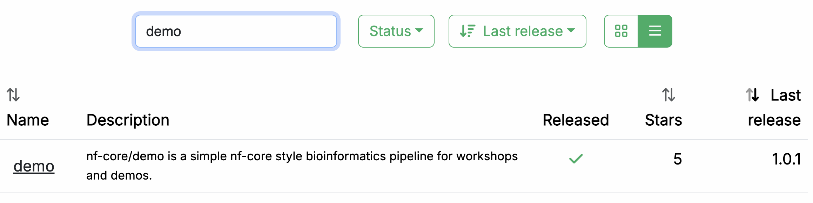
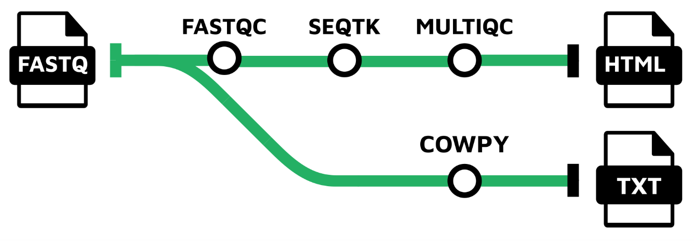
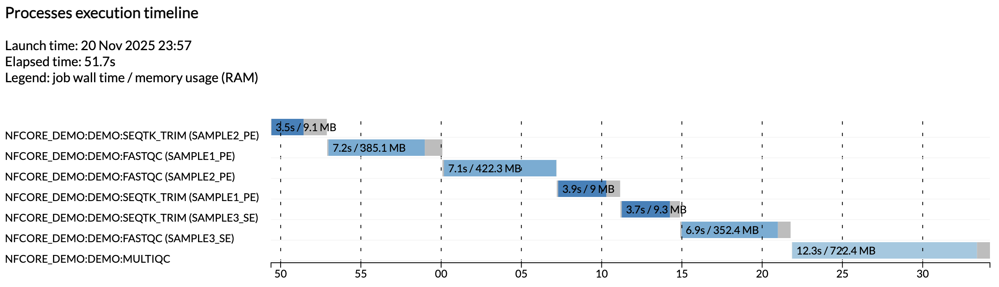

# Part 1: Run a demo pipeline

In this first part of the Use nf-core training course, we show you how to find an nf-core pipeline and try it out using its built-in test profile.

We are going to use a pipeline called nf-core/demo that is maintained by the nf-core project as part of its inventory of pipelines for demonstration and training purposes.

Make sure your working directory is set to `nfcore-run/` as instructed on the [Getting started](./00_orientation.md) page.

---

## 1. Find and retrieve the nf-core/demo pipeline

Let's start by locating the nf-core/demo pipeline on the project website at [nf-co.re](https://nf-co.re), which centralizes all information such as: general documentation and help articles, documentation for each of the pipelines, blog posts, event announcements and so forth.

### 1.1. Find the pipeline on the website

In your web browser, go to [https://nf-co.re/pipelines/](https://nf-co.re/pipelines/) and type `demo` in the search bar.



Click on the pipeline name, `demo`, to access the pipeline documentation page.

Each released pipeline has a dedicated page that includes the following documentation sections:

- **Introduction:** An introduction and overview of the pipeline
- **Usage:** Descriptions of how to execute the pipeline
- **Parameters:** Grouped pipeline parameters with descriptions
- **Output:** Descriptions and examples of the expected output files
- **Results:** Example output files generated from the full test dataset
- **Releases & Statistics:** Pipeline version history and statistics

Whenever you are considering adopting a new pipeline, you should read the pipeline documentation carefully first to understand what it does and how it should be configured before attempting to run it.

Have a look now and see if you can find out:

- Which tools the pipeline will run (Check the tab: `Introduction`)
- Which inputs and parameters the pipeline accepts or requires (Check the tab: `Parameters`)
- What are the outputs produced by the pipeline (Check the tab: `Output`)

#### 1.1.1. Pipeline overview

The `Introduction` tab provides an overview of the pipeline, including a visual representation (called a subway map) and a list of tools that are run as part of the pipeline.



1. Read QC ([FASTQC](https://www.bioinformatics.babraham.ac.uk/projects/fastqc/))
2. Adapter and quality trimming ([SEQTK_TRIM](https://github.com/lh3/seqtk))
3. Present QC for raw reads ([MULTIQC](http://multiqc.info/))
4. Generate a lighthearted text message from a cow ([COWPY](https://github.com/jeffbuttars/cowpy))

#### 1.1.2. Example command line

The documentation also provides an example input file (discussed further below) and an example command line.

```bash
nextflow run nf-core/demo \
  -profile <docker/singularity/.../institute> \
  --input samplesheet.csv \
  --outdir <OUTDIR>
```

You'll notice that the example command does NOT specify a workflow file, just the reference to the pipeline repository, `nf-core/demo`.

When invoked this way, Nextflow will assume that the code is organized in a certain way.
Let's retrieve the code so we can examine this structure.

### 1.2. Retrieve the pipeline code

Once we've determined that the pipeline appears to be suitable for our purposes, let's try it out.
Fortunately Nextflow makes it easy to retrieve pipelines from correctly-formatted repositories without having to download anything manually.

#### 1.2.1. Use `nextflow pull`

Let's return to the terminal and run the following:

```bash
nextflow pull nf-core/demo
```

??? success "Command output"

    ```console
    Checking nf-core/demo ...
    downloaded from https://github.com/nf-core/demo.git - revision: 32893afef8 [master]
    ```

Nextflow does a `pull` of the pipeline code, meaning it downloads the full repository to your local drive.

To be clear, you can do this with any Nextflow pipeline that is appropriately set up in GitHub, not just nf-core pipelines.
However nf-core is the largest open-source collection of Nextflow pipelines.

#### 1.2.2. Use `nextflow list`

You can get Nextflow to give you a list of what pipelines you have retrieved in this way:

```bash
nextflow list
```

??? success "Command output"

    ```console
    nf-core/demo
    ```

You can try pulling a few other pipelines to see how they get listed when you have more than one.

#### 1.2.3. Find where the pipeline was downloaded

You'll notice that the files are not in your current work directory.
By default, Nextflow saves pulled pipelines under `$NXF_HOME/assets`.

To find where a specific pipeline lives, ask Nextflow directly:

```bash
nextflow info nf-core/demo
```

??? success "Command output"

    ```console
    project name: nf-core/demo
    repository  : https://github.com/nf-core/demo
    local path  : /workspaces/.nextflow/assets/.repos/nf-core/demo
    main script : main.nf
    description : An nf-core demo pipeline
    revisions   :
      TEMPLATE
      bumper
      dev
      fix-nxfversion
      manually-merge-3_0_2
    > master (default)
      nf-core-template-merge-2.13.2.dev0
      nf-core-template-merge-2.14.0
      nf-core-template-merge-2.14.1
      nf-core-template-merge-3.0.0
      nf-core-template-merge-3.0.1
      nf-core-template-merge-3.0.2
      nf-core-template-merge-3.1.0
      nf-core-template-merge-3.1.2
      nf-core-template-merge-3.2.0
      nf-core-template-merge-3.2.1
      nf-core-template-merge-3.3.1
      nf-core-template-merge-3.3.2
      nf-core-template-merge-4.0.0
      1.0.0 [t]
      1.0.1 [t]
      1.0.2 [t]
      1.1.0 [t]
    > 1.2.0 [t]
    ```

!!! info

    The full path may differ on your system if you're not using our training environment.

Nextflow keeps the downloaded source code intentionally 'out of the way' on the principle that these pipelines should be used more like libraries than code that you would directly interact with.

Under the hood, Nextflow stores each pulled pipeline as a git repository under `$NXF_HOME/assets/.repos/`, and checks out the code for each revision into a `clones/<commit>/` subdirectory.
Because `.repos` is a hidden directory, a plain `tree -L 2 $NXF_HOME/assets/` will look empty.

#### 1.2.4. Create a symlink to access the source code easily

We're not going to look at the code in detail, but let's take a quick peek just to get a sense of what the overall organization looks like.

To make it easier to browse the pipeline source code, create a symbolic link pointing at the checked-out copy of the pipeline:

```bash
mkdir -p pipelines/nf-core
ln -s "$(echo $NXF_HOME/assets/.repos/nf-core/demo/clones/*/)" pipelines/nf-core/demo
```

This creates a shortcut so you can explore the code with `tree -L 2 pipelines/nf-core/demo` or open files directly.

#### 1.2.5. Overview of the code organization

You can either use `tree` or use the file explorer to find and open the `nf-core/demo` directory.

```bash
tree -L 1 pipelines/nf-core/demo
```

??? abstract "Directory contents"

    ```console
    pipelines/nf-core/demo
    ├── assets
    ├── CHANGELOG.md
    ├── CITATIONS.md
    ├── CODE_OF_CONDUCT.md
    ├── conf
    ├── docs
    ├── LICENSE
    ├── main.nf
    ├── modules
    ├── modules.json
    ├── nextflow.config
    ├── nextflow_schema.json
    ├── nf-test.config
    ├── README.md
    ├── ro-crate-metadata.json
    ├── subworkflows
    ├── tests
    ├── tower.yml
    └── workflows

    7 directories, 12 files
    ```

As you can see, there's a lot going on in there, most of which you don't need to worry about.

Briefly, let's note that at the top level, you can find a README file with summary information, as well as accessory files that summarize project information such as licensing, contribution guidelines, citation and code of conduct.
Detailed pipeline documentation is located in the `docs` directory.
All of this content is used to generate the web pages on the nf-core website programmatically, so they're always up to date with the code.

For the rest, we can distinguish three functional groups of code files:

1. Pipeline code components (`main.nf`, `workflows`, `subworkflows`, `modules`)
2. Pipeline configuration
3. Pipeline parameters / inputs and validation

We won't go over the pipeline code components in this part of the course, but we will touch on elements of configuration and validation that are likely to be relevant to you as an end user of nf-core pipelines.

!!! tip

    You can also browse any nf-core pipeline's source code on GitHub, e.g. [github.com/nf-core/demo](https://github.com/nf-core/demo).
    Every nf-core pipeline follows the same directory layout, so once you know the structure, you can find configuration files, modules, and workflows for any pipeline the same way.

For now, on to running the pipeline!

### Takeaway

You now know how to find a pipeline via the nf-core website and retrieve a local copy of the source code.

### What's next?

Learn how to try out an nf-core pipeline with minimal effort.

---

## 2. Try out the pipeline with its test profile

Conveniently, every nf-core pipeline comes with a test profile.
This is a minimal set of configuration settings for the pipeline to run using a small test dataset hosted in the [nf-core/test-datasets](https://github.com/nf-core/test-datasets) repository.
It's a great way to quickly try out a pipeline at small scale.

!!! tip

    Nextflow's configuration profile system allows you to easily switch between different container engines or execution environments.
    For more details, see [Hello Nextflow Part 6: Configuration](../hello_nextflow/06_hello_config.md).

### 2.1. Examine the test profile

It's good practice to check what a pipeline's test profile specifies before running it.
The `test` profile for `nf-core/demo` lives in the configuration file `conf/test.config`.
You can find it locally inside the pipeline source that `nextflow pull` downloaded, via the `pipelines` symlink created in section 1.2.4:

```bash
code pipelines/nf-core/demo/conf/test.config
```

Here is the content of that file:

```groovy title="conf/test.config" linenums="1" hl_lines="8 26"
/*
~~~~~~~~~~~~~~~~~~~~~~~~~~~~~~~~~~~~~~~~~~~~~~~~~~~~~~~~~~~~~~~~~~~~~~~~~~~~~~~~~~~~~~~~
    Nextflow config file for running minimal tests
~~~~~~~~~~~~~~~~~~~~~~~~~~~~~~~~~~~~~~~~~~~~~~~~~~~~~~~~~~~~~~~~~~~~~~~~~~~~~~~~~~~~~~~~
    Defines input files and everything required to run a fast and simple pipeline test.

    Use as follows:
        nextflow run nf-core/demo -profile test,<docker/singularity> --outdir <OUTDIR>

----------------------------------------------------------------------------------------
*/

process {
    resourceLimits = [
        cpus: 2,
        memory: '4.GB',
        time: '1.h',
    ]
}

params {
    config_profile_name        = 'Test profile'
    config_profile_description = 'Minimal test dataset to check pipeline function'

    // Input data
    input                      = 'https://raw.githubusercontent.com/nf-core/test-datasets/viralrecon/samplesheet/samplesheet_test_illumina_amplicon.csv'
}
```

You'll notice right away that the comment block at the top includes a usage example showing how to run the pipeline with this test profile.

```groovy title="conf/test.config" linenums="7"
    Use as follows:
        nextflow run nf-core/demo -profile test,<docker/singularity> --outdir <OUTDIR>
```

The only things we need to supply are what's shown between carets in the example command: `<docker/singularity>` and `<OUTDIR>`.

As a reminder, `<docker/singularity>` refers to the choice of container system. All nf-core pipelines are designed to be usable with containers (Docker, Singularity, etc.) to ensure reproducibility and eliminate software installation issues.
So we'll need to specify whether we want to use Docker or Singularity to test the pipeline.

The `--outdir <OUTDIR>` part refers to the directory where Nextflow will write the pipeline's outputs.
We need to provide a name for it, which we can just make up.
If it does not exist already, Nextflow will create it for us at runtime.

Moving on to the section after the comment block, the test profile shows us what has been pre-configured for testing: most notably, the `input` parameter is already set to point to a test dataset, so we don't need to provide our own data.
If you follow the link to the pre-configured input, you'll see it is a csv file containing sample identifiers and file paths for several experimental samples.

```csv title="samplesheet_test_illumina_amplicon.csv"
sample,fastq_1,fastq_2
SAMPLE1_PE,https://raw.githubusercontent.com/nf-core/test-datasets/viralrecon/illumina/amplicon/sample1_R1.fastq.gz,https://raw.githubusercontent.com/nf-core/test-datasets/viralrecon/illumina/amplicon/sample1_R2.fastq.gz
SAMPLE2_PE,https://raw.githubusercontent.com/nf-core/test-datasets/viralrecon/illumina/amplicon/sample2_R1.fastq.gz,https://raw.githubusercontent.com/nf-core/test-datasets/viralrecon/illumina/amplicon/sample2_R2.fastq.gz
SAMPLE3_SE,https://raw.githubusercontent.com/nf-core/test-datasets/viralrecon/illumina/amplicon/sample1_R1.fastq.gz,
SAMPLE3_SE,https://raw.githubusercontent.com/nf-core/test-datasets/viralrecon/illumina/amplicon/sample2_R1.fastq.gz,
```

This is called a samplesheet, and is the most common form of input to nf-core pipelines.
Don't worry if you're not familiar with the data formats and types, it's not important for what follows.

We now have everything we need to try out the pipeline.

### 2.2. Run the pipeline

As noted above, we can use the example testing command almost as-is; we just need to specify what software packaging to use, and what to name the output directory.
Here we'll use Docker for the container system and `demo-results`, respectively.

With that, we can run the test command:

```bash
nextflow run nf-core/demo -profile test,docker --outdir demo-results
```

??? success "Command output"

    ```console
    N E X T F L O W   ~  version 26.04.4

    Downloading plugin nf-schema@2.7.2
    Launching `https://github.com/nf-core/demo` [cranky_curry] revision: 32893afef8 [master]

    ------------------------------------------------------
                                            ,--./,-.
            ___     __   __   __   ___     /,-._.--~'
      |\ | |__  __ /  ` /  \ |__) |__         }  {
      | \| |       \__, \__/ |  \ |___     \`-._,-`-,
                                            `._,._,'
      nf-core/demo 1.2.0
    ------------------------------------------------------

    Input/output options
      input                     : https://raw.githubusercontent.com/nf-core/test-datasets/viralrecon/samplesheet/samplesheet_test_illumina_amplicon.csv
      outdir                    : demo-results

    Institutional config options
      config_profile_name       : Test profile
      config_profile_description: Minimal test dataset to check pipeline function

    Generic options
      trace_report_suffix       : 2026-07-03_21-31-35

    Core Nextflow options
      revision                  : master
      runName                   : cranky_curry
      containerEngine           : docker
      launchDir                 : /workspaces/training/nfcore-run
      workDir                   : /workspaces/training/nfcore-run/work
      projectDir                : /workspaces/.nextflow/assets/.repos/nf-core/demo/clones/32893afef8076a03a2767a020b3f0cab2e0b40b2
      userName                  : root
      profile                   : test,docker
      configFiles               : /workspaces/.nextflow/assets/.repos/nf-core/demo/clones/32893afef8076a03a2767a020b3f0cab2e0b40b2/nextflow.config

    !! Only displaying parameters that differ from the pipeline defaults !!
    ------------------------------------------------------

    * The pipeline
        https://doi.org/10.5281/zenodo.12192442

    * The nf-core framework
        https://doi.org/10.1038/s41587-020-0439-x

    * Software dependencies
        https://github.com/nf-core/demo/blob/master/CITATIONS.md

    executor >  local (8)
    [ca/5b0f3e] NFCORE_DEMO:DEMO:FASTQC (SAMPLE3_SE)     [100%] 3 of 3 ✔
    [b7/cb6812] NFCORE_DEMO:DEMO:SEQTK_TRIM (SAMPLE3_SE) [100%] 3 of 3 ✔
    [ff/6ebd98] NFCORE_DEMO:DEMO:COWPY                   [100%] 1 of 1 ✔
    [09/bbd1b4] NFCORE_DEMO:DEMO:MULTIQC (demo)          [100%] 1 of 1 ✔
    -[nf-core/demo] Pipeline completed successfully-
    ```

If your output matches that, congratulations! You've just run your first nf-core pipeline.

You'll notice that there is a lot more console output than when you run a basic Nextflow pipeline.
There's a header that includes a summary of the pipeline's version, inputs and outputs, and a few elements of configuration.

!!! info

    Your output will show different timestamps, execution names, and file paths, but the overall structure and process execution should be similar.

Notice the line near the top of the output:

```console
Launching `https://github.com/nf-core/demo` [cranky_curry] revision: 32893afef8 [master]
```

This tells you which revision of the pipeline was used.
Because we did not specify a version, Nextflow used the latest commit on `master`.
For reproducible runs, you should pin a specific release using the `-r` flag:

```bash
nextflow run nf-core/demo -r 1.2.0 -profile test,docker --outdir demo-results
```

This ensures that the same pipeline code is used every time, regardless of new commits or releases.
For this training we omit `-r` for simplicity, but in production you should always specify it.

Moving on to the execution output, let's have a look at the lines that tell us what processes were run:

```console
executor >  local (8)
[ca/5b0f3e] NFCORE_DEMO:DEMO:FASTQC (SAMPLE3_SE)     [100%] 3 of 3 ✔
[b7/cb6812] NFCORE_DEMO:DEMO:SEQTK_TRIM (SAMPLE3_SE) [100%] 3 of 3 ✔
[ff/6ebd98] NFCORE_DEMO:DEMO:COWPY                   [100%] 1 of 1 ✔
[09/bbd1b4] NFCORE_DEMO:DEMO:MULTIQC (demo)          [100%] 1 of 1 ✔
-[nf-core/demo] Pipeline completed successfully-
```

This tells us that four processes were run, corresponding to the four tools shown in the pipeline documentation page on the nf-core website: `FASTQC`, `SEQTK_TRIM`, `MULTIQC` and `COWPY`.

The full process names as shown here, such as `NFCORE_DEMO:DEMO:MULTIQC`, are longer than what you may have seen in the introductory Hello Nextflow material.
These include the names of their parent workflows and reflect the modularity of the pipeline code.
If you want to learn to develop nf-core-style pipelines yourself, see the [Build with nf-core](../hello_nf-core/index.md) course.

### 2.3. Examine the pipeline's outputs

Finally, let's have a look at the `demo-results` directory produced by the pipeline.

```bash
tree -L 2 demo-results
```

??? abstract "Directory contents"

    ```console
    demo-results
    ├── cowpy
    │   └── cowpy.txt
    ├── fastqc
    │   ├── SAMPLE1_PE
    │   ├── SAMPLE2_PE
    │   └── SAMPLE3_SE
    ├── fq
    │   ├── SAMPLE1_PE
    │   ├── SAMPLE2_PE
    │   └── SAMPLE3_SE
    ├── multiqc
    │   ├── multiqc_data
    │   └── multiqc_report.html
    └── pipeline_info
        ├── execution_report_2026-07-03_21-31-35.html
        ├── execution_timeline_2026-07-03_21-31-35.html
        ├── execution_trace_2026-07-03_21-31-35.txt
        ├── nf_core_demo_software_mqc_versions.yml
        ├── params_2026-07-03_21-31-43.json
        └── pipeline_dag_2026-07-03_21-31-35.html

    12 directories, 8 files
    ```

That might seem like a lot.
To learn more about the `nf-core/demo` pipeline's outputs, check out its [documentation page](https://nf-co.re/demo/1.2.0/docs/output/).

At this stage, what's important to observe is that the results are organized by module, and there is additionally a directory called `pipeline_info` containing various timestamped reports about the pipeline execution.

For example, the `execution_timeline_*` file shows you what processes were run, in what order and how long they took to run:



!!! info

    Here the tasks were not run in parallel because we are running on a minimalist machine in Github Codespaces.
    To see these run in parallel, try increasing the CPU allocation of your codespace and the resource limits in the test configuration.

These reports are generated automatically for all nf-core pipelines.

### Takeaway

You know how to run an nf-core pipeline using its built-in test profile and where to find its outputs.

### What's next?

Head on to [Part 2](./02_configure_execution.md), where you'll learn how to configure pipeline execution.

---

## Summary

In this part you learned to:

- Find and retrieve an nf-core pipeline and examine its code structure
- Run a pipeline using its built-in test profile
