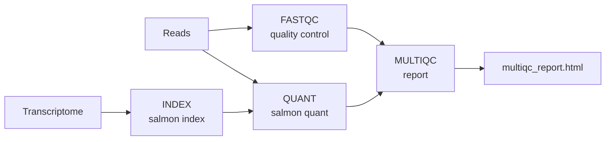

# Meet CoScientist

Working on the Seqera Platform means moving between the Launchpad, compute environments, datasets, and runs.
CoScientist can drive all of that from a conversation, once it is connected to your workspace.
In this lesson you open the chat, connect it to your training workspace, and have it inspect and register real Platform assets, so the rest of the course has a working agent to build on.

---

## 1. Open the chat and connect to your workspace.

Navigate to [https://ai.seqera.io/chat](https://ai.seqera.io/chat) and sign in with your Seqera credentials.

<!-- TODO: verify the CoScientist chat URL is stable and publicly correct before publishing -->
<!-- TODO: screenshot: the CoScientist chat landing view after login -->

Use the workspace selector to choose the provided training workspace.

<!-- TODO: verify exact label of the workspace selector control in the UI -->
<!-- TODO: screenshot: workspace selector showing the training workspace -->

## 2. Confirm the connection.

Send the following prompt to confirm CoScientist can see your workspace:

```text
Which Seqera workspace am I connected to, and what compute environments are available here?
```

??? example "What CoScientist typically does"

    It names the connected workspace and lists the available compute environment(s).
    The exact wording will differ from run to run.

!!! note "Checkpoint"

    CoScientist correctly names the **training workspace** and lists at least one compute environment.
    If it cannot, the workspace connection is not set up; revisit step 1.

## 3. Ask CoScientist what it can do.

Get a baseline picture of the agent's capabilities in this workspace:

```text
What can you help me with in this workspace? What can you see and what actions can you take?
```

??? example "What CoScientist typically does"

    It describes that it can help develop pipelines, launch and monitor runs, browse data, and act on GitHub.
    The exact wording will differ from run to run.

## 4. Survey the workspace.

Ask CoScientist for a snapshot of what is already in the workspace:

```text
List the pipelines on the Launchpad and the datasets in this workspace.
```

??? example "What CoScientist typically does"

    It returns the current Launchpad pipelines and datasets it can see in the workspace.
    The exact wording and the number of items listed will differ depending on the workspace state.

The same access also covers reference genomes and data links.

!!! note "Checkpoint"

    CoScientist lists the workspace's pipelines and datasets, or reports that none exist yet.

## 5. Add rnaseq-nf to the Launchpad.

Ask CoScientist to register a pipeline on your behalf:

```text
Add the pipeline https://github.com/nextflow-io/rnaseq-nf to the Launchpad in this workspace, using the available compute environment.
```

CoScientist will confirm the action or ask which compute environment to use if more than one is available.

!!! note "Checkpoint"

    In the Seqera Platform web app, open **Launchpad**: an entry for `rnaseq-nf` is now present.

<!-- TODO: screenshot: Launchpad showing the new rnaseq-nf pipeline -->

## 6. Understand what rnaseq-nf does.

`rnaseq-nf` is a small RNA-seq quantification pipeline, a good size to develop and test against.
It builds a Salmon index from a transcriptome (`INDEX`), runs quality control on the reads (`FASTQC`), quantifies transcript expression with Salmon (`QUANT`), and aggregates the results into a single report (`MULTIQC`).
It ships a small chicken (`ggal`) test dataset, so a full run finishes in minutes.



## 7. Inspect the compute environment.

Ask CoScientist to read the configuration for the compute environment attached to the pipeline:

```text
Show me the details of the compute environment this pipeline will run on.
```

CoScientist reads the compute-environment configuration and returns the key fields.

!!! note "Checkpoint"

    CoScientist reports the compute environment name and platform (for example AWS Batch) matching the training compute environment.

### Takeaway

You connected CoScientist to your training workspace, had a first conversation, and used it to register and inspect a pipeline.
It acts on real Platform assets on your behalf, with your own permissions.

### What's next?

In the next lesson, [learn how to work effectively with the agent](02_working_with_the_agent.md) before you start changing code.
