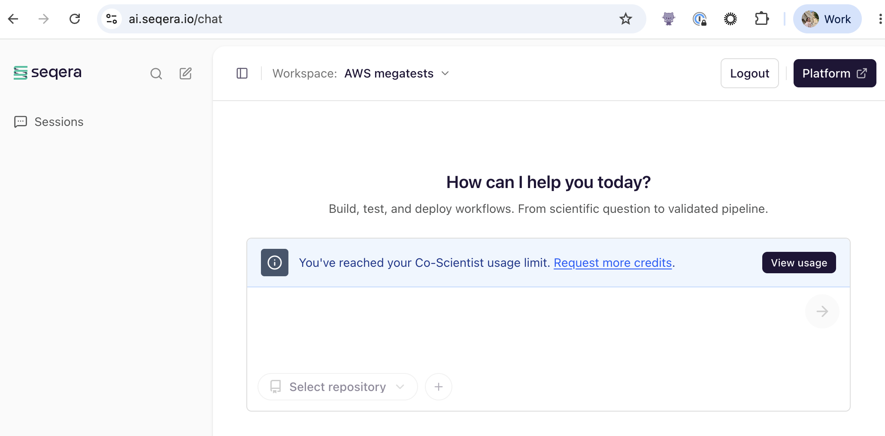
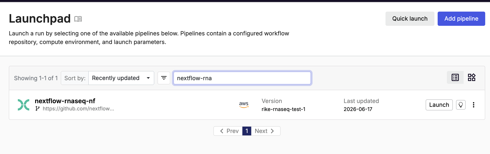
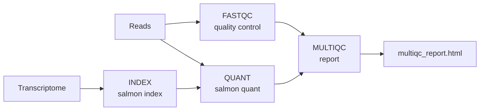

# Meet CoScientist

Working on the Seqera Platform means moving between the Launchpad, compute environments, datasets, and runs.
CoScientist can drive all of that from a conversation, once it is connected to your workspace.
In this lesson you open the chat, connect it to your training workspace, and have it inspect and register real Platform assets, so the rest of the course has a working agent to build on.

---

## 1. Open the chat and connect to your workspace.

Navigate to [https://ai.seqera.io/chat](https://ai.seqera.io/chat) and sign in with your Seqera credentials.



Use the **Workspace** selector in the top navigation to choose the provided training workspace.

## 2. Confirm the connection and survey the workspace.

!!! tip "Writing good prompts"

    Be specific and state the action or output you want.
    [Working with the agent](02_working_with_the_agent.md) covers prompting for intent in depth.

Send one prompt to confirm CoScientist can see your workspace and to get a snapshot of what is already in it:

```text
Which Seqera workspace am I connected to? List the compute environments, the pipelines on the Launchpad, and the datasets you can see.
```

??? example "What CoScientist typically does"

    It names the connected workspace and lists the compute environment(s), Launchpad pipelines, and datasets it can see.
    The exact wording and the number of items will differ depending on the workspace state.

The same access also covers reference genomes and data links.

!!! note "Checkpoint"

    CoScientist correctly names the **training workspace** and lists at least one compute environment, along with any pipelines and datasets (or reports that none exist yet).
    If it cannot name the workspace, the connection is not set up; revisit step 1.

## 3. Ask CoScientist what it can do.

Get a baseline picture of the agent's capabilities in this workspace:

```text
What can you help me with in this workspace? What can you see and what actions can you take?
```

??? example "What CoScientist typically does"

    It describes that it can help develop pipelines, launch and monitor runs, browse data, and act on GitHub.
    The exact wording will differ from run to run.

## 4. Add rnaseq-nf to the Launchpad.

Ask CoScientist to register a pipeline on your behalf:

```text
Add the pipeline https://github.com/nextflow-io/rnaseq-nf to the Launchpad in this workspace, using the available compute environment and a tag to identify it as created by me.
```

CoScientist will confirm the action or ask which compute environment to use if more than one is available.

!!! note "Checkpoint"

    In the Seqera Platform web app, open **Launchpad**: an entry for `rnaseq-nf` is now present.



## 5. Understand what rnaseq-nf does.

`rnaseq-nf` is a small RNA-seq quantification pipeline, a good size to develop and test against.
It builds a Salmon index from a transcriptome (`INDEX`), runs quality control on the reads (`FASTQC`), quantifies transcript expression with Salmon (`QUANT`), and aggregates the results into a single report (`MULTIQC`).
It ships a small chicken (`ggal`) test dataset, so a full run finishes in minutes.



## 6. Inspect the compute environment.

Ask CoScientist to read the configuration for the compute environment attached to the pipeline:

```text
Show me the details of the compute environment this pipeline will run on.
```

CoScientist reads the compute-environment configuration and returns the key fields.

!!! note "Checkpoint"

    CoScientist reports the compute environment name and platform (for example AWS Batch) matching the training compute environment.

### Takeaway

You connected CoScientist to your training workspace, had a first conversation, and used it to register and inspect a pipeline.
It acts on real Platform assets on your behalf, with your own permissions.

### What's next?

In the next lesson, [learn how to work effectively with the agent](02_working_with_the_agent.md) before you start changing code.
