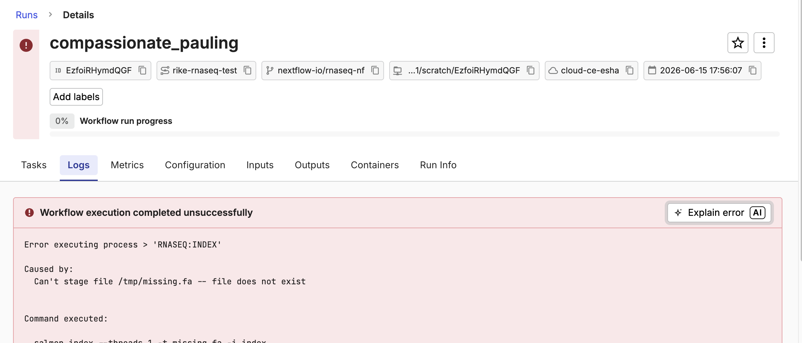

# Working with the agent

CoScientist takes real actions on your workspace, so how you prompt and check it matters.
In this lesson you launch a run that fails on a simple mistake, then drive the agent to fix it from the user side, without editing any pipeline code.
Along the way you practise the habits that keep you in control: prompt for intent, verify what the agent did, and redirect it when it goes wrong.

---

## 1. Launch a run that will fail.

`rnaseq-nf` ships its own test transcriptome and uses it by default.
To create a failure to work with, launch the pipeline but override that default with a path that does not exist:

```text
Launch rnaseq-nf on the Launchpad, but set the transcriptome parameter to /tmp/missing.fa so we have a failed run to work with.
```

The run fails almost immediately at the indexing step, because the file you pointed it at is not there.

!!! note "Checkpoint"

    A run for rnaseq-nf appears in the Runs list and fails quickly with a file-not-found error.

## 2. Open the failed run from the Platform.

CoScientist works in both directions.
You launched this run from the chat; you can also reach the agent from a run in the Platform.
Open the **Runs** list, select the failed run, and choose **Explain with AI**.
This starts a CoScientist conversation loaded with that run's context, so you do not have to describe the failure yourself.



!!! note "Checkpoint"

    Selecting **Explain with AI** opens a CoScientist conversation about the failed run.

## 3. Prompt for intent.

Ask the agent to work the problem, giving it the symptom and a clear goal rather than a vague instruction.

=== "Better"

    ```text
    This rnaseq-nf run failed. Read the run log, tell me the cause, and propose how to fix the launch settings before changing anything.
    ```

=== "Vague"

    ```text
    Fix the pipeline.
    ```

The better prompt points the agent at the run log, asks it to explain before acting, and limits it to the launch settings.
The vague one invites it to guess, and the guess is often wrong.

??? example "What CoScientist typically does"

    It reads the run log, reports that the transcriptome file could not be found, and proposes correcting the parameter to the default path.
    The exact wording will differ from run to run.

## 4. Verify what the agent says.

Do not take the agent's diagnosis, or its "Done", at face value.
Check its explanation against the actual run error, and confirm the cause is the parameter you set, not a problem in the pipeline.

!!! warning

    Treat the agent's "Done" as a claim to check, not a fact.
    The Checkpoints in this side quest exist for this reason: each one is a real Platform state you confirm yourself, whatever the agent says it did.

!!! note "Checkpoint"

    From the run's own error, you have confirmed the failure is the missing transcriptome file you set at launch.

## 5. Redirect the agent when it goes too far.

The fix here is a launch parameter, not a code change.
The default transcriptome ships with the pipeline, so fixing the run means dropping your override, not finding new data.
If the agent offers to edit the pipeline, steer it back to the smallest fix:

```text
Don't change the pipeline code. Just remove the transcriptome override so the pipeline uses its default, and relaunch.
```

!!! note "Checkpoint"

    The agent corrects only the launch parameter and leaves the pipeline code untouched.

## 6. Re-launch and confirm the fix.

With the parameter corrected, the run gets past the step that failed.

!!! note "Checkpoint"

    The new run launches and proceeds past the indexing step instead of failing immediately.

### Takeaway

You fixed a failed run entirely from the user side, without touching pipeline code, by prompting for intent, verifying the agent's diagnosis against the real error, and redirecting it to the smallest fix.

### What's next?

In the next lesson, [start developing with CoScientist](03_develop_with_coscientist.md), where you change the pipeline itself.
