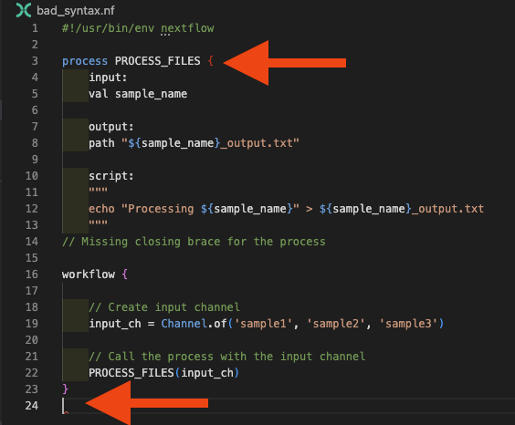
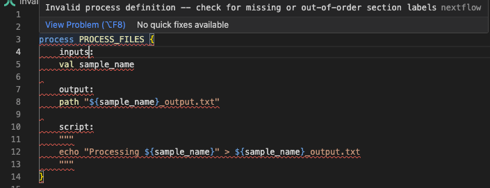
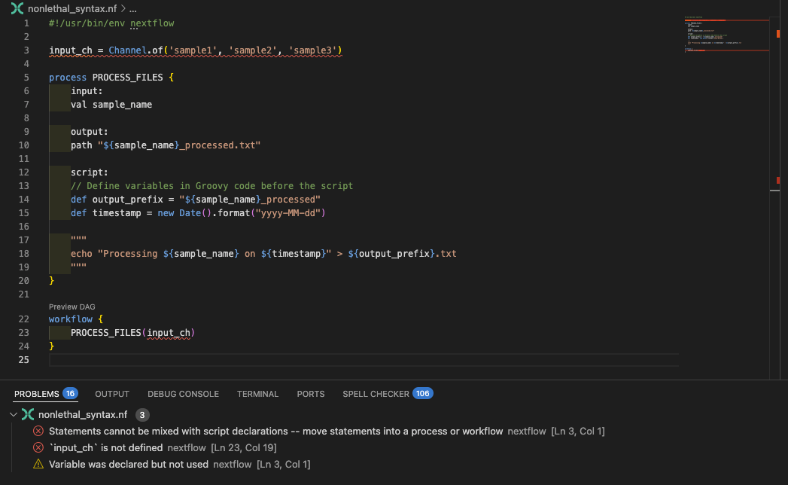
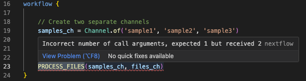

# Part 1: Common errors and how to fix them

This lesson is a catalogue of the errors you'll meet most often when writing Nextflow workflows.
Each entry shows the error in action, the message Nextflow produces, and the fix.

Read it through once to learn the shape of each error, or jump to a specific section when a matching message lands in your terminal.

When you're done here, move on to [Part 2: The Nextflow debugging toolkit](02_debugging_toolkit.md) to learn the tools you reach for when an error isn't obvious from its message alone.

---

## 0. Get started

#### Open the training codespace

If you haven't yet done so, make sure to open the training environment as described in the [Environment Setup](../../envsetup/index.md).

[](https://codespaces.new/nextflow-io/training?quickstart=1&ref=master)

#### Move into the project directory

Let's move into the directory where the files for this tutorial are located.

```bash
cd side-quests/debugging
```

You can set VSCode to focus on this directory:

```bash
code .
```

#### Review the materials

You'll find a set of example workflows with various types of bugs that we'll use for practice:

??? abstract "Directory contents"

    ```console
    .
    ├── bad_bash_var.nf
    ├── bad_channel_shape.nf
    ├── bad_channel_shape_viewed_debug.nf
    ├── bad_channel_shape_viewed.nf
    ├── bad_number_inputs.nf
    ├── badpractice_syntax.nf
    ├── bad_resources.nf
    ├── bad_syntax.nf
    ├── buggy_workflow.nf
    ├── data
    │   ├── sample_001.fastq.gz
    │   ├── sample_002.fastq.gz
    │   ├── sample_003.fastq.gz
    │   ├── sample_004.fastq.gz
    │   ├── sample_005.fastq.gz
    │   └── sample_data.csv
    ├── exhausted.nf
    ├── invalid_process.nf
    ├── missing_output.nf
    ├── missing_software.nf
    ├── missing_software_with_stub.nf
    ├── nextflow.config
    ├── no_such_var.nf
    └── sample_processing.nf
    ```

These files represent common debugging scenarios you'll encounter in real-world development.

#### Review the assignment

Your challenge is to run each workflow, identify the error(s), and fix them.

For each buggy workflow:

1. **Run the workflow** and observe the error
2. **Analyze the error message**: what is Nextflow telling you?
3. **Locate the problem** in the code using the clues provided
4. **Fix the bug** and verify your solution works
5. **Reset the file** before moving to the next section (use `git checkout <filename>`)

The exercises progress from simple syntax errors to more subtle runtime issues.
Solutions are discussed inline, but try to solve each one yourself before reading ahead.

#### Readiness checklist

Think you're ready to dive in?

- [ ] My codespace is up and running
- [ ] I've set my working directory appropriately
- [ ] I understand the assignment

If you can check all the boxes, you're good to go.

---

## 1. Syntax Errors

Syntax errors are the most common type of error you'll encounter when writing Nextflow code. They occur when the code does not conform to the expected syntax rules of the Nextflow DSL. These errors prevent your workflow from running at all, so it's important to learn how to identify and fix them quickly.

### 1.1. Missing braces

One of the most common syntax errors, and sometimes one of the more complex ones to debug is **missing or mismatched brackets**.

Let's start with a practical example.

#### Run the pipeline

```bash
nextflow run bad_syntax.nf
```

??? failure "Command output"

    ```console
    N E X T F L O W   ~  version 25.10.4

    Launching `bad_syntax.nf` [stupefied_bhabha] DSL2 - revision: ca6327fad2

    Error bad_syntax.nf:24:1: Unexpected input: '<EOF>'

    ERROR ~ Script compilation failed

     -- Check '.nextflow.log' file for details
    ```

**Key elements of syntax error messages:**

- **File and location**: Shows which file and line/column contain the error (`bad_syntax.nf:24:1`)
- **Error description**: Explains what the parser found that it didn't expect (`Unexpected input: '<EOF>'`)
- **EOF indicator**: The `<EOF>` (End Of File) message indicates the parser reached the end of the file while still expecting more content - a classic sign of unclosed braces

#### Check the code

Now, let's examine `bad_syntax.nf` to understand what's causing the error:

```groovy title="bad_syntax.nf" hl_lines="14" linenums="1"
#!/usr/bin/env nextflow

process PROCESS_FILES {
    input:
    val sample_name

    output:
    path "${sample_name}_output.txt"

    script:
    """
    echo "Processing ${sample_name}" > ${sample_name}_output.txt
    """
// Missing closing brace for the process

workflow {

    // Create input channel
    input_ch = channel.of('sample1', 'sample2', 'sample3')

    // Call the process with the input channel
    PROCESS_FILES(input_ch)
}
```

For the purpose of this example we've left a comment for you to show where the error is. The Nextflow VSCode extension should also be giving you some hints about what might be wrong, putting the mismatched brace in red and highlighting the premature end of the file:



**Debugging strategy for bracket errors:**

1. Use VS Code's bracket matching (place cursor next to a bracket)
2. Check the Problems panel for bracket-related messages
3. Ensure each opening `{` has a corresponding closing `}`

#### Fix the code

Replace the comment with the missing closing brace:

=== "After"

    ```groovy title="bad_syntax.nf" hl_lines="14" linenums="1"
    #!/usr/bin/env nextflow

    process PROCESS_FILES {
        input:
        val sample_name

        output:
        path "${sample_name}_output.txt"

        script:
        """
        echo "Processing ${sample_name}" > ${sample_name}_output.txt
        """
    }  // Add the missing closing brace

    workflow {

        // Create input channel
        input_ch = channel.of('sample1', 'sample2', 'sample3')

        // Call the process with the input channel
        PROCESS_FILES(input_ch)
    }
    ```

=== "Before"

    ```groovy title="bad_syntax.nf" hl_lines="14" linenums="1"
    #!/usr/bin/env nextflow

    process PROCESS_FILES {
        input:
        val sample_name

        output:
        path "${sample_name}_output.txt"

        script:
        """
        echo "Processing ${sample_name}" > ${sample_name}_output.txt
        """
    // Missing closing brace for the process

    workflow {

        // Create input channel
        input_ch = channel.of('sample1', 'sample2', 'sample3')

        // Call the process with the input channel
        PROCESS_FILES(input_ch)
    }
    ```

#### Run the pipeline

Now run the workflow again to confirm it works:

```bash
nextflow run bad_syntax.nf
```

??? success "Command output"

    ```console
    N E X T F L O W   ~  version 25.10.4

    Launching `bad_syntax.nf` [insane_faggin] DSL2 - revision: 961938ee2b

    executor >  local (3)
    [48/cd7f54] PROCESS_FILES (1) | 3 of 3 ✔
    ```

### 1.2. Using incorrect process keywords or directives

Another common syntax error is an **invalid process definition**. This can happen if you forget to define required blocks or use incorrect directives in the process definition.

#### Run the pipeline

```bash
nextflow run invalid_process.nf
```

??? failure "Command output"

    ```console
    N E X T F L O W   ~  version 25.10.4

    Launching `invalid_process.nf` [nasty_jepsen] DSL2 - revision: da9758d614

    Error invalid_process.nf:3:1: Invalid process definition -- check for missing or out-of-order section labels
    │   3 | process PROCESS_FILES {
    │     | ^^^^^^^^^^^^^^^^^^^^^^^
    │   4 |     inputs:
    │   5 |     val sample_name
    │   6 |
    ╰   7 |     output:

    ERROR ~ Script compilation failed

     -- Check '.nextflow.log' file for details
    ```

#### Check the code

The error indicates an "Invalid process definition" and shows the context around the problem. Looking at lines 3-7, we can see `inputs:` on line 4, which is the issue. Let's examine `invalid_process.nf`:

```groovy title="invalid_process.nf" hl_lines="4" linenums="1"
#!/usr/bin/env nextflow

process PROCESS_FILES {
    inputs:  // ERROR: Should be 'input' not 'inputs'
    val sample_name

    output:
    path "${sample_name}_output.txt"

    script:
    """
    echo "Processing ${sample_name}" > ${sample_name}_output.txt
    """
}

workflow {

    // Create input channel
    input_ch = channel.of('sample1', 'sample2', 'sample3')

    // Call the process with the input channel
    PROCESS_FILES(input_ch)
}
```

Looking at line 4 in the error context, we can spot the issue: we're using `inputs` instead of the correct `input` directive. The Nextflow VSCode extension will also flag this:



#### Fix the code

Replace the incorrect keyword with the correct one by referencing [the documentation](https://www.nextflow.io/docs/latest/process.html#):

=== "After"

    ```groovy title="invalid_process.nf" hl_lines="4" linenums="1"
    #!/usr/bin/env nextflow

    process PROCESS_FILES {
        input:  // Fixed: Changed 'inputs' to 'input'
        val sample_name

        output:
        path "${sample_name}_output.txt"

        script:
        """
        echo "Processing ${sample_name}" > ${sample_name}_output.txt
        """
    }

    workflow {

        // Create input channel
        input_ch = channel.of('sample1', 'sample2', 'sample3')

        // Call the process with the input channel
        PROCESS_FILES(input_ch)
    }
    ```

=== "Before"

    ```groovy title="invalid_process.nf" hl_lines="4" linenums="1"
    #!/usr/bin/env nextflow

    process PROCESS_FILES {
        inputs:  // ERROR: Should be 'input' not 'inputs'
        val sample_name

        output:
        path "${sample_name}_output.txt"

        script:
        """
        echo "Processing ${sample_name}" > ${sample_name}_output.txt
        """
    }

    workflow {

        // Create input channel
        input_ch = channel.of('sample1', 'sample2', 'sample3')

        // Call the process with the input channel
        PROCESS_FILES(input_ch)
    }
    ```

#### Run the pipeline

Now run the workflow again to confirm it works:

```bash
nextflow run invalid_process.nf
```

??? success "Command output"

    ```console
    N E X T F L O W   ~  version 25.10.4

    Launching `invalid_process.nf` [silly_fermi] DSL2 - revision: 961938ee2b

    executor >  local (3)
    [b7/76cd9d] PROCESS_FILES (2) | 3 of 3 ✔
    ```

### 1.3. Using bad variable names

The variable names you use in your script blocks must be valid, derived either from inputs or from groovy code inserted before the script. But when you're wrangling complexity at the start of pipeline development, it's easy to make mistakes in variable naming, and Nextflow will let you know quickly.

#### Run the pipeline

```bash
nextflow run no_such_var.nf
```

??? failure "Command output"

    ```console
    N E X T F L O W   ~  version 25.10.4

    Launching `no_such_var.nf` [gloomy_meninsky] DSL2 - revision: 0c4d3bc28c

    Error no_such_var.nf:17:39: `undefined_var` is not defined
    │  17 |     echo "Using undefined variable: ${undefined_var}" >> ${output_pref
    ╰     |                                       ^^^^^^^^^^^^^

    ERROR ~ Script compilation failed

     -- Check '.nextflow.log' file for details
    ```

The error is caught at compile time and points directly to the undefined variable on line 17, with a caret indicating exactly where the problem is.

#### Check the code

Let's examine `no_such_var.nf`:

```groovy title="no_such_var.nf" hl_lines="17" linenums="1"
#!/usr/bin/env nextflow

process PROCESS_FILES {
    input:
    val sample_name

    output:
    path "${sample_name}_processed.txt"

    script:
    // Define variables in Groovy code before the script
    def output_prefix = "${sample_name}_processed"
    def timestamp = new Date().format("yyyy-MM-dd")

    """
    echo "Processing ${sample_name} on ${timestamp}" > ${output_prefix}.txt
    echo "Using undefined variable: ${undefined_var}" >> ${output_prefix}.txt  // ERROR: undefined_var not defined
    """
}

workflow {
    input_ch = channel.of('sample1', 'sample2', 'sample3')
    PROCESS_FILES(input_ch)
}
```

The error message indicates that the variable is not recognized in the script template, and there you go- you should be able to see `#!groovy ${undefined_var}` used in the script block, but not defined elsewhere.

#### Fix the code

If you get a 'No such variable' error, you can fix it by either defining the variable (by correcting input variable names or editing groovy code before the script), or by removing it from the script block if it's not needed:

=== "After"

    ```groovy title="no_such_var.nf" hl_lines="15-17" linenums="1"
    #!/usr/bin/env nextflow

    process PROCESS_FILES {
        input:
        val sample_name

        output:
        path "${sample_name}_processed.txt"

        script:
        // Define variables in Groovy code before the script
        def output_prefix = "${sample_name}_processed"
        def timestamp = new Date().format("yyyy-MM-dd")

        """
        echo "Processing ${sample_name} on ${timestamp}" > ${output_prefix}.txt
        """  // Removed the line with undefined_var
    }

    workflow {
        input_ch = channel.of('sample1', 'sample2', 'sample3')
        PROCESS_FILES(input_ch)
    }
    ```

=== "Before"

    ```groovy title="no_such_var.nf" hl_lines="17" linenums="1"
    #!/usr/bin/env nextflow

    process PROCESS_FILES {
        input:
        val sample_name

        output:
        path "${sample_name}_output.txt"

        script:
        // Define variables in Groovy code before the script
        def output_prefix = "${sample_name}_processed"
        def timestamp = new Date().format("yyyy-MM-dd")

        """
        echo "Processing ${sample_name} on ${timestamp}" > ${output_prefix}.txt
        echo "Using undefined variable: ${undefined_var}" >> ${output_prefix}.txt  // ERROR: undefined_var not defined
        """
    }

    workflow {
        input_ch = channel.of('sample1', 'sample2', 'sample3')
        PROCESS_FILES(input_ch)
    }
    ```

#### Run the pipeline

Now run the workflow again to confirm it works:

```bash
nextflow run no_such_var.nf
```

??? success "Command output"

    ```console
    N E X T F L O W   ~  version 25.10.4

    Launching `no_such_var.nf` [suspicious_venter] DSL2 - revision: 6ba490f7c5

    executor >  local (3)
    [21/237300] PROCESS_FILES (2) | 3 of 3 ✔
    ```

### 1.4. Bad use of Bash variables

Starting out in Nextflow, it can be difficult to understand the difference between Nextflow (Groovy) and Bash variables. This can generate another form of the bad variable error that appears when trying to use variables in the Bash content of the script block.

#### Run the pipeline

```bash
nextflow run bad_bash_var.nf
```

??? failure "Command output"

    ```console
    N E X T F L O W   ~  version 25.10.4

    Launching `bad_bash_var.nf` [infallible_mandelbrot] DSL2 - revision: 0853c11080

    Error bad_bash_var.nf:13:42: `prefix` is not defined
    │  13 |     echo "Processing ${sample_name}" > ${prefix}.txt
    ╰     |                                          ^^^^^^

    ERROR ~ Script compilation failed

     -- Check '.nextflow.log' file for details
    ```

#### Check the code

The error points to line 13 where `#!groovy ${prefix}` is used. Let's examine `bad_bash_var.nf` to see what's causing the issue:

```groovy title="bad_bash_var.nf" hl_lines="13" linenums="1"
#!/usr/bin/env nextflow

process PROCESS_FILES {
    input:
    val sample_name

    output:
    path "${sample_name}_output.txt"

    script:
    """
    prefix="${sample_name}_output"
    echo "Processing ${sample_name}" > ${prefix}.txt  # ERROR: ${prefix} is Groovy syntax, not Bash
    """
}
```

In this example, we're defining the `prefix` variable in Bash, but in a Nextflow process the `$` syntax we used to refer to it (`#!groovy ${prefix}`) is interpreted as a Groovy variable, not Bash. The variable doesn't exist in the Groovy context, so we get a 'no such variable' error.

#### Fix the code

If you want to use a Bash variable, you must escape the dollar sign like this:

=== "After"

    ```groovy title="bad_bash_var.nf" hl_lines="13" linenums="1"
    #!/usr/bin/env nextflow

    process PROCESS_FILES {
        input:
        val sample_name

        output:
        path "${sample_name}_output.txt"

        script:
        """
        prefix="${sample_name}_output"
        echo "Processing ${sample_name}" > \${prefix}.txt  # Fixed: Escaped the dollar sign
        """
    }

    workflow {
        input_ch = channel.of('sample1', 'sample2', 'sample3')
        PROCESS_FILES(input_ch)
    }
    ```

=== "Before"

    ```groovy title="bad_bash_var.nf" hl_lines="13" linenums="1"
    #!/usr/bin/env nextflow

    process PROCESS_FILES {
        input:
        val sample_name

        output:
        path "${sample_name}_output.txt"

        script:
        """
        prefix="${sample_name}_output"
        echo "Processing ${sample_name}" > ${prefix}.txt  # ERROR: ${prefix} is Groovy syntax, not Bash
        """
    }
    ```

This tells Nextflow to interpret this as a Bash variable.

#### Run the pipeline

Now run the workflow again to confirm it works:

```bash
nextflow run bad_bash_var.nf
```

??? success "Command output"

    ```console
    N E X T F L O W   ~  version 25.10.4

    Launching `bad_bash_var.nf` [naughty_franklin] DSL2 - revision: 58c1c83709

    executor >  local (3)
    [4e/560285] PROCESS_FILES (2) | 3 of 3 ✔
    ```

!!! tip "Groovy vs Bash Variables"

    For simple variable manipulations like string concatenation or prefix/suffix operations, it's usually more readable to use Groovy variables in the script section rather than Bash variables in the script block:

    ```groovy linenums="1"
    script:
    def output_prefix = "${sample_name}_processed"
    def output_file = "${output_prefix}.txt"
    """
    echo "Processing ${sample_name}" > ${output_file}
    """
    ```

    This approach avoids the need to escape dollar signs and makes the code easier to read and maintain.

### 1.5. Statements Outside Workflow Block

The Nextflow VSCode extension highlights issues with code structure that will cause errors. A common example is defining channels outside of the `workflow {}` block - this is now enforced as a syntax error.

#### Run the pipeline

```bash
nextflow run badpractice_syntax.nf
```

??? failure "Command output"

    ```console
    N E X T F L O W   ~  version 25.10.4

    Launching `badpractice_syntax.nf` [intergalactic_colden] DSL2 - revision: 5e4b291bde

    Error badpractice_syntax.nf:3:1: Statements cannot be mixed with script declarations -- move statements into a process or workflow
    │   3 | input_ch = channel.of('sample1', 'sample2', 'sample3')
    ╰     | ^^^^^^^^^^^^^^^^^^^^^^^^^^^^^^^^^^^^^^^^^^^^^^^^^^^^^^

    ERROR ~ Script compilation failed

     -- Check '.nextflow.log' file for details
    ```

The error message clearly indicates the problem: statements (like channel definitions) cannot be mixed with script declarations outside of a workflow or process block.

#### Check the code

Let's examine `badpractice_syntax.nf` to see what's causing the error:

```groovy title="badpractice_syntax.nf" hl_lines="3" linenums="1"
#!/usr/bin/env nextflow

input_ch = channel.of('sample1', 'sample2', 'sample3')  // ERROR: Channel defined outside workflow

process PROCESS_FILES {
    input:
    val sample_name

    output:
    path "${sample_name}_processed.txt"

    script:
    // Define variables in Groovy code before the script
    def output_prefix = "${sample_name}_processed"
    def timestamp = new Date().format("yyyy-MM-dd")

    """
    echo "Processing ${sample_name} on ${timestamp}" > ${output_prefix}.txt
    """
}

workflow {
    PROCESS_FILES(input_ch)
}
```

The VSCode extension will also highlight the `input_ch` variable as being defined outside the workflow block:



#### Fix the code

Move the channel definition inside the workflow block:

=== "After"

    ```groovy title="badpractice_syntax.nf" hl_lines="21" linenums="1"
    #!/usr/bin/env nextflow

    process PROCESS_FILES {
        input:
        val sample_name

        output:
        path "${sample_name}_processed.txt"

        script:
        // Define variables in Groovy code before the script
        def output_prefix = "${sample_name}_processed"
        def timestamp = new Date().format("yyyy-MM-dd")

        """
        echo "Processing ${sample_name} on ${timestamp}" > ${output_prefix}.txt
        """
    }

    workflow {
        input_ch = channel.of('sample1', 'sample2', 'sample3')  // Moved inside workflow block
        PROCESS_FILES(input_ch)
    }
    ```

=== "Before"

    ```groovy title="badpractice_syntax.nf" hl_lines="3" linenums="1"
    #!/usr/bin/env nextflow

    input_ch = channel.of('sample1', 'sample2', 'sample3')  // ERROR: Channel defined outside workflow

    process PROCESS_FILES {
        input:
        val sample_name

        output:
        path "${sample_name}_processed.txt"

        script:
        // Define variables in Groovy code before the script
        def output_prefix = "${sample_name}_processed"
        def timestamp = new Date().format("yyyy-MM-dd")

        """
        echo "Processing ${sample_name} on ${timestamp}" > ${output_prefix}.txt
        """
    }

    workflow {
        PROCESS_FILES(input_ch)
    }
    ```

#### Run the pipeline

Run the workflow again to confirm the fix works:

```bash
nextflow run badpractice_syntax.nf
```

??? success "Command output"

    ```console
    N E X T F L O W   ~  version 25.10.4

    Launching `badpractice_syntax.nf` [naughty_ochoa] DSL2 - revision: 5e4b291bde

    executor >  local (3)
    [6a/84a608] PROCESS_FILES (2) | 3 of 3 ✔
    ```

Keep your input channels defined within the workflow block, and in general follow any other recommendations the extension makes.

### Takeaway

You can systematically identify and fix syntax errors using Nextflow error messages and IDE visual indicators. Common syntax errors include missing braces, incorrect process keywords, undefined variables, and improper use of Bash vs. Nextflow variables. The VSCode extension helps catch many of these before runtime. With these syntax debugging skills in your toolkit, you'll be able to quickly resolve the most common Nextflow syntax errors and move on to tackling more complex runtime issues.

### What's next?

Learn to debug more complex channel structure errors that occur even when syntax is correct.

---

## 2. Channel Structure Errors

Channel structure errors are more subtle than syntax errors because the code is syntactically correct, but the data shapes don't match what processes expect. Nextflow will try to run the pipeline, but might find that the number of inputs doesn't match what it expects and fail. These errors typically only appear at runtime and require an understanding of the data flowing through your workflow.

!!! tip "Debugging Channels with `.view()`"

    Throughout this section, remember that you can use the `.view()` operator to inspect channel content at any point in your workflow. This is one of the most powerful debugging tools for understanding channel structure issues. We'll explore this technique in detail in section 2.4, but feel free to use it as you work through the examples.

    ```groovy
    my_channel.view()  // Shows what's flowing through the channel
    ```

### 2.1. Wrong Number of Input Channels

This error occurs when you pass a different number of channels than a process expects.

#### Run the pipeline

```bash
nextflow run bad_number_inputs.nf
```

??? failure "Command output"

    ```console
    N E X T F L O W   ~  version 25.10.4

    Launching `bad_number_inputs.nf` [happy_swartz] DSL2 - revision: d83e58dcd3

    Error bad_number_inputs.nf:23:5: Incorrect number of call arguments, expected 1 but received 2
    │  23 |     PROCESS_FILES(samples_ch, files_ch)
    ╰     |     ^^^^^^^^^^^^^^^^^^^^^^^^^^^^^^^^^^^

    ERROR ~ Script compilation failed

     -- Check '.nextflow.log' file for details
    ```

#### Check the code

The error message clearly states that the call expected 1 argument but received 2, and points to line 23. Let's examine `bad_number_inputs.nf`:

```groovy title="bad_number_inputs.nf" hl_lines="5 23" linenums="1"
#!/usr/bin/env nextflow

process PROCESS_FILES {
    input:
        val sample_name  // Process expects only 1 input

    output:
        path "${sample_name}_output.txt"

    script:
    """
    echo "Processing ${sample_name}" > ${sample_name}_output.txt
    """
}

workflow {

    // Create two separate channels
    samples_ch = channel.of('sample1', 'sample2', 'sample3')
    files_ch = channel.of('file1.txt', 'file2.txt', 'file3.txt')

    // ERROR: Passing 2 channels but process expects only 1
    PROCESS_FILES(samples_ch, files_ch)
}
```

You should see the mismatched `PROCESS_FILES` call, supplying multiple input channels when the process only defines one. The VSCode extension will also under line process call in red, and supply a diagnostic message when you mouse over:



#### Fix the code

For this specific example, the process expects a single channel and doesn't require the second channel, so we can fix it by passing only the `samples_ch` channel:

=== "After"

    ```groovy title="bad_number_inputs.nf" hl_lines="23" linenums="1"
    #!/usr/bin/env nextflow

    process PROCESS_FILES {
        input:
            val sample_name  // Process expects only 1 input

        output:
            path "${sample_name}_output.txt"

        script:
        """
        echo "Processing ${sample_name}" > ${sample_name}_output.txt
        """
    }

    workflow {

        // Create two separate channels
        samples_ch = channel.of('sample1', 'sample2', 'sample3')
        files_ch = channel.of('file1.txt', 'file2.txt', 'file3.txt')

        // Fixed: Pass only the channel the process expects
        PROCESS_FILES(samples_ch)
    }
    ```

=== "Before"

    ```groovy title="bad_number_inputs.nf" hl_lines="5 23" linenums="1"
    #!/usr/bin/env nextflow

    process PROCESS_FILES {
        input:
            val sample_name  // Process expects only 1 input

        output:
            path "${sample_name}_output.txt"

        script:
        """
        echo "Processing ${sample_name}" > ${sample_name}_output.txt
        """
    }

    workflow {

        // Create two separate channels
        samples_ch = channel.of('sample1', 'sample2', 'sample3')
        files_ch = channel.of('file1.txt', 'file2.txt', 'file3.txt')

        // ERROR: Passing 2 channels but process expects only 1
        PROCESS_FILES(samples_ch, files_ch)
    }
    ```

#### Run the pipeline

```bash
nextflow run bad_number_inputs.nf
```

??? success "Command output"

    ```console
    N E X T F L O W   ~  version 25.10.4

    Launching `bad_number_inputs.nf` [big_euler] DSL2 - revision: e302bd87be

    executor >  local (3)
    [48/497f7b] PROCESS_FILES (3) | 3 of 3 ✔
    ```

More commonly than this example, you might add additional inputs to a process and forget to update the workflow call accordingly, which can lead to this type of error. Fortunately, this is one of the easier-to-understand and fix errors, as the error message is quite clear about the mismatch.

### 2.2. Channel Exhaustion (Process Runs Fewer Times Than Expected)

Some channel structure errors are much more subtle and produce no errors at all. Probably the most common of these reflects a challenge that new Nextflow users face in understanding that queue channels can be exhausted and run out of items, meaning the workflow finishes prematurely.

#### Run the pipeline

```bash
nextflow run exhausted.nf
```

??? success "Command output"

```console title="Exhausted channel output"
 N E X T F L O W   ~  version 25.10.4

Launching `exhausted.nf` [extravagant_gauss] DSL2 - revision: 08cff7ba2a

executor >  local (1)
[bd/f61fff] PROCESS_FILES (1) [100%] 1 of 1 ✔
```

This workflow completes without error, but it only processes a single sample!

#### Check the code

Let's examine `exhausted.nf` to see if that's right:

```groovy title="exhausted.nf" hl_lines="23 24" linenums="1"
#!/usr/bin/env nextflow

process PROCESS_FILES {
    input:
    val reference
    val sample_name

    output:
    path "${output_prefix}.txt"

    script:
    // Define variables in Groovy code before the script
    output_prefix = "${reference}_${sample_name}"
    def timestamp = new Date().format("yyyy-MM-dd")

    """
    echo "Processing ${sample_name} on ${timestamp}" > ${output_prefix}.txt
    """
}

workflow {

    reference_ch = channel.of('baseline_reference')
    input_ch = channel.of('sample1', 'sample2', 'sample3')

    PROCESS_FILES(reference_ch, input_ch)
}
```

The process only runs once instead of three times because the `reference_ch` channel is a queue channel that gets exhausted after the first process execution. When one channel is exhausted, the entire process stops, even if other channels still have items.

This is a common pattern where you have a single reference file that needs to be reused across multiple samples. The solution is to convert the reference channel to a value channel that can be reused indefinitely.

#### Fix the code

There are a couple of ways to address this depending on how many files are affected.

**Option 1**: You have a single reference file that you are re-using a lot. You can simply create a value channel type, which can be used over and over again. There are three ways to do this:

**1a** Use `channel.value()`:

```groovy title="exhausted.nf (fixed - Option 1a)" hl_lines="2" linenums="21"
workflow {
    reference_ch = channel.value('baseline_reference')  // Value channel can be reused
    input_ch = channel.of('sample1', 'sample2', 'sample3')

    PROCESS_FILES(reference_ch, input_ch)
}
```

**1b** Use the `first()` [operator](https://www.nextflow.io/docs/latest/reference/operator.html#first):

```groovy title="exhausted.nf (fixed - Option 1b)" hl_lines="2" linenums="21"
workflow {
    reference_ch = channel.of('baseline_reference').first()  // Convert to value channel
    input_ch = channel.of('sample1', 'sample2', 'sample3')

    PROCESS_FILES(reference_ch, input_ch)
}
```

**1c.** Use the `collect()` [operator](https://www.nextflow.io/docs/latest/reference/operator.html#collect):

```groovy title="exhausted.nf (fixed - Option 1c)" hl_lines="2" linenums="21"
workflow {
    reference_ch = channel.of('baseline_reference').collect()  // Convert to value channel
    input_ch = channel.of('sample1', 'sample2', 'sample3')

    PROCESS_FILES(reference_ch, input_ch)
}
```

**Option 2**: In more complex scenarios, perhaps where you have multiple reference files for all samples in the sample channel, you can use the `combine` operator to create a new channel that combines the two channels into tuples:

```groovy title="exhausted.nf (fixed - Option 2)" hl_lines="4" linenums="21"
workflow {
    reference_ch = channel.of('baseline_reference','other_reference')
    input_ch = channel.of('sample1', 'sample2', 'sample3')
    combined_ch = reference_ch.combine(input_ch)  // Creates cartesian product

    PROCESS_FILES(combined_ch)
}
```

The `.combine()` operator generates a cartesian product of the two channels, so each item in `reference_ch` will be paired with each item in `input_ch`. This allows the process to run for each sample while still using the reference.

This requires the process input to be adjusted. In our example, the start of the process definition would need to be adjusted as follows:

```groovy title="exhausted.nf (fixed - Option 2)" hl_lines="5" linenums="1"
#!/usr/bin/env nextflow

process PROCESS_FILES {
    input:
        tuple val(reference), val(sample_name)
```

This approach may not be suitable in all situations.

#### Run the pipeline

Try one of the fixes above and run the workflow again:

```bash
nextflow run exhausted.nf
```

??? success "Command output"

    ```console
    N E X T F L O W   ~  version 25.10.4

    Launching `exhausted.nf` [maniac_leavitt] DSL2 - revision: f372a56a7d

    executor >  local (3)
    [80/0779e9] PROCESS_FILES (3) | 3 of 3 ✔
    ```

You should now see all three samples being processed instead of just one.

### 2.3. Wrong Channel Content Structure

When workflows reach a certain level of complexity, it can be a little difficult to keep track of the internal structures of each channel, and people commonly generate mismatches between what the process expects and what the channel actually contains. This is more subtle than the issue we discussed earlier, where the number of channels was incorrect. In this case, you can have the correct number of input channels, but the internal structure of one or more of those channels doesn't match what the process expects.

#### Run the pipeline

```bash
nextflow run bad_channel_shape.nf
```

??? failure "Command output"

    ```console
    Launching `bad_channel_shape.nf` [hopeful_pare] DSL2 - revision: ffd66071a1

    executor >  local (3)
    executor >  local (3)
    [3f/c2dcb3] PROCESS_FILES (3) [  0%] 0 of 3 ✘
    ERROR ~ Error executing process > 'PROCESS_FILES (1)'

    Caused by:
      Missing output file(s) `[sample1, file1.txt]_output.txt` expected by process `PROCESS_FILES (1)`


    Command executed:

      echo "Processing [sample1, file1.txt]" > [sample1, file1.txt]_output.txt

    Command exit status:
      0

    Command output:
      (empty)

    Work dir:
      /workspaces/training/side-quests/debugging/work/d6/1fb69d1d93300bbc9d42f1875b981e

    Tip: when you have fixed the problem you can continue the execution adding the option `-resume` to the run command line

    -- Check '.nextflow.log' file for details
    ```

#### Check the code

The square brackets in the error message provide the clue here - the process is treating the tuple as a single value, which is not what we want. Let's examine `bad_channel_shape.nf`:

```groovy title="bad_channel_shape.nf" hl_lines="5 20-22" linenums="1"
#!/usr/bin/env nextflow

process PROCESS_FILES {
    input:
        val sample_name  // Expects single value, gets tuple

    output:
        path "${sample_name}_output.txt"

    script:
    """
    echo "Processing ${sample_name}" > ${sample_name}_output.txt
    """
}

workflow {

    // Channel emits tuples, but process expects single values
    input_ch = channel.of(
      ['sample1', 'file1.txt'],
      ['sample2', 'file2.txt'],
      ['sample3', 'file3.txt']
    )
    PROCESS_FILES(input_ch)
}
```

You can see that we're generating a channel composed of tuples: `['sample1', 'file1.txt']`, but the process expects a single value, `val sample_name`. The command executed shows that the process is trying to create a file named `[sample3, file3.txt]_output.txt`, which is not the intended output.

#### Fix the code

To fix this, if the process requires both inputs we could adjust the process to accept a tuple:

=== "Option 1: Accept tuple in process"

    === "After"

        ```groovy title="bad_channel_shape.nf" hl_lines="5"  linenums="1"
        #!/usr/bin/env nextflow

        process PROCESS_FILES {
            input:
                tuple val(sample_name), val(file_name)  // Fixed: Accept tuple

            output:
                path "${sample_name}_output.txt"

            script:
            """
            echo "Processing ${sample_name}" > ${sample_name}_output.txt
            """
        }

        workflow {

            // Channel emits tuples, but process expects single values
            input_ch = channel.of(
              ['sample1', 'file1.txt'],
              ['sample2', 'file2.txt'],
              ['sample3', 'file3.txt']
            )
            PROCESS_FILES(input_ch)
        }
        ```

    === "Before"

        ```groovy title="bad_channel_shape.nf" hl_lines="5" linenums="1"
        #!/usr/bin/env nextflow

        process PROCESS_FILES {
            input:
                val sample_name  // Expects single value, gets tuple

            output:
                path "${sample_name}_output.txt"

            script:
            """
            echo "Processing ${sample_name}" > ${sample_name}_output.txt
            """
        }

        workflow {

            // Channel emits tuples, but process expects single values
            input_ch = channel.of(
              ['sample1', 'file1.txt'],
              ['sample2', 'file2.txt'],
              ['sample3', 'file3.txt']
            )
            PROCESS_FILES(input_ch)
        }
        ```

=== "Option 2: Extract first element"

    === "After"

        ```groovy title="bad_channel_shape.nf" hl_lines="9" linenums="16"
        workflow {

            // Channel emits tuples, but process expects single values
            input_ch = channel.of(
              ['sample1', 'file1.txt'],
              ['sample2', 'file2.txt'],
              ['sample3', 'file3.txt']
            )
            PROCESS_FILES(input_ch.map { it[0] })  // Fixed: Extract first element
        }
        ```

    === "Before"

        ```groovy title="bad_channel_shape.nf" hl_lines="9" linenums="16"
        workflow {

            // Channel emits tuples, but process expects single values
            input_ch = channel.of(
              ['sample1', 'file1.txt'],
              ['sample2', 'file2.txt'],
              ['sample3', 'file3.txt']
            )
            PROCESS_FILES(input_ch)
        }
        ```

#### Run the pipeline

Pick one of the solutions and re-run the workflow:

```bash
nextflow run bad_channel_shape.nf
```

??? success "Command output"

    ```console
    N E X T F L O W   ~  version 25.10.4

    Launching `bad_channel_shape.nf` [clever_thompson] DSL2 - revision: 8cbcae3746

    executor >  local (3)
    [bb/80a958] PROCESS_FILES (2) | 3 of 3 ✔
    ```

### 2.4. Channel Debugging Techniques

#### Using `.view()` for Channel Inspection

The most powerful debugging tool for channels is the `.view()` operator. With `.view()`, you can understand the shape of your channels at all stages to help with debugging.

#### Run the pipeline

Run `bad_channel_shape_viewed.nf` to see this in action:

```bash
nextflow run bad_channel_shape_viewed.nf
```

??? success "Command output"

    ```console
    N E X T F L O W   ~  version 25.10.4

    Launching `bad_channel_shape_viewed.nf` [maniac_poisson] DSL2 - revision: b4f24dc9da

    executor >  local (3)
    [c0/db76b3] PROCESS_FILES (3) [100%] 3 of 3 ✔
    Channel content: [sample1, file1.txt]
    Channel content: [sample2, file2.txt]
    Channel content: [sample3, file3.txt]
    After mapping: sample1
    After mapping: sample2
    After mapping: sample3
    ```

#### Check the code

Let's examine `bad_channel_shape_viewed.nf` to see how `.view()` is used:

```groovy title="bad_channel_shape_viewed.nf" linenums="16" hl_lines="9 11"
workflow {

    // Channel emits tuples, but process expects single values
    input_ch = channel.of(
      ['sample1', 'file1.txt'],
      ['sample2', 'file2.txt'],
      ['sample3', 'file3.txt']
    )
    .view { "Channel content: $it" }  // Debug: Show original channel content
    .map { tuple -> tuple[0] }        // Transform: Extract first element
    .view { "After mapping: $it" }    // Debug: Show transformed channel content

    PROCESS_FILES(input_ch)
}
```

#### Fix the code

To save you from using `.view()` operations excessively in future to understand channel content, it's advisable to add some comments to help:

```groovy title="bad_channel_shape_viewed.nf (with comments)" linenums="16" hl_lines="8 9"
workflow {

    // Channel emits tuples, but process expects single values
    input_ch = channel.of(
            ['sample1', 'file1.txt'],
            ['sample2', 'file2.txt'],
            ['sample3', 'file3.txt'],
        ) // [sample_name, file_name]
        .map { tuple -> tuple[0] } // sample_name

    PROCESS_FILES(input_ch)
}
```

This will become more important as your workflows grow in complexity and channel structure becomes more opaque.

#### Run the pipeline

```bash
nextflow run bad_channel_shape_viewed.nf
```

??? success "Command output"

    ```console
    N E X T F L O W   ~  version 25.10.4

    Launching `bad_channel_shape_viewed.nf` [marvelous_koch] DSL2 - revision: 03e79cdbad

    executor >  local (3)
    [ff/d67cec] PROCESS_FILES (2) | 3 of 3 ✔
    Channel content: [sample1, file1.txt]
    Channel content: [sample2, file2.txt]
    Channel content: [sample3, file3.txt]
    After mapping: sample1
    After mapping: sample2
    After mapping: sample3
    ```

### Takeaway

Many channel structure errors can be created with valid Nextflow syntax. You can debug channel structure errors by understanding data flow, using `.view()` operators for inspection, and recognizing error message patterns like square brackets indicating unexpected tuple structures.

### What's next?

Learn about errors created by process definitions.

---

## 3. Process Structure Errors

Most of the errors you encounter related to processes will related to mistakes you have made in forming the command, or to issues related to the underlying software. That said, similarly to the channel issues above, you can make mistakes in the process definition that don't quality as syntax errors, but which will cause errors at run time.

### 3.1. Missing Output Files

One common error when writing processes is to do something that generates a mismatch between what the process expects and what is generated.

#### Run the pipeline

```bash
nextflow run missing_output.nf
```

??? failure "Command output"

    ```console
    N E X T F L O W   ~  version 25.10.4

    Launching `missing_output.nf` [zen_stone] DSL2 - revision: 37ff61f926

    executor >  local (3)
    executor >  local (3)
    [fd/2642e9] process > PROCESS_FILES (2) [ 66%] 2 of 3, failed: 2
    ERROR ~ Error executing process > 'PROCESS_FILES (3)'

    Caused by:
      Missing output file(s) `sample3.txt` expected by process `PROCESS_FILES (3)`


    Command executed:

      echo "Processing sample3" > sample3_output.txt

    Command exit status:
      0

    Command output:
      (empty)

    Work dir:
      /workspaces/training/side-quests/debugging/work/02/9604d49fb8200a74d737c72a6c98ed

    Tip: when you have fixed the problem you can continue the execution adding the option `-resume` to the run command line

    -- Check '.nextflow.log' file for details
    ```

#### Check the code

The error message indicates that the process expected to produce an output file named `sample3.txt`, but the script actually creates `sample3_output.txt`. Let's examine the process definition in `missing_output.nf`:

```groovy title="missing_output.nf" linenums="3" hl_lines="6 10"
process PROCESS_FILES {
    input:
    val sample_name

    output:
    path "${sample_name}.txt"  // Expects: sample3.txt

    script:
    """
    echo "Processing ${sample_name}" > ${sample_name}_output.txt  // Creates: sample3_output.txt
    """
}
```

You should see that there is a mismatch between the output file name in the `output:` block, and the one used in the script. This mismatch causes the process to fail. If you encounter this sort of error, go back and check that the outputs match between your process definition and your output block.

If the problem still isn't clear, check the work directory itself to identify the actual output files created:

```bash
❯ ls -h work/02/9604d49fb8200a74d737c72a6c98ed
sample3_output.txt
```

For this example this would highlight to us that a `_output` suffix is being incorporated into the output file name, contrary to our `output:` definition.

#### Fix the code

Fix the mismatch by making the output filename consistent:

=== "After"

    ```groovy title="missing_output.nf" hl_lines="6 10" linenums="3"
    process PROCESS_FILES {
        input:
        val sample_name

        output:
        path "${sample_name}_output.txt"  // Fixed: Match the script output

        script:
        """
        echo "Processing ${sample_name}" > ${sample_name}_output.txt
        """
    }
    ```

=== "Before"

    ```groovy title="missing_output.nf" hl_lines="6 10" linenums="3"
    process PROCESS_FILES {
        input:
        val sample_name

        output:
        path "${sample_name}.txt"  // Expects: sample3.txt

        script:
        """
        echo "Processing ${sample_name}" > ${sample_name}_output.txt  // Creates: sample3_output.txt
        """
    }
    ```

#### Run the pipeline

```bash
nextflow run missing_output.nf
```

??? success "Command output"

    ```console
    N E X T F L O W   ~  version 25.10.4

    Launching `missing_output.nf` [elated_hamilton] DSL2 - revision: 961938ee2b

    executor >  local (3)
    [16/1c437c] PROCESS_FILES (3) | 3 of 3 ✔
    ```

### 3.2. Missing software

Another class of errors occurs due to mistakes in software provisioning. `missing_software.nf` is a syntactically valid workflow, but it depends on some external software to provide the `cowpy` command it uses.

#### Run the pipeline

```bash
nextflow run missing_software.nf
```

??? failure "Command output"

    ```console hl_lines="12 18"
    ERROR ~ Error executing process > 'PROCESS_FILES (3)'

    Caused by:
      Process `PROCESS_FILES (3)` terminated with an error exit status (127)


    Command executed:

      cowpy sample3 > sample3_output.txt

    Command exit status:
      127

    Command output:
      (empty)

    Command error:
      .command.sh: line 2: cowpy: command not found

    Work dir:
      /workspaces/training/side-quests/debugging/work/82/42a5bfb60c9c6ee63ebdbc2d51aa6e

    Tip: you can try to figure out what's wrong by changing to the process work directory and showing the script file named `.command.sh`

    -- Check '.nextflow.log' file for details
    ```

The process doesn't have access to the command we're specifying. Sometimes this is because a script is present in the workflow `bin` directory, but has not been made executable. Other times it is because the software is not installed in the container or environment where the workflow is running.

#### Check the code

Look out for that `127` exit code - it tells you exactly the problem. Let's examine `missing_software.nf`:

```groovy title="missing_software.nf" linenums="3" hl_lines="3"
process PROCESS_FILES {

    container 'community.wave.seqera.io/library/cowpy:1.1.5--3db457ae1977a273'

    input:
    val sample_name

    output:
    path "${sample_name}_output.txt"

    script:
    """
    cowpy ${sample_name} > ${sample_name}_output.txt
    """
}
```

#### Fix the code

We've been a little disingenuous here, and there's actually nothing wrong with the code. We just need to specify the necessary configuration to run the process in such a way that it has access to the command in question. In this case the process has a container definition, so all we need to do is run the workflow with Docker enabled.

#### Run the pipeline

We've set up a Docker profile for you in `nextflow.config`, so you can run the workflow with:

```bash
nextflow run missing_software.nf -profile docker
```

??? success "Command output"

    ```console
    N E X T F L O W   ~  version 25.10.4

    Launching `missing_software.nf` [awesome_stonebraker] DSL2 - revision: 0296d12839

    executor >  local (3)
    [38/ab20d1] PROCESS_FILES (1) | 3 of 3 ✔
    ```

!!! note

    To learn more about how Nextflow uses containers, see [Hello Nextflow](../../hello_nextflow/05_hello_containers.md)

### 3.3. Bad resource configuration

In production usage, you'll be configuring resources on your processes. For example `memory` defines the maximum amount of memory available to your process, and if the process exceeds that, your scheduler will typically kill the process and return an exit code of `137`. We can't demonstrate that here because we're using the `local` executor, but we can show something similar with `time`.

#### Run the pipeline

`bad_resources.nf` has process configuration with an unrealistic bound on time of 1 millisecond:

```bash
nextflow run bad_resources.nf -profile docker
```

??? failure "Command output"

    ```console
    N E X T F L O W   ~  version 25.10.4

    Launching `bad_resources.nf` [disturbed_elion] DSL2 - revision: 27d2066e86

    executor >  local (3)
    [c0/ded8e1] PROCESS_FILES (3) | 0 of 3 ✘
    ERROR ~ Error executing process > 'PROCESS_FILES (2)'

    Caused by:
      Process exceeded running time limit (1ms)

    Command executed:

      cowpy sample2 > sample2_output.txt

    Command exit status:
      -

    Command output:
      (empty)

    Work dir:
      /workspaces/training/side-quests/debugging/work/53/f0a4cc56d6b3dc2a6754ff326f1349

    Container:
      community.wave.seqera.io/library/cowpy:1.1.5--3db457ae1977a273

    Tip: you can replicate the issue by changing to the process work dir and entering the command `bash .command.run`

     -- Check '.nextflow.log' file for details
    ```

#### Check the code

Let's examine `bad_resources.nf`:

```groovy title="bad_resources.nf" linenums="3" hl_lines="3"
process PROCESS_FILES {

    time '1 ms'  // ERROR: Unrealistic time limit

    input:
    val sample_name

    output:
    path "${sample_name}_output.txt"

    script:
    """
    sleep 1  # Takes 1 second, but time limit is 1ms
    cowpy ${sample_name} > ${sample_name}_output.txt
    """
}
```

We know the process will take longer than a second (we've added a sleep in there to make sure), but the process is set to time out after 1 millisecond. Someone has been a little unrealistic with their configuration!

#### Fix the code

Increase the time limit to a realistic value:

=== "After"

    ```groovy title="bad_resources.nf" hl_lines="3" linenums="3"
    process PROCESS_FILES {

        time '100 s'  // Fixed: Realistic time limit

        input:
        val sample_name

        output:
        path "${sample_name}_output.txt"

        script:
        """
        sleep 1
        cowpy ${sample_name} > ${sample_name}_output.txt
        """
    }
    ```

=== "Before"

    ```groovy title="bad_resources.nf" hl_lines="3" linenums="3"
    process PROCESS_FILES {

        time '1 ms'  // ERROR: Unrealistic time limit

        input:
        val sample_name

        output:
        path "${sample_name}_output.txt"

        script:
        """
        sleep 1  # Takes 1 second, but time limit is 1ms
        cowpy ${sample_name} > ${sample_name}_output.txt
        """
    }
    ```

#### Run the pipeline

```bash
nextflow run bad_resources.nf -profile docker
```

??? success "Command output"

    ```console
    N E X T F L O W   ~  version 25.10.4

    Launching `bad_resources.nf` [friendly_mcclintock] DSL2 - revision: 381567d2c1

    executor >  local (3)
    [c2/9b4c41] PROCESS_FILES (3) | 3 of 3 ✔
    ```

If you make sure to read your error messages failures like this should not puzzle you for too long. But make sure you understand the resource requirements of the commands you are running so that you can configure your resource directives appropriately.

### Takeaway

Most process errors are accessible from the error message itself.
Missing output errors point to filename mismatches between `output:` declarations and what your script actually produces.
Exit code 127 means the command isn't on PATH (almost always a software provisioning problem).
Resource-related kills (commonly exit code 137 for memory, or "exceeded running time limit" for time) are about your configuration, not your code.

### What's next?

Move on to [Part 2: The Nextflow debugging toolkit](02_debugging_toolkit.md) to learn the tools you reach for when the error message isn't enough on its own.

---

## Summary

In this lesson, you learned to recognise and fix the most common categories of Nextflow error.

| Category                   | Hallmark                                                                | Where to look                          |
| -------------------------- | ----------------------------------------------------------------------- | -------------------------------------- |
| Missing braces             | `Unexpected input: '<EOF>'`                                             | The last process or workflow block     |
| Bad keyword                | `Invalid process definition`                                            | The line cited in the error            |
| Undefined variable         | `\`name\` is not defined`                                               | The script block or surrounding Groovy |
| Bash vs. Groovy variable   | `is not defined` on a name defined in Bash                              | Add `\$` to escape Bash variables      |
| Statement outside workflow | `Statements cannot be mixed with script declarations`                   | Move into a `workflow { }` block       |
| Wrong channel cardinality  | `Process requires N channels, M were specified`                         | The process call site                  |
| Wrong tuple shape          | Output values with stray `[ ]` brackets, or `Path value cannot be null` | The `.map { }` feeding the process     |
| Missing output             | `Missing output file(s)`                                                | Filename in `output:` vs. script       |
| Missing software           | Exit code `127`, `command not found`                                    | The process container/conda            |
| Resource exceeded          | Exit code `137`, or `exceeded running time limit`                       | Process `memory` / `time` directives   |

When the error message doesn't pinpoint the problem this clearly, you'll need the tools covered in Part 2.

[Continue to Part 2 :material-arrow-right:](02_debugging_toolkit.md){ .md-button .md-button--primary }
