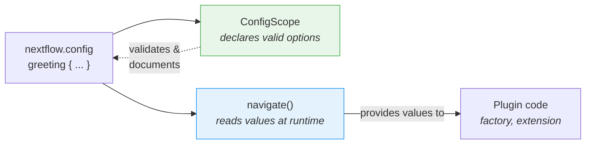

# Part 6: Configuration

Your plugin has custom functions and an observer, but everything is hardcoded.
Users can't turn the task counter off, or change the decorator, without editing the source code and rebuilding.

In Part 1, you used `#!groovy validation {}` and `#!groovy co2footprint {}` blocks in `nextflow.config` to control how nf-schema and nf-co2footprint behaved.
Those config blocks exist because the plugin authors built that capability in.
In this section, you'll do the same for your own plugin.

**Objectives:**

1. Let users customize the greeting decorator's prefix and suffix
2. Let users enable or disable the plugin through `nextflow.config`
3. Register a formal config scope so Nextflow recognizes the `#!groovy greeting {}` block

**What you'll change:**

| File                       | Change                                          |
| -------------------------- | ----------------------------------------------- |
| `GreetingExtension.groovy` | Read prefix/suffix config in `init()`           |
| `GreetingFactory.groovy`   | Read config values to control observer creation |
| `GreetingConfig.groovy`    | New file: formal `@ConfigScope` class           |
| `build.gradle`             | Register the config class as an extension point |
| `nextflow.config`          | Add a `#!groovy greeting {}` block to test it   |

!!! tip "Starting from here?"

    If you're joining at this part, copy the solution from Part 5 to use as your starting point:

    ```bash
    cp -r solutions/5-observers/* .
    ```

!!! info "Official documentation"

    For comprehensive configuration details, see the [Nextflow config scopes documentation](https://nextflow.io/docs/latest/developer/config-scopes.html).

---

## 1. Make the decorator configurable

The `decorateGreeting` function wraps every greeting in `*** ... ***`.
Users might want different markers, but right now the only way to change them is to edit the source code and rebuild.

The Nextflow session provides a method called `session.config.navigate()` that reads nested values from `nextflow.config`:

```groovy
// Read 'greeting.prefix' from nextflow.config, defaulting to '***'
final prefix = session.config.navigate('greeting.prefix', '***') as String
```

This corresponds to a config block in the user's `nextflow.config`:

```groovy title="nextflow.config"
greeting {
    prefix = '>>>'
}
```

### 1.1. Add the configuration reading (this will fail!)

Edit `GreetingExtension.groovy` to read configuration in `init()` and use it in `decorateGreeting()`:

```groovy title="GreetingExtension.groovy" linenums="35" hl_lines="7-8 18"
@CompileStatic
class GreetingExtension extends PluginExtensionPoint {

    @Override
    protected void init(Session session) {
        // Read configuration with defaults
        prefix = session.config.navigate('greeting.prefix', '***') as String
        suffix = session.config.navigate('greeting.suffix', '***') as String
    }

    // ... other methods unchanged ...

    /**
    * Decorate a greeting with celebratory markers
    */
    @Function
    String decorateGreeting(String greeting) {
        return "${prefix} ${greeting} ${suffix}"
    }
```

Try to build:

```bash
cd nf-greeting && make assemble
```

### 1.2. Observe the error

The build fails:

```console
> Task :compileGroovy FAILED
GreetingExtension.groovy: 30: [Static type checking] - The variable [prefix] is undeclared.
 @ line 30, column 9.
           prefix = session.config.navigate('greeting.prefix', '***') as String
           ^

GreetingExtension.groovy: 31: [Static type checking] - The variable [suffix] is undeclared.
```

In Groovy (and Java), you must _declare_ a variable before using it.
The code tries to assign values to `prefix` and `suffix`, but the class has no fields with those names.

### 1.3. Fix by declaring instance variables

Add variable declarations at the top of the class, right after the opening brace:

```groovy title="GreetingExtension.groovy" linenums="35" hl_lines="4-5"
@CompileStatic
class GreetingExtension extends PluginExtensionPoint {

    private String prefix = '***'
    private String suffix = '***'

    @Override
    protected void init(Session session) {
        // Read configuration with defaults
        prefix = session.config.navigate('greeting.prefix', '***') as String
        suffix = session.config.navigate('greeting.suffix', '***') as String
    }

    // ... rest of class unchanged ...
```

These two lines declare **instance variables** (also called fields) that belong to each `GreetingExtension` object.
The `private` keyword means only code inside this class can access them.
Each variable is initialized with a default value of `'***'`.

When the plugin loads, Nextflow calls the `init()` method, which overwrites these defaults with whatever the user has set in `nextflow.config`.
If the user hasn't set anything, `navigate()` returns the same default, so the behavior is unchanged.
The `decorateGreeting()` method then reads these fields each time it runs.

!!! tip "Learning from errors"

    This "declare before use" pattern is fundamental to Java/Groovy but unfamiliar if you come from Python or R where variables spring into existence when you first assign them.
    Experiencing this error once helps you recognize and fix it quickly in the future.

### 1.4. Build and test

Build and install:

```bash
make install && cd ..
```

Update `nextflow.config` to customize the decoration:

=== "After"

    ```groovy title="nextflow.config" hl_lines="7-10"
    // Configuration for plugin development exercises
    plugins {
        id 'nf-schema@2.6.1'
        id 'nf-greeting@0.1.0'
    }

    greeting {
        prefix = '>>>'
        suffix = '<<<'
    }
    ```

=== "Before"

    ```groovy title="nextflow.config"
    // Configuration for plugin development exercises
    plugins {
        id 'nf-schema@2.6.1'
        id 'nf-greeting@0.1.0'
    }
    ```

Run the pipeline:

```bash
nextflow run greet.nf -ansi-log false
```

```console title="Output (partial)"
Decorated: >>> Hello <<<
Decorated: >>> Bonjour <<<
...
```

The decorator now uses the custom prefix and suffix from the config file.

Note that Nextflow prints an "Unrecognized config option" warning because nothing has declared `greeting` as a valid scope yet.
The value still gets read correctly via `navigate()`, but Nextflow flags it as unrecognized.
You will fix this in Section 3.

---

## 2. Make the task counter configurable

The observer factory currently creates observers unconditionally.
Users should be able to disable the plugin entirely through configuration.

The factory has access to the Nextflow session and its configuration, so it is the right place to read the `enabled` setting and decide whether to create observers.

=== "After"

    ```groovy title="GreetingFactory.groovy" linenums="31" hl_lines="3-4"
    @Override
    Collection<TraceObserver> create(Session session) {
        final enabled = session.config.navigate('greeting.enabled', true)
        if (!enabled) return []

        return [
            new GreetingObserver(),
            new TaskCounterObserver()
        ]
    }
    ```

=== "Before"

    ```groovy title="GreetingFactory.groovy" linenums="31"
    @Override
    Collection<TraceObserver> create(Session session) {
        return [
            new GreetingObserver(),
            new TaskCounterObserver()
        ]
    }
    ```

The factory now reads `greeting.enabled` from the config and returns an empty list if the user has set it to `false`.
When the list is empty, no observers are created, so the plugin's lifecycle hooks are silently skipped.

### 2.1. Build and test

Rebuild and install the plugin:

```bash
cd nf-greeting && make install && cd ..
```

Run the pipeline to confirm everything still works:

```bash
nextflow run greet.nf -ansi-log false
```

??? exercise "Disable the plugin entirely"

    Try setting `greeting.enabled = false` in `nextflow.config` and run the pipeline again.
    What changes in the output?

    ??? solution

        ```groovy title="nextflow.config" hl_lines="8"
        // Configuration for plugin development exercises
        plugins {
            id 'nf-schema@2.6.1'
            id 'nf-greeting@0.1.0'
        }

        greeting {
            enabled = false
        }
        ```

        The "Pipeline is starting!", "Pipeline complete!", and task count messages all disappear because the factory returns an empty list when `enabled` is false.
        The pipeline itself still runs, but no observers are active.

        Remember to set `enabled` back to `true` (or remove the line) before continuing.

---

## 3. Formal configuration with ConfigScope

Your plugin configuration works, but Nextflow still prints "Unrecognized config option" warnings.
That is because `session.config.navigate()` only reads values; nothing has told Nextflow that `greeting` is a valid config scope.

A `ConfigScope` class fills that gap.
It declares what options your plugin accepts, their types, and their defaults.
It does **not** replace your `navigate()` calls. Instead, it works alongside them:



Without a `ConfigScope` class, `navigate()` still works, but:

- Nextflow warns about unrecognized options (as you've seen)
- No IDE autocompletion for users writing `nextflow.config`
- Configuration options aren't self-documenting
- Type conversion is manual (`as String`, `as boolean`)

Registering a formal config scope class fixes the warning and addresses all three issues.
This is the same mechanism behind the `#!groovy validation {}` and `#!groovy co2footprint {}` blocks you used in Part 1.

### 3.1. Create the config class

Create a new file:

```bash
touch nf-greeting/src/main/groovy/training/plugin/GreetingConfig.groovy
```

Add the config class with all three options:

```groovy title="GreetingConfig.groovy" linenums="1"
package training.plugin

import nextflow.config.spec.ConfigOption
import nextflow.config.spec.ConfigScope
import nextflow.config.spec.ScopeName
import nextflow.script.dsl.Description

/**
 * Configuration options for the nf-greeting plugin.
 *
 * Users configure these in nextflow.config:
 *
 *     greeting {
 *         enabled = true
 *         prefix = '>>>'
 *         suffix = '<<<'
 *     }
 */
@ScopeName('greeting')                       // (1)!
class GreetingConfig implements ConfigScope { // (2)!

    GreetingConfig() {}

    GreetingConfig(Map opts) {               // (3)!
        this.enabled = opts.enabled as Boolean ?: true
        this.prefix = opts.prefix as String ?: '***'
        this.suffix = opts.suffix as String ?: '***'
    }

    @ConfigOption                            // (4)!
    @Description('Enable or disable the plugin entirely')
    boolean enabled = true

    @ConfigOption
    @Description('Prefix for decorated greetings')
    String prefix = '***'

    @ConfigOption
    @Description('Suffix for decorated greetings')
    String suffix = '***'
}
```

1. Maps to the `#!groovy greeting { }` block in `nextflow.config`
2. Required interface for config classes
3. Both no-arg and Map constructors are needed for Nextflow to instantiate the config
4. `@ConfigOption` marks a field as a configuration option; `@Description` documents it for tooling

Key points:

- **`@ScopeName('greeting')`**: Maps to the `greeting { }` block in config
- **`implements ConfigScope`**: Required interface for config classes
- **`@ConfigOption`**: Each field becomes a configuration option
- **`@Description`**: Documents each option for language server support (imported from `nextflow.script.dsl`)
- **Constructors**: Both no-arg and Map constructors are needed

### 3.2. Register the config class

Creating the class is not enough on its own.
Nextflow needs to know it exists, so you register it in `build.gradle` alongside the other extension points.

=== "After"

    ```groovy title="build.gradle" hl_lines="4"
    extensionPoints = [
        'training.plugin.GreetingExtension',
        'training.plugin.GreetingFactory',
        'training.plugin.GreetingConfig'
    ]
    ```

=== "Before"

    ```groovy title="build.gradle"
    extensionPoints = [
        'training.plugin.GreetingExtension',
        'training.plugin.GreetingFactory'
    ]
    ```

Note the difference between the factory and extension points registration:

- **`extensionPoints` in `build.gradle`**: Compile-time registration. Tells the Nextflow plugin system which classes implement extension points.
- **Factory `create()` method**: Runtime registration. The factory creates observer instances when a workflow actually starts.

### 3.3. Build and test

```bash
cd nf-greeting && make install && cd ..
nextflow run greet.nf -ansi-log false
```

The pipeline behavior is identical, but the "Unrecognized config option" warning is gone.

!!! note "What changed and what didn't"

    Your `GreetingFactory` and `GreetingExtension` still use `session.config.navigate()` to read values at runtime.
    None of that code changed.
    The `ConfigScope` class is a parallel declaration that tells Nextflow what options exist.
    Both pieces are needed: `ConfigScope` declares, `navigate()` reads.

Your plugin now has the same structure as the plugins you used in Part 1.
When nf-schema exposes a `#!groovy validation {}` block or nf-co2footprint exposes a `#!groovy co2footprint {}` block, they use exactly this pattern: a `ConfigScope` class with annotated fields, registered as an extension point.
Your `#!groovy greeting {}` block works the same way.

---

## Takeaway

You learned that:

- `session.config.navigate()` **reads** config values at runtime
- `@ConfigScope` classes **declare** what config options exist; they work alongside `navigate()`, not instead of it
- Configuration can be applied to both observers and extension functions
- Instance variables must be declared before use in Groovy/Java; `init()` populates them from config when the plugin loads

| Use case                            | Recommended approach                                        |
| ----------------------------------- | ----------------------------------------------------------- |
| Quick prototype or simple plugin    | `session.config.navigate()` only                            |
| Production plugin with many options | Add a `ConfigScope` class alongside your `navigate()` calls |
| Plugin you'll share publicly        | Add a `ConfigScope` class alongside your `navigate()` calls |

---

## What's next?

Your plugin now has all the pieces of a production plugin: custom functions, trace observers, and user-facing configuration.
The final step is packaging it for distribution.

[Continue to Summary :material-arrow-right:](summary.md){ .md-button .md-button--primary }
