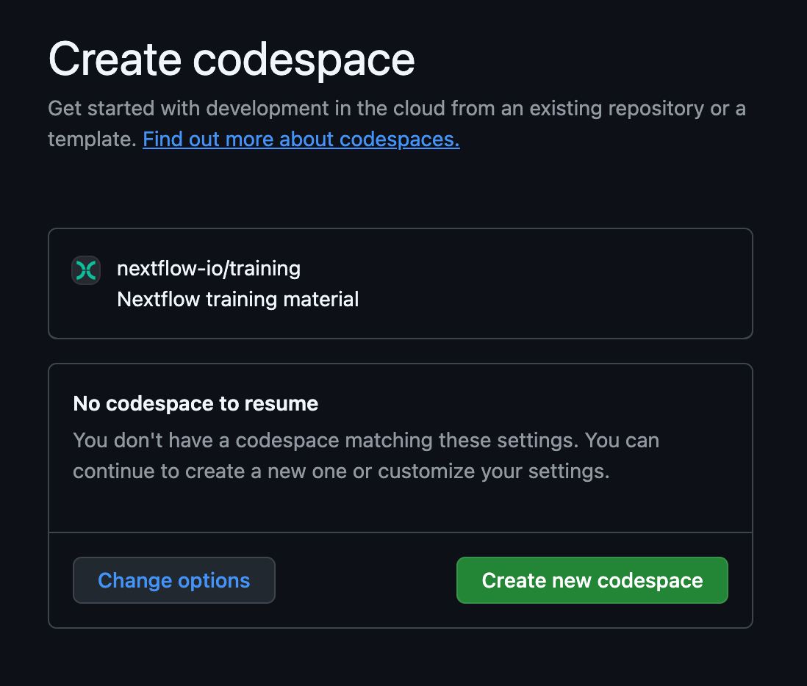
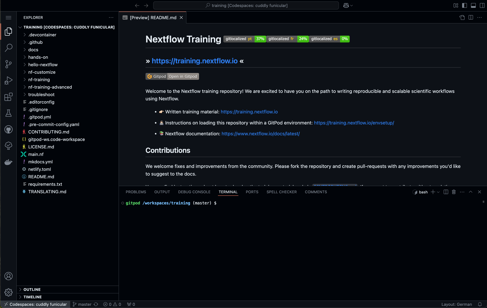
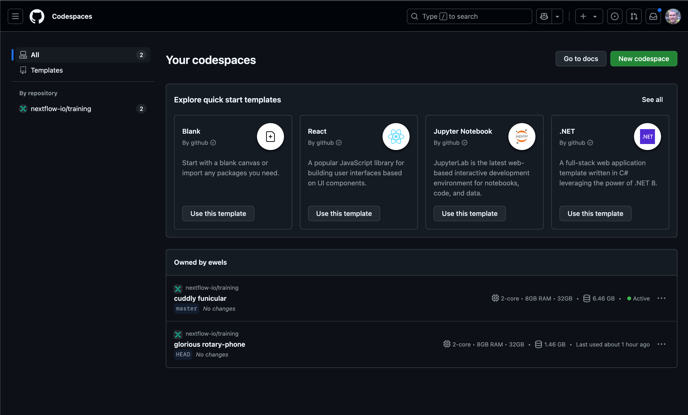
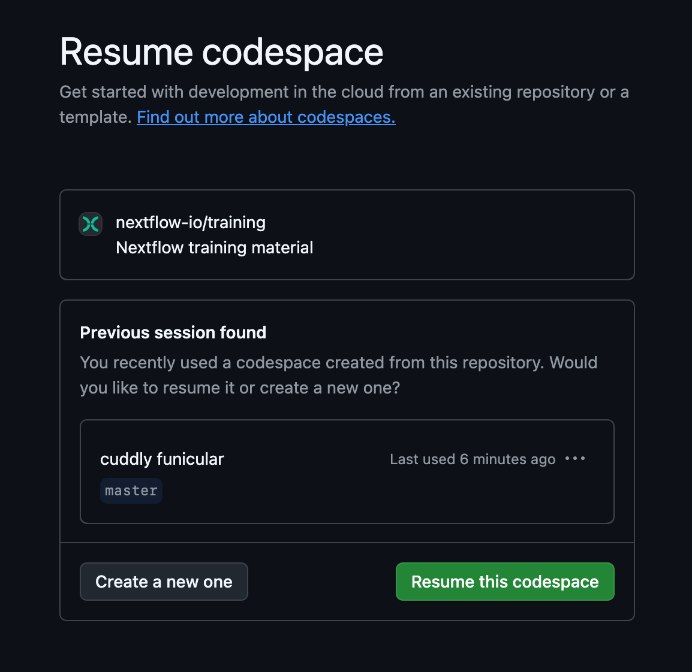

# GitHub Codespaces

GitHub Codespaces는 팀이 효율적이고 안전하게 소프트웨어를 개발할 수 있도록 도와주는 클라우드 개발 환경입니다.
학습자에게 일관되고 철저히 검증된 환경을 제공할 수 있기 때문에, 저희는 이를 교육용 환경으로 사용하고 있습니다.

## GitHub 계정 만들기

[GitHub 홈페이지](https://github.com/)에서 무료 GitHub 계정을 만들 수 있습니다.

## GitHub Codespaces 실행하기

GitHub에 로그인한 후, 아래 링크를 브라우저에서 열면 교육용 환경이 실행됩니다: <https://codespaces.new/nextflow-io/training?quickstart=1&ref=master>

또한, 교육 포털 내 여러 페이지에 표시된 아래 버튼을 통해서도 접근할 수 있습니다.

링크를 열면 새로운 GitHub Codespace를 생성할 수 있는 화면이 표시됩니다:

"Change options" 버튼을 클릭하면 사용할 머신의 사양을 설정할 수 있습니다.
코어 수가 더 많은 머신을 사용하면 Nextflow의 워크플로우 병렬 처리 기능을 더 효과적으로 활용할 수 있습니다.

**Hello Nextflow, Nextflow for Science, nf-core 교육 과정의 경우 4코어 머신 사용을 권장합니다.**

GitHub의 무료 플랜은 매월 120코어-시간의 Codespaces 사용량을 제공하며, 이는 4코어 머신 기준 약 30시간에 해당합니다.
(자세한 사용량 정보는 아래 참고)

!!! warning

    GitHub Codespaces 환경을 처음 열 때는 몇 분 정도 시간이 걸릴 수 있습니다.
    그동안 차 한 잔을 준비하거나 이메일을 확인해 보세요. 그룹 교육 중이라면 간단히 소개 자료를 살펴보는 것도 괜찮겠죠.

## GitHub Codespaces IDE 탐색하기

GitHub Codespaces가 로딩되면, 다음과 유사한 화면이 나타납니다 (계정 설정에 따라 밝은 테마일 수 있습니다):

이것은 VSCode IDE의 인터페이스이며, Nextflow 개발에 적합한 인기 있는 코드 편집기입니다.

- **사이드바(Sidebar)** 환경을 커스터마이즈하거나 파일 열기, 검색, Git 작업 등을 할 수 있습니다. 탐색기 아이콘을 클릭하면 현재 저장소에 포함된 파일들을 볼 수 있습니다.
- **터미널(Terminal)** 저장소 내 설치된 프로그램을 실행할 수 있습니다. 예: `nextflow`, `docker`.
- **파일 탐색기(File Explorer)** 파일을 열고 편집할 수 있습니다. 클릭 시 메인 편집기에 열립니다.
- **메인 편집기(Main Editor)** 예시로 `README.md` 파일이 미리 열려 있으며, 코드나 데이터 파일을 열면 이곳에 표시됩니다.

## GitHub Codespaces 세션 다시 열기

한 번 생성한 환경은 쉽게 재개하거나 다시 시작할 수 있으며, 마지막 상태부터 이어서 작업할 수 있습니다.
30분 이상 아무 활동이 없으면 환경이 자동 종료되며, 변경 내용은 최대 2주 동안 저장됩니다.

<https://github.com/codespaces/> 에서 이전 세션을 확인하고 재개할 수 있습니다.
리스트에서 원하는 세션을 클릭하면 다시 열립니다.

이전 세션의 URL을 저장해 두었다면, 브라우저에서 다시 열 수 있습니다.
혹은 처음 생성할 때 클릭했던 버튼을 다시 클릭해도 됩니다:

이전 세션이 있다면 기본적으로 이어서 열도록 설정되어 있습니다:

## GitHub Codespaces에서 파일을 로컬로 저장하기

파일 탐색기에서 원하는 파일을 마우스 오른쪽 클릭한 뒤 `Download`를 선택하면 로컬로 저장할 수 있습니다.

## GitHub Codespaces 사용량

GitHub Codespaces는 매월 최대 15GB 저장 공간과 120 코어-시간을 제공합니다.
이는 기본 환경 기준으로 약 60시간 정도 사용할 수 있는 분량입니다 (2코어, 8GB RAM, 32GB 저장소 기준).

GitHub Codespaces 환경은 사용자의 필요에 따라 구성할 수 있습니다.
더 높은 사양으로 환경을 생성할 수도 있지만, 이 경우 무료 사용량이 더 빨리 소모되어 사용할 수 있는 시간이 줄어들 수 있습니다.
추가 리소스가 필요한 경우, 유료로 구매하여 사용할 수도 있습니다.

자세한 내용은 GitHub 공식 문서를 참고하세요:
[GitHub Codespaces 요금제 관련 문서](https://docs.github.com/en/billing/managing-billing-for-your-products/managing-billing-for-github-codespaces/about-billing-for-github-codespaces)
