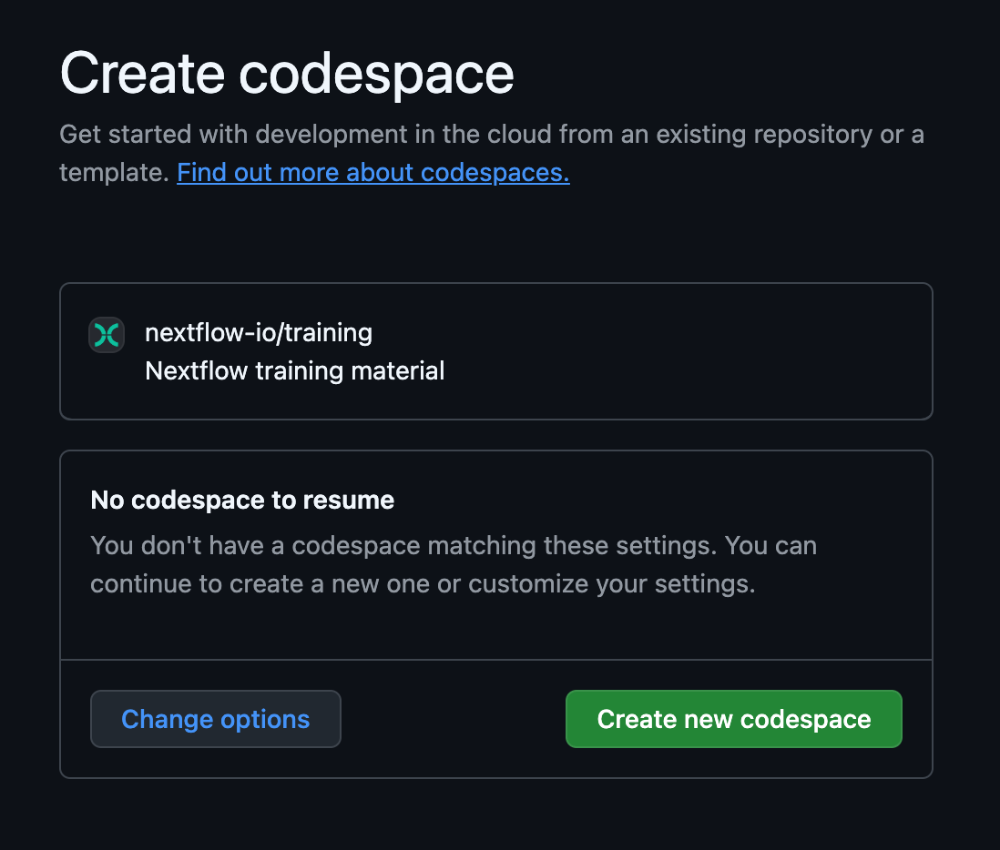

# GitHub Codespaces

GitHub Codespaces is a web-based platform that allows us to provide a pre-configured environment for training, backed by virtual machines in the cloud.
The platform is operated by Github (which is owned by Microsoft), and is accessible for free (with usage quotas) to anyone with a Github account.

!!! warning

    Accounts attached to organizations may be subject to certain additional restrictions.
    If that is your case, you may need to use an independent personal account, or use a local installation instead.

## Creating a GitHub account

You can create a free GitHub account from the [GitHub home page](https://github.com/).

## Launching your GitHub Codespace

Once you are logged in to GitHub, open this link in your browser to open the Nextflow training environment: <https://codespaces.new/nextflow-io/training?quickstart=1&ref=master>

Alternatively, you can click on the button shown below, which is repeated in each training course (typically on the Orientation page).

You should be presented with a page where you can create a new GitHub Codespace:

### Configuration

For general use, you should not need to configure anything.
Unless otherwise specified in the course you are starting, you can simply click the main button to continue.

However, it is possible to customize the environment by clicking the "Change options" button.

??? info "Configuration options"

    If you click the "Change options" button, you'll be given the option to customize the following:

    #### Branch

    This allows you to select a different version of the training materials.
    The `master` branch generally contains bug fixes and materials that have been recently developed and approved but have not yet been released on the website.
    Other branches contain work in progress that may not be fully functional.

    #### Machine type

    This allows you to customize the virtual machine you will use to work through the training.

    Using a machine with more cores allows you to take greater advantage of Nextflow's ability to parallelize workflow execution.
    However, it will consume your free quota allocation faster, so we do not recommend changing this setting unless it is advised in the instructions for the course you are planning to take.

    See 'GitHub Codespaces quotas' below for more details about quotas.

### Startup time

Opening a new GitHub Codespaces environment for the first time can take several minutes, because the system has to set up your virtual machine, so don't worry there is a wait time.
However, it should not take more than five minutes.

## Navigating the training interface

Once your GitHub Codespaces has loaded, you should see something similar to the following (which may open in light mode depending on your account preferences):

This is the interface of the VSCode IDE, a popular code development application that we recommend using for Nextflow development.

- **The main editor** is where Nextflow code and other text files will open. This is where you will edit code. When you open the codespace, this will show you a preview of the `README.md` file.
- **The terminal** below the main editor allows you to run commands. This is where you will run all command lines given in the course instructions.
- **The sidebar** allows you to customize your environment and perform basic tasks (copy, paste, open files, search, git, etc.). By default it is open to the file explorer, which allows you to browse the contents of the repository. Clicking on a file in the explorer will open it within the main editor window.

You can adjust the relative proportions of the window panes as you like.

<!-- TODO (future) Link to development best practices side quest? -->

## Other notes about using GitHub Codespaces

### Resuming a session

Once you have created an environment, you can easily resume or restart it and continue from where you left off.
Your environment will time out after 30 minutes of inactivity and will save your changes for up to 2 weeks.

You can reopen an environment from <https://github.com/codespaces/>.
Previous environments will be listed.
Click a session to resume it.

If you have saved the URL for your previous GitHub Codespaces environment, you can simply open it in your browser.
Alternatively, click the same button that you used to create it in the first place:

You should see the previous session, the default option is to resume it:

### Saving files to your local machine

To save any file from the explorer panel, right-click the file and select `Download`.

### Managing GitHub Codespaces quotas

GitHub Codespaces gives you up to 15 GB-month storage per month, and 120 core-hours per month.
This is equivalent to around 60 hours of the default environment runtime using the standard workspace (2 cores, 8 GB RAM, and 32 GB storage).

You can create them with more resources (see explanation above), but this will consume your free usage faster and you will have fewer hours of access to this space.
For example, if you select a 4-core machine instead of the 2-core default, your quota will run out in half the time.

Optionally, you can purchase access to more resources.

For more information, see the GitHub documentation:
[About billing for GitHub Codespaces](https://docs.github.com/en/billing/managing-billing-for-your-products/managing-billing-for-github-codespaces/about-billing-for-github-codespaces)
