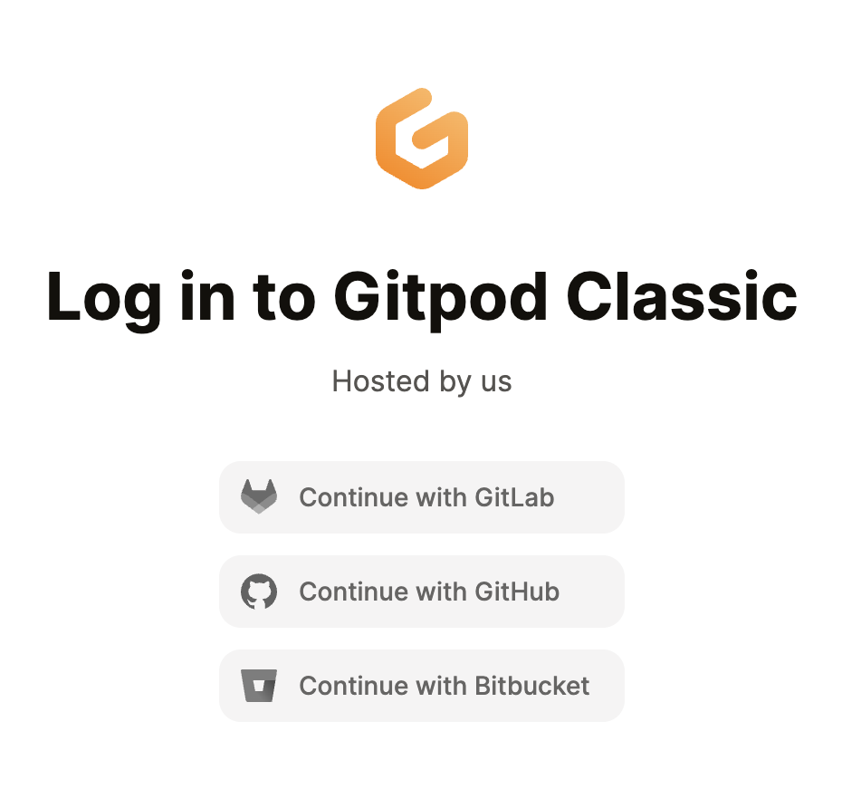
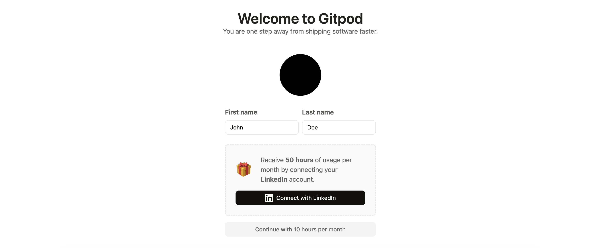
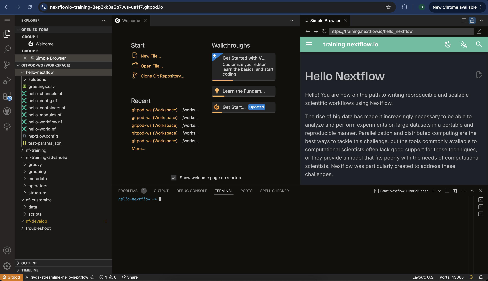

# Gitpod

Gitpod é um ambiente de desenvolvimento em nuvem feito para equipes desenvolverem software de forma segura e eficiente. Ele pode aprimorar sua experiência de desenvolvedor ao possibilitar que programe em um ambiente de desenvolvimento em nuvem.

## Criando uma conta no Gitpod

Você pode criar uma conta gratuita no [Gitpod](https://gitpod.io/) usando sua conta pré-existente no GitLab, GitHub ou Bitbucket.

Você pode criar uma conta usando a [página de login do Gitpod](https://gitpod.io/login/).

Recomendamos que conecte sua conta do LinkedIn para receber um tempo adicional de uso de 50 horas.

Depois de selecionar seu editor e tema preferidos e conferir os detalhes do seu perfil, clique em continuar e sua conta será criada e já estará pronta para uso.

!!! note

    Recomendamos que utilize o editor de texto VS Code.

## Executando o Gitpod

Clique na URL a seguir para executar o Gitpod: <https://gitpod.io/#https://github.com/nextflow-io/training>

Essa URL é o repositório de treinamento do Nextflow prefixado com `https://gitpod.io/#`.

Você também pode acessar o material clicando no botão abaixo.

Se você já estiver logado, seu ambiente no Gitpod começará a carregar.

### Explore sua IDE no Gitpod

Após o carregamento concluir, você poderá ver algo semelhante a isso:

- **A barra lateral** permite que você customize seu ambiente Gitpod e realize tarefas básicas (copiar, colar, abrir arquivos, buscar, git, etc.). Você pode clicar no explorador para ver que arquivos estão presentes em seu repositório.
- **O terminal** permite que você execute todos os programas no repositório. Por exemplo, `nextflow` e `docker` estão instalados e podem ser executados.
- **O explorador de arquivos** permite que você visualize e edite arquivos. Clicar em um arquivo no explorador irá abri-lo na janela principal.
- **O navegador** permite que você visualize o material de treinamento (<https://training.nextflow.io/>). Caso o feche acidentalmente, você pode iniciar o navegador novamente executando o seguinte comando no terminal: `gp preview https://training.nextflow.io`.

### Recursos do Gitpod

O Gitpod fornece 500 créditos gratuitos por mês, o que é equivalente a 50 horas de uso gratuito do ambiente de execução usando a área de trabalho padrão (até 4 núcleos, 8 GB de RAM e 30 GB de armazenamento).

Também há a opção de uma área de trabalho maior, que fornece até 8 núcleos, 16 GB de RAM e 50 GB de armazenamento. No entanto, essa área de trabalho maior irá utilizar seus recursos mais rapidamente e você terá menos horas de acesso a ela.

O ambiente Gitpod irá pausar após 30 minutos de inatividade e salvará suas mudanças por até 2 semanas.

Mais informação sobre o Gitpod está disponível em [gitpod.io](https://www.gitpod.io).

### Reiniciando uma sessão no Gitpod

Você pode reiniciar um ambiente na página <https://gitpod.io/workspaces>. Ambientes anteriores serão listados nessa página. Basta selecionar a elipse (os três pontos) e então eselcionar `Open` para reiniciar um ambiente anterior.

Se você salvou a URL de um ambiente anterior do Gitpod, para reiniciá-lo basta abrir a URL em seu navegador.

Você também pode apenas iniciar um novo ambiente de treinamento na URL a seguir: <https://gitpod.io/#https://github.com/nextflow-io/training>

### Salvando arquivos do Gitpod na sua máquina local

Para salvar qualquer arquivo do painel do explorador, clique no arquivo com o botão direito do mouse e selcione `Download`.
