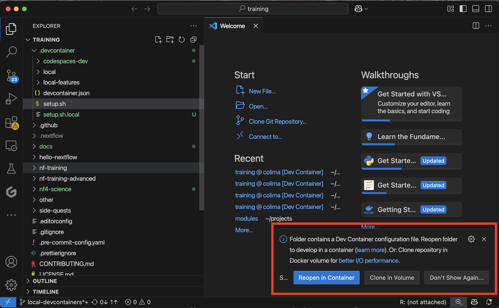
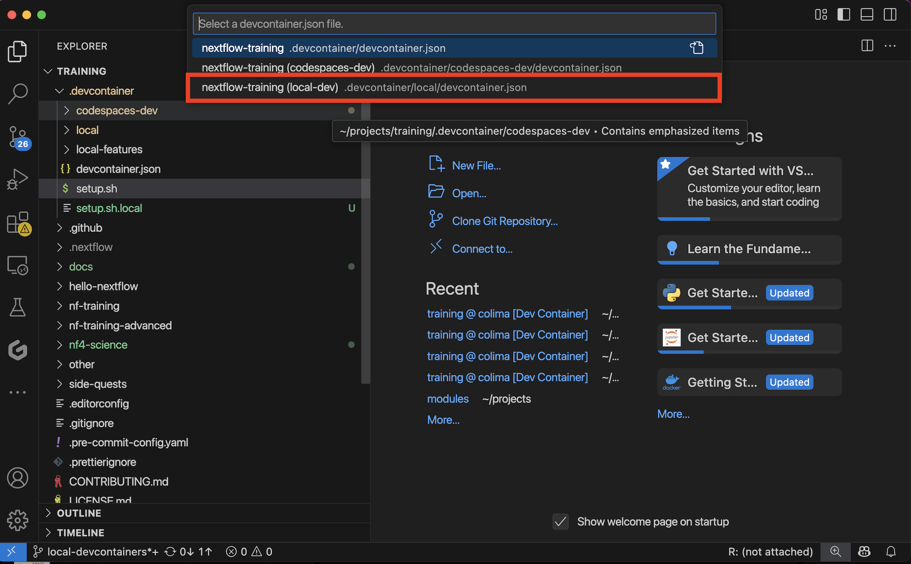
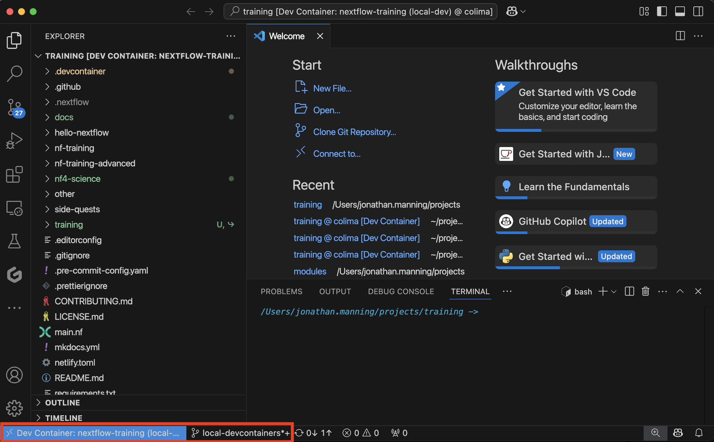

# Local installation using VSCode Devcontainers extension

If you have a local Docker installation or are happy to install one, the easiest way to work locally with these materials is to use Visual Studio Code's devcontainer feature. This approach provides all the necessary tools and dependencies without requiring manual installation.

## Requirements

To use the devcontainer setup, you'll need:

- [Visual Studio Code](https://code.visualstudio.com/)
- A local Docker installation, for example:
  - [Docker Desktop](https://docs.docker.com/get-docker/) (for Windows/macOS)
  - [Docker Engine](https://docs.docker.com/engine/install/) (for Linux)
  - [Colima](https://github.com/abiosoft/colima) (alternative for macOS)
- [Docker Buildx](https://docs.docker.com/build/concepts/overview/#install-buildx) (included in Docker Desktop, but may need separate installation with other Docker setups)
- [Dev Containers extension](https://marketplace.visualstudio.com/items?itemName=ms-vscode-remote.remote-containers) for VS Code

Your Docker installation must be running before you attempt to open the devcontainer.

To verify that Docker buildx is available, run:

```bash
docker buildx version
```

If this command fails, you'll need to install the buildx extension before proceeding.

## Setup Instructions

Follow these steps to set up your local environment using VS Code devcontainers:

### Install the "Dev Containers" extension in VS Code

- Open VS Code
- Go to Extensions (Ctrl+Shift+X or Cmd+Shift+X on macOS)
- Search for "Dev Containers"
- Click "Install"


### Clone the repository:

```bash
git clone https://github.com/nextflow-io/training.git
cd training
```

### Open the repository in VS Code:

- Launch VS Code
- Select **File -> Open Folder** from the menu
- Navigate to and select the training repository folder you just cloned
- Click **Open**

### Reopen in Container

If prompted by VS Code to "Reopen in Container", click on it. Alternatively:

- Press F1 (or Ctrl+Shift+P / Cmd+Shift+P on macOS)
- Type "Dev Containers: Reopen in Container"
- **Important**: When prompted to select a configuration, choose the **local-dev** devcontainer configuration





Wait for the container to build. This may take a few minutes the first time as it downloads and sets up all the necessary components.

Once the container is built and running, you'll have a fully configured environment with all the necessary tools installed, including:

- Java
- Nextflow
- Docker
- Git
- And all other dependencies required for the training



## Benefits of Using Devcontainers

Using the devcontainer approach offers several advantages:

- **Consistency**: Ensures a consistent development environment across different machines
- **Simplicity**: All dependencies are pre-installed and configured
- **Isolation**: The development environment is isolated from your local system
- **Reproducibility**: Everyone using the devcontainer gets the same setup
- **No manual installation**: No need to manually install Java, Nextflow, and other tools

## Checking Your Environment

Once your devcontainer is running, you can verify that everything is set up correctly by running:

```bash
nextflow info
```

This should display the Nextflow version and runtime information, confirming that your environment is properly configured.

## Troubleshooting

If you encounter issues with the devcontainer setup:

1. Ensure your Docker installation (Docker Desktop, Colima, Docker Engine, etc.) is running before opening the devcontainer
2. Check that you've selected the **local-dev** configuration when prompted
3. Verify that Docker buildx is installed and working by running `docker buildx version`
4. If the container fails to build, try rebuilding it by running the "Dev Containers: Rebuild Container" command
5. For persistent issues, refer to the [VS Code Dev Containers troubleshooting guide](https://code.visualstudio.com/docs/devcontainers/troubleshooting)
