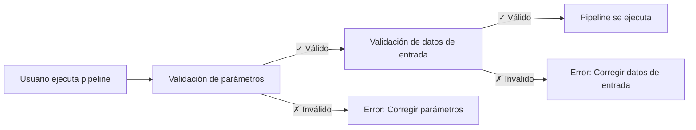

# Parte 5: Validación de entradas

<span class="ai-translation-notice">:material-information-outline:{ .ai-translation-notice-icon } Traducción asistida por IA - [más información y sugerencias](https://github.com/nextflow-io/training/blob/master/TRANSLATING.md)</span>

En esta quinta parte del curso de entrenamiento Hello nf-core, le mostramos cómo usar el plugin nf-schema para validar las entradas y parámetros del pipeline.

??? info "Cómo comenzar desde esta sección"

    Esta sección asume que ha completado la [Parte 4: Crear un módulo nf-core](./04_make_module.md) y ha actualizado el módulo de proceso `COWPY` a los estándares nf-core en su pipeline.

    Si no completó la Parte 4 o desea comenzar desde cero para esta parte, puede usar la solución `core-hello-part4` como punto de partida.
    Ejecute estos comandos desde dentro del directorio `hello-nf-core/`:

    ```bash
    cp -r solutions/core-hello-part4 core-hello
    cd core-hello
    ```

    Esto le proporciona un pipeline con el módulo `COWPY` ya actualizado para seguir los estándares nf-core.
    Puede probar que se ejecuta correctamente ejecutando el siguiente comando:

    ```bash
    nextflow run . --outdir core-hello-results -profile test,docker --validate_params false
    ```

---

## 0. Calentamiento: Un poco de contexto

### 0.1. Por qué es importante la validación

Imagine ejecutar su pipeline durante dos horas, solo para que falle porque un usuario proporcionó un archivo con la extensión incorrecta. O pasar horas depurando errores crípticos, solo para descubrir que un parámetro estaba mal escrito. Sin validación de entradas, estos escenarios son comunes.

Considere este ejemplo:

```console title="Sin validación"
$ nextflow run my-pipeline --input data.txt --output results

...2 horas después...

ERROR ~ No such file: 'data.fq.gz'
  Expected FASTQ format but received TXT
```

El pipeline aceptó entradas inválidas y se ejecutó durante horas antes de fallar. Con validación adecuada:

```console title="Con validación"
$ nextflow run my-pipeline --input data.txt --output results

ERROR ~ Validation of pipeline parameters failed!

 * --input (data.txt): File extension '.txt' does not match required pattern '.fq.gz' or '.fastq.gz'
 * --output: required parameter is missing (expected: --outdir)

Pipeline failed before execution - please fix the errors above
```

El pipeline falla inmediatamente con mensajes de error claros y procesables. Esto ahorra tiempo, recursos computacionales y frustraciones.

### 0.2. El plugin nf-schema

El [plugin nf-schema](https://nextflow-io.github.io/nf-schema/latest/) es un plugin de Nextflow que proporciona capacidades de validación completas para pipelines de Nextflow.
Aunque nf-schema funciona con cualquier workflow de Nextflow, es la solución de validación estándar para todos los pipelines nf-core.

nf-schema proporciona varias funciones clave:

- **Validación de parámetros**: Valida los parámetros del pipeline contra `nextflow_schema.json`
- **Validación de hojas de muestras**: Valida archivos de entrada contra `assets/schema_input.json`
- **Conversión de canales**: Convierte hojas de muestras validadas a canales de Nextflow
- **Generación de texto de ayuda**: Genera automáticamente la salida de `--help` a partir de las definiciones del schema
- **Resumen de parámetros**: Muestra qué parámetros difieren de los valores predeterminados

nf-schema es el sucesor del plugin nf-validation obsoleto y utiliza el estándar [JSON Schema Draft 2020-12](https://json-schema.org/) para la validación.

??? info "¿Qué son los plugins de Nextflow?"

    Los plugins son extensiones que agregan nueva funcionalidad al lenguaje Nextflow mismo. Se instalan mediante un bloque `plugins{}` en `nextflow.config` y pueden proporcionar:

    - Nuevas funciones y clases que se pueden importar (como `samplesheetToList`)
    - Nuevas características DSL y operadores
    - Integración con servicios externos

    El plugin nf-schema se especifica en `nextflow.config`:

    ```groovy
    plugins {
        id 'nf-schema@2.1.1'
    }
    ```

    Una vez instalado, puede importar funciones de plugins usando la sintaxis `include { functionName } from 'plugin/plugin-name'`.

### 0.3. Dos archivos de schema para dos tipos de validación

Un pipeline nf-core utilizará dos archivos de schema separados, que corresponden a dos tipos de validación:

| Archivo de Schema          | Propósito                      | Valida                                                       |
| -------------------------- | ------------------------------ | ------------------------------------------------------------ |
| `nextflow_schema.json`     | Validación de parámetros       | Flags de línea de comandos: `--input`, `--outdir`, `--batch` |
| `assets/schema_input.json` | Validación de datos de entrada | Contenido de hojas de muestras y archivos de entrada         |

Ambos schemas usan el formato JSON Schema, un estándar ampliamente adoptado para describir y validar estructuras de datos.

**La validación de parámetros** valida parámetros de línea de comandos (flags como `--outdir`, `--batch`, `--input`):

- Verifica tipos de parámetros, rangos y formatos
- Asegura que se proporcionen los parámetros requeridos
- Valida que las rutas de archivos existan
- Definida en `nextflow_schema.json`

**La validación de datos de entrada** valida la estructura de hojas de muestras y archivos de manifiesto (archivos CSV/TSV que describen sus datos):

- Verifica la estructura de columnas y tipos de datos
- Valida que las rutas de archivos referenciadas en la hoja de muestras existan
- Asegura que los campos requeridos estén presentes
- Definida en `assets/schema_input.json`

!!! warning "Lo que la validación de datos de entrada NO hace"

    La validación de datos de entrada verifica la estructura de *archivos de manifiesto* (hojas de muestras, archivos CSV), NO el contenido de sus archivos de datos reales (FASTQ, BAM, VCF, etc.).

    Para datos a gran escala, validar el contenido de los archivos (como verificar la integridad de BAM) debe ocurrir en los procesos del pipeline que se ejecutan en nodos de trabajo, no durante la etapa de validación en la máquina de orquestación.

### 0.4. ¿Cuándo debe ocurrir la validación?



La validación debe ocurrir **antes** de que se ejecuten los procesos del pipeline, para proporcionar retroalimentación rápida y prevenir el desperdicio de tiempo de cómputo.

Ahora apliquemos estos principios en la práctica, comenzando con la validación de parámetros.

---

## 1. Validación de parámetros (nextflow_schema.json)

Comencemos agregando validación de parámetros a nuestro pipeline. Esto valida flags de línea de comandos como `--input`, `--outdir` y `--batch`.

### 1.1. Configurar la validación para omitir la validación de archivos de entrada

La plantilla de pipeline nf-core viene con nf-schema ya instalado y configurado:

- El plugin nf-schema se instala mediante el bloque `plugins{}` en `nextflow.config`
- La validación de parámetros está habilitada por defecto mediante `params.validate_params = true`
- La validación se realiza mediante el subworkflow `UTILS_NFSCHEMA_PLUGIN` durante la inicialización del pipeline

El comportamiento de validación se controla a través del alcance `validation{}` en `nextflow.config`.

Dado que trabajaremos primero en la validación de parámetros (esta sección) y no configuraremos el schema de datos de entrada hasta la sección 2, necesitamos decirle temporalmente a nf-schema que omita la validación del contenido del archivo del parámetro `input`.

Abra `nextflow.config` y encuentre el bloque `validation` (alrededor de la línea 246). Agregue `ignoreParams` para omitir la validación del archivo de entrada:

=== "Después"

    ```groovy title="nextflow.config" hl_lines="3" linenums="246"
    validation {
        defaultIgnoreParams = ["genomes"]
        ignoreParams = ['input']
        monochromeLogs = params.monochrome_logs
    }
    ```

=== "Antes"

    ```groovy title="nextflow.config" linenums="246"
    validation {
        defaultIgnoreParams = ["genomes"]
        monochromeLogs = params.monochrome_logs
    }
    ```

Esta configuración le dice a nf-schema que:

- **`defaultIgnoreParams`**: Omita la validación de parámetros complejos como `genomes` (establecido por los desarrolladores de la plantilla)
- **`ignoreParams`**: Omita la validación del contenido del archivo del parámetro `input` (temporal; volveremos a habilitar esto en la sección 2)
- **`monochromeLogs`**: Deshabilite la salida coloreada en mensajes de validación cuando esté establecido en `true` (controlado por `params.monochrome_logs`)

!!! note "¿Por qué ignorar el parámetro input?"

    El parámetro `input` en `nextflow_schema.json` tiene `"schema": "assets/schema_input.json"` que le dice a nf-schema que valide el *contenido* del archivo CSV de entrada contra ese schema.
    Dado que aún no hemos configurado ese schema, omitimos temporalmente esta validación.
    Eliminaremos esta configuración en la sección 2 después de configurar el schema de datos de entrada.

### 1.2. Examinar el schema de parámetros

Veamos una sección del archivo `nextflow_schema.json` que vino con nuestra plantilla de pipeline:

```bash
grep -A 25 '"input_output_options"' nextflow_schema.json
```

El schema de parámetros está organizado en grupos. Aquí está el grupo `input_output_options`:

```json title="core-hello/nextflow_schema.json (extracto)" linenums="8"
        "input_output_options": {
            "title": "Input/output options",
            "type": "object",
            "fa_icon": "fas fa-terminal",
            "description": "Define where the pipeline should find input data and save output data.",
            "required": ["input", "outdir"],
            "properties": {
                "input": {
                    "type": "string",
                    "format": "file-path",
                    "exists": true,
                    "schema": "assets/schema_input.json",
                    "mimetype": "text/csv",
                    "pattern": "^\\S+\\.csv$",
                    "description": "Path to comma-separated file containing information about the samples in the experiment.",
                    "help_text": "You will need to create a design file with information about the samples in your experiment before running the pipeline. Use this parameter to specify its location. It has to be a comma-separated file with 3 columns, and a header row.",
                    "fa_icon": "fas fa-file-csv"
                },
                "outdir": {
                    "type": "string",
                    "format": "directory-path",
                    "description": "The output directory where the results will be saved. You have to use absolute paths to storage on Cloud infrastructure.",
                    "fa_icon": "fas fa-folder-open"
                }
            }
        },
```

Cada entrada descrita aquí tiene las siguientes propiedades clave que pueden ser validadas:

- **`type`**: Tipo de datos (string, integer, boolean, number)
- **`format`**: Formatos especiales como `file-path` o `directory-path`
- **`exists`**: Para rutas de archivos, verificar si el archivo existe
- **`pattern`**: Expresión regular que el valor debe coincidir
- **`required`**: Array de nombres de parámetros que deben proporcionarse
- **`mimetype`**: Mimetype de archivo esperado para validación

Si tiene buen ojo, podría notar que el parámetro de entrada `batch` que hemos estado usando aún no está definido en el schema.
Lo agregaremos en la siguiente sección.

??? info "¿De dónde vienen los parámetros del schema?"

    La validación del schema usa `nextflow.config` como base para las definiciones de parámetros.
    Los parámetros declarados en otros lugares de sus scripts de workflow (como en `main.nf` o archivos de módulos) **no** son automáticamente detectados por el validador de schema.

    Esto significa que siempre debe declarar sus parámetros de pipeline en `nextflow.config`, y luego definir sus reglas de validación en `nextflow_schema.json`.

### 1.3. Agregar el parámetro batch

Aunque el schema es un archivo JSON que puede editarse manualmente, **la edición manual es propensa a errores y no se recomienda**.
En su lugar, nf-core proporciona una herramienta GUI interactiva que maneja la sintaxis JSON Schema por usted y valida sus cambios:

```bash
nf-core pipelines schema build
```

Debería ver algo como esto:

```console
                                      ,--./,-.
      ___     __   __   __   ___     /,-._.--\
|\ | |__  __ /  ` /  \ |__) |__         }  {
| \| |       \__, \__/ |  \ |___     \`-._,-`-,
                                      `._,._,'

nf-core/tools version 3.4.1 - https://nf-co.re

INFO     [✓] Default parameters match schema validation
INFO     [✓] Pipeline schema looks valid (found 17 params)
INFO     Writing schema with 17 params: 'nextflow_schema.json'
🚀  Launch web builder for customisation and editing? [y/n]:
```

Escriba `y` y presione Enter para lanzar la interfaz web interactiva.

Su navegador se abrirá mostrando el constructor de schema de parámetros:


Para agregar el parámetro `batch`:

1. Haga clic en el botón **"Add parameter"** en la parte superior
2. Use el controlador de arrastre (⋮⋮) para mover el nuevo parámetro hacia arriba en el grupo "Input/output options", debajo del parámetro `input`
3. Complete los detalles del parámetro:
   - **ID**: `batch`
   - **Description**: `Name for this batch of greetings`
   - **Type**: `string`
   - **Required**: marque la casilla
   - Opcionalmente, seleccione un icono del selector de iconos (por ejemplo, `fas fa-layer-group`)


Cuando termine, haga clic en el botón **"Finished"** en la parte superior derecha.

De vuelta en su terminal, verá:

```console
INFO     Writing schema with 18 params: 'nextflow_schema.json'
⣾ Use ctrl+c to stop waiting and force exit.
```

Presione `Ctrl+C` para salir del constructor de schema.

La herramienta ahora ha actualizado su archivo `nextflow_schema.json` con el nuevo parámetro `batch`, manejando toda la sintaxis JSON Schema correctamente.

### 1.4. Verificar los cambios

```bash
grep -A 25 '"input_output_options"' nextflow_schema.json
```

```json title="core-hello/nextflow_schema.json (extracto)" linenums="8" hl_lines="19-23"
    "input_output_options": {
      "title": "Input/output options",
      "type": "object",
      "fa_icon": "fas fa-terminal",
      "description": "Define where the pipeline should find input data and save output data.",
      "required": ["input", "outdir", "batch"],
      "properties": {
        "input": {
          "type": "string",
          "format": "file-path",
          "exists": true,
          "schema": "assets/schema_input.json",
          "mimetype": "text/csv",
          "pattern": "^\\S+\\.csv$",
          "description": "Path to comma-separated file containing information about the samples in the experiment.",
          "help_text": "You will need to create a design file with information about the samples in your experiment before running the pipeline. Use this parameter to specify its location. It has to be a comma-separated file with 3 columns, and a header row.",
          "fa_icon": "fas fa-file-csv"
        },
        "batch": {
          "type": "string",
          "description": "Name for this batch of greetings",
          "fa_icon": "fas fa-layer-group"
        },
```

Debería ver que el parámetro `batch` se ha agregado al schema con el campo "required" ahora mostrando `["input", "outdir", "batch"]`.

### 1.5. Probar la validación de parámetros

Ahora probemos que la validación de parámetros funciona correctamente.

Primero, intente ejecutar sin el parámetro `input` requerido:

```bash
nextflow run . --outdir test-results -profile docker
```

??? warning "Salida del comando"

    ```console
    ERROR ~ Validation of pipeline parameters failed!

    -- Check '.nextflow.log' file for details
    The following invalid input values have been detected:

    * Missing required parameter(s): input, batch
    ```

¡Perfecto! La validación detecta el parámetro requerido faltante antes de que se ejecute el pipeline.

Ahora intente con un conjunto válido de parámetros:

```bash
nextflow run . --input assets/greetings.csv --outdir results --batch my-batch -profile test,docker
```

??? success "Salida del comando"

    ```console
     N E X T F L O W   ~  version 25.04.3

    Launching `./main.nf` [peaceful_wozniak] DSL2 - revision: b9e9b3b8de

    executor >  local (8)
    [de/a1b2c3] CORE_HELLO:HELLO:sayHello (3)       | 3 of 3 ✔
    [4f/d5e6f7] CORE_HELLO:HELLO:convertToUpper (3) | 3 of 3 ✔
    [8a/b9c0d1] CORE_HELLO:HELLO:CAT_CAT (test)     | 1 of 1 ✔
    [e2/f3a4b5] CORE_HELLO:HELLO:COWPY (test)       | 1 of 1 ✔
    -[core/hello] Pipeline completed successfully-
    ```

El pipeline debería ejecutarse correctamente, y el parámetro `batch` ahora está validado.

### Conclusión

Ha aprendido cómo usar la herramienta interactiva `nf-core pipelines schema build` para agregar parámetros a `nextflow_schema.json` y ha visto la validación de parámetros en acción.
La interfaz web maneja toda la sintaxis JSON Schema por usted, facilitando la gestión de schemas de parámetros complejos sin edición manual de JSON propensa a errores.

### ¿Qué sigue?

Ahora que la validación de parámetros está funcionando, agreguemos validación para el contenido del archivo de datos de entrada.

---

## 2. Validación de datos de entrada (schema_input.json)

Vamos a agregar validación para el contenido de nuestro archivo CSV de entrada.
Mientras que la validación de parámetros verifica los flags de línea de comandos, la validación de datos de entrada asegura que los datos dentro del archivo CSV estén estructurados correctamente.

### 2.1. Entender el formato de greetings.csv

Recordemos cómo se ve nuestra entrada:

```bash
cat assets/greetings.csv
```

```csv title="assets/greetings.csv"
Hello,en,87
Bonjour,fr,96
Holà,es,98
```

Este es un CSV simple con:

- Tres columnas (sin encabezado)
- En cada línea: un saludo, un idioma y una puntuación
- Las dos primeras columnas son strings de texto sin requisitos de formato especial
- La tercera columna es un entero

Para nuestro pipeline, solo se requiere la primera columna.

### 2.2. Diseñar la estructura del schema

Para nuestro caso de uso, queremos:

1. Aceptar entrada CSV con al menos una columna
2. Tratar el primer elemento de cada fila como un string de saludo
3. Asegurar que los saludos no estén vacíos y no comiencen con espacios en blanco
4. Asegurar que el campo de idioma coincida con uno de los códigos de idioma compatibles (en, fr, es, it, de)
5. Asegurar que el campo de puntuación sea un entero con un valor entre 0 y 100

Estructuraremos esto como un array de objetos, donde cada objeto tiene al menos un campo `greeting`.

### 2.3. Actualizar el archivo de schema

La plantilla de pipeline nf-core incluye un `assets/schema_input.json` predeterminado diseñado para datos de secuenciación de extremos emparejados.
Necesitamos reemplazarlo con un schema más simple para nuestro caso de uso de saludos.

Abra `assets/schema_input.json` y reemplace las secciones `properties` y `required`:

=== "Después"

    ```json title="assets/schema_input.json" linenums="1" hl_lines="10-25 27"
    {
        "$schema": "https://json-schema.org/draft/2020-12/schema",
        "$id": "https://raw.githubusercontent.com/core/hello/main/assets/schema_input.json",
        "title": "core/hello pipeline - params.input schema",
        "description": "Schema for the greetings file provided with params.input",
        "type": "array",
        "items": {
            "type": "object",
            "properties": {
                "greeting": {
                    "type": "string",
                    "pattern": "^\\S.*$",
                    "errorMessage": "Greeting must be provided and cannot be empty or start with whitespace"
                },
                "language": {
                    "type": "string",
                    "enum": ["en", "fr", "es", "it", "de"],
                    "errorMessage": "Language must be one of: en, fr, es, it, de"
                },
                "score": {
                    "type": "integer",
                    "minimum": 0,
                    "maximum": 100,
                    "errorMessage": "Score must be an integer with a value between 0 and 100"
                }
            },
            "required": ["greeting"]
        }
    }
    ```

=== "Antes"

    ```json title="assets/schema_input.json" linenums="1" hl_lines="10-29 31"
    {
        "$schema": "https://json-schema.org/draft/2020-12/schema",
        "$id": "https://raw.githubusercontent.com/core/hello/main/assets/schema_input.json",
        "title": "core/hello pipeline - params.input schema",
        "description": "Schema for the file provided with params.input",
        "type": "array",
        "items": {
            "type": "object",
            "properties": {
                "sample": {
                    "type": "string",
                    "pattern": "^\\S+$",
                    "errorMessage": "Sample name must be provided and cannot contain spaces",
                    "meta": ["id"]
                },
                "fastq_1": {
                    "type": "string",
                    "format": "file-path",
                    "exists": true,
                    "pattern": "^([\\S\\s]*\\/)?[^\\s\\/]+\\.f(ast)?q\\.gz$",
                    "errorMessage": "FastQ file for reads 1 must be provided, cannot contain spaces and must have extension '.fq.gz' or '.fastq.gz'"
                },
                "fastq_2": {
                    "type": "string",
                    "format": "file-path",
                    "exists": true,
                    "pattern": "^([\\S\\s]*\\/)?[^\\s\\/]+\\.f(ast)?q\\.gz$",
                    "errorMessage": "FastQ file for reads 2 cannot contain spaces and must have extension '.fq.gz' or '.fastq.gz'"
                }
            },
            "required": ["sample", "fastq_1"]
        }
    }
    ```

Los cambios clave:

- **`description`**: Actualizado para mencionar "greetings file"
- **`properties`**: Reemplazado `sample`, `fastq_1` y `fastq_2` con `greeting`, `language` y `score`
  - **`type:`** Aplicar string (`greeting`, `language`) o entero (`score`)
  - **`pattern: "^\\S.*$"`**: El saludo debe comenzar con un carácter que no sea espacio en blanco (pero puede contener espacios después de eso)
  - **`"enum": ["en", "fr", "es", "it", "de"]`**: El código de idioma debe estar en el conjunto compatible
  - **`"minimum": 0` y `"maximum": 100`**: El valor de puntuación debe estar entre 0 y 100
  - **`errorMessage`**: Mensaje de error personalizado mostrado si falla la validación
- **`required`**: Cambiado de `["sample", "fastq_1"]` a `["greeting"]`

### 2.4. Agregar un encabezado al archivo greetings.csv

Cuando nf-schema lee un archivo CSV, espera que la primera fila contenga encabezados de columna que coincidan con los nombres de campo en el schema.

Para nuestro caso simple, necesitamos agregar una línea de encabezado a nuestro archivo de saludos:

=== "Después"

    ```csv title="assets/greetings.csv" linenums="1" hl_lines="1"
    greeting,language,score
    Hello,en,87
    Bonjour,fr,96
    Holà,es,98
    ```

=== "Antes"

    ```csv title="assets/greetings.csv" linenums="1"
    Hello,en,87
    Bonjour,fr,96
    Holà,es,98
    ```

Ahora el archivo CSV tiene una línea de encabezado que coincide con los nombres de campo en nuestro schema.

El paso final es implementar la validación en el código del pipeline usando `samplesheetToList`.

### 2.5. Implementar validación en el pipeline

Ahora necesitamos reemplazar nuestro análisis simple de CSV con la función `samplesheetToList` de nf-schema, que validará y analizará la hoja de muestras.

La función `samplesheetToList`:

1. Lee la hoja de muestras de entrada (CSV, TSV, JSON o YAML)
2. La valida contra el schema JSON proporcionado
3. Devuelve una lista de Groovy donde cada entrada corresponde a una fila
4. Lanza mensajes de error útiles si la validación falla

Actualicemos el código de manejo de entrada:

Abra `subworkflows/local/utils_nfcore_hello_pipeline/main.nf` y localice la sección donde creamos el canal de entrada (alrededor de la línea 80).

Necesitamos:

1. Usar la función `samplesheetToList` (ya importada en la plantilla)
2. Validar y analizar la entrada
3. Extraer solo los strings de saludo para nuestro workflow

Primero, note que la función `samplesheetToList` ya está importada en la parte superior del archivo (la plantilla nf-core incluye esto por defecto):

```groovy title="core-hello/subworkflows/local/utils_nfcore_hello_pipeline/main.nf" linenums="1" hl_lines="13"
//
// Subworkflow con funcionalidad específica del pipeline core/hello
//

/*
~~~~~~~~~~~~~~~~~~~~~~~~~~~~~~~~~~~~~~~~~~~~~~~~~~~~~~~~~~~~~~~~~~~~~~~~~~~~~~~~~~~~~~~~
    IMPORT FUNCTIONS / MODULES / SUBWORKFLOWS
~~~~~~~~~~~~~~~~~~~~~~~~~~~~~~~~~~~~~~~~~~~~~~~~~~~~~~~~~~~~~~~~~~~~~~~~~~~~~~~~~~~~~~~~
*/

include { UTILS_NFSCHEMA_PLUGIN     } from '../../nf-core/utils_nfschema_plugin'
include { paramsSummaryMap          } from 'plugin/nf-schema'
include { samplesheetToList         } from 'plugin/nf-schema'
include { paramsHelp                } from 'plugin/nf-schema'
include { completionSummary         } from '../../nf-core/utils_nfcore_pipeline'
include { UTILS_NFCORE_PIPELINE     } from '../../nf-core/utils_nfcore_pipeline'
include { UTILS_NEXTFLOW_PIPELINE   } from '../../nf-core/utils_nextflow_pipeline'
```

Ahora actualice el código de creación del canal:

=== "Después"

    ```groovy title="core-hello/subworkflows/local/utils_nfcore_hello_pipeline/main.nf" linenums="80" hl_lines="4"
        //
        // Create channel from input file provided through params.input
        //
        ch_samplesheet = channel.fromList(samplesheetToList(params.input, "${projectDir}/assets/schema_input.json"))
            .map { line -> line[0] }

        emit:
        samplesheet = ch_samplesheet
        versions    = ch_versions
    ```

=== "Antes"

    ```groovy title="core-hello/subworkflows/local/utils_nfcore_hello_pipeline/main.nf" linenums="80" hl_lines="4 5"
        //
        // Create channel from input file provided through params.input
        //
        ch_samplesheet = channel.fromPath(params.input)
            .splitCsv()
            .map { line -> line[0] }

        emit:
        samplesheet = ch_samplesheet
        versions    = ch_versions
    ```

Desglosemos lo que cambió:

1. **`samplesheetToList(params.input, "${projectDir}/assets/schema_input.json")`**: Valida el archivo de entrada contra nuestro schema y devuelve una lista
2. **`Channel.fromList(...)`**: Convierte la lista en un canal de Nextflow

Esto completa la implementación de validación de datos de entrada usando `samplesheetToList` y schemas JSON.

Ahora que hemos configurado el schema de datos de entrada, podemos eliminar la configuración de ignorar temporal que agregamos anteriormente.

### 2.6. Rehabilitar la validación de entrada

Abra `nextflow.config` y elimine la línea `ignoreParams` del bloque `validation`:

=== "Después"

    ```groovy title="nextflow.config" linenums="246"
    validation {
        defaultIgnoreParams = ["genomes"]
        monochromeLogs = params.monochrome_logs
    }
    ```

=== "Antes"

    ```groovy title="nextflow.config" hl_lines="3" linenums="246"
    validation {
        defaultIgnoreParams = ["genomes"]
        ignoreParams = ['input']
        monochromeLogs = params.monochrome_logs
    }
    ```

Ahora nf-schema validará tanto los tipos de parámetros COMO el contenido del archivo de entrada.

### 2.7. Probar la validación de entrada

Verifiquemos que nuestra validación funciona probando tanto entradas válidas como inválidas.

#### 2.7.1. Probar con entrada válida

Primero, confirme que el pipeline se ejecuta correctamente con entrada válida.
¡Note que ya no necesitamos `--validate_params false` ya que la validación está funcionando!

```bash
nextflow run . --outdir core-hello-results -profile test,docker
```

??? success "Salida del comando"

    ```console
    ------------------------------------------------------
    WARN: The following invalid input values have been detected:

    * --character: tux


    executor >  local (8)
    [c1/39f64a] CORE_HELLO:HELLO:sayHello (1)       | 3 of 3 ✔
    [44/c3fb82] CORE_HELLO:HELLO:convertToUpper (3) | 3 of 3 ✔
    [62/80fab2] CORE_HELLO:HELLO:CAT_CAT (test)     | 1 of 1 ✔
    [e1/4db4fd] CORE_HELLO:HELLO:COWPY (test)       | 1 of 1 ✔
    -[core/hello] Pipeline completed successfully-
    ```

¡Excelente! El pipeline se ejecuta correctamente y la validación pasa en silencio.
La advertencia sobre `--character` es solo informativa ya que no está definido en el schema.
Si lo desea, use lo que ha aprendido para agregar validación para ese parámetro también.

#### 2.7.2. Probar con entrada inválida

Pasar la validación siempre es una buena sensación, pero asegurémonos de que la validación realmente detectará errores.

Para crear un archivo de prueba con un nombre de columna inválido, comience haciendo una copia del archivo `greetings.csv`:

```bash
cp assets/greetings.csv assets/invalid_greetings.csv
```

Ahora abra el archivo y cambie el nombre de la primera columna, en la línea de encabezado, de `greeting` a `message`:

=== "Después"

    ```csv title="tmp_invalid_greetings.csv" hl_lines="1" linenums="1"
    message,language,score
    Hello,en,87
    Bonjour,fr,96
    Holà,es,98
    ```

=== "Antes"

    ```csv title="tmp_invalid_greetings.csv" hl_lines="1" linenums="1"
    greeting,language,score
    Hello,en,87
    Bonjour,fr,96
    Holà,es,98
    ```

Esto no coincide con nuestro schema, por lo que la validación debería lanzar un error.

Intente ejecutar el pipeline con esta entrada inválida:

```bash
nextflow run . --input assets/invalid_greetings.csv --outdir test-results -profile docker
```

??? failure "Salida del comando"

    ```console
    N E X T F L O W   ~  version 24.10.4

    Launching `./main.nf` [trusting_ochoa] DSL2 - revision: b9e9b3b8de

    Input/output options
      input              : assets/invalid_greetings.csv
      outdir             : test-results

    Generic options
      trace_report_suffix: 2025-01-27_03-16-04

    Core Nextflow options
      runName            : trusting_ochoa
      containerEngine    : docker
      launchDir          : /workspace/hello-nf-core
      workDir            : /workspace/hello-nf-core/work
      projectDir         : /workspace/hello-nf-core
      userName           : user
      profile            : docker
      configFiles        : /workspace/hello-nf-core/nextflow.config

    !! Only displaying parameters that differ from the pipeline defaults !!
    ------------------------------------------------------
    ERROR ~ Validation of pipeline parameters failed!

     -- Check '.nextflow.log' file for details
    The following invalid input values have been detected:

    * Missing required parameter(s): batch
    * --input (assets/invalid_greetings.csv): Validation of file failed:
        -> Entry 1: Missing required field(s): greeting
        -> Entry 2: Missing required field(s): greeting
        -> Entry 3: Missing required field(s): greeting

     -- Check script 'subworkflows/nf-core/utils_nfschema_plugin/main.nf' at line: 68 or see '.nextflow.log' file for more details
    ```

¡Perfecto! La validación detectó el error y proporcionó un mensaje de error claro y útil que señala:

- Qué archivo falló la validación
- Qué entrada (fila 1, la primera fila de datos) tiene el problema
- Cuál es el problema específico (falta el campo requerido `greeting`)

La validación del schema asegura que los archivos de entrada tengan la estructura correcta antes de que se ejecute el pipeline, ahorrando tiempo y previniendo errores confusos más adelante en la ejecución.

Si desea practicar esto, siéntase libre de crear otros archivos de entrada de saludos que violen el schema de otras maneras divertidas.

### Conclusión

Ha implementado y probado tanto la validación de parámetros como la validación de datos de entrada. Su pipeline ahora valida las entradas antes de la ejecución, proporcionando retroalimentación rápida y mensajes de error claros.

!!! tip "Lectura adicional"

    Para aprender más sobre características y patrones de validación avanzados, consulte la [documentación de nf-schema](https://nextflow-io.github.io/nf-schema/latest/). El comando `nf-core pipelines schema build` proporciona una GUI interactiva para gestionar schemas complejos.

### ¿Qué sigue?

¡Ha completado las cinco partes del curso de entrenamiento Hello nf-core!

Continúe al [Resumen](summary.md) para reflexionar sobre lo que ha construido y aprendido.
