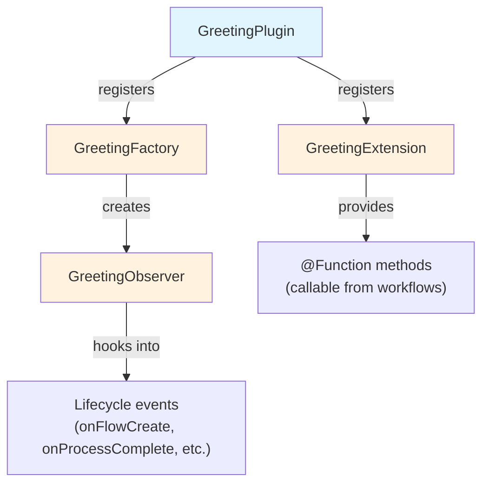

# Parte 2: Crear un Proyecto de Plugin

<span class="ai-translation-notice">:material-information-outline:{ .ai-translation-notice-icon } Traducción asistida por IA - [más información y sugerencias](https://github.com/nextflow-io/training/blob/master/TRANSLATING.md)</span>

Ya viste cómo los plugins extienden Nextflow con funcionalidades reutilizables.
Ahora crearás el tuyo propio, comenzando con una plantilla de proyecto que maneja la configuración de compilación por ti.

!!! tip "¿Empezando desde aquí?"

    Si te unes en esta parte, copia la solución de la Parte 1 para usarla como punto de partida:

    ```bash
    cp -r solutions/1-plugin-basics/* .
    ```

!!! info "Documentación oficial"

    Esta sección y las que siguen cubren los aspectos esenciales del desarrollo de plugins.
    Para más detalles, consulte la [documentación oficial de desarrollo de plugins de Nextflow](https://www.nextflow.io/docs/latest/plugins/developing-plugins.html).

---

## 1. Crear el proyecto del plugin

El comando integrado `nextflow plugin create` genera un proyecto de plugin completo:

```bash
nextflow plugin create nf-greeting training
```

```console title="Output"
Plugin created successfully at path: /workspaces/training/side-quests/plugin_development/nf-greeting
```

El primer argumento es el nombre del plugin y el segundo es el nombre de su organización (usado para organizar el código generado en carpetas).

!!! tip "Creación manual"

    También puede crear proyectos de plugins manualmente o usar la [plantilla nf-hello](https://github.com/nextflow-io/nf-hello) en GitHub como punto de partida.

---

## 2. Examinar la estructura del proyecto

Un plugin de Nextflow es un componente de software Groovy que se ejecuta dentro de Nextflow.
Extiende las capacidades de Nextflow usando puntos de integración bien definidos, lo que significa que puede trabajar con características de Nextflow como canales, procesos y configuración.

Antes de escribir cualquier código, observe lo que generó la plantilla para saber dónde va cada cosa.

Cambie al directorio del plugin:

```bash
cd nf-greeting
```

Liste el contenido:

```bash
tree
```

Debería ver:

```console
.
├── build.gradle
├── COPYING
├── gradle
│   └── wrapper
│       ├── gradle-wrapper.jar
│       └── gradle-wrapper.properties
├── gradlew
├── Makefile
├── README.md
├── settings.gradle
└── src
    ├── main
    │   └── groovy
    │       └── training
    │           └── plugin
    │               ├── GreetingExtension.groovy
    │               ├── GreetingFactory.groovy
    │               ├── GreetingObserver.groovy
    │               └── GreetingPlugin.groovy
    └── test
        └── groovy
            └── training
                └── plugin
                    └── GreetingObserverTest.groovy

11 directories, 13 files
```

---

## 3. Explorar la configuración de compilación

Un plugin de Nextflow es software basado en Java que debe compilarse y empaquetarse antes de que Nextflow pueda usarlo.
Esto requiere una herramienta de compilación.

Gradle es una herramienta de compilación que compila código, ejecuta pruebas y empaqueta software.
La plantilla del plugin incluye un wrapper de Gradle (`./gradlew`) para que no necesite tener Gradle instalado por separado.

La configuración de compilación le indica a Gradle cómo compilar su plugin y le indica a Nextflow cómo cargarlo.
Dos archivos son los más importantes.

### 3.1. settings.gradle

Este archivo identifica el proyecto:

```bash
cat settings.gradle
```

```groovy title="settings.gradle"
rootProject.name = 'nf-greeting'
```

El nombre aquí debe coincidir con lo que pondrá en `nextflow.config` al usar el plugin.

### 3.2. build.gradle

El archivo de compilación es donde ocurre la mayor parte de la configuración:

```bash
cat build.gradle
```

El archivo contiene varias secciones.
La más importante es el bloque `nextflowPlugin`:

```groovy title="build.gradle"
plugins {
    id 'io.nextflow.nextflow-plugin' version '1.0.0-beta.10'
}

version = '0.1.0'

nextflowPlugin {
    nextflowVersion = '24.10.0'       // (1)!

    provider = 'training'             // (2)!
    className = 'training.plugin.GreetingPlugin'  // (3)!
    extensionPoints = [               // (4)!
        'training.plugin.GreetingExtension',
        'training.plugin.GreetingFactory'
    ]

}
```

1. **`nextflowVersion`**: Versión mínima de Nextflow requerida
2. **`provider`**: Su nombre u organización
3. **`className`**: La clase principal del plugin, el punto de entrada que Nextflow carga primero
4. **`extensionPoints`**: Clases que agregan funcionalidades a Nextflow (sus funciones, monitoreo, etc.)

El bloque `nextflowPlugin` configura:

- `nextflowVersion`: Versión mínima de Nextflow requerida
- `provider`: Su nombre u organización
- `className`: La clase principal del plugin (el punto de entrada que Nextflow carga primero, especificado en `build.gradle`)
- `extensionPoints`: Clases que agregan funcionalidades a Nextflow (sus funciones, monitoreo, etc.)

### 3.3. Actualizar nextflowVersion

La plantilla genera un valor de `nextflowVersion` que puede estar desactualizado.
Actualícelo para que coincida con su versión instalada de Nextflow y garantizar compatibilidad total:

=== "Después"

    ```groovy title="build.gradle" hl_lines="2"
    nextflowPlugin {
        nextflowVersion = '25.10.0'

        provider = 'training'
    ```

=== "Antes"

    ```groovy title="build.gradle" hl_lines="2"
    nextflowPlugin {
        nextflowVersion = '24.10.0'

        provider = 'training'
    ```

---

## 4. Conocer los archivos fuente

El código fuente del plugin se encuentra en `src/main/groovy/training/plugin/`.
Hay cuatro archivos fuente, cada uno con un rol específico:

| Archivo                    | Rol                                                          | Modificado en       |
| -------------------------- | ------------------------------------------------------------ | ------------------- |
| `GreetingPlugin.groovy`    | Punto de entrada que Nextflow carga primero                  | Nunca (generado)    |
| `GreetingExtension.groovy` | Define funciones invocables desde los workflows              | Parte 3             |
| `GreetingFactory.groovy`   | Crea instancias del observer cuando inicia un workflow       | Parte 5             |
| `GreetingObserver.groovy`  | Ejecuta código en respuesta a eventos del ciclo de vida del workflow | Parte 5       |

Cada archivo se presenta en detalle en la parte indicada, cuando lo modifique por primera vez.
Los más importantes a tener en cuenta:

- `GreetingPlugin` es el punto de entrada que carga Nextflow
- `GreetingExtension` provee las funciones que este plugin pone a disposición de los workflows
- `GreetingObserver` se ejecuta junto al pipeline y responde a eventos sin requerir cambios en el código del pipeline



---

## 5. Compilar, instalar y ejecutar

La plantilla incluye código funcional desde el principio, por lo que puede compilarlo y ejecutarlo de inmediato para verificar que el proyecto esté configurado correctamente.

Compile el plugin e instálelo localmente:

```bash
make install
```

`make install` compila el código del plugin y lo copia a su directorio local de plugins de Nextflow (`$NXF_HOME/plugins/`), dejándolo disponible para usar.

??? example "Salida de la compilación"

    La primera vez que ejecute esto, Gradle se descargará a sí mismo (esto puede tardar un minuto):

    ```console
    Downloading https://services.gradle.org/distributions/gradle-8.14-bin.zip
    ...10%...20%...30%...40%...50%...60%...70%...80%...90%...100%

    Welcome to Gradle 8.14!
    ...

    Deprecated Gradle features were used in this build...

    BUILD SUCCESSFUL in 23s
    5 actionable tasks: 5 executed
    ```

    **Las advertencias son esperadas.**

    - **"Downloading gradle..."**: Esto solo ocurre la primera vez. Las compilaciones posteriores son mucho más rápidas.
    - **"Deprecated Gradle features..."**: Esta advertencia proviene de la plantilla del plugin, no de su código. Puede ignorarla sin problema.
    - **"BUILD SUCCESSFUL"**: Esto es lo que importa. Su plugin se compiló sin errores.

Regrese al directorio del pipeline:

```bash
cd ..
```

Agregue el plugin nf-greeting a `nextflow.config`:

=== "Después"

    ```groovy title="nextflow.config" hl_lines="4"
    // Configuración para los ejercicios de desarrollo de plugins
    plugins {
        id 'nf-schema@2.6.1'
        id 'nf-greeting@0.1.0'
    }
    ```

=== "Antes"

    ```groovy title="nextflow.config"
    // Configuración para los ejercicios de desarrollo de plugins
    plugins {
        id 'nf-schema@2.6.1'
    }
    ```

!!! note "Versión requerida para plugins locales"

    Al usar plugins instalados localmente, debe especificar la versión (por ejemplo, `nf-greeting@0.1.0`).
    Los plugins publicados en el registro pueden usar solo el nombre.

Ejecute el pipeline:

```bash
nextflow run greet.nf -ansi-log false
```

El indicador `-ansi-log false` deshabilita la visualización animada del progreso para que toda la salida, incluidos los mensajes del observer, se imprima en orden.

```console title="Output"
Pipeline is starting! 🚀
[bc/f10449] Submitted process > SAY_HELLO (1)
[9a/f7bcb2] Submitted process > SAY_HELLO (2)
[6c/aff748] Submitted process > SAY_HELLO (3)
[de/8937ef] Submitted process > SAY_HELLO (4)
[98/c9a7d6] Submitted process > SAY_HELLO (5)
Output: Bonjour
Output: Hello
Output: Holà
Output: Ciao
Output: Hallo
Pipeline complete! 👋
```

(El orden de su salida y los hashes del directorio de trabajo serán diferentes.)

Los mensajes "Pipeline is starting!" y "Pipeline complete!" se parecen a los del plugin nf-hello de la Parte 1, pero esta vez provienen del `GreetingObserver` en su propio plugin.
El pipeline en sí no ha cambiado; el observer se ejecuta automáticamente porque está registrado en la factory.

---

## Conclusión

Aprendió que:

- El comando `nextflow plugin create` genera un proyecto inicial completo
- `build.gradle` configura los metadatos del plugin, las dependencias y qué clases proveen funcionalidades
- El plugin tiene cuatro componentes principales: Plugin (punto de entrada), Extension (funciones), Factory (crea monitores) y Observer (responde a eventos del workflow)
- El ciclo de desarrollo es: editar el código, ejecutar `make install`, ejecutar el pipeline

---

## ¿Qué sigue?

Ahora implementará funciones personalizadas en la clase Extension y las usará en el workflow.

[Continuar a la Parte 3 :material-arrow-right:](03_custom_functions.md){ .md-button .md-button--primary }
