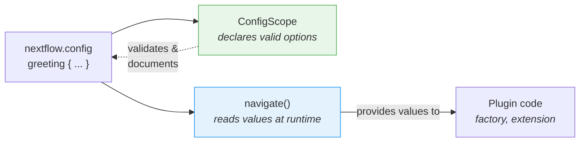

# Parte 6: Configuración

<span class="ai-translation-notice">:material-information-outline:{ .ai-translation-notice-icon } Traducción asistida por IA - [más información y sugerencias](https://github.com/nextflow-io/training/blob/master/TRANSLATING.md)</span>

Su plugin tiene funciones personalizadas y un observer, pero todo está codificado de forma fija.
Los usuarios no pueden desactivar el contador de tareas ni cambiar el decorador sin editar el código fuente y reconstruirlo.

En la Parte 1, usó los bloques `#!groovy validation {}` y `#!groovy co2footprint {}` en `nextflow.config` para controlar el comportamiento de nf-schema y nf-co2footprint.
Esos bloques de configuración existen porque los autores del plugin incorporaron esa capacidad.
En esta sección, hará lo mismo para su propio plugin.

**Objetivos:**

1. Permitir que los usuarios personalicen el prefijo y sufijo del decorador de saludos
2. Permitir que los usuarios habiliten o deshabiliten el plugin a través de `nextflow.config`
3. Registrar un scope de configuración formal para que Nextflow reconozca el bloque `#!groovy greeting {}`

**Qué cambiará:**

| Archivo                    | Cambio                                                          |
| -------------------------- | --------------------------------------------------------------- |
| `GreetingExtension.groovy` | Leer la configuración de prefijo/sufijo en `init()`             |
| `GreetingFactory.groovy`   | Leer valores de configuración para controlar la creación del observer |
| `GreetingConfig.groovy`    | Archivo nuevo: clase formal `@ConfigScope`                      |
| `build.gradle`             | Registrar la clase de configuración como punto de extensión     |
| `nextflow.config`          | Agregar un bloque `#!groovy greeting {}` para probarlo          |

!!! tip "¿Empieza desde aquí?"

    Si se incorpora en esta parte, copie la solución de la Parte 5 para usarla como punto de partida:

    ```bash
    cp -r solutions/5-observers/* .
    ```

!!! info "Documentación oficial"

    Para detalles completos sobre configuración, consulte la [documentación de scopes de configuración de Nextflow](https://nextflow.io/docs/latest/developer/config-scopes.html).

---

## 1. Hacer configurable el decorador

La función `decorateGreeting` envuelve cada saludo en `*** ... ***`.
Los usuarios podrían querer marcadores diferentes, pero actualmente la única forma de cambiarlos es editar el código fuente y reconstruirlo.

La sesión de Nextflow proporciona un método llamado `session.config.navigate()` que lee valores anidados desde `nextflow.config`:

```groovy
// Lee 'greeting.prefix' desde nextflow.config, con valor predeterminado '***'
final prefix = session.config.navigate('greeting.prefix', '***') as String
```

Esto corresponde a un bloque de configuración en el `nextflow.config` del usuario:

```groovy title="nextflow.config"
greeting {
    prefix = '>>>'
}
```

### 1.1. Agregar la lectura de configuración (¡esto fallará!)

Edite `GreetingExtension.groovy` para leer la configuración en `init()` y usarla en `decorateGreeting()`:

```groovy title="GreetingExtension.groovy" linenums="35" hl_lines="7-8 18"
@CompileStatic
class GreetingExtension extends PluginExtensionPoint {

    @Override
    protected void init(Session session) {
        // Lee la configuración con valores predeterminados
        prefix = session.config.navigate('greeting.prefix', '***') as String
        suffix = session.config.navigate('greeting.suffix', '***') as String
    }

    // ... otros métodos sin cambios ...

    /**
    * Decora un saludo con marcadores festivos
    */
    @Function
    String decorateGreeting(String greeting) {
        return "${prefix} ${greeting} ${suffix}"
    }
```

Intente construir:

```bash
cd nf-greeting && make assemble
```

### 1.2. Observar el error

La construcción falla:

```console
> Task :compileGroovy FAILED
GreetingExtension.groovy: 30: [Static type checking] - The variable [prefix] is undeclared.
 @ line 30, column 9.
           prefix = session.config.navigate('greeting.prefix', '***') as String
           ^

GreetingExtension.groovy: 31: [Static type checking] - The variable [suffix] is undeclared.
```

En Groovy (y Java), debe _declarar_ una variable antes de usarla.
El código intenta asignar valores a `prefix` y `suffix`, pero la clase no tiene campos con esos nombres.

### 1.3. Corregir declarando variables de instancia

Agregue las declaraciones de variables al inicio de la clase, justo después de la llave de apertura:

```groovy title="GreetingExtension.groovy" linenums="35" hl_lines="4-5"
@CompileStatic
class GreetingExtension extends PluginExtensionPoint {

    private String prefix = '***'
    private String suffix = '***'

    @Override
    protected void init(Session session) {
        // Lee la configuración con valores predeterminados
        prefix = session.config.navigate('greeting.prefix', '***') as String
        suffix = session.config.navigate('greeting.suffix', '***') as String
    }

    // ... resto de la clase sin cambios ...
```

Estas dos líneas declaran **variables de instancia** (también llamadas campos) que pertenecen a cada objeto `GreetingExtension`.
La palabra clave `private` significa que solo el código dentro de esta clase puede acceder a ellas.
Cada variable se inicializa con un valor predeterminado de `'***'`.

Cuando el plugin se carga, Nextflow llama al método `init()`, que sobreescribe estos valores predeterminados con lo que el usuario haya configurado en `nextflow.config`.
Si el usuario no ha configurado nada, `navigate()` devuelve el mismo valor predeterminado, por lo que el comportamiento no cambia.
El método `decorateGreeting()` luego lee estos campos cada vez que se ejecuta.

!!! tip "Aprender de los errores"

    Este patrón de "declarar antes de usar" es fundamental en Java/Groovy, pero puede resultar desconocido si viene de Python o R, donde las variables cobran existencia en el momento en que se les asigna un valor por primera vez.
    Experimentar este error una vez le ayuda a reconocerlo y corregirlo rápidamente en el futuro.

### 1.4. Construir y probar

Construya e instale:

```bash
make install && cd ..
```

Actualice `nextflow.config` para personalizar la decoración:

=== "Después"

    ```groovy title="nextflow.config" hl_lines="7-10"
    // Configuración para los ejercicios de desarrollo de plugins
    plugins {
        id 'nf-schema@2.6.1'
        id 'nf-greeting@0.1.0'
    }

    greeting {
        prefix = '>>>'
        suffix = '<<<'
    }
    ```

=== "Antes"

    ```groovy title="nextflow.config"
    // Configuración para los ejercicios de desarrollo de plugins
    plugins {
        id 'nf-schema@2.6.1'
        id 'nf-greeting@0.1.0'
    }
    ```

Ejecute el pipeline:

```bash
nextflow run greet.nf -ansi-log false
```

```console title="Output (partial)"
Decorated: >>> Hello <<<
Decorated: >>> Bonjour <<<
...
```

El decorador ahora usa el prefijo y sufijo personalizados del archivo de configuración.

Tenga en cuenta que Nextflow muestra una advertencia de "Unrecognized config option" porque nada ha declarado `greeting` como un scope válido todavía.
El valor aún se lee correctamente a través de `navigate()`, pero Nextflow lo marca como no reconocido.
Esto lo corregirá en la Sección 3.

---

## 2. Hacer configurable el contador de tareas

La factory de observers actualmente crea observers de forma incondicional.
Los usuarios deberían poder deshabilitar el plugin completamente a través de la configuración.

La factory tiene acceso a la sesión de Nextflow y su configuración, por lo que es el lugar adecuado para leer el parámetro `enabled` y decidir si crear observers.

=== "Después"

    ```groovy title="GreetingFactory.groovy" linenums="31" hl_lines="3-4"
    @Override
    Collection<TraceObserver> create(Session session) {
        final enabled = session.config.navigate('greeting.enabled', true)
        if (!enabled) return []

        return [
            new GreetingObserver(),
            new TaskCounterObserver()
        ]
    }
    ```

=== "Antes"

    ```groovy title="GreetingFactory.groovy" linenums="31"
    @Override
    Collection<TraceObserver> create(Session session) {
        return [
            new GreetingObserver(),
            new TaskCounterObserver()
        ]
    }
    ```

La factory ahora lee `greeting.enabled` desde la configuración y devuelve una lista vacía si el usuario lo ha establecido en `false`.
Cuando la lista está vacía, no se crean observers, por lo que los hooks del ciclo de vida del plugin se omiten silenciosamente.

### 2.1. Construir y probar

Reconstruya e instale el plugin:

```bash
cd nf-greeting && make install && cd ..
```

Ejecute el pipeline para confirmar que todo sigue funcionando:

```bash
nextflow run greet.nf -ansi-log false
```

??? exercise "Deshabilitar el plugin completamente"

    Intente establecer `greeting.enabled = false` en `nextflow.config` y ejecute el pipeline nuevamente.
    ¿Qué cambia en la salida?

    ??? solution "Solución"

        ```groovy title="nextflow.config" hl_lines="8"
        // Configuración para los ejercicios de desarrollo de plugins
        plugins {
            id 'nf-schema@2.6.1'
            id 'nf-greeting@0.1.0'
        }

        greeting {
            enabled = false
        }
        ```

        Los mensajes "Pipeline is starting!", "Pipeline complete!" y el conteo de tareas desaparecen porque la factory devuelve una lista vacía cuando `enabled` es false.
        El pipeline en sí sigue ejecutándose, pero no hay observers activos.

        Recuerde volver a establecer `enabled` en `true` (o eliminar la línea) antes de continuar.

---

## 3. Configuración formal con ConfigScope

La configuración de su plugin funciona, pero Nextflow sigue mostrando advertencias de "Unrecognized config option".
Esto se debe a que `session.config.navigate()` solo lee valores; nada le ha indicado a Nextflow que `greeting` es un scope de configuración válido.

Una clase `ConfigScope` llena ese vacío.
Declara qué opciones acepta su plugin, sus tipos y sus valores predeterminados.
**No** reemplaza sus llamadas a `navigate()`. En cambio, trabaja junto a ellas:



Sin una clase `ConfigScope`, `navigate()` sigue funcionando, pero:

- Nextflow advierte sobre opciones no reconocidas (como ya ha visto)
- No hay autocompletado en el IDE para los usuarios que escriben `nextflow.config`
- Las opciones de configuración no se autodocumentan
- La conversión de tipos es manual (`as String`, `as boolean`)

Registrar una clase de scope de configuración formal elimina la advertencia y resuelve los tres problemas.
Este es el mismo mecanismo detrás de los bloques `#!groovy validation {}` y `#!groovy co2footprint {}` que usó en la Parte 1.

### 3.1. Crear la clase de configuración

Cree un nuevo archivo:

```bash
touch nf-greeting/src/main/groovy/training/plugin/GreetingConfig.groovy
```

Agregue la clase de configuración con las tres opciones:

```groovy title="GreetingConfig.groovy" linenums="1"
package training.plugin

import nextflow.config.spec.ConfigOption
import nextflow.config.spec.ConfigScope
import nextflow.config.spec.ScopeName
import nextflow.script.dsl.Description

/**
 * Opciones de configuración para el plugin nf-greeting.
 *
 * Los usuarios las configuran en nextflow.config:
 *
 *     greeting {
 *         enabled = true
 *         prefix = '>>>'
 *         suffix = '<<<'
 *     }
 */
@ScopeName('greeting')                       // (1)!
class GreetingConfig implements ConfigScope { // (2)!

    GreetingConfig() {}

    GreetingConfig(Map opts) {               // (3)!
        this.enabled = opts.enabled as Boolean ?: true
        this.prefix = opts.prefix as String ?: '***'
        this.suffix = opts.suffix as String ?: '***'
    }

    @ConfigOption                            // (4)!
    @Description('Enable or disable the plugin entirely')
    boolean enabled = true

    @ConfigOption
    @Description('Prefix for decorated greetings')
    String prefix = '***'

    @ConfigOption
    @Description('Suffix for decorated greetings')
    String suffix = '***'
}
```

1. Se corresponde con el bloque `#!groovy greeting { }` en `nextflow.config`
2. Interfaz requerida para las clases de configuración
3. Se necesitan tanto el constructor sin argumentos como el constructor Map para que Nextflow pueda instanciar la configuración
4. `@ConfigOption` marca un campo como opción de configuración; `@Description` lo documenta para las herramientas

Puntos clave:

- **`@ScopeName('greeting')`**: Se corresponde con el bloque `greeting { }` en la configuración
- **`implements ConfigScope`**: Interfaz requerida para las clases de configuración
- **`@ConfigOption`**: Cada campo se convierte en una opción de configuración
- **`@Description`**: Documenta cada opción para el soporte del servidor de lenguaje (importado desde `nextflow.script.dsl`)
- **Constructores**: Se necesitan tanto el constructor sin argumentos como el constructor Map

### 3.2. Registrar la clase de configuración

Crear la clase no es suficiente por sí solo.
Nextflow necesita saber que existe, por lo que debe registrarla en `build.gradle` junto a los demás puntos de extensión.

=== "Después"

    ```groovy title="build.gradle" hl_lines="4"
    extensionPoints = [
        'training.plugin.GreetingExtension',
        'training.plugin.GreetingFactory',
        'training.plugin.GreetingConfig'
    ]
    ```

=== "Antes"

    ```groovy title="build.gradle"
    extensionPoints = [
        'training.plugin.GreetingExtension',
        'training.plugin.GreetingFactory'
    ]
    ```

Tenga en cuenta la diferencia entre el registro de la factory y los puntos de extensión:

- **`extensionPoints` en `build.gradle`**: Registro en tiempo de compilación. Le indica al sistema de plugins de Nextflow qué clases implementan puntos de extensión.
- **Método `create()` de la factory**: Registro en tiempo de ejecución. La factory crea instancias de observers cuando un workflow realmente se inicia.

### 3.3. Construir y probar

```bash
cd nf-greeting && make install && cd ..
nextflow run greet.nf -ansi-log false
```

El comportamiento del pipeline es idéntico, pero la advertencia "Unrecognized config option" ha desaparecido.

!!! note "Qué cambió y qué no"

    Su `GreetingFactory` y `GreetingExtension` siguen usando `session.config.navigate()` para leer valores en tiempo de ejecución.
    Nada de ese código cambió.
    La clase `ConfigScope` es una declaración paralela que le indica a Nextflow qué opciones existen.
    Ambas piezas son necesarias: `ConfigScope` declara, `navigate()` lee.

Su plugin ahora tiene la misma estructura que los plugins que usó en la Parte 1.
Cuando nf-schema expone un bloque `#!groovy validation {}` o nf-co2footprint expone un bloque `#!groovy co2footprint {}`, usan exactamente este patrón: una clase `ConfigScope` con campos anotados, registrada como punto de extensión.
Su bloque `#!groovy greeting {}` funciona de la misma manera.

---

## Conclusión

Aprendió que:

- `session.config.navigate()` **lee** valores de configuración en tiempo de ejecución
- Las clases `@ConfigScope` **declaran** qué opciones de configuración existen; trabajan junto a `navigate()`, no en su lugar
- La configuración puede aplicarse tanto a observers como a funciones de extensión
- Las variables de instancia deben declararse antes de usarse en Groovy/Java; `init()` las llena desde la configuración cuando el plugin se carga

| Caso de uso                                    | Enfoque recomendado                                                    |
| ---------------------------------------------- | ---------------------------------------------------------------------- |
| Prototipo rápido o plugin simple               | Solo `session.config.navigate()`                                       |
| Plugin de producción con muchas opciones       | Agregar una clase `ConfigScope` junto a sus llamadas a `navigate()`    |
| Plugin que compartirá públicamente             | Agregar una clase `ConfigScope` junto a sus llamadas a `navigate()`    |

---

## ¿Qué sigue?

Su plugin ahora tiene todas las piezas de un plugin de producción: funciones personalizadas, trace observers y configuración orientada al usuario.
El paso final es empaquetarlo para su distribución.

[Continuar al Resumen :material-arrow-right:](summary.md){ .md-button .md-button--primary }
