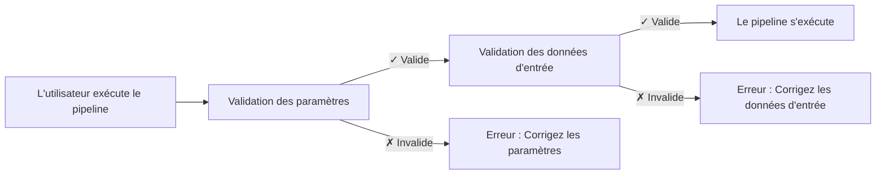

# Partie 5 : Validation des entrées

<span class="ai-translation-notice">:material-information-outline:{ .ai-translation-notice-icon } Traduction assistée par IA - [en savoir plus et suggérer des améliorations](https://github.com/nextflow-io/training/blob/master/TRANSLATING.md)</span>

Dans cette cinquième partie du cours de formation Hello nf-core, nous vous montrons comment utiliser le plugin nf-schema pour valider les entrées et les paramètres du pipeline.

??? info "Comment commencer à partir de cette section"

    Cette section suppose que vous avez terminé la [Partie 4 : Créer un module nf-core](./04_make_module.md) et que vous avez mis à jour le module de processus `COWPY` aux standards nf-core dans votre pipeline.

    Si vous n'avez pas terminé la Partie 4 ou souhaitez repartir de zéro pour cette partie, vous pouvez utiliser la solution `core-hello-part4` comme point de départ.
    Exécutez ces commandes depuis le répertoire `hello-nf-core/` :

    ```bash
    cp -r solutions/core-hello-part4 core-hello
    cd core-hello
    ```

    Cela vous donne un pipeline avec le module `COWPY` déjà mis à niveau pour suivre les standards nf-core.
    Vous pouvez vérifier qu'il s'exécute avec succès en lançant la commande suivante :

    ```bash
    nextflow run . --outdir core-hello-results -profile test,docker --validate_params false
    ```

---

## 0. Échauffement : Un peu de contexte

### 0.1. Pourquoi la validation est importante

Imaginez exécuter votre pipeline pendant deux heures, pour qu'il plante parce qu'un·e utilisateur·trice a fourni un fichier avec la mauvaise extension. Ou passer des heures à déboguer des erreurs cryptiques, pour découvrir qu'un paramètre était mal orthographié. Sans validation des entrées, ces scénarios sont courants.

Considérez cet exemple :

```console title="Sans validation"
$ nextflow run my-pipeline --input data.txt --output results

...2 heures plus tard...

ERROR ~ No such file: 'data.fq.gz'
  Expected FASTQ format but received TXT
```

Le pipeline a accepté des entrées invalides et s'est exécuté pendant des heures avant d'échouer. Avec une validation appropriée :

```console title="Avec validation"
$ nextflow run my-pipeline --input data.txt --output results

ERROR ~ Validation of pipeline parameters failed!

 * --input (data.txt): File extension '.txt' does not match required pattern '.fq.gz' or '.fastq.gz'
 * --output: required parameter is missing (expected: --outdir)

Pipeline failed before execution - please fix the errors above
```

Le pipeline échoue immédiatement avec des messages d'erreur clairs et exploitables. Cela économise du temps, des ressources de calcul et évite les frustrations.

### 0.2. Le plugin nf-schema

Le [plugin nf-schema](https://nextflow-io.github.io/nf-schema/latest/) est un plugin Nextflow qui fournit des capacités de validation complètes pour les pipelines Nextflow.
Bien que nf-schema fonctionne avec n'importe quel workflow Nextflow, c'est la solution de validation standard pour tous les pipelines nf-core.

nf-schema fournit plusieurs fonctions clés :

- **Validation des paramètres** : Valide les paramètres du pipeline par rapport à `nextflow_schema.json`
- **Validation des feuilles d'échantillons** : Valide les fichiers d'entrée par rapport à `assets/schema_input.json`
- **Conversion de canaux** : Convertit les feuilles d'échantillons validées en canaux Nextflow
- **Génération de texte d'aide** : Génère automatiquement la sortie `--help` à partir des définitions de schéma
- **Résumé des paramètres** : Affiche les paramètres qui diffèrent des valeurs par défaut

nf-schema est le successeur du plugin nf-validation (obsolète) et utilise le standard [JSON Schema Draft 2020-12](https://json-schema.org/) pour la validation.

??? info "Qu'est-ce que les plugins Nextflow ?"

    Les plugins sont des extensions qui ajoutent de nouvelles fonctionnalités au langage Nextflow lui-même. Ils sont installés via un bloc `plugins{}` dans `nextflow.config` et peuvent fournir :

    - De nouvelles fonctions et classes qui peuvent être importées (comme `samplesheetToList`)
    - De nouvelles fonctionnalités DSL et opérateurs
    - Intégration avec des services externes

    Le plugin nf-schema est spécifié dans `nextflow.config` :

    ```groovy
    plugins {
        id 'nf-schema@2.1.1'
    }
    ```

    Une fois installé, vous pouvez importer des fonctions depuis les plugins en utilisant la syntaxe `include { functionName } from 'plugin/plugin-name'`.

### 0.3. Deux fichiers de schéma pour deux types de validation

Un pipeline nf-core utilise deux fichiers de schéma distincts, qui correspondent à deux types de validation :

| Fichier de schéma          | Objectif                        | Valide                                                          |
| -------------------------- | ------------------------------- | --------------------------------------------------------------- |
| `nextflow_schema.json`     | Validation des paramètres       | Options en ligne de commande : `--input`, `--outdir`, `--batch` |
| `assets/schema_input.json` | Validation des données d'entrée | Contenu des feuilles d'échantillons et des fichiers d'entrée    |

Les deux schémas utilisent le format JSON Schema, un standard largement adopté pour décrire et valider les structures de données.

**La validation des paramètres** valide les paramètres en ligne de commande (options comme `--outdir`, `--batch`, `--input`) :

- Vérifie les types, plages et formats des paramètres
- S'assure que les paramètres requis sont fournis
- Valide que les chemins de fichiers existent
- Définie dans `nextflow_schema.json`

**La validation des données d'entrée** valide la structure des feuilles d'échantillons et des fichiers de manifeste (fichiers CSV/TSV qui décrivent vos données) :

- Vérifie la structure des colonnes et les types de données
- Valide que les chemins de fichiers référencés dans la feuille d'échantillons existent
- S'assure que les champs requis sont présents
- Définie dans `assets/schema_input.json`

!!! warning "Ce que la validation des données d'entrée ne fait PAS"

    La validation des données d'entrée vérifie la structure des *fichiers de manifeste* (feuilles d'échantillons, fichiers CSV), PAS le contenu de vos fichiers de données réels (FASTQ, BAM, VCF, etc.).

    Pour des données à grande échelle, la validation du contenu des fichiers (comme la vérification de l'intégrité des BAM) devrait se faire dans les processus du pipeline exécutés sur les nœuds de travail, pas pendant l'étape de validation sur la machine d'orchestration.

### 0.4. Quand la validation doit-elle se produire ?



La validation devrait se produire **avant** l'exécution de tout processus du pipeline, pour fournir un retour rapide et éviter le gaspillage de temps de calcul.

Appliquons maintenant ces principes en pratique, en commençant par la validation des paramètres.

---

## 1. Validation des paramètres (nextflow_schema.json)

Commençons par ajouter la validation des paramètres à notre pipeline. Cela valide les options en ligne de commande comme `--input`, `--outdir` et `--batch`.

### 1.1. Configurer la validation pour ignorer la validation des fichiers d'entrée

Le modèle de pipeline nf-core est livré avec nf-schema déjà installé et configuré :

- Le plugin nf-schema est installé via le bloc `plugins{}` dans `nextflow.config`
- La validation des paramètres est activée par défaut via `params.validate_params = true`
- La validation est effectuée par le sous-workflow `UTILS_NFSCHEMA_PLUGIN` lors de l'initialisation du pipeline

Le comportement de validation est contrôlé via la portée `validation{}` dans `nextflow.config`.

Puisque nous allons d'abord travailler sur la validation des paramètres (cette section) et ne configurerons pas le schéma de données d'entrée avant la section 2, nous devons temporairement demander à nf-schema d'ignorer la validation du contenu du fichier du paramètre `input`.

Ouvrez `nextflow.config` et trouvez le bloc `validation` (autour de la ligne 246). Ajoutez `ignoreParams` pour ignorer la validation des fichiers d'entrée :

=== "Après"

    ```groovy title="nextflow.config" hl_lines="3" linenums="246"
    validation {
        defaultIgnoreParams = ["genomes"]
        ignoreParams = ['input']
        monochromeLogs = params.monochrome_logs
    }
    ```

=== "Avant"

    ```groovy title="nextflow.config" linenums="246"
    validation {
        defaultIgnoreParams = ["genomes"]
        monochromeLogs = params.monochrome_logs
    }
    ```

Cette configuration indique à nf-schema de :

- **`defaultIgnoreParams`** : Ignorer la validation des paramètres complexes comme `genomes` (défini par les développeur·ses du modèle)
- **`ignoreParams`** : Ignorer la validation du contenu du fichier du paramètre `input` (temporaire ; nous réactiverons cela dans la section 2)
- **`monochromeLogs`** : Désactiver la sortie colorée dans les messages de validation lorsque défini sur `true` (contrôlé par `params.monochrome_logs`)

!!! note "Pourquoi ignorer le paramètre input ?"

    Le paramètre `input` dans `nextflow_schema.json` a `"schema": "assets/schema_input.json"` qui indique à nf-schema de valider le *contenu* du fichier CSV d'entrée par rapport à ce schéma.
    Puisque nous n'avons pas encore configuré ce schéma, nous ignorons temporairement cette validation.
    Nous supprimerons ce paramètre dans la section 2 après avoir configuré le schéma de données d'entrée.

### 1.2. Examiner le schéma de paramètres

Regardons une section du fichier `nextflow_schema.json` qui est fourni avec notre modèle de pipeline :

```bash
grep -A 25 '"input_output_options"' nextflow_schema.json
```

Le schéma de paramètres est organisé en groupes. Voici le groupe `input_output_options` :

```json title="core-hello/nextflow_schema.json (extrait)" linenums="8"
        "input_output_options": {
            "title": "Input/output options",
            "type": "object",
            "fa_icon": "fas fa-terminal",
            "description": "Define where the pipeline should find input data and save output data.",
            "required": ["input", "outdir"],
            "properties": {
                "input": {
                    "type": "string",
                    "format": "file-path",
                    "exists": true,
                    "schema": "assets/schema_input.json",
                    "mimetype": "text/csv",
                    "pattern": "^\\S+\\.csv$",
                    "description": "Path to comma-separated file containing information about the samples in the experiment.",
                    "help_text": "You will need to create a design file with information about the samples in your experiment before running the pipeline. Use this parameter to specify its location. It has to be a comma-separated file with 3 columns, and a header row.",
                    "fa_icon": "fas fa-file-csv"
                },
                "outdir": {
                    "type": "string",
                    "format": "directory-path",
                    "description": "The output directory where the results will be saved. You have to use absolute paths to storage on Cloud infrastructure.",
                    "fa_icon": "fas fa-folder-open"
                }
            }
        },
```

Chaque entrée décrite ici possède les propriétés clés suivantes qui peuvent être validées :

- **`type`** : Type de données (string, integer, boolean, number)
- **`format`** : Formats spéciaux comme `file-path` ou `directory-path`
- **`exists`** : Pour les chemins de fichiers, vérifier si le fichier existe
- **`pattern`** : Expression régulière que la valeur doit respecter
- **`required`** : Tableau des noms de paramètres qui doivent être fournis
- **`mimetype`** : Type MIME attendu du fichier pour la validation

Si vous avez l'œil aiguisé, vous remarquerez peut-être que le paramètre d'entrée `batch` que nous utilisons n'est pas encore défini dans le schéma.
Nous allons l'ajouter dans la section suivante.

??? info "D'où viennent les paramètres du schéma ?"

    La validation du schéma utilise `nextflow.config` comme base pour les définitions de paramètres.
    Les paramètres déclarés ailleurs dans vos scripts de workflow (comme dans `main.nf` ou les fichiers de modules) ne sont **pas** automatiquement récupérés par le validateur de schéma.

    Cela signifie que vous devez toujours déclarer vos paramètres de pipeline dans `nextflow.config`, puis définir leurs règles de validation dans `nextflow_schema.json`.

### 1.3. Ajouter le paramètre batch

Bien que le schéma soit un fichier JSON qui peut être édité manuellement, **l'édition manuelle est sujette aux erreurs et n'est pas recommandée**.
À la place, nf-core fournit un outil GUI interactif qui gère la syntaxe JSON Schema pour vous et valide vos modifications :

```bash
nf-core pipelines schema build
```

Vous devriez voir quelque chose comme ceci :

```console
                                      ,--./,-.
      ___     __   __   __   ___     /,-._.--\
|\ | |__  __ /  ` /  \ |__) |__         }  {
| \| |       \__, \__/ |  \ |___     \`-._,-`-,
                                      `._,._,'

nf-core/tools version 3.4.1 - https://nf-co.re

INFO     [✓] Default parameters match schema validation
INFO     [✓] Pipeline schema looks valid (found 17 params)
INFO     Writing schema with 17 params: 'nextflow_schema.json'
🚀  Launch web builder for customisation and editing? [y/n]:
```

Tapez `y` et appuyez sur Entrée pour lancer l'interface web interactive.

Votre navigateur s'ouvrira affichant le constructeur de schéma de paramètres :


Pour ajouter le paramètre `batch` :

1. Cliquez sur le bouton **"Add parameter"** en haut
2. Utilisez la poignée de glissement (⋮⋮) pour déplacer le nouveau paramètre vers le haut dans le groupe "Input/output options", sous le paramètre `input`
3. Remplissez les détails du paramètre :
   - **ID** : `batch`
   - **Description** : `Name for this batch of greetings`
   - **Type** : `string`
   - **Required** : cochez la case
   - Optionnellement, sélectionnez une icône dans le sélecteur d'icônes (par ex., `fas fa-layer-group`)


Lorsque vous avez terminé, cliquez sur le bouton **"Finished"** en haut à droite.

De retour dans votre terminal, vous verrez :

```console
INFO     Writing schema with 18 params: 'nextflow_schema.json'
⣾ Use ctrl+c to stop waiting and force exit.
```

Appuyez sur `Ctrl+C` pour quitter le constructeur de schéma.

L'outil a maintenant mis à jour votre fichier `nextflow_schema.json` avec le nouveau paramètre `batch`, en gérant correctement toute la syntaxe JSON Schema.

### 1.4. Vérifier les modifications

```bash
grep -A 25 '"input_output_options"' nextflow_schema.json
```

```json title="core-hello/nextflow_schema.json (extrait)" linenums="8" hl_lines="19-23"
    "input_output_options": {
      "title": "Input/output options",
      "type": "object",
      "fa_icon": "fas fa-terminal",
      "description": "Define where the pipeline should find input data and save output data.",
      "required": ["input", "outdir", "batch"],
      "properties": {
        "input": {
          "type": "string",
          "format": "file-path",
          "exists": true,
          "schema": "assets/schema_input.json",
          "mimetype": "text/csv",
          "pattern": "^\\S+\\.csv$",
          "description": "Path to comma-separated file containing information about the samples in the experiment.",
          "help_text": "You will need to create a design file with information about the samples in your experiment before running the pipeline. Use this parameter to specify its location. It has to be a comma-separated file with 3 columns, and a header row.",
          "fa_icon": "fas fa-file-csv"
        },
        "batch": {
          "type": "string",
          "description": "Name for this batch of greetings",
          "fa_icon": "fas fa-layer-group"
        },
```

Vous devriez voir que le paramètre `batch` a été ajouté au schéma avec le champ "required" affichant maintenant `["input", "outdir", "batch"]`.

### 1.5. Tester la validation des paramètres

Testons maintenant que la validation des paramètres fonctionne correctement.

D'abord, essayez d'exécuter sans le paramètre requis `input` :

```bash
nextflow run . --outdir test-results -profile docker
```

??? warning "Sortie de la commande"

    ```console
    ERROR ~ Validation of pipeline parameters failed!

    -- Check '.nextflow.log' file for details
    The following invalid input values have been detected:

    * Missing required parameter(s): input, batch
    ```

Parfait ! La validation détecte le paramètre requis manquant avant l'exécution du pipeline.

Maintenant essayez avec un ensemble de paramètres valides :

```bash
nextflow run . --input assets/greetings.csv --outdir results --batch my-batch -profile test,docker
```

??? success "Sortie de la commande"

    ```console
     N E X T F L O W   ~  version 25.04.3

    Launching `./main.nf` [peaceful_wozniak] DSL2 - revision: b9e9b3b8de

    executor >  local (8)
    [de/a1b2c3] CORE_HELLO:HELLO:sayHello (3)       | 3 of 3 ✔
    [4f/d5e6f7] CORE_HELLO:HELLO:convertToUpper (3) | 3 of 3 ✔
    [8a/b9c0d1] CORE_HELLO:HELLO:CAT_CAT (test)     | 1 of 1 ✔
    [e2/f3a4b5] CORE_HELLO:HELLO:COWPY (test)       | 1 of 1 ✔
    -[core/hello] Pipeline completed successfully-
    ```

Le pipeline devrait s'exécuter avec succès, et le paramètre `batch` est maintenant validé.

### À retenir

Vous avez appris à utiliser l'outil interactif `nf-core pipelines schema build` pour ajouter des paramètres à `nextflow_schema.json` et vous avez vu la validation des paramètres en action.
L'interface web gère toute la syntaxe JSON Schema pour vous, facilitant la gestion de schémas de paramètres complexes sans édition manuelle de JSON sujette aux erreurs.

### Et ensuite ?

Maintenant que la validation des paramètres fonctionne, ajoutons la validation du contenu des fichiers de données d'entrée.

---

## 2. Validation des données d'entrée (schema_input.json)

Nous allons ajouter la validation du contenu de notre fichier CSV d'entrée.
Alors que la validation des paramètres vérifie les options en ligne de commande, la validation des données d'entrée s'assure que les données à l'intérieur du fichier CSV sont structurées correctement.

### 2.1. Comprendre le format de greetings.csv

Rappelons-nous à quoi ressemble notre entrée :

```bash
cat assets/greetings.csv
```

```csv title="assets/greetings.csv"
Hello,en,87
Bonjour,fr,96
Holà,es,98
```

Il s'agit d'un simple CSV avec :

- Trois colonnes (sans en-tête)
- Sur chaque ligne : une salutation, une langue et un score
- Les deux premières colonnes sont des chaînes de texte sans exigences de format particulières
- La troisième colonne est un entier

Pour notre pipeline, seule la première colonne est requise.

### 2.2. Concevoir la structure du schéma

Pour notre cas d'usage, nous voulons :

1. Accepter une entrée CSV avec au moins une colonne
2. Traiter le premier élément de chaque ligne comme une chaîne de salutation
3. S'assurer que les salutations ne sont pas vides et ne commencent pas par un espace
4. S'assurer que le champ de langue correspond à l'un des codes de langue pris en charge (en, fr, es, it, de)
5. S'assurer que le champ de score est un entier avec une valeur entre 0 et 100

Nous structurerons cela comme un tableau d'objets, où chaque objet a au moins un champ `greeting`.

### 2.3. Mettre à jour le fichier de schéma

Le modèle de pipeline nf-core inclut un fichier par défaut `assets/schema_input.json` conçu pour les données de séquençage en paired-end.
Nous devons le remplacer par un schéma plus simple pour notre cas d'usage de salutations.

Ouvrez `assets/schema_input.json` et remplacez les sections `properties` et `required` :

=== "Après"

    ```json title="assets/schema_input.json" linenums="1" hl_lines="10-25 27"
    {
        "$schema": "https://json-schema.org/draft/2020-12/schema",
        "$id": "https://raw.githubusercontent.com/core/hello/main/assets/schema_input.json",
        "title": "core/hello pipeline - params.input schema",
        "description": "Schema for the greetings file provided with params.input",
        "type": "array",
        "items": {
            "type": "object",
            "properties": {
                "greeting": {
                    "type": "string",
                    "pattern": "^\\S.*$",
                    "errorMessage": "Greeting must be provided and cannot be empty or start with whitespace"
                },
                "language": {
                    "type": "string",
                    "enum": ["en", "fr", "es", "it", "de"],
                    "errorMessage": "Language must be one of: en, fr, es, it, de"
                },
                "score": {
                    "type": "integer",
                    "minimum": 0,
                    "maximum": 100,
                    "errorMessage": "Score must be an integer with a value between 0 and 100"
                }
            },
            "required": ["greeting"]
        }
    }
    ```

=== "Avant"

    ```json title="assets/schema_input.json" linenums="1" hl_lines="10-29 31"
    {
        "$schema": "https://json-schema.org/draft/2020-12/schema",
        "$id": "https://raw.githubusercontent.com/core/hello/main/assets/schema_input.json",
        "title": "core/hello pipeline - params.input schema",
        "description": "Schema for the file provided with params.input",
        "type": "array",
        "items": {
            "type": "object",
            "properties": {
                "sample": {
                    "type": "string",
                    "pattern": "^\\S+$",
                    "errorMessage": "Sample name must be provided and cannot contain spaces",
                    "meta": ["id"]
                },
                "fastq_1": {
                    "type": "string",
                    "format": "file-path",
                    "exists": true,
                    "pattern": "^([\\S\\s]*\\/)?[^\\s\\/]+\\.f(ast)?q\\.gz$",
                    "errorMessage": "FastQ file for reads 1 must be provided, cannot contain spaces and must have extension '.fq.gz' or '.fastq.gz'"
                },
                "fastq_2": {
                    "type": "string",
                    "format": "file-path",
                    "exists": true,
                    "pattern": "^([\\S\\s]*\\/)?[^\\s\\/]+\\.f(ast)?q\\.gz$",
                    "errorMessage": "FastQ file for reads 2 cannot contain spaces and must have extension '.fq.gz' or '.fastq.gz'"
                }
            },
            "required": ["sample", "fastq_1"]
        }
    }
    ```

Les modifications clés :

- **`description`** : Mise à jour pour mentionner "greetings file"
- **`properties`** : Remplacement de `sample`, `fastq_1`, et `fastq_2` par `greeting`, `language`, et `score`
  - **`type:`** Imposer soit string (`greeting`, `language`) soit integer (`score`)
  - **`pattern: "^\\S.*$"`** : La salutation doit commencer par un caractère non-espace (mais peut contenir des espaces après)
  - **`"enum": ["en", "fr", "es", "it", "de"]`** : Le code de langue doit être dans l'ensemble supporté
  - **`"minimum": 0` et `"maximum": 100`** : La valeur du score doit être entre 0 et 100
  - **`errorMessage`** : Message d'erreur personnalisé affiché si la validation échoue
- **`required`** : Changé de `["sample", "fastq_1"]` à `["greeting"]`

### 2.4. Ajouter un en-tête au fichier greetings.csv

Lorsque nf-schema lit un fichier CSV, il s'attend à ce que la première ligne contienne des en-têtes de colonnes qui correspondent aux noms de champs dans le schéma.

Pour notre cas simple, nous devons ajouter une ligne d'en-tête à notre fichier de salutations :

=== "Après"

    ```csv title="assets/greetings.csv" linenums="1" hl_lines="1"
    greeting,language,score
    Hello,en,87
    Bonjour,fr,96
    Holà,es,98
    ```

=== "Avant"

    ```csv title="assets/greetings.csv" linenums="1"
    Hello,en,87
    Bonjour,fr,96
    Holà,es,98
    ```

Maintenant le fichier CSV a une ligne d'en-tête qui correspond aux noms de champs dans notre schéma.

L'étape finale consiste à implémenter la validation dans le code du pipeline en utilisant `samplesheetToList`.

### 2.5. Implémenter la validation dans le pipeline

Nous devons maintenant remplacer notre analyse CSV simple par la fonction `samplesheetToList` de nf-schema, qui validera et analysera la feuille d'échantillons.

La fonction `samplesheetToList` :

1. Lit la feuille d'échantillons d'entrée (CSV, TSV, JSON ou YAML)
2. La valide par rapport au schéma JSON fourni
3. Retourne une liste Groovy où chaque entrée correspond à une ligne
4. Génère des messages d'erreur utiles si la validation échoue

Mettons à jour le code de gestion des entrées :

Ouvrez `subworkflows/local/utils_nfcore_hello_pipeline/main.nf` et localisez la section où nous créons le canal d'entrée (autour de la ligne 80).

Nous devons :

1. Utiliser la fonction `samplesheetToList` (déjà importée dans le modèle)
2. Valider et analyser l'entrée
3. Extraire uniquement les chaînes de salutation pour notre workflow

D'abord, notez que la fonction `samplesheetToList` est déjà importée en haut du fichier (le modèle nf-core l'inclut par défaut) :

```groovy title="core-hello/subworkflows/local/utils_nfcore_hello_pipeline/main.nf" linenums="1" hl_lines="13"
//
// Sous-workflow avec des fonctionnalités spécifiques au pipeline core/hello
//

/*
~~~~~~~~~~~~~~~~~~~~~~~~~~~~~~~~~~~~~~~~~~~~~~~~~~~~~~~~~~~~~~~~~~~~~~~~~~~~~~~~~~~~~~~~
    IMPORT DES FONCTIONS / MODULES / SOUS-WORKFLOWS
~~~~~~~~~~~~~~~~~~~~~~~~~~~~~~~~~~~~~~~~~~~~~~~~~~~~~~~~~~~~~~~~~~~~~~~~~~~~~~~~~~~~~~~~
*/

include { UTILS_NFSCHEMA_PLUGIN     } from '../../nf-core/utils_nfschema_plugin'
include { paramsSummaryMap          } from 'plugin/nf-schema'
include { samplesheetToList         } from 'plugin/nf-schema'
include { paramsHelp                } from 'plugin/nf-schema'
include { completionSummary         } from '../../nf-core/utils_nfcore_pipeline'
include { UTILS_NFCORE_PIPELINE     } from '../../nf-core/utils_nfcore_pipeline'
include { UTILS_NEXTFLOW_PIPELINE   } from '../../nf-core/utils_nextflow_pipeline'
```

Maintenant mettez à jour le code de création du canal :

=== "Après"

    ```groovy title="core-hello/subworkflows/local/utils_nfcore_hello_pipeline/main.nf" linenums="80" hl_lines="4"
        //
        // Crée un canal à partir du fichier d'entrée fourni via params.input
        //
        ch_samplesheet = channel.fromList(samplesheetToList(params.input, "${projectDir}/assets/schema_input.json"))
            .map { line -> line[0] }

        emit:
        samplesheet = ch_samplesheet
        versions    = ch_versions
    ```

=== "Avant"

    ```groovy title="core-hello/subworkflows/local/utils_nfcore_hello_pipeline/main.nf" linenums="80" hl_lines="4 5"
        //
        // Crée un canal à partir du fichier d'entrée fourni via params.input
        //
        ch_samplesheet = channel.fromPath(params.input)
            .splitCsv()
            .map { line -> line[0] }

        emit:
        samplesheet = ch_samplesheet
        versions    = ch_versions
    ```

Décomposons ce qui a changé :

1. **`samplesheetToList(params.input, "${projectDir}/assets/schema_input.json")`** : Valide le fichier d'entrée par rapport à notre schéma et retourne une liste
2. **`Channel.fromList(...)`** : Convertit la liste en un canal Nextflow

Ceci complète l'implémentation de la validation des données d'entrée en utilisant `samplesheetToList` et les schémas JSON.

Maintenant que nous avons configuré le schéma de données d'entrée, nous pouvons supprimer le paramètre d'ignore temporaire que nous avons ajouté plus tôt.

### 2.6. Réactiver la validation des entrées

Ouvrez `nextflow.config` et supprimez la ligne `ignoreParams` du bloc `validation` :

=== "Après"

    ```groovy title="nextflow.config" linenums="246"
    validation {
        defaultIgnoreParams = ["genomes"]
        monochromeLogs = params.monochrome_logs
    }
    ```

=== "Avant"

    ```groovy title="nextflow.config" hl_lines="3" linenums="246"
    validation {
        defaultIgnoreParams = ["genomes"]
        ignoreParams = ['input']
        monochromeLogs = params.monochrome_logs
    }
    ```

Maintenant nf-schema validera à la fois les types de paramètres ET le contenu du fichier d'entrée.

### 2.7. Tester la validation des entrées

Vérifions que notre validation fonctionne en testant des entrées valides et invalides.

#### 2.7.1. Tester avec une entrée valide

D'abord, confirmez que le pipeline s'exécute avec succès avec une entrée valide.
Notez que nous n'avons plus besoin de `--validate_params false` puisque la validation fonctionne !

```bash
nextflow run . --outdir core-hello-results -profile test,docker
```

??? success "Sortie de la commande"

    ```console
    ------------------------------------------------------
    WARN: The following invalid input values have been detected:

    * --character: tux


    executor >  local (8)
    [c1/39f64a] CORE_HELLO:HELLO:sayHello (1)       | 3 of 3 ✔
    [44/c3fb82] CORE_HELLO:HELLO:convertToUpper (3) | 3 of 3 ✔
    [62/80fab2] CORE_HELLO:HELLO:CAT_CAT (test)     | 1 of 1 ✔
    [e1/4db4fd] CORE_HELLO:HELLO:COWPY (test)       | 1 of 1 ✔
    -[core/hello] Pipeline completed successfully-
    ```

Excellent ! Le pipeline s'exécute avec succès et la validation se passe silencieusement.
L'avertissement concernant `--character` est juste informatif puisqu'il n'est pas défini dans le schéma.
Si vous le souhaitez, utilisez ce que vous avez appris pour ajouter également la validation de ce paramètre !

#### 2.7.2. Tester avec une entrée invalide

Réussir la validation est toujours une bonne sensation, mais assurons-nous que la validation détectera réellement les erreurs.

Pour créer un fichier de test avec un nom de colonne invalide, commencez par faire une copie du fichier `greetings.csv` :

```bash
cp assets/greetings.csv assets/invalid_greetings.csv
```

Maintenant ouvrez le fichier et changez le nom de la première colonne, dans la ligne d'en-tête, de `greeting` à `message` :

=== "Après"

    ```csv title="tmp_invalid_greetings.csv" hl_lines="1" linenums="1"
    message,language,score
    Hello,en,87
    Bonjour,fr,96
    Holà,es,98
    ```

=== "Avant"

    ```csv title="tmp_invalid_greetings.csv" hl_lines="1" linenums="1"
    greeting,language,score
    Hello,en,87
    Bonjour,fr,96
    Holà,es,98
    ```

Cela ne correspond pas à notre schéma, donc la validation devrait générer une erreur.

Essayez d'exécuter le pipeline avec cette entrée invalide :

```bash
nextflow run . --input assets/invalid_greetings.csv --outdir test-results -profile docker
```

??? failure "Sortie de la commande"

    ```console
    N E X T F L O W   ~  version 24.10.4

    Launching `./main.nf` [trusting_ochoa] DSL2 - revision: b9e9b3b8de

    Input/output options
      input              : assets/invalid_greetings.csv
      outdir             : test-results

    Generic options
      trace_report_suffix: 2025-01-27_03-16-04

    Core Nextflow options
      runName            : trusting_ochoa
      containerEngine    : docker
      launchDir          : /workspace/hello-nf-core
      workDir            : /workspace/hello-nf-core/work
      projectDir         : /workspace/hello-nf-core
      userName           : user
      profile            : docker
      configFiles        : /workspace/hello-nf-core/nextflow.config

    !! Only displaying parameters that differ from the pipeline defaults !!
    ------------------------------------------------------
    ERROR ~ Validation of pipeline parameters failed!

     -- Check '.nextflow.log' file for details
    The following invalid input values have been detected:

    * Missing required parameter(s): batch
    * --input (assets/invalid_greetings.csv): Validation of file failed:
        -> Entry 1: Missing required field(s): greeting
        -> Entry 2: Missing required field(s): greeting
        -> Entry 3: Missing required field(s): greeting

     -- Check script 'subworkflows/nf-core/utils_nfschema_plugin/main.nf' at line: 68 or see '.nextflow.log' file for more details
    ```

Parfait ! La validation a détecté l'erreur et fourni un message d'erreur clair et utile indiquant :

- Quel fichier a échoué à la validation
- Quelle entrée (ligne 1, la première ligne de données) a le problème
- Quel est le problème spécifique (champ requis `greeting` manquant)

La validation du schéma garantit que les fichiers d'entrée ont la structure correcte avant l'exécution du pipeline, économisant du temps et évitant des erreurs confuses plus tard dans l'exécution.

Si vous souhaitez vous entraîner, n'hésitez pas à créer d'autres fichiers d'entrée de salutations qui violent le schéma d'autres manières amusantes.

### À retenir

Vous avez implémenté et testé à la fois la validation des paramètres et la validation des données d'entrée. Votre pipeline valide maintenant les entrées avant l'exécution, fournissant un retour rapide et des messages d'erreur clairs.

!!! tip "Pour aller plus loin"

    Pour en savoir plus sur les fonctionnalités et modèles de validation avancés, consultez la [documentation nf-schema](https://nextflow-io.github.io/nf-schema/latest/). La commande `nf-core pipelines schema build` fournit une interface graphique interactive pour gérer des schémas complexes.

### Et ensuite ?

Vous avez terminé les cinq parties du cours de formation Hello nf-core !

Continuez vers le [Résumé](summary.md) pour réfléchir à ce que vous avez construit et appris.
