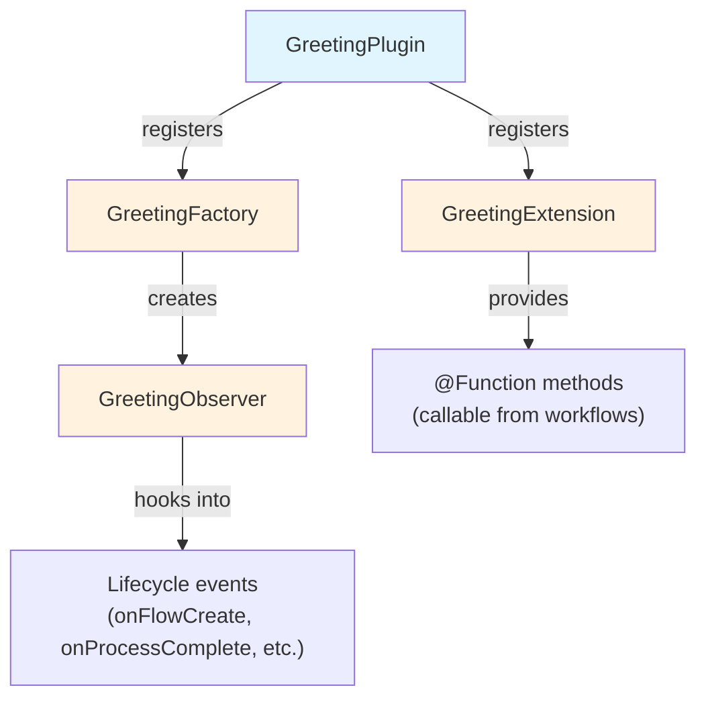

# Partie 2 : Créer un projet de plugin

<span class="ai-translation-notice">:material-information-outline:{ .ai-translation-notice-icon } Traduction assistée par IA - [en savoir plus et suggérer des améliorations](https://github.com/nextflow-io/training/blob/master/TRANSLATING.md)</span>

Vous avez vu comment les plugins étendent Nextflow avec des fonctionnalités réutilisables.
Vous allez maintenant créer le vôtre, en partant d'un modèle de projet qui gère la configuration de build pour vous.

!!! tip "Vous commencez ici ?"

    Si vous rejoignez le cours à cette partie, copiez la solution de la Partie 1 pour l'utiliser comme point de départ :

    ```bash
    cp -r solutions/1-plugin-basics/* .
    ```

!!! info "Documentation officielle"

    Cette section et celles qui suivent couvrent les éléments essentiels du développement de plugins.
    Pour des détails complets, consultez la [documentation officielle de développement de plugins Nextflow](https://www.nextflow.io/docs/latest/plugins/developing-plugins.html).

---

## 1. Créer le projet de plugin

La commande intégrée `nextflow plugin create` génère un projet de plugin complet :

```bash
nextflow plugin create nf-greeting training
```

```console title="Output"
Plugin created successfully at path: /workspaces/training/side-quests/plugin_development/nf-greeting
```

Le premier argument est le nom du plugin, et le second est le nom de votre organisation (utilisé pour organiser le code généré dans des répertoires).

!!! tip "Création manuelle"

    Vous pouvez également créer des projets de plugins manuellement ou utiliser le [modèle nf-hello](https://github.com/nextflow-io/nf-hello) sur GitHub comme point de départ.

---

## 2. Examiner la structure du projet

Un plugin Nextflow est un logiciel Groovy qui s'exécute à l'intérieur de Nextflow.
Il étend les capacités de Nextflow en utilisant des points d'intégration bien définis, ce qui lui permet de fonctionner avec les fonctionnalités de Nextflow telles que les canaux, les processus et la configuration.

Avant d'écrire du code, examinez ce que le modèle a généré afin de savoir où placer les différents éléments.

Placez-vous dans le répertoire du plugin :

```bash
cd nf-greeting
```

Listez le contenu :

```bash
tree
```

Vous devriez voir :

```console
.
├── build.gradle
├── COPYING
├── gradle
│   └── wrapper
│       ├── gradle-wrapper.jar
│       └── gradle-wrapper.properties
├── gradlew
├── Makefile
├── README.md
├── settings.gradle
└── src
    ├── main
    │   └── groovy
    │       └── training
    │           └── plugin
    │               ├── GreetingExtension.groovy
    │               ├── GreetingFactory.groovy
    │               ├── GreetingObserver.groovy
    │               └── GreetingPlugin.groovy
    └── test
        └── groovy
            └── training
                └── plugin
                    └── GreetingObserverTest.groovy

11 directories, 13 files
```

---

## 3. Explorer la configuration de build

Un plugin Nextflow est un logiciel basé sur Java qui doit être compilé et packagé avant que Nextflow puisse l'utiliser.
Cela nécessite un outil de build.

Gradle est un outil de build qui compile le code, exécute les tests et package les logiciels.
Le modèle de plugin inclut un wrapper Gradle (`./gradlew`) afin que vous n'ayez pas besoin d'installer Gradle séparément.

La configuration de build indique à Gradle comment compiler votre plugin et indique à Nextflow comment le charger.
Deux fichiers sont particulièrement importants.

### 3.1. settings.gradle

Ce fichier identifie le projet :

```bash
cat settings.gradle
```

```groovy title="settings.gradle"
rootProject.name = 'nf-greeting'
```

Le nom ici doit correspondre à ce que vous indiquerez dans `nextflow.config` lors de l'utilisation du plugin.

### 3.2. build.gradle

Le fichier de build est l'endroit où la plupart de la configuration se produit :

```bash
cat build.gradle
```

Le fichier contient plusieurs sections.
La plus importante est le bloc `nextflowPlugin` :

```groovy title="build.gradle"
plugins {
    id 'io.nextflow.nextflow-plugin' version '1.0.0-beta.10'
}

version = '0.1.0'

nextflowPlugin {
    nextflowVersion = '24.10.0'       // (1)!

    provider = 'training'             // (2)!
    className = 'training.plugin.GreetingPlugin'  // (3)!
    extensionPoints = [               // (4)!
        'training.plugin.GreetingExtension',
        'training.plugin.GreetingFactory'
    ]

}
```

1. **`nextflowVersion`** : Version minimale de Nextflow requise
2. **`provider`** : Votre nom ou celui de votre organisation
3. **`className`** : La classe principale du plugin, le point d'entrée que Nextflow charge en premier
4. **`extensionPoints`** : Les classes qui ajoutent des fonctionnalités à Nextflow (vos fonctions, la surveillance, etc.)

Le bloc `nextflowPlugin` configure :

- `nextflowVersion` : Version minimale de Nextflow requise
- `provider` : Votre nom ou celui de votre organisation
- `className` : La classe principale du plugin (le point d'entrée que Nextflow charge en premier, spécifié dans `build.gradle`)
- `extensionPoints` : Les classes qui ajoutent des fonctionnalités à Nextflow (vos fonctions, la surveillance, etc.)

### 3.3. Mettre à jour nextflowVersion

Le modèle génère une valeur `nextflowVersion` qui peut être obsolète.
Mettez-la à jour pour qu'elle corresponde à votre version de Nextflow installée afin d'assurer une compatibilité complète :

=== "Après"

    ```groovy title="build.gradle" hl_lines="2"
    nextflowPlugin {
        nextflowVersion = '25.10.0'

        provider = 'training'
    ```

=== "Avant"

    ```groovy title="build.gradle" hl_lines="2"
    nextflowPlugin {
        nextflowVersion = '24.10.0'

        provider = 'training'
    ```

---

## 4. Connaître les fichiers source

Le code source du plugin se trouve dans `src/main/groovy/training/plugin/`.
Il y a quatre fichiers source, chacun ayant un rôle distinct :

| Fichier                    | Rôle                                                                  | Modifié dans    |
| -------------------------- | --------------------------------------------------------------------- | --------------- |
| `GreetingPlugin.groovy`    | Point d'entrée que Nextflow charge en premier                         | Jamais (généré) |
| `GreetingExtension.groovy` | Définit les fonctions appelables depuis les workflows                 | Partie 3        |
| `GreetingFactory.groovy`   | Crée des instances d'observateur au démarrage d'un workflow           | Partie 5        |
| `GreetingObserver.groovy`  | Exécute du code en réponse aux événements du cycle de vie du workflow | Partie 5        |

Chaque fichier est présenté en détail dans la partie indiquée ci-dessus, au moment où vous le modifiez pour la première fois.
Les principaux à connaître :

- `GreetingPlugin` est le point d'entrée que Nextflow charge
- `GreetingExtension` fournit les fonctions que ce plugin met à disposition des workflows
- `GreetingObserver` s'exécute en parallèle du pipeline et répond aux événements sans nécessiter de modifications du code du pipeline



---

## 5. Compiler, installer et exécuter

Le modèle inclut du code fonctionnel prêt à l'emploi, vous pouvez donc le compiler et l'exécuter immédiatement pour vérifier que le projet est correctement configuré.

Compilez le plugin et installez-le localement :

```bash
make install
```

`make install` compile le code du plugin et le copie dans votre répertoire local de plugins Nextflow (`$NXF_HOME/plugins/`), le rendant disponible à l'utilisation.

??? example "Sortie du build"

    La première fois que vous exécutez cette commande, Gradle se téléchargera lui-même (cela peut prendre une minute) :

    ```console
    Downloading https://services.gradle.org/distributions/gradle-8.14-bin.zip
    ...10%...20%...30%...40%...50%...60%...70%...80%...90%...100%

    Welcome to Gradle 8.14!
    ...

    Deprecated Gradle features were used in this build...

    BUILD SUCCESSFUL in 23s
    5 actionable tasks: 5 executed
    ```

    **Les avertissements sont attendus.**

    - **"Downloading gradle..."** : Cela ne se produit que la première fois. Les builds suivants sont beaucoup plus rapides.
    - **"Deprecated Gradle features..."** : Cet avertissement provient du modèle de plugin, pas de votre code. Vous pouvez l'ignorer en toute sécurité.
    - **"BUILD SUCCESSFUL"** : C'est ce qui compte. Votre plugin a été compilé sans erreurs.

Retournez dans le répertoire du pipeline :

```bash
cd ..
```

Ajoutez le plugin nf-greeting à `nextflow.config` :

=== "Après"

    ```groovy title="nextflow.config" hl_lines="4"
    // Configuration pour les exercices de développement de plugins
    plugins {
        id 'nf-schema@2.6.1'
        id 'nf-greeting@0.1.0'
    }
    ```

=== "Avant"

    ```groovy title="nextflow.config"
    // Configuration pour les exercices de développement de plugins
    plugins {
        id 'nf-schema@2.6.1'
    }
    ```

!!! note "Version requise pour les plugins locaux"

    Lors de l'utilisation de plugins installés localement, vous devez spécifier la version (par exemple, `nf-greeting@0.1.0`).
    Les plugins publiés dans le registre peuvent utiliser uniquement le nom.

Exécutez le pipeline :

```bash
nextflow run greet.nf -ansi-log false
```

L'option `-ansi-log false` désactive l'affichage animé de la progression afin que toutes les sorties, y compris les messages de l'observateur, soient affichées dans l'ordre.

```console title="Output"
Pipeline is starting! 🚀
[bc/f10449] Submitted process > SAY_HELLO (1)
[9a/f7bcb2] Submitted process > SAY_HELLO (2)
[6c/aff748] Submitted process > SAY_HELLO (3)
[de/8937ef] Submitted process > SAY_HELLO (4)
[98/c9a7d6] Submitted process > SAY_HELLO (5)
Output: Bonjour
Output: Hello
Output: Holà
Output: Ciao
Output: Hallo
Pipeline complete! 👋
```

(L'ordre de votre sortie et les hachages des répertoires de travail seront différents.)

Les messages "Pipeline is starting !" et "Pipeline complete !" vous semblent familiers depuis le plugin nf-hello de la Partie 1, mais cette fois ils proviennent du `GreetingObserver` de votre propre plugin.
Le pipeline lui-même est inchangé ; l'observateur s'exécute automatiquement car il est enregistré dans la factory.

---

## À retenir

Vous avez appris que :

- La commande `nextflow plugin create` génère un projet de démarrage complet
- `build.gradle` configure les métadonnées du plugin, les dépendances et les classes qui fournissent des fonctionnalités
- Le plugin comporte quatre composants principaux : Plugin (point d'entrée), Extension (fonctions), Factory (crée les moniteurs) et Observer (répond aux événements du workflow)
- Le cycle de développement est le suivant : modifier le code, `make install`, exécuter le pipeline

---

## Et ensuite ?

Vous allez maintenant implémenter des fonctions personnalisées dans la classe Extension et les utiliser dans le workflow.

[Continuer vers la Partie 3 :material-arrow-right:](03_custom_functions.md){ .md-button .md-button--primary }
