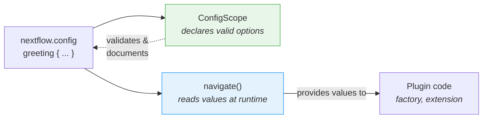

# Partie 6 : Configuration

<span class="ai-translation-notice">:material-information-outline:{ .ai-translation-notice-icon } Traduction assistée par IA - [en savoir plus et suggérer des améliorations](https://github.com/nextflow-io/training/blob/master/TRANSLATING.md)</span>

Votre plugin dispose de fonctions personnalisées et d'un observer, mais tout est codé en dur.
Les utilisateur·trices ne peuvent pas désactiver le compteur de tâches, ni modifier le décorateur, sans éditer le code source et recompiler.

Dans la Partie 1, vous avez utilisé les blocs `#!groovy validation {}` et `#!groovy co2footprint {}` dans `nextflow.config` pour contrôler le comportement de nf-schema et nf-co2footprint.
Ces blocs de configuration existent parce que les auteur·trices du plugin ont intégré cette fonctionnalité.
Dans cette section, vous ferez de même pour votre propre plugin.

**Objectifs :**

1. Permettre aux utilisateur·trices de personnaliser le préfixe et le suffixe du décorateur de message d'accueil
2. Permettre aux utilisateur·trices d'activer ou de désactiver le plugin via `nextflow.config`
3. Enregistrer un scope de configuration formel afin que Nextflow reconnaisse le bloc `#!groovy greeting {}`

**Ce que vous allez modifier :**

| Fichier                    | Modification                                                    |
| -------------------------- | --------------------------------------------------------------- |
| `GreetingExtension.groovy` | Lire la configuration préfixe/suffixe dans `init()`            |
| `GreetingFactory.groovy`   | Lire les valeurs de configuration pour contrôler la création de l'observer |
| `GreetingConfig.groovy`    | Nouveau fichier : classe formelle `@ConfigScope`                |
| `build.gradle`             | Enregistrer la classe de configuration comme point d'extension  |
| `nextflow.config`          | Ajouter un bloc `#!groovy greeting {}` pour le tester           |

!!! tip "Astuce"

    Si vous commencez à partir de cette partie, copiez la solution de la Partie 5 comme point de départ :

    ```bash
    cp -r solutions/5-observers/* .
    ```

!!! info "Documentation officielle"

    Pour des détails complets sur la configuration, consultez la [documentation des scopes de configuration Nextflow](https://nextflow.io/docs/latest/developer/config-scopes.html).

---

## 1. Rendre le décorateur configurable

La fonction `decorateGreeting` enveloppe chaque message d'accueil dans `*** ... ***`.
Les utilisateur·trices pourraient souhaiter des marqueurs différents, mais pour l'instant la seule façon de les modifier est d'éditer le code source et de recompiler.

La session Nextflow fournit une méthode appelée `session.config.navigate()` qui lit les valeurs imbriquées depuis `nextflow.config` :

```groovy
// Lit 'greeting.prefix' depuis nextflow.config, avec '***' comme valeur par défaut
final prefix = session.config.navigate('greeting.prefix', '***') as String
```

Cela correspond à un bloc de configuration dans le `nextflow.config` de l'utilisateur·trice :

```groovy title="nextflow.config"
greeting {
    prefix = '>>>'
}
```

### 1.1. Ajouter la lecture de la configuration (cela va échouer !)

Modifiez `GreetingExtension.groovy` pour lire la configuration dans `init()` et l'utiliser dans `decorateGreeting()` :

```groovy title="GreetingExtension.groovy" linenums="35" hl_lines="7-8 18"
@CompileStatic
class GreetingExtension extends PluginExtensionPoint {

    @Override
    protected void init(Session session) {
        // Lit la configuration avec les valeurs par défaut
        prefix = session.config.navigate('greeting.prefix', '***') as String
        suffix = session.config.navigate('greeting.suffix', '***') as String
    }

    // ... autres méthodes inchangées ...

    /**
    * Décore un message d'accueil avec des marqueurs festifs
    */
    @Function
    String decorateGreeting(String greeting) {
        return "${prefix} ${greeting} ${suffix}"
    }
```

Essayez de compiler :

```bash
cd nf-greeting && make assemble
```

### 1.2. Observer l'erreur

La compilation échoue :

```console
> Task :compileGroovy FAILED
GreetingExtension.groovy: 30: [Static type checking] - The variable [prefix] is undeclared.
 @ line 30, column 9.
           prefix = session.config.navigate('greeting.prefix', '***') as String
           ^

GreetingExtension.groovy: 31: [Static type checking] - The variable [suffix] is undeclared.
```

En Groovy (et en Java), vous devez _déclarer_ une variable avant de l'utiliser.
Le code tente d'assigner des valeurs à `prefix` et `suffix`, mais la classe ne possède aucun champ portant ces noms.

### 1.3. Corriger en déclarant des variables d'instance

Ajoutez les déclarations de variables en haut de la classe, juste après l'accolade ouvrante :

```groovy title="GreetingExtension.groovy" linenums="35" hl_lines="4-5"
@CompileStatic
class GreetingExtension extends PluginExtensionPoint {

    private String prefix = '***'
    private String suffix = '***'

    @Override
    protected void init(Session session) {
        // Lit la configuration avec les valeurs par défaut
        prefix = session.config.navigate('greeting.prefix', '***') as String
        suffix = session.config.navigate('greeting.suffix', '***') as String
    }

    // ... reste de la classe inchangé ...
```

Ces deux lignes déclarent des **variables d'instance** (également appelées champs) qui appartiennent à chaque objet `GreetingExtension`.
Le mot-clé `private` signifie que seul le code à l'intérieur de cette classe peut y accéder.
Chaque variable est initialisée avec la valeur par défaut `'***'`.

Lorsque le plugin se charge, Nextflow appelle la méthode `init()`, qui remplace ces valeurs par défaut par ce que l'utilisateur·trice a défini dans `nextflow.config`.
Si rien n'a été défini, `navigate()` retourne la même valeur par défaut, donc le comportement reste inchangé.
La méthode `decorateGreeting()` lit ensuite ces champs à chaque exécution.

!!! tip "Apprendre de ses erreurs"

    Ce schéma « déclarer avant d'utiliser » est fondamental en Java/Groovy, mais peut être déroutant si vous venez de Python ou R, où les variables sont créées dès leur première affectation.
    Rencontrer cette erreur une fois vous aidera à la reconnaître et à la corriger rapidement à l'avenir.

### 1.4. Compiler et tester

Compilez et installez :

```bash
make install && cd ..
```

Mettez à jour `nextflow.config` pour personnaliser la décoration :

=== "Après"

    ```groovy title="nextflow.config" hl_lines="7-10"
    // Configuration pour les exercices de développement de plugin
    plugins {
        id 'nf-schema@2.6.1'
        id 'nf-greeting@0.1.0'
    }

    greeting {
        prefix = '>>>'
        suffix = '<<<'
    }
    ```

=== "Avant"

    ```groovy title="nextflow.config"
    // Configuration pour les exercices de développement de plugin
    plugins {
        id 'nf-schema@2.6.1'
        id 'nf-greeting@0.1.0'
    }
    ```

Exécutez le pipeline :

```bash
nextflow run greet.nf -ansi-log false
```

```console title="Output (partial)"
Decorated: >>> Hello <<<
Decorated: >>> Bonjour <<<
...
```

Le décorateur utilise désormais le préfixe et le suffixe personnalisés définis dans le fichier de configuration.

Notez que Nextflow affiche un avertissement "Unrecognized config option" car rien n'a encore déclaré `greeting` comme scope valide.
La valeur est tout de même lue correctement via `navigate()`, mais Nextflow la signale comme non reconnue.
Vous corrigerez cela dans la Section 3.

---

## 2. Rendre le compteur de tâches configurable

La factory d'observers crée actuellement des observers de manière inconditionnelle.
Les utilisateur·trices devraient pouvoir désactiver entièrement le plugin via la configuration.

La factory a accès à la session Nextflow et à sa configuration, c'est donc l'endroit approprié pour lire le paramètre `enabled` et décider si des observers doivent être créés.

=== "Après"

    ```groovy title="GreetingFactory.groovy" linenums="31" hl_lines="3-4"
    @Override
    Collection<TraceObserver> create(Session session) {
        final enabled = session.config.navigate('greeting.enabled', true)
        if (!enabled) return []

        return [
            new GreetingObserver(),
            new TaskCounterObserver()
        ]
    }
    ```

=== "Avant"

    ```groovy title="GreetingFactory.groovy" linenums="31"
    @Override
    Collection<TraceObserver> create(Session session) {
        return [
            new GreetingObserver(),
            new TaskCounterObserver()
        ]
    }
    ```

La factory lit désormais `greeting.enabled` depuis la configuration et retourne une liste vide si l'utilisateur·trice l'a défini à `false`.
Lorsque la liste est vide, aucun observer n'est créé, et les hooks du cycle de vie du plugin sont silencieusement ignorés.

### 2.1. Compiler et tester

Recompilez et installez le plugin :

```bash
cd nf-greeting && make install && cd ..
```

Exécutez le pipeline pour confirmer que tout fonctionne toujours :

```bash
nextflow run greet.nf -ansi-log false
```

??? exercise "Désactiver entièrement le plugin"

    Essayez de définir `greeting.enabled = false` dans `nextflow.config` et exécutez à nouveau le pipeline.
    Qu'est-ce qui change dans la sortie ?

    ??? solution "Solution"

        ```groovy title="nextflow.config" hl_lines="8"
        // Configuration pour les exercices de développement de plugin
        plugins {
            id 'nf-schema@2.6.1'
            id 'nf-greeting@0.1.0'
        }

        greeting {
            enabled = false
        }
        ```

        Les messages "Pipeline is starting!", "Pipeline complete!" et le compteur de tâches disparaissent tous, car la factory retourne une liste vide lorsque `enabled` est à false.
        Le pipeline lui-même continue de s'exécuter, mais aucun observer n'est actif.

        N'oubliez pas de remettre `enabled` à `true` (ou de supprimer la ligne) avant de continuer.

---

## 3. Configuration formelle avec ConfigScope

La configuration de votre plugin fonctionne, mais Nextflow affiche toujours des avertissements "Unrecognized config option".
C'est parce que `session.config.navigate()` se contente de lire des valeurs ; rien n'a indiqué à Nextflow que `greeting` est un scope de configuration valide.

Une classe `ConfigScope` comble ce manque.
Elle déclare les options acceptées par votre plugin, leurs types et leurs valeurs par défaut.
Elle ne **remplace pas** vos appels à `navigate()`. Elle fonctionne en parallèle :



Sans classe `ConfigScope`, `navigate()` fonctionne quand même, mais :

- Nextflow avertit des options non reconnues (comme vous l'avez constaté)
- Pas d'autocomplétion dans l'IDE pour les utilisateur·trices qui écrivent `nextflow.config`
- Les options de configuration ne sont pas auto-documentées
- La conversion de types est manuelle (`as String`, `as boolean`)

L'enregistrement d'une classe de scope de configuration formelle corrige l'avertissement et résout ces trois problèmes.
C'est le même mécanisme qui se cache derrière les blocs `#!groovy validation {}` et `#!groovy co2footprint {}` que vous avez utilisés dans la Partie 1.

### 3.1. Créer la classe de configuration

Créez un nouveau fichier :

```bash
touch nf-greeting/src/main/groovy/training/plugin/GreetingConfig.groovy
```

Ajoutez la classe de configuration avec les trois options :

```groovy title="GreetingConfig.groovy" linenums="1"
package training.plugin

import nextflow.config.spec.ConfigOption
import nextflow.config.spec.ConfigScope
import nextflow.config.spec.ScopeName
import nextflow.script.dsl.Description

/**
 * Options de configuration pour le plugin nf-greeting.
 *
 * Les utilisateur·trices les configurent dans nextflow.config :
 *
 *     greeting {
 *         enabled = true
 *         prefix = '>>>'
 *         suffix = '<<<'
 *     }
 */
@ScopeName('greeting')                       // (1)!
class GreetingConfig implements ConfigScope { // (2)!

    GreetingConfig() {}

    GreetingConfig(Map opts) {               // (3)!
        this.enabled = opts.enabled as Boolean ?: true
        this.prefix = opts.prefix as String ?: '***'
        this.suffix = opts.suffix as String ?: '***'
    }

    @ConfigOption                            // (4)!
    @Description('Enable or disable the plugin entirely')
    boolean enabled = true

    @ConfigOption
    @Description('Prefix for decorated greetings')
    String prefix = '***'

    @ConfigOption
    @Description('Suffix for decorated greetings')
    String suffix = '***'
}
```

1. Correspond au bloc `#!groovy greeting { }` dans `nextflow.config`
2. Interface requise pour les classes de configuration
3. Les constructeurs sans argument et avec Map sont tous deux nécessaires pour que Nextflow puisse instancier la configuration
4. `@ConfigOption` marque un champ comme option de configuration ; `@Description` le documente pour les outils

Points clés :

- **`@ScopeName('greeting')`** : Correspond au bloc `greeting { }` dans la configuration
- **`implements ConfigScope`** : Interface requise pour les classes de configuration
- **`@ConfigOption`** : Chaque champ devient une option de configuration
- **`@Description`** : Documente chaque option pour la prise en charge par le serveur de langage (importé depuis `nextflow.script.dsl`)
- **Constructeurs** : Les constructeurs sans argument et avec Map sont tous deux nécessaires

### 3.2. Enregistrer la classe de configuration

Créer la classe ne suffit pas.
Nextflow doit savoir qu'elle existe, vous devez donc l'enregistrer dans `build.gradle` aux côtés des autres points d'extension.

=== "Après"

    ```groovy title="build.gradle" hl_lines="4"
    extensionPoints = [
        'training.plugin.GreetingExtension',
        'training.plugin.GreetingFactory',
        'training.plugin.GreetingConfig'
    ]
    ```

=== "Avant"

    ```groovy title="build.gradle"
    extensionPoints = [
        'training.plugin.GreetingExtension',
        'training.plugin.GreetingFactory'
    ]
    ```

Notez la différence entre l'enregistrement de la factory et celui des points d'extension :

- **`extensionPoints` dans `build.gradle`** : Enregistrement à la compilation. Indique au système de plugins Nextflow quelles classes implémentent des points d'extension.
- **Méthode `create()` de la factory** : Enregistrement à l'exécution. La factory crée des instances d'observer lorsqu'un workflow démarre réellement.

### 3.3. Compiler et tester

```bash
cd nf-greeting && make install && cd ..
nextflow run greet.nf -ansi-log false
```

Le comportement du pipeline est identique, mais l'avertissement "Unrecognized config option" a disparu.

!!! note "Ce qui a changé et ce qui n'a pas changé"

    Votre `GreetingFactory` et votre `GreetingExtension` utilisent toujours `session.config.navigate()` pour lire les valeurs à l'exécution.
    Aucun de ces codes n'a changé.
    La classe `ConfigScope` est une déclaration parallèle qui indique à Nextflow quelles options existent.
    Les deux éléments sont nécessaires : `ConfigScope` déclare, `navigate()` lit.

Votre plugin possède désormais la même structure que les plugins que vous avez utilisés dans la Partie 1.
Lorsque nf-schema expose un bloc `#!groovy validation {}` ou que nf-co2footprint expose un bloc `#!groovy co2footprint {}`, ils utilisent exactement ce schéma : une classe `ConfigScope` avec des champs annotés, enregistrée comme point d'extension.
Votre bloc `#!groovy greeting {}` fonctionne de la même façon.

---

## À retenir

Vous avez appris que :

- `session.config.navigate()` **lit** les valeurs de configuration à l'exécution
- Les classes `@ConfigScope` **déclarent** quelles options de configuration existent ; elles fonctionnent en parallèle de `navigate()`, et non à sa place
- La configuration peut être appliquée à la fois aux observers et aux fonctions d'extension
- Les variables d'instance doivent être déclarées avant utilisation en Groovy/Java ; `init()` les alimente depuis la configuration au chargement du plugin

| Cas d'usage                                    | Approche recommandée                                                    |
| ---------------------------------------------- | ----------------------------------------------------------------------- |
| Prototype rapide ou plugin simple              | `session.config.navigate()` uniquement                                  |
| Plugin de production avec de nombreuses options | Ajouter une classe `ConfigScope` aux côtés de vos appels `navigate()`  |
| Plugin destiné à être partagé publiquement     | Ajouter une classe `ConfigScope` aux côtés de vos appels `navigate()`  |

---

## Et ensuite ?

Votre plugin dispose désormais de tous les éléments d'un plugin de production : des fonctions personnalisées, des trace observers et une configuration accessible aux utilisateur·trices.
La dernière étape consiste à le préparer pour la distribution.

[Continuer vers le Résumé :material-arrow-right:](summary.md){ .md-button .md-button--primary }
