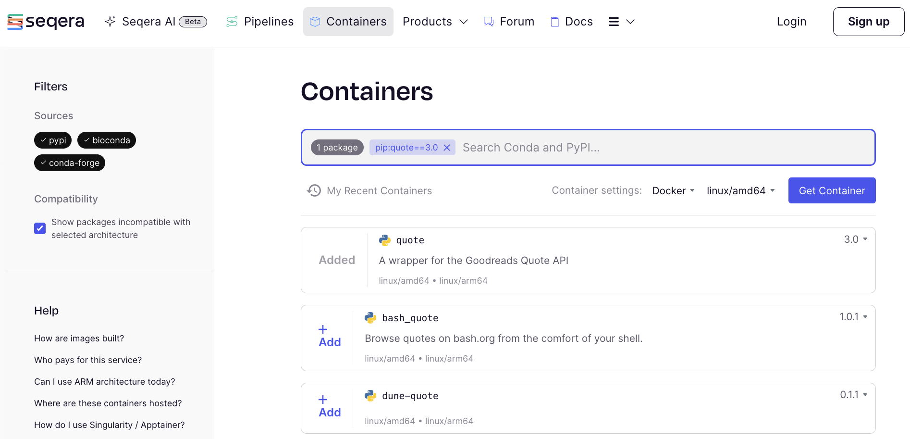
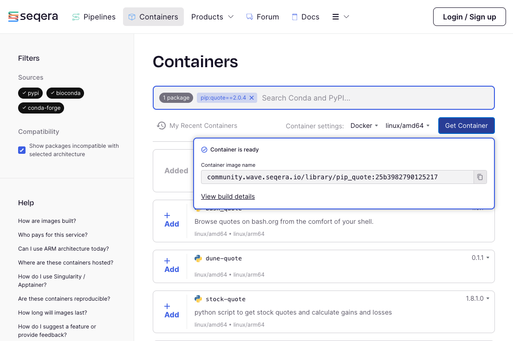

# Part 2: Hello Containers

In Part 1, you learned how to use the basic building blocks of Nextflow to assemble a simple pipeline capable of processing some text and parallelizing execution if there were multiple inputs.

However, you were limited to basic UNIX tools available in your environment.
Real-world tasks often require various tools and packages not included by default.
Typically, you'd need to install these tools, manage their dependencies, and resolve any conflicts.

That is all very tedious and annoying, so we're going to show you how to use **containers** to solve this problem much more conveniently.

!!! Note

    We'll be teaching this using the technology [Docker](https://www.docker.com/get-started/), but Nextflow supports [several other container technologies](https://www.nextflow.io/docs/latest/container.html#) as well.

---

## 1. Use a container directly

A **container** is a lightweight, standalone, executable unit of software created from a container **image** that includes everything needed to run an application including code, system libraries and settings.
To use a container you usually download or "pull" a container image from a container registry, and then run the container image to create a container instance.

### 1.1. Pull the container image

Let's pull a container image that contains the `cowsay` command so we can use it to display some text in a fun way.

```bash
docker pull 'community.wave.seqera.io/library/pip_cowsay:131d6a1b707a8e65'
```

### 1.2 Use the container to execute a single command

The `docker run` command is used to spin up a container instance from a container image and execute a command in it.
The `--rm` flag tells Docker to remove the container instance after the command has completed.

```bash
docker run --rm 'community.wave.seqera.io/library/pip_cowsay:131d6a1b707a8e65' cowsay -t "Hello World"
```

```console title="Output"
 _____________
< Hello World >
 -------------
        \   ^__^
         \  (oo)\_______
            (__)\       )\/\
                ||----w |
                ||     ||
```

### 1.2. Spin up the container interactively

You can also run a container interactively, which will give you a shell prompt inside the container.

```bash
docker run --rm -it 'community.wave.seqera.io/library/pip_cowsay:131d6a1b707a8e65' /bin/bash
```

Notice that the prompt has changed to `(base) root@b645838b3314:/tmp#`, which indicates that you are now inside the container.
If we run:

```console title="Output"
(base) root@b645838b3314:/tmp# ls /
bin    dev    etc    home   lib    media  mnt    opt    proc   root   run    sbin   srv    sys    tmp    usr    var
```

You can see that the filesystem inside the container is different from the filesystem on your host system.

### 1.3. Run the command

Now that you are inside the container, you can run the `cowsay` command directly.

!!! Tip

    Us the '-c' flag to pick a different "cow" from this list:
    `beavis`, `cheese`, `cow`, `daemon`, `dragon`, `fox`, `ghostbusters`, `kitty`, `meow`, `miki`, `milk`, `octopus`, `pig`, `stegosaurus`, `stimpy`, `trex`, `turkey`, `turtle`, `tux`

```bash
cowsay -t "Hello World" -c tux
```

Output:

```console title="Output"
  ___________
| Hello World |
  ===========
                \
                 \
                  \
                   .--.
                  |o_o |
                  |:_/ |
                 //   \ \
                (|     | )
               /'\_   _/`\
               \___)=(___/
```

### 1.4. Exit the container

To exit the container, you can type `exit` at the prompt or use the ++ctrl+d++ keyboard shortcut.

```bash
exit
```

Your prompt should now be back to what it was before you started the container.

### 1.5. Mounting data into containers

When you run a container, it is isolated from the host system by default.
This means that the container can't access any files on the host system unless you explicitly tell it to.
One way to do this is to **mount** a **volume** from the host system into the container.

Prior to working on the next task, confirm that you are in the `hello-nextflow` directory. Thelast part of the path shown when you type `pwd` should be `hello-nextflow`.

Then run:

```bash
docker run --rm -it -v $(pwd)/containers/data:/data 'community.wave.seqera.io/library/pip_cowsay:131d6a1b707a8e65' /bin/bash
```

Let's explore the contents of the container.
Note that we need to navigate to the `/data` directory inside the container to see the contents of the `data` directory on the host system.

```console title="Output"
(base) root@08dd2d3efbd4:/tmp# ls
conda.yml  environment.lock
(base) root@08dd2d3efbd4:/tmp# cd /data
(base) root@08dd2d3efbd4:/data# ls
greetings.csv  pioneers.csv
```

### 1.6. Use the mounted data

Now that we have mounted the `data` directory into the container, we can use the `cowsay` command to display the contents of the `greetings.csv` file.
To do this we'll use the syntax `-t "$(cat data/greetings.csv)"` to output the contents of the file into the `cowsay` command.

```bash
cowsay -t "$(cat /data/greetings.csv)" -c pig
```

Output:

```console title="Output"
  __________________
| Hello,Bonjour,Holà |
  ==================
                  \
                   \
                    \
                     \
                               ,.
                              (_|,.
                              ,' /, )_______   _
                          __j o``-'        `.'-)'
                          (")                 \'
                          `-j                |
                            `-._(           /
                               |_\  |--^.  /
                              /_]'|_| /_)_/
                                  /_]'  /_]'
```

Now exit the container once again:

```bash
exit
```

### Takeaway

You know how to pull a container and run it interactively, make your data accessible to it, which lets you try commands without having to install any software on your system.

### What's next?

Learn how to get a container image for any pip/conda-installable tool.

---

## 2. Use containers in Nextflow

Nextflow has built-in support for running processes inside containers to let you run tools you don't have installed in your compute environment.
This means that you can use any container image you like to run your processes, and Nextflow will take care of pulling the image, mounting the data, and running the process inside it.

### 2.1. Add a container directive to your process

Edit the `hello-containers.nf` script to add a `container` directive to the `cowsay` process.

_Before:_

```groovy title="hello-containers.nf"
process cowSay {

    publishDir 'containers/results', mode: 'copy'
```

_After:_

```groovy title="hello-containers.nf"
process cowSay {

    publishDir 'containers/results', mode: 'copy'
    container 'community.wave.seqera.io/library/pip_cowsay:131d6a1b707a8e65'
```

### 2.2. Run Nextflow pipelines using containers

Run the script to see the container in action.

```bash
nextflow run hello-containers.nf
```

!!! NOTE

    The `nextflow.config` in our current working directory contains `docker.enabled = true`, which tells Nextflow to use Docker to run processes.
    Without that configuration we would have to specify the `-with-docker` flag when running the script.

### 2.3. Check the results

You should see a new directory called `containers/results` that contains the output of the `cowsay` process.

```console title="containers/results/cowsay-output-Bonjour.txt"
  _______
| Bonjour |
  =======
       \
        \
          ^__^
          (oo)\_______
          (__)\       )\/\
              ||----w |
              ||     ||
```

### 2.4. Explore how Nextflow launched the containerized task

Let's take a look at the task directory for one of the cowsay tasks to see how Nextflow works with containers under the hood.

Check the output from your `nextflow run` command to find the task ID for the `cowsay` process.
Then check out the task directory for that task.

```bash
tree -a work/8c/738ac55b80e7b6170aa84a68412454
work/8c/738ac55b80e7b6170aa84a68412454
├── .command.begin
├── .command.err
├── .command.log
├── .command.out
├── .command.run
├── .command.sh
├── .exitcode
├── cowsay-output-Bonjour.txt
└── output-Bonjour.txt -> /workspace/gitpod/nf-training/hello-nextflow/work/0e/e96c123cb7ae9ff7b7bed1c5444009/output-Bonjour.txt

1 directory, 9 files
```

Open the `.command.run` file which holds all the busywork that Nextflow does under the hood.

```bash
code work/8c/738ac55b80e7b6170aa84a68412454/.command.run
```

Search for `nxf_launch` and you should see something like this:

```bash
nxf_launch() {
    docker run -i --cpu-shares 1024 -e "NXF_TASK_WORKDIR" -v /workspace/gitpod/nf-training/hello-nextflow/work:/workspace/gitpod/nf-training/hello-nextflow/work -w "$NXF_TASK_WORKDIR" --name $NXF_BOXID community.wave.seqera.io/library/pip_cowsay:131d6a1b707a8e65 /bin/bash -ue /workspace/gitpod/nf-training/hello-nextflow/work/8c/738ac55b80e7b6170aa84a68412454/.command.sh
}
```

As you can see, Nextflow is using the `docker run` command to launch the task.
It also mounts the task's working directory into the container, sets the working directory inside the container to the task's working directory, and runs our templated bash script in the `.command.sh` file.
All the hard work we learned about in the previous sections is done for us by Nextflow!

### Takeaway

You know how to use containers in Nextflow to run processes.

### What's next?

You have everything you need to continue to the [next chapter](./04_hello_genomics.md) of this training series.
Optionally, continue on to learn how to get container images for tools you want to use in your Nextflow pipelines.

---

## 3. Optional Topic: How to find or make container images

Some software developers provide container images for their software that are available on container registries like Docker Hub, but many do not.
In this optional section, we'll show you to two ways to get a container image for tools you want to use in your Nextflow pipelines: using Seqera Containers and building the container image yourself.

You'll be getting/building a container image for the `quote` pip package, which will be used in the exercise at the end of this section.

### 3.1. Get a container image from Seqera Containers

Seqera Containers is a free service that builds container images for pip and conda (including bioconda) installable tools.
Navigate to [Seqera Containers](https://www.seqera.io/containers/) and search for the `quote` pip package.



Click on "+Add" and then "Get Container" to request a container image for the `quote` pip package.



If this is the first time a community container has been built for this version of the package, it may take a few minutes to complete.
Click to copy the URI (e.g. `community.wave.seqera.io/library/pip_quote:ae07804021465ee9`) of the container image that was created for you.

You can now use the container image to run the `quote` command and get a random saying from Grace Hopper.

```bash
docker run --rm community.wave.seqera.io/library/pip_quote:ae07804021465ee9 quote "Grace Hopper"
```

Output:

```console title="Output"
Humans are allergic to change. They love to say, 'We've always done it
this way.' I try to fight that. That's why I have a clock on my wall
that runs counter-clockwise.
```

### 3.2. Build the container image yourself

Let's use some build details from the Seqera Containers website to build the container image for the `quote` pip package ourselves.
Return to the Seqera Containers website and click on the "Build Details" button.

The first item we'll look at is the `Dockerfile`, a type of script file that contains all the commands needed to build the container image.
We've added some explanatory comments to the Dockerfile below to help you understand what each part does.

```Dockerfile title="Dockerfile"
# Start from the micromamba base docker image
FROM mambaorg/micromamba:1.5.10-noble
# Copy the conda.yml file into the container
COPY --chown=$MAMBA_USER:$MAMBA_USER conda.yml /tmp/conda.yml
# Install various utilities for Nextflow to use and the packages in the conda.yml file
RUN micromamba install -y -n base -f /tmp/conda.yml \
    && micromamba install -y -n base conda-forge::procps-ng \
    && micromamba env export --name base --explicit > environment.lock \
    && echo ">> CONDA_LOCK_START" \
    && cat environment.lock \
    && echo "<< CONDA_LOCK_END" \
    && micromamba clean -a -y
# Run the container as the root user
USER root
# Set the PATH environment variable to include the micromamba installation directory
ENV PATH="$MAMBA_ROOT_PREFIX/bin:$PATH"
```

The second item we'll look at is the `conda.yml` file, which contains the list of packages that need to be installed in the container image.

```conda.yml title="conda.yml"
channels:
- conda-forge
- bioconda
dependencies:
- pip
- pip:
  - quote==3.0.0 #
```

Copy the contents of these files into the stubs located in the `containers/build` directory, then run the following command to build the container image yourself.

!!! Note

    We use the `-t quote:latest` flag to tag the container image with the name `quote` and the tag `latest`.
    We will be able to use this tag to refer to the container image when running it on this system.

```bash
docker build -t quote:latest containers/build
```

After it has finished building, you can run the container image you just built.

```bash
docker run --rm quote:latest quote "Margaret Oakley Dayhoff"
```

### Takeaway

You've learned two different ways to get a container image for a tool you want to use in your Nextflow pipelines: using Seqera Containers and building the container image yourself.

### What's next?

You have everything you need to continue to the [next chapter](./04_hello_genomics.md) of this training series.
You can also continue on with an optional exercise to fetch quotes on computer/biology pioneers using the `quote` container and output them using the `cowsay` container.

---

## 4. Bonus Exercise: Make the cow quote famous scientists

This section contains some stretch exercises, to practice what you've learned so far.
Doing these exercises is _not required_ to understand later parts of the training, but provide a fun way to reinforce your learnings by figuring out how to make the cow quote famous scientists.

```console title="cowsay-output-Grace-Hopper.txt"
  _________________________________________________
 /                                                 \
| Humans are allergic to change. They love to       |
| say, 'We've always done it this way.' I try to fi |
| ght that. That's why I have a clock on my wall th |
| at runs counter-clockwise.                        |
| -Grace Hopper                                     |
 \                                                 /
  =================================================
                                                 \
                                                  \
                                                    ^__^
                                                    (oo)\_______
                                                    (__)\       )\/\
                                                        ||----w |
                                                        ||     ||
```

### 4.1. Modify the `hello-containers.nf` script to use a getQuote process

We have a list of computer and biology pioneers in the `containers/data/pioneers.csv` file.
At a high level, to complete this exercise you will need to:

-   Modify the default `params.input_file` to point to the `pioneers.csv` file.
-   Create a `getQuote` process that uses the `quote` container to fetch a quote for each input.
-   Connect the output of the `getQuote` process to the `cowsay` process to display the quote.

For the `quote` container image, you can either use the one you built yourself in the previous stretch exercise or use the one you got from Seqera Containers .

!!! Hint

    A good choice for the `script` block of your getQuote process might be:
        ```groovy
        script:
            def safe_author = author.tokenize(' ').join('-')
            """
            quote "$author" > quote-${safe_author}.txt
            echo "-${author}" >> quote-${safe_author}.txt
            """
        ```

You can find a solution to this exercise in `containers/solutions/hello-containers-4.1.nf`.

### 4.2. Modify your Nextflow pipeline to allow it to execute in `quote` and `sayHello` modes.

Add some branching logic using to your pipeline to allow it to accept inputs intended for both `quote` and `sayHello`.
Here's an example of how to use an `if` statement in a Nextflow workflow:

```groovy title="hello-containers.nf"
workflow {
    if (params.quote) {
        ...
    }
    else {
        ...
    }
    cowSay(text_ch)
}
```

!!! Hint

    You can use `new_ch = processName.out` to assign a name to the output channel of a process.

You can find a solution to this exercise in `containers/solutions/hello-containers-4.2.nf`.

### Takeaway

You know how to use containers in Nextflow to run processes, and how to build some branching logic into your pipelines!

### What's next?

Celebrate, take a stretch break and drink some water!

When you are ready, move on to Part 3 of this training series to learn how to apply what you've learned so far to a more realistic data analysis use case.
