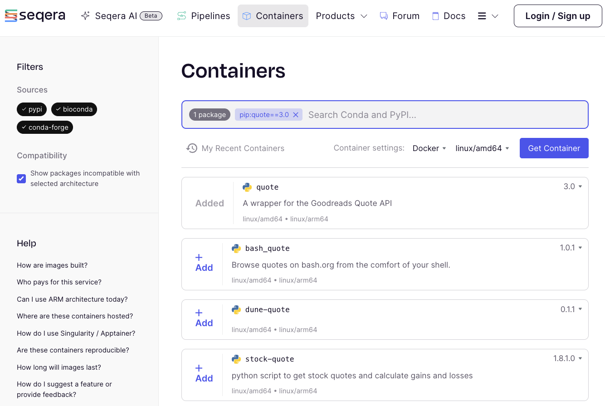
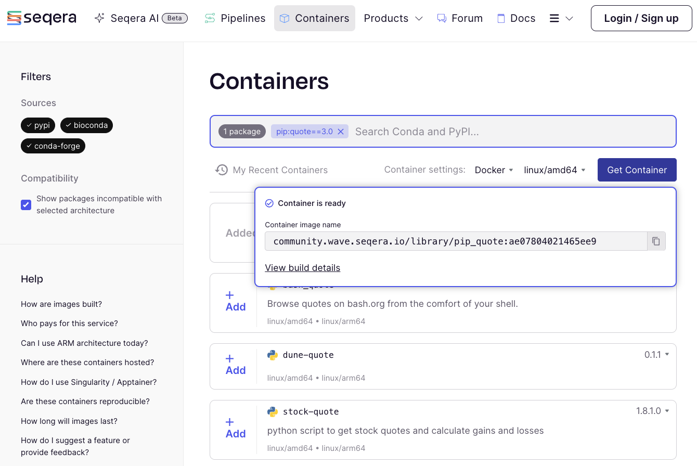

# Part 2: Hello Containers

In Part 1, you learned how to use the basic building blocks of Nextflow to assemble a simple pipeline capable of processing some text and parallelizing execution if there were multiple inputs.

However, you were limited to utilizing only basic UNIX tools that were already installed in your computing environment.
Real-world work typically requires you to use all sorts of tools and packages that don't come standard.
Usually you'd have to figure out how to install all of the necessary tools and their software dependencies, as well as manage any conflicts that may arise between dependencies that aren't compatible with each other.

That is all very tedious and annoying, so we're going to show you how to use **containers** to solve this problem much more conveniently.

---

## 1. Use a container directly [basics]

A **container** is a lightweight, standalone, executable unit of software created from a container **image** that includes everything needed to run an application including code, system libraries and settings.
To use a container you usually download or "pull" a container image from a container registry, and then run the container image to create a container instance.

### 1.1. Pull the container image

```bash
docker pull rancher/cowsay
```

### 1.2 Use the container to execute a single command

The `docker run` command is used to spin up a container instance from a container image and execute a command in it.
The `--rm` flag tells Docker to remove the container instance after the command has completed.

```bash
docker run --rm rancher/cowsay "Hello World"
```

```console title="Output"
 _____________
< Hello World >
 -------------
        \   ^__^
         \  (oo)\_______
            (__)\       )\/\
                ||----w |
                ||     ||
```

### 1.2. Spin up the container interactively

You can also run a container interactively, which will give you a shell prompt inside the container.
The `--entrypoint` flag allows you to specify the command that should be run when the container starts up.

```bash
docker run --rm -it --entrypoint /bin/sh  rancher/cowsay
```

Notice that the prompt has changed to `/ #`, which indicates that you are now inside the container.
If we run:

```console title="Output"
/ # ls
bin    dev    etc    home   lib    media  mnt    opt    proc   root   run    sbin   srv    sys    tmp    usr    var
```

You can see that the filesystem inside the container is different from the filesystem on your host system.

### 1.3. Run the command

Now that you are inside the container, you can run the `cowsay` command directly.

```bash
cowsay "Hello World"
```

Output:

```console title="Output"
 _____________
< Hello World >
 -------------
        \   ^__^
         \  (oo)\_______
            (__)\       )\/\
                ||----w |
                ||     ||
```

This should complete immediately, and you should now see a file called `<file>` in your working directory.

### 1.4. Exit the container

To exit the container, you can type `exit` at the prompt.

```bash
exit
```

Your prompt should now be back to what it was before you started the container.

### Takeaway

You know how to pull a container and run it interactively, and you know how to use that to try out commands without having to install any software on your system.

### What's next?

Learn how to make data from your host system available to a container.

## 2. Mounting data into containers

When you run a container, it is isolated from the host system by default.
This means that the container can't access any files on the host system unless you explicitly tell it to.
One way to do this is to **mount** a **volume** from the host system into the container.

Prior to working on the next section, confirm that you are in the `hello-nextflow` directory.

```bash
cd /workspace/gitpod/nf-training/hello-nextflow
```

### 2.1. Launch the container interactively with a mounted volume

```bash
docker run --rm -it --entrypoint /bin/sh -v $(pwd)/data:/data rancher/cowsay
```

This command mounts the `data` directory in the current working directory on the host system into the `/data` directory inside the container.
We can explore the contents of the `/data` directory inside the container:

```console title="Output"
/ # ls
bin    data   dev    etc    home   lib    media  mnt    opt    proc   root   run    sbin   srv    sys    tmp    usr    var
/ # ls data
bam              greetings.csv    ref              sample_bams.txt  samplesheet.csv
```

### 2.2. Use the mounted data

Now that we have mounted the `data` directory into the container, we can use the `cowsay` command to display the contents of the `greetings.csv` file.

```bash
cat data/greetings.csv | cowsay
```

Output:

```console title="Output"
 _____________________
< Hello,Bonjour,Holà >
 ---------------------
        \   ^__^
         \  (oo)\_______
            (__)\       )\/\
                ||----w |
                ||     ||
/ # exit
```

### Takeaway

You know how to pull a container and run it interactively, and you know how to use that to try out commands without having to install any software on your system.

### What's next?

Learn how to get a container image for any pip/conda-installable tool.

---

## 2. Get a container image for a pip/conda-installable tool

Some software developers provide container images for their software that are available on container registries like Docker Hub, but many do not.
New Docker images can be created by writing a `Dockerfile` that specifies how to build the image, but this can be a lot of work.
Instead, we can use the Seqera Containers web service to create a container image for us.

### 2.1. Navigate to Seqera Containers

Navigate to [Seqera Containers web service](https://www.seqera.io/containers/) and search for the `quote` pip package.



### 2.2. Request a container image

Click on "+Add" and then "Get Container" to request a container image for the `quote` pip package.



If this is the first time a community container has been built for this package, it may take a few minutes to complete.
Click to copy the URI (e.g. `community.wave.seqera.io/library/pip_quote:ae07804021465ee9`) of the container image that was created for you.

### 2.3. Use the container image

You can now use the container image to run the `quote` command and get a random saying from Grace Hopper.

```bash
docker run --rm community.wave.seqera.io/library/pip_quote:ae07804021465ee9 quote "Grace Hopper"
```

Output:

```console title="Output"
Humans are allergic to change. They love to say, 'We've always done it
this way.' I try to fight that. That's why I have a clock on my wall
that runs counter-clockwise.
```

### 2.4. STRETCH GOAL: Build the container image yourself

Go back to the Seqera Containers website and click on the "Build Details" button.
There you can see the details of how our container image was built.
You can view the conda environment file and the `Dockerfile` together make up the recipe for the container image.

```conda.yml
channels:
- conda-forge
- bioconda
dependencies:
- pip
- pip:
  - quote==3.0.0
```

```Dockerfile
FROM mambaorg/micromamba:1.5.10-noble
COPY --chown=$MAMBA_USER:$MAMBA_USER conda.yml /tmp/conda.yml
RUN micromamba install -y -n base -f /tmp/conda.yml \
    && micromamba install -y -n base conda-forge::procps-ng \
    && micromamba env export --name base --explicit > environment.lock \
    && echo ">> CONDA_LOCK_START" \
    && cat environment.lock \
    && echo "<< CONDA_LOCK_END" \
    && micromamba clean -a -y
USER root
ENV PATH="$MAMBA_ROOT_PREFIX/bin:$PATH"
```

Copy the contents of these files into the stubs located in the `containers/build` directory, then run the following command to build the container image yourself.

```bash
docker build -t quote:latest containers/build
```

After it has finished building, you can run the container image you just built.

```bash
docker run --rm quote:latest quote "Margaret Oakley Dayhoff"
```

!!! Hint

    Even if Seqera Containers doesn't manage to successfully build a container image for you, the `Dockerfile` and `conda.yml` are great starting point for a manual build.

It often only takes a few additional `RUN` commands added to the Dockerfile to add the missing dependencies or system libraries.

### Takeaway

You know how to get a find/build a container image for any pip/conda installable tool using Seqera Containers.

### What's next?

Learn how to use containers in Nextflow.

---

## 3. Use containers in Nextflow

Nextflow has built-in support for running processes inside containers.
This means that you can use any container image you like to run your processes, and Nextflow will take care of pulling the image, mounting the data, and running the process inside it.

### 3.1. Add a container directive to your process

Edit the `hello_containers.nf` script to add a `container` directive to the `cowsay` process.

_Before:_

```groovy title="hello-containers.nf"
process COW_SAY {

    publishDir 'containers/results', mode: 'copy'
```

_After:_

```groovy title="hello-containers.nf"
process cowSay {

    publishDir 'containers/results', mode: 'copy'
    container 'community.wave.seqera.io/library/pip_cowsay:131d6a1b707a8e65'
```

### 3.2. Run nextflow pipelines using containers

Run the script to see the container in action.

```bash
nextflow run hello_containers.nf
```

!!! NOTE

    The `nextflow.config` in our current working directory contains `docker.enabled = true`, which tells Nextflow to use Docker to run processes.

Without that configuration we would have to specify the `-with-docker` flag when running the script.

### 3.3. Check the results

You should see a new directory called `containers/results` that contains the output of the `cowsay` process.

```console title="containers/results/cowsay-output-Bonjour.txt"
  _______
| Bonjour |
  =======
       \
        \
          ^__^
          (oo)\_______
          (__)\       )\/\
              ||----w |
              ||     ||
```

### 3.4. Explore how Nextflow launched the containerized task

Let's take a look at the task directory for one of the cowsay tasks to see how Nextflow works with containers under the hood.

Check your the output form your `nextflow run` command to find the task ID for the `cowsay` process.
Then checkout the task directory for that task.

```bash
tree -a work/8c/738ac55b80e7b6170aa84a68412454
work/8c/738ac55b80e7b6170aa84a68412454
├── .command.begin
├── .command.err
├── .command.log
├── .command.out
├── .command.run
├── .command.sh
├── .exitcode
├── cowsay-output-Bonjour.txt
└── output-Bonjour.txt -> /workspace/gitpod/nf-training/hello-nextflow/work/0e/e96c123cb7ae9ff7b7bed1c5444009/output-Bonjour.txt

1 directory, 9 files
```

Open the `.command.run` file which holds all the busywork that Nextflow does under the hood.

```bash
code work/8c/738ac55b80e7b6170aa84a68412454/.command.run
```

Search for `nxf_launch` and you should see something like this:

```bash
nxf_launch() {
    docker run -i --cpu-shares 1024 -e "NXF_TASK_WORKDIR" -v /workspace/gitpod/nf-training/hello-nextflow/work:/workspace/gitpod/nf-training/hello-nextflow/work -w "$NXF_TASK_WORKDIR" --name $NXF_BOXID community.wave.seqera.io/library/pip_cowsay:131d6a1b707a8e65 /bin/bash -ue /workspace/gitpod/nf-training/hello-nextflow/work/8c/738ac55b80e7b6170aa84a68412454/.command.sh
}
```

As you can see, Nextflow is using the `docker run` command to launch the task.
It also mounts the task's working directory into the container, sets the working directory inside the container to the task's working directory, and runs our templated bash script in the `.command.sh` file.
All the hard work we learned about in the previous sections is done for us by Nextflow!

### Takeaway

You know how to use containers in Nextflow to run processes.

### What's next?

An optional exercise to fetch quotes on computer/biology pioneers using the `quote` container and output them using the `cowsay` container.

## 4. STRETCH EXERCISE: Connect the `quote` container with the `cowsay` container

This section contains some stretch exercises, to practice what you've learned so far.
Doing these exercises are _not required_ to understand later parts of the training, but provide a fun way to reinforce your learnings by figuring out how to connect the `quote` container with the `cowsay` container.

```console title="cowsay-output-Grace-Hopper.txt"
  _________________________________________________
 /                                                 \
| Humans are allergic to change. They love to       |
| say, 'We've always done it this way.' I try to fi |
| ght that. That's why I have a clock on my wall th |
| at runs counter-clockwise.                        |
| -Grace Hopper                                     |
 \                                                 /
  =================================================
                                                 \
                                                  \
                                                    ^__^
                                                    (oo)\_______
                                                    (__)\       )\/\
                                                        ||----w |
                                                        ||     ||
```

### 4.1. Modify the `hello_containers.nf` script to use a getQuote process

We have a list of computer and biology pioneers in the `containers/data/pioneers.csv` file.
At a high level, to complete this exercise you will need to:

-   modify the default `params.input_file` to point to the `pioneers.csv` file.
-   Create a `getQuote` process that uses the `quote` container to fetch a quote for each input.
-   Connect the output of the `getQuote` process to the `cowsay` process to display the quote.

For the `quote` container image, you can either use the one you built yourself in the previous stretch exercise or use the one you got from Seqera Containers .

!!! Hint

    A good choice for the `script` block of your getQuote process might be:
        ```groovy
        script:
            def safe_author = author.tokenize(' ').join('-')
            """
            quote "$author" > quote-${safe_author}.txt
            echo "-${author}" >> quote-${safe_author}.txt
            """
        ```

You can find a solution to this exercise in `containers/scripts/hello-containers-4.1.nf`.

### 4.2. Modify your nextflow pipeline to allow it to execute in `quote` and `sayHello` modes.

Add some branching logic using to your pipeline to allow it to accept inputs intended for both `quote` and `sayHello`.
Here's an example of how to use an `if` statement in a Nextflow workflow:

```groovy title="hello-containers.nf"
workflow {
    if (params.quote) {
        ...
    }
    else {
        ...
    }
    cowSay(text_ch)
}
```

!!! Hint

    You can use `new_ch = processName.out` to assign a name to the output channel of a process.

You can find a solution to this exercise in `containers/scripts/hello-containers-4.2.nf`.

### Takeaway

You know how to use containers in Nextflow to run processes, and how to build some branching logic into your pipelines!

### What's next?

Celebrate, take a stretch break and drink some water!

When you are ready, move on to Part 3 of this training series to learn how to apply what you've learned so far to a more realistic data analysis use case.
