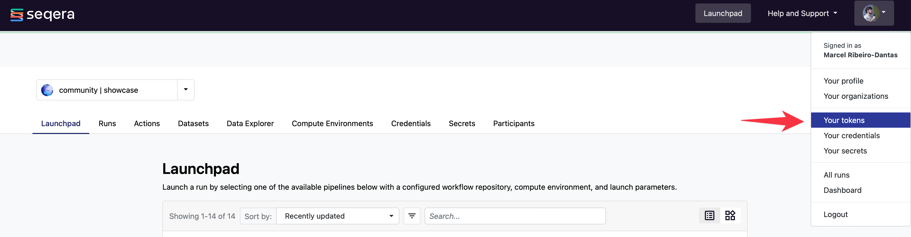

We'll start by using the Nextflow CLI to launch a pipeline and monitor it in Seqera Platform.
Start by logging into the [Seqera Platform](https://cloud.seqera.io/).

!!! info "Nextflow Tower"
Seqera Platform was previously known as Nextflow Tower.
You'll still see references to the previous name in environment variable and cli option names.

### 1.1. Set up your Seqera Platform token by exporting it to your environment

Follow these steps to set up your token:

1.  Create a new token by clicking on the **Settings** drop-down menu:

    

2.  Name your token:

    

3.  Save your token safely:

    

    !!! note

        Leave this browser tab open as we will need the token once more to store it as a Nextflow secret.

4.  Export your token:

    Open a terminal and type:

    ```bash
    export TOWER_ACCESS_TOKEN=eyxxxxxxxxxxxxxxxQ1ZTE=
    ```

    Where `eyxxxxxxxxxxxxxxxQ1ZTE=` is the token you have just created.

### 1.2. Run Nextflow cli with Seqera Platform visualizing and capturing logs

Run your Nextflow workflows as usual with the addition of the `-with-tower` command:

```bash
nextflow run nextflow-io/hello -with-tower
```

You will see the following output:

```console title="Output"
 N E X T F L O W   ~  version 24.04.4

Launching `https://github.com/nextflow-io/hello` [evil_engelbart] DSL2 - revision: afff16a9b4 [master]

Downloading plugin nf-tower@1.9.1
Monitor the execution with Seqera Platform using this URL: https://cloud.seqera.io/user/kenbrewer/watch/5Gs0qqV9Y9rguE
executor >  local (4)
[80/810411] process > sayHello (1) [100%] 4 of 4 ✔
Ciao world!

Bonjour world!

Hola world!

Hello world!
```

Use ++ctrl+click++ or ++cmd+click++ on the link to open it in your browser.
You'll see the Seqera Platform interface with the job finished and the logs captured.


You will see and be able to monitor your **Nextflow jobs** in Seqera Platform.
