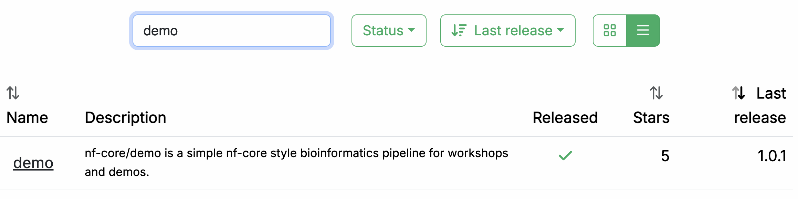

# Part 1: Run nf-core/demo

In this first part of the Hello nf-core training course, we show you how to find and try out an nf-core pipeline, understand how the code is organized, and recognize how it differs from plain Nextflow code as shown in [Hello Nextflow](../hello_nextflow/index.md).

We are going to use a pipeline called nf-core/demo that is maintained by the nf-core project as part of its inventory of pipelines for demonstrating code structure and tool operations.

---

## 0. Warmup

Before we go looking for the pipeline, let's create a project directory where we're going to do the work.

Make sure you are in the `hello-nf-core/` directory as instructed in the [Orientation](./00_orientation.md), then create the directory as follows:

```bash
mkdir demo_run/
cd demo_run
```

Once that's done, you can move on to find and run your first nf-core pipeline!

---

## 1. Find and retrieve the nf-core/demo pipeline

Let's start by locating the nf-core/demo pipeline on the project website at [nf-co.re](https://nf-co.re), which centralizes all information such as: general documentation and help articles, documentation for each of the pipelines, blog posts, event announcements and so forth.

### 1.1. Find the pipeline on the website

In your web browser, go to https://nf-co.re/pipelines/ and type `demo` in the search bar.



Click on the pipeline name, `demo`, to access the pipeline details page.

Each released pipeline has a dedicated page that includes the following documentation sections:

- **Introduction:** An introduction and overview of the pipeline
- **Usage:** Descriptions of how to execute the pipeline
- **Parameters:** Grouped pipeline parameters with descriptions
- **Output:** Descriptions and examples of the expected output files
- **Results:** Example output files generated from the full test dataset
- **Releases & Statistics:** Pipeline version history and statistics

Whenever you are considering adopting a new pipeline, you should read the pipeline documentation carefully first to understand what it does and how it should be configured before attempting to run it.

Have a look now and see if you can find out:

- which tools the pipeline will run (Check the tab: `Introduction`)
- which inputs and parameters the pipeline accepts or requires (Check the tab: `Parameters`)
- what are the outputs produced by the pipeline (Check the tab: `Output`)

  The `Introduction` tab provides an overview of the pipeline, including a visual representation (called a subway map) and a list of tools that are run as part of the pipeline.

  

  1. Read QC (FASTQC)
  2. Adapter and quality trimming (SEQTK_TRIM)
  3. Present QC for raw reads (MULTIQC)

  The documentation also provides an example input file (see below) and an example command line.

  ```bash
  nextflow run nf-core/demo \
   -profile <docker/singularity/.../institute> \
   --input samplesheet.csv \
   --outdir <OUTDIR>
  ```

You'll notice that the example command does NOT specify a workflow file, just the reference to the pipeline repository, `nf-core/demo`.

When invoked this way, Nextflow will assume that the code is organized in a certain way.
Let's retrieve the code so we can examine this structure.

### 1.2. Retrieve the pipeline code

Once we've determined the pipeline appears to be suitable for our purposes, we're going to want to try it out.
Fortunately Nextflow makes it easy to retrieve pipeline from correctly-formatted repositories without having to download anything manually.

Return to your terminal and run the following:

```bash
nextflow pull nf-core/demo
```

Nextflow will `pull` the pipeline code, meaning it will download the full repository to your local drive.

```console title="Output"
Checking nf-core/demo ...
 downloaded from https://github.com/nf-core/demo.git - revision: 04060b4644 [master]
```

By default, the files will be saved to `$HOME/.nextflow/assets`.
This can be customized using the `NXF_ASSETS` environment variable; see the configuration documentation at https://www.nextflow.io/docs/latest/config.html.

!!! note
To be clear, you can do this with any Nextflow pipeline that is appropriately set up in GitHub, not just nf-core pipelines.
However nf-core is the largest open-source collection of Nextflow pipelines.

### Takeaway

You now know how to find a pipeline via the nf-core website and retrieve a local copy of the source code.

### What's next?

Learn how to try out an nf-core pipeline with minimal effort.

---

## 2. Run the pipeline with the provided test profile

Conveniently, every nf-core pipeline comes with a `test` profile.
This is a minimal set of configuration settings for the pipeline to run using a small test dataset hosted in the [nf-core/test-datasets](https://github.com/nf-core/test-datasets) repository. It's a great way to quickly try out a pipeline at small scale.

The `test` profile for `nf-core/demo` is shown below:

```groovy title="conf/test.config" linenums="1" hl_lines="26"
/*
~~~~~~~~~~~~~~~~~~~~~~~~~~~~~~~~~~~~~~~~~~~~~~~~~~~~~~~~~~~~~~~~~~~~~~~~~~~~~~~~~~~~~~~~
    Nextflow config file for running minimal tests
~~~~~~~~~~~~~~~~~~~~~~~~~~~~~~~~~~~~~~~~~~~~~~~~~~~~~~~~~~~~~~~~~~~~~~~~~~~~~~~~~~~~~~~~
    Defines input files and everything required to run a fast and simple pipeline test.

    Use as follows:
        nextflow run nf-core/demo -profile test,<docker/singularity> --outdir <OUTDIR>

----------------------------------------------------------------------------------------
*/

process {
    resourceLimits = [
        cpus: 4,
        memory: '15.GB',
        time: '1.h'
    ]
}

params {
    config_profile_name        = 'Test profile'
    config_profile_description = 'Minimal test dataset to check pipeline function'

    // Input data
    input  = 'https://raw.githubusercontent.com/nf-core/test-datasets/viralrecon/samplesheet/samplesheet_test_illumina_amplicon.csv'

}
```

This tells us that the `nf-core/demo` `test` profile already specifies the input parameter, so you don't have to provide any input yourself.
However, the `outdir` parameter is not included in the `test` profile, so you have to add it to the execution command using the `--outdir` flag.

Here, we're also going to specify `-profile docker`, which by nf-core convention enables the use of Docker containers.

Lets' try it!

```bash
nextflow run nf-core/demo -profile docker,test --outdir results
```

Here's the console output from the pipeline:

```console title="Output"
 N E X T F L O W   ~  version 24.10.0

Launching `https://github.com/nf-core/demo` [maniac_jones] DSL2 - revision: 04060b4644 [master]


------------------------------------------------------
                                        ,--./,-.
        ___     __   __   __   ___     /,-._.--~'
  |\ | |__  __ /  ` /  \ |__) |__         }  {
  | \| |       \__, \__/ |  \ |___     \`-._,-`-,
                                        `._,._,'
  nf-core/demo 1.0.1
------------------------------------------------------
Input/output options
  input                     : https://raw.githubusercontent.com/nf-core/test-datasets/viralrecon/samplesheet/samplesheet_test_illumina_amplicon.csv
  outdir                    : results

Institutional config options
  config_profile_name       : Test profile
  config_profile_description: Minimal test dataset to check pipeline function

Core Nextflow options
  revision                  : master
  runName                   : maniac_jones
  containerEngine           : docker
  launchDir                 : /workspaces/training/side-quests/nf-core/nf-core-demo
  workDir                   : /workspaces/training/side-quests/nf-core/nf-core-demo/work
  projectDir                : /workspaces/.nextflow/assets/nf-core/demo
  userName                  : gitpod
  profile                   : docker,test
  configFiles               :

!! Only displaying parameters that differ from the pipeline defaults !!
------------------------------------------------------* The pipeline
  https://doi.org/10.5281/zenodo.12192442

* The nf-core framework
    https://doi.org/10.1038/s41587-020-0439-x

* Software dependencies
    https://github.com/nf-core/demo/blob/master/CITATIONS.md

executor >  local (7)
[3c/a00024] NFC…_DEMO:DEMO:FASTQC (SAMPLE2_PE) | 3 of 3 ✔
[94/d1d602] NFC…O:DEMO:SEQTK_TRIM (SAMPLE2_PE) | 3 of 3 ✔
[ab/460670] NFCORE_DEMO:DEMO:MULTIQC           | 1 of 1 ✔
-[nf-core/demo] Pipeline completed successfully-
Completed at: 05-Mar-2025 09:46:21
Duration    : 1m 54s
CPU hours   : (a few seconds)
Succeeded   : 7
```

You see that there is more console output than when you run a basic Netxflow pipeline.
There's a header that includes a summary of the pipeline's version, inputs and outputs, and a few elements of configuration.

Moving on to the execution output, let's have a look at the lines that tell us what processes were run:

```console title="Output (subset)"
[3c/a00024] NFC…_DEMO:DEMO:FASTQC (SAMPLE2_PE) | 3 of 3 ✔
[94/d1d602] NFC…O:DEMO:SEQTK_TRIM (SAMPLE2_PE) | 3 of 3 ✔
[ab/460670] NFCORE_DEMO:DEMO:MULTIQC           | 1 of 1 ✔
```

This tells us that three processes were run, corresponding to the three tools shown in the pipeline documentation page on the nf-core website: FASTQC, SEQTK_TRIM and MULTIQC.

!!! note
The full process names as shown here, such as `NFCORE_DEMO:DEMO:MULTIQC`, are longer than what you may have seen in the introductory Hello Nextflow material.
These includes the names of their parent workflows and reflect the modularity of the pipeline code.
We will go into more detail about that shortly.

Finally, let's have a look at the `results` directory produced by the pipeline.

```bash
tree results
```

```console title="Output"
results/
├── fastqc
│   ├── SAMPLE1_PE
│   ├── SAMPLE2_PE
│   └── SAMPLE3_SE
├── fq
│   ├── SAMPLE1_PE
│   ├── SAMPLE2_PE
│   └── SAMPLE3_SE
├── multiqc
│   ├── multiqc_data
│   ├── multiqc_plots
│   └── multiqc_report.html
└── pipeline_info
    ├── execution_report_2025-03-05_09-44-26.html
    ├── execution_timeline_2025-03-05_09-44-26.html
    ├── execution_trace_2025-03-05_09-44-26.txt
    ├── nf_core_pipeline_software_mqc_versions.yml
    ├── params_2025-03-05_09-44-29.json
    └── pipeline_dag_2025-03-05_09-44-26.html
```

If you're curious about what that all means, check out [the nf-core/demo pipeline documentation page](https://nf-co.re/demo/1.0.1/).

Congratulations! You have just run your first nf-core pipeline.

#### Takeaway

You know how to run an nf-core pipeline using its built-in test profile.

### What's next?

Learn how the pipeline code is organized.

---

## 3. Examine the pipeline code structure

The nf-core project enforces strong guidelines for how pipelines are structured, and how the code is organized, configured and documented.

Let's have a look at how the pipeline code is organized in the `nf-core/demo` repository.
You can either use `tree` or use the file explorer in your IDE.

```bash
tree -L 1 $HOME/.nextflow/assets/nf-core/demo
```

```console title="Output (top-level only)"
/root/.nextflow/assets/nf-core/demo
├── assets
├── CHANGELOG.md
├── CITATIONS.md
├── CODE_OF_CONDUCT.md
├── conf
├── docs
├── LICENSE
├── main.nf
├── modules
├── modules.json
├── nextflow_schema.json
├── nextflow.config
├── README.md
├── subworkflows
├── tower.yml
└── workflows
```

There's a lot going on in there, so we'll tackle this in stages.
We're going to look at the following categories:

1. Pipeline code components

- main script in `main.nf`
- modular components in `workflows`, `subworkflows` and `modules`

2. Configuration, parameters and inputs
3. Documentation and other stuff

Let's start with the code proper, though note that for now, we're going to focus on how everything is organized, without looking at the actual code just yet.

### 3.1. Pipeline code components

The pipeline code organization follows a modular structure that is designed to maximize code reuse.

!!!note
We won't go over the actual code for how these modular components are connected, because there is some additional complexity associated with the use of subworkflows that can be confusing, and understanding that is not necessary at this stage of the training.
For now, we're going to focus on the logic of this modular organization.

### 3.1.1. Overall organization and `main.nf` script

At the top level, there is the `main.nf` script, which is the entrypoint Nextflow starts from when we execute `nextflow run nf-core/demo`. That means when you run `nextflow run nf-core/demo` to run the pipeline, Nextflow automatically finds and executes the `main.nf` script, and everything else will flow from there.

In practice, the `main.nf` script calls the actual workflow of interest, stored inside the `workflows` folder, called `demo.nf`. It also calls a few 'housekeeping' subworkflows that we're going to ignore for now.

```bash
tree $HOME/.nextflow/assets/nf-core/demo/workflows
```

```console title="Output"
/root/.nextflow/assets/nf-core/demo/workflows
└── demo.nf
```

The `demo.nf` workflow itself calls out to various script components, namely, modules and subworkflows, stored in the corresponding `modules` and `subworkflows` folders.

- **Module:** A wrapper around a single process.
- **Subworkflow:** A mini workflow that calls two or more modules and is designed to be called by another workflow.

Here's an overview of the nested structure of a workflow composed of subworkflows and modules:

<figure class="excalidraw">
    --8<-- "docs/side_quests/img/nf-core/nested.excalidraw.svg"
</figure>

Not all workflows use subworkflows to organize their modules, but this is a very common pattern that makes it possible to reuse chunks of code across different pipelines in a way that is flexible while minimizing maintenance burden.

Within this structure, `modules` and `subworkflows` are further organized into `local` and `nf-core` folders.
The `nf-core` folder is for components that have come from the nf-core GitHub repository, while the `local` folder is for components that have been developed independently.
Usually these are operations that very specific to that pipeline.

Let's take a peek into those directories.

### 3.1.2. Modules

The modules are where the process code lives, as described in [Part 4 of the Hello Nextflow training course](../hello_nextflow/04_hello_modules.md).

In the nf-core project, modules are organized using a nested structure that refers to toolkit and tool names.
The module code file describing the process is always called `main.nf`, and is accompanied by tests and `.yml` files.

```bash
tree -L 4 $HOME/.nextflow/assets/nf-core/demo/modules
```

```console title="Output"
/root/.nextflow/assets/nf-core/demo/modules
└── nf-core
    ├── fastqc
    │   ├── environment.yml
    │   ├── main.nf
    │   ├── meta.yml
    │   └── tests
    ├── multiqc
    │   ├── environment.yml
    │   ├── main.nf
    │   ├── meta.yml
    │   └── tests
    └── seqtk
        └── trim
            ├── environment.yml
            ├── main.nf
            ├── meta.yml
            └── tests
```

Here you see that the `fastqc` and `multiqc` modules sit at the top level within the `nf-core` modules, whereas the `trim` module sits under the toolkit that it belongs to, `seqtk`.
In this case there are no `local` modules.

### 3.1.3. Subworkflows

As noted above, subworkflows function as wrappers that call two or more modules.

In an nf-core pipeline, the subworkflows are divided into `local` and `nf-core` directories, and each subworkflow has its own nested directory structure with its own `main.nf` script.

```bash
tree -L 4 $HOME/.nextflow/assets/nf-core/demo/subworkflows
```

```console title="Output"
/root/.nextflow/assets/nf-core/demo/subworkflows
├── local
│   └── utils_nfcore_demo_pipeline
│       └── main.nf
└── nf-core
    ├── utils_nextflow_pipeline
    │   ├── main.nf
    │   ├── meta.yml
    │   └── tests
    ├── utils_nfcore_pipeline
    │   ├── main.nf
    │   ├── meta.yml
    │   └── tests
    └── utils_nfschema_plugin
        ├── main.nf
        ├── meta.yml
        └── tests
```

In the case of the `nf-core/demo` pipeline, the subworkflows involved are all 'utility' or housekeeping subworkflows, as denoted by the `utils_` prefix in their names.
These subworkflows are what produces the fancy nf-core header in the console output, among other accessory functions.

Other pipelines may also use subworkflows as part of the main workflow of interest.

!!! note
If you would like to learn how to compose workflows with subworkflows, see the [Workflows of Workflows](https://training.nextflow.io/latest/side_quests/workflows_of_workflows/) Side Quest (also known as 'the WoW side quest').

### 3.2. Configuration, parameters and inputs

The nf-core project applies guidelines for pipeline configuration that aim to build on Nextflow's flexible customization options in a way that provides greater consistency and maintainability across pipelines.

The central configuration file `nextflow.config` is used to set default values for parameters and other configuration options. The majority of these configuration options are applied by default while others (e.g., software dependency profiles) are included as optional profiles.

There are several additional configuration files that are stored in the `conf` folder and which can be added to the configuration by default or optionally as profiles:

- `base.config`: A 'blank slate' config file, appropriate for general use on most high-performance computing. environments. This defines broad bins of resource usage, for example, which are convenient to apply to modules.
- `modules.config`: Additional module directives and arguments.
- `test.config`: A profile to run the pipeline with minimal test data, which we used when we ran the demo pipeline in the previous section.
- `test_full.config`: A profile to run the pipeline with a full-sized test dataset.

### 3.3. Documentation and other assets

At the top level, you can find a README file with summary information, as well as accessory files that summarize project information such as licensing, contribution guidelines, citation and code of conduct.

Detailed pipeline documentation is located in the `docs` directory.
This content is used to generate the web pages on the nf-core website.

In addition to these human-readable documents, there are two JSON files that provide useful machine-readable information describing parameters and input requirements, `nextflow_schema.json` and `assets/schema_input.json`.

##### `nextflow_schema.json`

The `nextflow_schema.json` is a file used to store parameter related information including type, description and help text in a machine readable format. The schema is used for various purposes, including automated parameter validation, help text generation, and interactive parameter form rendering in UI interfaces.

##### `assets/schema_input.json`

The `schema_input.json` is a file used to define the input samplesheet structure. Each column can have a type, pattern, description and help text in a machine readable format. The schema is used for various purposes, including automated validation, and providing helpful error messages.

### Takeaway

You know what are the main components of an nf-core pipeline and how the code is organized, what are the main elements of configuration, and what are some additional sources of information that can be useful.

### What's next?

Take a break! That was a lot. When you're feeling refreshed and ready, move on to the next section to apply what you've learned to write an nf-core compliant pipeline.
