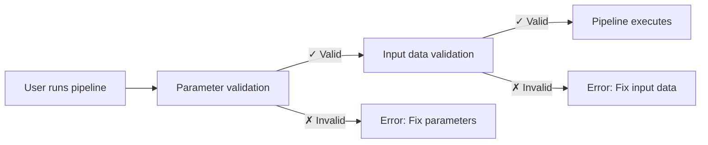

# Part 4: Input validation

In this fourth part of the Hello nf-core training course, we show you how to use the nf-schema plugin to validate pipeline inputs and parameters.

## Why validation matters

Imagine running your pipeline for two hours, only to have it crash because a user provided a file with the wrong extension. Or spending hours debugging cryptic errors, only to discover that a parameter was misspelled. Without input validation, these scenarios are common.

Consider this example:

```console title="Without validation"
$ nextflow run my-pipeline --input data.txt --output results

...2 hours later...

ERROR ~ No such file: 'data.fq.gz'
  Expected FASTQ format but received TXT
```

The pipeline accepted invalid inputs and ran for hours before failing. With proper validation:

```console title="With validation"
$ nextflow run my-pipeline --input data.txt --output results

ERROR ~ Validation of pipeline parameters failed!

 * --input (data.txt): File extension '.txt' does not match required pattern '.fq.gz' or '.fastq.gz'
 * --output: required parameter is missing (expected: --outdir)

Pipeline failed before execution - please fix the errors above
```

The pipeline fails immediately with clear, actionable error messages. This saves time, compute resources, and frustration.

## Two types of validation

nf-core pipelines validate two different kinds of input:

1. **Parameter validation**: Validates command-line parameters (flags like `--outdir`, `--batch`, `--input`)

    - Checks parameter types, ranges, and formats
    - Ensures required parameters are provided
    - Validates file paths exist
    - Defined in `nextflow_schema.json`

2. **Input data validation**: Validates the contents of input files (like sample sheets or CSV files)

    - Checks column structure and data types
    - Validates file references within the input file
    - Ensures required fields are present
    - Defined in `assets/schema_input.json`

Both types of validation happen **before** the pipeline executes any processes, ensuring fast failure with clear error messages.

!!! note

    This section assumes you have completed [Part 3: Add an existing nf-core module](./03_add_module.md) and have a working `core-hello` pipeline with nf-core modules.

    If you didn't complete Part 3 or want to start fresh for this section, you can use the `core-hello-part3` solution as your starting point:

    ```bash
    cp -r hello-nf-core/solutions/core-hello-part3 core-hello
    cd core-hello
    ```

    This gives you a fully functional nf-core pipeline with modules ready for adding input validation.

---

## 1. The nf-schema plugin

The [nf-schema plugin](https://nextflow-io.github.io/nf-schema/latest/) is a Nextflow plugin that provides comprehensive validation capabilities for nf-core pipelines.

### 1.1. Core functionality

nf-schema provides several key functions:

- **Parameter validation**: Validates pipeline parameters against `nextflow_schema.json`
- **Sample sheet validation**: Validates input files against `assets/schema_input.json`
- **Channel conversion**: Converts validated sample sheets to Nextflow channels
- **Help text generation**: Automatically generates `--help` output from schema definitions
- **Parameter summary**: Displays which parameters differ from defaults

nf-schema is the successor to the deprecated nf-validation plugin and uses standard [JSON Schema Draft 2020-12](https://json-schema.org/) for validation.

### 1.2. The two schema files

An nf-core pipeline uses two schema files for validation:

| Schema File                | Purpose               | Validates                                            |
| -------------------------- | --------------------- | ---------------------------------------------------- |
| `nextflow_schema.json`     | Parameter validation  | Command-line flags: `--input`, `--outdir`, `--batch` |
| `assets/schema_input.json` | Input data validation | Contents of sample sheets and input files            |

Both schemas use JSON Schema format, a widely-adopted standard for describing and validating data structures.

### 1.3. When validation occurs



Validation happens **before** any pipeline processes run, providing fast feedback and preventing wasted compute time.

### Takeaway

You now understand what nf-schema does, the two types of validation it provides, and when validation occurs in the pipeline execution lifecycle.

### What's next?

Start by implementing parameter validation for command-line flags.

---

## 2. Parameter validation (nextflow_schema.json)

Let's start by adding parameter validation to our pipeline. This validates command-line flags like `--input`, `--outdir`, and `--batch`.

### 2.1. Examine the parameter schema

Let's look at a section of the `nextflow_schema.json` file that came with our pipeline template:

```bash
grep -A 20 '"input_output_options"' core-hello/nextflow_schema.json
```

The parameter schema is organized into groups. Here's the `input_output_options` group (simplified):

```json title="core-hello/nextflow_schema.json (excerpt)"
"input_output_options": {
    "title": "Input/output options",
    "type": "object",
    "description": "Define where the pipeline should find input data and save output data.",
    "required": ["input", "outdir"],
    "properties": {
        "input": {
            "type": "string",
            "format": "file-path",
            "exists": true,
            "mimetype": "text/csv",
            "pattern": "^\\S+\\.csv$",
            "description": "Path to comma-separated file containing greetings.",
            "help_text": "You will need to create a design file with information about the samples in your experiment before running the pipeline."
        },
        "outdir": {
            "type": "string",
            "format": "directory-path",
            "description": "The output directory where the results will be saved.",
            "fa_icon": "fas fa-folder-open"
        }
    }
}
```

Key validation features:

- **`type`**: Data type (string, integer, boolean, number)
- **`format`**: Special formats like `file-path` or `directory-path`
- **`exists`**: For file paths, check if the file exists
- **`pattern`**: Regular expression the value must match
- **`required`**: Array of parameter names that must be provided
- **`mimetype`**: Expected file mimetype for validation

Notice the `batch` parameter we've been using isn't defined yet in the schema!

### 2.2. Add the batch parameter

The parameter schema can be edited manually, but nf-core provides a helpful GUI tool:

```bash
nf-core pipelines schema build
```

This command launches an interactive web interface where you can:

- Add new parameters
- Set validation rules
- Organize parameters into groups
- Generate help text

For our simple case, we'll edit the JSON directly. Open `core-hello/nextflow_schema.json` and find the `"input_output_options"` section. Add the `batch` parameter:

```json title="core-hello/nextflow_schema.json (excerpt)" hl_lines="13-17"
"input_output_options": {
    "title": "Input/output options",
    "type": "object",
    "description": "Define where the pipeline should find input data and save output data.",
    "required": ["input", "outdir"],
    "properties": {
        "input": {
            "type": "string",
            "format": "file-path",
            "exists": true,
            "description": "Path to comma-separated file containing greetings."
        },
        "batch": {
            "type": "string",
            "default": "batch-01",
            "description": "Name for this batch of greetings"
        },
        "outdir": {
            "type": "string",
            "format": "directory-path",
            "description": "The output directory where the results will be saved."
        }
    }
}
```

### 2.3. Test parameter validation

Now let's test that parameter validation works correctly.

First, try running without the required `input` parameter:

```bash
nextflow run core-hello --outdir test-results -profile docker
```

```console title="Output"
ERROR ~ Validation of pipeline parameters failed!

 -- Check '.nextflow.log' file for details
 * --input: required property is missing
```

Perfect! The validation catches the missing required parameter before the pipeline runs.

Now try with a valid set of parameters:

```bash
nextflow run core-hello --input assets/greetings.csv --outdir results --batch my-batch -profile test,docker
```

The pipeline should run successfully, and the `batch` parameter is now validated.

### Takeaway

You now know how to add parameters to `nextflow_schema.json` and test parameter validation. The nf-core schema build tool makes it easy to manage complex parameter schemas interactively.

### What's next?

Now that parameter validation is working, let's add validation for the input data file contents.

---

## 3. Input data validation (schema_input.json)

Now let's add validation for the contents of our input CSV file. While parameter validation checks command-line flags, input data validation ensures the data inside the CSV file is structured correctly.

### 3.1. Understand the greetings.csv format

Let's remind ourselves what our input looks like:

```bash
cat core-hello/assets/greetings.csv
```

```csv title="core-hello/assets/greetings.csv"
Hello
Bonjour
Holà
```

This is a simple CSV with:

- One column (no header)
- One greeting per line
- Text strings with no special format requirements

### 3.2. Design the schema structure

For our use case, we want to:

1. Accept CSV input with one column
2. Treat each row as a greeting string
3. Ensure greetings are not empty
4. Ensure no whitespace-only entries

We'll structure this as an array of objects, where each object has a `greeting` field.

### 3.3. Create the schema file

Replace the contents of [core-hello/assets/schema_input.json](core-hello/assets/schema_input.json) with the following:

```json title="core-hello/assets/schema_input.json" linenums="1"
{
  "$schema": "https://json-schema.org/draft/2020-12/schema",
  "$id": "https://raw.githubusercontent.com/core/hello/main/assets/schema_input.json",
  "title": "core/hello pipeline - params.input schema",
  "description": "Schema for the greetings file provided with params.input",
  "type": "array",
  "items": {
    "type": "object",
    "properties": {
      "greeting": {
        "type": "string",
        "pattern": "^\\S.*$",
        "errorMessage": "Greeting must be provided and cannot be empty or start with whitespace"
      }
    },
    "required": ["greeting"]
  }
}
```

Let's break down the key parts:

- **`type: "array"`**: The input is parsed as an array (list) of items
- **`items.type: "object"`**: Each item in the array is an object
- **`properties.greeting`**: Defines a field called `greeting`
  - **`type: "string"`**: Must be a text string
  - **`pattern: "^\\S.*$"`**: Must start with a non-whitespace character (but can contain spaces after that)
  - **`errorMessage`**: Custom error message shown if validation fails
- **`required: ["greeting"]`**: The `greeting` field is mandatory

### 3.4. Add a header to the greetings.csv file

When nf-schema reads a CSV file, it expects the first row to contain column headers that match the field names in the schema.

For our simple case, we need to add a `greeting` header to our greetings file:

Add a header line to the greetings file:

=== "After"

    ```csv title="core-hello/assets/greetings.csv" linenums="1"
    greeting
    Hello
    Bonjour
    Holà
    ```

=== "Before"

    ```csv title="core-hello/assets/greetings.csv" linenums="1"
    Hello
    Bonjour
    Holà
    ```

Now the CSV file has a header that matches the field name in our schema.

### Takeaway

You've created a JSON schema for the greetings input file and added the required header to the CSV file.

### What's next?

Implement the validation in the pipeline code using `samplesheetToList`.

### 3.5. Implement samplesheetToList in the pipeline

Now we need to replace our simple CSV parsing with nf-schema's `samplesheetToList` function, which validates and converts the sample sheet.

The `samplesheetToList` function:

1. Reads the input sample sheet (CSV, TSV, JSON, or YAML)
2. Validates it against the provided JSON schema
3. Returns a Groovy list where each entry corresponds to a row
4. Throws helpful error messages if validation fails

Let's update the input handling code:

Open [core-hello/subworkflows/local/utils_nfcore_hello_pipeline/main.nf](core-hello/subworkflows/local/utils_nfcore_hello_pipeline/main.nf) and locate the section where we create the input channel (around line 64).

We need to:

1. Import the `samplesheetToList` function
2. Use it to validate and parse the input
3. Extract just the greeting strings for our workflow

First, add the import at the top of the file:

=== "After"

    ```groovy title="core-hello/subworkflows/local/utils_nfcore_hello_pipeline/main.nf" linenums="1" hl_lines="13"
    //
    // Subworkflow with functionality that may be useful for any Nextflow pipeline
    //

    import org.yaml.snakeyaml.Yaml
    import groovy.json.JsonOutput

    include { UTILS_NFSCHEMA_PLUGIN  } from '../../nf-core/utils_nfschema_plugin'
    include { UTILS_NEXTFLOW_PIPELINE } from '../../nf-core/utils_nextflow_pipeline'
    include { UTILS_NFCORE_PIPELINE   } from '../../nf-core/utils_nfcore_pipeline'

    include { paramsSummaryMap          } from 'plugin/nf-schema'
    include { samplesheetToList         } from 'plugin/nf-schema'
    ```

=== "Before"

    ```groovy title="core-hello/subworkflows/local/utils_nfcore_hello_pipeline/main.nf" linenums="1"
    //
    // Subworkflow with functionality that may be useful for any Nextflow pipeline
    //

    import org.yaml.snakeyaml.Yaml
    import groovy.json.JsonOutput

    include { UTILS_NFSCHEMA_PLUGIN  } from '../../nf-core/utils_nfschema_plugin'
    include { UTILS_NEXTFLOW_PIPELINE } from '../../nf-core/utils_nextflow_pipeline'
    include { UTILS_NFCORE_PIPELINE   } from '../../nf-core/utils_nfcore_pipeline'

    include { paramsSummaryMap          } from 'plugin/nf-schema'
    ```

Now update the channel creation code:

=== "After"

    ```groovy title="core-hello/subworkflows/local/utils_nfcore_hello_pipeline/main.nf" linenums="64" hl_lines="4-8"
        //
        // Create channel from input file provided through params.input
        //
        ch_samplesheet = Channel.fromList(samplesheetToList(params.input, "${projectDir}/assets/schema_input.json"))
            .map { row ->
                // Extract just the greeting string from each row
                row[0]
            }

        emit:
        samplesheet = ch_samplesheet
        versions    = ch_versions
    ```

=== "Before"

    ```groovy title="core-hello/subworkflows/local/utils_nfcore_hello_pipeline/main.nf" linenums="64"
        //
        // Create channel from input file provided through params.input
        //
        ch_samplesheet = Channel.fromPath(params.input)
                            .splitCsv()
                            .map { line -> line[0] }

        emit:
        samplesheet = ch_samplesheet
        versions    = ch_versions
    ```

Let's break down what changed:

1. **`samplesheetToList(params.input, "${projectDir}/assets/schema_input.json")`**: Validates the input file against our schema and returns a list
2. **`Channel.fromList(...)`**: Converts the list into a Nextflow channel
3. **`.map { row -> row[0] }`**: Extracts just the greeting string from each validated row (accessing the first column by index)

!!! note "Parameter validation is enabled by default"

    The pipeline template already includes parameter validation enabled via `params.validate_params = true` in `nextflow.config`. The validation is performed by the `UTILS_NFSCHEMA_PLUGIN` subworkflow during pipeline initialization.

### Takeaway

You've successfully implemented input data validation using `samplesheetToList` and JSON schemas.

### What's next?

Test both parameter and input data validation to see them in action.

### 3.6. Test input validation

Let's verify that our validation works by testing both valid and invalid inputs.

**Test with valid input:**

First, confirm the pipeline runs successfully with valid input:

```bash
nextflow run core-hello --outdir core-hello-results -profile test,docker
```

Note that we no longer need `--validate_params false` since validation is working!

```console title="Output"
 N E X T F L O W   ~  version 25.04.3

Launching `./main.nf` [nasty_kalman] DSL2 - revision: c31b966b36

Input/output options
  input                     : /private/tmp/core-hello-test/assets/greetings.csv
  batch                     : test
  outdir                    : core-hello-results

Institutional config options
  config_profile_name       : Test profile
  config_profile_description: Minimal test dataset to check pipeline function

Core Nextflow options
  runName                   : nasty_kalman
  containerEngine           : docker
  profile                   : test,docker

!! Only displaying parameters that differ from the pipeline defaults !!
------------------------------------------------------
executor >  local (7)
[cc/cc800d] CORE_HELLO:HELLO:sayHello (1)       | 3 of 3 ✔
[d6/46ab71] CORE_HELLO:HELLO:convertToUpper (1) | 3 of 3 ✔
[b2/3def99] CORE_HELLO:HELLO:CAT_CAT (test)     | 1 of 1 ✔
[a3/f82e41] CORE_HELLO:HELLO:cowpy              | 1 of 1 ✔
-[core/hello] Pipeline completed successfully-
```

Great! The pipeline runs successfully and validation passes silently.

**Test with invalid input:**

Now let's test that validation catches errors. Create a test file with an invalid entry:

```bash
cat > /tmp/invalid_greetings.csv << 'EOF'
greeting
Hello

Holà
EOF
```

This file has a second row with only whitespace (three spaces), which should fail our validation rule.

Try running the pipeline with this invalid input:

```bash
nextflow run core-hello --input /tmp/invalid_greetings.csv --outdir test-results -profile docker
```

```console title="Output"
 N E X T F L O W   ~  version 25.04.3

Launching `./main.nf` [stupefied_poincare] DSL2 - revision: c31b966b36

Input/output options
  input              : /tmp/invalid_greetings.csv
  outdir             : test-results

Core Nextflow options
  runName            : stupefied_poincare
  containerEngine    : docker
  profile            : docker

!! Only displaying parameters that differ from the pipeline defaults !!
------------------------------------------------------
ERROR ~ Validation of pipeline parameters failed!

 -- Check '.nextflow.log' file for details
The following invalid input values have been detected:

* --input (/tmp/invalid_greetings.csv): Validation of file failed:
	-> Entry 2: Missing required field(s): greeting

 -- Check script 'subworkflows/nf-core/utils_nfschema_plugin/main.nf' at line: 39 or see '.nextflow.log' file for more details
```

Perfect! The validation caught the error and provided a clear, helpful error message pointing to:

- Which file failed validation
- Which entry (row 2) has the problem
- What the specific problem is (missing required field)

!!! note "Empty lines in CSV files"

    Empty lines (with no content at all) are filtered out during CSV parsing and won't trigger validation errors. Only lines with content that fails validation rules (like whitespace-only entries) will be caught.

### Takeaway

You now know how to implement and test both parameter validation and input data validation. Your pipeline validates inputs before execution, providing fast feedback and clear error messages.

!!! tip "Further reading"

    To learn more about advanced validation features and patterns, check out the [nf-schema documentation](https://nextflow-io.github.io/nf-schema/latest/). The `nf-core pipelines schema build` command provides an interactive GUI for managing complex schemas.

---

## Congratulations!

You've completed the Hello nf-core training course! 🎉

Throughout this course, you've learned how to:

- **Run nf-core pipelines** using test profiles and understand their structure
- **Create nf-core-style pipelines** from scratch using the nf-core template
- **Make workflows composable** with `take`, `main`, and `emit` blocks
- **Integrate nf-core modules** from the community repository
- **Implement parameter validation** to catch configuration errors before pipeline execution
- **Implement input data validation** to ensure sample sheets and input files are properly formatted
- **Use nf-schema tools** to manage validation schemas and test validation rules
- **Follow nf-core conventions** for code organization, configuration, and documentation

You now have the foundational knowledge to develop production-ready Nextflow pipelines that follow nf-core best practices. Your pipeline includes proper module organization, comprehensive validation, and is ready to be extended with additional features.

### Where to go from here

Ready to take your skills further? Here are some recommended next steps:

- **[nf-core website](https://nf-co.re/)**: Explore the full catalog of nf-core pipelines and modules
- **[nf-core documentation](https://nf-co.re/docs/)**: Deep dive into pipeline development guidelines and best practices
- **[nf-schema documentation](https://nextflow-io.github.io/nf-schema/latest/)**: Learn advanced validation techniques
- **[nf-test](https://www.nf-test.com/)**: Add comprehensive testing to your pipeline
- **[Nextflow patterns](https://nextflow-io.github.io/patterns/)**: Discover common workflow patterns and solutions
- **[Side Quests](../side_quests/index.md)**: Explore advanced Nextflow topics like metadata handling, debugging, and workflow composition

### Get involved with the community

The nf-core community is welcoming and always happy to help:

- **[nf-core Slack](https://nf-co.re/join/slack)**: Join the community to ask questions and share your work
- **[GitHub Discussions](https://github.com/nf-core/modules/discussions)**: Participate in discussions about modules and pipelines
- **[Contribute](https://nf-co.re/docs/contributing/overview)**: Consider contributing your own modules or improvements back to the community

Thank you for completing this training. We hope you enjoyed learning about nf-core and feel confident building your own pipelines. Happy pipelining! 🚀
