# Part 5: Input validation

In this fifth part of the Hello nf-core training course, we show you how to use the nf-schema plugin to validate pipeline inputs and parameters.

??? info "How to begin from this section"

    This section assumes you have completed [Part 4: Make an nf-core module](./04_make_module.md) and have updated the `COWPY` process module to nf-core standards in your pipeline.

    If you did not complete Part 4 or want to start fresh for this part, you can use the `core-hello-part4` solution as your starting point.
    Run these commands from inside the `hello-nf-core/` directory:

    ```bash
    cp -r solutions/core-hello-part4 core-hello
    cd core-hello
    ```

    This gives you a pipeline with the `COWPY` module already upgraded to follow nf-core standards.
    You can test that it runs successfully by running the following command:

    ```bash
    nextflow run . --outdir core-hello-results -profile test,docker --validate_params false
    ```

---

## 0. Warmup: A bit of background

### 0.1. Why validation matters

Imagine running your pipeline for two hours, only to have it crash because a user provided a file with the wrong extension. Or spending hours debugging cryptic errors, only to discover that a parameter was misspelled. Without input validation, these scenarios are common.

Consider this example:

```console title="Without validation"
$ nextflow run my-pipeline --input data.txt --output results

...2 hours later...

ERROR ~ No such file: 'data.fq.gz'
  Expected FASTQ format but received TXT
```

The pipeline accepted invalid inputs and ran for hours before failing. With proper validation:

```console title="With validation"
$ nextflow run my-pipeline --input data.txt --output results

ERROR ~ Validation of pipeline parameters failed!

 * --input (data.txt): File extension '.txt' does not match required pattern '.fq.gz' or '.fastq.gz'
 * --output: required parameter is missing (expected: --outdir)

Pipeline failed before execution - please fix the errors above
```

The pipeline fails immediately with clear, actionable error messages. This saves time, compute resources, and frustration.

### 0.2. The nf-schema plugin

The [nf-schema plugin](https://nextflow-io.github.io/nf-schema/latest/) is a Nextflow plugin that provides comprehensive validation capabilities for Nextflow pipelines.
While nf-schema works with any Nextflow workflow, it's the standard validation solution for all nf-core pipelines.

nf-schema provides several key functions:

- **Parameter validation**: Validates pipeline parameters against `nextflow_schema.json`
- **Sample sheet validation**: Validates input files against `assets/schema_input.json`
- **Channel conversion**: Converts validated sample sheets to Nextflow channels
- **Help text generation**: Automatically generates `--help` output from schema definitions
- **Parameter summary**: Displays which parameters differ from defaults

nf-schema is the successor to the deprecated nf-validation plugin and uses standard [JSON Schema Draft 2020-12](https://json-schema.org/) for validation.

??? info "What are Nextflow plugins?"

    Plugins are extensions that add new functionality to the Nextflow language itself. They're installed via a `plugins{}` block in `nextflow.config` and can provide:

    - New functions and classes that can be imported (like `samplesheetToList`)
    - New DSL features and operators
    - Integration with external services

    The nf-schema plugin is specified in `nextflow.config`:

    ```groovy
    plugins {
        id 'nf-schema@2.1.1'
    }
    ```

    Once installed, you can import functions from plugins using `include { functionName } from 'plugin/plugin-name'` syntax.

### 0.3. Two schema files for two types of validation

An nf-core pipeline will utilize two separate schema files, which correspond to two types of validation:

| Schema File                | Purpose               | Validates                                            |
| -------------------------- | --------------------- | ---------------------------------------------------- |
| `nextflow_schema.json`     | Parameter validation  | Command-line flags: `--input`, `--outdir`, `--batch` |
| `assets/schema_input.json` | Input data validation | Contents of sample sheets and input files            |

Both schemas use the JSON Schema format, a widely-adopted standard for describing and validating data structures.

**Parameter validation** validates command-line parameters (flags like `--outdir`, `--batch`, `--input`):

- Checks parameter types, ranges, and formats
- Ensures required parameters are provided
- Validates file paths exist
- Defined in `nextflow_schema.json`

**Input data validation** validates the structure of sample sheets and manifest files (CSV/TSV files that describe your data):

- Checks column structure and data types
- Validates that file paths referenced in the sample sheet exist
- Ensures required fields are present
- Defined in `assets/schema_input.json`

!!! warning "What input data validation does NOT do"

    Input data validation checks the structure of *manifest files* (sample sheets, CSV files), NOT the contents of your actual data files (FASTQ, BAM, VCF, etc.).

    For large-scale data, validating file contents (like checking BAM integrity) should happen in pipeline processes running on worker nodes, not during the validation stage on the orchestrating machine.

### 0.4. When should validation occur?

```mermaid
graph LR
    A[User runs pipeline] --> B[Parameter validation]
    B -->|✓ Valid| C[Input data validation]
    B -->|✗ Invalid| D[Error: Fix parameters]
    C -->|✓ Valid| E[Pipeline executes]
    C -->|✗ Invalid| F[Error: Fix input data]
```



Validation should happen **before** any pipeline processes run, to provide fast feedback and prevent wasted compute time.

Now let's apply these principles in practice, starting with parameter validation.

---

## 1. Parameter validation (nextflow_schema.json)

Let's start by adding parameter validation to our pipeline. This validates command-line flags like `--input`, `--outdir`, and `--batch`.

### 1.1. Configure validation to skip input file validation

The nf-core pipeline template comes with nf-schema already installed and configured:

- The nf-schema plugin is installed via the `plugins{}` block in `nextflow.config`
- Parameter validation is enabled by default via `params.validate_params = true`
- The validation is performed by the `UTILS_NFSCHEMA_PLUGIN` subworkflow during pipeline initialization

The validation behavior is controlled through the `validation{}` scope in `nextflow.config`.

Since we'll be working on parameter validation first (this section) and won't configure the input data schema until section 2, we need to temporarily tell nf-schema to skip validating the `input` parameter's file contents.

Open `nextflow.config` and find the `validation` block (around line 246). Add `ignoreParams` to skip input file validation:

=== "After"

    ```groovy title="nextflow.config" hl_lines="3" linenums="246"
    validation {
        defaultIgnoreParams = ["genomes"]
        ignoreParams = ['input']
        monochromeLogs = params.monochrome_logs
    }
    ```

=== "Before"

    ```groovy title="nextflow.config" linenums="246"
    validation {
        defaultIgnoreParams = ["genomes"]
        monochromeLogs = params.monochrome_logs
    }
    ```

This configuration tells nf-schema to:

- **`defaultIgnoreParams`**: Skip validation of complex parameters like `genomes` (set by template developers)
- **`ignoreParams`**: Skip validation of the `input` parameter's file contents (temporary; we'll re-enable this in section 2)
- **`monochromeLogs`**: Disable colored output in validation messages when set to `true` (controlled by `params.monochrome_logs`)

!!! note "Why ignore the input parameter?"

    The `input` parameter in `nextflow_schema.json` has `"schema": "assets/schema_input.json"` which tells nf-schema to validate the *contents* of the input CSV file against that schema.
    Since we haven't configured that schema yet, we temporarily ignore this validation.
    We'll remove this setting in section 2 after configuring the input data schema.

### 1.2. Examine the parameter schema

Let's look at a section of the `nextflow_schema.json` file that came with our pipeline template:

```bash
grep -A 25 '"input_output_options"' nextflow_schema.json
```

The parameter schema is organized into groups. Here's the `input_output_options` group:

```json title="core-hello/nextflow_schema.json (excerpt)" linenums="8"
        "input_output_options": {
            "title": "Input/output options",
            "type": "object",
            "fa_icon": "fas fa-terminal",
            "description": "Define where the pipeline should find input data and save output data.",
            "required": ["input", "outdir"],
            "properties": {
                "input": {
                    "type": "string",
                    "format": "file-path",
                    "exists": true,
                    "schema": "assets/schema_input.json",
                    "mimetype": "text/csv",
                    "pattern": "^\\S+\\.csv$",
                    "description": "Path to comma-separated file containing information about the samples in the experiment.",
                    "help_text": "You will need to create a design file with information about the samples in your experiment before running the pipeline. Use this parameter to specify its location. It has to be a comma-separated file with 3 columns, and a header row.",
                    "fa_icon": "fas fa-file-csv"
                },
                "outdir": {
                    "type": "string",
                    "format": "directory-path",
                    "description": "The output directory where the results will be saved. You have to use absolute paths to storage on Cloud infrastructure.",
                    "fa_icon": "fas fa-folder-open"
                }
            }
        },
```

Each input described here has the following key properties that can be validated:

- **`type`**: Data type (string, integer, boolean, number)
- **`format`**: Special formats like `file-path` or `directory-path`
- **`exists`**: For file paths, check if the file exists
- **`pattern`**: Regular expression the value must match
- **`required`**: Array of parameter names that must be provided
- **`mimetype`**: Expected file mimetype for validation

If you've got a sharp eye, you might notice that the `batch` input parameter we've been using isn't defined yet in the schema.
We're going to add it in the next section.

??? info "Where do schema parameters come from?"

    The schema validation uses `nextflow.config` as the base for parameter definitions.
    Parameters declared elsewhere in your workflow scripts (like in `main.nf` or module files) are **not** automatically picked up by the schema validator.

    This means you should always declare your pipeline parameters in `nextflow.config`, and then define their validation rules in `nextflow_schema.json`.

### 1.3. Add the batch parameter

While the schema is a JSON file that can be edited manually, **manual editing is error-prone and not recommended**.
Instead, nf-core provides an interactive GUI tool that handles the JSON Schema syntax for you and validates your changes:

```bash
nf-core pipelines schema build
```

You should see something like this:

```console
                                      ,--./,-.
      ___     __   __   __   ___     /,-._.--\
|\ | |__  __ /  ` /  \ |__) |__         }  {
| \| |       \__, \__/ |  \ |___     \`-._,-`-,
                                      `._,._,'

nf-core/tools version 3.4.1 - https://nf-co.re

INFO     [✓] Default parameters match schema validation
INFO     [✓] Pipeline schema looks valid (found 17 params)
INFO     Writing schema with 17 params: 'nextflow_schema.json'
🚀  Launch web builder for customisation and editing? [y/n]:
```

Type `y` and press Enter to launch the interactive web interface.

Your browser will open showing the Parameter schema builder:


To add the `batch` parameter:

1. Click the **"Add parameter"** button at the top
2. Use the drag handle (⋮⋮) to move the new parameter up into the "Input/output options" group, below the `input` parameter
3. Fill in the parameter details:
   - **ID**: `batch`
   - **Description**: `Name for this batch of greetings`
   - **Type**: `string`
   - **Required**: tick the checkbox
   - Optionally, select an icon from the icon picker (e.g., `fas fa-layer-group`)


When you're done, click the **"Finished"** button at the top right.

Back in your terminal, you'll see:

```console
INFO     Writing schema with 18 params: 'nextflow_schema.json'
⣾ Use ctrl+c to stop waiting and force exit.
```

Press `Ctrl+C` to exit the schema builder.

The tool has now updated your `nextflow_schema.json` file with the new `batch` parameter, handling all the JSON Schema syntax correctly.

### 1.4. Verify the changes

```bash
grep -A 25 '"input_output_options"' nextflow_schema.json
```

```json title="core-hello/nextflow_schema.json (excerpt)" linenums="8" hl_lines="19-23"
    "input_output_options": {
      "title": "Input/output options",
      "type": "object",
      "fa_icon": "fas fa-terminal",
      "description": "Define where the pipeline should find input data and save output data.",
      "required": ["input", "outdir", "batch"],
      "properties": {
        "input": {
          "type": "string",
          "format": "file-path",
          "exists": true,
          "schema": "assets/schema_input.json",
          "mimetype": "text/csv",
          "pattern": "^\\S+\\.csv$",
          "description": "Path to comma-separated file containing information about the samples in the experiment.",
          "help_text": "You will need to create a design file with information about the samples in your experiment before running the pipeline. Use this parameter to specify its location. It has to be a comma-separated file with 3 columns, and a header row.",
          "fa_icon": "fas fa-file-csv"
        },
        "batch": {
          "type": "string",
          "description": "Name for this batch of greetings",
          "fa_icon": "fas fa-layer-group"
        },
```

You should see that the `batch` parameter has been added to the schema with the "required" field now showing `["input", "outdir", "batch"]`.

### 1.5. Test parameter validation

Now let's test that parameter validation works correctly.

First, try running without the required `input` parameter:

```bash
nextflow run . --outdir test-results -profile docker
```

```console title="Output"
ERROR ~ Validation of pipeline parameters failed!

 -- Check '.nextflow.log' file for details
The following invalid input values have been detected:

* Missing required parameter(s): input, batch
```

Perfect! The validation catches the missing required parameter before the pipeline runs.

Now try with a valid set of parameters:

```bash
nextflow run . --input assets/greetings.csv --outdir results --batch my-batch -profile test,docker
```

The pipeline should run successfully, and the `batch` parameter is now validated.

### Takeaway

You've learned how to use the interactive `nf-core pipelines schema build` tool to add parameters to `nextflow_schema.json` and seen parameter validation in action.
The web interface handles all the JSON Schema syntax for you, making it easy to manage complex parameter schemas without error-prone manual JSON editing.

### What's next?

Now that parameter validation is working, let's add validation for the input data file contents.

---

## 2. Input data validation (schema_input.json)

We're going to add validation for the contents of our input CSV file.
Whereas parameter validation checks command-line flags, input data validation ensures the data inside the CSV file is structured correctly.

### 2.1. Understand the greetings.csv format

Let's remind ourselves what our input looks like:

```bash
cat assets/greetings.csv
```

```csv title="assets/greetings.csv"
Hello,en,87
Bonjour,fr,96
Holà,es,98
```

This is a simple CSV with:

- Three columns (no header)
- On each line: a greeting, a language, and a score
- The first two columns are text strings with no special format requirements
- The third column is an integer

For our pipeline, only the first column is required.

### 2.2. Design the schema structure

For our use case, we want to:

1. Accept CSV input with at least one column
2. Treat the first element of each row as a greeting string
3. Ensure greetings are not empty and do not start with whitespace
4. Ensure the language field matches one of the supported language codes (en, fr, es, it, de)
5. Ensure the score field is an integer with a value between 0 and 100

We'll structure this as an array of objects, where each object has at least a `greeting` field.

### 2.3. Update the schema file

The nf-core pipeline template includes a default `assets/schema_input.json` designed for paired-end sequencing data.
We need to replace it with a simpler schema for our greetings use case.

Open `assets/schema_input.json` and replace the `properties` and `required` sections:

=== "After"

    ```json title="assets/schema_input.json" linenums="1" hl_lines="10-25 27"
    {
        "$schema": "https://json-schema.org/draft/2020-12/schema",
        "$id": "https://raw.githubusercontent.com/core/hello/main/assets/schema_input.json",
        "title": "core/hello pipeline - params.input schema",
        "description": "Schema for the greetings file provided with params.input",
        "type": "array",
        "items": {
            "type": "object",
            "properties": {
                "greeting": {
                    "type": "string",
                    "pattern": "^\\S.*$",
                    "errorMessage": "Greeting must be provided and cannot be empty or start with whitespace"
                },
                "language": {
                    "type": "string",
                    "enum": ["en", "fr", "es", "it", "de"],
                    "errorMessage": "Language must be one of: en, fr, es, it, de"
                },
                "score": {
                    "type": "integer",
                    "minimum": 0,
                    "maximum": 100,
                    "errorMessage": "Score must be an integer with a value between 0 and 100"
                }
            },
            "required": ["greeting"]
        }
    }
    ```

=== "Before"

    ```json title="assets/schema_input.json" linenums="1" hl_lines="10-29 31"
    {
        "$schema": "https://json-schema.org/draft/2020-12/schema",
        "$id": "https://raw.githubusercontent.com/core/hello/main/assets/schema_input.json",
        "title": "core/hello pipeline - params.input schema",
        "description": "Schema for the file provided with params.input",
        "type": "array",
        "items": {
            "type": "object",
            "properties": {
                "sample": {
                    "type": "string",
                    "pattern": "^\\S+$",
                    "errorMessage": "Sample name must be provided and cannot contain spaces",
                    "meta": ["id"]
                },
                "fastq_1": {
                    "type": "string",
                    "format": "file-path",
                    "exists": true,
                    "pattern": "^([\\S\\s]*\\/)?[^\\s\\/]+\\.f(ast)?q\\.gz$",
                    "errorMessage": "FastQ file for reads 1 must be provided, cannot contain spaces and must have extension '.fq.gz' or '.fastq.gz'"
                },
                "fastq_2": {
                    "type": "string",
                    "format": "file-path",
                    "exists": true,
                    "pattern": "^([\\S\\s]*\\/)?[^\\s\\/]+\\.f(ast)?q\\.gz$",
                    "errorMessage": "FastQ file for reads 2 cannot contain spaces and must have extension '.fq.gz' or '.fastq.gz'"
                }
            },
            "required": ["sample", "fastq_1"]
        }
    }
    ```

The key changes:

- **`description`**: Updated to mention "greetings file"
- **`properties`**: Replaced `sample`, `fastq_1`, and `fastq_2` with `greeting`, `language`, and `score`
  - **`type:`** Enforce either string (`greeting`, `language`) or integer (`score`)
  - **`pattern: "^\\S.*$"`**: Greeting must start with a non-whitespace character (but can contain spaces after that)
  - **`"enum": ["en", "fr", "es", "it", "de"]`**: Language code must be in the supported set
  - **`"minimum": 0` and `"maximum": 100`**: Score value must be between 0 and 100
  - **`errorMessage`**: Custom error message shown if validation fails
- **`required`**: Changed from `["sample", "fastq_1"]` to `["greeting"]`

### 2.4. Add a header to the greetings.csv file

When nf-schema reads a CSV file, it expects the first row to contain column headers that match the field names in the schema.

For our simple case, we need to add a header line to our greetings file:

=== "After"

    ```csv title="assets/greetings.csv" linenums="1" hl_lines="1"
    greeting,language,score
    Hello,en,87
    Bonjour,fr,96
    Holà,es,98
    ```

=== "Before"

    ```csv title="assets/greetings.csv" linenums="1"
    Hello,en,87
    Bonjour,fr,96
    Holà,es,98
    ```

Now the CSV file has a header line that matches the field names in our schema.

The final step is to implement the validation in the pipeline code using `samplesheetToList`.

### 2.5. Implement validation in the pipeline

Now we need to replace our simple CSV parsing with nf-schema's `samplesheetToList` function, which will validate and parse the samplesheet.

The `samplesheetToList` function:

1. Reads the input sample sheet (CSV, TSV, JSON, or YAML)
2. Validates it against the provided JSON schema
3. Returns a Groovy list where each entry corresponds to a row
4. Throws helpful error messages if validation fails

Let's update the input handling code:

Open `subworkflows/local/utils_nfcore_hello_pipeline/main.nf` and locate the section where we create the input channel (around line 80).

We need to:

1. Use the `samplesheetToList` function (already imported in the template)
2. Validate and parse the input
3. Extract just the greeting strings for our workflow

First, note that the `samplesheetToList` function is already imported at the top of the file (the nf-core template includes this by default):

```groovy title="core-hello/subworkflows/local/utils_nfcore_hello_pipeline/main.nf" linenums="1" hl_lines="13"
//
// Subworkflow with functionality specific to the core/hello pipeline
//

/*
~~~~~~~~~~~~~~~~~~~~~~~~~~~~~~~~~~~~~~~~~~~~~~~~~~~~~~~~~~~~~~~~~~~~~~~~~~~~~~~~~~~~~~~~
    IMPORT FUNCTIONS / MODULES / SUBWORKFLOWS
~~~~~~~~~~~~~~~~~~~~~~~~~~~~~~~~~~~~~~~~~~~~~~~~~~~~~~~~~~~~~~~~~~~~~~~~~~~~~~~~~~~~~~~~
*/

include { UTILS_NFSCHEMA_PLUGIN     } from '../../nf-core/utils_nfschema_plugin'
include { paramsSummaryMap          } from 'plugin/nf-schema'
include { samplesheetToList         } from 'plugin/nf-schema'
include { paramsHelp                } from 'plugin/nf-schema'
include { completionSummary         } from '../../nf-core/utils_nfcore_pipeline'
include { UTILS_NFCORE_PIPELINE     } from '../../nf-core/utils_nfcore_pipeline'
include { UTILS_NEXTFLOW_PIPELINE   } from '../../nf-core/utils_nextflow_pipeline'
```

Now update the channel creation code:

=== "After"

    ```groovy title="core-hello/subworkflows/local/utils_nfcore_hello_pipeline/main.nf" linenums="80" hl_lines="4"
        //
        // Create channel from input file provided through params.input
        //
        ch_samplesheet = channel.fromList(samplesheetToList(params.input, "${projectDir}/assets/schema_input.json"))
            .map { line -> line[0] }

        emit:
        samplesheet = ch_samplesheet
        versions    = ch_versions
    ```

=== "Before"

    ```groovy title="core-hello/subworkflows/local/utils_nfcore_hello_pipeline/main.nf" linenums="80" hl_lines="4 5"
        //
        // Create channel from input file provided through params.input
        //
        ch_samplesheet = channel.fromPath(params.input)
            .splitCsv()
            .map { line -> line[0] }

        emit:
        samplesheet = ch_samplesheet
        versions    = ch_versions
    ```

Let's break down what changed:

1. **`samplesheetToList(params.input, "${projectDir}/assets/schema_input.json")`**: Validates the input file against our schema and returns a list
2. **`Channel.fromList(...)`**: Converts the list into a Nextflow channel

This completes the implementation of input data validation using `samplesheetToList` and JSON schemas.

Now that we've configured the input data schema, we can remove the temporary ignore setting we added earlier.

### 2.6. Re-enable input validation

Open `nextflow.config` and remove the `ignoreParams` line from the `validation` block:

=== "After"

    ```groovy title="nextflow.config" linenums="246"
    validation {
        defaultIgnoreParams = ["genomes"]
        monochromeLogs = params.monochrome_logs
    }
    ```

=== "Before"

    ```groovy title="nextflow.config" hl_lines="3" linenums="246"
    validation {
        defaultIgnoreParams = ["genomes"]
        ignoreParams = ['input']
        monochromeLogs = params.monochrome_logs
    }
    ```

Now nf-schema will validate both parameter types AND the input file contents.

### 2.7. Test input validation

Let's verify that our validation works by testing both valid and invalid inputs.

#### 2.7.1. Test with valid input

First, confirm the pipeline runs successfully with valid input:

```bash
nextflow run . --outdir core-hello-results -profile test,docker
```

Note that we no longer need `--validate_params false` since validation is working!

```console title="Output"
------------------------------------------------------
WARN: The following invalid input values have been detected:

* --character: tux


executor >  local (10)
[c1/39f64a] CORE_HELLO:HELLO:sayHello (1)       | 4 of 4 ✔
[44/c3fb82] CORE_HELLO:HELLO:convertToUpper (4) | 4 of 4 ✔
[62/80fab2] CORE_HELLO:HELLO:CAT_CAT (test)     | 1 of 1 ✔
[e1/4db4fd] CORE_HELLO:HELLO:COWPY              | 1 of 1 ✔
-[core/hello] Pipeline completed successfully-
```

Great! The pipeline runs successfully and validation passes silently.
The warning about `--character` is just informational since it's not defined in the schema.
If you want, use what you've learned to add validation for that parameter too!

#### 2.7.2. Test with invalid input

Passing validation is always a good feeling, but let's make sure that the validation will actually catch errors.

To create a test file with an invalid column name, start by making a copy of the `greetings.csv` file:

```bash
cp assets/greetings.csv assets/invalid_greetings.csv
```

Now open the file and change the name of the first column, in the header line, from `greeting` to `message`:

=== "After"

    ```csv title="tmp_invalid_greetings.csv" hl_lines="1" linenums="1"
    message,language,score
    Hello,en,87
    Bonjour,fr,96
    Holà,es,98
    ```

=== "Before"

    ```csv title="tmp_invalid_greetings.csv" hl_lines="1" linenums="1"
    greeting,language,score
    Hello,en,87
    Bonjour,fr,96
    Holà,es,98
    ```

This doesn't match our schema, so the validation should throw an error.

Try running the pipeline with this invalid input:

```bash
nextflow run . --input assets/invalid_greetings.csv --outdir test-results -profile docker
```

```console title="Output (subset)"
ERROR ~ Validation of pipeline parameters failed!

 -- Check '.nextflow.log' file for details
The following invalid input values have been detected:

* Missing required parameter(s): batch
* --input (/tmp/invalid_greetings.csv): Validation of file failed:
        -> Entry 1: Missing required field(s): greeting
        -> Entry 2: Missing required field(s): greeting
        -> Entry 3: Missing required field(s): greeting

 -- Check script 'subworkflows/nf-core/utils_nfschema_plugin/main.nf' at line: 68 or see '.nextflow.log' file for more details
```

Perfect! The validation caught the error and provided a clear, helpful error message pointing to:

- Which file failed validation
- Which entry (row 1, the first data row) has the problem
- What the specific problem is (missing required field `greeting`)

The schema validation ensures that input files have the correct structure before the pipeline runs, saving time and preventing confusing errors later in execution.

If you'd like to practice this, feel free to create other greetings input files that violate the schema in other fun ways.

### Takeaway

You've implemented and tested both parameter validation and input data validation. Your pipeline now validates inputs before execution, providing fast feedback and clear error messages.

!!! tip "Further reading"

    To learn more about advanced validation features and patterns, check out the [nf-schema documentation](https://nextflow-io.github.io/nf-schema/latest/). The `nf-core pipelines schema build` command provides an interactive GUI for managing complex schemas.

### What's next?

You've completed all five parts of the Hello nf-core training course!

Continue to the [Summary](summary.md) to reflect on what you've built and learned.
