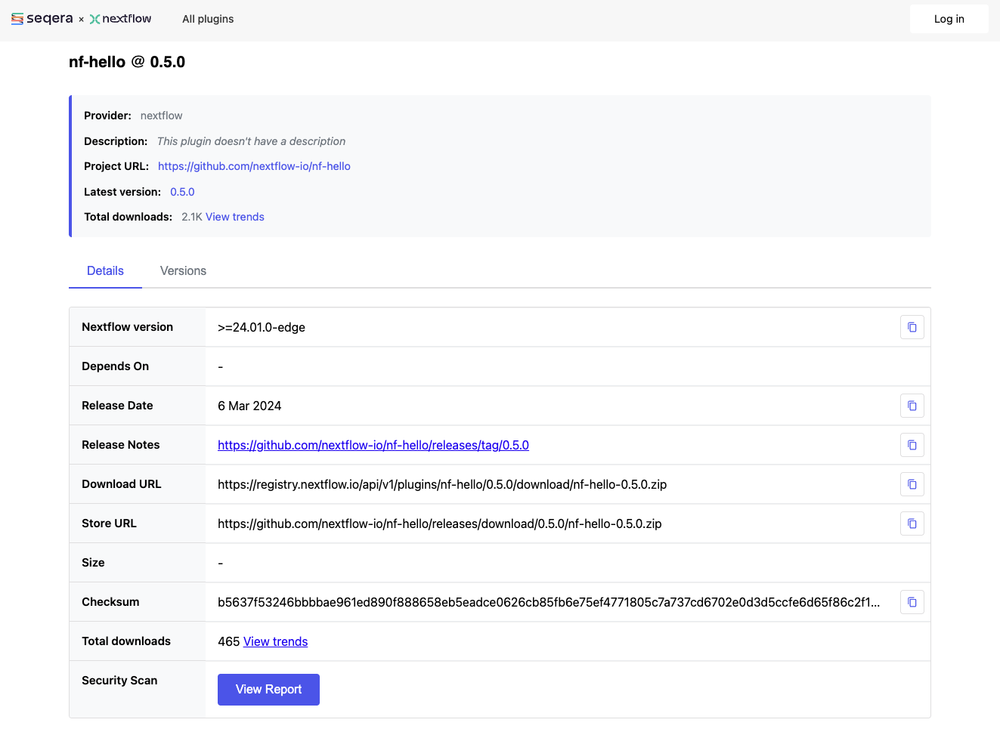

# Part 1: Plugin Basics

In this section, you'll learn how plugins extend Nextflow, then try three different plugins to see them in action.

---

## 1. How plugins work

Plugins extend Nextflow through several types of extension:

| Extension Type    | What it does                                 | Example                      |
| ----------------- | -------------------------------------------- | ---------------------------- |
| Functions         | Add custom functions callable from workflows | `samplesheetToList()`        |
| Workflow monitors | Respond to events like task completion       | Custom logging, Slack alerts |
| Executors         | Add task execution backends                  | AWS Batch, Kubernetes        |
| Filesystems       | Add storage backends                         | S3, Azure Blob               |

Functions and workflow monitors (called "trace observers" in the Nextflow API) are the most common types for plugin authors.
Executors and filesystems are typically created by platform vendors.

The next exercises show you function plugins and an observer plugin, so you can see both types in action.

---

## 2. Use function plugins

Function plugins add callable functions that you import into your workflows.
You'll try two: nf-hello (a simple example) and nf-schema (a widely-used real-world plugin).
Both exercises modify the same `hello.nf` pipeline, so you can see how plugins enhance an existing workflow.

### 2.1. nf-hello: replace hand-written code

The [nf-hello](https://github.com/nextflow-io/nf-hello) plugin provides a `randomString` function that generates random strings.
The pipeline already defines its own inline version of this function, which you'll replace with the one from the plugin.

#### 2.1.1. See the starting point

Look at the pipeline:

```bash
cat hello.nf
```

```groovy title="Output"
#!/usr/bin/env nextflow

params.input = 'greetings.csv'

/**
 * Generate a random alphanumeric string
 */
def randomString(int length) {
    def chars = ('a'..'z') + ('A'..'Z') + ('0'..'9')
    def random = new Random()
    return (1..length).collect { chars[random.nextInt(chars.size())] }.join()
}

process SAY_HELLO {
    input:
        val greeting
    output:
        stdout
    script:
    """
    echo '$greeting'
    """
}

workflow {
    greeting_ch = channel.fromPath(params.input)
        .splitCsv(header: true)
        .map { row -> "${row.greeting}_${randomString(8)}" }
    SAY_HELLO(greeting_ch)
    SAY_HELLO.out.view { result -> "Output: ${result.trim()}" }
}
```

The pipeline defines its own `randomString` function inline, then uses it to append a random ID to each greeting.

Run it:

```bash
nextflow run hello.nf
```

```console title="Output"
Output: Hello_aBcDeFgH
Output: Bonjour_xYzWvUtS
Output: Holà_qRsPdMnK
Output: Ciao_jLhGfEcB
Output: Hallo_tNwOiAuR
```

Your output order and random strings will differ, and if you run the script again you'll get a different set of random greetings.

#### 2.1.2. Configure the plugin

Now let's replace the inline function with one from a plugin. Add this plugin to your `nextflow.config`:

```groovy title="nextflow.config"
// Configuration for plugin development exercises
plugins {
    id 'nf-hello@0.5.0'
}
```

Plugins are declared in `nextflow.config` using the `plugins {}` block.
Nextflow automatically downloads them from the [Nextflow Plugin Registry](https://registry.nextflow.io/), a central repository of community and official plugins.

#### 2.1.3. Use the plugin function

Replace the inline `randomString` function with the plugin version:

=== "After"

    ```groovy title="hello.nf" hl_lines="3"
    #!/usr/bin/env nextflow

    include { randomString } from 'plugin/nf-hello'

    params.input = 'greetings.csv'

    process SAY_HELLO {
        input:
            val greeting
        output:
            stdout
        script:
        """
        echo '$greeting'
        """
    }

    workflow {
        greeting_ch = channel.fromPath(params.input)
            .splitCsv(header: true)
            .map { row -> "${row.greeting}_${randomString(8)}" }
        SAY_HELLO(greeting_ch)
        SAY_HELLO.out.view { result -> "Output: ${result.trim()}" }
    }
    ```

=== "Before"

    ```groovy title="hello.nf" hl_lines="5-12"
    #!/usr/bin/env nextflow

    params.input = 'greetings.csv'

    /**
     * Generate a random alphanumeric string
     */
    def randomString(int length) {
        def chars = ('a'..'z') + ('A'..'Z') + ('0'..'9')
        def random = new Random()
        return (1..length).collect { chars[random.nextInt(chars.size())] }.join()
    }

    process SAY_HELLO {
        input:
            val greeting
        output:
            stdout
        script:
        """
        echo '$greeting'
        """
    }

    workflow {
        greeting_ch = channel.fromPath(params.input)
            .splitCsv(header: true)
            .map { row -> "${row.greeting}_${randomString(8)}" }
        SAY_HELLO(greeting_ch)
        SAY_HELLO.out.view { result -> "Output: ${result.trim()}" }
    }
    ```

The `include` statement replaces 7 lines of hand-written code with a single import from a tested, versioned plugin.
The syntax `#!groovy include { function } from 'plugin/plugin-id'` is the same `include` used for Nextflow modules, with a `plugin/` prefix.
You can see the [source code for `randomString`](https://github.com/nextflow-io/nf-hello/blob/e67bddebfa589c7ae51f41bf780c92068dc09e93/plugins/nf-hello/src/main/nextflow/hello/HelloExtension.groovy#L110) in the nf-hello repository on GitHub.

#### 2.1.4. Run it

```bash
nextflow run hello.nf
```

```console title="Output"
Pipeline is starting! 🚀
Output: Hello_yqvtclcc
Output: Bonjour_vwwpyzcs
Output: Holà_wrghmgab
Output: Ciao_noniajuy
Output: Hallo_tvrtuxtp
Pipeline complete! 👋
```

(Your random strings will differ.)

The output still has random suffixes, but now `randomString` comes from the nf-hello plugin instead of inline code.
The "Pipeline is starting!" and "Pipeline complete!" messages are new.
They come from what Nextflow calls an 'observer', a kind of workflow 'monitor' defined in the plugin code that responds to certain types of event (more on this later), such as when the pipeline starts and finishes.
This shows that a single plugin can provide both functions and monitors.

Nextflow downloads plugins automatically the first time they're used, so any pipeline that declares `nf-hello@0.5.0` gets the exact same tested `randomString` function without copying code between projects.

You've now seen the three steps for using a function plugin: declare it in `nextflow.config`, import the function with `include`, and call it in your workflow.
The next exercise applies these same steps to a real-world plugin.

### 2.2. nf-schema: validated CSV parsing

The [nf-schema](https://github.com/nextflow-io/nf-schema) plugin is one of the most widely-used Nextflow plugins.
It provides `samplesheetToList`, a function that parses CSV/TSV files using a JSON schema that defines the expected columns and types.

The pipeline currently reads `greetings.csv` using `splitCsv` and a manual `map`, but nf-schema can replace this with validated, schema-driven parsing.
A JSON schema file (`greetings_schema.json`) is already provided in the exercise directory.

??? info "What is a schema?"

    A schema is a formal description of what valid data looks like.
    It defines things like which columns are expected, what type each value should be (string, number, etc.), and which fields are required.

    Think of it as a contract: if the input data doesn't match the schema, the tool can catch the problem early instead of letting it cause confusing errors later in the pipeline.

#### 2.2.1. Look at the schema

```bash
cat greetings_schema.json
```

```json title="Output"
{
  "$schema": "https://json-schema.org/draft/2020-12/schema",
  "type": "array",
  "items": {
    "type": "object",
    "properties": {
      "greeting": {
        "type": "string",
        "description": "The greeting text"
      },
      "language": {
        "type": "string",
        "description": "The language of the greeting"
      }
    },
    "required": ["greeting"]
  }
}
```

The schema defines two columns (`greeting` and `language`) and marks `greeting` as required.
If someone passes a CSV missing the `greeting` column, nf-schema catches the error before the pipeline runs.

#### 2.2.2. Add nf-schema to the config

Update `nextflow.config` to include both plugins:

=== "After"

    ```groovy title="nextflow.config" hl_lines="3"
    plugins {
        id 'nf-hello@0.5.0'
        id 'nf-schema@2.6.1'
    }
    ```

=== "Before"

    ```groovy title="nextflow.config"
    plugins {
        id 'nf-hello@0.5.0'
    }
    ```

#### 2.2.3. Update hello.nf to use samplesheetToList

Replace the `splitCsv` input with `samplesheetToList`:

=== "After"

    ```groovy title="hello.nf" hl_lines="4 20 21"
    #!/usr/bin/env nextflow

    include { randomString } from 'plugin/nf-hello'
    include { samplesheetToList } from 'plugin/nf-schema'

    params.input = 'greetings.csv'

    process SAY_HELLO {
        input:
            val greeting
        output:
            stdout
        script:
        """
        echo '$greeting'
        """
    }

    workflow {
        greeting_ch = Channel.fromList(samplesheetToList(params.input, 'greetings_schema.json'))
            .map { row -> "${row[0]}_${randomString(8)}" }
        SAY_HELLO(greeting_ch)
        SAY_HELLO.out.view { result -> "Output: ${result.trim()}" }
    }
    ```

=== "Before"

    ```groovy title="hello.nf" hl_lines="19 20 21"
    #!/usr/bin/env nextflow

    include { randomString } from 'plugin/nf-hello'

    params.input = 'greetings.csv'

    process SAY_HELLO {
        input:
            val greeting
        output:
            stdout
        script:
        """
        echo '$greeting'
        """
    }

    workflow {
        greeting_ch = channel.fromPath(params.input)
            .splitCsv(header: true)
            .map { row -> "${row.greeting}_${randomString(8)}" }
        SAY_HELLO(greeting_ch)
        SAY_HELLO.out.view { result -> "Output: ${result.trim()}" }
    }
    ```

Instead of `splitCsv` and a manual `map` to extract fields, `samplesheetToList` parses the CSV according to the schema.
Each row becomes a list of values in column order, so `row[0]` is the greeting and `row[1]` is the language.

#### 2.2.4. Run it

```bash
nextflow run hello.nf
```

```console title="Output"
Pipeline is starting! 🚀
Output: Hello_diozjdwm
Output: Bonjour_speathmm
Output: Holà_dllxnzap
Output: Ciao_wzueddzc
Output: Hallo_hsxwrjbh
Pipeline complete! 👋
```

(Your random strings will differ.)

The output is the same, but now the schema validates the CSV structure before the pipeline runs.
In real pipelines with complex sample sheets and many columns, this kind of validation prevents errors that manual `splitCsv` + `map` would miss.

#### 2.2.5. See validation in action

To see what schema validation catches, try introducing errors into `greetings.csv`.

Rename the required `greeting` column to `message`:

```csv title="greetings.csv" hl_lines="1"
message,language
Hello,English
Bonjour,French
Holà,Spanish
Ciao,Italian
Hallo,German
```

Run the pipeline:

```bash
nextflow run hello.nf
```

```console title="Output"
ERROR ~ Validation of samplesheet failed!

The following errors have been detected in greetings.csv:

-> Entry 1: Missing required field(s): greeting
-> Entry 2: Missing required field(s): greeting
-> Entry 3: Missing required field(s): greeting
-> Entry 4: Missing required field(s): greeting
-> Entry 5: Missing required field(s): greeting
```

The pipeline refuses to run because the schema requires a `greeting` column and can't find one.

Now restore the required column but rename the optional `language` column to `lang`:

```csv title="greetings.csv" hl_lines="1"
greeting,lang
Hello,English
Bonjour,French
Holà,Spanish
Ciao,Italian
Hallo,German
```

```bash
nextflow run hello.nf
```

This time the pipeline runs, but prints a warning:

```console title="Output (partial)"
WARN: Found the following unidentified headers in greetings.csv:
	- lang
```

Required columns cause hard errors; optional columns cause warnings.
This is the kind of early feedback that saves debugging time in real pipelines with dozens of columns.

Restore `greetings.csv` to its original state before continuing:

```csv title="greetings.csv"
greeting,language
Hello,English
Bonjour,French
Holà,Spanish
Ciao,Italian
Hallo,German
```

Both nf-hello and nf-schema are function plugins: they provide functions that you import with `include` and call in your workflow code.
The next exercise shows a different type of plugin that works without any `include` statements at all.

---

## 3. Use an observer plugin: nf-co2footprint

Not all plugins provide functions to import.
The [nf-co2footprint](https://github.com/nextflow-io/nf-co2footprint) plugin uses a **trace observer** to monitor your pipeline's resource usage and estimate its carbon footprint.
You don't need to change any pipeline code; just add it to the config.

### 3.1. Add nf-co2footprint to the config

Update `nextflow.config`:

=== "After"

    ```groovy title="nextflow.config" hl_lines="4"
    plugins {
        id 'nf-hello@0.5.0'
        id 'nf-schema@2.6.1'
        id 'nf-co2footprint'
    }
    ```

=== "Before"

    ```groovy title="nextflow.config"
    plugins {
        id 'nf-hello@0.5.0'
        id 'nf-schema@2.6.1'
    }
    ```

### 3.2. Run the pipeline

```bash
nextflow run hello.nf
```

The plugin produces several INFO and WARN messages during execution.
These are normal for a small example running on a local machine:

```console title="Output (partial)"
INFO - [nf-co2footprint] nf-co2footprint plugin  ~  version 1.1.0
WARN - [nf-co2footprint] Target zone null not found. Attempting to retrieve carbon intensity for fallback zone GLOBAL.
INFO - [nf-co2footprint] Using fallback carbon intensity from GLOBAL from CI table: 480.0 gCO₂eq/kWh.
...
WARN - [nf-co2footprint] Could not find CPU model "..." in given TDP data table. Using default CPU power draw value (11.41 W).
WARN - [nf-co2footprint] 🔁 Requested memory is null for task 2. Using maximum consumed memory/peak_rss (0.0 GB) for CO₂e footprint computation.
```

The warnings about zone, CPU model, and memory appear because the plugin can't detect the full hardware details of a local training environment.
In a production environment (e.g., an HPC cluster or cloud), these values would be available and the estimates more accurate.

At the end, look for a line like:

```console title="Output (partial)"
🌱 The workflow run used 126.76 uWh of electricity, resulting in the release of 60.84 ug of CO₂ equivalents into the atmosphere.
```

(Your numbers will differ.)

### 3.3. View the report

The plugin generates output files in your working directory:

```bash
ls co2footprint_*
```

```console title="Output"
co2footprint_report_<timestamp>.html
co2footprint_summary_<timestamp>.txt
co2footprint_trace_<timestamp>.txt
```

Look at the summary:

```bash
cat co2footprint_summary_*.txt
```

```console title="Output"
Total CO₂e footprint measures of this workflow run (including cached tasks):
  CO₂e emissions: 60.84 ug
  Energy consumption: 126.76 uWh
  CO₂e emissions (market): -

Which equals:
  - 3.48E-7 km travelled by car
  - It takes one tree 0.17s to sequester the equivalent amount of CO₂ from the atmosphere
  - 1.22E-7 % of a flight from Paris to London
```

(Your numbers will differ.)

The first section shows the raw energy and emissions figures.
The "Which equals" section puts those numbers in perspective by converting them to familiar equivalents.
The summary also includes a section listing the plugin's configuration options and a citation to the [Green Algorithms](https://doi.org/10.1002/advs.202100707) research paper that the calculation method is based on.

This plugin works entirely through the observer mechanism, hooking into workflow lifecycle events to collect resource metrics and generate its report when the pipeline completes.
No `include` statement is needed because it doesn't provide functions; it runs automatically once declared in the config.

You've now tried function plugins (imported with `include`) and an observer plugin (activated through config alone).
These are the two most common extension types, but as the table in section 1 shows, plugins can also add executors and filesystems.

---

## 4. Discovering plugins

The [Nextflow Plugin Registry](https://registry.nextflow.io/) is the central hub for finding available plugins.



Each plugin page shows its description, available versions, installation instructions, and links to documentation.

---

## 5. Prepare for plugin development

The following sections (Parts 2-6) use a separate pipeline file, `greet.nf`, which relies on nf-schema but not nf-hello or nf-co2footprint.

Update `nextflow.config` to keep only nf-schema:

```groovy title="nextflow.config"
// Configuration for plugin development exercises
plugins {
    id 'nf-schema@2.6.1'
}
```

Remove the co2footprint output files:

```bash
rm -f co2footprint_*
```

The `hello.nf` file retains your Part 1 work for reference; going forward, you'll work with `greet.nf`.

---

## Takeaway

You used three different plugins:

- **nf-hello**: A function plugin providing `randomString`, imported with `include`
- **nf-schema**: A function plugin providing `samplesheetToList` for schema-validated CSV parsing
- **nf-co2footprint**: An observer plugin that monitors resource usage automatically, with no `include` needed

Key patterns:

- Plugins are declared in `nextflow.config` with `#!groovy plugins { id 'plugin-name@version' }`
- Function plugins require `#!groovy include { function } from 'plugin/plugin-id'`
- Observer plugins work automatically once declared in the config
- The [Nextflow Plugin Registry](https://registry.nextflow.io/) lists available plugins

---

## What's next?

The following sections show you how to build your own plugin.
If you're not interested in plugin development, you can stop here or skip ahead to the [Summary](summary.md).

[Continue to Part 2 :material-arrow-right:](02_create_project.md){ .md-button .md-button--primary }
