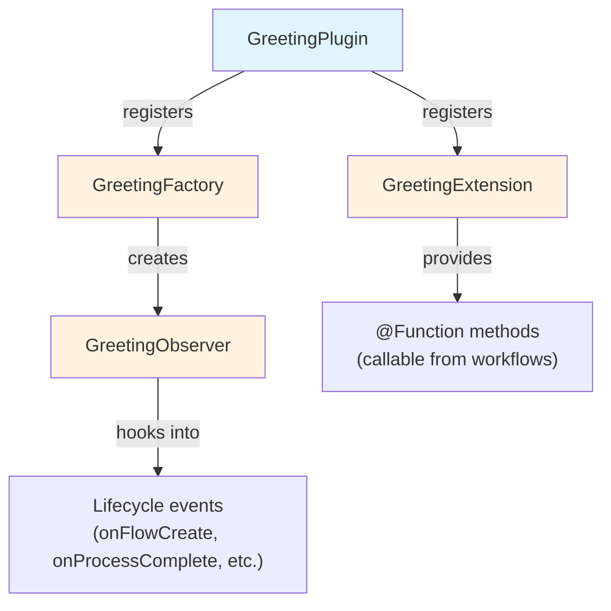

# Part 2: Create a Plugin Project

In this section, you'll scaffold a new plugin project and understand how the generated components work together.

!!! tip "Starting from here?"

    If you're joining at this part, copy the solution from Part 1 to use as your starting point:

    ```bash
    cp -r solutions/1-plugin-basics/* .
    ```

!!! info "Official documentation"

    This section and those that follow cover plugin development essentials.
    For comprehensive details, see the [official Nextflow plugin development documentation](https://www.nextflow.io/docs/latest/plugins/developing-plugins.html).

---

## 1. Using the plugin create command

The easiest way to create a plugin is with the built-in command:

```bash
nextflow plugin create nf-greeting training
```

This scaffolds a complete plugin project.
The first argument is the plugin name, and the second is your organization name (used for the package namespace).

!!! tip "Manual creation"

    You can also create plugin projects manually or use the [nf-hello template](https://github.com/nextflow-io/nf-hello) on GitHub as a starting point.

---

## 2. Understand the plugin architecture

Before diving into the generated files, here's how the pieces fit together:



| Class               | Purpose                                              |
| ------------------- | ---------------------------------------------------- |
| `GreetingPlugin`    | Entry point that registers all extension points      |
| `GreetingExtension` | Contains `@Function` methods callable from workflows |
| `GreetingFactory`   | Creates trace observer instances                     |
| `GreetingObserver`  | Hooks into workflow lifecycle events                 |

This separation keeps concerns organized: functions go in the Extension, event handling goes in Observers created by the Factory.

---

## 3. Examine the generated project

Change into the plugin directory:

```bash
cd nf-greeting
```

List the contents:

```bash
tree
```

You should see:

```console
.
├── build.gradle
├── COPYING
├── gradle
│   └── wrapper
│       ├── gradle-wrapper.jar
│       └── gradle-wrapper.properties
├── gradlew
├── Makefile
├── README.md
├── settings.gradle
└── src
    ├── main
    │   └── groovy
    │       └── training
    │           └── plugin
    │               ├── GreetingExtension.groovy
    │               ├── GreetingFactory.groovy
    │               ├── GreetingObserver.groovy
    │               └── GreetingPlugin.groovy
    └── test
        └── groovy
            └── training
                └── plugin
                    └── GreetingObserverTest.groovy

11 directories, 13 files
```

---

## 4. Explore the key files

With the project scaffolded, we need to understand how the pieces fit together.
The two most important files for project configuration are `settings.gradle` and `build.gradle`.

### 4.1. settings.gradle

This file identifies the project:

```bash
cat settings.gradle
```

```groovy title="settings.gradle"
rootProject.name = 'nf-greeting'
```

The name here must match what you'll put in `nextflow.config` when using the plugin.

### 4.2. build.gradle

The build file is where most configuration happens:

```bash
cat build.gradle
```

Key sections:

```groovy title="build.gradle"
plugins {
    id 'io.nextflow.nextflow-plugin' version '1.0.0-beta.10'
}

version = '0.1.0'

nextflowPlugin {
    nextflowVersion = '24.10.0'

    provider = 'training'
    className = 'training.plugin.GreetingPlugin'
    extensionPoints = [
        'training.plugin.GreetingExtension',
        'training.plugin.GreetingFactory'
    ]

}
```

The `nextflowPlugin` block configures:

- `nextflowVersion`: Minimum Nextflow version required
- `provider`: Your name or organization
- `className`: The main plugin class (uses your package name)
- `extensionPoints`: Classes providing extensions (functions, observers, etc.)

---

## 5. Explore the source files

The actual plugin code lives in `src/main/groovy/training/plugin/`.
Each file has a specific role, corresponding to the architecture diagram from section 2.

Open each file to see what the template generated:

```bash
cat src/main/groovy/training/plugin/GreetingPlugin.groovy
```

This is the entry point. It extends `BasePlugin` and is the class referenced in `build.gradle`.
Nextflow loads this class first, which then registers the other components.

```bash
cat src/main/groovy/training/plugin/GreetingExtension.groovy
```

The extension class holds functions marked with `@Function` that become callable from Nextflow workflows.
This is where you'll add most of your plugin's functionality.

```bash
cat src/main/groovy/training/plugin/GreetingFactory.groovy
```

The factory creates trace observer instances when workflows start.
This indirection allows observers to be configured based on session settings.

```bash
cat src/main/groovy/training/plugin/GreetingObserver.groovy
```

The observer hooks into workflow lifecycle events like start, task completion, and end.
The template includes messages that print "Pipeline is starting!" and "Pipeline complete!"

---

## Takeaway

You learned that:

- The `nextflow plugin create` command scaffolds a complete project
- Plugins have four main components: Plugin (entry point), Extension (functions), Factory (creates observers), and Observer (lifecycle hooks)
- The `build.gradle` file configures plugin metadata, dependencies, and extension points

---

## What's next?

Now we'll implement custom functions in the Extension class.

[Continue to Part 3 :material-arrow-right:](03_custom_functions.md){ .md-button .md-button--primary }
