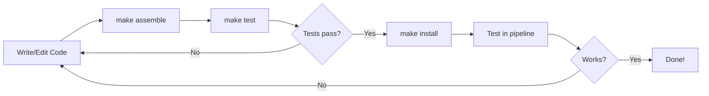

# Part 4: Build and Test

In this section, you'll learn the plugin development cycle: building, testing, installing locally, and using your plugin in a workflow.

!!! tip "Starting from here?"

    If you're joining at this part, copy the solution from Part 3 to use as your starting point:

    ```bash
    cp -r solutions/3-custom-functions/* .
    ```

    Then change into the plugin directory:

    ```bash
    cd nf-greeting
    ```

??? info "Why do we need to build?"

    If you're used to scripting languages like Python, R, or even Nextflow's DSL, you might wonder why we need a "build" step at all.
    In those languages, you write code and run it directly.

    Nextflow plugins are written in Groovy, which runs on the Java Virtual Machine (JVM).
    JVM languages need to be **compiled** before they can run.
    The human-readable source code is converted into bytecode that the JVM can execute.

    The build process:

    1. **Compiles** your Groovy code into JVM bytecode
    2. **Packages** it into a JAR file (Java ARchive, like a ZIP of compiled code)
    3. **Bundles** metadata so Nextflow knows how to load the plugin

    The build tools handle all this automatically.
    Run `make assemble` and let Gradle do the work.

---

## 1. The development cycle

The plugin development cycle follows a simple pattern:



---

## 2. Build the plugin

The Makefile provides convenient commands:

```bash
make assemble
```

Or directly with the Gradle wrapper:

```bash
./gradlew assemble
```

??? info "What is `./gradlew`?"

    The `./gradlew` script is the **Gradle wrapper**, a small script included with the project that automatically downloads and runs the correct version of Gradle.

    This means you don't need Gradle installed on your system.
    The first time you run `./gradlew`, it will download Gradle (which may take a moment), then run your command.

    The `make` commands in the Makefile are just shortcuts that call `./gradlew` for you.

??? example "Build output"

    The first time you run this, Gradle will download itself (this may take a minute):

    ```console
    Downloading https://services.gradle.org/distributions/gradle-8.14-bin.zip
    ...10%...20%...30%...40%...50%...60%...70%...80%...90%...100%

    Welcome to Gradle 8.14!
    ...

    Deprecated Gradle features were used in this build...

    BUILD SUCCESSFUL in 23s
    4 actionable tasks: 4 executed
    ```

    **The warnings are expected.**

    - **"Downloading gradle..."**: This only happens the first time. Subsequent builds are much faster.
    - **"Deprecated Gradle features..."**: This warning comes from the plugin template, not your code. It's safe to ignore.
    - **"BUILD SUCCESSFUL"**: This is what matters. Your plugin compiled without errors.

---

## 3. Write unit tests

A successful build means the code compiles, but not that it works correctly.
Tests verify your functions behave as expected and help catch bugs when you make changes later.

??? info "What are unit tests?"

    **Unit tests** are small pieces of code that automatically check if your functions work correctly.
    Each test calls a function with known inputs and checks that the output matches what you expect.

    For example, if you have a function that reverses strings, a test might check that `reverse("Hello")` returns `"olleH"`.

    Tests are valuable because:

    - They catch bugs before users do
    - They give you confidence to make changes without breaking things
    - They serve as documentation showing how functions should be used

    You don't need to write tests to use a plugin, but they're good practice for any code you plan to share or maintain.

The generated project includes a test for the Observer class, but we need to create a new test file for our extension functions.

### 3.1. Understanding Spock tests

The plugin template uses [Spock](https://spockframework.org/), a testing framework for Groovy that reads almost like plain English.
Here's the basic structure:

```groovy
def 'should reverse a greeting'() {   // (1)!
    given:                             // (2)!
    def ext = new GreetingExtension()

    expect:                            // (3)!
    ext.reverseGreeting('Hello') == 'olleH'
}
```

1. **Test name in quotes**: Describes what the test checks. Use plain English.
2. **`given:` block**: Set up what you need for the test (create objects, prepare data)
3. **`expect:` block**: The actual checks. Each line should be `true` for the test to pass

This structure makes tests readable: "Given an extension object, expect that `reverseGreeting('Hello')` equals `'olleH'`."

### 3.2. Create the test file

```bash
touch src/test/groovy/training/plugin/GreetingExtensionTest.groovy
```

Open it in your editor and add the following content:

```groovy title="src/test/groovy/training/plugin/GreetingExtensionTest.groovy" linenums="1"
package training.plugin

import spock.lang.Specification

/**
 * Tests for the greeting extension functions
 */
class GreetingExtensionTest extends Specification {

    def 'should reverse a greeting'() {
        given:
        def ext = new GreetingExtension()

        expect:
        ext.reverseGreeting('Hello') == 'olleH'
        ext.reverseGreeting('Bonjour') == 'ruojnoB'
    }

    def 'should decorate a greeting'() {
        given:
        def ext = new GreetingExtension()

        expect:
        ext.decorateGreeting('Hello') == '*** Hello ***'
    }

    def 'should create friendly greeting with default name'() {
        given:
        def ext = new GreetingExtension()

        expect:
        ext.friendlyGreeting('Hello') == 'Hello, World!'
    }

    def 'should create friendly greeting with custom name'() {
        given:
        def ext = new GreetingExtension()

        expect:
        ext.friendlyGreeting('Hello', 'Alice') == 'Hello, Alice!'
    }
}
```

---

## 4. Run the tests

```bash
make test
```

Or:

```bash
./gradlew test
```

??? example "Test output"

    ```console
    BUILD SUCCESSFUL in 5s
    6 actionable tasks: 2 executed, 4 up-to-date
    ```

    **Where are the test results?** Gradle hides detailed output when all tests pass.
    "BUILD SUCCESSFUL" means everything worked.
    If any test fails, you'll see detailed error messages.

---

## 5. View the test report

To see detailed results for each test, you can view the HTML test report that Gradle generates.

Start a simple web server in the test report directory:

```bash
pushd build/reports/tests/test
python -m http.server
```

VS Code will prompt you to open the application in your browser.
Click through to your test class to see individual test results:


The report shows each test method, its duration, and whether it passed or failed.
This confirms that all four of our greeting functions are being tested correctly.

Press ++ctrl+c++ in the terminal to stop the server when you're done, then return to the plugin directory:

```bash
popd
```

!!! tip "If the build fails"

    Build errors can be intimidating, but they usually point to a specific problem.
    Common issues include:

    - **Syntax errors**: A missing bracket, quote, or semicolon. The error message usually includes a line number.
    - **Import errors**: A class name is misspelled or the import statement is missing.
    - **Type errors**: You're passing the wrong type of data to a function.
    - **"cannot find symbol"**: You're using a variable that wasn't declared. Check that you've added the instance variable (e.g., `private String prefix`) before using it.

    Read the error message carefully.
    It often tells you exactly what's wrong and where.
    If you're stuck, compare your code character-by-character with the examples.

??? warning "Common runtime issues"

    Even if the build succeeds, you might encounter issues when running:

    - **"Plugin not found"**: Did you run `make install`? The plugin must be installed locally before Nextflow can use it.
    - **"Unknown function"**: Check that you've imported the function with `include { functionName } from 'plugin/nf-greeting'`.
    - **Wrong directory**: Make sure you're in the right directory. Use `pwd` to check, and `cd ..` or `cd nf-greeting` as needed.
    - **IDE showing errors**: The VS Code Nextflow extension may show warnings for plugin imports. If the build succeeds and Nextflow runs correctly, you can ignore these.

---

## 6. Install locally

Tests pass, so the plugin is ready to use.
To make it available to Nextflow, install it to your local plugins directory:

```bash
make install
```

??? example "Expected output"

    ```console
    > Task :installPlugin
    Plugin nf-greeting installed successfully!
    Installation location: /home/codespace/.nextflow/plugins
    Installation location determined by - Default location (~/.nextflow/plugins)

    BUILD SUCCESSFUL in 1s
    ```

    The exact path will vary depending on your environment, but you should see "Plugin nf-greeting installed successfully!" and "BUILD SUCCESSFUL".

This copies the plugin to `$NXF_HOME/plugins/` (typically `~/.nextflow/plugins/`).

---

## 7. Use your plugin in a workflow

With the plugin installed locally, you can use it in a Nextflow pipeline.

### 7.1. Configure the plugin

Go back to the pipeline directory:

```bash
cd ..
```

Edit `nextflow.config` to replace the `nf-hello` plugin with our new `nf-greeting` plugin:

=== "After"

    ```groovy title="nextflow.config" hl_lines="3"
    // Configuration for plugin development exercises
    plugins {
        id 'nf-greeting@0.1.0'
    }
    ```

=== "Before"

    ```groovy title="nextflow.config" hl_lines="3"
    // Configuration for plugin development exercises
    plugins {
        id 'nf-hello@0.5.0'
    }
    ```

We're replacing `nf-hello` with `nf-greeting` because we want to use our own plugin's functions instead.

!!! note "What about random_id_example.nf?"

    The `random_id_example.nf` file we modified earlier still imports from `nf-hello`, so it won't work with this config change.
    That's fine. We won't use it again.
    We'll work with `main.nf` from here on.

!!! note "Version required for local plugins"

    When using locally installed plugins, you must specify the version (e.g., `nf-greeting@0.1.0`).
    Published plugins in the registry can use just the name.

### 7.2. Import and use functions

We provided a simple greeting pipeline in `main.nf` that reads greetings from a CSV file and writes them to output files.

#### See the starting point

First, run the pipeline as-is to see what we're working with:

```bash
nextflow run main.nf
```

```console title="Output"
Output: Hello
Output: Bonjour
Output: Holà
Output: Ciao
Output: Hallo
```

Look at the code:

```bash
cat main.nf
```

```groovy title="main.nf (starting point)"
#!/usr/bin/env nextflow

params.input = 'greetings.csv'

process SAY_HELLO {
    input:
        val greeting
    output:
        stdout
    script:
    """
    echo '$greeting'
    """
}

workflow {
    greeting_ch = channel.fromPath(params.input)
                        .splitCsv(header: true)
                        .map { row -> row.greeting }
    SAY_HELLO(greeting_ch)
    SAY_HELLO.out.view { result -> "Output: ${result.trim()}" }
}
```

#### Update the workflow

Enhance it to use our plugin functions.
Edit `main.nf` to import and use the custom functions:

=== "After"

    ```groovy title="main.nf" hl_lines="4-5 15-18 28-30 33" linenums="1"
    #!/usr/bin/env nextflow

    // Import custom functions from our plugin
    include { reverseGreeting } from 'plugin/nf-greeting'
    include { decorateGreeting } from 'plugin/nf-greeting'

    params.input = 'greetings.csv'

    process SAY_HELLO {
        input:
            val greeting
        output:
            stdout
        script:
        // Use our custom plugin function to decorate the greeting
        def decorated = decorateGreeting(greeting)
        """
        echo '$decorated'
        """
    }

    workflow {
        greeting_ch = channel.fromPath(params.input)
                            .splitCsv(header: true)
                            .map { row -> row.greeting }

        // Demonstrate using reverseGreeting function
        greeting_ch
            .map { greeting -> reverseGreeting(greeting) }
            .view { reversed -> "Reversed: $reversed" }

        SAY_HELLO(greeting_ch)
        SAY_HELLO.out.view { result -> "Decorated: ${result.trim()}" }
    }
    ```

=== "Before"

    ```groovy title="main.nf" linenums="1" hl_lines="11 12 21"
    #!/usr/bin/env nextflow

    params.input = 'greetings.csv'

    process SAY_HELLO {
        input:
            val greeting
        output:
            stdout
        script:
        """
        echo '$greeting'
        """
    }

    workflow {
        greeting_ch = channel.fromPath(params.input)
                            .splitCsv(header: true)
                            .map { row -> row.greeting }
        SAY_HELLO(greeting_ch)
        SAY_HELLO.out.view { result -> "Output: ${result.trim()}" }
    }
    ```

The key changes:

- **Lines 4-5**: Import our plugin functions using `include { function } from 'plugin/plugin-name'`
- **Lines 17-18**: Use `decorateGreeting()` **inside the process script** to transform the greeting before output
- **Lines 28-30**: Use `reverseGreeting()` **in a `map` operation** to transform channel items in the workflow

Plugin functions work in both process scripts and workflow operations.

### 7.3. Run the pipeline

```bash
nextflow run main.nf
```

??? example "Output"

    ```console
    N E X T F L O W   ~  version 25.10.2

    Launching `main.nf` [elated_marconi] DSL2 - revision: cd8d52c97c

    Pipeline is starting! 🚀
    executor >  local (5)
    [fe/109754] process > SAY_HELLO (5) [100%] 5 of 5 ✔
    Reversed: olleH
    Reversed: ruojnoB
    Reversed: àloH
    Reversed: oaiC
    Reversed: ollaH
    Decorated: *** Hello ***
    Decorated: *** Bonjour ***
    Decorated: *** Holà ***
    Decorated: *** Ciao ***
    Decorated: *** Hallo ***
    Pipeline complete! 👋
    ```

    The "Pipeline is starting!" and "Pipeline complete!" messages come from the `GreetingObserver` trace observer that was included in the generated plugin template.

The `decorateGreeting()` function wraps each greeting with decorative markers, and `reverseGreeting()` shows the reversed strings.

---

## Takeaway

You learned that:

- Use `make assemble` to compile and `make test` to run tests
- Install with `make install` to use the plugin locally
- Import plugin functions with `include { function } from 'plugin/plugin-id'`
- Plugin functions work in both process scripts and workflow operations

---

## What's next?

The next section explores trace observers for hooking into workflow lifecycle events.

[Continue to Part 5 :material-arrow-right:](05_observers.md){ .md-button .md-button--primary }
