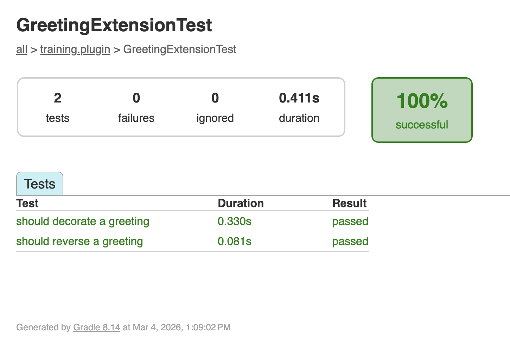

# Part 4: Testing

Unit tests verify your functions work correctly before you use them in pipelines.
In this section, you'll write and run tests using the Spock testing framework.

!!! tip "Starting from here?"

    If you're joining at this part, copy the solution from Part 3 to use as your starting point:

    ```bash
    cp -r solutions/3-custom-functions/* .
    ```

    Then change into the plugin directory:

    ```bash
    cd nf-greeting
    ```

---

## 1. Why test?

A successful build means the code compiles, but not that it works correctly.
Unit tests are small pieces of code that automatically check if your functions produce the right output for a given input.
For example, a test might check that `#!groovy reverseGreeting("Hello")` returns `"olleH"`.

Tests are valuable because:

- They catch bugs before users do
- They give you confidence to make changes without breaking things
- They serve as documentation showing how functions should be used

---

## 2. Understanding Spock tests

The plugin template uses [Spock](https://spockframework.org/), a testing framework for Groovy.
Spock is already configured in the project (via `build.gradle`), so you don't need to install anything.

If you've used testing tools before (like `pytest` in Python or `testthat` in R), Spock fills the same role: you write small functions that call your code with known inputs and check the outputs.
The difference is that Spock uses labelled blocks (`given:`, `expect:`, `when:`, `then:`) that read almost like plain English.

Here's the basic structure:

```groovy
def 'should reverse a greeting'() {   // (1)!
    given:                             // (2)!
    def ext = new GreetingExtension()

    expect:                            // (3)!
    ext.reverseGreeting('Hello') == 'olleH'
}
```

1. **Test name in quotes**: Describes what the test checks. Use plain English.
2. **`given:` block**: Set up what you need for the test (create objects, prepare data)
3. **`expect:` block**: The actual checks. Each line should be `true` for the test to pass

This structure makes tests readable: "Given an extension object, expect that `reverseGreeting('Hello')` equals `'olleH'`."

---

## 3. Create the test file

```bash
touch src/test/groovy/training/plugin/GreetingExtensionTest.groovy
```

Open it in your editor and add the following content:

```groovy title="src/test/groovy/training/plugin/GreetingExtensionTest.groovy" linenums="1"
package training.plugin

import spock.lang.Specification

/**
 * Tests for the greeting extension functions
 */
class GreetingExtensionTest extends Specification {

    def 'should reverse a greeting'() {
        given:
        def ext = new GreetingExtension()

        expect:
        ext.reverseGreeting('Hello') == 'olleH'
        ext.reverseGreeting('Bonjour') == 'ruojnoB'
    }

    def 'should decorate a greeting'() {
        given:
        def ext = new GreetingExtension()

        expect:
        ext.decorateGreeting('Hello') == '*** Hello ***'
    }
}
```

---

## 4. Run the tests

```bash
make test
```

??? example "Test output"

    ```console
    BUILD SUCCESSFUL in 5s
    6 actionable tasks: 6 executed
    ```

    **Where are the test results?** Gradle hides detailed output when all tests pass.
    "BUILD SUCCESSFUL" means everything worked.
    If any test fails, you'll see detailed error messages.

??? exercise "Add an edge case test"

    Add a test that checks `reverseGreeting` handles an empty string.
    What should `reverseGreeting('')` return?
    Add the test, run `make test`, and verify it passes.

    ??? solution

        Add this test method to `GreetingExtensionTest.groovy`:

        ```groovy
        def 'should handle empty string'() {
            given:
            def ext = new GreetingExtension()

            expect:
            ext.reverseGreeting('') == ''
        }
        ```

        An empty string reversed is still an empty string.

??? exercise "Test friendlyGreeting"

    If you completed the `friendlyGreeting` exercise in Part 3, add tests for it.
    Test both the default name and a custom name.

    ??? solution

        ```groovy
        def 'should create friendly greeting with default name'() {
            given:
            def ext = new GreetingExtension()

            expect:
            ext.friendlyGreeting('Hello') == 'Hello, World!'
        }

        def 'should create friendly greeting with custom name'() {
            given:
            def ext = new GreetingExtension()

            expect:
            ext.friendlyGreeting('Hello', 'Alice') == 'Hello, Alice!'
        }
        ```

---

## 5. View the test report

Gradle generates an HTML test report with detailed results for each test.

Start a simple web server in the test report directory.
The `pushd` command saves your current directory so you can return to it later:

```bash
pushd build/reports/tests/test
python -m http.server
```

VS Code will prompt you to open the application in your browser.
Click through to your test class to see individual test results:



The report shows each test method, its duration, and whether it passed or failed.

Press ++ctrl+c++ in the terminal to stop the server when you're done, then return to the previous directory with `popd`:

```bash
popd
```

Go back to the main project directory:

```bash
cd ..
```

---

## Takeaway

You learned that:

- Spock tests use a readable `given:`/`expect:` structure
- Use `make test` to run tests and `build/reports/tests/test/` for the HTML report
- Tests verify behavior and serve as documentation for how functions should be used

---

## What's next?

The next section explores trace observers for hooking into workflow lifecycle events.

[Continue to Part 5 :material-arrow-right:](05_observers.md){ .md-button .md-button--primary }
