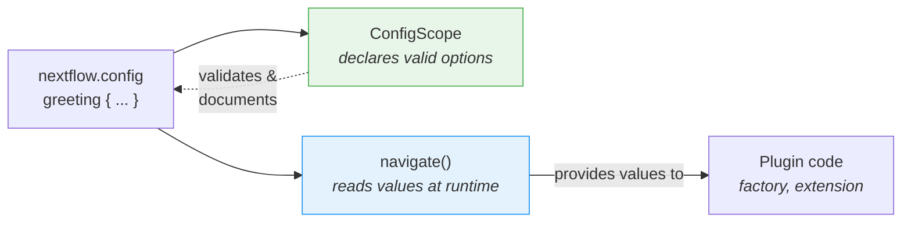

# Part 6: Configuration & Distribution

Your plugin has custom functions and an observer, but everything is hardcoded.
Users can't turn the task counter off, or change how it behaves, without editing the source code and rebuilding.

In Part 1, you used `#!groovy validation {}` and `#!groovy co2footprint {}` blocks in `nextflow.config` to control how nf-schema and nf-co2footprint behaved.
Those config blocks exist because the plugin authors built that capability in.
In this section, you'll do the same for your own plugin.

**Objectives:**

1. Let users enable/disable the plugin and control per-task messages through `nextflow.config`
2. Let users customize the greeting decorator's prefix and suffix
3. Register a formal config scope so Nextflow recognizes the `#!groovy greeting {}` block
4. Learn how to version and distribute a finished plugin

**What you'll change:**

| File                       | Change                                           |
| -------------------------- | ------------------------------------------------ |
| `TaskCounterObserver.groovy` | Accept a `verbose` flag from the factory         |
| `GreetingFactory.groovy`   | Read config values and pass them to the observer |
| `GreetingExtension.groovy` | Read prefix/suffix config in `init()`            |
| `GreetingConfig.groovy`    | New file: formal `@ConfigScope` class            |
| `build.gradle`             | Register the config class as an extension point  |
| `nextflow.config`          | Add a `#!groovy greeting {}` block to test it    |

!!! tip "Starting from here?"

    If you're joining at this part, copy the solution from Part 5 to use as your starting point:

    ```bash
    cp -r solutions/5-observers/* .
    ```

!!! info "Official documentation"

    For comprehensive configuration details, see the [Nextflow config scopes documentation](https://nextflow.io/docs/latest/developer/config-scopes.html).

Nextflow provides two approaches for plugin configuration, and they serve different purposes:

| Approach                    | Purpose                            | Trade-offs                              |
| -------------------------- | ---------------------------------- | --------------------------------------- |
| `session.config.navigate()` | **Read** config values at runtime  | No IDE support, manual type conversion  |
| `@ConfigScope` classes      | **Declare** what config options exist | More code, but type-safe and documented |

These two approaches work together.
`navigate()` is how your plugin code reads values; `ConfigScope` is how you tell Nextflow (and tooling) what options your plugin accepts.
You'll start with `navigate()` alone, see its limitations, then add a `ConfigScope` class on top.

---

## 1. Simple configuration with navigate()

Before changing any plugin code, here is the basic mechanism.
The `session.config.navigate()` method reads nested configuration values from `nextflow.config`:

```groovy
// Read 'greeting.enabled' from nextflow.config, defaulting to true
final enabled = session.config.navigate('greeting.enabled', true)
```

This lets users control plugin behavior:

```groovy title="nextflow.config"
greeting {
    enabled = false
}
```

There is a catch: Nextflow doesn't know the `greeting` scope exists.
The value still gets read correctly, but Nextflow prints an "Unrecognized config option" warning because nothing has declared `greeting` as a valid scope.
You'll see this warning in Section 2 and fix it in Section 4.

---

## 2. Make the task counter configurable

Right now, every pipeline run prints a message for each completed task.
For a pipeline with hundreds of tasks, that creates a lot of noise.
Users should be able to turn these messages off, or disable the plugin entirely, without modifying your source code.

To make that possible, two things need to change:

1. The observer needs to accept a setting that controls its behavior
2. The factory needs to read that setting from `nextflow.config` and pass it to the observer

### 2.1. Update TaskCounterObserver

The observer currently prints a message for every task unconditionally.
To make this controllable, it needs to accept a `verbose` flag from outside:

=== "After"

    ```groovy title="TaskCounterObserver.groovy" linenums="1" hl_lines="14 17-19 24-26"
    package training.plugin

    import groovy.transform.CompileStatic
    import nextflow.processor.TaskHandler
    import nextflow.trace.TraceObserver
    import nextflow.trace.TraceRecord

    /**
     * Observer that counts completed tasks
     */
    @CompileStatic
    class TaskCounterObserver implements TraceObserver {

        private final boolean verbose   // (1)!
        private int taskCount = 0

        TaskCounterObserver(boolean verbose) {  // (2)!
            this.verbose = verbose
        }

        @Override
        void onProcessComplete(TaskHandler handler, TraceRecord trace) {
            taskCount++
            if (verbose) {              // (3)!
                println "📊 Tasks completed so far: ${taskCount}"
            }
        }

        @Override
        void onFlowComplete() {
            println "📈 Final task count: ${taskCount}"
        }
    }
    ```

    1. A `verbose` flag controls whether per-task messages are printed
    2. Constructor accepts the verbose setting from the factory
    3. Only print per-task messages when `verbose` is `true`

=== "Before"

    ```groovy title="TaskCounterObserver.groovy" linenums="1" hl_lines="19"
    package training.plugin

    import groovy.transform.CompileStatic
    import nextflow.processor.TaskHandler
    import nextflow.trace.TraceObserver
    import nextflow.trace.TraceRecord

    /**
     * Observer that counts completed tasks
     */
    @CompileStatic
    class TaskCounterObserver implements TraceObserver {

        private int taskCount = 0

        @Override
        void onProcessComplete(TaskHandler handler, TraceRecord trace) {
            taskCount++
            println "📊 Tasks completed so far: ${taskCount}"
        }

        @Override
        void onFlowComplete() {
            println "📈 Final task count: ${taskCount}"
        }
    }
    ```

The key changes:

- A `verbose` flag controls whether per-task messages are printed
- The constructor accepts the verbose setting from the factory
- Per-task messages only print when `verbose` is `true`

### 2.2. Update the Factory

The observer can now accept a `verbose` flag, but nothing reads `nextflow.config` and passes it in yet.
The factory is where this happens, because the factory has access to the Nextflow session and its configuration.

=== "After"

    ```groovy title="GreetingFactory.groovy" linenums="31" hl_lines="3-6 9"
    @Override
    Collection<TraceObserver> create(Session session) {
        final enabled = session.config.navigate('greeting.enabled', true)
        if (!enabled) return []

        final verbose = session.config.navigate('greeting.taskCounter.verbose', true) as boolean
        return [
            new GreetingObserver(),
            new TaskCounterObserver(verbose)
        ]
    }
    ```

=== "Before"

    ```groovy title="GreetingFactory.groovy" linenums="31"
    @Override
    Collection<TraceObserver> create(Session session) {
        return [
            new GreetingObserver(),
            new TaskCounterObserver()
        ]
    }
    ```

The factory now:

- **Lines 33-34**: Reads the `greeting.enabled` config and returns early if disabled
- **Line 36**: Reads the `greeting.taskCounter.verbose` config (defaulting to `true`)
- **Line 39**: Passes the verbose setting to the `TaskCounterObserver` constructor

### 2.3. Build and test

Rebuild and reinstall the plugin:

```bash
cd nf-greeting && make assemble && make install && cd ..
```

Update `nextflow.config` to disable the per-task messages:

=== "After"

    ```groovy title="nextflow.config" linenums="1" hl_lines="7-10"
    // Configuration for plugin development exercises
    plugins {
        id 'nf-schema@2.6.1'
        id 'nf-greeting@0.1.0'
    }

    greeting {
        // enabled = false        // Disable plugin entirely
        taskCounter.verbose = false  // Disable per-task messages
    }
    ```

=== "Before"

    ```groovy title="nextflow.config" linenums="1"
    // Configuration for plugin development exercises
    plugins {
        id 'nf-schema@2.6.1'
        id 'nf-greeting@0.1.0'
    }
    ```

Run the pipeline and observe that only the final count appears:

```bash
nextflow run greet.nf -ansi-log false
```

??? example "Output"

    ```console
    N E X T F L O W  ~  version 25.10.2
    Launching `greet.nf` [stoic_wegener] DSL2 - revision: 63f3119fbc
    WARN: Unrecognized config option 'greeting.taskCounter.verbose'
    Pipeline is starting! 🚀
    Reversed: olleH
    Reversed: ruojnoB
    Reversed: àloH
    Reversed: oaiC
    Reversed: ollaH
    [5e/9c1f21] Submitted process > SAY_HELLO (2)
    [20/8f6f91] Submitted process > SAY_HELLO (1)
    [6d/496bae] Submitted process > SAY_HELLO (4)
    [5c/a7fe10] Submitted process > SAY_HELLO (3)
    [48/18199f] Submitted process > SAY_HELLO (5)
    Decorated: *** Hello ***
    Decorated: *** Bonjour ***
    Decorated: *** Holà ***
    Decorated: *** Ciao ***
    Decorated: *** Hallo ***
    Pipeline complete! 👋
    📈 Final task count: 5
    ```

    Note the "Unrecognized config option" warning on line 3.

!!! note

    The "Unrecognized config option" warning appears because Nextflow doesn't know about the `greeting` scope yet.
    The config values still work via `session.config.navigate()`, but Nextflow flags them as unrecognized.
    This goes away in Section 4 when you register a formal config scope class.

??? exercise "Disable the plugin entirely"

    Try setting `greeting.enabled = false` in `nextflow.config` and run the pipeline again.
    What changes in the output?

    ??? solution

        ```groovy title="nextflow.config" hl_lines="8"
        // Configuration for plugin development exercises
        plugins {
            id 'nf-schema@2.6.1'
            id 'nf-greeting@0.1.0'
        }

        greeting {
            enabled = false
        }
        ```

        The "Pipeline is starting!", "Pipeline complete!", and task count messages all disappear because the factory returns an empty list when `enabled` is false.
        The pipeline itself still runs, but no observers are active.

        Remember to set `enabled` back to `true` (or remove the line) before continuing.

---

## 3. Make the decorator configurable

The `decorateGreeting` function wraps every greeting in `*** ... ***`.
Users might want different markers, but right now the only way to change them is to edit the source code and rebuild.

This is the same pattern as section 2 (read config, use it at runtime), but applied to a function extension instead of an observer.

### 3.1. Add the configuration reading (this will fail!)

Edit `GreetingExtension.groovy` to read configuration in `init()` and use it in `decorateGreeting()`:

```groovy title="GreetingExtension.groovy" linenums="35" hl_lines="7-8 18"
@CompileStatic
class GreetingExtension extends PluginExtensionPoint {

    @Override
    protected void init(Session session) {
        // Read configuration with defaults
        prefix = session.config.navigate('greeting.prefix', '***') as String
        suffix = session.config.navigate('greeting.suffix', '***') as String
    }

    // ... other methods unchanged ...

    /**
    * Decorate a greeting with celebratory markers
    */
    @Function
    String decorateGreeting(String greeting) {
        return "${prefix} ${greeting} ${suffix}"
    }
```

Try to build:

```bash
cd nf-greeting && make assemble
```

### 3.2. Observe the error

The build fails:

```console
> Task :compileGroovy FAILED
GreetingExtension.groovy: 30: [Static type checking] - The variable [prefix] is undeclared.
 @ line 30, column 9.
           prefix = session.config.navigate('greeting.prefix', '***') as String
           ^

GreetingExtension.groovy: 31: [Static type checking] - The variable [suffix] is undeclared.
```

In Groovy (and Java), you must _declare_ a variable before using it.
We're trying to assign values to `prefix` and `suffix`, but we never told the class that these variables exist.

### 3.3. Fix by declaring instance variables

Add the variable declarations at the top of the class, right after the opening brace:

```groovy title="GreetingExtension.groovy" linenums="35" hl_lines="4-5"
@CompileStatic
class GreetingExtension extends PluginExtensionPoint {

    private String prefix = '***'
    private String suffix = '***'

    @Override
    protected void init(Session session) {
        // Read configuration with defaults
        prefix = session.config.navigate('greeting.prefix', '***') as String
        suffix = session.config.navigate('greeting.suffix', '***') as String
    }

    // ... rest of class unchanged ...
```

The `private String prefix = '***'` line does two things:

1. **Declares** a variable named `prefix` that can hold a String
2. **Initializes** it with a default value of `'***'`

Now the `init()` method can assign new values to these variables, and `decorateGreeting()` can read them.

### 3.4. Build again

```bash
make assemble
```

This time it should succeed with "BUILD SUCCESSFUL".

```bash
make install && cd ..
```

!!! tip "Learning from errors"

    This "declare before use" pattern is fundamental to Java/Groovy but unfamiliar if you come from Python or R where variables spring into existence when you first assign them.
    Experiencing this error once helps you recognize and fix it quickly in the future.

### 3.5. Test the configurable decorator

Update `nextflow.config` to customize the decoration:

=== "After"

    ```groovy title="nextflow.config" hl_lines="9-10"
    // Configuration for plugin development exercises
    plugins {
        id 'nf-schema@2.6.1'
        id 'nf-greeting@0.1.0'
    }

    greeting {
        taskCounter.verbose = false
        prefix = '>>>'
        suffix = '<<<'
    }
    ```

=== "Before"

    ```groovy title="nextflow.config"
    // Configuration for plugin development exercises
    plugins {
        id 'nf-schema@2.6.1'
        id 'nf-greeting@0.1.0'
    }

    greeting {
        taskCounter.verbose = false
    }
    ```

Run the pipeline:

```bash
nextflow run greet.nf -ansi-log false
```

```console title="Output (partial)"
Decorated: >>> Hello <<<
Decorated: >>> Bonjour <<<
...
```

The decorator now uses your custom prefix and suffix.

---

## 4. Formal configuration with ConfigScope

Your plugin configuration works, but Nextflow still prints "Unrecognized config option" warnings.
That is because `session.config.navigate()` only reads values; nothing has told Nextflow that `greeting` is a valid config scope.

A `ConfigScope` class fills that gap.
It declares what options your plugin accepts, their types, and their defaults.
It does **not** replace your `navigate()` calls. Instead, it works alongside them:



Without a `ConfigScope` class, `navigate()` still works, but:

- Nextflow warns about unrecognized options (as you've seen)
- No IDE autocompletion for users writing `nextflow.config`
- Configuration options aren't self-documenting
- Type conversion is manual (`as String`, `as boolean`)

Registering a formal config scope class fixes the warning and addresses all three issues.
This is the same mechanism behind the `#!groovy validation {}` and `#!groovy co2footprint {}` blocks you used in Part 1.

### 4.1. Create the config class (minimal version)

Create a new file:

```bash
touch nf-greeting/src/main/groovy/training/plugin/GreetingConfig.groovy
```

Start with a minimal config class for the `enabled`, `prefix`, and `suffix` options:

```groovy title="GreetingConfig.groovy" linenums="1"
package training.plugin

import nextflow.config.spec.ConfigOption
import nextflow.config.spec.ConfigScope
import nextflow.config.spec.ScopeName
import nextflow.script.dsl.Description

/**
 * Configuration options for the nf-greeting plugin.
 *
 * Users configure these in nextflow.config:
 *
 *     greeting {
 *         enabled = true
 *         prefix = '>>>'
 *         suffix = '<<<'
 *     }
 */
@ScopeName('greeting')                       // (1)!
class GreetingConfig implements ConfigScope { // (2)!

    GreetingConfig() {}

    GreetingConfig(Map opts) {               // (3)!
        this.enabled = opts.enabled as Boolean ?: true
        this.prefix = opts.prefix as String ?: '***'
        this.suffix = opts.suffix as String ?: '***'
    }

    @ConfigOption                            // (4)!
    @Description('Enable or disable the plugin entirely')
    boolean enabled = true

    @ConfigOption
    @Description('Prefix for decorated greetings')
    String prefix = '***'

    @ConfigOption
    @Description('Suffix for decorated greetings')
    String suffix = '***'
}
```

1. Maps to the `#!groovy greeting { }` block in `nextflow.config`
2. Required interface for config classes
3. Both no-arg and Map constructors are needed for Nextflow to instantiate the config
4. `@ConfigOption` marks a field as a configuration option; `@Description` documents it for tooling

Key points:

- **`@ScopeName('greeting')`**: Maps to the `greeting { }` block in config
- **`implements ConfigScope`**: Required interface for config classes
- **`@ConfigOption`**: Each field becomes a configuration option
- **`@Description`**: Documents each option for language server support (imported from `nextflow.script.dsl`)
- **Constructors**: Both no-arg and Map constructors are needed

### 4.2. Add nested configuration

The minimal version covers `enabled`, `prefix`, and `suffix`, but the `taskCounter.verbose` option uses a nested path.
To support that, add a nested class:

```groovy title="GreetingConfig.groovy (final version)" linenums="1" hl_lines="29-31 46 48-57"
package training.plugin

import nextflow.config.spec.ConfigOption
import nextflow.config.spec.ConfigScope
import nextflow.config.spec.ScopeName
import nextflow.script.dsl.Description

/**
 * Configuration options for the nf-greeting plugin.
 *
 * Users configure these in nextflow.config:
 *
 *     greeting {
 *         enabled = true
 *         prefix = '>>>'
 *         suffix = '<<<'
 *         taskCounter.verbose = false
 *     }
 */
@ScopeName('greeting')
class GreetingConfig implements ConfigScope {

    GreetingConfig() {}

    GreetingConfig(Map opts) {
        this.enabled = opts.enabled as Boolean ?: true
        this.prefix = opts.prefix as String ?: '***'
        this.suffix = opts.suffix as String ?: '***'
        if (opts.taskCounter instanceof Map) {
            this.taskCounter = new TaskCounterConfig(opts.taskCounter as Map)
        }
    }

    @ConfigOption
    @Description('Enable or disable the plugin entirely')
    boolean enabled = true

    @ConfigOption
    @Description('Prefix for decorated greetings')
    String prefix = '***'

    @ConfigOption
    @Description('Suffix for decorated greetings')
    String suffix = '***'

    TaskCounterConfig taskCounter = new TaskCounterConfig()

    static class TaskCounterConfig implements ConfigScope {
        TaskCounterConfig() {}
        TaskCounterConfig(Map opts) {
            this.verbose = opts.verbose as Boolean ?: true
        }

        @ConfigOption
        @Description('Show per-task completion messages')
        boolean verbose = true
    }
}
```

For nested paths like `taskCounter.verbose`, use a nested class that also implements `ConfigScope`.

### 4.3. Register the config class

Creating the class isn't enough on its own.
Nextflow needs to know it exists, so you register it in `build.gradle` alongside the other extension points.

=== "After"

    ```groovy title="build.gradle" hl_lines="4"
    extensionPoints = [
        'training.plugin.GreetingExtension',
        'training.plugin.GreetingFactory',
        'training.plugin.GreetingConfig'
    ]
    ```

=== "Before"

    ```groovy title="build.gradle"
    extensionPoints = [
        'training.plugin.GreetingExtension',
        'training.plugin.GreetingFactory'
    ]
    ```

Note the difference between the factory and extension points registration:

- **`extensionPoints` in `build.gradle`**: Compile-time registration. Tells the Nextflow plugin system which classes implement extension points.
- **Factory `create()` method**: Runtime registration. The factory creates observer instances when a workflow actually starts.

### 4.4. Build and test

```bash
cd nf-greeting && make assemble && make install && cd ..
nextflow run greet.nf -ansi-log false
```

The pipeline behavior is identical, but the "Unrecognized config option" warning is gone.

!!! note "What changed and what didn't"

    Your `GreetingFactory` and `GreetingExtension` still use `session.config.navigate()` to read values at runtime.
    None of that code changed.
    The `ConfigScope` class is a parallel declaration that tells Nextflow what options exist.
    Both pieces are needed: `ConfigScope` declares, `navigate()` reads.

Your plugin now has the same structure as the plugins you used in Part 1.
When nf-schema exposes a `#!groovy validation {}` block or nf-co2footprint exposes a `#!groovy co2footprint {}` block, they use exactly this pattern: a `ConfigScope` class with annotated fields, registered as an extension point.
Your `#!groovy greeting {}` block works the same way.

With functions, an observer, and a configuration scope in place, the plugin is feature-complete.
The final step is getting it into other people's hands.

---

## 5. Distribution

Once your plugin is working locally, you can share it with others through the Nextflow plugin registry.

### 5.1. Versioning

Follow [semantic versioning](https://semver.org/) for your releases:

| Version change            | When to use                       | Example                                    |
| ------------------------- | --------------------------------- | ------------------------------------------ |
| **MAJOR** (1.0.0 → 2.0.0) | Breaking changes                  | Removing a function, changing return types |
| **MINOR** (1.0.0 → 1.1.0) | New features, backward compatible | Adding a new function                      |
| **PATCH** (1.0.0 → 1.0.1) | Bug fixes, backward compatible    | Fixing a bug in existing function          |

Update the version in `build.gradle` before each release:

```groovy title="build.gradle"
version = '1.0.0'  // Use semantic versioning: MAJOR.MINOR.PATCH
```

### 5.2. Publishing to the registry

The [Nextflow plugin registry](https://registry.nextflow.io/) is the official way to share plugins with the community.

The publishing workflow:

1. Claim your plugin name on the [registry](https://registry.nextflow.io/) (sign in with your GitHub account)
2. Configure your API credentials in `~/.gradle/gradle.properties`
3. Run tests to verify everything works: `make test`
4. Publish with `make release`

For step-by-step instructions, see the [official publishing documentation](https://www.nextflow.io/docs/latest/guides/gradle-plugin.html#publishing-a-plugin).

Once published, users install your plugin without any local setup:

```groovy title="nextflow.config"
plugins {
    id 'nf-greeting@1.0.0'
}
```

Nextflow automatically downloads the plugin from the registry on first use.

---

## Takeaway

You learned that:

- `session.config.navigate()` **reads** config values at runtime
- `@ConfigScope` classes **declare** what config options exist; they work alongside `navigate()`, not instead of it
- Configuration can be applied to both observers and extension functions
- Variables must be declared before use in Groovy/Java
- Use semantic versioning and the public registry to distribute plugins

| Use case                            | Recommended approach                                  |
| ----------------------------------- | ----------------------------------------------------- |
| Quick prototype or simple plugin    | `session.config.navigate()` only                      |
| Production plugin with many options | Add a `ConfigScope` class alongside your `navigate()` calls |
| Plugin you'll share publicly        | Add a `ConfigScope` class alongside your `navigate()` calls |

---

## What's next?

You've completed the plugin development training.

[Continue to Summary :material-arrow-right:](summary.md){ .md-button .md-button--primary }
