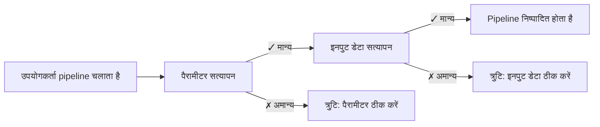

# भाग 5: इनपुट सत्यापन

<span class="ai-translation-notice">:material-information-outline:{ .ai-translation-notice-icon } AI-सहायता प्राप्त अनुवाद - [अधिक जानें और सुधार सुझाएं](https://github.com/nextflow-io/training/blob/master/TRANSLATING.md)</span>

Hello nf-core प्रशिक्षण कोर्स के इस पांचवें भाग में, हम आपको दिखाते हैं कि pipeline इनपुट और पैरामीटर को सत्यापित करने के लिए nf-schema plugin का उपयोग कैसे करें।

??? info "इस खंड से कैसे शुरू करें"

    यह खंड मानता है कि आपने [भाग 4: nf-core मॉड्यूल बनाएं](./04_make_module.md) पूरा कर लिया है और अपने pipeline में `COWPY` प्रोसेस मॉड्यूल को nf-core मानकों के अनुसार अपडेट कर दिया है।

    यदि आपने भाग 4 पूरा नहीं किया है या इस भाग के लिए नई शुरुआत करना चाहते हैं, तो आप अपने प्रारंभिक बिंदु के रूप में `core-hello-part4` समाधान का उपयोग कर सकते हैं।
    `hello-nf-core/` डायरेक्टरी के अंदर से ये कमांड चलाएं:

    ```bash
    cp -r solutions/core-hello-part4 core-hello
    cd core-hello
    ```

    यह आपको एक pipeline देता है जिसमें `COWPY` मॉड्यूल पहले से nf-core मानकों का पालन करने के लिए अपग्रेड किया गया है।
    आप निम्नलिखित कमांड चलाकर परीक्षण कर सकते हैं कि यह सफलतापूर्वक चलता है:

    ```bash
    nextflow run . --outdir core-hello-results -profile test,docker --validate_params false
    ```

---

## 0. वार्मअप: थोड़ी पृष्ठभूमि

### 0.1. सत्यापन क्यों महत्वपूर्ण है

कल्पना कीजिए कि आपका pipeline दो घंटे तक चल रहा है, केवल इसलिए क्रैश हो जाता है क्योंकि किसी उपयोगकर्ता ने गलत एक्सटेंशन वाली फ़ाइल प्रदान की थी। या घंटों तक रहस्यमय त्रुटियों को डीबग करने में बिताते हैं, केवल यह पता लगाने के लिए कि किसी पैरामीटर की स्पेलिंग गलत थी। इनपुट सत्यापन के बिना, ये परिदृश्य आम हैं।

इस उदाहरण पर विचार करें:

```console title="सत्यापन के बिना"
$ nextflow run my-pipeline --input data.txt --output results

...2 घंटे बाद...

ERROR ~ No such file: 'data.fq.gz'
  Expected FASTQ format but received TXT
```

Pipeline ने अमान्य इनपुट स्वीकार किए और विफल होने से पहले घंटों चला। उचित सत्यापन के साथ:

```console title="सत्यापन के साथ"
$ nextflow run my-pipeline --input data.txt --output results

ERROR ~ Validation of pipeline parameters failed!

 * --input (data.txt): File extension '.txt' does not match required pattern '.fq.gz' or '.fastq.gz'
 * --output: required parameter is missing (expected: --outdir)

Pipeline failed before execution - please fix the errors above
```

Pipeline स्पष्ट, कार्रवाई योग्य त्रुटि संदेशों के साथ तुरंत विफल हो जाता है। यह समय, कंप्यूट संसाधन और निराशा बचाता है।

### 0.2. nf-schema plugin

[nf-schema plugin](https://nextflow-io.github.io/nf-schema/latest/) एक Nextflow plugin है जो Nextflow pipelines के लिए व्यापक सत्यापन क्षमताएं प्रदान करता है।
जबकि nf-schema किसी भी Nextflow workflow के साथ काम करता है, यह सभी nf-core pipelines के लिए मानक सत्यापन समाधान है।

nf-schema कई मुख्य कार्य प्रदान करता है:

- **पैरामीटर सत्यापन**: `nextflow_schema.json` के विरुद्ध pipeline पैरामीटर को सत्यापित करता है
- **नमूना शीट सत्यापन**: `assets/schema_input.json` के विरुद्ध इनपुट फ़ाइलों को सत्यापित करता है
- **चैनल रूपांतरण**: सत्यापित नमूना शीट को Nextflow channels में परिवर्तित करता है
- **सहायता टेक्स्ट जनरेशन**: स्कीमा परिभाषाओं से स्वचालित रूप से `--help` आउटपुट उत्पन्न करता है
- **पैरामीटर सारांश**: प्रदर्शित करता है कि कौन से पैरामीटर डिफ़ॉल्ट से भिन्न हैं

nf-schema deprecated nf-validation plugin का उत्तराधिकारी है और सत्यापन के लिए मानक [JSON Schema Draft 2020-12](https://json-schema.org/) का उपयोग करता है।

??? info "Nextflow plugins क्या हैं?"

    Plugins एक्सटेंशन हैं जो Nextflow भाषा में ही नई कार्यक्षमता जोड़ते हैं। वे `nextflow.config` में `plugins{}` ब्लॉक के माध्यम से इंस्टॉल किए जाते हैं और प्रदान कर सकते हैं:

    - नए फ़ंक्शन और क्लास जिन्हें इम्पोर्ट किया जा सकता है (जैसे `samplesheetToList`)
    - नई DSL सुविधाएं और ऑपरेटर
    - बाहरी सेवाओं के साथ एकीकरण

    nf-schema plugin `nextflow.config` में निर्दिष्ट किया गया है:

    ```groovy
    plugins {
        id 'nf-schema@2.1.1'
    }
    ```

    एक बार इंस्टॉल होने के बाद, आप `include { functionName } from 'plugin/plugin-name'` सिंटैक्स का उपयोग करके plugins से फ़ंक्शन इम्पोर्ट कर सकते हैं।

### 0.3. दो प्रकार के सत्यापन के लिए दो स्कीमा फ़ाइलें

एक nf-core pipeline दो अलग स्कीमा फ़ाइलों का उपयोग करेगा, जो दो प्रकार के सत्यापन से संबंधित हैं:

| स्कीमा फ़ाइल               | उद्देश्य           | सत्यापित करता है                                   |
| -------------------------- | ------------------ | -------------------------------------------------- |
| `nextflow_schema.json`     | पैरामीटर सत्यापन   | कमांड-लाइन फ्लैग: `--input`, `--outdir`, `--batch` |
| `assets/schema_input.json` | इनपुट डेटा सत्यापन | नमूना शीट और इनपुट फ़ाइलों की सामग्री              |

दोनों स्कीमा JSON Schema फॉर्मेट का उपयोग करते हैं, जो डेटा संरचनाओं का वर्णन और सत्यापन करने के लिए व्यापक रूप से अपनाया गया मानक है।

**पैरामीटर सत्यापन** कमांड-लाइन पैरामीटर (जैसे `--outdir`, `--batch`, `--input` जैसे फ्लैग) को सत्यापित करता है:

- पैरामीटर प्रकार, रेंज और फॉर्मेट की जांच करता है
- सुनिश्चित करता है कि आवश्यक पैरामीटर प्रदान किए गए हैं
- सत्यापित करता है कि फ़ाइल पथ मौजूद हैं
- `nextflow_schema.json` में परिभाषित

**इनपुट डेटा सत्यापन** नमूना शीट और मेनिफेस्ट फ़ाइलों की संरचना को सत्यापित करता है (CSV/TSV फ़ाइलें जो आपके डेटा का वर्णन करती हैं):

- कॉलम संरचना और डेटा प्रकारों की जांच करता है
- सत्यापित करता है कि नमूना शीट में संदर्भित फ़ाइल पथ मौजूद हैं
- सुनिश्चित करता है कि आवश्यक फ़ील्ड मौजूद हैं
- `assets/schema_input.json` में परिभाषित

!!! warning "इनपुट डेटा सत्यापन क्या नहीं करता"

    इनपुट डेटा सत्यापन *मेनिफेस्ट फ़ाइलों* (नमूना शीट, CSV फ़ाइलें) की संरचना की जांच करता है, आपकी वास्तविक डेटा फ़ाइलों (FASTQ, BAM, VCF, आदि) की सामग्री की नहीं।

    बड़े पैमाने के डेटा के लिए, फ़ाइल सामग्री को सत्यापित करना (जैसे BAM अखंडता की जांच) ऑर्केस्ट्रेटिंग मशीन पर सत्यापन चरण के दौरान नहीं, बल्कि worker nodes पर चल रहे pipeline processes में होना चाहिए।

### 0.4. सत्यापन कब होना चाहिए?



किसी भी pipeline processes के चलने से **पहले** सत्यापन होना चाहिए, ताकि तेज़ फीडबैक मिल सके और कंप्यूट समय की बर्बादी से बचा जा सके।

अब आइए इन सिद्धांतों को व्यावहारिक रूप से लागू करें, पैरामीटर सत्यापन से शुरू करते हुए।

---

## 1. पैरामीटर सत्यापन (nextflow_schema.json)

आइए अपने pipeline में पैरामीटर सत्यापन जोड़कर शुरू करें। यह `--input`, `--outdir`, और `--batch` जैसे कमांड-लाइन फ्लैग को सत्यापित करता है।

### 1.1. इनपुट फ़ाइल सत्यापन को छोड़ने के लिए सत्यापन कॉन्फ़िगर करें

nf-core pipeline टेम्पलेट nf-schema के साथ पहले से इंस्टॉल और कॉन्फ़िगर होता है:

- nf-schema plugin `nextflow.config` में `plugins{}` ब्लॉक के माध्यम से इंस्टॉल किया गया है
- पैरामीटर सत्यापन `params.validate_params = true` के माध्यम से डिफ़ॉल्ट रूप से सक्षम है
- सत्यापन pipeline इनिशियलाइज़ेशन के दौरान `UTILS_NFSCHEMA_PLUGIN` subworkflow द्वारा किया जाता है

सत्यापन व्यवहार `nextflow.config` में `validation{}` स्कोप के माध्यम से नियंत्रित किया जाता है।

चूंकि हम पहले पैरामीटर सत्यापन पर काम करेंगे (यह खंड) और खंड 2 तक इनपुट डेटा स्कीमा कॉन्फ़िगर नहीं करेंगे, हमें अस्थायी रूप से nf-schema को `input` पैरामीटर की फ़ाइल सामग्री को सत्यापित करने से छोड़ने के लिए कहना होगा।

`nextflow.config` खोलें और `validation` ब्लॉक खोजें (लगभग लाइन 246)। इनपुट फ़ाइल सत्यापन को छोड़ने के लिए `ignoreParams` जोड़ें:

=== "बाद में"

    ```groovy title="nextflow.config" hl_lines="3" linenums="246"
    validation {
        defaultIgnoreParams = ["genomes"]
        ignoreParams = ['input']
        monochromeLogs = params.monochrome_logs
    }
    ```

=== "पहले"

    ```groovy title="nextflow.config" linenums="246"
    validation {
        defaultIgnoreParams = ["genomes"]
        monochromeLogs = params.monochrome_logs
    }
    ```

यह कॉन्फ़िगरेशन nf-schema को बताती है:

- **`defaultIgnoreParams`**: `genomes` जैसे जटिल पैरामीटर के सत्यापन को छोड़ें (टेम्पलेट डेवलपर्स द्वारा सेट)
- **`ignoreParams`**: `input` पैरामीटर की फ़ाइल सामग्री के सत्यापन को छोड़ें (अस्थायी; हम खंड 2 में इसे फिर से सक्षम करेंगे)
- **`monochromeLogs`**: `true` पर सेट होने पर सत्यापन संदेशों में रंगीन आउटपुट अक्षम करें (`params.monochrome_logs` द्वारा नियंत्रित)

!!! note "input पैरामीटर को क्यों अनदेखा करें?"

    `nextflow_schema.json` में `input` पैरामीटर में `"schema": "assets/schema_input.json"` है जो nf-schema को उस स्कीमा के विरुद्ध इनपुट CSV फ़ाइल की *सामग्री* को सत्यापित करने के लिए कहता है।
    चूंकि हमने अभी तक उस स्कीमा को कॉन्फ़िगर नहीं किया है, हम अस्थायी रूप से इस सत्यापन को अनदेखा करते हैं।
    हम इनपुट डेटा स्कीमा को कॉन्फ़िगर करने के बाद खंड 2 में इस सेटिंग को हटा देंगे।

### 1.2. पैरामीटर स्कीमा की जांच करें

आइए `nextflow_schema.json` फ़ाइल के एक खंड को देखें जो हमारे pipeline टेम्पलेट के साथ आया था:

```bash
grep -A 25 '"input_output_options"' nextflow_schema.json
```

पैरामीटर स्कीमा समूहों में व्यवस्थित है। यहां `input_output_options` समूह है:

```json title="core-hello/nextflow_schema.json (अंश)" linenums="8"
        "input_output_options": {
            "title": "Input/output options",
            "type": "object",
            "fa_icon": "fas fa-terminal",
            "description": "Define where the pipeline should find input data and save output data.",
            "required": ["input", "outdir"],
            "properties": {
                "input": {
                    "type": "string",
                    "format": "file-path",
                    "exists": true,
                    "schema": "assets/schema_input.json",
                    "mimetype": "text/csv",
                    "pattern": "^\\S+\\.csv$",
                    "description": "Path to comma-separated file containing information about the samples in the experiment.",
                    "help_text": "You will need to create a design file with information about the samples in your experiment before running the pipeline. Use this parameter to specify its location. It has to be a comma-separated file with 3 columns, and a header row.",
                    "fa_icon": "fas fa-file-csv"
                },
                "outdir": {
                    "type": "string",
                    "format": "directory-path",
                    "description": "The output directory where the results will be saved. You have to use absolute paths to storage on Cloud infrastructure.",
                    "fa_icon": "fas fa-folder-open"
                }
            }
        },
```

यहां वर्णित प्रत्येक इनपुट में निम्नलिखित मुख्य गुण हैं जिन्हें सत्यापित किया जा सकता है:

- **`type`**: डेटा प्रकार (string, integer, boolean, number)
- **`format`**: विशेष फॉर्मेट जैसे `file-path` या `directory-path`
- **`exists`**: फ़ाइल पथों के लिए, जांचें कि फ़ाइल मौजूद है या नहीं
- **`pattern`**: नियमित अभिव्यक्ति जिससे मान मेल खाना चाहिए
- **`required`**: पैरामीटर नामों की सरणी जो प्रदान की जानी चाहिए
- **`mimetype`**: सत्यापन के लिए अपेक्षित फ़ाइल mimetype

यदि आपकी नज़र तेज़ है, तो आप देख सकते हैं कि जिस `batch` इनपुट पैरामीटर का हम उपयोग कर रहे हैं वह अभी तक स्कीमा में परिभाषित नहीं है।
हम इसे अगले खंड में जोड़ने वाले हैं।

??? info "स्कीमा पैरामीटर कहां से आते हैं?"

    स्कीमा सत्यापन पैरामीटर परिभाषाओं के लिए आधार के रूप में `nextflow.config` का उपयोग करता है।
    आपकी workflow स्क्रिप्ट में कहीं और घोषित पैरामीटर (जैसे `main.nf` या मॉड्यूल फ़ाइलों में) स्कीमा validator द्वारा स्वचालित रूप से **नहीं** उठाए जाते हैं।

    इसका मतलब है कि आपको हमेशा अपने pipeline पैरामीटर `nextflow.config` में घोषित करने चाहिए, और फिर उनके सत्यापन नियम `nextflow_schema.json` में परिभाषित करने चाहिए।

### 1.3. batch पैरामीटर जोड़ें

जबकि स्कीमा एक JSON फ़ाइल है जिसे मैन्युअल रूप से संपादित किया जा सकता है, **मैन्युअल संपादन त्रुटि-प्रवण है और अनुशंसित नहीं है**।
इसके बजाय, nf-core एक इंटरैक्टिव GUI टूल प्रदान करता है जो आपके लिए JSON Schema सिंटैक्स को संभालता है और आपके परिवर्तनों को सत्यापित करता है:

```bash
nf-core pipelines schema build
```

आपको कुछ इस तरह दिखना चाहिए:

```console
                                      ,--./,-.
      ___     __   __   __   ___     /,-._.--\
|\ | |__  __ /  ` /  \ |__) |__         }  {
| \| |       \__, \__/ |  \ |___     \`-._,-`-,
                                      `._,._,'

nf-core/tools version 3.4.1 - https://nf-co.re

INFO     [✓] Default parameters match schema validation
INFO     [✓] Pipeline schema looks valid (found 17 params)
INFO     Writing schema with 17 params: 'nextflow_schema.json'
🚀  Launch web builder for customisation and editing? [y/n]:
```

`y` टाइप करें और Enter दबाएं ताकि इंटरैक्टिव वेब इंटरफ़ेस लॉन्च हो सके।

आपका ब्राउज़र Parameter schema builder दिखाते हुए खुलेगा:


`batch` पैरामीटर जोड़ने के लिए:

1. शीर्ष पर **"Add parameter"** बटन पर क्लिक करें
2. drag handle (⋮⋮) का उपयोग करके नए पैरामीटर को "Input/output options" समूह में, `input` पैरामीटर के नीचे ले जाएं
3. पैरामीटर विवरण भरें:
   - **ID**: `batch`
   - **Description**: `Name for this batch of greetings`
   - **Type**: `string`
   - **Required**: चेकबॉक्स टिक करें
   - वैकल्पिक रूप से, icon picker से एक आइकन चुनें (जैसे, `fas fa-layer-group`)


जब आप समाप्त कर लें, तो शीर्ष दाएं कोने में **"Finished"** बटन पर क्लिक करें।

अपने टर्मिनल में वापस, आप देखेंगे:

```console
INFO     Writing schema with 18 params: 'nextflow_schema.json'
⣾ Use ctrl+c to stop waiting and force exit.
```

schema builder से बाहर निकलने के लिए `Ctrl+C` दबाएं।

टूल ने अब आपकी `nextflow_schema.json` फ़ाइल को नए `batch` पैरामीटर के साथ अपडेट कर दिया है, सभी JSON Schema सिंटैक्स को सही तरीके से संभालते हुए।

### 1.4. परिवर्तनों की पुष्टि करें

```bash
grep -A 25 '"input_output_options"' nextflow_schema.json
```

```json title="core-hello/nextflow_schema.json (अंश)" linenums="8" hl_lines="19-23"
    "input_output_options": {
      "title": "Input/output options",
      "type": "object",
      "fa_icon": "fas fa-terminal",
      "description": "Define where the pipeline should find input data and save output data.",
      "required": ["input", "outdir", "batch"],
      "properties": {
        "input": {
          "type": "string",
          "format": "file-path",
          "exists": true,
          "schema": "assets/schema_input.json",
          "mimetype": "text/csv",
          "pattern": "^\\S+\\.csv$",
          "description": "Path to comma-separated file containing information about the samples in the experiment.",
          "help_text": "You will need to create a design file with information about the samples in your experiment before running the pipeline. Use this parameter to specify its location. It has to be a comma-separated file with 3 columns, and a header row.",
          "fa_icon": "fas fa-file-csv"
        },
        "batch": {
          "type": "string",
          "description": "Name for this batch of greetings",
          "fa_icon": "fas fa-layer-group"
        },
```

आपको दिखना चाहिए कि `batch` पैरामीटर स्कीमा में जोड़ा गया है, "required" फ़ील्ड अब `["input", "outdir", "batch"]` दिखा रहा है।

### 1.5. पैरामीटर सत्यापन का परीक्षण करें

अब आइए परीक्षण करें कि पैरामीटर सत्यापन सही तरीके से काम करता है।

सबसे पहले, आवश्यक `input` पैरामीटर के बिना चलाने का प्रयास करें:

```bash
nextflow run . --outdir test-results -profile docker
```

??? warning "कमांड आउटपुट"

    ```console
    ERROR ~ Validation of pipeline parameters failed!

    -- Check '.nextflow.log' file for details
    The following invalid input values have been detected:

    * Missing required parameter(s): input, batch
    ```

बिल्कुल सही! सत्यापन pipeline चलने से पहले लापता आवश्यक पैरामीटर को पकड़ता है।

अब मान्य पैरामीटर के एक सेट के साथ प्रयास करें:

```bash
nextflow run . --input assets/greetings.csv --outdir results --batch my-batch -profile test,docker
```

??? success "कमांड आउटपुट"

    ```console
     N E X T F L O W   ~  version 25.04.3

    Launching `./main.nf` [peaceful_wozniak] DSL2 - revision: b9e9b3b8de

    executor >  local (8)
    [de/a1b2c3] CORE_HELLO:HELLO:sayHello (3)       | 3 of 3 ✔
    [4f/d5e6f7] CORE_HELLO:HELLO:convertToUpper (3) | 3 of 3 ✔
    [8a/b9c0d1] CORE_HELLO:HELLO:CAT_CAT (test)     | 1 of 1 ✔
    [e2/f3a4b5] CORE_HELLO:HELLO:COWPY (test)       | 1 of 1 ✔
    -[core/hello] Pipeline completed successfully-
    ```

Pipeline सफलतापूर्वक चलना चाहिए, और `batch` पैरामीटर अब सत्यापित है।

### निष्कर्ष

आपने सीखा है कि `nextflow_schema.json` में पैरामीटर जोड़ने के लिए इंटरैक्टिव `nf-core pipelines schema build` टूल का उपयोग कैसे करें और पैरामीटर सत्यापन को क्रिया में देखा है।
वेब इंटरफ़ेस आपके लिए सभी JSON Schema सिंटैक्स को संभालता है, जिससे त्रुटि-प्रवण मैन्युअल JSON संपादन के बिना जटिल पैरामीटर स्कीमा को प्रबंधित करना आसान हो जाता है।

### आगे क्या?

अब जब पैरामीटर सत्यापन काम कर रहा है, आइए इनपुट डेटा फ़ाइल सामग्री के लिए सत्यापन जोड़ें।

---

## 2. इनपुट डेटा सत्यापन (schema_input.json)

हम अपनी इनपुट CSV फ़ाइल की सामग्री के लिए सत्यापन जोड़ने जा रहे हैं।
जबकि पैरामीटर सत्यापन कमांड-लाइन फ्लैग की जांच करता है, इनपुट डेटा सत्यापन यह सुनिश्चित करता है कि CSV फ़ाइल के अंदर डेटा सही तरीके से संरचित है।

### 2.1. greetings.csv फॉर्मेट को समझें

आइए खुद को याद दिलाएं कि हमारा इनपुट कैसा दिखता है:

```bash
cat assets/greetings.csv
```

```csv title="assets/greetings.csv"
Hello,en,87
Bonjour,fr,96
Holà,es,98
```

यह एक सरल CSV है जिसमें:

- तीन कॉलम (कोई हेडर नहीं)
- प्रत्येक लाइन पर: एक अभिवादन, एक भाषा, और एक स्कोर
- पहले दो कॉलम टेक्स्ट स्ट्रिंग हैं जिनकी कोई विशेष फॉर्मेट आवश्यकताएं नहीं हैं
- तीसरा कॉलम एक integer है

हमारे pipeline के लिए, केवल पहला कॉलम आवश्यक है।

### 2.2. स्कीमा संरचना डिज़ाइन करें

हमारे उपयोग के मामले के लिए, हम चाहते हैं:

1. कम से कम एक कॉलम के साथ CSV इनपुट स्वीकार करें
2. प्रत्येक पंक्ति के पहले तत्व को अभिवादन स्ट्रिंग के रूप में मानें
3. सुनिश्चित करें कि अभिवादन खाली नहीं हैं और व्हाइटस्पेस से शुरू नहीं होते हैं
4. सुनिश्चित करें कि भाषा फ़ील्ड समर्थित भाषा कोड (en, fr, es, it, de) में से एक से मेल खाता है
5. सुनिश्चित करें कि स्कोर फ़ील्ड 0 और 100 के बीच मान वाला एक integer है

हम इसे ऑब्जेक्ट की एक सरणी के रूप में संरचित करेंगे, जहां प्रत्येक ऑब्जेक्ट में कम से कम एक `greeting` फ़ील्ड है।

### 2.3. स्कीमा फ़ाइल अपडेट करें

nf-core pipeline टेम्पलेट में एक डिफ़ॉल्ट `assets/schema_input.json` शामिल है जो paired-end sequencing डेटा के लिए डिज़ाइन किया गया है।
हमें इसे अपने greetings उपयोग मामले के लिए एक सरल स्कीमा से बदलने की आवश्यकता है।

`assets/schema_input.json` खोलें और `properties` और `required` अनुभागों को बदलें:

=== "बाद में"

    ```json title="assets/schema_input.json" linenums="1" hl_lines="10-25 27"
    {
        "$schema": "https://json-schema.org/draft/2020-12/schema",
        "$id": "https://raw.githubusercontent.com/core/hello/main/assets/schema_input.json",
        "title": "core/hello pipeline - params.input schema",
        "description": "Schema for the greetings file provided with params.input",
        "type": "array",
        "items": {
            "type": "object",
            "properties": {
                "greeting": {
                    "type": "string",
                    "pattern": "^\\S.*$",
                    "errorMessage": "Greeting must be provided and cannot be empty or start with whitespace"
                },
                "language": {
                    "type": "string",
                    "enum": ["en", "fr", "es", "it", "de"],
                    "errorMessage": "Language must be one of: en, fr, es, it, de"
                },
                "score": {
                    "type": "integer",
                    "minimum": 0,
                    "maximum": 100,
                    "errorMessage": "Score must be an integer with a value between 0 and 100"
                }
            },
            "required": ["greeting"]
        }
    }
    ```

=== "पहले"

    ```json title="assets/schema_input.json" linenums="1" hl_lines="10-29 31"
    {
        "$schema": "https://json-schema.org/draft/2020-12/schema",
        "$id": "https://raw.githubusercontent.com/core/hello/main/assets/schema_input.json",
        "title": "core/hello pipeline - params.input schema",
        "description": "Schema for the file provided with params.input",
        "type": "array",
        "items": {
            "type": "object",
            "properties": {
                "sample": {
                    "type": "string",
                    "pattern": "^\\S+$",
                    "errorMessage": "Sample name must be provided and cannot contain spaces",
                    "meta": ["id"]
                },
                "fastq_1": {
                    "type": "string",
                    "format": "file-path",
                    "exists": true,
                    "pattern": "^([\\S\\s]*\\/)?[^\\s\\/]+\\.f(ast)?q\\.gz$",
                    "errorMessage": "FastQ file for reads 1 must be provided, cannot contain spaces and must have extension '.fq.gz' or '.fastq.gz'"
                },
                "fastq_2": {
                    "type": "string",
                    "format": "file-path",
                    "exists": true,
                    "pattern": "^([\\S\\s]*\\/)?[^\\s\\/]+\\.f(ast)?q\\.gz$",
                    "errorMessage": "FastQ file for reads 2 cannot contain spaces and must have extension '.fq.gz' or '.fastq.gz'"
                }
            },
            "required": ["sample", "fastq_1"]
        }
    }
    ```

मुख्य परिवर्तन:

- **`description`**: "greetings file" का उल्लेख करने के लिए अपडेट किया गया
- **`properties`**: `sample`, `fastq_1`, और `fastq_2` को `greeting`, `language`, और `score` से बदल दिया गया
  - **`type:`** या तो string (`greeting`, `language`) या integer (`score`) को लागू करें
  - **`pattern: "^\\S.*$"`**: अभिवादन गैर-व्हाइटस्पेस वर्ण से शुरू होना चाहिए (लेकिन उसके बाद स्पेस हो सकते हैं)
  - **`"enum": ["en", "fr", "es", "it", "de"]`**: भाषा कोड समर्थित सेट में होना चाहिए
  - **`"minimum": 0` और `"maximum": 100`**: स्कोर मान 0 और 100 के बीच होना चाहिए
  - **`errorMessage`**: यदि सत्यापन विफल होता है तो दिखाया गया कस्टम त्रुटि संदेश
- **`required`**: `["sample", "fastq_1"]` से `["greeting"]` में बदल गया

### 2.4. greetings.csv फ़ाइल में हेडर जोड़ें

जब nf-schema एक CSV फ़ाइल पढ़ता है, तो यह अपेक्षा करता है कि पहली पंक्ति में कॉलम हेडर हों जो स्कीमा में फ़ील्ड नामों से मेल खाते हों।

हमारे सरल मामले के लिए, हमें अपनी greetings फ़ाइल में एक हेडर लाइन जोड़नी होगी:

=== "बाद में"

    ```csv title="assets/greetings.csv" linenums="1" hl_lines="1"
    greeting,language,score
    Hello,en,87
    Bonjour,fr,96
    Holà,es,98
    ```

=== "पहले"

    ```csv title="assets/greetings.csv" linenums="1"
    Hello,en,87
    Bonjour,fr,96
    Holà,es,98
    ```

अब CSV फ़ाइल में एक हेडर लाइन है जो हमारी स्कीमा में फ़ील्ड नामों से मेल खाती है।

अंतिम चरण `samplesheetToList` का उपयोग करके pipeline कोड में सत्यापन को लागू करना है।

### 2.5. pipeline में सत्यापन लागू करें

अब हमें अपनी सरल CSV पार्सिंग को nf-schema के `samplesheetToList` फ़ंक्शन से बदलना होगा, जो नमूना शीट को सत्यापित और पार्स करेगा।

`samplesheetToList` फ़ंक्शन:

1. इनपुट नमूना शीट (CSV, TSV, JSON, या YAML) पढ़ता है
2. प्रदान की गई JSON स्कीमा के विरुद्ध इसे सत्यापित करता है
3. एक Groovy list लौटाता है जहां प्रत्येक प्रविष्टि एक पंक्ति से संबंधित है
4. यदि सत्यापन विफल होता है तो सहायक त्रुटि संदेश फेंकता है

आइए इनपुट हैंडलिंग कोड अपडेट करें:

`subworkflows/local/utils_nfcore_hello_pipeline/main.nf` खोलें और उस अनुभाग का पता लगाएं जहां हम इनपुट चैनल बनाते हैं (लगभग लाइन 80)।

हमें करना होगा:

1. `samplesheetToList` फ़ंक्शन का उपयोग करें (टेम्पलेट में पहले से इम्पोर्ट किया गया है)
2. इनपुट को सत्यापित और पार्स करें
3. हमारे workflow के लिए केवल अभिवादन स्ट्रिंग निकालें

सबसे पहले, ध्यान दें कि `samplesheetToList` फ़ंक्शन पहले से फ़ाइल के शीर्ष पर इम्पोर्ट किया गया है (nf-core टेम्पलेट इसे डिफ़ॉल्ट रूप से शामिल करता है):

```groovy title="core-hello/subworkflows/local/utils_nfcore_hello_pipeline/main.nf" linenums="1" hl_lines="13"
//
// core/hello pipeline के लिए विशिष्ट कार्यक्षमता के साथ Subworkflow
//

/*
~~~~~~~~~~~~~~~~~~~~~~~~~~~~~~~~~~~~~~~~~~~~~~~~~~~~~~~~~~~~~~~~~~~~~~~~~~~~~~~~~~~~~~~~
    IMPORT FUNCTIONS / MODULES / SUBWORKFLOWS
~~~~~~~~~~~~~~~~~~~~~~~~~~~~~~~~~~~~~~~~~~~~~~~~~~~~~~~~~~~~~~~~~~~~~~~~~~~~~~~~~~~~~~~~
*/

include { UTILS_NFSCHEMA_PLUGIN     } from '../../nf-core/utils_nfschema_plugin'
include { paramsSummaryMap          } from 'plugin/nf-schema'
include { samplesheetToList         } from 'plugin/nf-schema'
include { paramsHelp                } from 'plugin/nf-schema'
include { completionSummary         } from '../../nf-core/utils_nfcore_pipeline'
include { UTILS_NFCORE_PIPELINE     } from '../../nf-core/utils_nfcore_pipeline'
include { UTILS_NEXTFLOW_PIPELINE   } from '../../nf-core/utils_nextflow_pipeline'
```

अब चैनल निर्माण कोड अपडेट करें:

=== "बाद में"

    ```groovy title="core-hello/subworkflows/local/utils_nfcore_hello_pipeline/main.nf" linenums="80" hl_lines="4"
        //
        // params.input के माध्यम से प्रदान की गई इनपुट फ़ाइल से channel बनाएं
        //
        ch_samplesheet = channel.fromList(samplesheetToList(params.input, "${projectDir}/assets/schema_input.json"))
            .map { line -> line[0] }

        emit:
        samplesheet = ch_samplesheet
        versions    = ch_versions
    ```

=== "पहले"

    ```groovy title="core-hello/subworkflows/local/utils_nfcore_hello_pipeline/main.nf" linenums="80" hl_lines="4 5"
        //
        // params.input के माध्यम से प्रदान की गई इनपुट फ़ाइल से channel बनाएं
        //
        ch_samplesheet = channel.fromPath(params.input)
            .splitCsv()
            .map { line -> line[0] }

        emit:
        samplesheet = ch_samplesheet
        versions    = ch_versions
    ```

आइए जानें कि क्या बदला:

1. **`samplesheetToList(params.input, "${projectDir}/assets/schema_input.json")`**: इनपुट फ़ाइल को हमारी स्कीमा के विरुद्ध सत्यापित करता है और एक list लौटाता है
2. **`Channel.fromList(...)`**: list को Nextflow चैनल में परिवर्तित करता है

यह `samplesheetToList` और JSON schemas का उपयोग करके इनपुट डेटा सत्यापन के कार्यान्वयन को पूरा करता है।

अब जब हमने इनपुट डेटा स्कीमा को कॉन्फ़िगर कर लिया है, तो हम पहले जोड़ी गई अस्थायी ignore सेटिंग को हटा सकते हैं।

### 2.6. इनपुट सत्यापन को फिर से सक्षम करें

`nextflow.config` खोलें और `validation` ब्लॉक से `ignoreParams` लाइन हटाएं:

=== "बाद में"

    ```groovy title="nextflow.config" linenums="246"
    validation {
        defaultIgnoreParams = ["genomes"]
        monochromeLogs = params.monochrome_logs
    }
    ```

=== "पहले"

    ```groovy title="nextflow.config" hl_lines="3" linenums="246"
    validation {
        defaultIgnoreParams = ["genomes"]
        ignoreParams = ['input']
        monochromeLogs = params.monochrome_logs
    }
    ```

अब nf-schema पैरामीटर प्रकार और इनपुट फ़ाइल सामग्री दोनों को सत्यापित करेगा।

### 2.7. इनपुट सत्यापन का परीक्षण करें

आइए मान्य और अमान्य दोनों इनपुट का परीक्षण करके सत्यापित करें कि हमारा सत्यापन काम करता है।

#### 2.7.1. मान्य इनपुट के साथ परीक्षण करें

सबसे पहले, पुष्टि करें कि pipeline मान्य इनपुट के साथ सफलतापूर्वक चलता है।
ध्यान दें कि हमें अब `--validate_params false` की आवश्यकता नहीं है क्योंकि सत्यापन काम कर रहा है!

```bash
nextflow run . --outdir core-hello-results -profile test,docker
```

??? success "कमांड आउटपुट"

    ```console
    ------------------------------------------------------
    WARN: The following invalid input values have been detected:

    * --character: tux


    executor >  local (8)
    [c1/39f64a] CORE_HELLO:HELLO:sayHello (1)       | 3 of 3 ✔
    [44/c3fb82] CORE_HELLO:HELLO:convertToUpper (3) | 3 of 3 ✔
    [62/80fab2] CORE_HELLO:HELLO:CAT_CAT (test)     | 1 of 1 ✔
    [e1/4db4fd] CORE_HELLO:HELLO:COWPY (test)       | 1 of 1 ✔
    -[core/hello] Pipeline completed successfully-
    ```

बढ़िया! Pipeline सफलतापूर्वक चलता है और सत्यापन चुपचाप पास हो जाता है।
`--character` के बारे में चेतावनी केवल सूचनात्मक है क्योंकि यह स्कीमा में परिभाषित नहीं है।
यदि आप चाहें, तो उस पैरामीटर के लिए भी सत्यापन जोड़ने के लिए जो आपने सीखा है उसका उपयोग करें!

#### 2.7.2. अमान्य इनपुट के साथ परीक्षण करें

सत्यापन पास करना हमेशा अच्छा लगता है, लेकिन आइए सुनिश्चित करें कि सत्यापन वास्तव में त्रुटियों को पकड़ेगा।

अमान्य कॉलम नाम के साथ एक परीक्षण फ़ाइल बनाने के लिए, `greetings.csv` फ़ाइल की एक कॉपी बनाकर शुरू करें:

```bash
cp assets/greetings.csv assets/invalid_greetings.csv
```

अब फ़ाइल खोलें और हेडर लाइन में पहले कॉलम का नाम `greeting` से `message` में बदलें:

=== "बाद में"

    ```csv title="tmp_invalid_greetings.csv" hl_lines="1" linenums="1"
    message,language,score
    Hello,en,87
    Bonjour,fr,96
    Holà,es,98
    ```

=== "पहले"

    ```csv title="tmp_invalid_greetings.csv" hl_lines="1" linenums="1"
    greeting,language,score
    Hello,en,87
    Bonjour,fr,96
    Holà,es,98
    ```

यह हमारी स्कीमा से मेल नहीं खाता, इसलिए सत्यापन को एक त्रुटि फेंकनी चाहिए।

इस अमान्य इनपुट के साथ pipeline चलाने का प्रयास करें:

```bash
nextflow run . --input assets/invalid_greetings.csv --outdir test-results -profile docker
```

??? failure "कमांड आउटपुट"

    ```console
    N E X T F L O W   ~  version 24.10.4

    Launching `./main.nf` [trusting_ochoa] DSL2 - revision: b9e9b3b8de

    Input/output options
      input              : assets/invalid_greetings.csv
      outdir             : test-results

    Generic options
      trace_report_suffix: 2025-01-27_03-16-04

    Core Nextflow options
      runName            : trusting_ochoa
      containerEngine    : docker
      launchDir          : /workspace/hello-nf-core
      workDir            : /workspace/hello-nf-core/work
      projectDir         : /workspace/hello-nf-core
      userName           : user
      profile            : docker
      configFiles        : /workspace/hello-nf-core/nextflow.config

    !! Only displaying parameters that differ from the pipeline defaults !!
    ------------------------------------------------------
    ERROR ~ Validation of pipeline parameters failed!

     -- Check '.nextflow.log' file for details
    The following invalid input values have been detected:

    * Missing required parameter(s): batch
    * --input (assets/invalid_greetings.csv): Validation of file failed:
        -> Entry 1: Missing required field(s): greeting
        -> Entry 2: Missing required field(s): greeting
        -> Entry 3: Missing required field(s): greeting

     -- Check script 'subworkflows/nf-core/utils_nfschema_plugin/main.nf' at line: 68 or see '.nextflow.log' file for more details
    ```

बिल्कुल सही! सत्यापन ने त्रुटि को पकड़ लिया और एक स्पष्ट, सहायक त्रुटि संदेश प्रदान किया:

- कौन सी फ़ाइल सत्यापन विफल हुई
- कौन सी प्रविष्टि (पंक्ति 1, पहली डेटा पंक्ति) में समस्या है
- विशिष्ट समस्या क्या है (आवश्यक फ़ील्ड `greeting` लापता)

स्कीमा सत्यापन यह सुनिश्चित करता है कि pipeline चलने से पहले इनपुट फ़ाइलों में सही संरचना हो, समय की बचत होती है और निष्पादन में बाद में भ्रमित करने वाली त्रुटियों को रोकता है।

यदि आप इसका अभ्यास करना चाहते हैं, तो अन्य greetings इनपुट फ़ाइलें बनाने के लिए स्वतंत्र महसूस करें जो स्कीमा का अन्य मज़ेदार तरीकों से उल्लंघन करती हैं।

### निष्कर्ष

आपने पैरामीटर सत्यापन और इनपुट डेटा सत्यापन दोनों को लागू और परीक्षण किया है। आपका pipeline अब निष्पादन से पहले इनपुट को सत्यापित करता है, त्वरित फीडबैक और स्पष्ट त्रुटि संदेश प्रदान करता है।

!!! tip "आगे पढ़ना"

    उन्नत सत्यापन सुविधाओं और पैटर्न के बारे में अधिक जानने के लिए, [nf-schema दस्तावेज़ीकरण](https://nextflow-io.github.io/nf-schema/latest/) देखें। `nf-core pipelines schema build` कमांड जटिल schemas को प्रबंधित करने के लिए एक इंटरैक्टिव GUI प्रदान करता है।

### आगे क्या?

आपने Hello nf-core प्रशिक्षण कोर्स के सभी पांच भाग पूरे कर लिए हैं!

आपने क्या बनाया है और सीखा है, इस पर विचार करने के लिए [सारांश](summary.md) पर जारी रखें।
