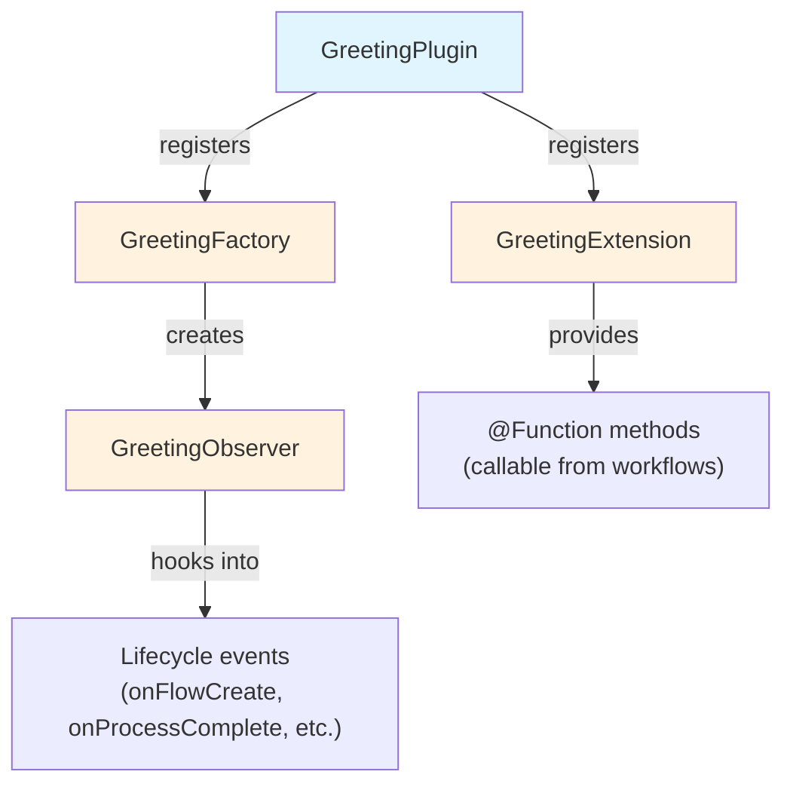

# भाग 2: एक Plugin प्रोजेक्ट बनाओ

<span class="ai-translation-notice">:material-information-outline:{ .ai-translation-notice-icon } AI-सहायता प्राप्त अनुवाद - [अधिक जानें और सुधार सुझाएं](https://github.com/nextflow-io/training/blob/master/TRANSLATING.md)</span>

तुमने देखा कि plugins Nextflow को reusable functionality के साथ कैसे extend करते हैं।
अब तुम अपना खुद का plugin बनाओगे, एक project template से शुरू करके जो build configuration तुम्हारे लिए handle करता है।

!!! tip "यहाँ से शुरू कर रहे हो?"

    अगर तुम इस भाग से जुड़ रहे हो, तो Part 1 का solution अपने starting point के रूप में copy करो:

    ```bash
    cp -r solutions/1-plugin-basics/* .
    ```

!!! info "आधिकारिक दस्तावेज़"

    यह section और इसके बाद वाले sections plugin development की ज़रूरी बातें cover करते हैं।
    विस्तृत जानकारी के लिए, [आधिकारिक Nextflow plugin development दस्तावेज़](https://www.nextflow.io/docs/latest/plugins/developing-plugins.html) देखो।

---

## 1. Plugin प्रोजेक्ट बनाओ

Built-in `nextflow plugin create` कमांड एक पूरा plugin project generate करता है:

```bash
nextflow plugin create nf-greeting training
```

```console title="Output"
Plugin created successfully at path: /workspaces/training/side-quests/plugin_development/nf-greeting
```

पहला argument plugin का नाम है, और दूसरा तुम्हारे organization का नाम है (generated code को folders में organize करने के लिए उपयोग होता है)।

!!! tip "मैन्युअल तरीके से बनाना"

    तुम plugin projects मैन्युअल रूप से भी बना सकते हो या GitHub पर [nf-hello template](https://github.com/nextflow-io/nf-hello) को starting point के रूप में उपयोग कर सकते हो।

---

## 2. प्रोजेक्ट की संरचना देखो

एक Nextflow plugin Groovy software का एक हिस्सा है जो Nextflow के अंदर चलता है।
यह well-defined integration points का उपयोग करके Nextflow की क्षमताओं को extend करता है, जिसका मतलब है कि यह Nextflow की features जैसे channels, processes, और configuration के साथ काम कर सकता है।

कोई भी code लिखने से पहले, देखो कि template ने क्या generate किया है ताकि तुम्हें पता हो कि चीज़ें कहाँ जाती हैं।

Plugin डायरेक्टरी में जाओ:

```bash
cd nf-greeting
```

Contents की list देखो:

```bash
tree
```

तुम्हें यह दिखना चाहिए:

```console
.
├── build.gradle
├── COPYING
├── gradle
│   └── wrapper
│       ├── gradle-wrapper.jar
│       └── gradle-wrapper.properties
├── gradlew
├── Makefile
├── README.md
├── settings.gradle
└── src
    ├── main
    │   └── groovy
    │       └── training
    │           └── plugin
    │               ├── GreetingExtension.groovy
    │               ├── GreetingFactory.groovy
    │               ├── GreetingObserver.groovy
    │               └── GreetingPlugin.groovy
    └── test
        └── groovy
            └── training
                └── plugin
                    └── GreetingObserverTest.groovy

11 directories, 13 files
```

---

## 3. Build Configuration को समझो

एक Nextflow plugin Java-based software है जिसे Nextflow उपयोग करने से पहले compile और package करना ज़रूरी है।
इसके लिए एक build tool की ज़रूरत होती है।

Gradle एक build tool है जो code compile करता है, tests चलाता है, और software package करता है।
Plugin template में एक Gradle wrapper (`./gradlew`) शामिल है ताकि तुम्हें Gradle अलग से install न करना पड़े।

Build configuration Gradle को बताती है कि तुम्हारे plugin को कैसे compile करना है और Nextflow को बताती है कि इसे कैसे load करना है।
दो फ़ाइलें सबसे ज़्यादा मायने रखती हैं।

### 3.1. settings.gradle

यह फ़ाइल project की पहचान करती है:

```bash
cat settings.gradle
```

```groovy title="settings.gradle"
rootProject.name = 'nf-greeting'
```

यहाँ का नाम उससे match करना चाहिए जो तुम plugin उपयोग करते समय `nextflow.config` में डालोगे।

### 3.2. build.gradle

Build फ़ाइल वह जगह है जहाँ ज़्यादातर configuration होती है:

```bash
cat build.gradle
```

फ़ाइल में कई sections हैं।
सबसे महत्वपूर्ण `nextflowPlugin` block है:

```groovy title="build.gradle"
plugins {
    id 'io.nextflow.nextflow-plugin' version '1.0.0-beta.10'
}

version = '0.1.0'

nextflowPlugin {
    nextflowVersion = '24.10.0'       // (1)!

    provider = 'training'             // (2)!
    className = 'training.plugin.GreetingPlugin'  // (3)!
    extensionPoints = [               // (4)!
        'training.plugin.GreetingExtension',
        'training.plugin.GreetingFactory'
    ]

}
```

1. **`nextflowVersion`**: न्यूनतम Nextflow version जो ज़रूरी है
2. **`provider`**: तुम्हारा नाम या organization
3. **`className`**: मुख्य plugin class, वह entry point जिसे Nextflow पहले load करता है
4. **`extensionPoints`**: वे classes जो Nextflow में features जोड़ती हैं (तुम्हारे functions, monitoring, आदि)

`nextflowPlugin` block configure करता है:

- `nextflowVersion`: न्यूनतम Nextflow version जो ज़रूरी है
- `provider`: तुम्हारा नाम या organization
- `className`: मुख्य plugin class (वह entry point जिसे Nextflow पहले load करता है, `build.gradle` में specified)
- `extensionPoints`: वे classes जो Nextflow में features जोड़ती हैं (तुम्हारे functions, monitoring, आदि)

### 3.3. nextflowVersion अपडेट करो

Template एक `nextflowVersion` value generate करता है जो पुरानी हो सकती है।
पूरी compatibility के लिए इसे अपने installed Nextflow version से match करने के लिए अपडेट करो:

=== "बाद में"

    ```groovy title="build.gradle" hl_lines="2"
    nextflowPlugin {
        nextflowVersion = '25.10.0'

        provider = 'training'
    ```

=== "पहले"

    ```groovy title="build.gradle" hl_lines="2"
    nextflowPlugin {
        nextflowVersion = '24.10.0'

        provider = 'training'
    ```

---

## 4. Source फ़ाइलों को जानो

Plugin का source code `src/main/groovy/training/plugin/` में रहता है।
चार source फ़ाइलें हैं, हर एक की एक अलग भूमिका है:

| फ़ाइल                      | भूमिका                                              | किस भाग में बदला जाता है |
| -------------------------- | --------------------------------------------------- | ------------------------ |
| `GreetingPlugin.groovy`    | Entry point जिसे Nextflow पहले load करता है         | कभी नहीं (generated)     |
| `GreetingExtension.groovy` | Workflows से callable functions define करता है      | भाग 3                    |
| `GreetingFactory.groovy`   | Workflow शुरू होने पर observer instances बनाता है   | भाग 5                    |
| `GreetingObserver.groovy`  | Workflow lifecycle events के जवाब में code चलाता है | भाग 5                    |

हर फ़ाइल को ऊपर listed भाग में विस्तार से introduce किया जाता है, जब तुम पहली बार उसे modify करते हो।
ध्यान रखने वाली मुख्य बातें:

- `GreetingPlugin` वह entry point है जिसे Nextflow load करता है
- `GreetingExtension` वे functions provide करता है जो यह plugin workflows को उपलब्ध कराता है
- `GreetingObserver` pipeline के साथ-साथ चलता है और events का जवाब देता है, बिना pipeline code में बदलाव किए



---

## 5. Build, Install, और Run करो

Template में शुरू से ही working code है, इसलिए तुम तुरंत build और run करके verify कर सकते हो कि project सही तरह से set up है।

Plugin को compile करो और locally install करो:

```bash
make install
```

`make install` plugin code को compile करता है और इसे तुम्हारी local Nextflow plugin डायरेक्टरी (`$NXF_HOME/plugins/`) में copy करता है, जिससे यह उपयोग के लिए उपलब्ध हो जाता है।

??? example "Build आउटपुट"

    पहली बार जब तुम यह चलाते हो, Gradle खुद को download करेगा (इसमें एक मिनट लग सकता है):

    ```console
    Downloading https://services.gradle.org/distributions/gradle-8.14-bin.zip
    ...10%...20%...30%...40%...50%...60%...70%...80%...90%...100%

    Welcome to Gradle 8.14!
    ...

    Deprecated Gradle features were used in this build...

    BUILD SUCCESSFUL in 23s
    5 actionable tasks: 5 executed
    ```

    **चेतावनियाँ expected हैं।**

    - **"Downloading gradle..."**: यह केवल पहली बार होता है। बाद के builds बहुत तेज़ होते हैं।
    - **"Deprecated Gradle features..."**: यह चेतावनी plugin template से आती है, तुम्हारे code से नहीं। इसे ignore करना safe है।
    - **"BUILD SUCCESSFUL"**: यही मायने रखता है। तुम्हारा plugin बिना errors के compile हुआ।

Pipeline डायरेक्टरी में वापस जाओ:

```bash
cd ..
```

`nextflow.config` में nf-greeting plugin जोड़ो:

=== "बाद में"

    ```groovy title="nextflow.config" hl_lines="4"
    // Plugin development exercises के लिए configuration
    plugins {
        id 'nf-schema@2.6.1'
        id 'nf-greeting@0.1.0'
    }
    ```

=== "पहले"

    ```groovy title="nextflow.config"
    // Plugin development exercises के लिए configuration
    plugins {
        id 'nf-schema@2.6.1'
    }
    ```

!!! note "Local plugins के लिए version ज़रूरी है"

    Locally installed plugins उपयोग करते समय, तुम्हें version specify करना होगा (जैसे, `nf-greeting@0.1.0`)।
    Registry में published plugins सिर्फ नाम से उपयोग किए जा सकते हैं।

Pipeline चलाओ:

```bash
nextflow run greet.nf -ansi-log false
```

`-ansi-log false` flag animated progress display को disable करता है ताकि सभी आउटपुट, observer messages सहित, क्रम में print हो।

```console title="Output"
Pipeline is starting! 🚀
[bc/f10449] Submitted process > SAY_HELLO (1)
[9a/f7bcb2] Submitted process > SAY_HELLO (2)
[6c/aff748] Submitted process > SAY_HELLO (3)
[de/8937ef] Submitted process > SAY_HELLO (4)
[98/c9a7d6] Submitted process > SAY_HELLO (5)
Output: Bonjour
Output: Hello
Output: Holà
Output: Ciao
Output: Hallo
Pipeline complete! 👋
```

(तुम्हारे आउटपुट का क्रम और work directory hashes अलग होंगे।)

"Pipeline is starting!" और "Pipeline complete!" messages Part 1 के nf-hello plugin से जानी-पहचानी लगती हैं, लेकिन इस बार वे तुम्हारे अपने plugin के `GreetingObserver` से आती हैं।
Pipeline खुद unchanged है; observer automatically चलता है क्योंकि यह factory में registered है।

---

## सारांश

तुमने सीखा कि:

- `nextflow plugin create` कमांड एक पूरा starter project generate करता है
- `build.gradle` plugin metadata, dependencies, और कौन सी classes features provide करती हैं, यह configure करता है
- Plugin के चार मुख्य components हैं: Plugin (entry point), Extension (functions), Factory (monitors बनाता है), और Observer (workflow events का जवाब देता है)
- Development cycle है: code edit करो, `make install` करो, pipeline चलाओ

---

## आगे क्या है?

अब तुम Extension class में custom functions implement करोगे और उन्हें workflow में उपयोग करोगे।

[भाग 3 पर जारी रखो :material-arrow-right:](03_custom_functions.md){ .md-button .md-button--primary }
